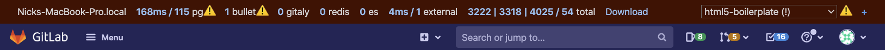

# Performance Bar **(FREE SELF)**

> The **Stats** field [introduced](https://gitlab.com/gitlab-org/gitlab/-/issues/271551) in GitLab 13.9.
> The **Memory** field [introduced](https://gitlab.com/gitlab-org/gitlab/-/issues/330736) in GitLab 14.0.

You can display the GitLab Performance Bar to see statistics for the performance
of a page. When activated, it looks as follows:

From left to right, it displays:

- **Current Host**: the current host serving the page.
- **Database queries**: the time taken (in milliseconds) and the total number
  of database queries, displayed in the format `00ms / 00 (00 cached) pg`. Click to display
  a modal window with more details.
- **Gitaly calls**: the time taken (in milliseconds) and the total number of
  [Gitaly](../../gitaly/index.md) calls. Click to display a modal window with more
  details.
- **Rugged calls**: the time taken (in milliseconds) and the total number of
  [Rugged](../../nfs.md#improving-nfs-performance-with-gitlab) calls.
  Click to display a modal window with more details.
- **Redis calls**: the time taken (in milliseconds) and the total number of
  Redis calls. Click to display a modal window with more details.
- **Elasticsearch calls**: the time taken (in milliseconds) and the total number of
  Elasticsearch calls. Click to display a modal window with more details.
- **External HTTP calls**: the time taken (in milliseconds) and the total
  number of external calls to other systems. Click to display a modal window
  with more details.
- **Load timings** of the page: if your browser supports load timings (Chromium
  and Chrome) several values in milliseconds, separated by slashes.
  Click to display a modal window with more details. The values, from left to right:
  - **Backend**: time needed for the base page to load.
  - [**First Contentful Paint**](https://web.dev/first-contentful-paint/):
    Time until something was visible to the user.
  - [**DomContentLoaded**](https://developers.google.com/web/fundamentals/performance/critical-rendering-path/measure-crp) Event.
  - **Total number of requests** the page loaded.
- **Memory**: the amount of memory consumed and objects allocated during the selected request.
  Select it to display a window with more details.
- **Trace**: if Jaeger is integrated, **Trace** links to a Jaeger tracing page
  with the current request's `correlation_id` included.
- **+**: a link to add a request's details to the performance bar. The request
  can be added by its full URL (authenticated as the current user), or by the value of
  its `X-Request-Id` header.
- **Download**: a link to download the raw JSON used to generate the Performance Bar reports.
- **Request Selector**: a select box displayed on the right-hand side of the
  Performance Bar which enables you to view these metrics for any requests made while
  the current page was open. Only the first two requests per unique URL are captured.
- **Stats** (optional): if the `GITLAB_PERFORMANCE_BAR_STATS_URL` environment variable is set,
  this URL is displayed in the bar. In GitLab 13.9 and later, used only in GitLab SaaS.

NOTE:
Not all indicators are available in all environments. For instance, the memory view
requires to run Ruby with [specific patches](https://gitlab.com/gitlab-org/gitlab-build-images/-/blob/master/patches/ruby/2.7.2/thread-memory-allocations-2.7.patch) applied.
When running GitLab locally using the GDK this is typically not the case and the memory view cannot be used.

## Request warnings

Requests that exceed predefined limits display a warning **{warning}** icon and
explanation next to the metric. In this example, the Gitaly call duration
exceeded the threshold.

If any requests on the current page generated warnings, the warning icon displays
next to the **Requests** selector menu. In this selector menu, an exclamation `(!)`
appears next to requests with warnings.

## Enable the Performance Bar via the Admin Area

The GitLab Performance Bar is disabled by default for non-administrators. To enable it
for a given group:

1. Sign in as a user with Administrator [permissions](../../../user/permissions.md).
1. On the top bar, select **Menu >** **{admin}** **Admin**.
1. On the left sidebar, select **Settings > Metrics and profiling**
   (`admin/application_settings/metrics_and_profiling`), and expand
   **Profiling - Performance bar**.
1. Click **Enable access to the Performance Bar**.
1. In the **Allowed group** field, provide the full path of the group allowed
   to access the GitLab Performance Bar.
1. Click **Save changes**.

## Keyboard shortcut for the Performance Bar

After enabling the GitLab Performance Bar, press the [<kbd>p</kbd> +
<kbd>b</kbd> keyboard shortcut](../../../user/shortcuts.md) to display it, and
again to hide it.
