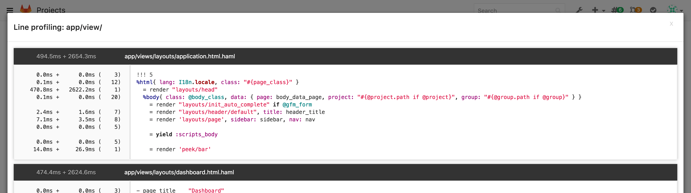

# Performance Bar

A Performance Bar can be displayed, to dig into the performance of a page. When
activated, it looks as follows:

It allows you to see (from left to right):

- the current host serving the page
- the timing of the page (backend, frontend)
- time taken and number of DB queries, click through for details of these queries

- time taken and number of [Gitaly] calls, click through for details of these calls

- profile of the code used to generate the page, line by line for either _all_, _app & lib_ , or _views_. In the profile view, the numbers in the left panel represent wall time, cpu time, and number of calls (based on [rblineprof](https://github.com/tmm1/rblineprof)).

- time taken and number of calls to Redis
- time taken and number of background jobs created by Sidekiq
- time taken and number of Ruby GC calls

## Enable the Performance Bar via the Admin panel

GitLab Performance Bar is disabled by default. To enable it for a given group,
navigate to the Admin area in **Settings > Profiling - Performance Bar**
(`/admin/application_settings`).

The only required setting you need to set is the full path of the group that
will be allowed to display the Performance Bar.
Make sure _Enable the Performance Bar_ is checked and hit
**Save** to save the changes.

Once the Performance Bar is enabled, you will need to press the [<kbd>p</kbd> +
<kbd>b</kbd> keyboard shortcut](../../../workflow/shortcuts.md) to actually
display it.

You can toggle the Bar using the same shortcut.

---

---

[Gitaly]: ../../gitaly/index.md
