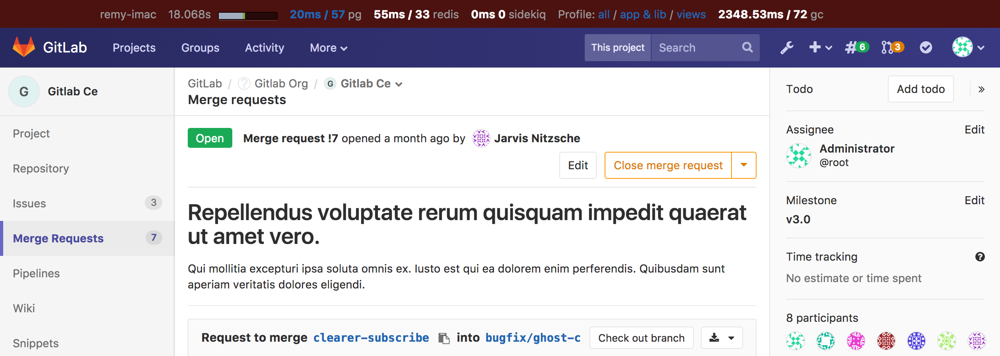
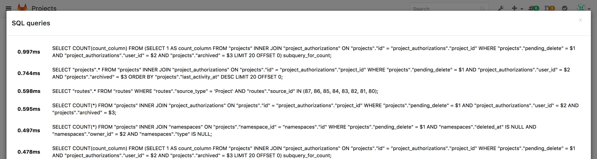
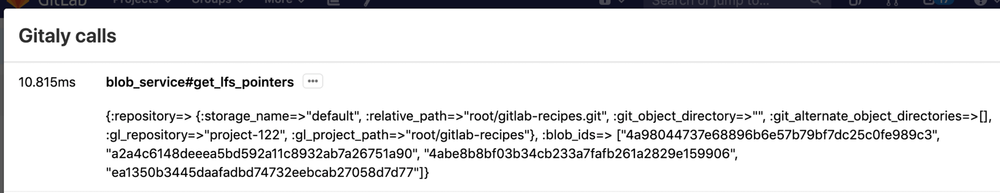
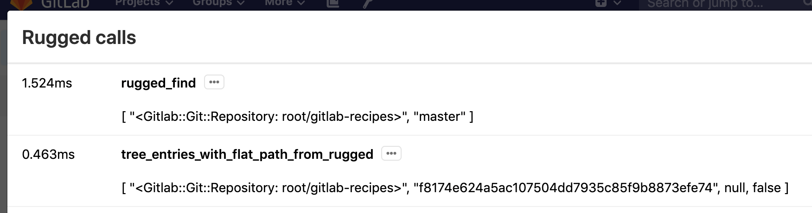
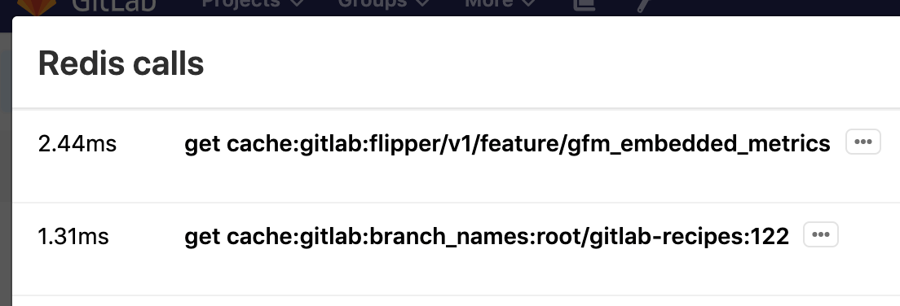
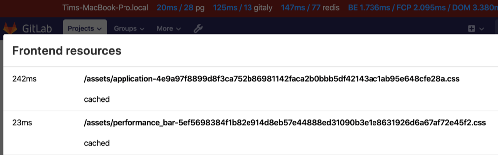
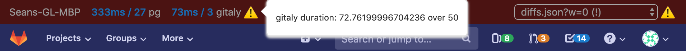
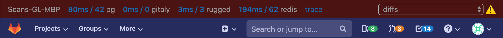
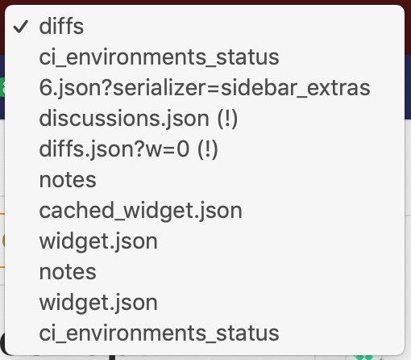
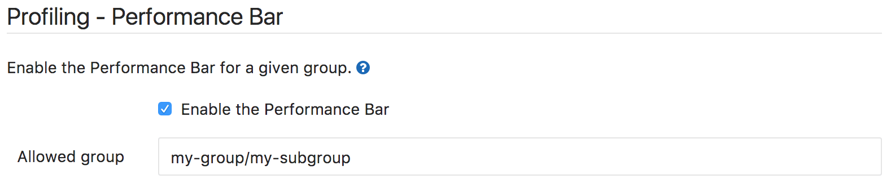

# Performance Bar

A Performance Bar can be displayed, to dig into the performance of a page. When
activated, it looks as follows:

It allows you to see (from left to right):

- the current host serving the page
- time taken and number of DB queries; click through for details of these queries
  
- time taken and number of [Gitaly] calls; click through for details of these calls
  
- time taken and number of [Rugged] calls; click through for details of these calls
  
- time taken and number of Redis calls; click through for details of these calls
  
- total load timings of the page; click through for details of these calls. Values in the following order:
  - Backend - Time that the actual base page took to load
  - [First Contentful Paint](https://developers.google.com/web/tools/lighthouse/audits/first-contentful-paint) - Time until something was visible to the user
  - [DomContentLoaded](https://developers.google.com/web/fundamentals/performance/critical-rendering-path/measure-crp) Event
  - Number of Requests that the page loaded
  
- a link to add a request's details to the performance bar; the request can be
  added by its full URL (authenticated as the current user), or by the value of
  its `X-Request-Id` header
- a link to download the raw JSON used to generate the Performance Bar reports

On the far right is a request selector that allows you to view the same metrics
(excluding the page timing and line profiler) for any requests made while the
page was open. Only the first two requests per unique URL are captured.

## Request warnings

For requests exceeding pre-defined limits, a warning icon will be shown
next to the failing metric, along with an explanation. In this example,
the Gitaly call duration exceeded the threshold:

If any requests on the current page generated warnings, the icon will
appear next to the request selector:

And requests with warnings are indicated in the request selector with a
`(!)` after their path:

## Enable the Performance Bar via the Admin panel

GitLab Performance Bar is disabled by default. To enable it for a given group,
navigate to the Admin area in **Settings > Metrics and Profiling > Profiling - Performance bar**
(`admin/application_settings/metrics_and_profiling`).

The only required setting you need to set is the full path of the group that
will be allowed to display the Performance Bar.
Make sure _Enable the Performance Bar_ is checked and hit
**Save** to save the changes.

Once the Performance Bar is enabled, you will need to press the [<kbd>p</kbd> +
<kbd>b</kbd> keyboard shortcut](../../../user/shortcuts.md) to actually
display it.

You can toggle the Bar using the same shortcut.

[Gitaly]: ../../gitaly/index.md
[Rugged]: ../../high_availability/nfs.md#improving-nfs-performance-with-gitlab
