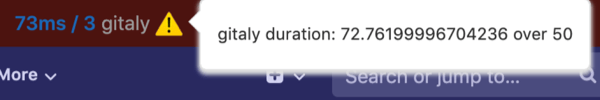

DETAILS:
**Tier:** Free, Premium, Ultimate
**Offering:** GitLab Self-Managed

You can display the performance bar to see statistics for the performance of a GitLab UI page.
For example:

## Available information

> - Rugged calls [removed](https://gitlab.com/gitlab-org/gitlab/-/issues/421591) in GitLab 16.6.

From left to right, the performance bar displays:

- **Current Host**: the current host serving the page.
- **Database queries**: the time taken (in milliseconds) and the total number
  of database queries, displayed in the format `00ms / 00 (00 cached) pg`. Select to display
  a dialog with more details. You can use this to see the following
  details for each query:
  - **In a transaction**: shows up below the query if it was executed in
    the context of a transaction
  - **Role**: shows up when [Database Load Balancing](../../postgresql/database_load_balancing.md)
    is enabled. It shows which server role was used for the query.
    "Primary" means that the query was sent to the read/write primary server.
    "Replica" means it was sent to a read-only replica.
  - **Configuration name**: this is
    used to distinguish between different databases configured for different
    GitLab features. The name shown is the same name used to configure database
    connections in GitLab.
- **Gitaly calls**: the time taken (in milliseconds) and the total number of
  [Gitaly](../../gitaly/_index.md) calls. Select to display a modal window with more
  details.
- **Redis calls**: the time taken (in milliseconds) and the total number of
  Redis calls. Select to display a modal window with more details.
- **Elasticsearch calls**: the time taken (in milliseconds) and the total number of
  Elasticsearch calls. Select to display a modal window with more details.
- **External HTTP calls**: the time taken (in milliseconds) and the total
  number of external calls to other systems. Select to display a modal window
  with more details.
- **Load timings** of the page: if your browser supports load timings, several
  values in milliseconds, separated by slashes.
  Select to display a modal window with more details. The values, from left to right:
  - **Backend**: time needed for the base page to load.
  - [**First Contentful Paint**](https://developer.chrome.com/docs/lighthouse/performance/first-contentful-paint/):
    Time until something was visible to the user. Displays `NaN` if your browser does not
    support this feature.
  - [**DomContentLoaded**](https://web.dev/articles/critical-rendering-path/measure-crp) Event.
  - **Total number of requests** the page loaded.
- **Memory**: the amount of memory consumed and objects allocated during the selected request.
  Select it to display a window with more details.
- **Trace**: if Jaeger is integrated, **Trace** links to a Jaeger tracing page
  with the current request's `correlation_id` included.
- **+**: a link to add a request's details to the performance bar. The request
  can be added by its full URL (authenticated as the current user), or by the value of
  its `X-Request-Id` header.
- **Download**: a link to download the raw JSON used to generate the Performance Bar reports.
- **Memory Report**: a link that generates a
  [memory profiling](../../../development/performance.md#using-memory-profiler)
  report of the current URL.
- **Flamegraph** with mode: a link to generate a [flamegraph](../../../development/profiling.md#speedscope-flamegraphs)
  of the current URL with the selected [Stackprof mode](https://github.com/tmm1/stackprof#sampling):
  - The **Wall** mode samples every *interval* of the time on a clock on a wall. The interval is set to `10100` microseconds.
  - The **CPU** mode samples every *interval* of CPU activity. The interval is set to `10100` microseconds.
  - The **Object** mode samples every *interval*. The interval is set to `100` allocations.
- **Request Selector**: a select box displayed on the right-hand side of the
  Performance Bar which enables you to view these metrics for any requests made while
  the current page was open. Only the first two requests per unique URL are captured.
- **Stats** (optional): if the `GITLAB_PERFORMANCE_BAR_STATS_URL` environment variable is set,
  this URL is displayed in the bar. Used only on GitLab.com.

NOTE:
Not all indicators are available in all environments. For instance, the memory view
requires running Ruby with [specific patches](https://gitlab.com/gitlab-org/gitlab-build-images/-/blob/master/patches/ruby/2.7.4/thread-memory-allocations-2.7.patch)
applied. When running GitLab locally using the [GDK](https://gitlab.com/gitlab-org/gitlab-development-kit),
this is typically not the case and the memory view cannot be used.

## Keyboard shortcut

Press the [<kbd>p</kbd> + <kbd>b</kbd> keyboard shortcut](../../../user/shortcuts.md) to display
the performance bar, and again to hide it.

For non-administrators to display the performance bar, it must be
[enabled for them](#enable-the-performance-bar-for-non-administrators).

## Request warnings

Requests that exceed predefined limits display a warning **{warning}** icon and
explanation next to the metric. In this example, the Gitaly call duration
exceeded the threshold.

## Enable the performance bar for non-administrators

The performance bar is disabled by default for non-administrators. To enable it
for a given group:

1. Sign in as a user with administrator access.
1. On the left sidebar, at the bottom, select **Admin**.
1. Select **Settings > Metrics and profiling**.
1. Expand **Profiling - Performance bar**.
1. Select **Allow non-administrators access to the performance bar**.
1. In the **Allow access to members of the following group** field, provide the full path of the
   group allowed to access the performance.
1. Select **Save changes**.
