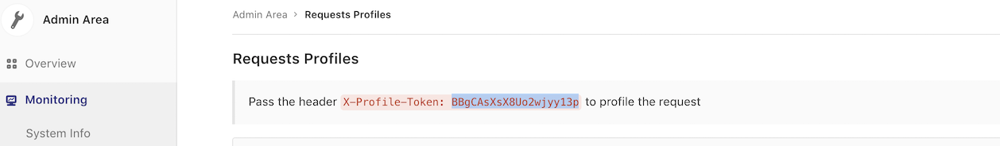

# Request Profiling

## Procedure

1. Grab the profiling token from **Monitoring > Requests Profiles** admin page
  (highlighted in a blue in the image below).
  
1. Pass the header `X-Profile-Token: <token>` and `X-Profile-Mode: <mode>`(where `<mode>` can be `execution` or `memory`) to the request you want to profile. You can use:
    - Browser extensions. For example, [ModHeader](https://chrome.google.com/webstore/detail/modheader/idgpnmonknjnojddfkpgkljpfnnfcklj) Chrome extension.
    - `curl`. For example, `curl --header 'X-Profile-Token: <token>' --header 'X-Profile-Mode: <mode>' https://gitlab.example.com/group/project`.
1. Once request is finished (which will take a little longer than usual), you can
  view the profiling output from **Monitoring > Requests Profiles** admin page.
  

## Cleaning up

Profiling output will be cleared out every day via a Sidekiq worker.
