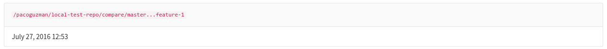

# Request Profiling **(FREE SELF)**

To profile a request:

1. Sign in to GitLab as an Administrator or a user with the [Maintainer role](../../../user/permissions.md).
1. In the navigation bar, click **Admin area**.
1. Go to **Monitoring > Requests Profiles**.
1. In the **Requests Profiles** section, copy the token.
1. Pass the headers `X-Profile-Token: <token>` and `X-Profile-Mode: <mode>`(where
   `<mode>` can be `execution` or `memory`) to the request you want to profile. When
   passing headers, you can use:

   - Browser extensions such as the
     [ModHeader](https://chrome.google.com/webstore/detail/modheader/idgpnmonknjnojddfkpgkljpfnnfcklj)
     Chrome extension.
   - `curl`. For example:

     ```shell
     curl --header 'X-Profile-Token: <token>' --header 'X-Profile-Mode: <mode>' "https://gitlab.example.com/group/project"
     ```

     Profiled requests can take longer than usual.

After the request completes, you can view the profiling output from the
**Monitoring > Requests Profiles** administration page:



## Cleaning up profiled requests

The output from profiled requests is cleared out once each day through a
Sidekiq worker.
