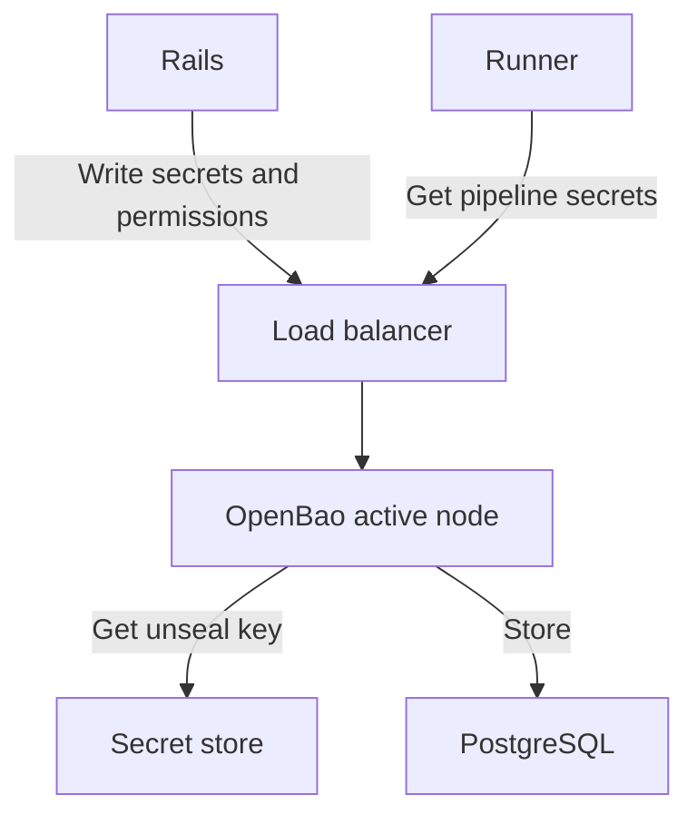



- Tier: Ultimate
- Offering: GitLab Self-Managed
- Status: Experiment





- [Introduced](https://gitlab.com/groups/gitlab-org/-/work_items/16319) in GitLab 18.8 as an experiment, made available to some initial testers in a closed [beta](../../policy/development_stages_support.md#beta) in GitLab 18.8.



The [GitLab Secrets Manager](../../ci/secrets/secrets_manager/_index.md) uses [OpenBao](https://openbao.org/),
an open-source secrets management solution. OpenBao provides secure storage, access control, and lifecycle management
for secrets used in your GitLab instance.

## OpenBao architecture

OpenBao integrates with GitLab as an optional component that runs in parallel to existing GitLab services.

- The Rails backend and runners connect to the OpenBao API through a load balancer.
- OpenBao stores data in PostgreSQL.
  The Helm chart configures OpenBao to store data in the main GitLab database by default.
- OpenBao gets the unseal key from a secret store.
- OpenBao reads the unseal key from a Kubernetes secret mounted by the Helm chart.
- OpenBao posts audit logs to the Rails backend when audit logs are enabled.

OpenBao runs with a single active node that handles all requests,
and optionally multiple standby nodes that take over if the active node fails.

## Install OpenBao

Prerequisites:

- You must have administrator access to the instance.
- You must be running GitLab 18.8 or later.
- You must have a Kubernetes cluster.

To install OpenBao, use the [OpenBao Helm chart for Kubernetes deployments](https://docs.gitlab.com/charts/charts/openbao/).

After installation, verify that OpenBao is working by following the [GitLab Secrets Manager user documentation](../../ci/secrets/secrets_manager/_index.md)
to test secret operations.

OpenBao resource requirements depend on your GitLab instance size and secret usage patterns.

Monitor your deployment and adjust resources as needed based on actual usage patterns.

### CPU requirements

OpenBao CPU usage is primarily driven by:

- How often CI/CD jobs fetch secrets.
- How often the Secrets Manager is accessed through the GitLab UI.

Recommended number of CPU cores:

| Deployment Size | Fetch frequency       | CPU Cores |
|-----------------|-----------------------|-----------|
| Small           | Less than 100 ops/sec | 1 core    |
| Medium          | 100 to 200 ops/sec    | 1-2 cores |
| Large           | More than 200 ops/sec | 2+ cores  |

For example, testing a deployment with 100,000 secrets corresponded to 139 fetch operations per second.
This assumes each secret is fetched by a CI/CD job approximately every 12 minutes,
and OpenBao makes full use of its memory cache.

### Memory requirements

OpenBao memory usage primarily depends on the number of projects
where GitLab Secrets Manager is enabled.
You should allocate at least 1 GB of memory per 200 projects,
plus a safety margin of 1 GB.

Recommended memory allocation:

| Deployment Size | Number of Projects | Memory |
|-----------------|--------------------|--------|
| Small           | Less than 200      | 2 GB   |
| Medium          | 400 to 800         | 5 GB   |
| Large           | More than 1,000    | 6+ GB  |

#### Storage requirements

Storage requirements for the PostgreSQL database depends primarily on the number of secrets.
It takes about 13 KB to store a single version of a secret and the corresponding metadata.

Usage example:

- 100,000 secrets = ~1.5 GB
- 200,000 secrets = ~3 GB

## Backup and restore

OpenBao data is stored in PostgreSQL and should be included in your regular GitLab backup procedures.

For detailed backup and restore procedures specific to OpenBao, see the [OpenBao backup documentation](https://docs.gitlab.com/charts/charts/openbao/#back-up-openbao).

## High availability

For production deployments, consider:

- Running multiple OpenBao replicas for redundancy
- Using a highly available PostgreSQL backend
- Implementing proper monitoring and alerting

## Health check and monitoring

OpenBao provides health check endpoints for monitoring:

- `openbao.example.com/v1/sys/health`: Returns the health status of OpenBao
- `openbao.example.com/v1/sys/seal-status`: Returns the seal status

You can integrate these endpoints with your monitoring system.

## Performance issues

If you experience slow secret operations:

- Check OpenBao resource usage (CPU, memory)
- Verify PostgreSQL backend performance
- Check network latency between OpenBao and its PostgreSQL backend
