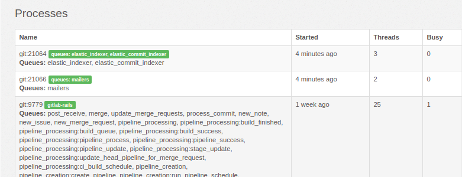

# Extra Sidekiq processes **(STARTER ONLY)**

NOTE: **Note:**
The information in this page applies only to Omnibus GitLab.

GitLab Starter allows one to start an extra set of Sidekiq processes
besides the default one. These processes can be used to consume a dedicated set
of queues. This can be used to ensure certain queues always have dedicated
workers, no matter the number of jobs that need to be processed.

## Available Sidekiq queues

For a list of the existing Sidekiq queues, check the following files:

- [Queues for both GitLab Community and Enterprise Editions](https://gitlab.com/gitlab-org/gitlab/blob/master/app/workers/all_queues.yml)
- [Queues for GitLab Enterprise Editions only](https://gitlab.com/gitlab-org/gitlab/blob/master/ee/app/workers/all_queues.yml)

Each entry in the above files represents a queue on which extra Sidekiq processes
can be started.

## Starting extra processes

To start extra Sidekiq processes, you must enable `sidekiq-cluster`:

1. Edit `/etc/gitlab/gitlab.rb` and add:

   ```ruby
   sidekiq_cluster['enable'] = true
   ```

1. You will then need to specify how many additional processes to create via `sidekiq-cluster`
   and which queue they should handle via the `sidekiq_cluster['queue_groups']`
   array setting. Each item in the array equates to one additional Sidekiq
   process, and values in each item determine the queues it works on.

   For example, the following setting adds additional Sidekiq processes to two
   queues, one to `elastic_indexer` and one to `mailers`:

   ```ruby
   sidekiq_cluster['queue_groups'] = [
     "elastic_indexer",
     "mailers"
   ]
   ```

   To have an additional Sidekiq process handle multiple queues, add multiple
   queue names to its item delimited by commas. For example:

   ```ruby
   sidekiq_cluster['queue_groups'] = [
     "elastic_indexer, elastic_commit_indexer",
     "mailers"
   ]
   ```

1. Save the file and reconfigure GitLab for the changes to take effect:

   ```sh
   sudo gitlab-ctl reconfigure
   ```

Once the extra Sidekiq processes are added, you can visit the
**Admin Area > Monitoring > Background Jobs** (`/admin/background_jobs`) in GitLab.



## Negating settings

To have the additional Sidekiq processes work on every queue **except** the ones
you list:

1. After you follow the steps for [starting extra processes](#starting-extra-processes),
   edit `/etc/gitlab/gitlab.rb` and add:

   ```ruby
   sidekiq_cluster['negate'] = true
   ```

1. Save the file and reconfigure GitLab for the changes to take effect:

   ```sh
   sudo gitlab-ctl reconfigure
   ```

## Ignore all GitHub import queues

When [importing from GitHub](../../user/project/import/github.md), Sidekiq might
use all of its resources to perform those operations. To set up a separate
`sidekiq-cluster` process to ignore all GitHub import-related queues:

1. Edit `/etc/gitlab/gitlab.rb` and add:

   ```ruby
   sidekiq_cluster['enable'] = true
   sidekiq_cluster['negate'] = true
   sidekiq_cluster['queue_groups'] = [
     "github_import_advance_stage",
     "github_importer:github_import_import_diff_note",
     "github_importer:github_import_import_issue",
     "github_importer:github_import_import_note",
     "github_importer:github_import_import_lfs_object",
     "github_importer:github_import_import_pull_request",
     "github_importer:github_import_refresh_import_jid",
     "github_importer:github_import_stage_finish_import",
     "github_importer:github_import_stage_import_base_data",
     "github_importer:github_import_stage_import_issues_and_diff_notes",
     "github_importer:github_import_stage_import_notes",
     "github_importer:github_import_stage_import_lfs_objects",
     "github_importer:github_import_stage_import_pull_requests",
     "github_importer:github_import_stage_import_repository"
   ]
   ```

1. Save the file and reconfigure GitLab for the changes to take effect:

   ```sh
   sudo gitlab-ctl reconfigure
   ```

## Number of threads

Each process defined under `sidekiq_cluster` starts with a
number of threads that equals the number of queues, plus one spare thread.
For example, a process that handles the `process_commit` and `post_receive`
queues will use three threads in total.

## Limiting concurrency

To limit the concurrency of the Sidekiq process:

1. Edit `/etc/gitlab/gitlab.rb` and add:

   ```ruby
   sidekiq['concurrency'] = 25
   ```

1. Save the file and reconfigure GitLab for the changes to take effect:

   ```sh
   sudo gitlab-ctl reconfigure
   ```

To limit the max concurrency of the Sidekiq cluster processes:

1. Edit `/etc/gitlab/gitlab.rb` and add:

   ```ruby
   sidekiq_cluster['max_concurrency'] = 25
   ```

1. Save the file and reconfigure GitLab for the changes to take effect:

   ```sh
   sudo gitlab-ctl reconfigure
   ```

For each queue group, the concurrency factor will be set to `min(number of queues, N)`.
Setting the value to 0 will disable the limit. Keep in mind this normally would
not exceed the number of CPU cores available.

Each thread requires a Redis connection, so adding threads may
increase Redis latency and potentially cause client timeouts. See the [Sidekiq
documentation about Redis](https://github.com/mperham/sidekiq/wiki/Using-Redis)
for more details.

## Modifying the check interval

To modify the check interval for the additional Sidekiq processes:

1. Edit `/etc/gitlab/gitlab.rb` and add:

   ```ruby
   sidekiq_cluster['interval'] = 5
   ```

1. Save the file and [reconfigure GitLab](../restart_gitlab.md#omnibus-gitlab-reconfigure) for the changes to take effect.

This tells the additional processes how often to check for enqueued jobs.

## Troubleshooting using the CLI

CAUTION: **Warning:**
It's recommended to use `/etc/gitlab/gitlab.rb` to configure the Sidekiq processes.
If you experience a problem, you should contact GitLab support. Use the command
line at your own risk.

For debugging purposes, you can start extra Sidekiq processes by using the command
`/opt/gitlab/embedded/service/gitlab-rails/ee/bin/sidekiq-cluster`. This command
takes arguments using the following syntax:

```bash
/opt/gitlab/embedded/service/gitlab-rails/ee/bin/sidekiq-cluster [QUEUE,QUEUE,...] [QUEUE, ...]
```

Each separate argument denotes a group of queues that have to be processed by a
Sidekiq process. Multiple queues can be processed by the same process by
separating them with a comma instead of a space.

Instead of a queue, a queue namespace can also be provided, to have the process
automatically listen on all queues in that namespace without needing to
explicitly list all the queue names. For more information about queue namespaces,
see the relevant section in the
[Sidekiq style guide](../../development/sidekiq_style_guide.md#queue-namespaces).

For example, say you want to start 2 extra processes: one to process the
`process_commit` queue, and one to process the `post_receive` queue. This can be
done as follows:

```bash
/opt/gitlab/embedded/service/gitlab-rails/ee/bin/sidekiq-cluster process_commit post_receive
```

If you instead want to start one process processing both queues, you'd use the
following syntax:

```bash
/opt/gitlab/embedded/service/gitlab-rails/ee/bin/sidekiq-cluster process_commit,post_receive
```

If you want to have one Sidekiq process dealing with the `process_commit` and
`post_receive` queues, and one process to process the `gitlab_shell` queue,
you'd use the following:

```bash
/opt/gitlab/embedded/service/gitlab-rails/ee/bin/sidekiq-cluster process_commit,post_receive gitlab_shell
```

### Monitoring the `sidekiq-cluster` command

The `sidekiq-cluster` command will not terminate once it has started the desired
amount of Sidekiq processes. Instead, the process will continue running and
forward any signals to the child processes. This makes it easy to stop all
Sidekiq processes as you simply send a signal to the `sidekiq-cluster` process,
instead of having to send it to the individual processes.

If the `sidekiq-cluster` process crashes or receives a `SIGKILL`, the child
processes will terminate themselves after a few seconds. This ensures you don't
end up with zombie Sidekiq processes.

All of this makes monitoring the processes fairly easy. Simply hook up
`sidekiq-cluster` to your supervisor of choice (e.g. runit) and you're good to
go.

If a child process died the `sidekiq-cluster` command will signal all remaining
process to terminate, then terminate itself. This removes the need for
`sidekiq-cluster` to re-implement complex process monitoring/restarting code.
Instead you should make sure your supervisor restarts the `sidekiq-cluster`
process whenever necessary.

### PID files

The `sidekiq-cluster` command can store its PID in a file. By default no PID
file is written, but this can be changed by passing the `--pidfile` option to
`sidekiq-cluster`. For example:

```bash
/opt/gitlab/embedded/service/gitlab-rails/ee/bin/sidekiq-cluster --pidfile /var/run/gitlab/sidekiq_cluster.pid process_commit
```

Keep in mind that the PID file will contain the PID of the `sidekiq-cluster`
command and not the PID(s) of the started Sidekiq processes.

### Environment

The Rails environment can be set by passing the `--environment` flag to the
`sidekiq-cluster` command, or by setting `RAILS_ENV` to a non-empty value. The
default value can be found in `/opt/gitlab/etc/gitlab-rails/env/RAILS_ENV`.

### Using negation

You're able to run all queues in `sidekiq_queues.yml` file on a single or
multiple processes with exceptions using the `--negate` flag.

For example, say you want to run a single process for all queues,
except `process_commit` and `post_receive`:

```bash
/opt/gitlab/embedded/service/gitlab-rails/ee/bin/sidekiq-cluster process_commit,post_receive --negate
```

For multiple processes of all queues (except `process_commit` and `post_receive`):

```bash
/opt/gitlab/embedded/service/gitlab-rails/ee/bin/sidekiq-cluster process_commit,post_receive process_commit,post_receive --negate
```

### Limiting concurrency

By default, `sidekiq-cluster` will spin up extra Sidekiq processes that use
one thread per queue up to a maximum of 50. If you wish to change the cap, use
the `-m N` option. For example, this would cap the maximum number of threads to 1:

```bash
/opt/gitlab/embedded/service/gitlab-rails/ee/bin/sidekiq-cluster process_commit,post_receive -m 1
```
