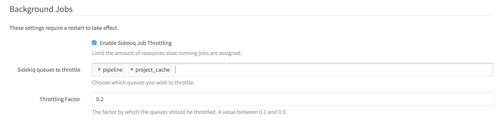

# Sidekiq Job throttling

> Note: Introduced with GitLab 8.14

When your GitLab installation needs to handle tens of thousands of background
jobs, it can be convenient to prioritize queues that need to be executed
immediately, e.g. user initiated actions like merging a Merge Request.

In order to accomplish this, you can limit the amount of workers that certain
slow running queues get can have available. This is what we call Sidekiq Job
Throttling. Depending on your infrastructure, you might have different slow
running queues, which is why you can choose which queues to throttle and by
how much you want to throttle them.

These settings are available in the Application Settings of your GitLab
installation.



The throttle factor determines the maximum number of workers a queue can run on.
This value gets multiplied by `:concurrency` value set in the Sidekiq settings
and rounded up to the closest full integer.

So, for example, you set the `:concurrency` to 25 and the `Throttling factor` to
0.1, the maximum workers assigned to the selected queues would be 3.

```
limit = (factor * Sidekiq.options[:concurrency]).ceil
```

After enabling the job throttling, you will need to restart your GitLab
instance, in order for the changes to take effect.