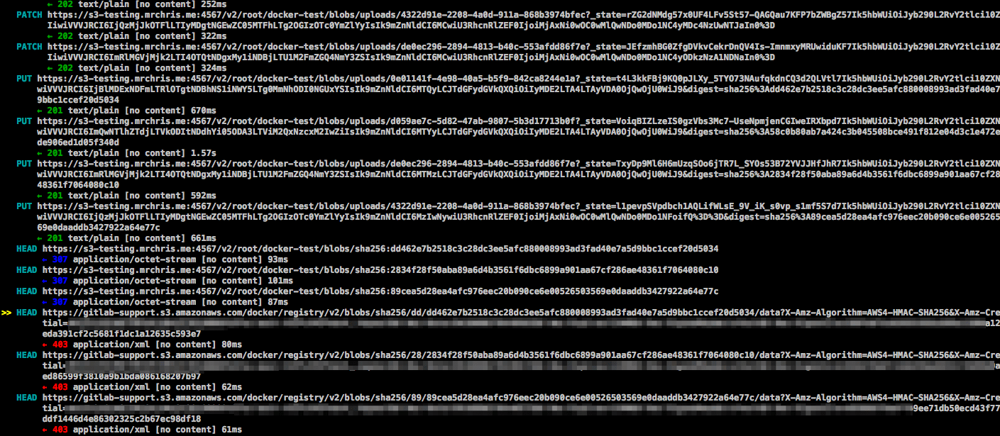

# GitLab Container Registry administration **(FREE SELF)**

With the GitLab Container Registry, every project can have its
own space to store Docker images.

Read more about the Docker Registry in [the Docker documentation](https://docs.docker.com/registry/introduction/).

This document is the administrator's guide. To learn how to use the GitLab Container
Registry, see the [user documentation](../../user/packages/container_registry/index.md).

## Enable the Container Registry

**Omnibus GitLab installations**

If you installed GitLab by using the Omnibus installation package, the Container Registry
may or may not be available by default.

The Container Registry is automatically enabled and available on your GitLab domain, port 5050 if:

- You're using the built-in [Let's Encrypt integration](https://docs.gitlab.com/omnibus/settings/ssl.html#lets-encrypt-integration), and
- You're using GitLab 12.5 or later.

Otherwise, the Container Registry is not enabled. To enable it:

- You can configure it for your [GitLab domain](#configure-container-registry-under-an-existing-gitlab-domain), or
- You can configure it for [a different domain](#configure-container-registry-under-its-own-domain).

The Container Registry works under HTTPS by default. You can use HTTP
but it's not recommended and is beyond the scope of this document.
Read the [insecure Registry documentation](https://docs.docker.com/registry/insecure/)
if you want to implement this.

**Installations from source**

If you have installed GitLab from source:

1. You must [install Registry](https://docs.docker.com/registry/deploying/) by yourself.
1. After the installation is complete, to enable it, you must configure the Registry's
   settings in `gitlab.yml`.
1. Use the sample NGINX configuration file from under
   [`lib/support/nginx/registry-ssl`](https://gitlab.com/gitlab-org/gitlab/-/blob/master/lib/support/nginx/registry-ssl) and edit it to match the
   `host`, `port`, and TLS certificate paths.

The contents of `gitlab.yml` are:

```yaml
registry:
  enabled: true
  host: registry.gitlab.example.com
  port: 5005
  api_url: http://localhost:5000/
  key: config/registry.key
  path: shared/registry
  issuer: gitlab-issuer
```

Where:

| Parameter | Description |
| --------- | ----------- |
| `enabled` | `true` or `false`. Enables the Registry in GitLab. By default this is `false`. |
| `host`    | The host URL under which the Registry runs and users can use. |
| `port`    | The port the external Registry domain listens on. |
| `api_url` | The internal API URL under which the Registry is exposed. It defaults to `http://localhost:5000`. Do not change this unless you are setting up an [external Docker registry](#use-an-external-container-registry-with-gitlab-as-an-auth-endpoint). |
| `key`     | The private key location that is a pair of Registry's `rootcertbundle`. Read the [token auth configuration documentation](https://docs.docker.com/registry/configuration/#token). |
| `path`    | This should be the same directory like specified in Registry's `rootdirectory`. Read the [storage configuration documentation](https://docs.docker.com/registry/configuration/#storage). This path needs to be readable by the GitLab user, the web-server user and the Registry user. Read more in [#configure-storage-for-the-container-registry](#configure-storage-for-the-container-registry). |
| `issuer`  | This should be the same value as configured in Registry's `issuer`. Read the [token auth configuration documentation](https://docs.docker.com/registry/configuration/#token). |

A Registry init file is not shipped with GitLab if you install it from source.
Hence, [restarting GitLab](../restart_gitlab.md#installations-from-source) does not restart the Registry should
you modify its settings. Read the upstream documentation on how to achieve that.

At the **absolute** minimum, make sure your [Registry configuration](https://docs.docker.com/registry/configuration/#auth)
has `container_registry` as the service and `https://gitlab.example.com/jwt/auth`
as the realm:

```yaml
auth:
  token:
    realm: https://gitlab.example.com/jwt/auth
    service: container_registry
    issuer: gitlab-issuer
    rootcertbundle: /root/certs/certbundle
```

WARNING:
If `auth` is not set up, users can pull Docker images without authentication.

## Container Registry domain configuration

There are two ways you can configure the Registry's external domain. Either:

- [Use the existing GitLab domain](#configure-container-registry-under-an-existing-gitlab-domain).
  The Registry listens on a port and reuses the TLS certificate from GitLab.
- [Use a completely separate domain](#configure-container-registry-under-its-own-domain) with a new TLS certificate
  for that domain.

Because the Container Registry requires a TLS certificate, cost may be a factor.

Take this into consideration before configuring the Container Registry
for the first time.

### Configure Container Registry under an existing GitLab domain

If the Registry is configured to use the existing GitLab domain, you can
expose the Registry on a port. This way you can reuse the existing GitLab TLS
certificate.

If the GitLab domain is `https://gitlab.example.com` and the port to the outside world is `5050`, here is what you need to set
in `gitlab.rb` or `gitlab.yml` if you are using Omnibus GitLab or installed
GitLab from source respectively.

Ensure you choose a port different than the one that Registry listens to (`5000` by default),
otherwise conflicts occur.

**Omnibus GitLab installations**

1. Your `/etc/gitlab/gitlab.rb` should contain the Registry URL as well as the
   path to the existing TLS certificate and key used by GitLab:

   ```ruby
   registry_external_url 'https://gitlab.example.com:5050'
   ```

   The `registry_external_url` is listening on HTTPS under the
   existing GitLab URL, but on a different port.

   If your TLS certificate is not in `/etc/gitlab/ssl/gitlab.example.com.crt`
   and key not in `/etc/gitlab/ssl/gitlab.example.com.key` uncomment the lines
   below:

   ```ruby
   registry_nginx['ssl_certificate'] = "/path/to/certificate.pem"
   registry_nginx['ssl_certificate_key'] = "/path/to/certificate.key"
   ```

1. Save the file and [reconfigure GitLab](../restart_gitlab.md#omnibus-gitlab-reconfigure)
   for the changes to take effect.

1. Validate using:

   ```shell
   openssl s_client -showcerts -servername gitlab.example.com -connect gitlab.example.com:5050 > cacert.pem
   ```

If your certificate provider provides the CA Bundle certificates, append them to the TLS certificate file.

**Installations from source**

1. Open `/home/git/gitlab/config/gitlab.yml`, find the `registry` entry and
   configure it with the following settings:

   ```yaml
   registry:
     enabled: true
     host: gitlab.example.com
     port: 5050
   ```

1. Save the file and [restart GitLab](../restart_gitlab.md#installations-from-source) for the changes to take effect.
1. Make the relevant changes in NGINX as well (domain, port, TLS certificates path).

Users should now be able to sign in to the Container Registry with their GitLab
credentials using:

```shell
docker login gitlab.example.com:5050
```

### Configure Container Registry under its own domain

When the Registry is configured to use its own domain, you need a TLS
certificate for that specific domain (for example, `registry.example.com`). You might need
a wildcard certificate if hosted under a subdomain of your existing GitLab
domain, for example, `registry.gitlab.example.com`.

As well as manually generated SSL certificates (explained here), certificates automatically
generated by Let's Encrypt are also [supported in Omnibus installs](https://docs.gitlab.com/omnibus/settings/ssl.html#host-services).

Let's assume that you want the container Registry to be accessible at
`https://registry.gitlab.example.com`.

**Omnibus GitLab installations**

1. Place your TLS certificate and key in
   `/etc/gitlab/ssl/registry.gitlab.example.com.crt` and
   `/etc/gitlab/ssl/registry.gitlab.example.com.key` and make sure they have
   correct permissions:

   ```shell
   chmod 600 /etc/gitlab/ssl/registry.gitlab.example.com.*
   ```

1. After the TLS certificate is in place, edit `/etc/gitlab/gitlab.rb` with:

   ```ruby
   registry_external_url 'https://registry.gitlab.example.com'
   ```

   The `registry_external_url` is listening on HTTPS.

1. Save the file and [reconfigure GitLab](../restart_gitlab.md#omnibus-gitlab-reconfigure) for the changes to take effect.

If you have a [wildcard certificate](https://en.wikipedia.org/wiki/Wildcard_certificate), you must specify the path to the
certificate in addition to the URL, in this case `/etc/gitlab/gitlab.rb`
looks like:

```ruby
registry_nginx['ssl_certificate'] = "/etc/gitlab/ssl/certificate.pem"
registry_nginx['ssl_certificate_key'] = "/etc/gitlab/ssl/certificate.key"
```

**Installations from source**

1. Open `/home/git/gitlab/config/gitlab.yml`, find the `registry` entry and
   configure it with the following settings:

   ```yaml
   registry:
     enabled: true
     host: registry.gitlab.example.com
   ```

1. Save the file and [restart GitLab](../restart_gitlab.md#installations-from-source) for the changes to take effect.
1. Make the relevant changes in NGINX as well (domain, port, TLS certificates path).

Users should now be able to sign in to the Container Registry using their GitLab
credentials:

```shell
docker login registry.gitlab.example.com
```

## Disable Container Registry site-wide

When you disable the Registry by following these steps, you do not
remove any existing Docker images. This is handled by the
Registry application itself.

**Omnibus GitLab**

1. Open `/etc/gitlab/gitlab.rb` and set `registry['enable']` to `false`:

   ```ruby
   registry['enable'] = false
   ```

1. Save the file and [reconfigure GitLab](../restart_gitlab.md#omnibus-gitlab-reconfigure) for the changes to take effect.

**Installations from source**

1. Open `/home/git/gitlab/config/gitlab.yml`, find the `registry` entry and
   set `enabled` to `false`:

   ```yaml
   registry:
     enabled: false
   ```

1. Save the file and [restart GitLab](../restart_gitlab.md#installations-from-source) for the changes to take effect.

## Disable Container Registry for new projects site-wide

If the Container Registry is enabled, then it should be available on all new
projects. To disable this function and let the owners of a project to enable
the Container Registry by themselves, follow the steps below.

**Omnibus GitLab installations**

1. Edit `/etc/gitlab/gitlab.rb` and add the following line:

   ```ruby
   gitlab_rails['gitlab_default_projects_features_container_registry'] = false
   ```

1. Save the file and [reconfigure GitLab](../restart_gitlab.md#omnibus-gitlab-reconfigure) for the changes to take effect.

**Installations from source**

1. Open `/home/git/gitlab/config/gitlab.yml`, find the `default_projects_features`
   entry and configure it so that `container_registry` is set to `false`:

   ```yaml
   ## Default project features settings
   default_projects_features:
     issues: true
     merge_requests: true
     wiki: true
     snippets: false
     builds: true
     container_registry: false
   ```

1. Save the file and [restart GitLab](../restart_gitlab.md#installations-from-source) for the changes to take effect.

## Configure storage for the Container Registry

NOTE:
For storage backends that support it, you can use object versioning to preserve, retrieve, and
restore the non-current versions of every object stored in your buckets. However, this may result in
higher storage usage and costs. Due to how the registry operates, image uploads are first stored in
a temporary path and then transferred to a final location. For object storage backends, including S3
and GCS, this transfer is achieved with a copy followed by a delete. With object versioning enabled,
these deleted temporary upload artifacts are kept as non-current versions, therefore increasing the
storage bucket size. To ensure that non-current versions are deleted after a given amount of time,
you should configure an object lifecycle policy with your storage provider.

You can configure the Container Registry to use various storage backends by
configuring a storage driver. By default the GitLab Container Registry
is configured to use the [file system driver](#use-file-system)
configuration.

The different supported drivers are:

| Driver       | Description                          |
|--------------|--------------------------------------|
| `filesystem` | Uses a path on the local file system |
| `Azure`      | Microsoft Azure Blob Storage         |
| `gcs`        | Google Cloud Storage                 |
| `s3`         | Amazon Simple Storage Service. Be sure to configure your storage bucket with the correct [S3 Permission Scopes](https://docs.docker.com/registry/storage-drivers/s3/#s3-permission-scopes). |
| `swift`      | OpenStack Swift Object Storage       |
| `oss`        | Aliyun OSS                           |

Although most S3 compatible services (like [MinIO](https://min.io/)) should work with the Container Registry, we only guarantee support for AWS S3. Because we cannot assert the correctness of third-party S3 implementations, we can debug issues, but we cannot patch the registry unless an issue is reproducible against an AWS S3 bucket.

Read more about the individual driver's configuration options in the
[Docker Registry docs](https://docs.docker.com/registry/configuration/#storage).

### Use file system

If you want to store your images on the file system, you can change the storage
path for the Container Registry, follow the steps below.

This path is accessible to:

- The user running the Container Registry daemon.
- The user running GitLab.

All GitLab, Registry, and web server users must
have access to this directory.

**Omnibus GitLab installations**

The default location where images are stored in Omnibus, is
`/var/opt/gitlab/gitlab-rails/shared/registry`. To change it:

1. Edit `/etc/gitlab/gitlab.rb`:

   ```ruby
   gitlab_rails['registry_path'] = "/path/to/registry/storage"
   ```

1. Save the file and [reconfigure GitLab](../restart_gitlab.md#omnibus-gitlab-reconfigure) for the changes to take effect.

**Installations from source**

The default location where images are stored in source installations, is
`/home/git/gitlab/shared/registry`. To change it:

1. Open `/home/git/gitlab/config/gitlab.yml`, find the `registry` entry and
   change the `path` setting:

   ```yaml
   registry:
     path: shared/registry
   ```

1. Save the file and [restart GitLab](../restart_gitlab.md#installations-from-source) for the changes to take effect.

### Use object storage

If you want to store your images on object storage, you can change the storage
driver for the Container Registry.

[Read more about using object storage with GitLab](../object_storage.md).

WARNING:
GitLab does not back up Docker images that are not stored on the
file system. Enable backups with your object storage provider if
desired.

**Omnibus GitLab installations**

To configure the `s3` storage driver in Omnibus:

1. Edit `/etc/gitlab/gitlab.rb`:

   ```ruby
   registry['storage'] = {
     's3' => {
       'accesskey' => 's3-access-key',
       'secretkey' => 's3-secret-key-for-access-key',
       'bucket' => 'your-s3-bucket',
       'region' => 'your-s3-region',
       'regionendpoint' => 'your-s3-regionendpoint'
     }
   }
   ```

   To avoid using static credentials, use an
   [IAM role](https://docs.aws.amazon.com/AWSEC2/latest/UserGuide/iam-roles-for-amazon-ec2.html)
   and omit `accesskey` and `secretkey`. Make sure that your IAM profile follows
   [the permissions documented by Docker](https://docs.docker.com/registry/storage-drivers/s3/#s3-permission-scopes).

   ```ruby
   registry['storage'] = {
     's3' => {
       'bucket' => 'your-s3-bucket',
       'region' => 'your-s3-region'
     }
   }
   ```

   If using with an [AWS S3 VPC endpoint](https://docs.aws.amazon.com/vpc/latest/privatelink/vpc-endpoints-s3.html),
   then set `regionendpoint` to your VPC endpoint address and set `path_style` to false:

   ```ruby
   registry['storage'] = {
     's3' => {
       'accesskey' => 's3-access-key',
       'secretkey' => 's3-secret-key-for-access-key',
       'bucket' => 'your-s3-bucket',
       'region' => 'your-s3-region',
       'regionendpoint' => 'your-s3-vpc-endpoint',
       'path_style' => false
     }
   }
   ```

   - `regionendpoint` is only required when configuring an S3 compatible service such as MinIO, or
     when using an AWS S3 VPC Endpoint.
   - `your-s3-bucket` should be the name of a bucket that exists, and can't include subdirectories.
   - `path_style` should be set to true to use `host/bucket_name/object` style paths instead of
     `bucket_name.host/object`. [Set to false for AWS S3](https://aws.amazon.com/blogs/aws/amazon-s3-path-deprecation-plan-the-rest-of-the-story/).

1. Save the file and [reconfigure GitLab](../restart_gitlab.md#omnibus-gitlab-reconfigure) for the changes to take effect.

**Installations from source**

Configuring the storage driver is done in the registry configuration YML file created
when you [deployed your Docker registry](https://docs.docker.com/registry/deploying/).

`s3` storage driver example:

```yaml
storage:
  s3:
    accesskey: 's3-access-key'                # Not needed if IAM role used
    secretkey: 's3-secret-key-for-access-key' # Not needed if IAM role used
    bucket: 'your-s3-bucket'
    region: 'your-s3-region'
    regionendpoint: 'your-s3-regionendpoint'
  cache:
    blobdescriptor: inmemory
  delete:
    enabled: true
```

`your-s3-bucket` should be the name of a bucket that exists, and can't include subdirectories.

#### Migrate to object storage without downtime

To migrate storage without stopping the Container Registry, set the Container Registry
to read-only mode. On large instances, this may require the Container Registry
to be in read-only mode for a while. During this time,
you can pull from the Container Registry, but you cannot push.

1. Optional: To reduce the amount of data to be migrated, run the [garbage collection tool without downtime](#performing-garbage-collection-without-downtime).
1. This example uses the `aws` CLI. If you haven't configured the
   CLI before, you have to configure your credentials by running `sudo aws configure`.
   Because a non-administrator user likely can't access the Container Registry folder,
   ensure you use `sudo`. To check your credential configuration, run
   [`ls`](https://awscli.amazonaws.com/v2/documentation/api/latest/reference/s3/ls.html) to list
   all buckets.

   ```shell
   sudo aws --endpoint-url https://your-object-storage-backend.com s3 ls
   ```

   If you are using AWS as your back end, you do not need the [`--endpoint-url`](https://docs.aws.amazon.com/cli/latest/reference/#options).
1. Copy initial data to your S3 bucket, for example with the `aws` CLI
   [`cp`](https://awscli.amazonaws.com/v2/documentation/api/latest/reference/s3/cp.html)
   or [`sync`](https://awscli.amazonaws.com/v2/documentation/api/latest/reference/s3/sync.html)
   command. Make sure to keep the `docker` folder as the top-level folder inside the bucket.

   ```shell
   sudo aws --endpoint-url https://your-object-storage-backend.com s3 sync registry s3://mybucket
   ```

   NOTE:
   If you have a lot of data, you may be able to improve performance by
   [running parallel sync operations](https://aws.amazon.com/premiumsupport/knowledge-center/s3-improve-transfer-sync-command/).

1. To perform the final data sync,
   [put the Container Registry in `read-only` mode](#performing-garbage-collection-without-downtime) and
   [reconfigure GitLab](../restart_gitlab.md#omnibus-gitlab-reconfigure).
1. Sync any changes since the initial data load to your S3 bucket and delete files that exist in the destination bucket but not in the source:

   ```shell
   sudo aws --endpoint-url https://your-object-storage-backend.com s3 sync registry s3://mybucket --delete --dryrun
   ```

   After verifying the command performs as expected, remove the
   [`--dryrun`](https://docs.aws.amazon.com/cli/latest/reference/s3/sync.html)
   flag and run the command.

   WARNING:
   The [`--delete`](https://docs.aws.amazon.com/cli/latest/reference/s3/sync.html)
   flag deletes files that exist in the destination but not in the source.
   If you swap the source and destination, all data in the Registry is deleted.

1. Verify all Container Registry files have been uploaded to object storage
   by looking at the file count returned by these two commands:

   ```shell
   sudo find registry -type f | wc -l
   ```

   ```shell
   sudo aws --endpoint-url https://your-object-storage-backend.com s3 ls s3://mybucket --recursive | wc -l
   ```

   The output of these commands should match, except for the content in the
   `_uploads` directories and sub-directories.
1. Configure your registry to [use the S3 bucket for storage](#use-object-storage).
1. For the changes to take effect, set the Registry back to `read-write` mode and [reconfigure GitLab](../restart_gitlab.md#omnibus-gitlab-reconfigure).

### Disable redirect for storage driver

By default, users accessing a registry configured with a remote backend are redirected to the default backend for the storage driver. For example, registries can be configured using the `s3` storage driver, which redirects requests to a remote S3 bucket to alleviate load on the GitLab server.

However, this behavior is undesirable for registries used by internal hosts that usually can't access public servers. To disable redirects and [proxy download](../object_storage.md#proxy-download), set the `disable` flag to true as follows. This makes all traffic always go through the Registry service. This results in improved security (less surface attack as the storage backend is not publicly accessible), but worse performance (all traffic is redirected via the service).

**Omnibus GitLab installations**

1. Edit `/etc/gitlab/gitlab.rb`:

    ```ruby
    registry['storage'] = {
      's3' => {
        'accesskey' => 's3-access-key',
        'secretkey' => 's3-secret-key-for-access-key',
        'bucket' => 'your-s3-bucket',
        'region' => 'your-s3-region',
        'regionendpoint' => 'your-s3-regionendpoint'
      },
      'redirect' => {
        'disable' => true
      }
    }
    ```

1. Save the file and [reconfigure GitLab](../restart_gitlab.md#omnibus-gitlab-reconfigure) for the changes to take effect.

**Installations from source**

1. Add the `redirect` flag to your registry configuration YML file:

    ```yaml
    storage:
      s3:
        accesskey: 'AKIAKIAKI'
        secretkey: 'secret123'
        bucket: 'gitlab-registry-bucket-AKIAKIAKI'
        region: 'your-s3-region'
        regionendpoint: 'your-s3-regionendpoint'
      redirect:
        disable: true
      cache:
        blobdescriptor: inmemory
      delete:
        enabled: true
    ```

1. Save the file and [restart GitLab](../restart_gitlab.md#installations-from-source) for the changes to take effect.

### Storage limitations

Currently, there is no storage limitation, which means a user can upload an
infinite amount of Docker images with arbitrary sizes. This setting should be
configurable in future releases.

## Change the registry's internal port

The Registry server listens on localhost at port `5000` by default,
which is the address for which the Registry server should accept connections.
In the examples below we set the Registry's port to `5001`.

**Omnibus GitLab**

1. Open `/etc/gitlab/gitlab.rb` and set `registry['registry_http_addr']`:

   ```ruby
   registry['registry_http_addr'] = "localhost:5001"
   ```

1. Save the file and [reconfigure GitLab](../restart_gitlab.md#omnibus-gitlab-reconfigure) for the changes to take effect.

**Installations from source**

1. Open the configuration file of your Registry server and edit the
   [`http:addr`](https://docs.docker.com/registry/configuration/#http) value:

   ```yaml
   http:
     addr: localhost:5001
   ```

1. Save the file and restart the Registry server.

## Disable Container Registry per project

If Registry is enabled in your GitLab instance, but you don't need it for your
project, you can disable it from your project's settings. Read the user guide
on how to achieve that.

## Use an external container registry with GitLab as an auth endpoint

If you use an external container registry, some features associated with the
container registry may be unavailable or have [inherent risks](../../user/packages/container_registry/index.md#use-with-external-container-registries).

For the integration to work, the external registry must be configured to
use a JSON Web Token to authenticate with GitLab. The
[external registry's runtime configuration](https://docs.docker.com/registry/configuration/#token)
**must** have the following entries:

```yaml
auth:
  token:
    realm: https://gitlab.example.com/jwt/auth
    service: container_registry
    issuer: gitlab-issuer
    rootcertbundle: /root/certs/certbundle
```

Without these entries, the registry logins cannot authenticate with GitLab.
GitLab also remains unaware of
[nested image names](../../user/packages/container_registry/#image-naming-convention)
under the project hierarchy, like
`registry.example.com/group/project/image-name:tag` or
`registry.example.com/group/project/my/image-name:tag`, and only recognizes
`registry.example.com/group/project:tag`.

**Omnibus GitLab**

You can use GitLab as an auth endpoint with an external container registry.

1. Open `/etc/gitlab/gitlab.rb` and set necessary configurations:

   ```ruby
   gitlab_rails['registry_enabled'] = true
   gitlab_rails['registry_api_url'] = "https://<external_registry_host>:5000"
   gitlab_rails['registry_issuer'] = "gitlab-issuer"
   ```

   - `gitlab_rails['registry_enabled'] = true` is needed to enable GitLab
     Container Registry features and authentication endpoint. The GitLab bundled
     Container Registry service does not start, even with this enabled.
   - `gitlab_rails['registry_api_url'] = "http://<external_registry_host>:5000"`
     must be changed to match the host where Registry is installed.
     It must also specify `https` if the external registry is
     configured to use TLS. Read more on the
     [Docker registry documentation](https://docs.docker.com/registry/deploying/).

1. A certificate-key pair is required for GitLab and the external container
   registry to communicate securely. You need to create a certificate-key
   pair, configuring the external container registry with the public
   certificate (`rootcertbundle`) and configuring GitLab with the private key.
   To do that, add the following to `/etc/gitlab/gitlab.rb`:

   ```ruby
   # registry['internal_key'] should contain the contents of the custom key
   # file. Line breaks in the key file should be marked using `\n` character
   # Example:
   registry['internal_key'] = "---BEGIN RSA PRIVATE KEY---\nMIIEpQIBAA\n"

   # Optionally define a custom file for Omnibus GitLab to write the contents
   # of registry['internal_key'] to.
   gitlab_rails['registry_key_path'] = "/custom/path/to/registry-key.key"
   ```

   Each time reconfigure is executed, the file specified at `registry_key_path`
   gets populated with the content specified by `internal_key`. If
   no file is specified, Omnibus GitLab defaults it to
   `/var/opt/gitlab/gitlab-rails/etc/gitlab-registry.key` and populates
   it.

1. To change the container registry URL displayed in the GitLab Container
   Registry pages, set the following configurations:

   ```ruby
   gitlab_rails['registry_host'] = "registry.gitlab.example.com"
   gitlab_rails['registry_port'] = "5005"
   ```

1. Save the file and [reconfigure GitLab](../restart_gitlab.md#omnibus-gitlab-reconfigure)
   for the changes to take effect.

**Installations from source**

1. Open `/home/git/gitlab/config/gitlab.yml`, and edit the configuration settings under `registry`:

   ```yaml
   ## Container Registry

   registry:
     enabled: true
     host: "registry.gitlab.example.com"
     port: "5005"
     api_url: "https://<external_registry_host>:5000"
     path: /var/lib/registry
     key: /path/to/keyfile
     issuer: gitlab-issuer
   ```

   [Read more](#enable-the-container-registry) about what these parameters mean.

1. Save the file and [restart GitLab](../restart_gitlab.md#installations-from-source) for the changes to take effect.

## Configure Container Registry notifications

You can configure the Container Registry to send webhook notifications in
response to events happening within the registry.

Read more about the Container Registry notifications configuration options in the
[Docker Registry notifications documentation](https://docs.docker.com/registry/notifications/).

You can configure multiple endpoints for the Container Registry.

**Omnibus GitLab installations**

To configure a notification endpoint in Omnibus:

1. Edit `/etc/gitlab/gitlab.rb`:

   ```ruby
   registry['notifications'] = [
     {
       'name' => 'test_endpoint',
       'url' => 'https://gitlab.example.com/notify',
       'timeout' => '500ms',
       'threshold' => 5,
       'backoff' => '1s',
       'headers' => {
         "Authorization" => ["AUTHORIZATION_EXAMPLE_TOKEN"]
       }
     }
   ]
   ```

1. Save the file and [reconfigure GitLab](../restart_gitlab.md#omnibus-gitlab-reconfigure) for the changes to take effect.

**Installations from source**

Configuring the notification endpoint is done in your registry configuration YML file created
when you [deployed your Docker registry](https://docs.docker.com/registry/deploying/).

Example:

```yaml
notifications:
  endpoints:
    - name: alistener
      disabled: false
      url: https://my.listener.com/event
      headers: <http.Header>
      timeout: 500
      threshold: 5
      backoff: 1000
```

## Run the Cleanup policy now

To reduce the amount of [Container Registry disk space used by a given project](../troubleshooting/gitlab_rails_cheat_sheet.md#registry-disk-space-usage-by-project),
administrators can clean up image tags
and [run garbage collection](#container-registry-garbage-collection).

To remove image tags by running the cleanup policy, run the following commands in the
[GitLab Rails console](../troubleshooting/navigating_gitlab_via_rails_console.md):

```ruby
# Numeric ID of the project whose container registry should be cleaned up
P = <project_id>

# Numeric ID of a developer, maintainer or owner in that project
U = <user_id>

# Get required details / objects
user    = User.find_by_id(U)
project = Project.find_by_id(P)
policy  = ContainerExpirationPolicy.find_by(project_id: P)

# Loop through each container repository
project.container_repositories.find_each do |repo|
  puts repo.attributes

  # Start the tag cleanup
  puts Projects::ContainerRepository::CleanupTagsService.new(project, user, policy.attributes.except("created_at", "updated_at")).execute(repo)
end
```

You can also [run cleanup on a schedule](../../user/packages/container_registry/index.md#cleanup-policy).

## Container Registry garbage collection

Container Registry can use considerable amounts of disk space. To clear up
some unused layers, the registry includes a garbage collect command.

GitLab offers a set of APIs to manipulate the Container Registry and aid the process
of removing unused tags. Currently, this is exposed using the API, but in the future,
these controls should migrate to the GitLab interface.

Project maintainers can
[delete Container Registry tags in bulk](../../api/container_registry.md#delete-registry-repository-tags-in-bulk)
periodically based on their own criteria, however, this alone does not recycle data,
it only unlinks tags from manifests and image blobs. To recycle the Container
Registry data in the whole GitLab instance, you can use the built-in command
provided by `gitlab-ctl`.

Prerequisites:

- You must have installed GitLab by using an Omnibus package or the
  [cloud native chart](https://docs.gitlab.com/charts/charts/registry/#garbage-collection).
- You must set the Registry to [read-only mode](#performing-garbage-collection-without-downtime).
  Running garbage collection causes downtime for the Container Registry. When you run this command
  on an instance in an environment where another instances is still writing to the Registry storage,
  referenced manifests are removed.

### Understanding the content-addressable layers

Consider the following example, where you first build the image:

```shell
# This builds a image with content of sha256:111111
docker build -t my.registry.com/my.group/my.project:latest .
docker push my.registry.com/my.group/my.project:latest
```

Now, you do overwrite `:latest` with a new version:

```shell
# This builds a image with content of sha256:222222
docker build -t my.registry.com/my.group/my.project:latest .
docker push my.registry.com/my.group/my.project:latest
```

Now, the `:latest` tag points to manifest of `sha256:222222`. However, due to
the architecture of registry, this data is still accessible when pulling the
image `my.registry.com/my.group/my.project@sha256:111111`, even though it is
no longer directly accessible via the `:latest` tag.

### Recycling unused tags

Before you run the built-in command, note the following:

- The built-in command stops the registry before it starts the garbage collection.
- The garbage collect command takes some time to complete, depending on the
  amount of data that exists.
- If you changed the location of registry configuration file, you must
  specify its path.
- After the garbage collection is done, the registry should start automatically.

If you did not change the default location of the configuration file, run:

```shell
sudo gitlab-ctl registry-garbage-collect
```

This command takes some time to complete, depending on the amount of
layers you have stored.

If you changed the location of the Container Registry `config.yml`:

```shell
sudo gitlab-ctl registry-garbage-collect /path/to/config.yml
```

You may also [remove all untagged manifests and unreferenced layers](#removing-untagged-manifests-and-unreferenced-layers),
although this is a way more destructive operation, and you should first
understand the implications.

### Removing untagged manifests and unreferenced layers

> [Introduced](https://gitlab.com/gitlab-org/omnibus-gitlab/-/merge_requests/3097) in Omnibus GitLab 11.10.

WARNING:
This is a destructive operation.

When you run `registry-garbage-collect` with the -m flag, garbage collection unlinks manifests that
are part of a multi-arch manifest, unless they're tagged in the same repository.
See [this issue](https://gitlab.com/gitlab-org/container-registry/-/issues/149) for details.

To work around this issue, instead of:

```plaintext
myrepo/multiarchmanifest:latest
myrepo/manifest/amd-64:latest
myrepo/manifest/arm:latest
```

Use:

```plaintext
myrepo/multiarchmanifest:latest
myrepo/manifest:amd-64-latest
myrepo/manifest:arm-latest
```

The GitLab Container Registry follows the same default workflow as Docker Distribution:
retain untagged manifests and all layers, even ones that are not referenced directly. All content
can be accessed by using context addressable identifiers.

However, in most workflows, you don't care about untagged manifests and old layers if they are not directly
referenced by a tagged manifest. The `registry-garbage-collect` command supports the
`-m` switch to allow you to remove all unreferenced manifests and layers that are
not directly accessible via `tag`:

```shell
sudo gitlab-ctl registry-garbage-collect -m
```

Since this is a way more destructive operation, this behavior is disabled by default.
You are likely expecting this way of operation, but before doing that, ensure
that you have backed up all registry data.

When the command is used without the `-m` flag, the Container Registry only removes layers that are not referenced by any manifest, tagged or not.

### Performing garbage collection without downtime

You can perform garbage collection without stopping the Container Registry by putting
it in read-only mode and by not using the built-in command. On large instances
this could require Container Registry to be in read-only mode for a while.
During this time,
you are able to pull from the Container Registry, but you are not able to
push.

By default, the [registry storage path](#configure-storage-for-the-container-registry)
is `/var/opt/gitlab/gitlab-rails/shared/registry`.

To enable the read-only mode:

1. In `/etc/gitlab/gitlab.rb`, specify the read-only mode:

   ```ruby
     registry['storage'] = {
       'filesystem' => {
         'rootdirectory' => "<your_registry_storage_path>"
       },
       'maintenance' => {
         'readonly' => {
           'enabled' => true
         }
       }
     }
   ```

1. Save and reconfigure GitLab:

   ```shell
   sudo gitlab-ctl reconfigure
   ```

   This command sets the Container Registry into the read-only mode.

1. Next, trigger one of the garbage collect commands:

   ```shell
   # Recycling unused tags
   sudo /opt/gitlab/embedded/bin/registry garbage-collect /var/opt/gitlab/registry/config.yml

   # Removing unused layers not referenced by manifests
   sudo /opt/gitlab/embedded/bin/registry garbage-collect -m /var/opt/gitlab/registry/config.yml
   ```

   This command starts the garbage collection, which might take some time to complete.

1. Once done, in `/etc/gitlab/gitlab.rb` change it back to read-write mode:

   ```ruby
    registry['storage'] = {
      'filesystem' => {
        'rootdirectory' => "<your_registry_storage_path>"
      },
      'maintenance' => {
        'readonly' => {
          'enabled' => false
        }
      }
    }
   ```

1. Save and reconfigure GitLab:

   ```shell
   sudo gitlab-ctl reconfigure
   ```

### Running the garbage collection on schedule

Ideally, you want to run the garbage collection of the registry regularly on a
weekly basis at a time when the registry is not being in-use.
The simplest way is to add a new crontab job that it runs periodically
once a week.

Create a file under `/etc/cron.d/registry-garbage-collect`:

```shell
SHELL=/bin/sh
PATH=/usr/local/sbin:/usr/local/bin:/sbin:/bin:/usr/sbin:/usr/bin

# Run every Sunday at 04:05am
5 4 * * 0  root gitlab-ctl registry-garbage-collect
```

You may want to add the `-m` flag to [remove untagged manifests and unreferenced layers](#removing-untagged-manifests-and-unreferenced-layers).

## Troubleshooting

Before diving in to the following sections, here's some basic troubleshooting:

1. Check to make sure that the system clock on your Docker client and GitLab server have
   been synchronized (for example, via NTP).

1. If you are using an S3-backed Registry, double check that the IAM
   permissions and the S3 credentials (including region) are correct. See [the
   sample IAM policy](https://docs.docker.com/registry/storage-drivers/s3/)
   for more details.

1. Check the Registry logs (for example `/var/log/gitlab/registry/current`) and the GitLab production logs
   for errors (for example `/var/log/gitlab/gitlab-rails/production.log`). You may be able to find clues
   there.

### Using self-signed certificates with Container Registry

If you're using a self-signed certificate with your Container Registry, you
might encounter issues during the CI jobs like the following:

```plaintext
Error response from daemon: Get registry.example.com/v1/users/: x509: certificate signed by unknown authority
```

The Docker daemon running the command expects a cert signed by a recognized CA,
thus the error above.

While GitLab doesn't support using self-signed certificates with Container
Registry out of the box, it is possible to make it work by
[instructing the Docker daemon to trust the self-signed certificates](https://docs.docker.com/registry/insecure/#use-self-signed-certificates),
mounting the Docker daemon and setting `privileged = false` in the GitLab Runner
`config.toml` file. Setting `privileged = true` takes precedence over the Docker daemon:

```toml
  [runners.docker]
    image = "ruby:2.6"
    privileged = false
    volumes = ["/var/run/docker.sock:/var/run/docker.sock", "/cache"]
```

Additional information about this: [issue 18239](https://gitlab.com/gitlab-org/gitlab-foss/-/issues/18239).

### `unauthorized: authentication required` when pushing large images

Example error:

```shell
docker push gitlab.example.com/myproject/docs:latest
The push refers to a repository [gitlab.example.com/myproject/docs]
630816f32edb: Preparing
530d5553aec8: Preparing
...
4b0bab9ff599: Waiting
d1c800db26c7: Waiting
42755cf4ee95: Waiting
unauthorized: authentication required
```

GitLab has a default token expiration of 5 minutes for the registry. When pushing
larger images, or images that take longer than 5 minutes to push, users may
encounter this error.

Administrators can increase the token duration in **Admin area > Settings >
CI/CD > Container Registry > Authorization token duration (minutes)**.

### Docker login attempt fails with: 'token signed by untrusted key'

[Registry relies on GitLab to validate credentials](https://docs.gitlab.com/omnibus/architecture/registry/).
If the registry fails to authenticate valid login attempts, you get the following error message:

```shell
# docker login gitlab.company.com:4567
Username: user
Password:
Error response from daemon: login attempt to https://gitlab.company.com:4567/v2/ failed with status: 401 Unauthorized
```

And more specifically, this appears in the `/var/log/gitlab/registry/current` log file:

```plaintext
level=info msg="token signed by untrusted key with ID: "TOKE:NL6Q:7PW6:EXAM:PLET:OKEN:BG27:RCIB:D2S3:EXAM:PLET:OKEN""
level=warning msg="error authorizing context: invalid token" go.version=go1.12.7 http.request.host="gitlab.company.com:4567" http.request.id=74613829-2655-4f96-8991-1c9fe33869b8 http.request.method=GET http.request.remoteaddr=10.72.11.20 http.request.uri="/v2/" http.request.useragent="docker/19.03.2 go/go1.12.8 git-commit/6a30dfc kernel/3.10.0-693.2.2.el7.x86_64 os/linux arch/amd64 UpstreamClient(Docker-Client/19.03.2 \(linux\))"
```

GitLab uses the contents of the certificate key pair's two sides to encrypt the authentication token
for the Registry. This message means that those contents do not align.

Check which files are in use:

- `grep -A6 'auth:' /var/opt/gitlab/registry/config.yml`

  ```yaml
  ## Container Registry Certificate
     auth:
       token:
         realm: https://gitlab.my.net/jwt/auth
         service: container_registry
         issuer: omnibus-gitlab-issuer
    -->  rootcertbundle: /var/opt/gitlab/registry/gitlab-registry.crt
         autoredirect: false
  ```

- `grep -A9 'Container Registry' /var/opt/gitlab/gitlab-rails/etc/gitlab.yml`

  ```yaml
  ## Container Registry Key
     registry:
       enabled: true
       host: gitlab.company.com
       port: 4567
       api_url: http://127.0.0.1:5000 # internal address to the registry, will be used by GitLab to directly communicate with API
       path: /var/opt/gitlab/gitlab-rails/shared/registry
  -->  key: /var/opt/gitlab/gitlab-rails/etc/gitlab-registry.key
       issuer: omnibus-gitlab-issuer
       notification_secret:
  ```

The output of these `openssl` commands should match, proving that the cert-key pair is a match:

```shell
openssl x509 -noout -modulus -in /var/opt/gitlab/registry/gitlab-registry.crt | openssl sha256
openssl rsa -noout -modulus -in /var/opt/gitlab/gitlab-rails/etc/gitlab-registry.key | openssl sha256
```

If the two pieces of the certificate do not align, remove the files and run `gitlab-ctl reconfigure`
to regenerate the pair. If you have overridden the automatically generated self-signed pair with
your own certificates and have made sure that their contents align, you can delete the 'registry'
section in your `/etc/gitlab/gitlab-secrets.json` and run `gitlab-ctl reconfigure`.

### AWS S3 with the GitLab registry error when pushing large images

When using AWS S3 with the GitLab registry, an error may occur when pushing
large images. Look in the Registry log for the following error:

```plaintext
level=error msg="response completed with error" err.code=unknown err.detail="unexpected EOF" err.message="unknown error"
```

To resolve the error specify a `chunksize` value in the Registry configuration.
Start with a value between `25000000` (25MB) and `50000000` (50MB).

**For Omnibus installations**

1. Edit `/etc/gitlab/gitlab.rb`:

   ```ruby
   registry['storage'] = {
     's3' => {
       'accesskey' => 'AKIAKIAKI',
       'secretkey' => 'secret123',
       'bucket'    => 'gitlab-registry-bucket-AKIAKIAKI',
       'chunksize' => 25000000
     }
   }
   ```

1. Save the file and [reconfigure GitLab](../restart_gitlab.md#omnibus-gitlab-reconfigure) for the changes to take effect.

**For installations from source**

1. Edit `config/gitlab.yml`:

   ```yaml
   storage:
     s3:
       accesskey: 'AKIAKIAKI'
       secretkey: 'secret123'
       bucket: 'gitlab-registry-bucket-AKIAKIAKI'
       chunksize: 25000000
   ```

1. Save the file and [restart GitLab](../restart_gitlab.md#installations-from-source) for the changes to take effect.

### Supporting older Docker clients

As of GitLab 11.9, we began shipping version 2.7.1 of the Docker container registry, which disables the schema1 manifest by default. If you are still using older Docker clients (1.9 or older), you may experience an error pushing images. See [omnibus-4145](https://gitlab.com/gitlab-org/omnibus-gitlab/-/issues/4145) for more details.

You can add a configuration option for backwards compatibility.

**For Omnibus installations**

1. Edit `/etc/gitlab/gitlab.rb`:

   ```ruby
   registry['compatibility_schema1_enabled'] = true
   ```

1. Save the file and [reconfigure GitLab](../restart_gitlab.md#omnibus-gitlab-reconfigure) for the changes to take effect.

**For installations from source**

1. Edit the YML configuration file you created when you [deployed the registry](https://docs.docker.com/registry/deploying/). Add the following snippet:

   ```yaml
   compatibility:
       schema1:
           enabled: true
   ```

1. Restart the registry for the changes to take affect.

### Docker connection error

A Docker connection error can occur when there are special characters in either the group,
project or branch name. Special characters can include:

- Leading underscore
- Trailing hyphen/dash
- Double hyphen/dash

To get around this, you can [change the group path](../../user/group/index.md#change-a-groups-path),
[change the project path](../../user/project/settings/index.md#renaming-a-repository) or change the
branch name. Another option is to create a [push rule](../../push_rules/push_rules.md) to prevent
this at the instance level.

### Image push errors

When getting errors or "retrying" loops in an attempt to push an image but `docker login` works fine,
there is likely an issue with the headers forwarded to the registry by NGINX. The default recommended
NGINX configurations should handle this, but it might occur in custom setups where the SSL is
offloaded to a third party reverse proxy.

This problem was discussed in a [Docker project issue](https://github.com/docker/distribution/issues/970)
and a simple solution would be to enable relative URLs in the Registry.

**For Omnibus installations**

1. Edit `/etc/gitlab/gitlab.rb`:

   ```ruby
   registry['env'] = {
     "REGISTRY_HTTP_RELATIVEURLS" => true
   }
   ```

1. Save the file and [reconfigure GitLab](../restart_gitlab.md#omnibus-gitlab-reconfigure) for the changes to take effect.

**For installations from source**

1. Edit the YML configuration file you created when you [deployed the registry](https://docs.docker.com/registry/deploying/). Add the following snippet:

   ```yaml
   http:
       relativeurls: true
   ```

1. Save the file and [restart GitLab](../restart_gitlab.md#installations-from-source) for the changes to take effect.

### Enable the Registry debug server

You can use the Container Registry debug server to diagnose problems. The debug endpoint can monitor metrics and health, as well as do profiling.

WARNING:
Sensitive information may be available from the debug endpoint.
Access to the debug endpoint must be locked down in a production environment.

The optional debug server can be enabled by setting the registry debug address
in your `gitlab.rb` configuration.

```ruby
registry['debug_addr'] = "localhost:5001"
```

After adding the setting, [reconfigure GitLab](../restart_gitlab.md#omnibus-gitlab-reconfigure) to apply the change.

Use curl to request debug output from the debug server:

```shell
curl "localhost:5001/debug/health"
curl "localhost:5001/debug/vars"
```

### Access old schema v1 Docker images

Support for the [Docker registry v1 API](https://www.docker.com/blog/registry-v1-api-deprecation/),
including [schema V1 image manifests](https://docs.docker.com/registry/spec/manifest-v2-1/),
was:

- [Deprecated in GitLab 13.7](https://about.gitlab.com/releases/2020/12/22/gitlab-13-7-released/#deprecate-pulls-that-use-v1-of-the-docker-registry-api)
- [Removed in GitLab 13.9](https://about.gitlab.com/releases/2021/02/22/gitlab-13-9-released/#deprecate-pulls-that-use-v1-of-the-docker-registry-api)

It's no longer possible to push or pull v1 images from the GitLab Container Registry.

If you had v1 images in the GitLab Container Registry, but you did not upgrade them (following the
[steps Docker recommends](https://docs.docker.com/registry/spec/deprecated-schema-v1/))
ahead of the GitLab 13.9 upgrade, these images are no longer accessible. If you try to pull them,
this error appears:

- `Error response from daemon: manifest invalid: Schema 1 manifest not supported`

For Self-Managed GitLab instances, you can regain access to these images by temporarily downgrading
the GitLab Container Registry to a version lower than `v3.0.0-gitlab`. Follow these steps to regain
access to these images:

1. Downgrade the Container Registry to [`v2.13.1-gitlab`](https://gitlab.com/gitlab-org/container-registry/-/releases/v2.13.1-gitlab).
1. Upgrade any v1 images.
1. Revert the Container Registry downgrade.

There's no need to put the registry in read-only mode during the image upgrade process. Ensure that
you are not relying on any new feature introduced since `v3.0.0-gitlab`. Such features are
unavailable during the upgrade process. See the [complete registry changelog](https://gitlab.com/gitlab-org/container-registry/-/blob/master/CHANGELOG.md)
for more information.

The following sections provide additional details about each installation method.

#### Helm chart installations

For Helm chart installations:

1. Override the [`image.tag`](https://docs.gitlab.com/charts/charts/registry/#configuration)
   configuration parameter with `v2.13.1-gitlab`.
1. Restart.
1. Performing the [images upgrade](#images-upgrade)) steps.
1. Revert the `image.tag` parameter to the previous value.

No other registry configuration changes are required.

#### Omnibus installations

For Omnibus installations:

1. Temporarily replace the registry binary that ships with GitLab 13.9+ for one prior to
   `v3.0.0-gitlab`. To do so, pull a previous version of the Docker image for the GitLab Container
   Registry, such as `v2.13.1-gitlab`. You can then grab the `registry` binary from within this
   image, located at `/bin/registry`:

   ```shell
   id=$(docker create registry.gitlab.com/gitlab-org/build/cng/gitlab-container-registry:v2.13.1-gitlab)
   docker cp $id:/bin/registry registry-2.13.1-gitlab
   docker rm $id
   ```

1. Replace the binary embedded in the Omnibus install, located at
   `/opt/gitlab/embedded/bin/registry`, with `registry-2.13.1-gitlab`. Make sure to start by backing
   up the original binary embedded in Omnibus, and restore it after performing the
   [image upgrade](#images-upgrade)) steps. You should [stop](https://docs.gitlab.com/omnibus/maintenance/#starting-and-stopping)
   the registry service before replacing its binary and start it right after. No registry
   configuration changes are required.

#### Source installations

For source installations, locate your `registry` binary and temporarily replace it with the one
obtained from `v3.0.0-gitlab`, as explained for [Omnibus installations](#omnibus-installations).
Make sure to start by backing up the original registry binary, and restore it after performing the
[images upgrade](#images-upgrade))
steps.

#### Images upgrade

Follow the [steps that Docker recommends to upgrade v1 images](https://docs.docker.com/registry/spec/deprecated-schema-v1/).
The most straightforward option is to pull those images and push them once again to the registry,
using a Docker client version above v1.12. Docker converts images automatically before pushing them
to the registry. Once done, all your v1 images should now be available as v2 images.

### Advanced Troubleshooting

We use a concrete example to illustrate how to
diagnose a problem with the S3 setup.

#### Unexpected 403 error during push

A user attempted to enable an S3-backed Registry. The `docker login` step went
fine. However, when pushing an image, the output showed:

```plaintext
The push refers to a repository [s3-testing.myregistry.com:5050/root/docker-test/docker-image]
dc5e59c14160: Pushing [==================================================>] 14.85 kB
03c20c1a019a: Pushing [==================================================>] 2.048 kB
a08f14ef632e: Pushing [==================================================>] 2.048 kB
228950524c88: Pushing 2.048 kB
6a8ecde4cc03: Pushing [==>                                                ] 9.901 MB/205.7 MB
5f70bf18a086: Pushing 1.024 kB
737f40e80b7f: Waiting
82b57dbc5385: Waiting
19429b698a22: Waiting
9436069b92a3: Waiting
error parsing HTTP 403 response body: unexpected end of JSON input: ""
```

This error is ambiguous, as it's not clear whether the 403 is coming from the
GitLab Rails application, the Docker Registry, or something else. In this
case, since we know that since the login succeeded, we probably need to look
at the communication between the client and the Registry.

The REST API between the Docker client and Registry is described
[in the Docker documentation](https://docs.docker.com/registry/spec/api/). Normally, one would just
use Wireshark or tcpdump to capture the traffic and see where things went
wrong. However, since all communications between Docker clients and servers
are done over HTTPS, it's a bit difficult to decrypt the traffic quickly even
if you know the private key. What can we do instead?

One way would be to disable HTTPS by setting up an [insecure
Registry](https://docs.docker.com/registry/insecure/). This could introduce a
security hole and is only recommended for local testing. If you have a
production system and can't or don't want to do this, there is another way:
use mitmproxy, which stands for Man-in-the-Middle Proxy.

#### mitmproxy

[mitmproxy](https://mitmproxy.org/) allows you to place a proxy between your
client and server to inspect all traffic. One wrinkle is that your system
needs to trust the mitmproxy SSL certificates for this to work.

The following installation instructions assume you are running Ubuntu:

1. [Install mitmproxy](https://docs.mitmproxy.org/stable/overview-installation/).
1. Run `mitmproxy --port 9000` to generate its certificates.
   Enter <kbd>CTRL</kbd>-<kbd>C</kbd> to quit.
1. Install the certificate from `~/.mitmproxy` to your system:

   ```shell
   sudo cp ~/.mitmproxy/mitmproxy-ca-cert.pem /usr/local/share/ca-certificates/mitmproxy-ca-cert.crt
   sudo update-ca-certificates
   ```

If successful, the output should indicate that a certificate was added:

```shell
Updating certificates in /etc/ssl/certs... 1 added, 0 removed; done.
Running hooks in /etc/ca-certificates/update.d....done.
```

To verify that the certificates are properly installed, run:

```shell
mitmproxy --port 9000
```

This command runs mitmproxy on port `9000`. In another window, run:

```shell
curl --proxy "http://localhost:9000" "https://httpbin.org/status/200"
```

If everything is set up correctly, information is displayed on the mitmproxy window and
no errors are generated by the curl commands.

#### Running the Docker daemon with a proxy

For Docker to connect through a proxy, you must start the Docker daemon with the
proper environment variables. The easiest way is to shutdown Docker (for example `sudo initctl stop docker`)
and then run Docker by hand. As root, run:

```shell
export HTTP_PROXY="http://localhost:9000"
export HTTPS_PROXY="https://localhost:9000"
docker daemon --debug
```

This command launches the Docker daemon and proxies all connections through mitmproxy.

#### Running the Docker client

Now that we have mitmproxy and Docker running, we can attempt to sign in and
push a container image. You may need to run as root to do this. For example:

```shell
docker login s3-testing.myregistry.com:5050
docker push s3-testing.myregistry.com:5050/root/docker-test/docker-image
```

In the example above, we see the following trace on the mitmproxy window:



The above image shows:

- The initial PUT requests went through fine with a 201 status code.
- The 201 redirected the client to the S3 bucket.
- The HEAD request to the AWS bucket reported a 403 Unauthorized.

What does this mean? This strongly suggests that the S3 user does not have the right
[permissions to perform a HEAD request](https://docs.aws.amazon.com/AmazonS3/latest/API/API_HeadObject.html).
The solution: check the [IAM permissions again](https://docs.docker.com/registry/storage-drivers/s3/).
Once the right permissions were set, the error goes away.
