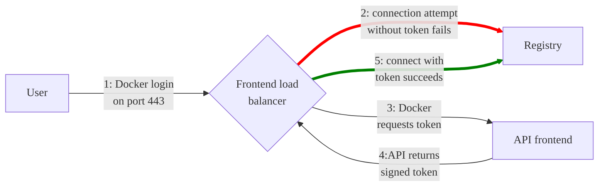

DETAILS:
**Tier:** Free, Premium, Ultimate
**Offering:** GitLab Self-Managed

NOTE:
The [next-generation container registry](container_registry_metadata_database.md)
is now available for upgrade on GitLab Self-Managed instances.
This upgraded registry supports online garbage collection, and has significant performance
and reliability improvements.

With the GitLab container registry, every project can have its
own space to store Docker images.

For more details about the Distribution Registry:

- [Configuration](https://distribution.github.io/distribution/about/configuration/)
- [Storage drivers](https://distribution.github.io/distribution/storage-drivers/)
- [Deploy a registry server](https://distribution.github.io/distribution/about/deploying/)

This document is the administrator's guide. To learn how to use the GitLab Container
Registry, see the [user documentation](../../user/packages/container_registry/_index.md).

## Enable the container registry

The process for enabling the container registry depends on the type of installation you use.

### Linux package installations

If you installed GitLab by using the Linux package, the container registry
may or may not be available by default.

The container registry is automatically enabled and available on your GitLab domain, port 5050 if
you're using the built-in [Let's Encrypt integration](https://docs.gitlab.com/omnibus/settings/ssl/index.html#enable-the-lets-encrypt-integration).

Otherwise, the container registry is not enabled. To enable it:

- You can configure it for your [GitLab domain](#configure-container-registry-under-an-existing-gitlab-domain), or
- You can configure it for [a different domain](#configure-container-registry-under-its-own-domain).

The container registry works under HTTPS by default. You can use HTTP
but it's not recommended and is beyond the scope of this document.

### Helm Charts installations

For Helm Charts installations, see [Using the Container Registry](https://docs.gitlab.com/charts/charts/registry/).
in the Helm Charts documentation.

### Self-compiled installations

If you self-compiled your GitLab installation:

1. You must deploy a registry using the image corresponding to the
   version of GitLab you are installing
   (for example: `registry.gitlab.com/gitlab-org/build/cng/gitlab-container-registry:v3.15.0-gitlab`)
1. After the installation is complete, to enable it, you must configure the Registry's
   settings in `gitlab.yml`.
1. Use the sample NGINX configuration file from under
   [`lib/support/nginx/registry-ssl`](https://gitlab.com/gitlab-org/gitlab/-/blob/master/lib/support/nginx/registry-ssl) and edit it to match the
   `host`, `port`, and TLS certificate paths.

The contents of `gitlab.yml` are:

```yaml
registry:
  enabled: true
  host: registry.gitlab.example.com
  port: 5005
  api_url: http://localhost:5000/
  key: config/registry.key
  path: shared/registry
  issuer: gitlab-issuer
```

Where:

| Parameter | Description |
| --------- | ----------- |
| `enabled` | `true` or `false`. Enables the Registry in GitLab. By default this is `false`. |
| `host`    | The host URL under which the Registry runs and users can use. |
| `port`    | The port the external Registry domain listens on. |
| `api_url` | The internal API URL under which the Registry is exposed. It defaults to `http://localhost:5000`. Do not change this unless you are setting up an [external Docker registry](#use-an-external-container-registry-with-gitlab-as-an-auth-endpoint). |
| `key`     | The private key location that is a pair of Registry's `rootcertbundle`. |
| `path`    | This should be the same directory like specified in Registry's `rootdirectory`. This path needs to be readable by the GitLab user, the web-server user and the Registry user. |
| `issuer`  | This should be the same value as configured in Registry's `issuer`. |

A Registry init file is not shipped with GitLab if you install it from source.
Hence, [restarting GitLab](../restart_gitlab.md#self-compiled-installations) does not restart the Registry should
you modify its settings. Read the upstream documentation on how to achieve that.

At the **absolute** minimum, make sure your Registry configuration
has `container_registry` as the service and `https://gitlab.example.com/jwt/auth`
as the realm:

```yaml
auth:
  token:
    realm: https://gitlab.example.com/jwt/auth
    service: container_registry
    issuer: gitlab-issuer
    rootcertbundle: /root/certs/certbundle
```

WARNING:
If `auth` is not set up, users can pull Docker images without authentication.

## Container registry domain configuration

You can configure the Registry's external domain in either of these ways:

- [Use the existing GitLab domain](#configure-container-registry-under-an-existing-gitlab-domain).
  The Registry listens on a port and reuses the TLS certificate from GitLab.
- [Use a completely separate domain](#configure-container-registry-under-its-own-domain) with a new TLS certificate
  for that domain.

Because the container registry requires a TLS certificate, cost may be a factor.

Take this into consideration before configuring the container registry
for the first time.

### Configure container registry under an existing GitLab domain

If the container registry is configured to use the existing GitLab domain, you can
expose the container registry on a port. This way you can reuse the existing GitLab TLS
certificate.

If the GitLab domain is `https://gitlab.example.com` and the port to the outside world is `5050`,
to configure the container registry:

- Edit `gitlab.rb` if you are using a Linux package installation.
- Edit `gitlab.yml` if you are using a self-compiled installation.

Ensure you choose a port different than the one that Registry listens to (`5000` by default),
otherwise conflicts occur.

NOTE:
Host and container firewall rules must be configured to allow traffic in through the port listed
under the `registry_external_url` line, rather than the port listed under
`gitlab_rails['registry_port']` (default `5000`).

::Tabs

:::TabTitle Linux package (Omnibus)

1. Your `/etc/gitlab/gitlab.rb` should contain the Registry URL as well as the
   path to the existing TLS certificate and key used by GitLab:

   ```ruby
   registry_external_url 'https://gitlab.example.com:5050'
   ```

   The `registry_external_url` is listening on HTTPS under the
   existing GitLab URL, but on a different port.

   If your TLS certificate is not in `/etc/gitlab/ssl/gitlab.example.com.crt`
   and key not in `/etc/gitlab/ssl/gitlab.example.com.key` uncomment the lines
   below:

   ```ruby
   registry_nginx['ssl_certificate'] = "/path/to/certificate.pem"
   registry_nginx['ssl_certificate_key'] = "/path/to/certificate.key"
   ```

1. Save the file and [reconfigure GitLab](../restart_gitlab.md#reconfigure-a-linux-package-installation)
   for the changes to take effect.

1. Validate using:

   ```shell
   openssl s_client -showcerts -servername gitlab.example.com -connect gitlab.example.com:5050 > cacert.pem
   ```

If your certificate provider provides the CA Bundle certificates, append them to the TLS certificate file.

An administrator may want the container registry listening on an arbitrary port such as `5678`.
However, the registry and application server are behind an AWS application load balancer that only
listens on ports `80` and `443`. The administrator may remove the port number for
`registry_external_url`, so HTTP or HTTPS is assumed. Then, the rules apply that map the load
balancer to the registry from ports `80` or `443` to the arbitrary port. This is important if users
rely on the `docker login` example in the container registry. Here's an example:

```ruby
registry_external_url 'https://registry-gitlab.example.com'
registry_nginx['redirect_http_to_https'] = true
registry_nginx['listen_port'] = 5678
```

:::TabTitle Self-compiled (source)

1. Open `/home/git/gitlab/config/gitlab.yml`, find the `registry` entry and
   configure it with the following settings:

   ```yaml
   registry:
     enabled: true
     host: gitlab.example.com
     port: 5050
   ```

1. Save the file and [restart GitLab](../restart_gitlab.md#self-compiled-installations) for the changes to take effect.
1. Make the relevant changes in NGINX as well (domain, port, TLS certificates path).

::EndTabs

Users should now be able to sign in to the container registry with their GitLab
credentials using:

```shell
docker login gitlab.example.com:5050
```

### Configure container registry under its own domain

When the Registry is configured to use its own domain, you need a TLS
certificate for that specific domain (for example, `registry.example.com`). You might need
a wildcard certificate if hosted under a subdomain of your existing GitLab
domain. For example, `*.gitlab.example.com`, is a wildcard that matches `registry.gitlab.example.com`,
and is distinct from `*.example.com`.

As well as manually generated SSL certificates (explained here), certificates automatically
generated by Let's Encrypt are also [supported in Linux package installations](https://docs.gitlab.com/omnibus/settings/ssl/index.html).

Let's assume that you want the container registry to be accessible at
`https://registry.gitlab.example.com`.

::Tabs

:::TabTitle Linux package (Omnibus)

1. Place your TLS certificate and key in
   `/etc/gitlab/ssl/registry.gitlab.example.com.crt` and
   `/etc/gitlab/ssl/registry.gitlab.example.com.key` and make sure they have
   correct permissions:

   ```shell
   chmod 600 /etc/gitlab/ssl/registry.gitlab.example.com.*
   ```

1. After the TLS certificate is in place, edit `/etc/gitlab/gitlab.rb` with:

   ```ruby
   registry_external_url 'https://registry.gitlab.example.com'
   ```

   The `registry_external_url` is listening on HTTPS.

1. Save the file and [reconfigure GitLab](../restart_gitlab.md#reconfigure-a-linux-package-installation) for the changes to take effect.

If you have a [wildcard certificate](https://en.wikipedia.org/wiki/Wildcard_certificate), you must specify the path to the
certificate in addition to the URL, in this case `/etc/gitlab/gitlab.rb`
looks like:

```ruby
registry_nginx['ssl_certificate'] = "/etc/gitlab/ssl/certificate.pem"
registry_nginx['ssl_certificate_key'] = "/etc/gitlab/ssl/certificate.key"
```

:::TabTitle Self-compiled (source)

1. Open `/home/git/gitlab/config/gitlab.yml`, find the `registry` entry and
   configure it with the following settings:

   ```yaml
   registry:
     enabled: true
     host: registry.gitlab.example.com
   ```

1. Save the file and [restart GitLab](../restart_gitlab.md#self-compiled-installations) for the changes to take effect.
1. Make the relevant changes in NGINX as well (domain, port, TLS certificates path).

::EndTabs

Users should now be able to sign in to the container registry using their GitLab
credentials:

```shell
docker login registry.gitlab.example.com
```

## Disable container registry site-wide

When you disable the Registry by following these steps, you do not
remove any existing Docker images. Docker image removal is handled by the
Registry application itself.

::Tabs

:::TabTitle Linux package (Omnibus)

1. Open `/etc/gitlab/gitlab.rb` and set `registry['enable']` to `false`:

   ```ruby
   registry['enable'] = false
   ```

1. Save the file and [reconfigure GitLab](../restart_gitlab.md#reconfigure-a-linux-package-installation) for the changes to take effect.

:::TabTitle Self-compiled (source)

1. Open `/home/git/gitlab/config/gitlab.yml`, find the `registry` entry and
   set `enabled` to `false`:

   ```yaml
   registry:
     enabled: false
   ```

1. Save the file and [restart GitLab](../restart_gitlab.md#self-compiled-installations) for the changes to take effect.

::EndTabs

## Disable container registry for new projects site-wide

If the container registry is enabled, then it should be available on all new
projects. To disable this function and let the owners of a project to enable
the container registry by themselves, follow the steps below.

::Tabs

:::TabTitle Linux package (Omnibus)

1. Edit `/etc/gitlab/gitlab.rb` and add the following line:

   ```ruby
   gitlab_rails['gitlab_default_projects_features_container_registry'] = false
   ```

1. Save the file and [reconfigure GitLab](../restart_gitlab.md#reconfigure-a-linux-package-installation) for the changes to take effect.

:::TabTitle Self-compiled (source)

1. Open `/home/git/gitlab/config/gitlab.yml`, find the `default_projects_features`
   entry and configure it so that `container_registry` is set to `false`:

   ```yaml
   ## Default project features settings
   default_projects_features:
     issues: true
     merge_requests: true
     wiki: true
     snippets: false
     builds: true
     container_registry: false
   ```

1. Save the file and [restart GitLab](../restart_gitlab.md#self-compiled-installations) for the changes to take effect.

::EndTabs

### Increase token duration

In GitLab, tokens for the container registry expire every five minutes.
To increase the token duration:

1. On the left sidebar, at the bottom, select **Admin**.
1. Select **Settings > CI/CD**.
1. Expand **Container Registry**.
1. For the **Authorization token duration (minutes)**, update the value.
1. Select **Save changes**.

## Configure storage for the container registry

NOTE:
For storage backends that support it, you can use object versioning to preserve, retrieve, and
restore the non-current versions of every object stored in your buckets. However, this may result in
higher storage usage and costs. Due to how the registry operates, image uploads are first stored in
a temporary path and then transferred to a final location. For object storage backends, including S3
and GCS, this transfer is achieved with a copy followed by a delete. With object versioning enabled,
these deleted temporary upload artifacts are kept as non-current versions, therefore increasing the
storage bucket size. To ensure that non-current versions are deleted after a given amount of time,
you should configure an object lifecycle policy with your storage provider.

WARNING:
Do not directly modify the files or objects stored by the container registry. Anything other than the registry writing or deleting these entries can lead to instance-wide data consistency and instability issues from which recovery may not be possible.

You can configure the container registry to use various storage backends by
configuring a storage driver. By default the GitLab container registry
is configured to use the [file system driver](#use-file-system)
configuration.

The different supported drivers are:

| Driver       | Description                          |
|--------------|--------------------------------------|
| `filesystem` | Uses a path on the local file system |
| `azure`      | Microsoft Azure Blob Storage         |
| `gcs`        | Google Cloud Storage                 |
| `s3`         | Amazon Simple Storage Service. Be sure to configure your storage bucket with the correct [S3 Permission Scopes](https://distribution.github.io/distribution/storage-drivers/s3/#s3-permission-scopes). |

Although most S3 compatible services (like [MinIO](https://min.io/)) should work with the container registry,
we only guarantee support for AWS S3. Because we cannot assert the correctness of third-party S3 implementations,
we can debug issues, but we cannot patch the registry unless an issue is reproducible against an AWS S3 bucket.

### Use file system

If you want to store your images on the file system, you can change the storage
path for the container registry, follow the steps below.

This path is accessible to:

- The user running the container registry daemon.
- The user running GitLab.

All GitLab, Registry, and web server users must
have access to this directory.

::Tabs

:::TabTitle Linux package (Omnibus)

The default location where images are stored in Linux package installations is
`/var/opt/gitlab/gitlab-rails/shared/registry`. To change it:

1. Edit `/etc/gitlab/gitlab.rb`:

   ```ruby
   gitlab_rails['registry_path'] = "/path/to/registry/storage"
   ```

1. Save the file and [reconfigure GitLab](../restart_gitlab.md#reconfigure-a-linux-package-installation) for the changes to take effect.

:::TabTitle Self-compiled (source)

The default location where images are stored in self-compiled installations is
`/home/git/gitlab/shared/registry`. To change it:

1. Open `/home/git/gitlab/config/gitlab.yml`, find the `registry` entry and
   change the `path` setting:

   ```yaml
   registry:
     path: shared/registry
   ```

1. Save the file and [restart GitLab](../restart_gitlab.md#self-compiled-installations) for the changes to take effect.

::EndTabs

### Use object storage

If you want to store your images on object storage, you can change the storage
driver for the container registry.

[Read more about using object storage with GitLab](../object_storage.md).

WARNING:
GitLab does not back up Docker images that are not stored on the
file system. Enable backups with your object storage provider if
desired.

#### Configure `s3` and `gcs` storage drivers for Linux package installations

The following configuration steps are for the `s3` and `gcs` storage drivers. Other [storage drivers](#configure-storage-for-the-container-registry) are supported.

To configure the `s3` storage driver for a Linux package installation:

1. Edit `/etc/gitlab/gitlab.rb`:

   ```ruby
   registry['storage'] = {
     's3' => {
       'accesskey' => 's3-access-key',
       'secretkey' => 's3-secret-key-for-access-key',
       'bucket' => 'your-s3-bucket',
       'region' => 'your-s3-region',
       'regionendpoint' => 'your-s3-regionendpoint'
     }
   }
   ```

   To avoid using static credentials, use an
   [IAM role](https://docs.aws.amazon.com/AWSEC2/latest/UserGuide/iam-roles-for-amazon-ec2.html)
   and omit `accesskey` and `secretkey`. Make sure that your IAM profile follows
   [the permissions documented by Docker](https://distribution.github.io/distribution/storage-drivers/s3/#s3-permission-scopes).

   ```ruby
   registry['storage'] = {
     's3' => {
       'bucket' => 'your-s3-bucket',
       'region' => 'your-s3-region'
     }
   }
   ```

   If using with an [AWS S3 VPC endpoint](https://docs.aws.amazon.com/vpc/latest/privatelink/vpc-endpoints-s3.html),
   then set `regionendpoint` to your VPC endpoint address and set `pathstyle` to false:

   ```ruby
   registry['storage'] = {
     's3' => {
       'accesskey' => 's3-access-key',
       'secretkey' => 's3-secret-key-for-access-key',
       'bucket' => 'your-s3-bucket',
       'region' => 'your-s3-region',
       'regionendpoint' => 'your-s3-vpc-endpoint',
       'pathstyle' => false
     }
   }
   ```

   - `regionendpoint` is only required when configuring an S3 compatible service such as MinIO, or
     when using an AWS S3 VPC Endpoint.
   - `your-s3-bucket` should be the name of a bucket that exists, and can't include subdirectories.
   - `pathstyle` should be set to true to use `host/bucket_name/object` style paths instead of
     `bucket_name.host/object`. [Set to false for AWS S3](https://aws.amazon.com/blogs/aws/amazon-s3-path-deprecation-plan-the-rest-of-the-story/).

   You can set a rate limit on connections to S3 to avoid 503 errors from the S3 API. To do this,
   set `maxrequestspersecond` to a number within the [S3 request rate threshold](https://repost.aws/knowledge-center/http-5xx-errors-s3):

   ```ruby
   registry['storage'] = {
     's3' => {
       'accesskey' => 's3-access-key',
       'secretkey' => 's3-secret-key-for-access-key',
       'bucket' => 'your-s3-bucket',
       'region' => 'your-s3-region',
       'regionendpoint' => 'your-s3-regionendpoint',
       'maxrequestspersecond' => 100
     }
   }
   ```

1. Save the file and [reconfigure GitLab](../restart_gitlab.md#reconfigure-a-linux-package-installation) for the changes to take effect.

To configure the `gcs` storage driver for a Linux package installation:

1. Edit `/etc/gitlab/gitlab.rb`:

   ```ruby
   registry['storage'] = {
     'gcs' => {
       'bucket' => 'BUCKET_NAME',
       'keyfile' => 'PATH/TO/KEYFILE',
       # If you have the bucket shared with other apps beyond the registry, uncomment the following:
       # 'rootdirectory' => '/gcs/object/name/prefix'
     }
   }
   ```

   GitLab supports all available parameters.

1. Save the file and [reconfigure GitLab](../restart_gitlab.md#reconfigure-a-linux-package-installation) for the changes to take effect.

#### Self-compiled installations

Configuring the storage driver is done in the registry configuration YAML file created
when you deployed your Docker registry.

`s3` storage driver example:

```yaml
storage:
  s3:
    accesskey: 's3-access-key'                # Not needed if IAM role used
    secretkey: 's3-secret-key-for-access-key' # Not needed if IAM role used
    bucket: 'your-s3-bucket'
    region: 'your-s3-region'
    regionendpoint: 'your-s3-regionendpoint'
  cache:
    blobdescriptor: inmemory
  delete:
    enabled: true
```

`your-s3-bucket` should be the name of a bucket that exists, and can't include subdirectories.

#### Migrate to object storage without downtime

WARNING:
Using [AWS DataSync](https://aws.amazon.com/datasync/)
to copy the registry data to or between S3 buckets creates invalid metadata objects in the bucket.
For additional details, see [Tags with an empty name](container_registry_troubleshooting.md#tags-with-an-empty-name).
To move data to and between S3 buckets, the AWS CLI `sync` operation is recommended.

To migrate storage without stopping the container registry, set the container registry
to read-only mode. On large instances, this may require the container registry
to be in read-only mode for a while. During this time,
you can pull from the container registry, but you cannot push.

1. Optional: To reduce the amount of data to be migrated, run the [garbage collection tool without downtime](#performing-garbage-collection-without-downtime).
1. This example uses the `aws` CLI. If you haven't configured the
   CLI before, you have to configure your credentials by running `sudo aws configure`.
   Because a non-administrator user likely can't access the container registry folder,
   ensure you use `sudo`. To check your credential configuration, run
   [`ls`](https://awscli.amazonaws.com/v2/documentation/api/latest/reference/s3/ls.html) to list
   all buckets.

   ```shell
   sudo aws --endpoint-url https://your-object-storage-backend.com s3 ls
   ```

   If you are using AWS as your back end, you do not need the [`--endpoint-url`](https://docs.aws.amazon.com/cli/latest/reference/#options).
1. Copy initial data to your S3 bucket, for example with the `aws` CLI
   [`cp`](https://awscli.amazonaws.com/v2/documentation/api/latest/reference/s3/cp.html)
   or [`sync`](https://awscli.amazonaws.com/v2/documentation/api/latest/reference/s3/sync.html)
   command. Make sure to keep the `docker` folder as the top-level folder inside the bucket.

   ```shell
   sudo aws --endpoint-url https://your-object-storage-backend.com s3 sync registry s3://mybucket
   ```

   NOTE:
   If you have a lot of data, you may be able to improve performance by
   [running parallel sync operations](https://repost.aws/knowledge-center/s3-improve-transfer-sync-command).

1. To perform the final data sync,
   [put the container registry in `read-only` mode](#performing-garbage-collection-without-downtime) and
   [reconfigure GitLab](../restart_gitlab.md#reconfigure-a-linux-package-installation).
1. Sync any changes dating from after the initial data load to your S3 bucket, and delete files that exist in the destination bucket but not in the source:

   ```shell
   sudo aws --endpoint-url https://your-object-storage-backend.com s3 sync registry s3://mybucket --delete --dryrun
   ```

   After verifying the command performs as expected, remove the
   [`--dryrun`](https://docs.aws.amazon.com/cli/latest/reference/s3/sync.html)
   flag and run the command.

   WARNING:
   The [`--delete`](https://docs.aws.amazon.com/cli/latest/reference/s3/sync.html)
   flag deletes files that exist in the destination but not in the source.
   If you swap the source and destination, all data in the Registry is deleted.

1. Verify all container registry files have been uploaded to object storage
   by looking at the file count returned by these two commands:

   ```shell
   sudo find registry -type f | wc -l
   ```

   ```shell
   sudo aws --endpoint-url https://your-object-storage-backend.com s3 ls s3://mybucket --recursive | wc -l
   ```

   The output of these commands should match, except for the content in the
   `_uploads` directories and sub-directories.
1. Configure your registry to [use the S3 bucket for storage](#use-object-storage).
1. For the changes to take effect, set the Registry back to `read-write` mode and [reconfigure GitLab](../restart_gitlab.md#reconfigure-a-linux-package-installation).

#### Moving to Azure Object Storage

::Tabs

:::TabTitle Linux package (Omnibus)

```ruby
registry['storage'] = {
  'azure' => {
    'accountname' => '<your_storage_account_name>',
    'accountkey' => '<base64_encoded_account_key>',
    'container' => '<container_name>',
    'trimlegacyrootprefix' => true
  }
}
```

:::TabTitle Self-compiled (source)

```yaml
storage:
  azure:
    accountname: <your_storage_account_name>
    accountkey: <base64_encoded_account_key>
    container: <container_name>
    trimlegacyrootprefix: true
```

::EndTabs

By default, Azure Storage Driver uses the `core.windows.net` realm. You can set another value for `realm` in the `azure` section (for example, `core.usgovcloudapi.net` for Azure Government Cloud).

### Disable redirect for storage driver

By default, users accessing a registry configured with a remote backend are redirected to the default backend for the storage driver. For example, registries can be configured using the `s3` storage driver, which redirects requests to a remote S3 bucket to alleviate load on the GitLab server.

However, this behavior is undesirable for registries used by internal hosts that usually can't access public servers. To disable redirects and [proxy download](../object_storage.md#proxy-download), set the `disable` flag to true as follows. This makes all traffic always go through the Registry service. This results in improved security (less surface attack as the storage backend is not publicly accessible), but worse performance (all traffic is redirected via the service).

::Tabs

:::TabTitle Linux package (Omnibus)

1. Edit `/etc/gitlab/gitlab.rb`:

   ```ruby
   registry['storage'] = {
     's3' => {
       'accesskey' => '<s3_access_key>',
       'secretkey' => '<s3_secret_key_for_access_key>',
       'bucket' => '<your_s3_bucket>',
       'region' => '<your_s3_region>',
       'regionendpoint' => '<your_s3_regionendpoint>'
     },
     'redirect' => {
       'disable' => true
     }
   }
   ```

1. Save the file and [reconfigure GitLab](../restart_gitlab.md#reconfigure-a-linux-package-installation) for the changes to take effect.

:::TabTitle Self-compiled (source)

1. Add the `redirect` flag to your registry configuration YAML file:

   ```yaml
   storage:
     s3:
       accesskey: '<s3_access_key>'
       secretkey: '<s3_secret_key_for_access_key>'
       bucket: '<your_s3_bucket>'
       region: '<your_s3_region>'
       regionendpoint: '<your_s3_regionendpoint>'
     redirect:
       disable: true
     cache:
       blobdescriptor: inmemory
     delete:
       enabled: true
   ```

1. Save the file and [restart GitLab](../restart_gitlab.md#self-compiled-installations) for the changes to take effect.

::EndTabs

#### Encrypted S3 buckets

You can use server-side encryption with AWS KMS for S3 buckets that have
[SSE-S3 or SSE-KMS encryption enabled by default](https://docs.aws.amazon.com/kms/latest/developerguide/services-s3.html).
Customer master keys (CMKs) and SSE-C encryption aren't supported because this requires sending the
encryption keys in every request.

For SSE-S3, you must enable the `encrypt` option in the registry settings. How you do this depends
on how you installed GitLab. Follow the instructions here that match your installation method.

::Tabs

:::TabTitle Linux package (Omnibus)

1. Edit `/etc/gitlab/gitlab.rb`:

   ```ruby
   registry['storage'] = {
     's3' => {
       'accesskey' => '<s3_access_key>',
       'secretkey' => '<s3_secret_key_for_access_key>',
       'bucket' => '<your_s3_bucket>',
       'region' => '<your_s3_region>',
       'regionendpoint' => '<your_s3_regionendpoint>',
       'encrypt' => true
     }
   }
   ```

1. Save the file and [reconfigure GitLab](../restart_gitlab.md#reconfigure-a-linux-package-installation)
   for the changes to take effect.

:::TabTitle Self-compiled (source)

1. Edit your registry configuration YAML file:

   ```yaml
   storage:
     s3:
       accesskey: '<s3_access_key>'
       secretkey: '<s3_secret_key_for_access_key>'
       bucket: '<your_s3_bucket>'
       region: '<your_s3_region>'
       regionendpoint: '<your_s3_regionendpoint>'
       encrypt: true
   ```

1. Save the file and [restart GitLab](../restart_gitlab.md#self-compiled-installations)
   for the changes to take effect.

::EndTabs

### Storage limitations

There is no storage limitation, which means a user can upload an
infinite amount of Docker images with arbitrary sizes. This setting should be
configurable in future releases.

## Change the registry's internal port

The Registry server listens on localhost at port `5000` by default,
which is the address for which the Registry server should accept connections.
In the examples below we set the Registry's port to `5010`.

::Tabs

:::TabTitle Linux package (Omnibus)

1. Open `/etc/gitlab/gitlab.rb` and set `registry['registry_http_addr']`:

   ```ruby
   registry['registry_http_addr'] = "localhost:5010"
   ```

1. Save the file and [reconfigure GitLab](../restart_gitlab.md#reconfigure-a-linux-package-installation) for the changes to take effect.

:::TabTitle Self-compiled (source)

1. Open the configuration file of your Registry server and edit the
   [`http:addr`](https://distribution.github.io/distribution/about/configuration/#http) value:

   ```yaml
   http:
     addr: localhost:5010
   ```

1. Save the file and restart the Registry server.

::EndTabs

## Disable container registry per project

If Registry is enabled in your GitLab instance, but you don't need it for your
project, you can [disable it from your project's settings](../../user/project/settings/_index.md#configure-project-features-and-permissions).

## Use an external container registry with GitLab as an auth endpoint

WARNING:
Using third-party container registries in GitLab was [deprecated](https://gitlab.com/gitlab-org/gitlab/-/issues/376217)
in GitLab 15.8 and support ended in GitLab 16.0.
If you need to use third-party container registries instead of the GitLab container registry,
tell us about your use cases in [feedback issue 958](https://gitlab.com/gitlab-org/container-registry/-/issues/958).

If you use an external container registry, some features associated with the
container registry may be unavailable or have [inherent risks](../../user/packages/container_registry/reduce_container_registry_storage.md#use-with-external-container-registries).

For the integration to work, the external registry must be configured to
use a JSON Web Token to authenticate with GitLab. The
[external registry's runtime configuration](https://distribution.github.io/distribution/about/configuration/#token)
**must** have the following entries:

```yaml
auth:
  token:
    realm: https://gitlab.example.com/jwt/auth
    service: container_registry
    issuer: gitlab-issuer
    rootcertbundle: /root/certs/certbundle
```

Without these entries, the registry logins cannot authenticate with GitLab.
GitLab also remains unaware of
[nested image names](../../user/packages/container_registry/_index.md#naming-convention-for-your-container-images)
under the project hierarchy, like
`registry.example.com/group/project/image-name:tag` or
`registry.example.com/group/project/my/image-name:tag`, and only recognizes
`registry.example.com/group/project:tag`.

### Linux package installations

You can use GitLab as an auth endpoint with an external container registry.

1. Open `/etc/gitlab/gitlab.rb` and set necessary configurations:

   ```ruby
   gitlab_rails['registry_enabled'] = true
   gitlab_rails['registry_api_url'] = "https://<external_registry_host>:5000"
   gitlab_rails['registry_issuer'] = "gitlab-issuer"
   ```

   - `gitlab_rails['registry_enabled'] = true` is needed to enable GitLab
     container registry features and authentication endpoint. The GitLab bundled
     container registry service does not start, even with this enabled.
   - `gitlab_rails['registry_api_url'] = "http://<external_registry_host>:5000"`
     must be changed to match the host where Registry is installed.
     It must also specify `https` if the external registry is
     configured to use TLS.

1. A certificate-key pair is required for GitLab and the external container
   registry to communicate securely. You need to create a certificate-key
   pair, configuring the external container registry with the public
   certificate (`rootcertbundle`) and configuring GitLab with the private key.
   To do that, add the following to `/etc/gitlab/gitlab.rb`:

   ```ruby
   # registry['internal_key'] should contain the contents of the custom key
   # file. Line breaks in the key file should be marked using `\n` character
   # Example:
   registry['internal_key'] = "---BEGIN RSA PRIVATE KEY---\nMIIEpQIBAA\n"

   # Optionally define a custom file for a Linux package installation to write the contents
   # of registry['internal_key'] to.
   gitlab_rails['registry_key_path'] = "/custom/path/to/registry-key.key"
   ```

   Each time reconfigure is executed, the file specified at `registry_key_path`
   gets populated with the content specified by `internal_key`. If
   no file is specified, Linux package installations default it to
   `/var/opt/gitlab/gitlab-rails/etc/gitlab-registry.key` and populates
   it.

1. To change the container registry URL displayed in the GitLab Container
   Registry pages, set the following configurations:

   ```ruby
   gitlab_rails['registry_host'] = "registry.gitlab.example.com"
   gitlab_rails['registry_port'] = "5005"
   ```

1. Save the file and [reconfigure GitLab](../restart_gitlab.md#reconfigure-a-linux-package-installation)
   for the changes to take effect.

### Self-compiled installations

1. Open `/home/git/gitlab/config/gitlab.yml`, and edit the configuration settings under `registry`:

   ```yaml
   ## Container registry

   registry:
     enabled: true
     host: "registry.gitlab.example.com"
     port: "5005"
     api_url: "https://<external_registry_host>:5000"
     path: /var/lib/registry
     key: /path/to/keyfile
     issuer: gitlab-issuer
   ```

   [Read more](#enable-the-container-registry) about what these parameters mean.

1. Save the file and [restart GitLab](../restart_gitlab.md#self-compiled-installations) for the changes to take effect.

## Configure container registry notifications

You can configure the container registry to send webhook notifications in
response to events happening in the registry.

Read more about the container registry notifications configuration options in the
[Docker Registry notifications documentation](https://distribution.github.io/distribution/about/notifications/).

WARNING:
Support for the `threshold` parameter was [deprecated](https://gitlab.com/gitlab-org/container-registry/-/issues/1243)
in GitLab 17.0, and is planned for removal in 18.0. Use `maxretries` instead.

You can configure multiple endpoints for the container registry.

::Tabs

:::TabTitle Linux package (Omnibus)

To configure a notification endpoint for a Linux package installation:

1. Edit `/etc/gitlab/gitlab.rb`:

   ```ruby
   registry['notifications'] = [
     {
       'name' => 'test_endpoint',
       'url' => 'https://gitlab.example.com/api/v4/container_registry_event/events',
       'timeout' => '500ms',
       'threshold' => 5, # DEPRECATED: use `maxretries` instead.
       'maxretries' => 5,
       'backoff' => '1s',
       'headers' => {
         "Authorization" => ["AUTHORIZATION_EXAMPLE_TOKEN"]
       }
     }
   ]

   gitlab_rails['registry_notification_secret'] = 'AUTHORIZATION_EXAMPLE_TOKEN' # Must match the auth token in registry['notifications']
   ```

   NOTE:
   Replace `AUTHORIZATION_EXAMPLE_TOKEN` with a case sensitive alphanumeric string
   that starts with a letter. You can generate one with `< /dev/urandom tr -dc _A-Z-a-z-0-9 | head -c 32 | sed "s/^[0-9]*//"; echo`

1. Save the file and [reconfigure GitLab](../restart_gitlab.md#reconfigure-a-linux-package-installation) for the changes to take effect.

:::TabTitle Self-compiled (source)

Configuring the notification endpoint is done in your registry configuration YAML file created
when you deployed your Docker registry.

Example:

```yaml
notifications:
  endpoints:
    - name: alistener
      disabled: false
      url: https://my.listener.com/event
      headers: <http.Header>
      timeout: 500
      threshold: 5 # DEPRECATED: use `maxretries` instead.
      maxretries: 5
      backoff: 1000
```

::EndTabs

## Run the cleanup policy

Prerequisites:

- If you use a distributed architecture where the container registry runs on a different node than Sidekiq, follow the steps in [Configure the container registry when using an external Sidekiq](../sidekiq/_index.md#configure-the-container-registry-when-using-an-external-sidekiq).

After you [create a cleanup policy](../../user/packages/container_registry/reduce_container_registry_storage.md#create-a-cleanup-policy), you can run it immediately to reduce the container registry storage space. You don't have to wait for the scheduled cleanup.

To reduce the amount of container registry disk space used by a given project, administrators can:

1. [Check disk space usage by project](#registry-disk-space-usage-by-project) to identify projects that need cleanup.
1. Run the cleanup policy using the GitLab Rails console to remove image tags.
1. [Run garbage collection](#container-registry-garbage-collection) to remove unreferenced layers and untagged manifests.

### Registry Disk Space Usage by Project

To find the disk space used by each project, run the following in the
[GitLab Rails console](../operations/rails_console.md#starting-a-rails-console-session):

```ruby
projects_and_size = [["project_id", "creator_id", "registry_size_bytes", "project path"]]
# You need to specify the projects that you want to look through. You can get these in any manner.
projects = Project.last(100)

registry_metadata_database = ContainerRegistry::GitlabApiClient.supports_gitlab_api?

if registry_metadata_database
  projects.each do |project|
    size = project.container_repositories_size
    if size > 0
      projects_and_size << [project.project_id, project.creator&.id, size, project.full_path]
    end
  end
else
  projects.each do |project|
    project_layers = {}
    
    project.container_repositories.each do |repository|
      repository.tags.each do |tag|
        tag.layers.each do |layer|
          project_layers[layer.digest] ||= layer.size
        end
      end
    end

    total_size = project_layers.values.compact.sum
    if total_size > 0
      projects_and_size << [project.project_id, project.creator&.id, total_size, project.full_path]
    end
  end
end

# print it as comma separated output
projects_and_size.each do |ps|
   puts "%s,%s,%s,%s" % ps
end
```

NOTE:
The script calculates size based on container image layers. Since layers can be shared across multiple projects, the results are approximate but give a good indication of relative disk usage between projects.

To remove image tags by running the cleanup policy, run the following commands in the
[GitLab Rails console](../operations/rails_console.md):

```ruby
# Numeric ID of the project whose container registry should be cleaned up
P = <project_id>

# Numeric ID of a user with Developer, Maintainer, or Owner role for the project
U = <user_id>

# Get required details / objects
user    = User.find_by_id(U)
project = Project.find_by_id(P)
policy  = ContainerExpirationPolicy.find_by(project_id: P)

# Loop through each container repository
project.container_repositories.find_each do |repo|
  puts repo.attributes

  # Start the tag cleanup
  puts Projects::ContainerRepository::CleanupTagsService.new(container_repository: repo, current_user: user, params: policy.attributes.except("created_at", "updated_at")).execute
end
```

You can also [run cleanup on a schedule](../../user/packages/container_registry/reduce_container_registry_storage.md#cleanup-policy).

To enable cleanup policies for all projects instance-wide, you need to find all projects
with a container registry, but with the cleanup policy disabled:

```ruby
# Find all projects where Container registry is enabled, and cleanup policies disabled

projects = Project.find_by_sql ("SELECT * FROM projects WHERE id IN (SELECT project_id FROM container_expiration_policies WHERE enabled=false AND id IN (SELECT project_id FROM container_repositories))")

# Loop through each project
projects.each do |p|

# Print project IDs and project full names
    puts "#{p.id},#{p.full_name}"
end
```

## Container registry metadata database

DETAILS:
**Tier:** Free, Premium, Ultimate
**Offering:** GitLab Self-Managed

> - [Generally available](https://gitlab.com/gitlab-org/gitlab/-/issues/423459) in GitLab 17.3.

The metadata database enables many new registry features, including
online garbage collection, and increases the efficiency of many registry operations.
See the [Container registry metadata database](container_registry_metadata_database.md) page for details.

## Container registry garbage collection

NOTE:
Retention policies in your object storage provider, such as Amazon S3 Lifecycle, may prevent
objects from being properly deleted.

The container registry can use considerable amounts of storage space, and you might want to
[reduce storage usage](../../user/packages/container_registry/reduce_container_registry_storage.md).
Among the listed options, deleting tags is the most effective option. However, tag deletion
alone does not delete image layers, it only leaves the underlying image manifests untagged.

To more effectively free up space, the container registry has a garbage collector that can
delete unreferenced layers and (optionally) untagged manifests.

To start the garbage collector, use the `registry-garbage-collect` command provided by `gitlab-ctl`.

WARNING:
This command shuts down the container registry prior to the garbage collection and
only starts it again after garbage collection completes. If you prefer to avoid downtime,
you can manually set the container registry to [read-only mode and bypass `gitlab-ctl`](#performing-garbage-collection-without-downtime).

The time required to perform garbage collection is proportional to the container registry data size.

Prerequisites:

- You must have installed GitLab by using a Linux package or the
  [GitLab Helm chart](https://docs.gitlab.com/charts/charts/registry/#garbage-collection).

### Understanding the content-addressable layers

Consider the following example, where you first build the image:

```shell
# This builds a image with content of sha256:111111
docker build -t my.registry.com/my.group/my.project:latest .
docker push my.registry.com/my.group/my.project:latest
```

Now, you do overwrite `:latest` with a new version:

```shell
# This builds a image with content of sha256:222222
docker build -t my.registry.com/my.group/my.project:latest .
docker push my.registry.com/my.group/my.project:latest
```

Now, the `:latest` tag points to manifest of `sha256:222222`.
Due to the architecture of registry, this data is still accessible when pulling the
image `my.registry.com/my.group/my.project@sha256:111111`, though it is
no longer directly accessible via the `:latest` tag.

### Remove unreferenced layers

Image layers are the bulk of the container registry storage. A layer is considered
unreferenced when no image manifest references it. Unreferenced layers are the
default target of the container registry garbage collector.

If you did not change the default location of the configuration file, run:

```shell
sudo gitlab-ctl registry-garbage-collect
```

If you changed the location of the container registry `config.yml`:

```shell
sudo gitlab-ctl registry-garbage-collect /path/to/config.yml
```

You can also [remove all untagged manifests and unreferenced layers](#removing-untagged-manifests-and-unreferenced-layers)
to recover additional space.

### Removing untagged manifests and unreferenced layers

By default the container registry garbage collector ignores images that are untagged,
and users can keep pulling untagged images by digest. Users can also re-tag images
in the future, making them visible again in the GitLab UI and API.

If you do not care about untagged images and the layers exclusively referenced by these images,
you can delete them all. Use the `-m` flag on the `registry-garbage-collect` command:

```shell
sudo gitlab-ctl registry-garbage-collect -m
```

If you are unsure about deleting untagged images, back up your registry data before proceeding.

### Performing garbage collection without downtime

To do garbage collection while keeping the container registry online, put the registry
in read-only mode and bypass the built-in `gitlab-ctl registry-garbage-collect` command.

You can pull but not push images while the container registry is in read-only mode. The container
registry must remain in read-only for the full duration of the garbage collection.

By default, the [registry storage path](#configure-storage-for-the-container-registry)
is `/var/opt/gitlab/gitlab-rails/shared/registry`.

To enable the read-only mode:

1. In `/etc/gitlab/gitlab.rb`, specify the read-only mode:

   ```ruby
   registry['storage'] = {
     'filesystem' => {
       'rootdirectory' => "<your_registry_storage_path>"
     },
     'maintenance' => {
       'readonly' => {
         'enabled' => true
       }
     }
   }
   ```

1. Save and reconfigure GitLab:

   ```shell
   sudo gitlab-ctl reconfigure
   ```

   This command sets the container registry into the read-only mode.

1. Next, trigger one of the garbage collect commands:

   ```shell
   # Remove unreferenced layers
   sudo /opt/gitlab/embedded/bin/registry garbage-collect /var/opt/gitlab/registry/config.yml

   # Remove untagged manifests and unreferenced layers
   sudo /opt/gitlab/embedded/bin/registry garbage-collect -m /var/opt/gitlab/registry/config.yml
   ```

   This command starts the garbage collection. The time to complete is proportional to the registry data size.

1. Once done, in `/etc/gitlab/gitlab.rb` change it back to read-write mode:

   ```ruby
   registry['storage'] = {
     'filesystem' => {
       'rootdirectory' => "<your_registry_storage_path>"
     },
     'maintenance' => {
       'readonly' => {
         'enabled' => false
       }
     }
   }
   ```

1. Save and reconfigure GitLab:

   ```shell
   sudo gitlab-ctl reconfigure
   ```

### Running the garbage collection on schedule

Ideally, you want to run the garbage collection of the registry regularly on a
weekly basis at a time when the registry is not being in-use.
The simplest way is to add a new crontab job that it runs periodically
once a week.

Create a file under `/etc/cron.d/registry-garbage-collect`:

```shell
SHELL=/bin/sh
PATH=/usr/local/sbin:/usr/local/bin:/sbin:/bin:/usr/sbin:/usr/bin

# Run every Sunday at 04:05am
5 4 * * 0  root gitlab-ctl registry-garbage-collect
```

You may want to add the `-m` flag to [remove untagged manifests and unreferenced layers](#removing-untagged-manifests-and-unreferenced-layers).

### Stop garbage collection

If you anticipate stopping garbage collection, you should manually run garbage collection as
described in [Performing garbage collection without downtime](#performing-garbage-collection-without-downtime).
You can then stop garbage collection by pressing <kbd>Control</kbd>+<kbd>C</kbd>.

Otherwise, interrupting `gitlab-ctl` could leave your registry service in a down state. In this
case, you must find the [garbage collection process](https://gitlab.com/gitlab-org/omnibus-gitlab/-/blob/master/files/gitlab-ctl-commands/registry_garbage_collect.rb#L26-35)
itself on the system so that the `gitlab-ctl` command can bring the registry service back up again.

Also, there's no way to save progress or results during the mark phase of the process. Only once
blobs start being deleted is anything permanent done.

### Continuous zero-downtime garbage collection

You can run garbage collection in the background without the need to schedule it or require read-only mode,
if you migrate to the [metadata database](container_registry_metadata_database.md).

## Scaling by component

This section outlines the potential performance bottlenecks as registry traffic increases by component.
Each subsection is roughly ordered by recommendations that benefit from smaller to larger registry workloads.
The registry is not included in the [reference architectures](../reference_architectures/_index.md),
and there are no scaling guides which target number of seats or requests per second.

### Database

1. **Move to a separate database**: As database load increases, scale vertically by moving the registry metadata database
   to a separate physical database. A separate database can increase the amount of resources available
   to the registry database while isolating the traffic produced by the registry.
1. **Move to a HA PostgreSQL third-party solution**: Similar to [Praefect](../reference_architectures/5k_users.md#praefect-ha-postgresql-third-party-solution),
   moving to a reputable provider or solution enables HA and is suitable for multi-node registry deployments.
   You must pick a provider that supports native Postgres partitioning, triggers, and functions,
   as the registry makes heavy use of these.

### Registry server

1. **Move to a separate node**: A [separate node](#configure-gitlab-and-registry-to-run-on-separate-nodes-linux-package-installations)
   is one way to scale vertically to increase the resources available to the container registry server process.
1. **Run multiple registry nodes behind a load balancer**: While the registry can handle
   a high amount of traffic with a single large node, the registry is generally intended to
   scale horizontally with multiple deployments. Configuring multiple smaller nodes
   also enables techniques such as autoscaling.

### Redis Cache

Enabling the [Redis](https://gitlab.com/gitlab-org/container-registry/-/blob/master/docs/configuration.md?ref_type=heads#redis)
cache improves performance, but also enables features such as renaming repositories.

1. **Redis Server**: A single Redis instance is supported and is the simplest way
   to access the benefits of the Redis caching.
1. **Redis Sentinel**: Redis Sentinel is also supported and enables the cache to be HA.
1. **Redis Cluster**: Redis Cluster can also be used for further scaling as deployments grow.

### Storage

1. **Local file system**: A local file system is the default and is relatively performant,
   but not suitable for multi-node deployments or a large amount of registry data.
1. **Object storage**: [Use object storage](#use-object-storage) to enable the practical storage
   of a larger amount of registry data. Object storage is also suitable for multi-node registry deployments.

### Online garbage collection

1. **Adjust defaults**: If online garbage collection is not reliably clearing the [review queues](container_registry_metadata_database.md#queue-monitoring),
   you can adjust the `interval` settings in the `manifests` and `blobs` sections under the
   [`gc`](https://gitlab.com/gitlab-org/container-registry/-/blob/master/docs/configuration.md?ref_type=heads#gc)
   configuration section. The default is `5s`, and these can be configured with milliseconds as well,
   for example `500ms`.
1. **Scale horizontally with the registry server**: If you are scaling the registry application horizontally
   with multi-node deployments, online garbage collection automatically scales without
   the need for configuration changes.

## Configure GitLab and Registry to run on separate nodes (Linux package installations)

By default, package assumes that both services are running on the same node.
To get GitLab and Registry to run on a separate nodes, separate configuration
is necessary for Registry and GitLab.

### Configure Registry

Below you can find configuration options you should set in `/etc/gitlab/gitlab.rb`,
for Registry to run separately from GitLab:

- `registry['registry_http_addr']`, default [set programmatically](https://gitlab.com/gitlab-org/omnibus-gitlab/blob/10-3-stable/files/gitlab-cookbooks/gitlab/libraries/registry.rb#L50). Needs to be reachable by web server (or LB).
- `registry['token_realm']`, default [set programmatically](https://gitlab.com/gitlab-org/omnibus-gitlab/blob/10-3-stable/files/gitlab-cookbooks/gitlab/libraries/registry.rb#L53). Specifies the endpoint to use to perform authentication, usually the GitLab URL.
  This endpoint needs to be reachable by user.
- `registry['http_secret']`, [random string](https://gitlab.com/gitlab-org/omnibus-gitlab/blob/10-3-stable/files/gitlab-cookbooks/gitlab/libraries/registry.rb#L32). A random piece of data used to sign state that may be stored with the client to protect against tampering.
- `registry['internal_key']`, default [automatically generated](https://gitlab.com/gitlab-org/omnibus-gitlab/blob/10-3-stable/files/gitlab-cookbooks/gitlab/recipes/gitlab-rails.rb#L113-119). Contents of the key that GitLab uses to sign the tokens. They key gets created on the Registry server, but it is not used there.
- `gitlab_rails['registry_key_path']`, default [set programmatically](https://gitlab.com/gitlab-org/omnibus-gitlab/blob/10-3-stable/files/gitlab-cookbooks/gitlab/recipes/gitlab-rails.rb#L35). This is the path where `internal_key` contents are written to disk.
- `registry['internal_certificate']`, default [automatically generated](https://gitlab.com/gitlab-org/omnibus-gitlab/blob/10-3-stable/files/gitlab-cookbooks/registry/recipes/enable.rb#L60-66). Contents of the certificate that GitLab uses to sign the tokens.
- `registry['rootcertbundle']`, default [set programmatically](https://gitlab.com/gitlab-org/omnibus-gitlab/blob/10-3-stable/files/gitlab-cookbooks/registry/recipes/enable.rb#L60). Path to certificate. This is the path where `internal_certificate`
  contents are written to disk.
- `registry['health_storagedriver_enabled']`, default [set programmatically](https://gitlab.com/gitlab-org/omnibus-gitlab/blob/10-7-stable/files/gitlab-cookbooks/gitlab/libraries/registry.rb#L88). Configure whether health checks on the configured storage driver are enabled.
- `gitlab_rails['registry_issuer']`, [default value](https://gitlab.com/gitlab-org/omnibus-gitlab/blob/10-3-stable/files/gitlab-cookbooks/gitlab/attributes/default.rb#L153). This setting needs to be set the same between Registry and GitLab.

<!--- start_remove The following content will be removed on remove_date: '2025/08/15' -->

WARNING:
Support for authenticating requests using Amazon S3 Signature Version 2 in the container registry is deprecated in GitLab 17.8 and is planned for removal in 18.0. Use Signature Version 4 instead. This is a breaking change. For more information, see [issue 1449](https://gitlab.com/gitlab-org/container-registry/-/issues/1449).

<!--- end_remove -->

### Configure GitLab

Below you can find configuration options you should set in `/etc/gitlab/gitlab.rb`,
for GitLab to run separately from Registry:

- `gitlab_rails['registry_enabled']`, must be set to `true`. This setting
  signals to GitLab that it should allow Registry API requests.
- `gitlab_rails['registry_api_url']`, default [set programmatically](https://gitlab.com/gitlab-org/omnibus-gitlab/blob/10-3-stable/files/gitlab-cookbooks/gitlab/libraries/registry.rb#L52). This is the Registry URL used internally that users do not need to interact with, `registry['registry_http_addr']` with scheme.
- `gitlab_rails['registry_host']`, for example, `registry.gitlab.example`. Registry endpoint without the scheme, the address that gets shown to the end user.
- `gitlab_rails['registry_port']`. Registry endpoint port, visible to the end user.
- `gitlab_rails['registry_issuer']` must match the issuer in the Registry configuration.
- `gitlab_rails['registry_key_path']`, path to the key that matches the certificate on the
  Registry side.
- `gitlab_rails['internal_key']`, contents of the key that GitLab uses to sign the tokens.

## Architecture of GitLab container registry

The GitLab registry is what users use to store their own Docker images.
Because of that the Registry is client facing, meaning that we expose it directly
on the web server (or load balancers, LB for short).



The flow described by the diagram above:

1. A user runs `docker login registry.gitlab.example` on their client. This reaches the web server (or LB) on port 443.
1. Web server connects to the Registry backend pool (by default, using port 5000). Since the user
   didn't provide a valid token, the Registry returns a 401 HTTP code and the URL (`token_realm` from
   Registry configuration) where to get one. This points to the GitLab API.
1. The Docker client then connects to the GitLab API and obtains a token.
1. The API signs the token with the registry key and hands it to the Docker client
1. The Docker client now logs in again with the token received from the API. It can now push and pull Docker images.

Reference: <https://distribution.github.io/distribution/spec/auth/token/>

### Communication between GitLab and Registry

Registry doesn't have a way to authenticate users internally so it relies on
GitLab to validate credentials. The connection between Registry and GitLab is
TLS encrypted. The key is used by GitLab to sign the tokens while the certificate
is used by Registry to validate the signature. By default, a self-signed certificate key pair is generated
for all installations. This can be overridden as needed.

GitLab interacts with the Registry using the Registry private key. When a Registry
request goes out, a new short-living (10 minutes) namespace limited token is generated
and signed with the private key.
The Registry then verifies that the signature matches the registry certificate
specified in its configuration and allows the operation.
GitLab background jobs processing (through Sidekiq) also interacts with Registry.
These jobs talk directly to Registry to handle image deletion.

## Migrate from a third-party registry

Using external container registries in GitLab was [deprecated](https://gitlab.com/gitlab-org/gitlab/-/issues/376217)
in GitLab 15.8 and the end of support occurred in GitLab 16.0. See the [deprecation notice](../../update/deprecations.md#use-of-third-party-container-registries-is-deprecated) for more details.

The integration is not disabled in GitLab 16.0, but support for debugging and fixing issues
is no longer provided. Additionally, the integration is no longer being developed or
enhanced with new features. Third-party registry functionality might be completely removed
after the new GitLab container registry version is available for GitLab Self-Managed (see epic [5521](https://gitlab.com/groups/gitlab-org/-/epics/5521)). Only the GitLab container registry is planned to be supported.

This section has guidance for administrators migrating from third-party registries
to the GitLab container registry. If the third-party container registry you are using is not listed here,
you can describe your use cases in [the feedback issue](https://gitlab.com/gitlab-org/container-registry/-/issues/958).

For all of the instructions provided below, you should try them first on a test environment.
Make sure everything continues to work as expected before replicating it in production.

### Docker Distribution Registry

The [Docker Distribution Registry](https://docs.docker.com/registry/) was donated to the CNCF
and is now known as the [Distribution Registry](https://distribution.github.io/distribution/).
This registry is the open source implementation that the GitLab container registry is based on.
The GitLab container registry is compatible with the basic functionality provided by the Distribution Registry,
including all the supported storage backends. To migrate to the GitLab container registry
you can follow the instructions on this page, and use the same storage backend as the Distribution Registry.
The GitLab container registry should accept the same configuration that you are using for the Distribution Registry.

## Max retries for deleting container images

> - [Introduced](https://gitlab.com/gitlab-org/gitlab/-/issues/480652) in GitLab 17.5 [with a flag](../feature_flags.md) named `set_delete_failed_container_repository`. Disabled by default.
> - [Generally available](https://gitlab.com/gitlab-org/gitlab/-/issues/490354) in GitLab 17.6. Feature flag `set_delete_failed_container_repository` removed.

Errors could happen when deleting container images, so deletions are retried to ensure
the error is not a transient issue. Deletion is retried up to 10 times, with a back off delay
between retries. This delay gives more time between retries for any transient errors to resolve.

Setting a maximum number of retries also helps detect if there are any persistent errors
that haven't been solved in between retries. After a deletion fails the maximum number of retries,
the container repository `status` is set to `delete_failed`. With this status, the
repository no longer retries deletions.

You should investigate any container repositories with a `delete_failed` status and
try to resolve the issue. After the issue is resolved, you can set the repository status
back to `delete_scheduled` so images can start to be deleted again. To update the repository status,
from the rails console:

```ruby
container_repository = ContainerRepository.find(<id>)
container_repository.update(status: 'delete_scheduled')
```
