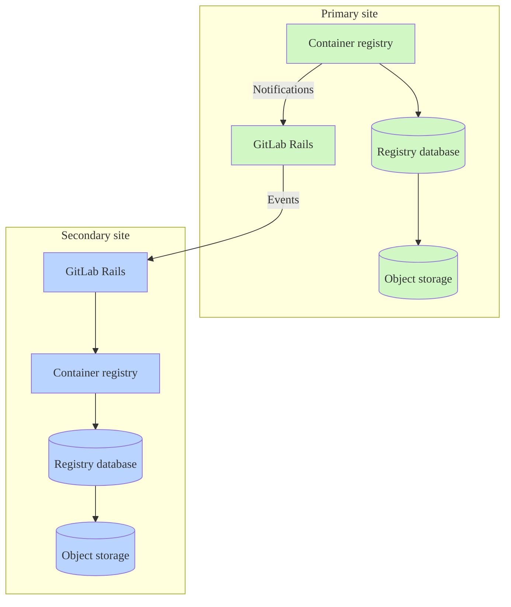



- Tier: Free, Premium, Ultimate
- Offering: GitLab Self-Managed





- [Introduced](https://gitlab.com/gitlab-org/gitlab/-/issues/423459) in GitLab 16.4 as a [beta feature](../../policy/development_stages_support.md) for GitLab Self-Managed.
- [Generally available](https://gitlab.com/gitlab-org/gitlab/-/issues/423459) in GitLab 17.3.



The metadata database provides several [enhancements](#enhancements) to the container registry
that improve performance and add new features.
The work on the GitLab Self-Managed release of the registry metadata database feature
is tracked in [epic 5521](https://gitlab.com/groups/gitlab-org/-/epics/5521).

By default, the container registry uses object storage or a local file system to persist metadata
related to container images. This method to store metadata limits how efficiently
the data can be accessed, especially data spanning multiple images, such as when listing tags.
By using a database to store this data, many new features are possible, including
[online garbage collection](https://gitlab.com/gitlab-org/container-registry/-/blob/master/docs/spec/gitlab/online-garbage-collection.md)
which removes old data automatically with zero downtime.

This database works in conjunction with the storage already used by the registry, but does not replace object storage or a file system.
You must continue to maintain a storage solution even after performing a metadata import to the metadata database.

For Helm Charts installations, see [Manage the container registry metadata database](https://docs.gitlab.com/charts/charts/registry/metadata_database.html#create-the-database)
in the Helm Charts documentation.

## Enhancements

The metadata database architecture supports performance improvements, bug fixes, and new features
that are not available with legacy metadata storage. These enhancements include:

- Automatic [online garbage collection](../../user/packages/container_registry/delete_container_registry_images.md#garbage-collection)
- [Storage usage visibility](../../user/packages/container_registry/reduce_container_registry_storage.md#view-container-registry-usage) for repositories, projects, and groups
- [Image signing](../../user/packages/container_registry/_index.md#container-image-signatures)
- [Moving and renaming repositories](../../user/packages/container_registry/_index.md#move-or-rename-container-registry-repositories)
- [Protected tags](../../user/packages/container_registry/protected_container_tags.md)
- Performance improvements for [cleanup policies](../../user/packages/container_registry/reduce_container_registry_storage.md#cleanup-policy), enabling successful cleanup of large repositories
- Performance improvements for listing repository tags
- Tracking and displaying tag publish timestamps (see [issue 290949](https://gitlab.com/gitlab-org/gitlab/-/issues/290949))
- Sorting repository tags by additional attributes beyond name

Due to technical constraints of legacy metadata storage, new features are only
implemented for the metadata database version. Non-security bug fixes might be limited to the
metadata database version.

## Known limitations

- Metadata import for existing registries requires a period of read-only time.
- Geo functionality is limited. Additional features are proposed in [epic 15325](https://gitlab.com/groups/gitlab-org/-/epics/15325).
- Prior to 18.3, registry regular schema and post-deployment database migrations must be run manually when upgrading versions.
- No guarantee for registry [zero downtime during upgrades](../../update/zero_downtime.md) on multi-node Linux package environments.
- Backup and restore jobs do not include the registry database. For more information, see [Backup with metadata database](#backup-with-metadata-database).

## Metadata database feature support

You can import metadata from existing registries to the metadata database, and use online garbage collection.

Some database-enabled features are only enabled for GitLab.com and automatic database provisioning for
the registry database is not available. Review the feature support table in the [feedback issue](https://gitlab.com/gitlab-org/gitlab/-/issues/423459#supported-feature-status)
for the status of features related to the container registry database.

## Enable the metadata database for Linux package installations

Prerequisites:

- GitLab 17.5 is the minimum required version, but GitLab 18.3 or later
  is recommended due to the added improvements and easier configuration.
- PostgreSQL database [within version requirements](../../install/requirements.md#postgresql). It must be accessible from the registry node.
- If you use an external database, you must first set up the external database connection. For more information, see [Using an external database](#using-an-external-database).

Follow the instructions that match your situation:

- [New installations](#new-installations) or enabling the container registry for the first time.
- Import existing container image metadata to the metadata database:
  - [One-step import](#one-step-import). Recommended for relatively small registries or no requirement to avoid downtime.
  - [Three-step import](#three-step-import). Recommended for larger container registries.

### Before you start

- After you enable the database, you must continue to use it. The database is
  now the source of the registry metadata, disabling it after this point
  causes the registry to lose visibility on all images written to it while
  the database was active.
- [Offline garbage collection](container_registry.md#container-registry-garbage-collection) is no longer required.
  The garbage collection command included with GitLab will safely exit when the database is enabled, but third-party
  commands, such as the one provided by the upstream registry, will delete data associated with tagged images.
- Verify you have not automated offline garbage collection: especially with a third-party command.
- You can first [reduce the storage of your registry](../../user/packages/container_registry/reduce_container_registry_storage.md)
  to speed up the process.
- Back up [your container registry data](../backup_restore/backup_gitlab.md#container-registry)
  if possible.

### New installations

For installations that have never written data to the container registry, no import
is required. You must only enable the database before writing data to the registry.





To enable the database:

1. Enable the database by editing `/etc/gitlab/gitlab.rb` and setting `enabled` to `true`:

   ```ruby
   registry['database'] = {
     'enabled' => true,
   }
   ```

1. Save the file and [reconfigure GitLab](../restart_gitlab.md#reconfigure-a-linux-package-installation).





Prerequisites:

- Create an [external database](../postgresql/external.md#container-registry-metadata-database).

To enable the database:

1. Edit `/etc/gitlab/gitlab.rb` by adding your database connection details, but start with the metadata database disabled:

   ```ruby
   registry['database'] = {
     'enabled' => false,
     'host' => '<registry_database_host_placeholder_change_me>',
     'port' => 5432, # Default, but set to the port of your database instance if it differs.
     'user' => '<registry_database_username_placeholder_change_me>',
     'password' => '<registry_database_placeholder_change_me>',
     'dbname' => '<registry_database_name_placeholder_change_me>',
     'sslmode' => 'require', # See the PostgreSQL documentation for additional information https://www.postgresql.org/docs/16/libpq-ssl.html.
     'sslcert' => '</path/to/cert.pem>',
     'sslkey' => '</path/to/private.key>',
     'sslrootcert' => '</path/to/ca.pem>'
   }
   ```

1. Save the file and [reconfigure GitLab](../restart_gitlab.md#reconfigure-a-linux-package-installation).
1. [Apply database migrations](#apply-database-migrations).
1. Enable the database by editing `/etc/gitlab/gitlab.rb` and setting `enabled` to `true`:

   ```ruby
   registry['database'] = {
     'enabled' => true,
     'host' => '<registry_database_host_placeholder_change_me>',
     'port' => 5432, # Default, but set to the port of your database instance if it differs.
     'user' => '<registry_database_username_placeholder_change_me>',
     'password' => '<registry_database_placeholder_change_me>',
     'dbname' => '<registry_database_name_placeholder_change_me>',
     'sslmode' => 'require', # See the PostgreSQL documentation for additional information https://www.postgresql.org/docs/16/libpq-ssl.html.
     'sslcert' => '</path/to/cert.pem>',
     'sslkey' => '</path/to/private.key>',
     'sslrootcert' => '</path/to/ca.pem>'
   }
   ```





### Existing registries

You can import your existing container registry metadata
using either a one-step import method or three-step import method.
A few factors affect the duration of the import:

- The number of tagged images in your registry.
- The size of your existing registry data.
- The specifications of your PostgreSQL instance.
- The number of registry instances running.
- Network latency between the registry, PostgreSQL and your configured storage.

You do not need to do the following in preparation before importing:

- Allocate extra object storage or file system space: The import makes no significant writes to this storage.
- Run offline garbage collection: While not harmful, offline garbage collection does not shorten the
import enough to recoup the time spent running this command.



The metadata import only targets tagged images. Untagged and unreferenced manifests, and the layers
exclusively referenced by them, are left behind and become inaccessible. Untagged images
were never visible through the GitLab UI or API, but they can become "dangling" and
left behind in the backend. After import to the new registry, all images are subject
to continuous online garbage collection, by default deleting any untagged and unreferenced manifests
and layers that remain for longer than 24 hours.



#### How to choose the right import method

If you regularly run [offline garbage collection](container_registry.md#container-registry-garbage-collection),
use the one-step import method. This method should take a similar amount of time and is a
simpler operation compared to the three-step import method.

If your registry is too large to regularly run offline garbage collection,
use the three-step import method to minimize the amount of read-only time
significantly.

If you use an external database, make sure you set up the
external database connection before proceeding with a migration path.

For more information, see [Using an external database](#using-an-external-database).

#### One-step import



The registry must be shut down or remain in `read-only` mode during the import.
Otherwise, data written during the import becomes inaccessible or leads to inconsistencies.







1. Ensure the database is disabled in the `registry['database']` section of your `/etc/gitlab/gitlab.rb` file:

   ```ruby
   registry['database'] = {
     'enabled' => false, # Must be false!
   }
   ```

1. Ensure the registry is set to `read-only` mode.

   Edit your `/etc/gitlab/gitlab.rb` and add the `maintenance` section to the `registry['storage']` configuration.
   For example, for a `gcs` backend registry using a `gs://my-company-container-registry` bucket,
   the configuration could be:

   ```ruby
   ## Object Storage - Container Registry
   registry['storage'] = {
     'gcs' => {
       'bucket' => '<my-company-container-registry>',
       'chunksize' => 5242880
     },
     'maintenance' => {
       'readonly' => {
         'enabled' => true # Must be set to true.
       }
     }
   }
   ```

1. Save the file and [reconfigure GitLab](../restart_gitlab.md#reconfigure-a-linux-package-installation).
1. [Apply database migrations](#apply-database-migrations).
1. Run the following command:

   ```shell
   sudo -u registry gitlab-ctl registry-database import --log-to-stdout
   ```

1. If the command completed successfully, the registry is fully imported. You
   can enable the database, turn off read-only mode in the configuration, and
   start the registry service:

   ```ruby
   registry['database'] = {
     'enabled' => true, # Must be enabled now!
   }

   ## Object Storage - Container Registry
   registry['storage'] = {
     'gcs' => {
       'bucket' => '<my-company-container-registry>',
       'chunksize' => 5242880
     },
     'maintenance' => {
       'readonly' => {
         'enabled' => false
       }
     }
   }
   ```

1. Save the file and [reconfigure GitLab](../restart_gitlab.md#reconfigure-a-linux-package-installation).





Prerequisites:

- Create an [external database](../postgresql/external.md#container-registry-metadata-database).

1. Add the `database` section to your `/etc/gitlab/gitlab.rb` file, but start with the metadata database disabled:

   ```ruby
   registry['database'] = {
     'enabled' => false, # Must be false!
     'host' => '<registry_database_host_placeholder_change_me>',
     'port' => 5432, # Default, but set to the port of your database instance if it differs.
     'user' => '<registry_database_username_placeholder_change_me>',
     'password' => '<registry_database_placeholder_change_me>',
     'dbname' => '<registry_database_name_placeholder_change_me>',
     'sslmode' => 'require', # See the PostgreSQL documentation for additional information https://www.postgresql.org/docs/16/libpq-ssl.html.
     'sslcert' => '</path/to/cert.pem>',
     'sslkey' => '</path/to/private.key>',
     'sslrootcert' => '</path/to/ca.pem>'
   }
   ```

1. Ensure the registry is set to `read-only` mode.

   Edit your `/etc/gitlab/gitlab.rb` and add the `maintenance` section to the `registry['storage']` configuration.
   For example, for a `gcs` backed registry using a `gs://my-company-container-registry` bucket,
   the configuration could be:

   ```ruby
   ## Object Storage - Container Registry
   registry['storage'] = {
     'gcs' => {
       'bucket' => '<my-company-container-registry>',
       'chunksize' => 5242880
     },
     'maintenance' => {
       'readonly' => {
         'enabled' => true # Must be set to true.
       }
     }
   }
   ```

1. Save the file and [reconfigure GitLab](../restart_gitlab.md#reconfigure-a-linux-package-installation).
1. [Apply database migrations](#apply-database-migrations) if you have not done so.
1. Run the following command:

   ```shell
   sudo gitlab-ctl registry-database import
   ```

1. If the command completed successfully, the registry is now fully imported. You
   can now enable the database, turn off read-only mode in the configuration, and
   start the registry service:

   ```ruby
   registry['database'] = {
     'enabled' => true, # Must be enabled now!
     'host' => '<registry_database_host_placeholder_change_me>',
     'port' => 5432, # Default, but set to the port of your database instance if it differs.
     'user' => '<registry_database_username_placeholder_change_me>',
     'password' => '<registry_database_placeholder_change_me>',
     'dbname' => '<registry_database_name_placeholder_change_me>',
     'sslmode' => 'require', # See the PostgreSQL documentation for additional information https://www.postgresql.org/docs/16/libpq-ssl.html.
     'sslcert' => '</path/to/cert.pem>',
     'sslkey' => '</path/to/private.key>',
     'sslrootcert' => '</path/to/ca.pem>'
   }

   ## Object Storage - Container Registry
   registry['storage'] = {
     'gcs' => {
       'bucket' => '<my-company-container-registry>',
       'chunksize' => 5242880
     },
     'maintenance' => {
       'readonly' => {
         'enabled' => false
       }
     }
   }
   ```

1. Save the file and [reconfigure GitLab](../restart_gitlab.md#reconfigure-a-linux-package-installation).





You can now use the metadata database for all operations!

#### Three-step import

Follow this guide to import your existing container registry metadata.
The following procedure is recommended for larger registries (200 GiB or more) or if you are
trying to minimize downtime while completing the import.

##### Pre-import repositories (step one)

Users have reported step one import completed at [rates of 2 to 4 TB per hour](https://gitlab.com/gitlab-org/gitlab/-/issues/423459).
At the slower speed, registries with over 100TB of data could take longer than 48 hours.

You may continue to use the registry as normal while step one is being completed.





1. Ensure the database is disabled in the `database` section to your `/etc/gitlab/gitlab.rb` file:

   ```ruby
   registry['database'] = {
     'enabled' => false, # Must be false!
   }
   ```

1. Save the file and [reconfigure GitLab](../restart_gitlab.md#reconfigure-a-linux-package-installation).
1. [Apply database migrations](#apply-database-migrations).
1. Run the first step to begin the import:

   ```shell
   sudo -u registry gitlab-ctl registry-database import --step-one --log-to-stdout
   ```





Prerequisites:

- Create an [external database](../postgresql/external.md#container-registry-metadata-database).

1. Add the `database` section to your `/etc/gitlab/gitlab.rb` file, but start with the metadata database disabled:

   ```ruby
   registry['database'] = {
     'enabled' => false, # Must be false!
     'host' => '<registry_database_host_placeholder_change_me>',
     'port' => 5432, # Default, but set to the port of your database instance if it differs.
     'user' => '<registry_database_username_placeholder_change_me>',
     'password' => '<registry_database_placeholder_change_me>',
     'dbname' => '<registry_database_name_placeholder_change_me>',
     'sslmode' => 'require', # See the PostgreSQL documentation for additional information https://www.postgresql.org/docs/16/libpq-ssl.html.
     'sslcert' => '</path/to/cert.pem>',
     'sslkey' => '</path/to/private.key>',
     'sslrootcert' => '</path/to/ca.pem>'
   }
   ```

1. Save the file and [reconfigure GitLab](../restart_gitlab.md#reconfigure-a-linux-package-installation).
1. [Apply database migrations](#apply-database-migrations) if you have not done so.
1. Run the first step to begin the import:

   ```shell
   sudo gitlab-ctl registry-database import --step-one
   ```







You should try to schedule the following step as soon as possible
to reduce the amount of downtime required. Ideally, less than one week
after step one completes. Any new data written to the registry between steps one and two,
causes step two to take more time.



##### Import all repository data (step two)

This step requires the registry to be shut down or set in `read-only` mode;
however, you can expect this step to complete around 90% faster than step one.
Allow enough time for downtime while step two is being executed.





1. Ensure the registry is set to `read-only` mode.

   Edit your `/etc/gitlab/gitlab.rb` and add the `maintenance` section to the `registry['storage']`
   configuration. For example, for a `gcs` backend registry using a `gs://my-company-container-registry`
   bucket, the configuration could be:

   ```ruby
   ## Object Storage - Container Registry
   registry['storage'] = {
     'gcs' => {
       'bucket' => '<my-company-container-registry>',
       'chunksize' => 5242880
     },
     'maintenance' => {
       'readonly' => {
         'enabled' => true # Must be set to true.
       }
     }
   }
   ```

1. Save the file and [reconfigure GitLab](../restart_gitlab.md#reconfigure-a-linux-package-installation).
1. Run step two of the import:

   ```shell
   sudo -u registry gitlab-ctl registry-database import --step-two --log-to-stdout
   ```

1. If the command completed successfully, all images are now fully imported. You
   can now enable the database, turn off read-only mode in the configuration, and
   start the registry service:

   ```ruby
   registry['database'] = {
     'enabled' => true, # Must be set to true!
   }

   ## Object Storage - Container Registry
   registry['storage'] = {
     'gcs' => {
       'bucket' => '<my-company-container-registry>',
       'chunksize' => 5242880
     },
     'maintenance' => { # This section can be removed.
       'readonly' => {
         'enabled' => false
       }
     }
   }
   ```

1. Save the file and [reconfigure GitLab](../restart_gitlab.md#reconfigure-a-linux-package-installation).





1. Ensure the registry is set to `read-only` mode.

   Edit your `/etc/gitlab/gitlab.rb` and add the `maintenance` section to the `registry['storage']`
   configuration. For example, for a `gcs` backed registry using a `gs://my-company-container-registry`
   bucket, the configuration could be:

   ```ruby
   ## Object Storage - Container Registry
   registry['storage'] = {
     'gcs' => {
       'bucket' => '<my-company-container-registry>',
       'chunksize' => 5242880
     },
     'maintenance' => {
       'readonly' => {
         'enabled' => true # Must be set to true.
       }
     }
   }
   ```

1. Save the file and [reconfigure GitLab](../restart_gitlab.md#reconfigure-a-linux-package-installation).
1. Run step two of the import:

   ```shell
   sudo gitlab-ctl registry-database import --step-two
   ```

1. If the command completed successfully, all images are now fully imported. You
   can now enable the database, turn off read-only mode in the configuration, and
   start the registry service:

   ```ruby
   registry['database'] = {
     'enabled' => true, # Must be set to true!
     'host' => '<registry_database_host_placeholder_change_me>',
     'port' => 5432, # Default, but set to the port of your database instance if it differs.
     'user' => '<registry_database_username_placeholder_change_me>',
     'password' => '<registry_database_placeholder_change_me>',
     'dbname' => '<registry_database_name_placeholder_change_me>',
     'sslmode' => 'require', # See the PostgreSQL documentation for additional information https://www.postgresql.org/docs/16/libpq-ssl.html.
     'sslcert' => '</path/to/cert.pem>',
     'sslkey' => '</path/to/private.key>',
     'sslrootcert' => '</path/to/ca.pem>'
   }

   ## Object Storage - Container Registry
   registry['storage'] = {
     'gcs' => {
       'bucket' => '<my-company-container-registry>',
       'chunksize' => 5242880
     },
     'maintenance' => { # This section can be removed.
       'readonly' => {
         'enabled' => false
       }
     }
   }
   ```

1. Save the file and [reconfigure GitLab](../restart_gitlab.md#reconfigure-a-linux-package-installation).





You can now use the metadata database for all operations!

##### Import remaining data (step three)

Even though the registry is now fully using the database for its metadata, it
does not yet have access to any potentially unused layer blobs, preventing these
blobs from being removed by the online garbage collector.

You may continue to use the registry as normal while step three is being completed.

To complete the process, run the final step of the migration:





```shell
sudo -u registry gitlab-ctl registry-database import --step-three --log-to-stdout
```





```shell
sudo gitlab-ctl registry-database import --step-three
```





After that command exists successfully, registry metadata is now fully imported to the database.

#### Restore interrupted imports



- [Introduced](https://gitlab.com/gitlab-org/container-registry/-/issues/1162) in GitLab 18.5.



Skip repositories that you pre-imported within the last 72 hours to resume
interrupted imports. Repositories are pre-imported either:

- By completing step one of the three-step import process
- By completing the one-step import process

To restore interrupted imports, configure the `--pre-import-skip-recent` flag. Defaults to 72 hours.

For example:

```shell
# Skip repositories imported within 6 hours from the start of the import command
--pre-import-skip-recent 6h

# Disable skipping behavior
--pre-import-skip-recent 0
```

For more information about valid duration units, see [Go duration strings](https://pkg.go.dev/time#ParseDuration).

#### Post import

It may take approximately 48 hours post import to see your registry storage
decrease. This is a normal and expected part of online garbage collection, as this
delay ensures that online garbage collection does not interfere with image pushes.
Check out the [monitor online garbage collection](#online-garbage-collection-monitoring) section
to see how to monitor the progress and health of the online garbage collector.

## Database migrations

The container registry supports two types of migrations:

- Regular schema migrations: Changes to the database structure that must run before deploying new application code, also known as pre-deployment migrations. These should be fast (no more than a few minutes) to avoid deployment delays.

- Post-deployment migrations: Changes to the database structure that can run while the application is running. Used for longer operations like creating indexes on large tables, avoiding startup delays and extended upgrade downtime.

By default, the registry applies both regular schema and post-deployment migrations simultaneously.
To reduce downtime during upgrades, you can skip post-deployment migrations and apply them manually after the application starts.

### Apply database migrations

To apply both regular schema and post-deployment migrations before the application starts:

1. Run database migrations:

   ```shell
   sudo -u registry gitlab-ctl registry-database migrate up
   ```

To skip post-deployment migrations:

1. Run regular schema migrations only:

   ```shell
   sudo -u registry gitlab-ctl registry-database migrate up --skip-post-deployment
   ```

   As an alternative to the `--skip-post-deployment` flag, you can also set the `SKIP_POST_DEPLOYMENT_MIGRATIONS` environment variable to `true`:

   ```shell
   SKIP_POST_DEPLOYMENT_MIGRATIONS=true sudo -u registry gitlab-ctl registry-database migrate up
   ```

1. After starting the application, apply any pending post-deployment migrations:

   ```shell
   sudo -u registry gitlab-ctl registry-database migrate up
   ```



The `migrate up` command offers some extra flags that can be used to control how the migrations are applied.
Run `sudo gitlab-ctl registry-database migrate up --help` for details.



## Online garbage collection monitoring

The initial runs of online garbage collection following the import process varies
in duration based on the number of imported images. You should monitor the efficiency and
health of your online garbage collection during this period.

### Monitor database performance

After completing an import, expect the database to experience a period of high load as
the garbage collection queues drain. This high load is caused by a high number of individual database calls
from the online garbage collector processing the queued tasks.

Regularly check PostgreSQL and registry logs for any errors or warnings. In the registry logs,
pay special attention to logs filtered by `component=registry.gc.*`.

### Track metrics

Use monitoring tools like Prometheus and Grafana to visualize and track garbage collection metrics,
focusing on metrics with a prefix of `registry_gc_*`. These include the number of objects
marked for deletion, objects successfully deleted, run intervals, and durations.
See [enable the registry debug server](container_registry_troubleshooting.md#enable-the-registry-debug-server)
for how to enable Prometheus.

### Queue monitoring

Check the size of the queues by counting the rows in the `gc_blob_review_queue` and
`gc_manifest_review_queue` tables. Large queues are expected initially, with the number of rows
proportional to the number of imported blobs and manifests. The queues should reduce over time,
indicating that garbage collection is successfully reviewing jobs.

```sql
SELECT COUNT(*) FROM gc_blob_review_queue;
SELECT COUNT(*) FROM gc_manifest_review_queue;
```

Interpreting Queue Sizes:

- Shrinking queues: Indicate garbage collection is successfully processing tasks.
- Near-Zero `gc_manifest_review_queue`: Most images flagged for potential deletion
  have been reviewed and classified either as still in use or removed.
- Overdue Tasks: Check for overdue GC tasks by running the following queries:

  ```sql
  SELECT COUNT(*) FROM gc_blob_review_queue WHERE review_after < NOW();
  SELECT COUNT(*) FROM gc_manifest_review_queue WHERE review_after < NOW();
  ```

  A high number of overdue tasks indicates a problem. Large queue sizes are not concerning
  as long as they are decreasing over time and the number of overdue tasks
  is close to zero. A high number of overdue tasks should prompt an urgent inspection of logs.

Check GC logs for messages indicating that blobs are still in use, for example `msg=the blob is not dangling`,
which implies they will not be deleted.

### Adjust blobs interval

If the size of your `gc_blob_review_queue` is high, and you want to increase the frequency between
the garbage collection blob or manifest worker runs, update your interval configuration
from the default (`5s`) to `1s`:

```ruby
registry['gc'] = {
  'blobs' => {
    'interval' => '1s'
  },
  'manifests' => {
    'interval' => '1s'
  }
}
```

After the import load has been cleared, you should fine-tune these settings for the long term
to avoid unnecessary CPU load on the database and registry instances. You can gradually increase
the interval to a value that balances performance and resource usage.

### Validate data consistency

To ensure data consistency after the import, use the [`crane validate`](https://github.com/google/go-containerregistry/blob/main/cmd/crane/doc/crane_validate.md)
tool. This tool checks that all image layers and manifests in your container registry
are accessible and correctly linked. By running `crane validate`, you confirm that
the images in your registry are complete and accessible, ensuring a successful import.

### Review cleanup policies

If most of your images are tagged, garbage collection won't significantly reduce storage space
because it only deletes untagged images.

Implement cleanup policies to remove unneeded tags, which eventually causes images
to be removed through garbage collection and storage space being recovered.

## Using an external database

By default, GitLab 18.3 and later preprovisions a logical database within the
main GitLab database for container registry metadata. However, you may want to
use a dedicated external database for the container registry if you want to
[scale your registry](container_registry.md#scaling-by-component).

### Steps

- Create an [external database](../postgresql/external.md#container-registry-metadata-database).

Afterward, follow the same steps for the default database, substituting your own
database values. Start with the database disabled, taking care to
enable and disable the database as instructed:

```ruby
registry['database'] = {
  'enabled' => false,
  'host' => '<registry_database_host_placeholder_change_me>',
  'port' => 5432, # Default, but set to the port of your database instance if it differs.
  'user' => '<registry_database_username_placeholder_change_me>',
  'password' => '<registry_database_placeholder_change_me>',
  'dbname' => '<registry_database_name_placeholder_change_me>',
  'sslmode' => 'require', # See the PostgreSQL documentation for additional information https://www.postgresql.org/docs/16/libpq-ssl.html.
  'sslcert' => '</path/to/cert.pem>',
  'sslkey' => '</path/to/private.key>',
  'sslrootcert' => '</path/to/ca.pem>'
}
```



When using an external database, omit the `-u registry` option from the
commands throughout this documentation.



## Backup with metadata database



If you have configured your own database for container registry metadata,
you must manage backups manually. `gitlab-backup` does not backup the metadata database.
For progress on automatic database backups see [issue 532507](https://gitlab.com/gitlab-org/gitlab/-/issues/532507).



When the metadata database is enabled, backups must capture both the object storage
used by the registry, as before, but also the database. Backups of object storage
and the database should be coordinated to capture the state of the registry as close as possible
to each other. To restore the registry, you must apply both backups together.

## Downgrade a registry

To downgrade the registry to a previous version after the import is complete,
you must restore to a backup of the desired version in order to downgrade.

## Database architecture with Geo

When using GitLab Geo with the container registry, you must configure separate database and
object storage stacks for the registry at each site. Geo replication to the
container registry uses events generated from registry notifications,
rather than by database replication.

### Prerequisites

Each Geo site requires a separate, site-specific:

1. PostgreSQL instance for the container registry database.
1. Object storage instance for the container registry.
1. Container registry configured to use these site-specific resources.

This diagram illustrates the data flow and basic architecture:



Use separate database instances on each site because:

1. The main GitLab database is replicated to the secondary site as read-only.
1. This replication cannot be selectively disabled for the registry database.
1. The container registry requires write access to its database at both sites.
1. Homogeneous setups ensure the greatest parity between Geo sites.

## Revert to object storage metadata

You can revert your registry to use object storage metadata after completing a metadata import.



When you revert to object storage metadata, any container images, tags, or repositories
added or deleted between the import completion and this revert operation are not available.



To revert to object storage metadata:

1. Restore a [backup](../backup_restore/backup_gitlab.md#container-registry) taken before the migration.
1. Add the following configuration to your `/etc/gitlab/gitlab.rb` file:

   ```ruby
   registry['database'] = {
     'enabled' => false,
   }
   ```

1. Save the file and [reconfigure GitLab](../restart_gitlab.md#reconfigure-a-linux-package-installation).

## Troubleshooting

### Error: `there are pending database migrations`

If the registry has been updated and there are pending schema migrations,
the registry fails to start with the following error message:

```shell
FATA[0000] configuring application: there are pending database migrations, use the 'registry database migrate' CLI command to check and apply them
```

To fix this issue, follow the steps to [apply database migrations](#apply-database-migrations).

Prior to version 18.3, you must manually apply database migrations on each version upgrade.

### Error: `offline garbage collection is no longer possible`

If the registry uses the metadata database and you try to run
[offline garbage collection](container_registry.md#container-registry-garbage-collection),
the registry fails with the following error message:

```shell
ERRO[0000] this filesystem is managed by the metadata database, and offline garbage collection is no longer possible, if you are not using the database anymore, remove the file at the lock_path in this log message lock_path=/docker/registry/lockfiles/database-in-use
```

You must either:

- Stop using offline garbage collection.
- If you no longer use the metadata database, delete the indicated lock file at the `lock_path` shown in the error message.
  For example, remove the `/docker/registry/lockfiles/database-in-use` file.

### Error: `cannot execute <STATEMENT> in a read-only transaction`

The registry could fail to [apply database migrations](#apply-database-migrations)
with the following error message:

```shell
err="ERROR: cannot execute CREATE TABLE in a read-only transaction (SQLSTATE 25006)"
```

Also, the registry could fail with the following error message if you try to run
[online garbage collection](container_registry.md#performing-garbage-collection-without-downtime):

```shell
error="processing task: fetching next GC blob task: scanning GC blob task: ERROR: cannot execute SELECT FOR UPDATE in a read-only transaction (SQLSTATE 25006)"
```

You must verify that read-only transactions are disabled by checking the values of
`default_transaction_read_only` and `transaction_read_only` in the PostgreSQL console.
For example:

```sql
# SHOW default_transaction_read_only;
 default_transaction_read_only
 -------------------------------
 on
(1 row)

# SHOW transaction_read_only;
 transaction_read_only
 -----------------------
 on
(1 row)
```

If either of these values is set to `on`, you must disable it:

1. Edit your `postgresql.conf` and set the following value:

   ```shell
   default_transaction_read_only=off
   ```

1. Restart your Postgres server to apply these settings.
1. Try to [apply database migrations](#apply-database-migrations) again, if applicable.
1. Restart the registry `sudo gitlab-ctl restart registry`.

### Error: `cannot import all repositories while the tags table has entries`

If you try to [import existing registry metadata](#existing-registries) and encounter the following error:

```shell
ERRO[0000] cannot import all repositories while the tags table has entries, you must truncate the table manually before retrying,
see https://docs.gitlab.com/ee/administration/packages/container_registry_metadata_database.html#troubleshooting
common_blobs=true dry_run=false error="tags table is not empty"
```

This error happens when there are existing entries in the `tags` table of the registry database,
which can happen if you:

- Attempted the [one step import](#one-step-import) and encountered errors.
- Attempted the [three-step import](#three-step-import) process and encountered errors.
- Stopped the import process on purpose.
- Tried to run the import again after any of the previous actions.
- Ran the import against the wrong configuration file.

To resolve this issue, you must delete the existing entries in the tags table.
You must truncate the table manually on your PostgreSQL instance:

1. Edit `/etc/gitlab/gitlab.rb` and ensure the metadata database is disabled:

   ```ruby
   registry['database'] = {
     'enabled' => false,
   }
   ```

1. Connect to your registry database using a PostgreSQL client.
1. Truncate the `tags` table to remove all existing entries:

   ```sql
   TRUNCATE TABLE tags RESTART IDENTITY CASCADE;
   ```

1. After truncating the `tags` table, try running the import process again.

### Error: `database-in-use lockfile exists`

If you try to [import existing registry metadata](#existing-registries) and encounter the following error:

```shell
|  [0s] step two: import tags failed to import metadata: importing all repositories: 1 error occurred:
    * could not restore lockfiles: database-in-use lockfile exists
```

This error means that you have previously imported the registry and completed importing all
repository data (step two) and the `database-in-use` exists in the registry file system.
You should not run the importer again if you encounter this issue.

If you must proceed, you must delete the `database-in-use` lock file manually from the file system.
The file is located at `/path/to/rootdirectory/docker/registry/lockfiles/database-in-use`.

### Error: `pre importing all repositories: AccessDenied:`

You might receive an `AccessDenied` error when [importing existing registries](#existing-registries)
and using AWS S3 as your storage backend:

```shell
/opt/gitlab/embedded/bin/registry database import --step-one /var/opt/gitlab/registry/config.yml
  [0s] step one: import manifests
  [0s] step one: import manifests failed to import metadata: pre importing all repositories: AccessDenied: Access Denied
```

Ensure that the user executing the command has the
correct [permission scopes](https://docker-docs.uclv.cu/registry/storage-drivers/s3/#s3-permission-scopes).

### Registry fails to start due to metadata management issues

The registry could fail to start with of the following errors:

#### Error: `registry filesystem metadata in use, please import data before enabling the database`

This error happens when the database is enabled in your configuration `registry['database'] = { 'enabled' => true}`
but you have not [imported existing registry metadata](#existing-registries) to the metadata database yet.

#### Error: `registry metadata database in use, please enable the database`

This error happens when you have completed the [import of existing registry metadata](#existing-registries) to the metadata database,
but you have not enabled the database in your configuration.

#### Problems checking or creating the lock files

If you encounter any of the following errors:

- `could not check if filesystem metadata is locked`
- `could not check if database metadata is locked`
- `failed to mark filesystem for database only usage`
- `failed to mark filesystem only usage`

The registry cannot access the configured `rootdirectory`. This error is unlikely to happen if you
had a working registry previously. Review the error logs for any misconfiguration issues.

### Storage usage not decreasing after deleting tags

By default, the online garbage collector will only start deleting unreferenced layers 48 hours from the time
that all tags they were associated with were deleted. This delay ensures that the garbage collector does
not interfere with long-running or interrupted image pushes, as layers are pushed to the registry before
they are associated with an image and tag.

### Error: `permission denied for schema public (SQLSTATE 42501)`

During a registry migration, you might get one of the following errors:

- `ERROR: permission denied for schema public (SQLSTATE 42501)`
- `ERROR: relation "public.blobs" does not exist (SQLSTATE 42P01)`

These types of errors are due to a change in PostgreSQL 15+, which removes the default CREATE privileges on the public schema for security reasons.
By default, only database owners can create objects in the public schema in PostgreSQL 15+.

To resolve the error, run the following command to give a registry user owner privileges of the registry database:

```sql
ALTER DATABASE <registry_database_name> OWNER TO <registry_user>;
```

This gives the registry user the necessary permissions to create tables and run migrations successfully.
