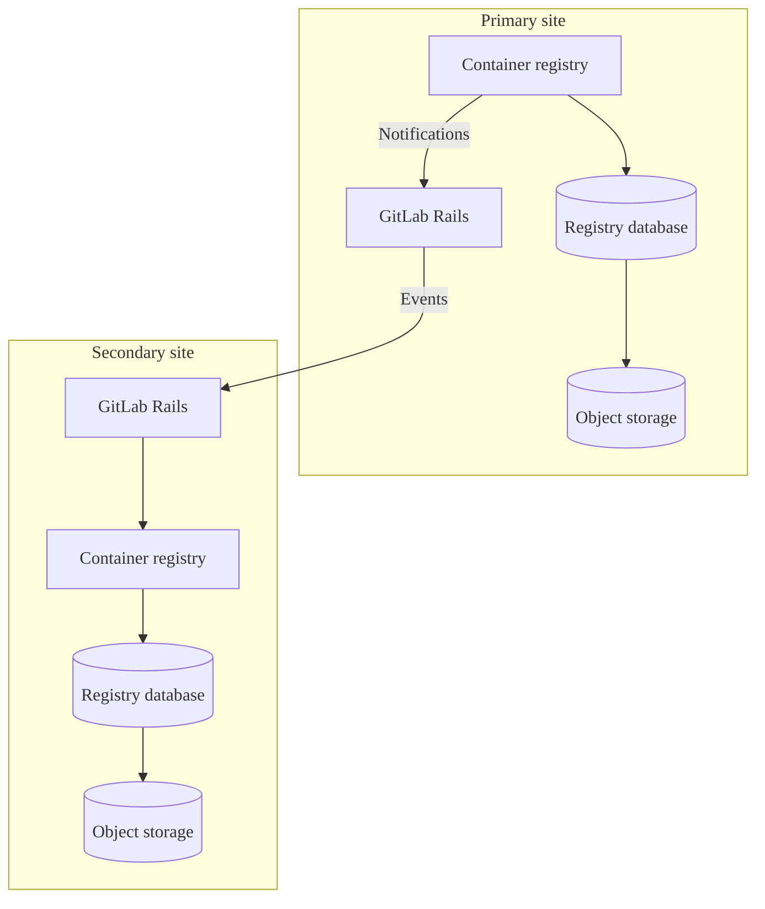



- Tier: Free, Premium, Ultimate
- Offering: GitLab Self-Managed





- [Enabled on GitLab Self-Managed](https://gitlab.com/gitlab-org/gitlab/-/issues/423459) as a [beta feature](../../policy/development_stages_support.md) in GitLab 16.4.
- [Generally available](https://gitlab.com/gitlab-org/gitlab/-/issues/423459) in GitLab 17.3.



The metadata database provides several [enhancements](#enhancements) to the container registry
that improve performance and add new features.
The work on the GitLab Self-Managed release of the registry metadata database feature
is tracked in [epic 5521](https://gitlab.com/groups/gitlab-org/-/epics/5521).

By default, the container registry uses object storage or a local file system to persist metadata
related to container images. This method to store metadata limits how efficiently
the data can be accessed, especially data spanning multiple images, such as when listing tags.
By using a database to store this data, many new features are possible, including
[online garbage collection](https://gitlab.com/gitlab-org/container-registry/-/blob/master/docs/spec/gitlab/online-garbage-collection.md)
which removes old data automatically with zero downtime.

This database works in conjunction with the storage already used by the registry, but does not replace object storage or a file system.
You must continue to maintain a storage solution even after performing a metadata import to the metadata database.

For Helm Charts installations, see [Manage the container registry metadata database](https://docs.gitlab.com/charts/charts/registry/metadata_database/#create-the-database)
in the Helm Charts documentation.

## Enhancements

The metadata database architecture supports performance improvements, bug fixes, and new features
that are not available with legacy metadata storage. These enhancements include:

- Automatic [online garbage collection](../../user/packages/container_registry/delete_container_registry_images.md#garbage-collection)
- [Storage usage visibility](../../user/packages/container_registry/reduce_container_registry_storage.md#view-container-registry-usage) for repositories, projects, and groups
- [Image signing](../../user/packages/container_registry/_index.md#container-image-signatures)
- [Moving and renaming repositories](../../user/packages/container_registry/_index.md#move-or-rename-container-registry-repositories)
- [Protected tags](../../user/packages/container_registry/protected_container_tags.md)
- Performance improvements for [cleanup policies](../../user/packages/container_registry/reduce_container_registry_storage.md#cleanup-policy), enabling successful cleanup of large repositories
- Performance improvements for listing repository tags
- Tracking and displaying tag publish timestamps (see [issue 290949](https://gitlab.com/gitlab-org/gitlab/-/issues/290949))
- Sorting repository tags by additional attributes beyond name

Due to technical constraints of legacy metadata storage, new features are only
implemented for the metadata database version. Non-security bug fixes might be limited to the
metadata database version.

## Known limitations

- Metadata import for existing registries requires a period of read-only time.
- Prior to 18.3, registry regular schema and post-deployment database migrations must be run manually when upgrading versions.
- No guarantee for registry [zero downtime during upgrades](../../update/zero_downtime.md) on multi-node Linux package environments.
- Backup and restore jobs do not include the registry database. For more information, see [Backup with metadata database](#backup-with-metadata-database).
- During metadata imports for existing registries, the `createdAt` and `publishedAt` timestamp values for image tags are set to the import date. This is intentional to ensure consistency, because the legacy registry does not collect tag published dates for all images. While some images have build dates in their metadata, many do not. For more information, see [issue 1384](https://gitlab.com/gitlab-org/container-registry/-/issues/1384).

## Metadata database feature support

You can import metadata from existing registries to the metadata database, and use online garbage collection.

Some database-enabled features are only enabled for GitLab.com and automatic database provisioning for
the registry database is not available. Review the feature support table in the [feedback issue](https://gitlab.com/gitlab-org/gitlab/-/issues/423459#supported-feature-status)
for the status of features related to the container registry database.

## Enable the metadata database for Linux package installations

Prerequisites:

- GitLab 17.5 is the minimum required version, but GitLab 18.3 or later
  is recommended due to the added improvements and easier configuration.
- PostgreSQL database [within version requirements](../../install/requirements.md#postgresql). It must be accessible from the registry node.
- If you use an external database, you must first set up the external database connection. For more information, see [Using an external database](#using-an-external-database).

### Before you start

- After you enable the database, you must continue to use it. The database is
  now the source of the registry metadata, disabling it after this point
  causes the registry to lose visibility on all images written to it while
  the database was active.
- [Offline garbage collection](container_registry.md#container-registry-garbage-collection) is no longer required.
  The garbage collection command included with GitLab will safely exit when the database is enabled, but third-party
  commands, such as the one provided by the upstream registry, will delete data associated with tagged images.
- Verify you have not automated offline garbage collection: especially with a third-party command.
- You can first [reduce the storage of your registry](../../user/packages/container_registry/reduce_container_registry_storage.md)
  to speed up the process.
- Back up [your container registry data](../backup_restore/backup_gitlab.md#container-registry)
  if possible.

### Enable the database for new installations

For installations that have never written data to the container registry, no import
is required. You must only enable the database before writing data to the registry.

For more information, see the instructions for [new installations](container_registry_metadata_database_new_install.md).

### Enable the database for existing registries

You can import your existing container registry metadata
using either a one-step import method or three-step import method.
A few factors affect the duration of the import:

- The number of tagged images in your registry.
- The size of your existing registry data.
- The specifications of your PostgreSQL instance.
- The number of registry instances running.
- Network latency between the registry, PostgreSQL and your configured storage.

You do not need to do the following in preparation before importing:

- Allocate extra object storage or file system space: The import makes no significant writes to this storage.
- Run offline garbage collection: While not harmful, offline garbage collection does not shorten the
  import enough to recoup the time spent running this command.

> [!note]
> The metadata import only targets tagged images. Untagged and unreferenced manifests, and the layers
> exclusively referenced by them, are left behind and become inaccessible. Untagged images
> were never visible through the GitLab UI or API, but they can become "dangling" and
> left behind in the backend. After import to the new registry, all images are subject
> to continuous online garbage collection, by default deleting any untagged and unreferenced manifests
> and layers that remain for longer than 24 hours.

#### How to choose the right import method

If you regularly run [offline garbage collection](container_registry.md#container-registry-garbage-collection),
use the [one-step import](container_registry_metadata_database_one_step_import.md) method.
This method should take a similar amount of time and is a simpler operation compared to the three-step import method.

If your registry is too large to regularly run offline garbage collection,
use the [three-step import](container_registry_metadata_database_three_step_import.md)
method to minimize the amount of read-only time significantly.

If you use an external database, make sure you set up the
external database connection before proceeding with a migration path.

For more information, see [Using an external database](#using-an-external-database).

#### Restore interrupted imports



- [Introduced](https://gitlab.com/gitlab-org/container-registry/-/issues/1162) in GitLab 18.5.



Skip repositories that you pre-imported within the last 72 hours to resume
interrupted imports. Repositories are pre-imported either:

- By completing step one of the three-step import process
- By completing the one-step import process

To restore interrupted imports, configure the `--pre-import-skip-recent` flag. Defaults to 72 hours.

For example:

```shell
# Skip repositories imported within 6 hours from the start of the import command
--pre-import-skip-recent 6h

# Disable skipping behavior
--pre-import-skip-recent 0
```

For more information about valid duration units, see [Go duration strings](https://pkg.go.dev/time#ParseDuration).

#### Post import

It may take approximately 48 hours post import to see your registry storage
decrease. This is a normal and expected part of online garbage collection, as this
delay ensures that online garbage collection does not interfere with image pushes.
Check out the [monitor online garbage collection](#online-garbage-collection-monitoring) section
to see how to monitor the progress and health of the online garbage collector.

## Database migrations

The container registry supports two types of migrations:

- Regular schema migrations: Changes to the database structure that must run before deploying new application code, also known as pre-deployment migrations. These should be fast (no more than a few minutes) to avoid deployment delays.

- Post-deployment migrations: Changes to the database structure that can run while the application is running. Used for longer operations like creating indexes on large tables, avoiding startup delays and extended upgrade downtime.

By default, the registry applies both regular schema and post-deployment migrations simultaneously.
To reduce downtime during upgrades, you can skip post-deployment migrations and apply them manually after the application starts.

### Apply database migrations

To apply both regular schema and post-deployment migrations before the application starts:

1. Run database migrations:

   ```shell
   sudo -u registry gitlab-ctl registry-database migrate up
   ```

To skip post-deployment migrations:

1. Run regular schema migrations only:

   ```shell
   sudo -u registry gitlab-ctl registry-database migrate up --skip-post-deployment
   ```

   As an alternative to the `--skip-post-deployment` flag, you can also set the `SKIP_POST_DEPLOYMENT_MIGRATIONS` environment variable to `true`:

   ```shell
   SKIP_POST_DEPLOYMENT_MIGRATIONS=true sudo -u registry gitlab-ctl registry-database migrate up
   ```

1. After starting the application, apply any pending post-deployment migrations:

   ```shell
   sudo -u registry gitlab-ctl registry-database migrate up
   ```

> [!note]
> The `migrate up` command offers some extra flags that can be used to control how the migrations are applied.
> Run `sudo gitlab-ctl registry-database migrate up --help` for details.

## Online garbage collection monitoring

The initial runs of online garbage collection following the import process varies
in duration based on the number of imported images. You should monitor the efficiency and
health of your online garbage collection during this period.

### Monitor database performance

After completing an import, expect the database to experience a period of high load as
the garbage collection queues drain. This high load is caused by a high number of individual database calls
from the online garbage collector processing the queued tasks.

Regularly check PostgreSQL and registry logs for any errors or warnings. In the registry logs,
pay special attention to logs filtered by `component=registry.gc.*`.

### Track metrics

Use monitoring tools like Prometheus and Grafana to visualize and track garbage collection metrics,
focusing on metrics with a prefix of `registry_gc_*`. These include the number of objects
marked for deletion, objects successfully deleted, run intervals, and durations.
See [enable the registry debug server](container_registry_troubleshooting.md#enable-the-registry-debug-server)
for how to enable Prometheus.

### Monitor task queues

Monitor the health and status of garbage collection task queues for blobs and manifests.

#### Check the health of online garbage collection

The following queries return tasks that were retried more than 10 times,
or were eligible for review for longer than 24 hours. The online garbage collector should
pick up an item for review within 24 hours with few failed attempts. If any rows are returned,
investigate the health of your online garbage collector.

For manifests:

```sql
SELECT
  repository_id,
  manifest_id,
  ROUND(
    EXTRACT(
      EPOCH
      FROM
        AGE(NOW(), review_after)
    ) / 3600
  ) AS hours_eligible_for_review,
  review_count as failed_review_attempts,
  event
FROM
  gc_manifest_review_queue
WHERE
  review_after < NOW() - INTERVAL '24 hours'
  OR review_count > 10
LIMIT
  20;
```

For blobs:

```sql
SELECT
  substring(encode(digest, 'hex'), 3) AS digest,
  ROUND(
    EXTRACT(
      EPOCH
      FROM
        AGE(NOW(), review_after)
    ) / 3600
  ) AS hours_eligible_for_review,
  review_count as failed_review_attempts,
  event
FROM
  gc_blob_review_queue
WHERE
  review_after < NOW() - INTERVAL '24 hours'
  OR review_count > 10
LIMIT
  20;
```

If these queries return any rows, check the registry logs for messages related
to garbage collection. Filter for entries by `component="registry.gc.*` and
investigate any error messages.

The unfiltered size of the `gc_manifest_review_queue` and `gc_blob_review_queue`
are not good indicators of the health of the online garbage collector.
These queues never fully clear for an active registry.

Large amounts of tasks eligible for review are also not necessarily a cause for concern.
The garbage collector might be working through items caused by a spike in activity.

Similarly, the `created_at` date of these tasks alone is not good health indicator.
When an event adds the same blob or manifest to the queue, the `review_after`
of the existing task is updated, which postpones the review. No duplicate task is created.

This can occur any number of times, so
tasks created months ago are not a cause for concern.

#### Informational queries related to online garbage collection

Check the number of tasks eligible for review by running the following queries:

  ```sql
  SELECT COUNT(*) FROM gc_blob_review_queue WHERE review_after < NOW();
  SELECT COUNT(*) FROM gc_manifest_review_queue WHERE review_after < NOW();
  ```

Generally, these queries should return relatively low counts, often nearing zero.
However, these queries might return larger values if:

- An import was started 24 to 48 hours ago
- Large amounts of tags were deleted or a container repository was removed
- Online garbage collection was disabled for an extended period

### Adjust the garbage collector worker interval

If the number of tasks eligible for review remains high, and you want to increase the frequency
between the garbage collection blob or manifest worker runs, update your
interval configuration from the default (`5s`) to `1s`:

```ruby
registry['gc'] = {
  'blobs' => {
    'interval' => '1s'
  },
  'manifests' => {
    'interval' => '1s'
  }
}
```

After the import load has been cleared, you should fine-tune these settings for the long term
to avoid unnecessary CPU load on the database and registry instances. You can gradually increase
the interval to a value that balances performance and resource usage.

### Validate data consistency

To ensure data consistency after the import, use the [`crane validate`](https://github.com/google/go-containerregistry/blob/main/cmd/crane/doc/crane_validate.md)
tool. This tool checks that all image layers and manifests in your container registry
are accessible and correctly linked. By running `crane validate`, you confirm that
the images in your registry are complete and accessible, ensuring a successful import.

### Review cleanup policies

If most of your images are tagged, garbage collection won't significantly reduce storage space
because it only deletes untagged images.

Implement cleanup policies to remove unneeded tags, which eventually causes images
to be removed through garbage collection and storage space being recovered.

## Using an external database

By default, GitLab 18.3 and later preprovisions a logical database within the
main GitLab database for container registry metadata. However, you may want to
use a dedicated external database for the container registry if you want to
[scale your registry](container_registry.md#scaling-by-component).

### Steps

- Create an [external database](../postgresql/external.md#container-registry-metadata-database).

Afterward, follow the same steps for the default database, substituting your own
database values. Start with the database disabled, taking care to
enable and disable the database as instructed:

```ruby
registry['database'] = {
  'enabled' => false,
  'host' => '<registry_database_host_placeholder_change_me>',
  'port' => 5432, # Default, but set to the port of your database instance if it differs.
  'user' => '<registry_database_username_placeholder_change_me>',
  'password' => '<registry_database_placeholder_change_me>',
  'dbname' => '<registry_database_name_placeholder_change_me>',
  'sslmode' => 'require', # See the PostgreSQL documentation for additional information https://www.postgresql.org/docs/16/libpq-ssl.html.
  'sslcert' => '</path/to/cert.pem>',
  'sslkey' => '</path/to/private.key>',
  'sslrootcert' => '</path/to/ca.pem>'
}
```

> [!note]
> When using an external database, omit the `-u registry` option from the
> commands throughout this documentation.

## Backup with metadata database

> [!note]
> If you have configured your own database for container registry metadata,
> you must manage backups manually. `gitlab-backup` does not backup the metadata database.
> For progress on automatic database backups see [issue 532507](https://gitlab.com/gitlab-org/gitlab/-/issues/532507).

When the metadata database is enabled, backups must capture both the object storage
used by the registry, as before, but also the database. Backups of object storage
and the database should be coordinated to capture the state of the registry as close as possible
to each other. To restore the registry, you must apply both backups together.

## Downgrade a registry

To downgrade the registry to a previous version after the import is complete,
you must restore to a backup of the desired version in order to downgrade.

## Database architecture with Geo

When using GitLab Geo with the container registry, you must configure separate database and
object storage stacks for the registry at each site. Geo replication to the
container registry uses events generated from registry notifications,
rather than by database replication.

### Prerequisites

Each Geo site requires a separate, site-specific:

1. PostgreSQL instance for the container registry database.
1. Object storage instance for the container registry.
1. Container registry configured to use these site-specific resources.

This diagram illustrates the data flow and basic architecture:



Use separate database instances on each site because:

1. The main GitLab database is replicated to the secondary site as read-only.
1. This replication cannot be selectively disabled for the registry database.
1. The container registry requires write access to its database at both sites.
1. Homogeneous setups ensure the greatest parity between Geo sites.

## Revert to object storage metadata

You can revert your registry to use object storage metadata after completing a metadata import.

> [!warning]
> When you revert to object storage metadata, any container images, tags, or repositories
> added or deleted between the import completion and this revert operation are not available.

To revert to object storage metadata:

1. Restore a [backup](../backup_restore/backup_gitlab.md#container-registry) taken before the migration.
1. Add the following configuration to your `/etc/gitlab/gitlab.rb` file:

   ```ruby
   registry['database'] = {
     'enabled' => false,
   }
   ```

1. Save the file and [reconfigure GitLab](../restart_gitlab.md#reconfigure-a-linux-package-installation).

## Troubleshooting

To review errors and troubleshooting solutions and workarounds, see [Troubleshooting the container registry metadata database](container_registry_metadata_database_troubleshooting.md).
