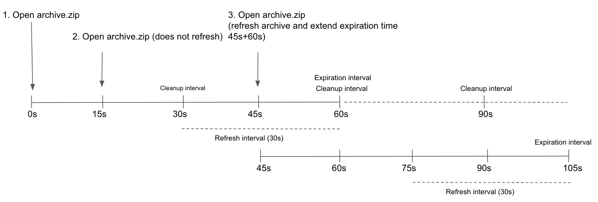

DETAILS:
**Tier:** Free, Premium, Ultimate
**Offering:** GitLab Self-Managed

GitLab Pages allows for hosting of static sites. It must be configured by an
administrator. Separate [user documentation](../../user/project/pages/_index.md) is available.

NOTE:
This guide is for Linux package installations. If you have a self-compiled GitLab installation, see
[GitLab Pages administration for self-compiled installations](source.md).

## The GitLab Pages daemon

GitLab Pages makes use of the [GitLab Pages daemon](https://gitlab.com/gitlab-org/gitlab-pages), a basic HTTP server
written in Go that can listen on an external IP address and provide support for
custom domains and custom certificates. It supports dynamic certificates through
Server Name Indication (SNI) and exposes pages using HTTP2 by default.
You are encouraged to read its [README](https://gitlab.com/gitlab-org/gitlab-pages/blob/master/README.md) to fully understand how
it works.

In the case of [custom domains](#custom-domains) (but not
[wildcard domains](#wildcard-domains)), the Pages daemon needs to listen on
ports `80` and/or `443`. For that reason, there is some flexibility in the way
which you can set it up:

- Run the Pages daemon in the same server as GitLab, listening on a **secondary IP**.
- Run the Pages daemon in a [separate server](#running-gitlab-pages-on-a-separate-server). In that case, the
  [Pages path](#change-storage-path) must also be present in the server that
  the Pages daemon is installed, so you must share it through the network.
- Run the Pages daemon in the same server as GitLab, listening on the same IP
  but on different ports. In that case, you must proxy the traffic with
  a load balancer. If you choose that route, you should use TCP load
  balancing for HTTPS. If you use TLS-termination (HTTPS-load balancing), the
  pages can't be served with user-provided certificates. For
  HTTP it's OK to use HTTP or TCP load balancing.

In this document, we proceed assuming the first option. If you are not
supporting custom domains a secondary IP is not needed.

## Prerequisites

This section describes the prerequisites for configuring GitLab Pages.

### Wildcard domains

Before configuring Pages for wildcard domains, you must:

1. Have a domain for Pages that is not a subdomain of your GitLab instance domain.

   | GitLab domain        | Pages domain        | Does it work? |
   | -------------------- | ------------------- | ------------- |
   | `example.com`        | `example.io`        | **{check-circle}** Yes |
   | `example.com`        | `pages.example.com` | **{dotted-circle}** No |
   | `gitlab.example.com` | `pages.example.com` | **{check-circle}** Yes |

1. Configure a **wildcard DNS record**.
1. Optional. Have a **wildcard certificate** for that domain if you decide to
   serve Pages under HTTPS.
1. Optional but recommended. Enable [instance runners](../../ci/runners/_index.md)
   so that your users don't have to bring their own.
1. For custom domains, have a **secondary IP**.

### Single-domain sites

Before configuring Pages for single-domain sites, you must:

1. Have a domain for Pages that is not a subdomain of your GitLab instance domain.

   | GitLab domain        | Pages domain        | Supported |
   | -------------------- | ------------------- | ------------- |
   | `example.com`        | `example.io`        | **{check-circle}** Yes |
   | `example.com`        | `pages.example.com` | **{dotted-circle}** No |
   | `gitlab.example.com` | `pages.example.com` | **{check-circle}** Yes |

1. Configure a **DNS record**.
1. Optional. If you decide to serve Pages under HTTPS, have a **TLS certificate** for that domain.
1. Optional but recommended. Enable [instance runners](../../ci/runners/_index.md)
   so that your users don't have to bring their own.
1. For custom domains, have a **secondary IP**.

NOTE:
If your GitLab instance and the Pages daemon are deployed in a private network or behind a firewall, your GitLab Pages websites are only accessible to devices/users that have access to the private network.

### Add the domain to the Public Suffix List

The [Public Suffix List](https://publicsuffix.org) is used by browsers to
decide how to treat subdomains. If your GitLab instance allows members of the
public to create GitLab Pages sites, it also allows those users to create
subdomains on the pages domain (`example.io`). Adding the domain to the Public
Suffix List prevents browsers from accepting
[supercookies](https://en.wikipedia.org/wiki/HTTP_cookie#Supercookie),
among other things.

To submit your GitLab Pages subdomain, follow [Submit amendments to the Public Suffix List](https://publicsuffix.org/submit/).
For example, if your domain is `example.io`, you should
request that `example.io` is added to the Public Suffix List. GitLab.com
added `gitlab.io` [in 2016](https://gitlab.com/gitlab-com/gl-infra/reliability/-/issues/230).

### DNS configuration

GitLab Pages expect to run on their own virtual host. In your DNS server/provider
add a [wildcard DNS `A` record](https://en.wikipedia.org/wiki/Wildcard_DNS_record) pointing to the
host that GitLab runs. For example, an entry would look like this:

```plaintext
*.example.io. 1800 IN A    192.0.2.1
*.example.io. 1800 IN AAAA 2001:db8::1
```

Where `example.io` is the domain GitLab Pages is served from,
`192.0.2.1` is the IPv4 address of your GitLab instance, and `2001:db8::1` is the
IPv6 address. If you don't have IPv6, you can omit the `AAAA` record.

#### DNS configuration for single-domain sites

> - [Introduced](https://gitlab.com/gitlab-org/gitlab/-/issues/17584) as an [experiment](../../policy/development_stages_support.md) in GitLab 16.7.
> - [Moved](https://gitlab.com/gitlab-org/gitlab/-/merge_requests/148621) to [beta](../../policy/development_stages_support.md) in GitLab 16.11.
> - [Changed](https://gitlab.com/gitlab-org/gitlab-pages/-/issues/1111) implementation from NGINX to the GitLab Pages codebase in GitLab 17.2.
> - [Generally available](https://gitlab.com/gitlab-org/gitlab/-/issues/483365) in GitLab 17.4.

To configure GitLab Pages DNS for single-domain sites without wildcard DNS:

1. Enable the GitLab Pages flag for this feature by adding
   `gitlab_pages["namespace_in_path"] = true` to `/etc/gitlab/gitlab.rb`.
1. In your DNS provider, add entries for `example.io`.
   Replace `example.io` with your domain name, and `192.0.0.0` with
   the IPv4 version of your IP address. The entries look like this:

   ```plaintext
   example.io          1800 IN A    192.0.0.0
   ```

1. Optional. If your GitLab instance has an IPv6 address, add entries for it.
   Replace `example.io` with your domain name, and `2001:db8::1` with
   the IPv6 version of your IP address. The entries look like this:

   ```plaintext
   example.io          1800 IN AAAA 2001:db8::1
   ```

This example contains the following:

- `example.io`: The domain GitLab Pages is served from.

#### DNS configuration for custom domains

If support for custom domains is needed, all subdomains of the Pages root domain should point to the
secondary IP (which is dedicated for the Pages daemon). Without this configuration, users can't use
`CNAME` records to point their custom domains to their GitLab Pages.

For example, an entry could look like this:

```plaintext
example.com   1800 IN A    192.0.2.1
*.example.io. 1800 IN A    192.0.2.2
```

This example contains the following:

- `example.com`: The GitLab domain.
- `example.io`: The domain GitLab Pages is served from.
- `192.0.2.1`: The primary IP of your GitLab instance.
- `192.0.2.2`: The secondary IP, which is dedicated to GitLab Pages. It must be different than the primary IP.

NOTE:
You should not use the GitLab domain to serve user pages. For more information see the [security section](#security).

## Configuration

Depending on your needs, you can set up GitLab Pages in 4 different ways.

The following examples are listed from the easiest setup to the most
advanced one.

### Wildcard domains

The following configuration is the minimum setup to use GitLab Pages.
It is the foundation for all other setups described here.
In this configuration:

- NGINX proxies all requests to the GitLab Pages daemon.
- The GitLab Pages daemon doesn't listen directly to the public internet.

Prerequisites:

- [Wildcard DNS setup](#dns-configuration)

To configure GitLab Pages to use wildcard domains:

1. Set the external URL for GitLab Pages in `/etc/gitlab/gitlab.rb`:

   ```ruby
   external_url "http://example.com" # external_url here is only for reference
   pages_external_url 'http://example.io' # Important: not a subdomain of external_url, so cannot be http://pages.example.com
   ```

1. [Reconfigure GitLab](../restart_gitlab.md#reconfigure-a-linux-package-installation).

The resulting URL scheme is `http://<namespace>.example.io/<project_slug>`.

<i class="fa fa-youtube-play youtube" aria-hidden="true"></i>
For an overview, see [How to Enable GitLab Pages for GitLab CE and EE](https://youtu.be/dD8c7WNcc6s).
<!-- Video published on 2017-02-22 -->

### Single-domain sites

> - [Introduced](https://gitlab.com/gitlab-org/gitlab/-/issues/17584) as an [experiment](../../policy/development_stages_support.md) in GitLab 16.7.
> - [Moved](https://gitlab.com/gitlab-org/gitlab/-/merge_requests/148621) to [beta](../../policy/development_stages_support.md) in GitLab 16.11.
> - [Changed](https://gitlab.com/gitlab-org/gitlab-pages/-/issues/1111) implementation from NGINX to the GitLab Pages codebase in GitLab 17.2.
> - [Generally available](https://gitlab.com/gitlab-org/gitlab/-/issues/483365) in GitLab 17.4.

The following configuration is the minimum setup to use GitLab Pages.
It is the foundation for all other setups described here.
In this configuration:

- NGINX proxies all requests to the GitLab Pages daemon.
- The GitLab Pages daemon doesn't listen directly to the public internet.

Prerequisites:

- You have configured DNS for
  [single-domain sites](#dns-configuration-for-single-domain-sites).

To configure GitLab Pages to use single-domain sites:

1. In `/etc/gitlab/gitlab.rb`, set the external URL for GitLab Pages, and enable the feature:

   ```ruby
   external_url "http://example.com" # Swap out this URL for your own
   pages_external_url 'http://example.io' # Important: not a subdomain of external_url, so cannot be http://pages.example.com

   # Set this flag to enable this feature
   gitlab_pages["namespace_in_path"] = true
   ```

1. [Reconfigure GitLab](../restart_gitlab.md#reconfigure-a-linux-package-installation).

The resulting URL scheme is `http://example.io/<namespace>/<project_slug>`.

WARNING:
GitLab Pages supports only one URL scheme at a time:
wildcard domains or single-domain sites.
If you enable `namespace_in_path`, existing GitLab Pages websites
are accessible only on single-domain.

### Wildcard domains with TLS support

Prerequisites:

- [Wildcard DNS setup](#dns-configuration)
- TLS certificate. Can be either Wildcard, or any other type meeting the [requirements](../../user/project/pages/custom_domains_ssl_tls_certification/_index.md#manual-addition-of-ssltls-certificates).

NGINX proxies all requests to the daemon. Pages daemon doesn't listen to the
public internet.

1. Place the wildcard TLS certificate for `*.example.io` and the key inside `/etc/gitlab/ssl`.
1. In `/etc/gitlab/gitlab.rb` specify the following configuration:

   ```ruby
   external_url "https://example.com" # external_url here is only for reference
   pages_external_url 'https://example.io' # Important: not a subdomain of external_url, so cannot be https://pages.example.com

   pages_nginx['redirect_http_to_https'] = true
   ```

1. If you haven't named your certificate and key `example.io.crt` and `example.io.key`,
   you must also add the full paths as shown below:

   ```ruby
   pages_nginx['ssl_certificate'] = "/etc/gitlab/ssl/pages-nginx.crt"
   pages_nginx['ssl_certificate_key'] = "/etc/gitlab/ssl/pages-nginx.key"
   ```

1. [Reconfigure GitLab](../restart_gitlab.md#reconfigure-a-linux-package-installation).
1. If you're using [Pages Access Control](#access-control), update the redirect URI in the GitLab Pages
   [System OAuth application](../../integration/oauth_provider.md#create-an-instance-wide-application)
   to use the HTTPS protocol.

The resulting URL scheme is `https://<namespace>.example.io/<project_slug>`.

WARNING:
Multiple wildcards for one instance is not supported. Only one wildcard per instance can be assigned.

WARNING:
GitLab Pages does not update the OAuth application if changes are made to the redirect URI.
Before you reconfigure, remove the `gitlab_pages` section from `/etc/gitlab/gitlab-secrets.json`,
then run `gitlab-ctl reconfigure`. For more information, read
[GitLab Pages does not regenerate OAuth](https://gitlab.com/gitlab-org/omnibus-gitlab/-/issues/3947).

### Single-domain sites with TLS support

> - [Introduced](https://gitlab.com/gitlab-org/gitlab/-/issues/17584) as an [experiment](../../policy/development_stages_support.md) in GitLab 16.7.
> - [Moved](https://gitlab.com/gitlab-org/gitlab/-/merge_requests/148621) to [beta](../../policy/development_stages_support.md) in GitLab 16.11.
> - [Changed](https://gitlab.com/gitlab-org/gitlab-pages/-/issues/1111) implementation from NGINX to the GitLab Pages codebase in GitLab 17.2.
> - [Generally available](https://gitlab.com/gitlab-org/gitlab/-/issues/483365) in GitLab 17.4.

Prerequisites:

- You have configured DNS for
  [single-domain sites](#dns-configuration-for-single-domain-sites).
- You have a TLS certificate that covers your domain (like `example.io`).

In this configuration, NGINX proxies all requests to the daemon. The GitLab Pages
daemon doesn't listen to the public internet:

1. Add your TLS certificate and key as mentioned in the prerequisites into `/etc/gitlab/ssl`.
1. In `/etc/gitlab/gitlab.rb`, set the external URL for GitLab Pages, and enable the feature:

   ```ruby
   external_url "https://example.com" # Swap out this URL for your own
   pages_external_url 'https://example.io' # Important: not a subdomain of external_url, so cannot be https://pages.example.com

   pages_nginx['redirect_http_to_https'] = true

   # Set this flag to enable this feature
   gitlab_pages["namespace_in_path"] = true
   ```

1. If your TLS certificate and key don't match the name of your domain, like
   `example.io.crt` and `example.io.key`,
   add the full paths for the certificate and key files to `/etc/gitlab/gitlab.rb`:

   ```ruby
   pages_nginx['ssl_certificate'] = "/etc/gitlab/ssl/pages-nginx.crt"
   pages_nginx['ssl_certificate_key'] = "/etc/gitlab/ssl/pages-nginx.key"
   ```

1. If you're using [Pages Access Control](#access-control), update the redirect URI in the GitLab Pages
   [System OAuth application](../../integration/oauth_provider.md#create-an-instance-wide-application)
   to use the HTTPS protocol.

   WARNING:
   GitLab Pages does not update the OAuth application, and
   the default `auth_redirect_uri` is updated to `https://example.io/projects/auth`.
   Before you reconfigure, remove the `gitlab_pages` section from `/etc/gitlab/gitlab-secrets.json`,
   then run `gitlab-ctl reconfigure`. For more information, see
   [GitLab Pages does not regenerate OAuth](https://gitlab.com/gitlab-org/omnibus-gitlab/-/issues/3947).

1. [Reconfigure GitLab](../restart_gitlab.md#reconfigure-a-linux-package-installation).

The resulting URL scheme is `https://example.io/<namespace>/<project_slug>`.

WARNING:
GitLab Pages supports only one URL scheme at a time:
wildcard domains or single-domain sites.
If you enable `namespace_in_path`, existing GitLab Pages websites
are accessible only as single-domain sites.

### Wildcard domains with TLS-terminating Load Balancer

Prerequisites:

- [Wildcard DNS setup](#dns-configuration)
- [TLS-terminating load balancer](../../install/aws/_index.md#load-balancer)

This setup is primarily intended to be used when [installing a GitLab POC on Amazon Web Services](../../install/aws/_index.md). This includes a TLS-terminating [classic load balancer](../../install/aws/_index.md#load-balancer) that listens for HTTPS connections, manages TLS certificates, and forwards HTTP traffic to the instance.

1. In `/etc/gitlab/gitlab.rb` specify the following configuration:

   ```ruby
   external_url "https://example.com" # external_url here is only for reference
   pages_external_url 'https://example.io' # Important: not a subdomain of external_url, so cannot be https://pages.example.com

   pages_nginx['enable'] = true
   pages_nginx['listen_port'] = 80
   pages_nginx['listen_https'] = false
   pages_nginx['redirect_http_to_https'] = true
   ```

1. [Reconfigure GitLab](../restart_gitlab.md#reconfigure-a-linux-package-installation).

The resulting URL scheme is `https://<namespace>.example.io/<project_slug>`.

### Global settings

Below is a table of all configuration settings known to Pages in a Linux package installation,
and what they do. These options can be adjusted in `/etc/gitlab/gitlab.rb`,
and take effect after you [reconfigure GitLab](../restart_gitlab.md#reconfigure-a-linux-package-installation).
Most of these settings don't have to be configured manually unless you need more granular
control over how the Pages daemon runs and serves content in your environment.

| Setting                                 | Description                                                                                                                                                                                                                                                                                                |
|-----------------------------------------|------------------------------------------------------------------------------------------------------------------------------------------------------------------------------------------------------------------------------------------------------------------------------------------------------------|
| `pages_external_url`                    | The URL where GitLab Pages is accessible, including protocol (HTTP / HTTPS). If `https://` is used, additional configuration is required. See [Wildcard domains with TLS support](#wildcard-domains-with-tls-support) and [Custom domains with TLS support](#custom-domains-with-tls-support) for details. |
| **`gitlab_pages[]`**                    |                                                                                                                                                                                                                                                                                                            |
| `access_control`                        | Whether to enable [access control](_index.md#access-control).                                                                                                                                                                                                                                               |
| `api_secret_key`                        | Full path to file with secret key used to authenticate with the GitLab API. Auto-generated when left unset.                                                                                                                                                                                                |
| `artifacts_server`                      | Enable viewing [artifacts](../cicd/job_artifacts.md) in GitLab Pages.                                                                                                                                                                                                                                           |
| `artifacts_server_timeout`              | Timeout (in seconds) for a proxied request to the artifacts server.                                                                                                                                                                                                                                        |
| `artifacts_server_url`                  | API URL to proxy artifact requests to. Defaults to GitLab `external URL` + `/api/v4`, for example `https://gitlab.com/api/v4`. When running a [separate Pages server](#running-gitlab-pages-on-a-separate-server), this URL must point to the main GitLab server's API.                                    |
| `auth_redirect_uri`                     | Callback URL for authenticating with GitLab. URL should be subdomain of `pages_external_url` + `/auth`. Defaults to project's subdomain of `pages_external_url` + `/auth`, for example `https://projects.example.io/auth`. When `namespace_in_path` is enabled, defaults to `pages_external_url` + `/projects/auth`, for example `https://example.io/projects/auth`.  |
| `auth_secret`                           | Secret key for signing authentication requests. Leave blank to pull automatically from GitLab during OAuth registration.                                                                                                                                                                                   |
| `client_cert`                           | Client certificate used for mutual TLS with the GitLab API. See [Support mutual TLS when calling the GitLab API](#support-mutual-tls-when-calling-the-gitlab-api) for details.                                                                                                                             |
| `client_key`                            | Client key used for mutual TLS with the GitLab API. See [Support mutual TLS when calling the GitLab API](#support-mutual-tls-when-calling-the-gitlab-api) for details.                                                                                                                                     |
| `client_ca_certs`                       | Root CA certificates used to sign client certificate used for mutual TLS with the GitLab API. See [Support mutual TLS when calling the GitLab API](#support-mutual-tls-when-calling-the-gitlab-api) for details.                                                                                           |
| `dir`                                   | Working directory for configuration and secrets files.                                                                                                                                                                                                                                                     |
| `enable`                                | Enable or disable GitLab Pages on the current system.                                                                                                                                                                                                                                                      |
| `external_http`                         | Configure Pages to bind to one or more secondary IP addresses, serving HTTP requests. Multiple addresses can be given as an array, along with exact ports, for example `['1.2.3.4', '1.2.3.5:8063']`. Sets value for `listen_http`. If running GitLab Pages behind a reverse proxy with TLS termination, specify `listen_proxy` instead of `external_http`. |
| `external_https`                        | Configure Pages to bind to one or more secondary IP addresses, serving HTTPS requests. Multiple addresses can be given as an array, along with exact ports, for example `['1.2.3.4', '1.2.3.5:8063']`. Sets value for `listen_https`.                                                                      |
| `server_shutdown_timeout`               | GitLab Pages server shutdown timeout in seconds (default: `30s`).                                                                                                                                                                                                                                          |
| `gitlab_client_http_timeout`            | GitLab API HTTP client connection timeout in seconds (default: `10s`).                                                                                                                                                                                                                                     |
| `gitlab_client_jwt_expiry`              | JWT Token expiry time in seconds (default: `30s`).                                                                                                                                                                                                                                                         |
| `gitlab_cache_expiry`                   | The maximum time a domain's configuration is stored in the cache (default: `600s`). For details, see [GitLab API cache configuration](#gitlab-api-cache-configuration). |
| `gitlab_cache_refresh`                  | The interval at which a domain's configuration is set to be due to refresh (default: `60s`). For details, see [GitLab API cache configuration](#gitlab-api-cache-configuration). |
| `gitlab_cache_cleanup`                  | The interval at which expired items are removed from the cache (default: `60s`). For details, see [GitLab API cache configuration](#gitlab-api-cache-configuration). |
| `gitlab_retrieval_timeout`              | The maximum time to wait for a response from the GitLab API per request (default: `30s`). For details, see [GitLab API cache configuration](#gitlab-api-cache-configuration). |
| `gitlab_retrieval_interval`             | The interval to wait before retrying to resolve a domain's configuration via the GitLab API (default: `1s`). For details, see [GitLab API cache configuration](#gitlab-api-cache-configuration). |
| `gitlab_retrieval_retries`              | The maximum number of times to retry to resolve a domain's configuration via the API (default: 3). For details, see [GitLab API cache configuration](#gitlab-api-cache-configuration). |
| `domain_config_source`                  | This parameter was removed in 14.0, on earlier versions it can be used to enable and test API domain configuration source                                                                                                                                                                                  |
| `gitlab_id`                             | The OAuth application public ID. Leave blank to automatically fill when Pages authenticates with GitLab.                                                                                                                                                                                                   |
| `gitlab_secret`                         | The OAuth application secret. Leave blank to automatically fill when Pages authenticates with GitLab.                                                                                                                                                                                                      |
| `auth_scope`                            | The OAuth application scope to use for authentication. Must match GitLab Pages OAuth application settings. Leave blank to use `api` scope by default.                                                                                                                                                      |
| `auth_timeout`                          | GitLab application client timeout for authentication in seconds (default: `5s`). A value of `0` means no timeout.                                                                                                                                                                                          |
| `auth_cookie_session_timeout`           | Authentication cookie session timeout in seconds (default: `10m`). A value of `0` means the cookie is deleted after the browser session ends.                                                                                                                                                              |
| `gitlab_server`                         | Server to use for authentication when access control is enabled; defaults to GitLab `external_url`.                                                                                                                                                                                                        |
| `headers`                               | Specify any additional http headers that should be sent to the client with each response. Multiple headers can be given as an array, header and value as one string, for example `['my-header: myvalue', 'my-other-header: my-other-value']`                                                               |
| `enable_disk`                           | Allows the GitLab Pages daemon to serve content from disk. Shall be disabled if shared disk storage isn't available.                                                                                                                                                                                       |
| `insecure_ciphers`                      | Use default list of cipher suites, may contain insecure ones like 3DES and RC4.                                                                                                                                                                                                                            |
| `internal_gitlab_server`                | Internal GitLab server address used exclusively for API requests. Useful if you want to send that traffic over an internal load balancer. Defaults to GitLab `external_url`.                                                                                                                               |
| `listen_proxy`                          | The addresses to listen on for reverse-proxy requests. Pages binds to these addresses' network sockets and receives incoming requests from them. Sets the value of `proxy_pass` in `$nginx-dir/conf/gitlab-pages.conf`.                                                                                    |
| `log_directory`                         | Absolute path to a log directory.                                                                                                                                                                                                                                                                          |
| `log_format`                            | The log output format: `text` or `json`.                                                                                                                                                                                                                                                                   |
| `log_verbose`                           | Verbose logging, true/false.                                                                                                                                                                                                                                                                               |
| `namespace_in_path`                     | Enable or disable namespace in the URL path to support [single-domain sites DNS setup](#dns-configuration-for-single-domain-sites). Default: `false`.                                                                                                                                             |
| `propagate_correlation_id`              | Set to true (false by default) to re-use existing Correlation ID from the incoming request header `X-Request-ID` if present. If a reverse proxy sets this header, the value is propagated in the request chain.                                                                                            |
| `max_connections`                       | Limit on the number of concurrent connections to the HTTP, HTTPS or proxy listeners.                                                                                                                                                                                                                       |
| `max_uri_length`                        | The maximum length of URIs accepted by GitLab Pages. Set to 0 for unlimited length.                                                                                                                                                                                                                        |
| `metrics_address`                       | The address to listen on for metrics requests.                                                                                                                                                                                                                                                             |
| `redirect_http`                         | Redirect pages from HTTP to HTTPS, true/false.                                                                                                                                                                                                                                                             |
| `redirects_max_config_size`             | The maximum size of the `_redirects` file, in bytes (default: 65536).                                                                                                                                                                                                                                      |
| `redirects_max_path_segments`           | The maximum number of path segments allowed in `_redirects` rules URLs (default: 25).                                                                                                                                                                                                                      |
| `redirects_max_rule_count`              | The maximum number of rules allowed in `_redirects` (default: 1000).                                                                                                                                                                                                                                       |
| `sentry_dsn`                            | The address for sending Sentry crash reporting to.                                                                                                                                                                                                                                                         |
| `sentry_enabled`                        | Enable reporting and logging with Sentry, true/false.                                                                                                                                                                                                                                                      |
| `sentry_environment`                    | The environment for Sentry crash reporting.                                                                                                                                                                                                                                                                |
| `status_uri`                            | The URL path for a status page, for example, `/@status`.                                                                                                                                                                                                                                                   |
| `tls_max_version`                       | Specifies the maximum TLS version ("tls1.2" or "tls1.3").                                                                                                                                                                                                                                                  |
| `tls_min_version`                       | Specifies the minimum TLS version ("tls1.2" or "tls1.3").                                                                                                                                                                                                                                                  |
| `use_http2`                             | Enable HTTP2 support.                                                                                                                                                                                                                                                                                      |
| **`gitlab_pages['env'][]`**             |                                                                                                                                                                                                                                                                                                            |
| `http_proxy`                            | Configure GitLab Pages to use an HTTP Proxy to mediate traffic between Pages and GitLab. Sets an environment variable `http_proxy` when starting Pages daemon.                                                                                                                                             |
| **`gitlab_rails[]`**                    |                                                                                                                                                                                                                                                                                                            |
| `pages_domain_verification_cron_worker` | Schedule for verifying custom GitLab Pages domains.                                                                                                                                                                                                                                                        |
| `pages_domain_ssl_renewal_cron_worker`  | Schedule for obtaining and renewing SSL certificates through Let's Encrypt for GitLab Pages domains.                                                                                                                                                                                                       |
| `pages_domain_removal_cron_worker`      | Schedule for removing unverified custom GitLab Pages domains.                                                                                                                                                                                                                                              |
| `pages_path`                            | The directory on disk where pages are stored, defaults to `GITLAB-RAILS/shared/pages`.                                                                                                                                                                                                                     |
| **`pages_nginx[]`**                     |                                                                                                                                                                                                                                                                                                            |
| `enable`                                | Include a virtual host `server{}` block for Pages inside NGINX. Needed for NGINX to proxy traffic back to the Pages daemon. Set to `false` if the Pages daemon should directly receive all requests, for example, when using [custom domains](_index.md#custom-domains).                                    |
| `FF_CONFIGURABLE_ROOT_DIR`              | Feature flag to [customize the default folder](../../user/project/pages/introduction.md#customize-the-default-folder) (enabled by default).                                                                                                                                                                |
| `FF_ENABLE_PLACEHOLDERS`                | Feature flag for rewrites (enabled by default). See [Rewrites](../../user/project/pages/redirects.md#rewrites) for more information.                                                                                                                                                                       |
| `rate_limit_source_ip`                  | Rate limit per source IP in number of requests per second. Set to `0` to disable this feature.                                                                                                                                                                                                             |
| `rate_limit_source_ip_burst`            | Rate limit per source IP maximum burst allowed per second.                                                                                                                                                                                                                                                 |
| `rate_limit_domain`                     | Rate limit per domain in number of requests per second. Set to `0` to disable this feature.                                                                                                                                                                                                                |
| `rate_limit_domain_burst`               | Rate limit per domain maximum burst allowed per second.                                                                                                                                                                                                                                                    |
| `rate_limit_tls_source_ip`              | Rate limit per source IP in number of TLS connections per second. Set to `0` to disable this feature.                                                                                                                                                                                                      |
| `rate_limit_tls_source_ip_burst`        | Rate limit per source IP maximum TLS connections burst allowed per second.                                                                                                                                                                                                                                 |
| `rate_limit_tls_domain`                 | Rate limit per domain in number of TLS connections per second. Set to `0` to disable this feature.                                                                                                                                                                                                         |
| `rate_limit_tls_domain_burst`           | Rate limit per domain maximum TLS connections burst allowed per second.                                                                                                                                                                                                                                    |
| `rate_limit_subnets_allow_list`         | Allow list with the IP ranges (subnets) that should bypass all rate limits. For example, `['1.2.3.4/24', '2001:db8::1/32']`. [Introduced](https://gitlab.com/groups/gitlab-org/-/epics/14653) in GitLab 17.3. |
| `server_read_timeout`                   | Maximum duration to read the request headers and body. For no timeout, set to `0` or a negative value. Default: `5s`                                                                                                                                                                                       |
| `server_read_header_timeout`            | Maximum duration to read the request headers. For no timeout, set to `0` or a negative value. Default: `1s`                                                                                                                                                                                                |
| `server_write_timeout`                  | Maximum duration to write all files in the response. Larger files require more time. For no timeout, set to `0` or a negative value. Default: `0`                                                                                                                                                          |
| `server_keep_alive`                     | The `Keep-Alive` period for network connections accepted by this listener. If `0`, `Keep-Alive` is enabled if supported by the protocol and operating system. If negative, `Keep-Alive` is disabled. Default: `15s`                                                                                        |

## Advanced configuration

In addition to the wildcard domains, you can also have the option to configure
GitLab Pages to work with custom domains. Again, there are two options here:
support custom domains with and without TLS certificates. The easiest setup is
that without TLS certificates. In either case, you need a **secondary IP**. If
you have IPv6 as well as IPv4 addresses, you can use them both.

### Custom domains

Prerequisites:

- [Wildcard DNS setup](#dns-configuration)
- Secondary IP

In that case, the Pages daemon is running, NGINX still proxies requests to
the daemon but the daemon is also able to receive requests from the outside
world. Custom domains are supported, but no TLS.

1. In `/etc/gitlab/gitlab.rb` specify the following configuration:

   ```ruby
   external_url "http://example.com" # external_url here is only for reference
   pages_external_url 'http://example.io' # Important: not a subdomain of external_url, so cannot be http://pages.example.com
   nginx['listen_addresses'] = ['192.0.2.1'] # The primary IP of the GitLab instance
   pages_nginx['enable'] = false
   gitlab_pages['external_http'] = ['192.0.2.2:80', '[2001:db8::2]:80'] # The secondary IPs for the GitLab Pages daemon
   ```

   If you don't have IPv6, you can omit the IPv6 address.

1. [Reconfigure GitLab](../restart_gitlab.md#reconfigure-a-linux-package-installation).

The resulting URL schemes are `http://<namespace>.example.io/<project_slug>` and `http://custom-domain.com`.

### Custom domains with TLS support

Prerequisites:

- [Wildcard DNS setup](#dns-configuration)
- TLS certificate. Can be either Wildcard, or any other type meeting the [requirements](../../user/project/pages/custom_domains_ssl_tls_certification/_index.md#manual-addition-of-ssltls-certificates).
- Secondary IP

In that case, the Pages daemon is running, NGINX still proxies requests to
the daemon but the daemon is also able to receive requests from the outside
world. Custom domains and TLS are supported.

1. Place the wildcard TLS certificate for `*.example.io` and the key inside `/etc/gitlab/ssl`.
1. In `/etc/gitlab/gitlab.rb` specify the following configuration:

   ```ruby
   external_url "https://example.com" # external_url here is only for reference
   pages_external_url 'https://example.io' # Important: not a subdomain of external_url, so cannot be https://pages.example.com
   nginx['listen_addresses'] = ['192.0.2.1'] # The primary IP of the GitLab instance
   pages_nginx['enable'] = false
   gitlab_pages['external_http'] = ['192.0.2.2:80', '[2001:db8::2]:80'] # The secondary IPs for the GitLab Pages daemon
   gitlab_pages['external_https'] = ['192.0.2.2:443', '[2001:db8::2]:443'] # The secondary IPs for the GitLab Pages daemon
   # Redirect pages from HTTP to HTTPS
   gitlab_pages['redirect_http'] = true
   ```

   If you don't have IPv6, you can omit the IPv6 address.

1. If you haven't named your certificate `example.io.crt` and your key `example.io.key`,
   then you need to also add the full paths as shown below:

   ```ruby
   gitlab_pages['cert'] = "/etc/gitlab/ssl/example.io.crt"
   gitlab_pages['cert_key'] = "/etc/gitlab/ssl/example.io.key"
   ```

1. [Reconfigure GitLab](../restart_gitlab.md#reconfigure-a-linux-package-installation).
1. If you're using [Pages Access Control](#access-control), update the redirect URI in the GitLab Pages
   [System OAuth application](../../integration/oauth_provider.md#create-an-instance-wide-application)
   to use the HTTPS protocol.

The resulting URL schemes are `https://<namespace>.example.io/<project_slug>` and `https://custom-domain.com`.

### Custom domain verification

To prevent malicious users from hijacking domains that don't belong to them,
GitLab supports [custom domain verification](../../user/project/pages/custom_domains_ssl_tls_certification/_index.md#steps).
When adding a custom domain, users are required to prove they own it by
adding a GitLab-controlled verification code to the DNS records for that domain.

WARNING:
Disabling domain verification is unsafe and can lead to various vulnerabilities.
If you *do* disable it, either ensure that the Pages root domain itself does not point to the
secondary IP or add the root domain as custom domain to a project; otherwise, any user can add this
domain as a custom domain to their project.

If your user base is private or otherwise trusted, you can disable the
verification requirement:

1. On the left sidebar, at the bottom, select **Admin**.
1. Select **Settings > Preferences**.
1. Expand **Pages**.
1. Clear the **Require users to prove ownership of custom domains** checkbox.
   This setting is enabled by default.

### Let's Encrypt integration

[GitLab Pages' Let's Encrypt integration](../../user/project/pages/custom_domains_ssl_tls_certification/lets_encrypt_integration.md)
allows users to add Let's Encrypt SSL certificates for GitLab Pages
sites served under a custom domain.

To enable it:

1. Choose an email address on which you want to receive notifications about expiring domains.
1. On the left sidebar, at the bottom, select **Admin**.
1. Select **Settings > Preferences**.
1. Expand **Pages**.
1. Enter the email address for receiving notifications and accept the Terms of Service for Let's Encrypt.
1. Select **Save changes**.

### Access control

GitLab Pages access control can be configured per-project, and allows access to a Pages
site to be controlled based on a user's membership to that project.

Access control works by registering the Pages daemon as an OAuth application
with GitLab. Whenever a request to access a private Pages site is made by an
unauthenticated user, the Pages daemon redirects the user to GitLab. If
authentication is successful, the user is redirected back to Pages with a token,
which is persisted in a cookie. The cookies are signed with a secret key, so
tampering can be detected.

Each request to view a resource in a private site is authenticated by Pages
using that token. For each request it receives, it makes a request to the GitLab
API to check that the user is authorized to read that site.

Pages access control is disabled by default. To enable it:

1. Enable it in `/etc/gitlab/gitlab.rb`:

   ```ruby
   gitlab_pages['access_control'] = true
   ```

1. [Reconfigure GitLab](../restart_gitlab.md#reconfigure-a-linux-package-installation).
1. Users can now configure it in their [projects' settings](../../user/project/pages/pages_access_control.md).

NOTE:
For this setting to be effective with multi-node setups, it has to be applied to
all the App nodes and Sidekiq nodes.

#### Using Pages with reduced authentication scope

By default, the Pages daemon uses the `api` scope to authenticate. You can configure this. For
example, this reduces the scope to `read_api` in `/etc/gitlab/gitlab.rb`:

```ruby
gitlab_pages['auth_scope'] = 'read_api'
```

The scope to use for authentication must match the GitLab Pages OAuth application settings. Users of
pre-existing applications must modify the GitLab Pages OAuth application. Follow these steps to do
this:

1. Enable [access control](#access-control).
1. On the left sidebar, at the bottom, select **Admin**.
1. Select **Applications**.
1. Expand **GitLab Pages**.
1. Clear the `api` scope's checkbox and select the desired scope's checkbox (for example,
   `read_api`).
1. Select **Save changes**.

#### Disable public access to all Pages sites

You can enforce [Access Control](#access-control) for all GitLab Pages websites hosted
on your GitLab instance. By doing so, only authenticated users have access to them.
This setting overrides Access Control set by users in individual projects.

This can be helpful to restrict information published with Pages websites to the users
of your instance only.
To do that:

1. On the left sidebar, at the bottom, select **Admin**.
1. Select **Settings > Preferences**.
1. Expand **Pages**.
1. Select the **Disable public access to Pages sites** checkbox.
1. Select **Save changes**.

NOTE:
You must enable [Access Control](#access-control) first for the setting to show in the **Admin** area.

### Running behind a proxy

Like the rest of GitLab, Pages can be used in those environments where external
internet connectivity is gated by a proxy. To use a proxy for GitLab Pages:

1. Configure in `/etc/gitlab/gitlab.rb`:

   ```ruby
   gitlab_pages['env']['http_proxy'] = 'http://example:8080'
   ```

1. [Reconfigure GitLab](../restart_gitlab.md#reconfigure-a-linux-package-installation) for the changes to take effect.

### Using a custom Certificate Authority (CA)

When using certificates issued by a custom CA, [Access Control](../../user/project/pages/pages_access_control.md) and
the [online view of HTML job artifacts](../../ci/jobs/job_artifacts.md#download-job-artifacts)
fails to work if the custom CA is not recognized.

This usually results in this error:
`Post /oauth/token: x509: certificate signed by unknown authority`.

For Linux package installations, this is fixed by [installing a custom CA](https://docs.gitlab.com/omnibus/settings/ssl/index.html#install-custom-public-certificates).

For self-compiled installations, this can be fixed by installing the custom Certificate
Authority (CA) in the system certificate store.

### Support mutual TLS when calling the GitLab API

> - [Introduced](https://gitlab.com/gitlab-org/gitlab-pages/-/issues/548) in GitLab 17.1.

Prerequisites:

- Your instance must use the Linux package installation method.

If GitLab is [configured to require mutual TLS](https://docs.gitlab.com/omnibus/settings/ssl/#enable-2-way-ssl-client-authentication),
you must add client certificates to your GitLab Pages configuration.

Certificates have these requirements:

- The certificate must specify the hostname or IP address as a Subject Alternative Name.
- The full certificate chain is required, including the end-user certificate, intermediate certificates,
  and the root certificate, in that order.

The certificate's Common Name field is ignored.

To configure the certificates in your GitLab Pages server:

1. On the GitLab Pages nodes, create the `/etc/gitlab/ssl` directory and copy your key and full certificate chain there:

   ```shell
   sudo mkdir -p /etc/gitlab/ssl
   sudo chmod 755 /etc/gitlab/ssl
   sudo cp key.pem cert.pem /etc/gitlab/ssl/
   sudo chmod 644 key.pem cert.pem
   ```

1. Edit `/etc/gitlab/gitlab.rb`:

   ```ruby
   gitlab_pages['client_cert'] = ['/etc/gitlab/ssl/cert.pem']
   gitlab_pages['client_key'] = ['/etc/gitlab/ssl/key.pem']
   ```

1. If you used a custom Certificate Authority (CA), you must copy the root CA certificate to `/etc/gitlab/ssl`
   and edit `/etc/gitlab/gitlab.rb`:

   ```ruby
   gitlab_pages['client_ca_certs'] = ['/etc/gitlab/ssl/ca.pem']
   ```

   File paths for multiple custom Certificate Authority (CA)s are separated by commas.

1. If you have a multi-node GitLab Pages installation, repeat these steps in all the nodes.
1. Save a copy of the full certificate chain files in the `/etc/gitlab/trusted-certs` directory on all your GitLab Nodes.

### ZIP serving and cache configuration

WARNING:
These instructions deal with some advanced settings of your GitLab instance. The recommended default values are set inside GitLab Pages. You should
change these settings only if absolutely necessary. Use extreme caution.

GitLab Pages can serve content from ZIP archives through object storage (an
[issue](https://gitlab.com/gitlab-org/gitlab-pages/-/issues/485) exists for supporting disk storage
as well). It uses an in-memory cache to increase the performance when serving content from a ZIP
archive. You can modify the cache behavior by changing the following configuration flags.

| Setting | Description |
| ------- | ----------- |
| `zip_cache_expiration` | The cache expiration interval of ZIP archives. Must be greater than zero to avoid serving stale content. Default is `60s`. |
| `zip_cache_cleanup` | The interval at which archives are cleaned from memory if they have already expired. Default is `30s`. |
| `zip_cache_refresh` | The time interval in which an archive is extended in memory if accessed before `zip_cache_expiration`. This works together with `zip_cache_expiration` to determine if an archive is extended in memory. See the [example below](#zip-cache-refresh-example) for important details. Default is `30s`. |
| `zip_open_timeout` | The maximum time allowed to open a ZIP archive. Increase this time for big archives or slow network connections, as doing so may affect the latency of serving Pages. Default is 30 s. |
| `zip_http_client_timeout` | The maximum time for the ZIP HTTP client. Default is `30m`. |

#### ZIP cache refresh example

Archives are refreshed in the cache (extending the time they are held in memory) if they're accessed
before `zip_cache_expiration`, and the time left before expiring is less than or equal to
`zip_cache_refresh`. For example, if `archive.zip` is accessed at time `0s`, it expires in `60s` (the
default for `zip_cache_expiration`). In the example below, if the archive is opened again after `15s`
it is **not** refreshed because the time left for expiry (`45s`) is greater than `zip_cache_refresh`
(default `30s`). However, if the archive is accessed again after `45s` (from the first time it was
opened) it's refreshed. This extends the time the archive remains in memory from
`45s + zip_cache_expiration (60s)`, for a total of `105s`.

After an archive reaches `zip_cache_expiration`, it's marked as expired and removed on the next
`zip_cache_cleanup` interval.



### HTTP Strict Transport Security (HSTS) support

HTTP Strict Transport Security (HSTS) can be enabled through the `gitlab_pages['headers']` configuration option. HSTS informs browsers that the website they are visiting should always provide its content over HTTPS to ensure that attackers cannot force subsequent connections to happen unencrypted. It can also improve loading speed of pages as it prevents browsers from attempting to connect over an unencrypted HTTP channel before being redirected to HTTPS.

```ruby
gitlab_pages['headers'] = ['Strict-Transport-Security: max-age=63072000']
```

### Pages project redirects limits

> - [Introduced](https://gitlab.com/gitlab-org/gitlab-pages/-/merge_requests/778) in GitLab 15.2.

GitLab Pages comes with a set of default limits for the [`_redirects` file](../../user/project/pages/redirects.md)
to minimize the impact on performance. You can configure these limits if you'd like to increase or decrease the limits.

```ruby
gitlab_pages['redirects_max_config_size'] = 131072
gitlab_pages['redirects_max_path_segments'] = 50
gitlab_pages['redirects_max_rule_count'] = 2000
```

## Use environment variables

You can pass an environment variable to the Pages daemon (for example,
to enable or disable a feature flag).

To disable the configurable directory feature:

1. Edit `/etc/gitlab/gitlab.rb`:

   ```ruby
   gitlab_pages['env'] = {
     'FF_CONFIGURABLE_ROOT_DIR' => "false"
   }
   ```

1. Save the file and reconfigure GitLab:

   ```shell
   sudo gitlab-ctl reconfigure
   ```

## Activate verbose logging for daemon

Follow the steps below to configure verbose logging of GitLab Pages daemon.

1. By default the daemon only logs with `INFO` level.
   If you wish to make it log events with level `DEBUG` you must configure this in
   `/etc/gitlab/gitlab.rb`:

   ```ruby
   gitlab_pages['log_verbose'] = true
   ```

1. [Reconfigure GitLab](../restart_gitlab.md#reconfigure-a-linux-package-installation).

## Propagating the correlation ID

Setting the `propagate_correlation_id` to true allows installations behind a reverse proxy to generate
and set a correlation ID to requests sent to GitLab Pages. When a reverse proxy sets the header value `X-Request-ID`,
the value propagates in the request chain.
Users [can find the correlation ID in the logs](../logs/tracing_correlation_id.md#identify-the-correlation-id-for-a-request).

To enable the propagation of the correlation ID:

1. Set the parameter to true in `/etc/gitlab/gitlab.rb`:

   ```ruby
   gitlab_pages['propagate_correlation_id'] = true
   ```

1. [Reconfigure GitLab](../restart_gitlab.md#reconfigure-a-linux-package-installation).

## Change storage path

Follow the steps below to change the default path where GitLab Pages' contents
are stored.

1. Pages are stored by default in `/var/opt/gitlab/gitlab-rails/shared/pages`.
   If you wish to store them in another location you must set it up in
   `/etc/gitlab/gitlab.rb`:

   ```ruby
   gitlab_rails['pages_path'] = "/mnt/storage/pages"
   ```

1. [Reconfigure GitLab](../restart_gitlab.md#reconfigure-a-linux-package-installation).

## Configure listener for reverse proxy requests

Follow the steps below to configure the proxy listener of GitLab Pages.

1. By default the listener is configured to listen for requests on `localhost:8090`.

   If you wish to disable it you must configure this in
   `/etc/gitlab/gitlab.rb`:

   ```ruby
   gitlab_pages['listen_proxy'] = nil
   ```

   If you wish to make it listen on a different port you must configure this also in
   `/etc/gitlab/gitlab.rb`:

   ```ruby
   gitlab_pages['listen_proxy'] = "localhost:10080"
   ```

1. [Reconfigure GitLab](../restart_gitlab.md#reconfigure-a-linux-package-installation).

## Set global maximum size of each GitLab Pages site

DETAILS:
**Tier:** Free, Premium, Ultimate
**Offering:** GitLab Self-Managed

Prerequisites:

- You must have administrator access to the instance.

To set the global maximum pages size for a project:

1. On the left sidebar, at the bottom, select **Admin**.
1. Select **Settings > Preferences**.
1. Expand **Pages**.
1. In **Maximum size of pages**, enter a value. The default is `100`.
1. Select **Save changes**.

## Set maximum size of each GitLab Pages site in a group

DETAILS:
**Tier:** Premium, Ultimate
**Offering:** GitLab Self-Managed

Prerequisites:

- You must have administrator access to the instance.

To set the maximum size of each GitLab Pages site in a group, overriding the inherited setting:

1. On the left sidebar, select **Search or go to** and find your group.
1. Select **Settings > General**.
1. Expand **Pages**.
1. Enter a value under **Maximum size** in MB.
1. Select **Save changes**.

## Set maximum size of GitLab Pages site in a project

DETAILS:
**Tier:** Premium, Ultimate
**Offering:** GitLab Self-Managed

Prerequisites:

- You must have administrator access to the instance.

To set the maximum size of GitLab Pages site in a project, overriding the inherited setting:

1. On the left sidebar, select **Search or go to** and find your project.
1. Select **Deploy > Pages**.
1. In **Maximum size of pages**, enter the size in MB.
1. Select **Save changes**.

## Set maximum number of GitLab Pages custom domains for a project

Prerequisites:

- You must have administrator access to the instance.

To set the maximum number of GitLab Pages custom domains for a project:

1. On the left sidebar, at the bottom, select **Admin**.
1. Select **Settings > Preferences**.
1. Expand **Pages**.
1. Enter a value for **Maximum number of custom domains per project**. Use `0` for unlimited domains.
1. Select **Save changes**.

## Configure the default expiry for parallel deployments

> - [Introduced](https://gitlab.com/gitlab-org/gitlab/-/issues/456477) in GitLab 17.4.

Prerequisites:

- You must have administrator access to the instance.

To configure the default duration for the instance after which
[parallel deployments](../../user/project/pages/_index.md#parallel-deployments)
are deleted:

1. On the left sidebar, at the bottom, select **Admin**.
1. Select **Settings > Preferences**.
1. Expand **Pages**.
1. Enter a value for **Default expiration for parallel deployments in seconds**.
   Use `0` if parallel deployments should not expire by default.
1. Select **Save changes**.

## Set maximum number of files per GitLab Pages website

The total number of file entries (including directories and symlinks) is limited to `200,000` per GitLab Pages website.

You can update the limit in your GitLab Self-Managed instance using the
[GitLab Rails console](../operations/rails_console.md#starting-a-rails-console-session).

For more information, see [GitLab application limits](../instance_limits.md#number-of-files-per-gitlab-pages-website).

## Running GitLab Pages on a separate server

You can run the GitLab Pages daemon on a separate server to decrease the load on
your main application server. This configuration does not support mutual TLS (mTLS). See the [corresponding feature proposal](https://gitlab.com/gitlab-org/gitlab-pages/-/issues/548) for more information.

To configure GitLab Pages on a separate server:

WARNING:
The following procedure includes steps to back up and edit the
`gitlab-secrets.json` file. This file contains secrets that control
database encryption. Proceed with caution.

1. Optionally, to enable [access control](#access-control), add the following to `/etc/gitlab/gitlab.rb` and [reconfigure the **GitLab server**](../restart_gitlab.md#reconfigure-a-linux-package-installation):

   ```ruby
   gitlab_pages['access_control'] = true
   ```

   WARNING:
   If you plan to use GitLab Pages with access control, you must enable it on the first GitLab server before copying `gitlab-secrets.json`.
   Enabling access control generates a new OAuth application, and information about it propagates to `gitlab-secrets.json`. If it's not done
   in the correct order, you may face issues with access control.

1. Create a backup of the secrets file on the **GitLab server**:

   ```shell
   cp /etc/gitlab/gitlab-secrets.json /etc/gitlab/gitlab-secrets.json.bak
   ```

1. On the **GitLab server**, to enable Pages, add the following to `/etc/gitlab/gitlab.rb`:

   ```ruby
   pages_external_url "http://<pages_server_URL>"
   ```

1. Set up object storage by either:
   - [Configuring the object storage and migrating GitLab Pages data to it](#object-storage-settings), or
   - [Configuring network storage](#enable-pages-network-storage-in-multi-node-environments).

1. [Reconfigure the **GitLab server**](../restart_gitlab.md#reconfigure-a-linux-package-installation) for the
   changes to take effect. The `gitlab-secrets.json` file is now updated with the
   new configuration.

1. Set up a new server. This becomes the **Pages server**.

1. On the **Pages server**, install GitLab by using the Linux package and modify `/etc/gitlab/gitlab.rb`
   to include:

   ```ruby
   roles ['pages_role']

   pages_external_url "http://<pages_server_URL>"

   gitlab_pages['gitlab_server'] = 'http://<gitlab_server_IP_or_URL>'

   ## If access control was enabled on step 3
   gitlab_pages['access_control'] = true
   ```

1. If you have custom UID/GID settings on the **GitLab server**, add them to the **Pages server** `/etc/gitlab/gitlab.rb` as well,
   otherwise running a `gitlab-ctl reconfigure` on the **GitLab server** can change file ownership and cause Pages requests to fail.

1. Create a backup of the secrets file on the **Pages server**:

   ```shell
   cp /etc/gitlab/gitlab-secrets.json /etc/gitlab/gitlab-secrets.json.bak
   ```

1. Copy the `/etc/gitlab/gitlab-secrets.json` file from the **GitLab server**
   to the **Pages server**.

   ```shell
   # On the GitLab server
   cp /etc/gitlab/gitlab-secrets.json /mnt/pages/gitlab-secrets.json

   # On the Pages server
   mv /var/opt/gitlab/gitlab-rails/shared/pages/gitlab-secrets.json /etc/gitlab/gitlab-secrets.json
   ```

1. [Reconfigure the **Pages server**](../restart_gitlab.md#reconfigure-a-linux-package-installation) for the changes to take effect.

1. On the **GitLab server**, make the following changes to `/etc/gitlab/gitlab.rb`:

   ```ruby
   pages_external_url "http://<pages_server_URL>"
   gitlab_pages['enable'] = false
   pages_nginx['enable'] = false
   ```

1. [Reconfigure the **GitLab server**](../restart_gitlab.md#reconfigure-a-linux-package-installation) for the changes to take effect.

It's possible to run GitLab Pages on multiple servers if you wish to distribute
the load. You can do this through standard load balancing practices such as
configuring your DNS server to return multiple IPs for your Pages server, or
configuring a load balancer to work at the IP level. If you wish to
set up GitLab Pages on multiple servers, perform the above procedure for each
Pages server.

## Domain source configuration

When GitLab Pages daemon serves pages requests it firstly needs to identify which project should be used to
serve the requested URL and how its content is stored.

By default, GitLab Pages uses the internal GitLab API every time a new domain is requested.
Pages fails to start if it can't connect to the API.
The domain information is also cached by the Pages daemon to speed up subsequent requests.

For common issues, see [troubleshooting](troubleshooting.md#failed-to-connect-to-the-internal-gitlab-api).

For more details see this [blog post](https://about.gitlab.com/blog/2020/08/03/how-gitlab-pages-uses-the-gitlab-api-to-serve-content/).

### GitLab API cache configuration

API-based configuration uses a caching mechanism to improve performance and reliability of serving Pages.
The cache behavior can be modified by changing the cache settings, however, the recommended values are set for you and should only be modified if needed.
Incorrect configuration of these values may result in intermittent
or persistent errors, or the Pages Daemon serving old content.

NOTE:
Expiry, interval and timeout flags use [Go duration formatting](https://pkg.go.dev/time#ParseDuration).
A duration string is a possibly signed sequence of decimal numbers,
each with optional fraction and a unit suffix, such as `300ms`, `1.5h` or `2h45m`.
Valid time units are `ns`, `us` (or `µs`), `ms`, `s`, `m`, `h`.

Examples:

- Increasing `gitlab_cache_expiry` allows items to exist in the cache longer.
  This setting might be useful if the communication between GitLab Pages and GitLab Rails
  is not stable.
- Increasing `gitlab_cache_refresh` reduces the frequency at which GitLab Pages
  requests a domain's configuration from GitLab Rails. This setting might be useful
  GitLab Pages generates too many requests to GitLab API and content does not change frequently.
- Decreasing `gitlab_cache_cleanup` removes expired items from the cache more frequently,
  reducing the memory usage of your Pages node.
- Decreasing `gitlab_retrieval_timeout` allows you to stop the request to GitLab Rails
  more quickly. Increasing it allows more time to receive a response from the API,
  useful in slow networking environments.
- Decreasing `gitlab_retrieval_interval` makes requests to the API more frequently,
  only when there is an error response from the API, for example a connection timeout.
- Decreasing `gitlab_retrieval_retries` reduces the number of times a domain's
  configuration is tried to be resolved automatically before reporting an error.

## Object storage settings

The following [object storage](../object_storage.md) settings are:

- Nested under `pages:` and then `object_store:` on self-compiled installations.
- Prefixed by `pages_object_store_` on Linux package installations.

| Setting | Description | Default |
|---------|-------------|---------|
| `enabled` | Whether object storage is enabled. | `false` |
| `remote_directory` | The name of the bucket where Pages site content is stored. | |
| `connection` | Various connection options described below. | |

NOTE:
If you want to stop using and disconnect the NFS server, you need to
[explicitly disable local storage](#disable-pages-local-storage).

### S3-compatible connection settings

You should use the [consolidated object storage settings](../object_storage.md#configure-a-single-storage-connection-for-all-object-types-consolidated-form).

See [the available connection settings for different providers](../object_storage.md#configure-the-connection-settings).

### Migrate Pages deployments to object storage

Existing Pages deployment objects (zip archives) can be stored in either:

- Local storage
- [Object storage](../object_storage.md)

Migrate your existing Pages deployments from local storage to object storage:

```shell
sudo gitlab-rake gitlab:pages:deployments:migrate_to_object_storage
```

You can track progress and verify that all Pages deployments migrated successfully using the
[PostgreSQL console](https://docs.gitlab.com/omnibus/settings/database.html#connecting-to-the-bundled-postgresql-database):

- `sudo gitlab-rails dbconsole --database main` for Linux package installations.
- `sudo -u git -H psql -d gitlabhq_production` for self-compiled installations.

Verify `objectstg` below (where `store=2`) has count of all Pages deployments:

```shell
gitlabhq_production=# SELECT count(*) AS total, sum(case when file_store = '1' then 1 else 0 end) AS filesystem, sum(case when file_store = '2' then 1 else 0 end) AS objectstg FROM pages_deployments;

total | filesystem | objectstg
------+------------+-----------
   10 |          0 |        10
```

After verifying everything is working correctly,
[disable Pages local storage](#disable-pages-local-storage).

### Rolling Pages deployments back to local storage

After the migration to object storage is performed, you can choose to move your Pages deployments back to local storage:

```shell
sudo gitlab-rake gitlab:pages:deployments:migrate_to_local
```

### Disable Pages local storage

If you use [object storage](#object-storage-settings), you can disable local storage to avoid unnecessary disk usage/writes:

1. Edit `/etc/gitlab/gitlab.rb`:

   ```ruby
   gitlab_rails['pages_local_store_enabled'] = false
   ```

1. [Reconfigure GitLab](../restart_gitlab.md#reconfigure-a-linux-package-installation) for the changes to take effect.

## Enable Pages network storage in multi-node environments

Object storage is the preferred configuration for most environments. However,
if your requirements call for network storage and you want to configure Pages
to run on a [separate server](#running-gitlab-pages-on-a-separate-server), you should:

1. Ensure the shared storage volume you intend to use is already mounted and
   available on both the primary server and your intended Pages server.
1. Update the `/etc/gitlab/gitlab.rb` of each node to include:

   ```ruby
   gitlab_pages['enable_disk'] = true
   gitlab_rails['pages_path'] = "/var/opt/gitlab/gitlab-rails/shared/pages" # Path to your network storage
   ```

1. Switch over Pages to your separate server.

After you successfully configure Pages on your separate server, only that server
needs access to the shared storage volume. Consider keeping the shared storage volume
mounted on your primary server, in case you must migrate back to a single-node environment.

## ZIP storage

The underlying storage format of GitLab Pages is a single ZIP archive per project.

These ZIP archives can be stored either locally on disk storage or on [object storage](#object-storage-settings) if it is configured.

The ZIP archives are stored every time pages site is updated.

## Backup

GitLab Pages are part of the [regular backup](../backup_restore/_index.md), so there is no separate backup to configure.

## Security

You should strongly consider running GitLab Pages under a different hostname
than GitLab to prevent XSS attacks.

### Rate limits

> - [Changed](https://gitlab.com/groups/gitlab-org/-/epics/14653) in GitLab 17.3: You can exclude subnets from Pages rate limits.

You can enforce rate limits to help minimize the risk of a Denial of Service (DoS) attack. GitLab Pages
uses a [token bucket algorithm](https://en.wikipedia.org/wiki/Token_bucket) to enforce rate limiting. By default,
requests or TLS connections that exceed the specified limits are reported and rejected.

GitLab Pages supports the following types of rate limiting:

- Per `source_ip`. It limits how many requests or TLS connections are allowed from the single client IP address.
- Per `domain`. It limits how many requests or TLS connections are allowed per domain hosted on GitLab Pages. It can be a custom domain like `example.com`, or group domain like `group.gitlab.io`.

HTTP request-based rate limits are enforced using the following:

- `rate_limit_source_ip`: Sets the maximum threshold in number of requests per client IP per second. Set to 0 to disable this feature.
- `rate_limit_source_ip_burst`: Sets the maximum threshold of number of requests allowed in an initial outburst of requests per client IP.
  For example, when you load a web page that loads a number of resources at the same time.
- `rate_limit_domain`: Sets the maximum threshold in number of requests per hosted pages domain per second. Set to 0 to disable this feature.
- `rate_limit_domain_burst`: Sets the maximum threshold of number of requests allowed in an initial outburst of requests per hosted pages domain.

TLS connection-based rate limits are enforced using the following:

- `rate_limit_tls_source_ip`: Sets the maximum threshold in number of TLS connections per client IP per second. Set to 0 to disable this feature.
- `rate_limit_tls_source_ip_burst`: Sets the maximum threshold of number of TLS connections allowed in an initial outburst of TLS connections per client IP.
  For example, when you load a web page from different web browsers at the same time.
- `rate_limit_tls_domain`: Sets the maximum threshold in number of TLS connections per hosted pages domain per second. Set to 0 to disable this feature.
- `rate_limit_tls_domain_burst`: Sets the maximum threshold of number of TLS connections allowed in an initial outburst of TLS connections per hosted pages domain.

To allow certain IP ranges (subnets) to bypass all rate limits:

- `rate_limit_subnets_allow_list`: Sets the allow list with the IP ranges (subnets) that should bypass all rate limits.
  For example, `['1.2.3.4/24', '2001:db8::1/32']`.
  [Charts example](https://docs.gitlab.com/charts/charts/gitlab/gitlab-pages/index.html#configure-rate-limits-subnets-allow-list) is available.

An IPv6 address receives a large prefix in the 128-bit address space. The prefix is typically at least size /64. Because of the large number of possible addresses, if the client's IP address is IPv6, the limit is applied to the IPv6 prefix with a length of 64, rather than the entire IPv6 address.

#### Enable HTTP requests rate limits by source-IP

1. Set rate limits in `/etc/gitlab/gitlab.rb`:

   ```ruby
   gitlab_pages['rate_limit_source_ip'] = 20.0
   gitlab_pages['rate_limit_source_ip_burst'] = 600
   ```

1. [Reconfigure GitLab](../restart_gitlab.md#reconfigure-a-linux-package-installation).

#### Enable HTTP requests rate limits by domain

1. Set rate limits in `/etc/gitlab/gitlab.rb`:

   ```ruby
   gitlab_pages['rate_limit_domain'] = 1000
   gitlab_pages['rate_limit_domain_burst'] = 5000
   ```

1. [Reconfigure GitLab](../restart_gitlab.md#reconfigure-a-linux-package-installation).

#### Enable TLS connections rate limits by source-IP

1. Set rate limits in `/etc/gitlab/gitlab.rb`:

   ```ruby
   gitlab_pages['rate_limit_tls_source_ip'] = 20.0
   gitlab_pages['rate_limit_tls_source_ip_burst'] = 600
   ```

1. [Reconfigure GitLab](../restart_gitlab.md#reconfigure-a-linux-package-installation).

#### Enable TLS connections rate limits by domain

1. Set rate limits in `/etc/gitlab/gitlab.rb`:

   ```ruby
   gitlab_pages['rate_limit_tls_domain'] = 1000
   gitlab_pages['rate_limit_tls_domain_burst'] = 5000
   ```

1. [Reconfigure GitLab](../restart_gitlab.md#reconfigure-a-linux-package-installation).

## Related topics

- [Troubleshooting GitLab Pages administration](troubleshooting.md)
