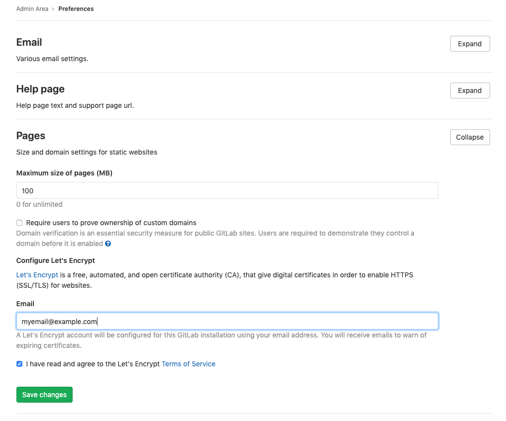

# GitLab Pages administration

> - [Introduced][ee-80] in GitLab EE 8.3.
> - Custom CNAMEs with TLS support were [introduced][ee-173] in GitLab EE 8.5.
> - GitLab Pages [was ported][ce-14605] to Community Edition in GitLab 8.17.
> - Support for subgroup project's websites was
>   [introduced](https://gitlab.com/gitlab-org/gitlab-foss/issues/30548) in GitLab 11.8.

GitLab Pages allows for hosting of static sites. It must be configured by an
administrator. Separate [user documentation][pages-userguide] is available.

NOTE: **Note:**
This guide is for Omnibus GitLab installations. If you have installed
GitLab from source, see
[GitLab Pages administration for source installations](source.md).

## Overview

GitLab Pages makes use of the [GitLab Pages daemon], a simple HTTP server
written in Go that can listen on an external IP address and provide support for
custom domains and custom certificates. It supports dynamic certificates through
SNI and exposes pages using HTTP2 by default.
You are encouraged to read its [README][pages-readme] to fully understand how
it works.

In the case of [custom domains](#custom-domains) (but not
[wildcard domains](#wildcard-domains)), the Pages daemon needs to listen on
ports `80` and/or `443`. For that reason, there is some flexibility in the way
which you can set it up:

- Run the Pages daemon in the same server as GitLab, listening on a **secondary IP**.
- Run the Pages daemon in a [separate server](#running-gitlab-pages-on-a-separate-server). In that case, the
   [Pages path](#change-storage-path) must also be present in the server that
   the Pages daemon is installed, so you will have to share it via network.
- Run the Pages daemon in the same server as GitLab, listening on the same IP
   but on different ports. In that case, you will have to proxy the traffic with
   a loadbalancer. If you choose that route note that you should use TCP load
   balancing for HTTPS. If you use TLS-termination (HTTPS-load balancing) the
   pages will not be able to be served with user provided certificates. For
   HTTP it's OK to use HTTP or TCP load balancing.

In this document, we will proceed assuming the first option. If you are not
supporting custom domains a secondary IP is not needed.

## Prerequisites

Before proceeding with the Pages configuration, you will need to:

1. Have an exclusive root domain for serving GitLab Pages. Note that you cannot
   use a subdomain of your GitLab's instance domain.
1. Configure a **wildcard DNS record**.
1. (Optional) Have a **wildcard certificate** for that domain if you decide to
   serve Pages under HTTPS.
1. (Optional but recommended) Enable [Shared runners](../../ci/runners/README.md)
   so that your users don't have to bring their own.
1. (Only for custom domains) Have a **secondary IP**.

NOTE: **Note:**
If your GitLab instance and the Pages daemon are deployed in a private network or behind a firewall, your GitLab Pages websites will only be accessible to devices/users that have access to the private network.

### Add the domain to the Public Suffix List

The [Public Suffix List](https://publicsuffix.org) is used by browsers to
decide how to treat subdomains. If your GitLab instance allows members of the
public to create GitLab Pages sites, it also allows those users to create
subdomains on the pages domain (`example.io`). Adding the domain to the Public
Suffix List prevents browsers from accepting
[supercookies](https://en.wikipedia.org/wiki/HTTP_cookie#Supercookie),
among other things.

Follow [these instructions](https://publicsuffix.org/submit/) to submit your
GitLab Pages subdomain. For instance, if your domain is `example.io`, you should
request that `example.io` is added to the Public Suffix List. GitLab.com
added `gitlab.io` [in 2016](https://gitlab.com/gitlab-com/infrastructure/issues/230).

### DNS configuration

GitLab Pages expect to run on their own virtual host. In your DNS server/provider
you need to add a [wildcard DNS A record][wiki-wildcard-dns] pointing to the
host that GitLab runs. For example, an entry would look like this:

```
*.example.io. 1800 IN A    192.0.2.1
*.example.io. 1800 IN AAAA 2001::1
```

where `example.io` is the domain under which GitLab Pages will be served
and `192.0.2.1` is the IPv4 address of your GitLab instance and `2001::1` is the
IPv6 address. If you don't have IPv6, you can omit the AAAA record.

NOTE: **Note:**
You should not use the GitLab domain to serve user pages. For more information see the [security section](#security).

[wiki-wildcard-dns]: https://en.wikipedia.org/wiki/Wildcard_DNS_record

## Configuration

Depending on your needs, you can set up GitLab Pages in 4 different ways.
The following options are listed from the easiest setup to the most
advanced one. The absolute minimum requirement is to set up the wildcard DNS
since that is needed in all configurations.

### Wildcard domains

**Requirements:**

- [Wildcard DNS setup](#dns-configuration)

---

URL scheme: `http://page.example.io`

This is the minimum setup that you can use Pages with. It is the base for all
other setups as described below. NGINX will proxy all requests to the daemon.
The Pages daemon doesn't listen to the outside world.

1. Set the external URL for GitLab Pages in `/etc/gitlab/gitlab.rb`:

   ```ruby
   pages_external_url 'http://example.io'
   ```

1. [Reconfigure GitLab][reconfigure].

Watch the [video tutorial][video-admin] for this configuration.

### Wildcard domains with TLS support

**Requirements:**

- [Wildcard DNS setup](#dns-configuration)
- Wildcard TLS certificate

---

URL scheme: `https://page.example.io`

NGINX will proxy all requests to the daemon. Pages daemon doesn't listen to the
outside world.

1. Place the certificate and key inside `/etc/gitlab/ssl`
1. In `/etc/gitlab/gitlab.rb` specify the following configuration:

   ```ruby
   pages_external_url 'https://example.io'

   pages_nginx['redirect_http_to_https'] = true
   pages_nginx['ssl_certificate'] = "/etc/gitlab/ssl/pages-nginx.crt"
   pages_nginx['ssl_certificate_key'] = "/etc/gitlab/ssl/pages-nginx.key"
   ```

   where `pages-nginx.crt` and `pages-nginx.key` are the SSL cert and key,
   respectively.

1. [Reconfigure GitLab][reconfigure].

### Additional configuration for Docker container

The GitLab Pages daemon will not have permissions to bind mounts when it runs
in a Docker container. To overcome this issue you'll need to change the chroot
behavior:

1. Edit `/etc/gitlab/gitlab.rb`.
1. Set the `inplace_chroot` to `true` for GitLab Pages:

   ```ruby
   gitlab_pages['inplace_chroot'] = true
   ```

1. [Reconfigure GitLab][reconfigure].

NOTE: **Note:**
`inplace_chroot` option might not work with the other features, such as [Pages Access Control](#access-control).
The [GitLab Pages README](https://gitlab.com/gitlab-org/gitlab-pages#caveats) has more information about caveats and workarounds.

## Advanced configuration

In addition to the wildcard domains, you can also have the option to configure
GitLab Pages to work with custom domains. Again, there are two options here:
support custom domains with and without TLS certificates. The easiest setup is
that without TLS certificates. In either case, you'll need a **secondary IP**. If
you have IPv6 as well as IPv4 addresses, you can use them both.

### Custom domains

**Requirements:**

- [Wildcard DNS setup](#dns-configuration)
- Secondary IP

---

URL scheme: `http://page.example.io` and `http://domain.com`

In that case, the Pages daemon is running, NGINX still proxies requests to
the daemon but the daemon is also able to receive requests from the outside
world. Custom domains are supported, but no TLS.

1. Edit `/etc/gitlab/gitlab.rb`:

   ```ruby
   pages_external_url "http://example.io"
   nginx['listen_addresses'] = ['192.0.2.1']
   pages_nginx['enable'] = false
   gitlab_pages['external_http'] = ['192.0.2.2:80', '[2001::2]:80']
   ```

   where `192.0.2.1` is the primary IP address that GitLab is listening to and
   `192.0.2.2` and `2001::2` are the secondary IPs the GitLab Pages daemon
   listens on. If you don't have IPv6, you can omit the IPv6 address.

1. [Reconfigure GitLab][reconfigure].

### Custom domains with TLS support

**Requirements:**

- [Wildcard DNS setup](#dns-configuration)
- Wildcard TLS certificate
- Secondary IP

---

URL scheme: `https://page.example.io` and `https://domain.com`

In that case, the Pages daemon is running, NGINX still proxies requests to
the daemon but the daemon is also able to receive requests from the outside
world. Custom domains and TLS are supported.

1. Edit `/etc/gitlab/gitlab.rb`:

   ```ruby
   pages_external_url "https://example.io"
   nginx['listen_addresses'] = ['192.0.2.1']
   pages_nginx['enable'] = false
   gitlab_pages['cert'] = "/etc/gitlab/ssl/example.io.crt"
   gitlab_pages['cert_key'] = "/etc/gitlab/ssl/example.io.key"
   gitlab_pages['external_http'] = ['192.0.2.2:80', '[2001::2]:80']
   gitlab_pages['external_https'] = ['192.0.2.2:443', '[2001::2]:443']
   ```

   where `192.0.2.1` is the primary IP address that GitLab is listening to and
   `192.0.2.2` and `2001::2` are the secondary IPs where the GitLab Pages daemon
   listens on. If you don't have IPv6, you can omit the IPv6 address.

1. [Reconfigure GitLab][reconfigure].

### Custom domain verification

To prevent malicious users from hijacking domains that don't belong to them,
GitLab supports [custom domain verification](../../user/project/pages/custom_domains_ssl_tls_certification/index.md#steps).
When adding a custom domain, users will be required to prove they own it by
adding a GitLab-controlled verification code to the DNS records for that domain.

If your userbase is private or otherwise trusted, you can disable the
verification requirement. Navigate to **Admin Area > Settings > Preferences** and
uncheck **Require users to prove ownership of custom domains** in the **Pages** section.
This setting is enabled by default.

### Let's Encrypt integration

> [Introduced](https://gitlab.com/gitlab-org/gitlab-foss/issues/28996) in GitLab 12.1.

[GitLab Pages' Let's Encrypt integration](../../user/project/pages/custom_domains_ssl_tls_certification/lets_encrypt_integration.md)
allows users to add Let's Encrypt SSL certificates for GitLab Pages
sites served under a custom domain.

To enable it, you'll need to:

1. Choose an email on which you will receive notifications about expiring domains.
1. Navigate to your instance's **Admin Area > Settings > Preferences** and expand **Pages** settings.
1. Enter the email for receiving notifications and accept Let's Encrypt's Terms of Service as shown below.
1. Click **Save changes**.



### Access control

> [Introduced](https://gitlab.com/gitlab-org/gitlab-foss/issues/33422) in GitLab 11.5.

GitLab Pages access control can be configured per-project, and allows access to a Pages
site to be controlled based on a user's membership to that project.

Access control works by registering the Pages daemon as an OAuth application
with GitLab. Whenever a request to access a private Pages site is made by an
unauthenticated user, the Pages daemon redirects the user to GitLab. If
authentication is successful, the user is redirected back to Pages with a token,
which is persisted in a cookie. The cookies are signed with a secret key, so
tampering can be detected.

Each request to view a resource in a private site is authenticated by Pages
using that token. For each request it receives, it makes a request to the GitLab
API to check that the user is authorized to read that site.

Pages access control is disabled by default. To enable it:

1. Enable it in `/etc/gitlab/gitlab.rb`:

   ```ruby
   gitlab_pages['access_control'] = true
   ```

1. [Reconfigure GitLab][reconfigure].
1. Users can now configure it in their [projects' settings](../../user/project/pages/pages_access_control.md).

### Running behind a proxy

Like the rest of GitLab, Pages can be used in those environments where external
internet connectivity is gated by a proxy. In order to use a proxy for GitLab
pages:

1. Configure in `/etc/gitlab/gitlab.rb`:

   ```ruby
   gitlab_pages['http_proxy'] = 'http://example:8080'
   ```

1. [Reconfigure GitLab][reconfigure] for the changes to take effect.

### Using a custom Certificate Authority (CA) with Access Control

When using certificates issued by a custom CA, Access Control on GitLab Pages may fail to work if the custom CA is not recognized.

This usually results in this error:
`Post /oauth/token: x509: certificate signed by unknown authority`.

For GitLab Pages Access Control with TLS/SSL certs issued by an internal or custom CA:

1. Copy the certificate bundle to `/opt/gitlab/embedded/ssl/certs/` in `.pem` format.

1. [Restart](../restart_gitlab.md) the GitLab Pages Daemon. For GitLab Omnibus instances:

    ```bash
    sudo gitlab-ctl restart gitlab-pages
    ```

## Activate verbose logging for daemon

Verbose logging was [introduced](https://gitlab.com/gitlab-org/omnibus-gitlab/merge_requests/2533) in
Omnibus GitLab 11.1.

Follow the steps below to configure verbose logging of GitLab Pages daemon.

1. By default the daemon only logs with `INFO` level.
   If you wish to make it log events with level `DEBUG` you must configure this in
   `/etc/gitlab/gitlab.rb`:

   ```ruby
   gitlab_pages['log_verbose'] = true
   ```

1. [Reconfigure GitLab][reconfigure].

## Change storage path

Follow the steps below to change the default path where GitLab Pages' contents
are stored.

1. Pages are stored by default in `/var/opt/gitlab/gitlab-rails/shared/pages`.
   If you wish to store them in another location you must set it up in
   `/etc/gitlab/gitlab.rb`:

   ```ruby
   gitlab_rails['pages_path'] = "/mnt/storage/pages"
   ```

1. [Reconfigure GitLab][reconfigure].

## Configure listener for reverse proxy requests

Follow the steps below to configure the proxy listener of GitLab Pages. [Introduced](https://gitlab.com/gitlab-org/omnibus-gitlab/merge_requests/2533) in
Omnibus GitLab 11.1.

1. By default the listener is configured to listen for requests on `localhost:8090`.

   If you wish to disable it you must configure this in
   `/etc/gitlab/gitlab.rb`:

   ```ruby
   gitlab_pages['listen_proxy'] = nil
   ```

   If you wish to make it listen on a different port you must configure this also in
   `/etc/gitlab/gitlab.rb`:

   ```ruby
   gitlab_pages['listen_proxy'] = "localhost:10080"
   ```

1. [Reconfigure GitLab][reconfigure].

## Set maximum pages size

You can configure the maximum size of the unpacked archive per project in
**Admin Area > Settings > Preferences > Pages**, in **Maximum size of pages (MB)**.
The default is 100MB.

### Override maximum pages size per project or group **(PREMIUM ONLY)**

> [Introduced](https://gitlab.com/gitlab-org/gitlab/issues/16610) in GitLab 12.7.

To override the global maximum pages size for a specific project:

1. Navigate to your project's **Settings > Pages** page.
1. Edit the **Maximum size of pages**.
1. Click **Save changes**.

To override the global maximum pages size for a specific group:

1. Navigate to your group's **Settings > General** page and expand **Pages**.
1. Edit the **Maximum size of pages**.
1. Click **Save changes**.

## Running GitLab Pages on a separate server

You can run the GitLab Pages daemon on a separate server in order to decrease the load on your main application server.

To configure GitLab Pages on a separate server:

1. Set up a new server. This will become the **Pages server**.

1. Create an NFS share on the new server and configure this share to
   allow access from your main **GitLab server**. For this example, we use the
   default GitLab Pages folder `/var/opt/gitlab/gitlab-rails/shared/pages`
   as the shared folder on the new server and we will mount it to `/mnt/pages`
   on the **GitLab server**.

1. On the **Pages server**, install Omnibus GitLab and modify `/etc/gitlab/gitlab.rb`
   to include:

   ```ruby
   external_url 'http://<ip-address-of-the-server>'
   pages_external_url "http://<your-pages-server-URL>"
   postgresql['enable'] = false
   redis['enable'] = false
   prometheus['enable'] = false
   unicorn['enable'] = false
   sidekiq['enable'] = false
   gitlab_workhorse['enable'] = false
   gitaly['enable'] = false
   alertmanager['enable'] = false
   node_exporter['enable'] = false
   gitlab_rails['auto_migrate'] = false
   ```

1. [Reconfigure GitLab](../restart_gitlab.md#omnibus-gitlab-reconfigure) for the changes to take effect.

1. On the **GitLab server**, make the following changes to `/etc/gitlab/gitlab.rb`:

   ```ruby
   gitlab_pages['enable'] = false
   pages_external_url "http://<your-pages-server-URL>"
   gitlab_rails['pages_path'] = "/mnt/pages"
   ```

1. [Reconfigure GitLab](../restart_gitlab.md#omnibus-gitlab-reconfigure) for the changes to take effect.

It is possible to run GitLab Pages on multiple servers if you wish to distribute
the load. You can do this through standard load balancing practices such as
configuring your DNS server to return multiple IPs for your Pages server,
configuring a load balancer to work at the IP level, and so on. If you wish to
set up GitLab Pages on multiple servers, perform the above procedure for each
Pages server.

### Access control when running GitLab Pages on a separate server

If you are [running GitLab Pages on a separate server](#running-gitlab-pages-on-a-separate-server),
then you must use the following procedure to configure [access control](#access-control):

1. On the **GitLab server**, add the following to `/etc/gitlab/gitlab.rb`:

   ```ruby
   gitlab_pages['enable'] = true
   gitlab_pages['access_control'] = true
   ```

1. [Reconfigure GitLab](../restart_gitlab.md#omnibus-gitlab-reconfigure) for the
   changes to take effect. The `gitlab-secrets.json` file is now updated with the
   new configuration.

   DANGER: **Danger:**
   The `gitlab-secrets.json` file contains secrets that control database encryption.
   Do not edit or replace this file on the **GitLab server** or you might
   experience permanent data loss. Make a backup copy of this file before proceeding,
   as explained in the following steps.

1. Create a backup of the secrets file on the **GitLab server**:

   ```shell
   cp /etc/gitlab/gitlab-secrets.json /etc/gitlab/gitlab-secrets.json.bak
   ```

1. Create a backup of the secrets file on the **Pages server**:

   ```shell
   cp /etc/gitlab/gitlab-secrets.json /etc/gitlab/gitlab-secrets.json.bak
   ```

1. Disable Pages on the **GitLab server** by setting the following in
   `/etc/gitlab/gitlab.rb`:

   ```ruby
   gitlab_pages['enable'] = false
   ```

1. [Reconfigure GitLab](../restart_gitlab.md#omnibus-gitlab-reconfigure) for the changes to take effect.

1. Copy the `/etc/gitlab/gitlab-secrets.json` file from the **GitLab server**
   to the **Pages server**.

1. On your **Pages server**, add the following to `/etc/gitlab/gitlab.rb`:

   ```ruby
   gitlab_pages['gitlab_server'] = "https://<your-gitlab-server-URL>"
   gitlab_pages['access_control'] = true
   ```

1. [Reconfigure GitLab](../restart_gitlab.md#omnibus-gitlab-reconfigure) for the changes to take effect.

## Backup

GitLab Pages are part of the [regular backup][backup], so there is no separate backup to configure.

## Security

You should strongly consider running GitLab Pages under a different hostname
than GitLab to prevent XSS attacks.

[backup]: ../../raketasks/backup_restore.md
[ce-14605]: https://gitlab.com/gitlab-org/gitlab-foss/issues/14605
[ee-80]: https://gitlab.com/gitlab-org/gitlab/merge_requests/80
[ee-173]: https://gitlab.com/gitlab-org/gitlab/merge_requests/173
[gitlab pages daemon]: https://gitlab.com/gitlab-org/gitlab-pages
[NGINX configs]: https://gitlab.com/gitlab-org/gitlab/tree/8-5-stable-ee/lib/support/nginx
[pages-readme]: https://gitlab.com/gitlab-org/gitlab-pages/blob/master/README.md
[pages-userguide]: ../../user/project/pages/index.md
[reconfigure]: ../restart_gitlab.md#omnibus-gitlab-reconfigure
[restart]: ../restart_gitlab.md#installations-from-source
[gitlab-pages]: https://gitlab.com/gitlab-org/gitlab-pages/tree/v0.2.4
[video-admin]: https://youtu.be/dD8c7WNcc6s
