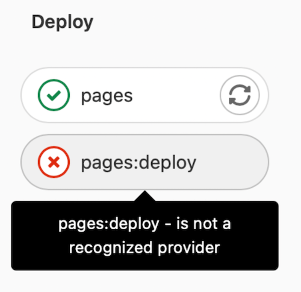

# Troubleshooting GitLab Pages administration

DETAILS:
**Tier:** Free, Premium, Ultimate
**Offering:** Self-managed

This page contains a list of issues you might encounter when administering GitLab Pages.

## How to see GitLab Pages logs

You can see Pages daemon logs by running:

```shell
sudo gitlab-ctl tail gitlab-pages
```

You can also find the log file in `/var/log/gitlab/gitlab-pages/current`.

## `unsupported protocol scheme \"\""`

If you see the following error:

```plaintext
{"error":"failed to connect to internal Pages API: Get \"/api/v4/internal/pages/status\": unsupported protocol scheme \"\"","level":"warning","msg":"attempted to connect to the API","time":"2021-06-23T20:03:30Z"}
```

It means you didn't set the HTTP(S) protocol scheme in the Pages server settings.
To fix it:

1. Edit `/etc/gitlab/gitlab.rb`:

   ```ruby
   gitlab_pages['gitlab_server'] = "https://<your_gitlab_server_public_host_and_port>"
   gitlab_pages['internal_gitlab_server'] = "https://<your_gitlab_server_private_host_and_port>" # optional, gitlab_pages['gitlab_server'] is used as default
   ```

1. Reconfigure GitLab:

   ```shell
   sudo gitlab-ctl reconfigure
   ```

## 502 error when connecting to GitLab Pages proxy when server does not listen over IPv6

In some cases, NGINX might default to using IPv6 to connect to the GitLab Pages
service even when the server does not listen over IPv6. You can identify when
this is happening if you see something similar to the log entry below in the
`gitlab_pages_error.log`:

```plaintext
2020/02/24 16:32:05 [error] 112654#0: *4982804 connect() failed (111: Connection refused) while connecting to upstream, client: 123.123.123.123, server: ~^(?<group>.*)\.pages\.example\.com$, request: "GET /-/group/project/-/jobs/1234/artifacts/artifact.txt HTTP/1.1", upstream: "http://[::1]:8090//-/group/project/-/jobs/1234/artifacts/artifact.txt", host: "group.example.com"
```

To resolve this, set an explicit IP and port for the GitLab Pages `listen_proxy` setting
to define the explicit address that the GitLab Pages daemon should listen on:

```ruby
gitlab_pages['listen_proxy'] = '127.0.0.1:8090'
```

## Intermittent 502 errors or after a few days

If you run Pages on a system that uses `systemd` and
[`tmpfiles.d`](https://www.freedesktop.org/software/systemd/man/tmpfiles.d.html),
you may encounter intermittent 502 errors trying to serve Pages with an error similar to:

```plaintext
dial tcp: lookup gitlab.example.com on [::1]:53: dial udp [::1]:53: connect: no route to host"
```

GitLab Pages creates a [bind mount](https://man7.org/linux/man-pages/man8/mount.8.html)
inside `/tmp/gitlab-pages-*` that includes files like `/etc/hosts`.
However, `systemd` may clean the `/tmp/` directory on a regular basis so the DNS
configuration may be lost.

To stop `systemd` from cleaning the Pages related content:

1. Tell `tmpfiles.d` to not remove the Pages `/tmp` directory:

   ```shell
   echo 'x /tmp/gitlab-pages-*' >> /etc/tmpfiles.d/gitlab-pages-jail.conf
   ```

1. Restart GitLab Pages:

   ```shell
   sudo gitlab-ctl restart gitlab-pages
   ```

## Unable to access GitLab Pages

If you can't access your GitLab Pages (such as receiving `502 Bad Gateway` errors, or a login loop)
and in your Pages log shows this error:

```plaintext
"error":"retrieval context done: context deadline exceeded","host":"root.docs-cit.otenet.gr","level":"error","msg":"could not fetch domain information from a source"
```

1. Add the following to `/etc/gitlab/gitlab.rb`:

   ```ruby
   gitlab_pages['internal_gitlab_server'] = 'http://localhost:8080'
   ```

1. Restart GitLab Pages:

   ```shell
   sudo gitlab-ctl restart gitlab-pages
   ```

## Failed to connect to the internal GitLab API

If you see the following error:

```plaintext
ERRO[0010] Failed to connect to the internal GitLab API after 0.50s  error="failed to connect to internal Pages API: HTTP status: 401"
```

If you are [Running GitLab Pages on a separate server](index.md#running-gitlab-pages-on-a-separate-server)
you must copy the `/etc/gitlab/gitlab-secrets.json` file
from the **GitLab server** to the **Pages server**.

Other reasons may include network connectivity issues between your
**GitLab server** and your **Pages server** such as firewall configurations or closed ports.
For example, if there is a connection timeout:

```plaintext
error="failed to connect to internal Pages API: Get \"https://gitlab.example.com:3000/api/v4/internal/pages/status\": net/http: request canceled while waiting for connection (Client.Timeout exceeded while awaiting headers)"
```

## Pages cannot communicate with an instance of the GitLab API

If you use the default value for `domain_config_source=auto` and run multiple instances of GitLab
Pages, you may see intermittent 502 error responses while serving Pages content. You may also see
the following warning in the Pages logs:

```plaintext
WARN[0010] Pages cannot communicate with an instance of the GitLab API. Please sync your gitlab-secrets.json file https://gitlab.com/gitlab-org/gitlab-pages/-/issues/535#workaround. error="pages endpoint unauthorized"
```

This can happen if your `gitlab-secrets.json` file is out of date between GitLab Rails and GitLab
Pages. Follow steps 8-10 of [Running GitLab Pages on a separate server](index.md#running-gitlab-pages-on-a-separate-server),
in all of your GitLab Pages instances.

## Intermittent 502 errors when using an AWS Network Load Balancer and GitLab Pages

Connections will time out when using a Network Load Balancer with client IP preservation enabled and [the request is looped back to the source server](https://docs.aws.amazon.com/elasticloadbalancing/latest/network/load-balancer-troubleshooting.html#loopback-timeout).
This can happen to GitLab instances with multiple servers
running both the core GitLab application and GitLab Pages. This can also happen when a single
container is running both the core GitLab application and GitLab Pages.

AWS [recommends using an IP target type](https://repost.aws/knowledge-center/target-connection-fails-load-balancer)
to resolve this issue.

Turning off [client IP preservation](https://docs.aws.amazon.com/elasticloadbalancing/latest/network/load-balancer-target-groups.html#client-ip-preservation)
may resolve this issue when the core GitLab application and GitLab Pages run on the same host or
container.

## 500 error with `securecookie: failed to generate random iv` and `Failed to save the session`

This problem most likely results from an [out-dated operating system](../package_information/supported_os.md#os-versions-that-are-no-longer-supported).
The [Pages daemon uses the `securecookie` library](https://gitlab.com/search?group_id=9970&project_id=734943&repository_ref=master&scope=blobs&search=securecookie&snippets=false) to get random strings via [`crypto/rand` in Go](https://pkg.go.dev/crypto/rand#pkg-variables).
This requires the `getrandom` system call or `/dev/urandom` to be available on the host OS.
Upgrading to an [officially supported operating system](https://about.gitlab.com/install/) is recommended.

## The requested scope is invalid, malformed, or unknown

This problem comes from the permissions of the GitLab Pages OAuth application. To fix it:

1. On the left sidebar, at the bottom, select **Admin area**.
1. Select **Applications > GitLab Pages**.
1. Edit the application.
1. Under **Scopes**, ensure that the `api` scope is selected.
1. Save your changes.

When running a [separate Pages server](index.md#running-gitlab-pages-on-a-separate-server),
this setting needs to be configured on the main GitLab server.

## Workaround in case no wildcard DNS entry can be set

If the wildcard DNS [prerequisite](index.md#prerequisites) can't be met, you can still use GitLab Pages in a limited fashion:

1. [Move](../../user/project/settings/migrate_projects.md#transfer-a-project-to-another-namespace)
   all projects you need to use Pages with into a single group namespace, for example `pages`.
1. Configure a [DNS entry](index.md#dns-configuration) without the `*.`-wildcard, for example `pages.example.io`.
1. Configure `pages_external_url http://example.io/` in your `gitlab.rb` file.
   Omit the group namespace here, because it automatically is prepended by GitLab.

## Pages daemon fails with permission denied errors

If `/tmp` is mounted with `noexec`, the Pages daemon fails to start with an error like:

```plaintext
{"error":"fork/exec /gitlab-pages: permission denied","level":"fatal","msg":"could not create pages daemon","time":"2021-02-02T21:54:34Z"}
```

In this case, change `TMPDIR` to a location that is not mounted with `noexec`. Add the following to
`/etc/gitlab/gitlab.rb`:

```ruby
gitlab_pages['env'] = {'TMPDIR' => '<new_tmp_path>'}
```

Once added, reconfigure with `sudo gitlab-ctl reconfigure` and restart GitLab with
`sudo gitlab-ctl restart`.

## `The redirect URI included is not valid.` when using Pages Access Control

You may see this error if `pages_external_url` was updated at some point of time. Verify the following:

1. Check the [System OAuth application](../../integration/oauth_provider.md#create-an-instance-wide-application):

   1. On the left sidebar, at the bottom, select **Admin area**.
   1. Select **Applications** and then **Add new application**.
   1. Ensure the **Callback URL/Redirect URI** is using the protocol (HTTP or HTTPS) that
      `pages_external_url` is configured to use.
1. The domain and path components of `Redirect URI` are valid: they should look like `projects.<pages_external_url>/auth`.

## 500 error `cannot serve from disk`

If you get a 500 response from Pages and encounter an error similar to:

```plaintext
ERRO[0145] cannot serve from disk                        error="gitlab: disk access is disabled via enable-disk=false" project_id=27 source_path="file:///shared/pages/@hashed/67/06/670671cd97404156226e507973f2ab8330d3022ca96e0c93bdbdb320c41adcaf/pages_deployments/14/artifacts.zip" source_type=zip
```

It means that GitLab Rails is telling GitLab Pages to serve content from a location on disk,
however, GitLab Pages was configured to disable disk access.

To enable disk access:

1. Enable disk access for GitLab Pages in `/etc/gitlab/gitlab.rb`:

   ```ruby
   gitlab_pages['enable_disk'] = true
   ```

1. [Reconfigure GitLab](../restart_gitlab.md#reconfigure-a-linux-package-installation).

## `httprange: new resource 403`

If you see an error similar to:

```plaintext
{"error":"httprange: new resource 403: \"403 Forbidden\"","host":"root.pages.example.com","level":"error","msg":"vfs.Root","path":"/pages1/","time":"2021-06-10T08:45:19Z"}
```

And you run pages on the separate server syncing files via NFS, it may mean that
the shared pages directory is mounted on a different path on the main GitLab server and the
GitLab Pages server.

In that case, it's highly recommended you to configure
[object storage and migrate any existing pages data to it](index.md#object-storage-settings).

Alternatively, you can mount the GitLab Pages shared directory to the same path on
both servers.

## GitLab Pages deploy job fails with error "is not a recognized provider"

If the **pages** job succeeds but the **deploy** job gives the error "is not a recognized provider":



The error message `is not a recognized provider` could be coming from the `fog` gem that GitLab uses to connect to cloud providers for object storage.

To fix that:

1. Check your `gitlab.rb` file. If you have `gitlab_rails['pages_object_store_enabled']` enabled, but no bucket details have been configured, either:

   - Configure object storage for your Pages deployments, following the [S3-compatible connection settings](index.md#s3-compatible-connection-settings) guide.
   - Store your deployments locally, by commenting out that line.

1. Save the changes you made to your `gitlab.rb` file, then [reconfigure GitLab](../restart_gitlab.md#reconfigure-a-linux-package-installation).

## 404 error `The page you're looking for could not be found`

If you get a `404 Page Not Found` response from GitLab Pages:

1. Check `.gitlab-ci.yml` contains the job `pages:`.
1. Check the current project's pipeline to confirm the job `pages:deploy` is being run.

Without the `pages:deploy` job, the updates to your GitLab Pages site are never published.

## 503 error `Client authentication failed due to unknown client`

If Pages is a registered OAuth application and [access control is enabled](../../user/project/pages/pages_access_control.md), this error indicates that the authentication token stored in `/etc/gitlab/gitlab-secrets.json` has become invalid:

```plaintext
Client authentication failed due to unknown client, no client authentication included,
or unsupported authentication method.
```

To resolve:

1. Back up your secrets file:

   ```shell
   sudo cp /etc/gitlab/gitlab-secrets.json /etc/gitlab/gitlab-secrets.json.$(date +\%Y\%m\%d)
   ```

1. Edit `/etc/gitlab/gitlab-secrets.json` and remove the `gitlab_pages` section.
1. Reconfigure GitLab and regenerate the OAuth token:

   ```shell
   sudo gitlab-ctl reconfigure
   ```
