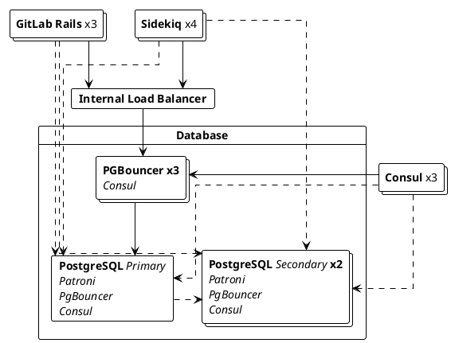

DETAILS:
**Tier:** Free, Premium, Ultimate
**Offering:** GitLab Self-Managed

With Database Load Balancing, read-only queries can be distributed across
multiple PostgreSQL nodes to increase performance.

This functionality is provided natively in GitLab Rails and Sidekiq where
they can be configured to balance their database read queries in a round-robin approach,
without any external dependencies:



## Requirements to enable Database Load Balancing

To enable Database Load Balancing, make sure that:

- The HA PostgreSQL setup has one or more secondary nodes replicating the primary.
- Each PostgreSQL node is connected with the same credentials and on the same port.

For Linux package installations, you also need PgBouncer configured on each PostgreSQL node to pool
all load-balanced connections when [configuring a multi-node setup](replication_and_failover.md).

## Configuring Database Load Balancing

Database Load Balancing can be configured in one of two ways:

- (Recommended) [Hosts](#hosts): a list of PostgreSQL hosts.
- [Service Discovery](#service-discovery): a DNS record that returns a list of PostgreSQL hosts.

### Hosts

<!-- Including the Primary host in Database Load Balancing is now recommended for improved performance - Approved by the Reference Architecture and Database groups. -->

To configure a list of hosts, perform these steps on all GitLab Rails and Sidekiq
nodes for each environment you want to balance:

1. Edit the `/etc/gitlab/gitlab.rb` file.
1. In `gitlab_rails['db_load_balancing']`, create the array of the database
   hosts you want to balance. For example, on
   an environment with PostgreSQL running on the hosts `primary.example.com`,
   `secondary1.example.com`, `secondary2.example.com`:

   ```ruby
   gitlab_rails['db_load_balancing'] = { 'hosts' => ['primary.example.com', 'secondary1.example.com', 'secondary2.example.com'] }
   ```

   These hosts must be reachable on the same port configured with `gitlab_rails['db_port']`.

1. Save the file and [reconfigure GitLab](../restart_gitlab.md#reconfigure-a-linux-package-installation).

NOTE:
Adding the primary to the hosts list is optional, but recommended.
This makes the primary eligible for load-balanced read queries, improving system performance
when the primary has capacity for these queries.
Very high-traffic instances may not have capacity on the primary for it to serve as a read replica.
The primary will be used for write queries whether or not it is present in this list.

### Service Discovery

Service discovery allows GitLab to automatically retrieve a list of PostgreSQL
hosts to use. It periodically
checks a DNS `A` record, using the IPs returned by this record as the addresses
for the secondaries. For service discovery to work, all you need is a DNS server
and an `A` record containing the IP addresses of your secondaries.

When using a Linux package installation, the provided [Consul](../consul.md) service works as
a DNS server and returns PostgreSQL addresses via the `postgresql-ha.service.consul`
record. For example:

1. On each GitLab Rails / Sidekiq node, edit `/etc/gitlab/gitlab.rb` and add the following:

   ```ruby
   gitlab_rails['db_load_balancing'] = { 'discover' => {
       'nameserver' => 'localhost'
       'record' => 'postgresql-ha.service.consul'
       'record_type' => 'A'
       'port' => '8600'
       'interval' => '60'
       'disconnect_timeout' => '120'
     }
   }
   ```

1. Save the file and [reconfigure GitLab](../restart_gitlab.md#reconfigure-a-linux-package-installation) for the changes to take effect.

| Option               | Description                                                                                       | Default   |
|----------------------|---------------------------------------------------------------------------------------------------|-----------|
| `nameserver`         | The nameserver to use for looking up the DNS record.                                              | localhost |
| `record`             | The record to look up. This option is required for service discovery to work.                     |           |
| `record_type`        | Optional record type to look up. Can be either `A` or `SRV`.                                      | `A`       |
| `port`               | The port of the nameserver.                                                                       | 8600      |
| `interval`           | The minimum time in seconds between checking the DNS record.                                      | 60        |
| `disconnect_timeout` | The time in seconds after which an old connection is closed, after the list of hosts was updated. | 120       |
| `use_tcp`            | Lookup DNS resources using TCP instead of UDP                                                     | false     |
| `max_replica_pools`  | The maximum number of replicas each Rails process connects to. This is useful if you run a lot of Postgres replicas and a lot of Rails processes because without this limit every Rails process connects to every replica by default. The default behavior is unlimited if not set. | nil     |

If `record_type` is set to `SRV`, then GitLab continues to use round-robin algorithm
and ignores the `weight` and `priority` in the record. Since `SRV` records usually
return hostnames instead of IPs, GitLab needs to look for the IPs of returned hostnames
in the additional section of the `SRV` response. If no IP is found for a hostname, GitLab
needs to query the configured `nameserver` for `ANY` record for each such hostname looking for `A` or `AAAA`
records, eventually dropping this hostname from rotation if it can't resolve its IP.

The `interval` value specifies the _minimum_ time between checks. If the `A`
record has a TTL greater than this value, then service discovery honors said
TTL. For example, if the TTL of the `A` record is 90 seconds, then service
discovery waits at least 90 seconds before checking the `A` record again.

When the list of hosts is updated, it might take a while for the old connections
to be terminated. The `disconnect_timeout` setting can be used to enforce an
upper limit on the time it takes to terminate all old database connections.

### Handling stale reads

> - [Moved](https://gitlab.com/gitlab-org/gitlab/-/issues/327902) from GitLab Premium to GitLab Free in 14.0.

To prevent reading from an outdated secondary the load balancer checks if it
is in sync with the primary. If the data is recent enough, the
secondary is used, otherwise it is ignored. To reduce the overhead of
these checks we only perform them at certain intervals.

There are three configuration options that influence this behavior:

| Option                       | Description                                                                                                    | Default    |
|------------------------------|----------------------------------------------------------------------------------------------------------------|------------|
| `max_replication_difference` | The amount of data (in bytes) a secondary is allowed to lag behind when it hasn't replicated data for a while. | 8 MB       |
| `max_replication_lag_time`   | The maximum number of seconds a secondary is allowed to lag behind before we stop using it.                    | 60 seconds |
| `replica_check_interval`     | The minimum number of seconds we have to wait before checking the status of a secondary.                       | 60 seconds |

The defaults should be sufficient for most users.

To configure these options with a hosts list, use the following example:

```ruby
gitlab_rails['db_load_balancing'] = {
  'hosts' => ['primary.example.com', 'secondary1.example.com', 'secondary2.example.com'],
  'max_replication_difference' => 16777216, # 16 MB
  'max_replication_lag_time' => 30,
  'replica_check_interval' => 30
}
```

## Logging

The load balancer logs various events in
[`database_load_balancing.log`](../logs/_index.md#database_load_balancinglog), such as

- When a host is marked as offline
- When a host comes back online
- When all secondaries are offline
- When a read is retried on a different host due to a query conflict

The log is structured with each entry a JSON object containing at least:

- An `event` field useful for filtering.
- A human-readable `message` field.
- Some event-specific metadata. For example, `db_host`
- Contextual information that is always logged. For example, `severity` and `time`.

For example:

```json
{"severity":"INFO","time":"2019-09-02T12:12:01.728Z","correlation_id":"abcdefg","event":"host_online","message":"Host came back online","db_host":"111.222.333.444","db_port":null,"tag":"rails.database_load_balancing","environment":"production","hostname":"web-example-1","fqdn":"gitlab.example.com","path":null,"params":null}
```

## Implementation Details

### Balancing queries

Read-only `SELECT` queries balance among all the given hosts.
Everything else (including transactions) executes on the primary.
Queries such as `SELECT ... FOR UPDATE` are also executed on the primary.

### Prepared statements

Prepared statements don't work well with load balancing and are disabled
automatically when load balancing is enabled. This shouldn't impact
response timings.

### Primary sticking

After a write has been performed, GitLab sticks to using the primary for a
certain period of time, scoped to the user that performed the write. GitLab
reverts back to using secondaries when they have either caught up, or after 30
seconds.

### Failover handling

In the event of a failover or an unresponsive database, the load balancer
tries to use the next available host. If no secondaries are available the
operation is performed on the primary instead.

If a connection error occurs while writing data, the
operation retries up to 3 times using an exponential back-off.

When using load balancing, you should be able to safely restart a database server
without it immediately leading to errors being presented to the users.

### Development guide

For detailed development guide on database load balancing,
see [the development documentation](../../development/database/load_balancing.md).
