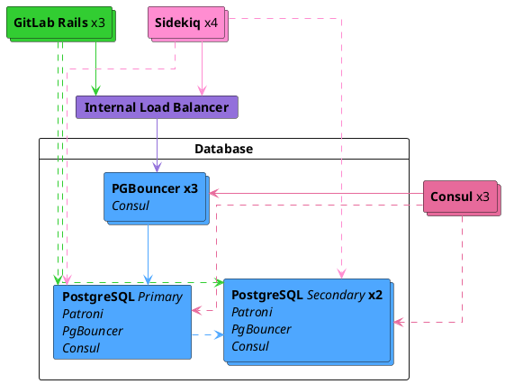

DETAILS:
**Tier:** Premium, Ultimate
**Offering:** GitLab Self-Managed

If you're a Free user of GitLab Self-Managed, consider using a cloud-hosted solution.
This document doesn't cover self-compiled installations.

If a setup with replication and failover isn't what you were looking for, see
the [database configuration document](https://docs.gitlab.com/omnibus/settings/database.html)
for the Linux packages.

It's recommended to read this document fully before attempting to configure PostgreSQL with
replication and failover for GitLab.

## Operating system upgrades

If you are failing over to a system with a different operating system,
read the [documentation on upgrading operating systems for PostgreSQL](upgrading_os.md).
Failing to account for local changes with operating system upgrades may result in data corruption.

## Architecture

The Linux package-recommended configuration for a PostgreSQL cluster with
replication failover requires:

- A minimum of three PostgreSQL nodes.
- A minimum of three Consul server nodes.
- A minimum of three PgBouncer nodes that track and handle primary database reads and writes.
  - An internal load balancer (TCP) to balance requests between the PgBouncer nodes.
- [Database Load Balancing](database_load_balancing.md) enabled.
  - A local PgBouncer service configured on each PostgreSQL node. This is separate from the main PgBouncer cluster that tracks the primary.



You also need to take into consideration the underlying network topology, making
sure you have redundant connectivity between all Database and GitLab instances
to avoid the network becoming a single point of failure.

NOTE:
PostgreSQL 12 is shipped with Linux package installations. Clustering for PostgreSQL 12 is supported only with
Patroni, and thus Patroni becomes mandatory for replication and failover. See the [Patroni](#patroni) section for further details.

### Database node

Each database node runs four services:

- `PostgreSQL`: The database itself.
- `Patroni`: Communicates with other Patroni services in the cluster and handles failover when issues with the leader server occurs. The failover procedure consists of:
  - Selecting a new leader for the cluster.
  - Promoting the new node to leader.
  - Instructing remaining servers to follow the new leader node.
- `PgBouncer`: A local pooler for the node. Used for _read_ queries as part of [Database Load Balancing](database_load_balancing.md).
- `Consul` agent: To communicate with Consul cluster which stores the current Patroni state. The agent monitors the status of each node in the database cluster and tracks its health in a service definition on the Consul cluster.

### Consul server node

The Consul server node runs the Consul server service. These nodes must have reached the quorum and elected a leader _before_ Patroni cluster bootstrap; otherwise, database nodes wait until such Consul leader is elected.

### PgBouncer node

Each PgBouncer node runs two services:

- `PgBouncer`: The database connection pooler itself.
- `Consul` agent: Watches the status of the PostgreSQL service definition on the Consul cluster. If that status changes, Consul runs a script which updates the PgBouncer configuration to point to the new PostgreSQL leader node and reloads the PgBouncer service.

### Connection flow

Each service in the package comes with a set of [default ports](../package_information/defaults.md#ports). You may need to make specific firewall rules for the connections listed below:

There are several connection flows in this setup:

- [Primary](#primary)
- [Database Load Balancing](#database-load-balancing)
- [Replication](#replication)

#### Primary

- Application servers connect to either PgBouncer directly via its [default port](../package_information/defaults.md) or via a configured Internal Load Balancer (TCP) that serves multiple PgBouncers.
- PgBouncer connects to the primary database server's [PostgreSQL default port](../package_information/defaults.md).

#### Database Load Balancing

For read queries against data that haven't been recently changed and are up to date on all database nodes:

- Application servers connect to the local PgBouncer service via its [default port](../package_information/defaults.md) on each database node in a round-robin approach.
- Local PgBouncer connects to the local database server's [PostgreSQL default port](../package_information/defaults.md).

#### Replication

- Patroni actively manages the running PostgreSQL processes and configuration.
- PostgreSQL secondaries connect to the primary database servers [PostgreSQL default port](../package_information/defaults.md)
- Consul servers and agents connect to each others [Consul default ports](../package_information/defaults.md)

## Setting it up

### Required information

Before proceeding with configuration, you need to collect all the necessary
information.

#### Network information

PostgreSQL doesn't listen on any network interface by default. It needs to know
which IP address to listen on to be accessible to other services. Similarly,
PostgreSQL access is controlled based on the network source.

This is why you need:

- The IP address of each node's network interface. This can be set to `0.0.0.0` to
  listen on all interfaces. It cannot be set to the loopback address `127.0.0.1`.
- Network Address. This can be in subnet (that is, `192.168.0.0/255.255.255.0`)
  or Classless Inter-Domain Routing (CIDR) (`192.168.0.0/24`) form.

#### Consul information

When using default setup, minimum configuration requires:

- `CONSUL_USERNAME`. The default user for Linux package installations is `gitlab-consul`
- `CONSUL_DATABASE_PASSWORD`. Password for the database user.
- `CONSUL_PASSWORD_HASH`. This is a hash generated out of Consul username/password pair. It can be generated with:

  ```shell
  sudo gitlab-ctl pg-password-md5 CONSUL_USERNAME
  ```

- `CONSUL_SERVER_NODES`. The IP addresses or DNS records of the Consul server nodes.

Few notes on the service itself:

- The service runs under a system account, by default `gitlab-consul`.
- If you are using a different username, you have to specify it through the `CONSUL_USERNAME` variable.
- Passwords are stored in the following locations:
  - `/etc/gitlab/gitlab.rb`: hashed
  - `/var/opt/gitlab/pgbouncer/pg_auth`: hashed
  - `/var/opt/gitlab/consul/.pgpass`: plaintext

#### PostgreSQL information

When configuring PostgreSQL, we do the following:

- Set `max_replication_slots` to double the number of database nodes. Patroni uses one extra slot per node when initiating the replication.
- Set `max_wal_senders` to one more than the allocated number of replication slots in the cluster. This prevents replication from using up all of the available database connections.

In this document we are assuming 3 database nodes, which makes this configuration:

```ruby
patroni['postgresql']['max_replication_slots'] = 6
patroni['postgresql']['max_wal_senders'] = 7
```

As previously mentioned, prepare the network subnets that need permission
to authenticate with the database.
You also need to have the IP addresses or DNS records of Consul
server nodes on hand.

You need the following password information for the application's database user:

- `POSTGRESQL_USERNAME`. The default user for Linux package installations is `gitlab`
- `POSTGRESQL_USER_PASSWORD`. The password for the database user
- `POSTGRESQL_PASSWORD_HASH`. This is a hash generated out of the username/password pair.
  It can be generated with:

  ```shell
  sudo gitlab-ctl pg-password-md5 POSTGRESQL_USERNAME
  ```

#### Patroni information

You need the following password information for the Patroni API:

- `PATRONI_API_USERNAME`. A username for basic auth to the API
- `PATRONI_API_PASSWORD`. A password for basic auth to the API

#### PgBouncer information

When using a default setup, the minimum configuration requires:

- `PGBOUNCER_USERNAME`. The default user for Linux package installations is `pgbouncer`
- `PGBOUNCER_PASSWORD`. This is a password for PgBouncer service.
- `PGBOUNCER_PASSWORD_HASH`. This is a hash generated out of PgBouncer username/password pair. It can be generated with:

  ```shell
  sudo gitlab-ctl pg-password-md5 PGBOUNCER_USERNAME
  ```

- `PGBOUNCER_NODE`, is the IP address or a FQDN of the node running PgBouncer.

Few things to remember about the service itself:

- The service runs as the same system account as the database. In the package, this is by default `gitlab-psql`
- If you use a non-default user account for PgBouncer service (by default `pgbouncer`), you need to specify this username.
- Passwords are stored in the following locations:
  - `/etc/gitlab/gitlab.rb`: hashed, and in plain text
  - `/var/opt/gitlab/pgbouncer/pg_auth`: hashed

### Installing the Linux package

First, make sure to [download and install](https://about.gitlab.com/install/) the Linux package **on each node**.

Make sure you install the necessary dependencies from step 1,
add GitLab package repository from step 2.
When installing the GitLab package, do not supply `EXTERNAL_URL` value.

### Configuring the Database nodes

1. Make sure to [configure the Consul nodes](../consul.md).
1. Make sure you collect [`CONSUL_SERVER_NODES`](#consul-information), [`PGBOUNCER_PASSWORD_HASH`](#pgbouncer-information), [`POSTGRESQL_PASSWORD_HASH`](#postgresql-information), the [number of db nodes](#postgresql-information), and the [network address](#network-information) before executing the next step.

#### Configuring Patroni cluster

You must enable Patroni explicitly to be able to use it (with `patroni['enable'] = true`).

Any PostgreSQL configuration item that controls replication, for example `wal_level`, `max_wal_senders`, or others are strictly
controlled by Patroni. These configurations override the original settings that you make with the `postgresql[...]` configuration key.
Hence, they are all separated and placed under `patroni['postgresql'][...]`. This behavior is limited to replication.
Patroni honours any other PostgreSQL configuration that was made with the `postgresql[...]` configuration key. For example,
`max_wal_senders` by default is set to `5`. If you wish to change this you must set it with the `patroni['postgresql']['max_wal_senders']`
configuration key.

Here is an example:

```ruby
# Disable all components except Patroni, PgBouncer and Consul
roles(['patroni_role', 'pgbouncer_role'])

# PostgreSQL configuration
postgresql['listen_address'] = '0.0.0.0'

# Disable automatic database migrations
gitlab_rails['auto_migrate'] = false

# Configure the Consul agent
consul['services'] = %w(postgresql)

# START user configuration
#  Set the real values as explained in Required Information section
#
# Replace PGBOUNCER_PASSWORD_HASH with a generated md5 value
postgresql['pgbouncer_user_password'] = 'PGBOUNCER_PASSWORD_HASH'
# Replace POSTGRESQL_REPLICATION_PASSWORD_HASH with a generated md5 value
postgresql['sql_replication_password'] = 'POSTGRESQL_REPLICATION_PASSWORD_HASH'
# Replace POSTGRESQL_PASSWORD_HASH with a generated md5 value
postgresql['sql_user_password'] = 'POSTGRESQL_PASSWORD_HASH'

# Replace PATRONI_API_USERNAME with a username for Patroni Rest API calls (use the same username in all nodes)
patroni['username'] = 'PATRONI_API_USERNAME'
# Replace PATRONI_API_PASSWORD with a password for Patroni Rest API calls (use the same password in all nodes)
patroni['password'] = 'PATRONI_API_PASSWORD'

# Sets `max_replication_slots` to double the number of database nodes.
# Patroni uses one extra slot per node when initiating the replication.
patroni['postgresql']['max_replication_slots'] = X

# Set `max_wal_senders` to one more than the number of replication slots in the cluster.
# This is used to prevent replication from using up all of the
# available database connections.
patroni['postgresql']['max_wal_senders'] = X+1

# Replace XXX.XXX.XXX.XXX/YY with Network Addresses for your other patroni nodes
patroni['allowlist'] = %w(XXX.XXX.XXX.XXX/YY 127.0.0.1/32)

# Replace XXX.XXX.XXX.XXX/YY with Network Address
postgresql['trust_auth_cidr_addresses'] = %w(XXX.XXX.XXX.XXX/YY 127.0.0.1/32)

# Local PgBouncer service for Database Load Balancing
pgbouncer['databases'] = {
  gitlabhq_production: {
    host: "127.0.0.1",
    user: "PGBOUNCER_USERNAME",
    password: 'PGBOUNCER_PASSWORD_HASH'
  }
}

# Replace placeholders:
#
# Y.Y.Y.Y consul1.gitlab.example.com Z.Z.Z.Z
# with the addresses gathered for CONSUL_SERVER_NODES
consul['configuration'] = {
  retry_join: %w(Y.Y.Y.Y consul1.gitlab.example.com Z.Z.Z.Z)
}
#
# END user configuration
```

All database nodes use the same configuration. The leader node is not determined in configuration,
and there is no additional or different configuration for either leader or replica nodes.

After the configuration of a node is complete, you must [reconfigure GitLab](../restart_gitlab.md#reconfigure-a-linux-package-installation)
on each node for the changes to take effect.

Generally, when Consul cluster is ready, the first node that [reconfigures](../restart_gitlab.md#reconfigure-a-linux-package-installation)
becomes the leader. You do not need to sequence the nodes reconfiguration. You can run them in parallel or in any order.
If you choose an arbitrary order, you do not have any predetermined leader.

#### Enable Monitoring

If you enable Monitoring, it must be enabled on **all** database servers.

1. Create/edit `/etc/gitlab/gitlab.rb` and add the following configuration:

   ```ruby
   # Enable service discovery for Prometheus
   consul['monitoring_service_discovery'] = true

   # Set the network addresses that the exporters must listen on
   node_exporter['listen_address'] = '0.0.0.0:9100'
   postgres_exporter['listen_address'] = '0.0.0.0:9187'
   ```

1. Run `sudo gitlab-ctl reconfigure` to compile the configuration.

#### Enable TLS support for the Patroni API

By default, the Patroni [REST API](https://patroni.readthedocs.io/en/latest/rest_api.html#rest-api) is served over HTTP.
You have the option to enable TLS and use HTTPS over the same [port](../package_information/defaults.md).

To enable TLS, you need PEM-formatted certificate and private key files. Both files must be readable by the PostgreSQL user (`gitlab-psql` by default, or the one set by `postgresql['username']`):

```ruby
patroni['tls_certificate_file'] = '/path/to/server/certificate.pem'
patroni['tls_key_file'] = '/path/to/server/key.pem'
```

If the server's private key is encrypted, specify the password to decrypt it:

```ruby
patroni['tls_key_password'] = 'private-key-password' # This is the plain-text password.
```

If you are using a self-signed certificate or an internal CA, you need to either disable the TLS verification or pass the certificate of the
internal CA, otherwise you may run into an unexpected error when using the `gitlab-ctl patroni ....` commands. The Linux package ensures that Patroni API
clients honor this configuration.

TLS certificate verification is enabled by default. To disable it:

```ruby
patroni['tls_verify'] = false
```

Alternatively, you can pass a PEM-formatted certificate of the internal CA. Again, the file must be readable by the PostgreSQL user:

```ruby
patroni['tls_ca_file'] = '/path/to/ca.pem'
```

When TLS is enabled, mutual authentication of the API server and client is possible for all endpoints, the extent of which depends on
the `patroni['tls_client_mode']` attribute:

- `none` (default): The API does not check for any client certificates.
- `optional`: Client certificates are required for all [unsafe](https://patroni.readthedocs.io/en/latest/security.html#protecting-the-rest-api) API calls.
- `required`: Client certificates are required for all API calls.

The client certificates are verified against the CA certificate that is specified with the `patroni['tls_ca_file']` attribute. Therefore,
this attribute is required for mutual TLS authentication. You also need to specify PEM-formatted client certificate and private key files.
Both files must be readable by the PostgreSQL user:

```ruby
patroni['tls_client_mode'] = 'required'
patroni['tls_ca_file'] = '/path/to/ca.pem'

patroni['tls_client_certificate_file'] = '/path/to/client/certificate.pem'
patroni['tls_client_key_file'] = '/path/to/client/key.pem'
```

You can use different certificates and keys for both API server and client on different Patroni nodes as long as they can be verified.
However, the CA certificate (`patroni['tls_ca_file']`), TLS certificate verification (`patroni['tls_verify']`), and client TLS
authentication mode (`patroni['tls_client_mode']`), must each have the same value on all nodes.

### Configure PgBouncer nodes

1. Make sure you collect [`CONSUL_SERVER_NODES`](#consul-information), [`CONSUL_PASSWORD_HASH`](#consul-information), and [`PGBOUNCER_PASSWORD_HASH`](#pgbouncer-information) before executing the next step.

1. On each node, edit the `/etc/gitlab/gitlab.rb` configuration file and replace values noted in the `# START user configuration` section as below:

   ```ruby
   # Disable all components except PgBouncer and Consul agent
   roles(['pgbouncer_role'])

   # Configure PgBouncer
   pgbouncer['admin_users'] = %w(pgbouncer gitlab-consul)

   # Configure Consul agent
   consul['watchers'] = %w(postgresql)

   # START user configuration
   # Set the real values as explained in Required Information section
   # Replace CONSUL_PASSWORD_HASH with a generated md5 value
   # Replace PGBOUNCER_PASSWORD_HASH with a generated md5 value
   pgbouncer['users'] = {
     'gitlab-consul': {
       password: 'CONSUL_PASSWORD_HASH'
     },
     'pgbouncer': {
       password: 'PGBOUNCER_PASSWORD_HASH'
     }
   }
   # Replace placeholders:
   #
   # Y.Y.Y.Y consul1.gitlab.example.com Z.Z.Z.Z
   # with the addresses gathered for CONSUL_SERVER_NODES
   consul['configuration'] = {
     retry_join: %w(Y.Y.Y.Y consul1.gitlab.example.com Z.Z.Z.Z)
   }
   #
   # END user configuration
   ```

1. Run `gitlab-ctl reconfigure`

1. Create a `.pgpass` file so Consul is able to
   reload PgBouncer. Enter the `PGBOUNCER_PASSWORD` twice when asked:

   ```shell
   gitlab-ctl write-pgpass --host 127.0.0.1 --database pgbouncer --user pgbouncer --hostuser gitlab-consul
   ```

1. [Enable monitoring](../postgresql/pgbouncer.md#enable-monitoring)

#### PgBouncer Checkpoint

1. Ensure each node is talking to the current node leader:

   ```shell
   gitlab-ctl pgb-console # Supply PGBOUNCER_PASSWORD when prompted
   ```

   If there is an error `psql: ERROR:  Auth failed` after typing in the
   password, ensure you have previously generated the MD5 password hashes with the correct
   format. The correct format is to concatenate the password and the username:
   `PASSWORDUSERNAME`. For example, `Sup3rS3cr3tpgbouncer` would be the text
   needed to generate an MD5 password hash for the `pgbouncer` user.

1. After the console prompt has become available, run the following queries:

   ```shell
   show databases ; show clients ;
   ```

   The output should be similar to the following:

   ```plaintext
           name         |  host       | port |      database       | force_user | pool_size | reserve_pool | pool_mode | max_connections | current_connections
   ---------------------+-------------+------+---------------------+------------+-----------+--------------+-----------+-----------------+---------------------
    gitlabhq_production | MASTER_HOST | 5432 | gitlabhq_production |            |        20 |            0 |           |               0 |                   0
    pgbouncer           |             | 6432 | pgbouncer           | pgbouncer  |         2 |            0 | statement |               0 |                   0
   (2 rows)

    type |   user    |      database       |  state  |   addr         | port  | local_addr | local_port |    connect_time     |    request_time     |    ptr    | link | remote_pid | tls
   ------+-----------+---------------------+---------+----------------+-------+------------+------------+---------------------+---------------------+-----------+------+------------+-----
    C    | pgbouncer | pgbouncer           | active  | 127.0.0.1      | 56846 | 127.0.0.1  |       6432 | 2017-08-21 18:09:59 | 2017-08-21 18:10:48 | 0x22b3880 |      |          0 |
   (2 rows)
   ```

#### Configure the internal load balancer

If you're running more than one PgBouncer node as recommended, you must set up a TCP internal load balancer to serve each correctly. This can be accomplished with any reputable TCP load balancer.

As an example, here's how you could do it with [HAProxy](https://www.haproxy.org/):

```plaintext
global
    log /dev/log local0
    log localhost local1 notice
    log stdout format raw local0

defaults
    log global
    default-server inter 10s fall 3 rise 2
    balance leastconn

frontend internal-pgbouncer-tcp-in
    bind *:6432
    mode tcp
    option tcplog

    default_backend pgbouncer

backend pgbouncer
    mode tcp
    option tcp-check

    server pgbouncer1 <ip>:6432 check
    server pgbouncer2 <ip>:6432 check
    server pgbouncer3 <ip>:6432 check
```

Refer to your preferred Load Balancer's documentation for further guidance.

### Configuring the Application nodes

Application nodes run the `gitlab-rails` service. You may have other
attributes set, but the following need to be set.

1. Edit `/etc/gitlab/gitlab.rb`:

   ```ruby
   # Disable PostgreSQL on the application node
   postgresql['enable'] = false

   gitlab_rails['db_host'] = 'PGBOUNCER_NODE' or 'INTERNAL_LOAD_BALANCER'
   gitlab_rails['db_port'] = 6432
   gitlab_rails['db_password'] = 'POSTGRESQL_USER_PASSWORD'
   gitlab_rails['auto_migrate'] = false
   gitlab_rails['db_load_balancing'] = { 'hosts' => ['POSTGRESQL_NODE_1', 'POSTGRESQL_NODE_2', 'POSTGRESQL_NODE_3'] }
   ```

1. [Reconfigure GitLab](../restart_gitlab.md#reconfigure-a-linux-package-installation) for the changes to take effect.

#### Application node post-configuration

Ensure that all migrations ran:

```shell
gitlab-rake gitlab:db:configure
```

> **Note**: If you encounter a `rake aborted!` error stating that PgBouncer is failing to connect to PostgreSQL it may be that your PgBouncer node's IP address is missing from
PostgreSQL's `trust_auth_cidr_addresses` in `gitlab.rb` on your database nodes. See
[PgBouncer error `ERROR:  pgbouncer cannot connect to server`](../postgresql/replication_and_failover_troubleshooting.md#pgbouncer-error-error-pgbouncer-cannot-connect-to-server) before you proceed.

### Backups

Do not backup or restore GitLab through a PgBouncer connection: this causes a GitLab outage.

[Read more about this and how to reconfigure backups](../backup_restore/backup_gitlab.md#back-up-and-restore-for-installations-using-pgbouncer).

### Ensure GitLab is running

At this point, your GitLab instance should be up and running. Verify you're able
to sign in, and create issues and merge requests. For more information, see [Troubleshooting replication and failover](../postgresql/replication_and_failover_troubleshooting.md).

## Example configuration

This section describes several fully expanded example configurations.

### Example recommended setup

This example uses three Consul servers, three PgBouncer servers (with an
associated internal load balancer), three PostgreSQL servers, and one
application node.

In this setup, all servers share the same `10.6.0.0/16` private network range.
The servers communicate freely over these addresses.

While you can use a different networking setup, it's recommended to ensure that it allows
for synchronous replication to occur across the cluster.
As a general rule, a latency of less than 2 ms ensures replication operations to be performant.

GitLab [reference architectures](../reference_architectures/_index.md) are sized to
assume that application database queries are shared by all three nodes.
Communication latency higher than 2 ms can lead to database locks and
impact the replica's ability to serve read-only queries in a timely fashion.

- `10.6.0.22`: PgBouncer 2
- `10.6.0.23`: PgBouncer 3
- `10.6.0.31`: PostgreSQL 1
- `10.6.0.32`: PostgreSQL 2
- `10.6.0.33`: PostgreSQL 3
- `10.6.0.41`: GitLab application

All passwords are set to `toomanysecrets`. Do not use this password or derived hashes and the `external_url` for GitLab is `http://gitlab.example.com`.

After the initial configuration, if a failover occurs, the PostgreSQL leader node changes to one of the available secondaries until it is failed back.

#### Example recommended setup for Consul servers

On each server edit `/etc/gitlab/gitlab.rb`:

```ruby
# Disable all components except Consul
roles(['consul_role'])

consul['configuration'] = {
  server: true,
  retry_join: %w(10.6.0.11 10.6.0.12 10.6.0.13)
}
consul['monitoring_service_discovery'] =  true
```

[Reconfigure GitLab](../restart_gitlab.md#reconfigure-a-linux-package-installation) for the changes to take effect.

#### Example recommended setup for PgBouncer servers

On each server edit `/etc/gitlab/gitlab.rb`:

```ruby
# Disable all components except Pgbouncer and Consul agent
roles(['pgbouncer_role'])

# Configure PgBouncer
pgbouncer['admin_users'] = %w(pgbouncer gitlab-consul)

pgbouncer['users'] = {
  'gitlab-consul': {
    password: '5e0e3263571e3704ad655076301d6ebe'
  },
  'pgbouncer': {
    password: '771a8625958a529132abe6f1a4acb19c'
  }
}

consul['watchers'] = %w(postgresql)
consul['configuration'] = {
  retry_join: %w(10.6.0.11 10.6.0.12 10.6.0.13)
}
consul['monitoring_service_discovery'] =  true
```

[Reconfigure GitLab](../restart_gitlab.md#reconfigure-a-linux-package-installation) for the changes to take effect.

#### Internal load balancer setup

An internal load balancer (TCP) is then required to be setup to serve each PgBouncer node (in this example on the IP of `10.6.0.20`). An example of how to do this can be found in the [PgBouncer Configure Internal Load Balancer](#configure-the-internal-load-balancer) section.

#### Example recommended setup for PostgreSQL servers

On database nodes edit `/etc/gitlab/gitlab.rb`:

```ruby
# Disable all components except Patroni, PgBouncer and Consul
roles(['patroni_role', 'pgbouncer_role'])

# PostgreSQL configuration
postgresql['listen_address'] = '0.0.0.0'
postgresql['hot_standby'] = 'on'
postgresql['wal_level'] = 'replica'

# Disable automatic database migrations
gitlab_rails['auto_migrate'] = false

postgresql['pgbouncer_user_password'] = '771a8625958a529132abe6f1a4acb19c'
postgresql['sql_user_password'] = '450409b85a0223a214b5fb1484f34d0f'
patroni['username'] = 'PATRONI_API_USERNAME'
patroni['password'] = 'PATRONI_API_PASSWORD'
patroni['postgresql']['max_replication_slots'] = 6
patroni['postgresql']['max_wal_senders'] = 7

patroni['allowlist'] = = %w(10.6.0.0/16 127.0.0.1/32)
postgresql['trust_auth_cidr_addresses'] = %w(10.6.0.0/16 127.0.0.1/32)

# Local PgBouncer service for Database Load Balancing
pgbouncer['databases'] = {
  gitlabhq_production: {
    host: "127.0.0.1",
    user: "pgbouncer",
    password: '771a8625958a529132abe6f1a4acb19c'
  }
}

# Configure the Consul agent
consul['services'] = %w(postgresql)
consul['configuration'] = {
  retry_join: %w(10.6.0.11 10.6.0.12 10.6.0.13)
}
consul['monitoring_service_discovery'] =  true
```

[Reconfigure GitLab](../restart_gitlab.md#reconfigure-a-linux-package-installation) for the changes to take effect.

#### Example recommended setup manual steps

After deploying the configuration follow these steps:

1. Find the primary database node:

   ```shell
   gitlab-ctl get-postgresql-primary
   ```

1. On `10.6.0.41`, our application server:

   Set `gitlab-consul` user's PgBouncer password to `toomanysecrets`:

   ```shell
   gitlab-ctl write-pgpass --host 127.0.0.1 --database pgbouncer --user pgbouncer --hostuser gitlab-consul
   ```

   Run database migrations:

   ```shell
   gitlab-rake gitlab:db:configure
   ```

## Patroni

Patroni is an opinionated solution for PostgreSQL high-availability. It takes the control of PostgreSQL, overrides its configuration, and manages its lifecycle (start, stop, restart). Patroni is the only option for PostgreSQL 12+ clustering and for cascading replication for Geo deployments.

The fundamental [architecture](#example-recommended-setup-manual-steps) (mentioned above) does not change for Patroni.
You do not need any special consideration for Patroni while provisioning your database nodes. Patroni heavily relies on Consul to store the state of the cluster and elect a leader. Any failure in Consul cluster and its leader election propagates to the Patroni cluster as well.

Patroni monitors the cluster and handles any failover. When the primary node fails, it works with Consul to notify PgBouncer. On failure, Patroni handles the transitioning of the old primary to a replica and rejoins it to the cluster automatically.

With Patroni, the connection flow is slightly different. Patroni on each node connects to Consul agent to join the cluster. Only after this point it decides if the node is the primary or a replica. Based on this decision, it configures and starts PostgreSQL which it communicates with directly over a Unix socket. This means that if the Consul cluster is not functional or does not have a leader, Patroni and by extension PostgreSQL does not start. Patroni also exposes a REST API which can be accessed via its [default port](../package_information/defaults.md)
on each node.

### Check replication status

Run `gitlab-ctl patroni members` to query Patroni for a summary of the cluster status:

```plaintext
+ Cluster: postgresql-ha (6970678148837286213) ------+---------+---------+----+-----------+
| Member                              | Host         | Role    | State   | TL | Lag in MB |
+-------------------------------------+--------------+---------+---------+----+-----------+
| gitlab-database-1.example.com       | 172.18.0.111 | Replica | running |  5 |         0 |
| gitlab-database-2.example.com       | 172.18.0.112 | Replica | running |  5 |       100 |
| gitlab-database-3.example.com       | 172.18.0.113 | Leader  | running |  5 |           |
+-------------------------------------+--------------+---------+---------+----+-----------+
```

To verify the status of replication:

```shell
echo -e 'select * from pg_stat_wal_receiver\x\g\x \n select * from pg_stat_replication\x\g\x' | gitlab-psql
```

The same command can be run on all three database servers. It returns any information
about replication available depending on the role the server is performing.

The leader should return one record per replica:

```sql
-[ RECORD 1 ]----+------------------------------
pid              | 371
usesysid         | 16384
usename          | gitlab_replicator
application_name | gitlab-database-1.example.com
client_addr      | 172.18.0.111
client_hostname  |
client_port      | 42900
backend_start    | 2021-06-14 08:01:59.580341+00
backend_xmin     |
state            | streaming
sent_lsn         | 0/EA13220
write_lsn        | 0/EA13220
flush_lsn        | 0/EA13220
replay_lsn       | 0/EA13220
write_lag        |
flush_lag        |
replay_lag       |
sync_priority    | 0
sync_state       | async
reply_time       | 2021-06-18 19:17:14.915419+00
```

Investigate further if:

- There are missing or extra records.
- `reply_time` is not current.

The `lsn` fields relate to which write-ahead-log segments have been replicated.
Run the following on the leader to find out the current Log Sequence Number (LSN):

```shell
echo 'SELECT pg_current_wal_lsn();' | gitlab-psql
```

If a replica is not in sync, `gitlab-ctl patroni members` indicates the volume
of missing data, and the `lag` fields indicate the elapsed time.

Read more about the data returned by the leader
[in the PostgreSQL documentation](https://www.postgresql.org/docs/12/monitoring-stats.html#PG-STAT-REPLICATION-VIEW),
including other values for the `state` field.

The replicas should return:

```sql
-[ RECORD 1 ]---------+-------------------------------------------------------------------------------------------------
pid                   | 391
status                | streaming
receive_start_lsn     | 0/D000000
receive_start_tli     | 5
received_lsn          | 0/EA13220
received_tli          | 5
last_msg_send_time    | 2021-06-18 19:16:54.807375+00
last_msg_receipt_time | 2021-06-18 19:16:54.807512+00
latest_end_lsn        | 0/EA13220
latest_end_time       | 2021-06-18 19:07:23.844879+00
slot_name             | gitlab-database-1.example.com
sender_host           | 172.18.0.113
sender_port           | 5432
conninfo              | user=gitlab_replicator host=172.18.0.113 port=5432 application_name=gitlab-database-1.example.com
```

Read more about the data returned by the replica
[in the PostgreSQL documentation](https://www.postgresql.org/docs/12/monitoring-stats.html#PG-STAT-WAL-RECEIVER-VIEW).

### Selecting the appropriate Patroni replication method

[Review the Patroni documentation carefully](https://patroni.readthedocs.io/en/latest/yaml_configuration.html#postgresql)
before making changes as **_some of the options carry a risk of potential data
loss if not fully understood_**. The [replication mode](https://patroni.readthedocs.io/en/latest/replication_modes.html)
configured determines the amount of tolerable data loss.

WARNING:
Replication is not a backup strategy! There is no replacement for a well-considered and tested backup solution.

Linux package installations default [`synchronous_commit`](https://www.postgresql.org/docs/11/runtime-config-wal.html#GUC-SYNCHRONOUS-COMMIT) to `on`.

```ruby
postgresql['synchronous_commit'] = 'on'
gitlab['geo-postgresql']['synchronous_commit'] = 'on'
```

#### Customizing Patroni failover behavior

Linux package installations expose several options allowing more control over the [Patroni restoration process](#recovering-the-patroni-cluster).

Each option is shown below with its default value in `/etc/gitlab/gitlab.rb`.

```ruby
patroni['use_pg_rewind'] = true
patroni['remove_data_directory_on_rewind_failure'] = false
patroni['remove_data_directory_on_diverged_timelines'] = false
```

[The upstream documentation is always more up to date](https://patroni.readthedocs.io/en/latest/patroni_configuration.html), but the table below should provide a minimal overview of functionality.

|Setting|Overview|
|-|-|
|`use_pg_rewind`|Try running `pg_rewind` on the former cluster leader before it rejoins the database cluster.|
|`remove_data_directory_on_rewind_failure`|If `pg_rewind` fails, remove the local PostgreSQL data directory and re-replicate from the current cluster leader.|
|`remove_data_directory_on_diverged_timelines`|If `pg_rewind` cannot be used and the former leader's timeline has diverged from the current one, delete the local data directory and re-replicate from the current cluster leader.|

### Database authorization for Patroni

Patroni uses a Unix socket to manage the PostgreSQL instance. Therefore, a connection from the `local` socket must be trusted.

Replicas use the replication user (`gitlab_replicator` by default) to communicate with the leader. For this user,
you can choose between `trust` and `md5` authentication. If you set `postgresql['sql_replication_password']`,
Patroni uses `md5` authentication, and otherwise falls back to `trust`.

Based on the authentication you choose, you must specify the cluster CIDR in the `postgresql['md5_auth_cidr_addresses']` or `postgresql['trust_auth_cidr_addresses']` settings.

### Interacting with Patroni cluster

You can use `gitlab-ctl patroni members` to check the status of the cluster members. To check the status of each node
`gitlab-ctl patroni` provides two additional sub-commands, `check-leader` and `check-replica` which indicate if a node
is the primary or a replica.

When Patroni is enabled, it exclusively controls PostgreSQL's startup,
shutdown, and restart. This means, to shut down PostgreSQL on a certain node, you must shutdown Patroni on the same node with:

```shell
sudo gitlab-ctl stop patroni
```

Stopping or restarting the Patroni service on the leader node triggers an automatic failover. If you need Patroni to reload its configuration or restart the PostgreSQL process without triggering the failover, you must use the `reload` or `restart` sub-commands of `gitlab-ctl patroni` instead. These two sub-commands are wrappers of the same `patronictl` commands.

### Manual failover procedure for Patroni

WARNING:
In GitLab 16.5 and earlier, PgBouncer nodes do not automatically fail over alongside
Patroni nodes. PgBouncer services
[must be restarted manually](../postgresql/replication_and_failover_troubleshooting.md#pgbouncer-error-error-pgbouncer-cannot-connect-to-server)
for a successful switchover.

While Patroni supports automatic failover, you also have the ability to perform
a manual one, where you have two slightly different options:

- **Failover**: allows you to perform a manual failover when there are no healthy nodes.
  You can perform this action in any PostgreSQL node:

  ```shell
  sudo gitlab-ctl patroni failover
  ```

- **Switchover**: only works when the cluster is healthy and allows you to schedule a switchover (it can happen immediately).
  You can perform this action in any PostgreSQL node:

  ```shell
  sudo gitlab-ctl patroni switchover
  ```

For further details on this subject, see the
[Patroni documentation](https://patroni.readthedocs.io/en/latest/rest_api.html#switchover-and-failover-endpoints).

#### Geo secondary site considerations

When a Geo secondary site is replicating from a primary site that uses `Patroni` and `PgBouncer`, replicating through PgBouncer is not supported. There is a feature request to add support, see [issue #8832](https://gitlab.com/gitlab-org/omnibus-gitlab/-/issues/8832).

Recommended. Introduce a load balancer in the primary site to automatically handle failovers in the `Patroni` cluster. For more information, see [Step 2: Configure the internal load balancer on the primary site](../geo/setup/database.md#step-2-configure-the-internal-load-balancer-on-the-primary-site).

##### Handling Patroni failover when replicating directly from the leader node

If your secondary site is configured to replicate directly from the leader node in the `Patroni` cluster, then a failover in the `Patroni` cluster will stop replication to the secondary site, even if the original node gets re-added as a follower node.

In that scenario, you must manually point your secondary site to replicate from the new leader after a failover in the `Patroni` cluster:

```shell
sudo gitlab-ctl replicate-geo-database --host=<new_leader_ip> --replication-slot=<slot_name>
```

This re-syncs your secondary site database and may take a very long time depending on the amount of data to sync. You may also need to run `gitlab-ctl reconfigure` if replication is still not working after re-syncing.

### Recovering the Patroni cluster

To recover the old primary and rejoin it to the cluster as a replica, you can start Patroni with:

```shell
sudo gitlab-ctl start patroni
```

No further configuration or intervention is needed.

### Maintenance procedure for Patroni

With Patroni enabled, you can run planned maintenance on your nodes. To perform maintenance on one node without Patroni, you can put it into maintenance mode with:

```shell
sudo gitlab-ctl patroni pause
```

When Patroni runs in a paused mode, it does not change the state of PostgreSQL. After you are done, you can resume Patroni:

```shell
sudo gitlab-ctl patroni resume
```

For further details, see [Patroni documentation on this subject](https://patroni.readthedocs.io/en/latest/pause.html).

### Upgrading PostgreSQL major version in a Patroni cluster

For a list of the bundled PostgreSQL versions and the default version for each release, see the [PostgreSQL versions of the Linux package](../package_information/postgresql_versions.md).

Here are a few key facts that you must consider before upgrading PostgreSQL:

- The main point is that you have to **shut down the Patroni cluster**. This means that your
  GitLab deployment is down for the duration of database upgrade or, at least, as long as your leader
  node is upgraded. This can be **a significant downtime depending on the size of your database**.

- Upgrading PostgreSQL creates a new data directory with a new control data. From the perspective of Patroni, this is a new cluster that needs to be bootstrapped again. Therefore, as part of the upgrade procedure, the cluster state (stored in Consul) is wiped out. After the upgrade is complete, Patroni bootstraps a new cluster. **This changes your _cluster ID_**.

- The procedures for upgrading leader and replicas are not the same. That is why it is important to use the right procedure on each node.

- Upgrading a replica node **deletes the data directory and resynchronizes it** from the leader using the
  configured replication method (`pg_basebackup` is the only available option). It might take some
  time for replica to catch up with the leader, depending on the size of your database.

- An overview of the upgrade procedure is outlined in [the Patroni documentation](https://patroni.readthedocs.io/en/latest/existing_data.html#major-upgrade-of-postgresql-version).
  You can still use `gitlab-ctl pg-upgrade` which implements this procedure with a few adjustments.

Considering these, you should carefully plan your PostgreSQL upgrade:

1. Find out which node is the leader and which node is a replica:

   ```shell
   gitlab-ctl patroni members
   ```

   NOTE:
   On a Geo secondary site, the Patroni leader node is called `standby leader`.

1. Stop Patroni **only on replicas**.

   ```shell
   sudo gitlab-ctl stop patroni
   ```

1. Enable the maintenance mode on the **application node**:

   ```shell
   sudo gitlab-ctl deploy-page up
   ```

1. Upgrade PostgreSQL on **the leader node** and make sure that the upgrade is completed successfully:

   ```shell
   # Default command timeout is 600s, configurable with '--timeout'
   sudo gitlab-ctl pg-upgrade
   ```

   NOTE:
   `gitlab-ctl pg-upgrade` tries to detect the role of the node. If for any reason the auto-detection
   does not work or you believe it did not detect the role correctly, you can use the `--leader` or
   `--replica` arguments to manually override it. Use `gitlab-ctl pg-upgrade --help` for more details on available options.

1. Check the status of the leader and cluster. You can proceed only if you have a healthy leader:

   ```shell
   gitlab-ctl patroni check-leader

   # OR

   gitlab-ctl patroni members
   ```

1. You can now disable the maintenance mode on the **application node**:

   ```shell
   sudo gitlab-ctl deploy-page down
   ```

1. Upgrade PostgreSQL **on replicas** (you can do this in parallel on all of them):

   ```shell
   sudo gitlab-ctl pg-upgrade
   ```

If issues are encountered upgrading the replicas,
[there is a troubleshooting section](../postgresql/replication_and_failover_troubleshooting.md#postgresql-major-version-upgrade-fails-on-a-patroni-replica) that might be the solution.

NOTE:
Reverting the PostgreSQL upgrade with `gitlab-ctl revert-pg-upgrade` has the same considerations as
`gitlab-ctl pg-upgrade`. You should follow the same procedure by first stopping the replicas,
then reverting the leader, and finally reverting the replicas.

### Near-zero-downtime upgrade of PostgreSQL in a Patroni cluster

DETAILS:
**Status:** Experiment

Patroni enables you to run a major PostgreSQL upgrade without shutting down the cluster. However, this
requires additional resources to host the new Patroni nodes with the upgraded PostgreSQL. In practice, with this
procedure, you are:

- Creating a new Patroni cluster with a new version of PostgreSQL.
- Migrating the data from the existing cluster.

This procedure is non-invasive, and does not impact your existing cluster before switching it off.
However, it can be both time- and resource-consuming. Consider their trade-offs with availability.

The steps, in order:

1. [Provision resources for the new cluster](#provision-resources-for-the-new-cluster).
1. [Preflight check](#preflight-check).
1. [Configure the leader of the new cluster](#configure-the-leader-of-the-new-cluster).
1. [Start publisher on the existing leader](#start-publisher-on-the-existing-leader).
1. [Copy the data from the existing cluster](#copy-the-data-from-the-existing-cluster).
1. [Replicate data from the existing cluster](#replicate-data-from-the-existing-cluster).
1. [Grow the new cluster](#grow-the-new-cluster).
1. [Switch the application to use the new cluster](#switch-the-application-to-use-the-new-cluster).
1. [Clean up](#clean-up).

#### Provision resources for the new cluster

You need a new set of resources for Patroni nodes. The new Patroni cluster does not require exactly the same number
of nodes as the existing cluster. You may choose a different number of nodes based on your requirements. The new
cluster uses the existing Consul cluster (with a different `patroni['scope']`) and PgBouncer nodes.

Make sure that at least the leader node of the existing cluster is accessible from the nodes of the new
cluster.

#### Preflight check

We rely on PostgreSQL [logical replication](https://www.postgresql.org/docs/current/logical-replication.html)
to support near-zero-downtime upgrades of Patroni clusters. The of
[logical replication requirements](https://www.postgresql.org/docs/current/logical-replication-restrictions.html)
must be met. In particular, `wal_level` must be `logical`. To check the `wal_level`,
run the following command with `gitlab-psql` on any node of the existing cluster:

```sql
SHOW wal_level;
```

By default, Patroni sets `wal_level` to `replica`. You must increase it to `logical`.
Changing `wal_level` requires restarting PostgreSQL, so this step leads to a short
downtime (hence near-zero-downtime). To do this on the Patroni **leader** node:

1. Edit `gitlab.rb` by setting:

   ```ruby
   patroni['postgresql']['wal_level'] = 'logical'
   ```

1. Run `gitlab-ctl reconfigure`. This writes the configuration but does not restart PostgreSQL service.
1. Run `gitlab-ctl patroni restart` to restart PostgreSQL and apply the new `wal_level` without triggering
   failover. For the duration of restart cycle, the cluster leader is unavailable.
1. Verify the change by running `SHOW wal_level` with `gitlab-psql`.

#### Configure the leader of the new cluster

Configure the first node of the new cluster. It becomes the leader of the new cluster.
You can use the configuration of the existing cluster, if it is compatible with the new
PostgreSQL version. Refer to the documentation on [configuring Patroni clusters](#configuring-patroni-cluster).

In addition to the common configuration, you must apply the following in `gitlab.rb` to:

1. Make sure that the new Patroni cluster uses a different scope. The scope is used to namespace the Patroni settings
   in Consul, making it possible to use the same Consul cluster for the existing and the new clusters.

   ```ruby
   patroni['scope'] = 'postgresql_new-ha'
   ```

1. Make sure that Consul agents don't mix PostgreSQL services offered by the existing and the new Patroni
   clusters. For this purpose, you must use an internal attribute:

   ```ruby
   consul['internal']['postgresql_service_name'] = 'postgresql_new'
   ```

#### Start publisher on the existing leader

On the existing leader, run this SQL statement with `gitlab-psql` to start a logical replication publisher:

```sql
CREATE PUBLICATION patroni_upgrade FOR ALL TABLES;
```

#### Copy the data from the existing cluster

To dump the current database from the existing cluster, run these commands on the
**leader** of the new cluster:

1. Optional. Copy global database objects:

   ```shell
   pg_dumpall -h ${EXISTING_CLUSTER_LEADER} -U gitlab-psql -g | gitlab-psql
   ```

   You can ignore the errors about existing database objects, such as roles. They are
   created when the node is configured for the first time.

1. Copy the current database:

   ```shell
   pg_dump -h ${EXISTING_CLUSTER_LEADER} -U gitlab-psql -d gitlabhq_production -s | gitlab-psql
   ```

   Depending on the size of your database, this command may take a while to complete.

The `pg_dump` and `pg_dumpall` commands are in `/opt/gitlab/embedded/bin`. In these commands,
`EXISTING_CLUSTER_LEADER` is the host address of the leader node of the existing cluster.

NOTE:
The `gitlab-psql` user must be able to authenticate the existing leader from the new leader node.

#### Replicate data from the existing cluster

After taking the initial data dump, you must keep the new leader in sync with the
latest changes of your existing cluster. On the new leader, run this SQL statement
with `gitlab-psql` to subscribe to publication of the existing leader:

```sql
CREATE SUBSCRIPTION patroni_upgrade
  CONNECTION 'host=EXISTING_CLUSTER_LEADER dbname=gitlabhq_production user=gitlab-psql'
  PUBLICATION patroni_upgrade;
```

In this statement, `EXISTING_CLUSTER_LEADER` is the host address of the leader node
of the existing cluster. You can also use
[other parameters](https://www.postgresql.org/docs/current/libpq-connect.html#LIBPQ-PARAMKEYWORDS)
to change the connection string. For example, you can pass the authentication password.

To check the status of replication, run these queries:

- `SELECT * FROM pg_replication_slots WHERE slot_name = 'patroni_upgrade'` on the existing leader (the publisher).
- `SELECT * FROM pg_stat_subscription` on the new leader (the subscriber).

#### Grow the new cluster

Configure other nodes of the new cluster in the way you
[configured the leader](#configure-the-leader-of-the-new-cluster).
Make sure that you use the same `patroni['scope']` and
`consul['internal']['postgresql_service_name']`.

What happens here:

- The application still uses the existing leader as its database backend.
- The logical replication ensures that the new leader keeps in sync.
- When other nodes are added to the new cluster, Patroni handles
  the replication to the nodes.

It is a good idea to wait until the replica nodes of the new cluster are initialized and caught up on the replication
lag.

#### Switch the application to use the new cluster

Up to this point, you can stop the upgrade procedure without losing data on the
existing cluster. When you switch the database backend of the application and point
it to the new cluster, the old cluster does not receive new updates. It falls behind
the new cluster. After this point, any recovery must be done from the nodes of the new cluster.

To do the switch on **all** PgBouncer nodes:

1. Edit `gitlab.rb` by setting:

   ```ruby
   consul['watchers'] = %w(postgresql_new)
   consul['internal']['postgresql_service_name'] = 'postgresql_new'
   ```

1. Run `gitlab-ctl reconfigure`.

#### Clean up

After completing these steps, then you can clean up the resources of the old Patroni cluster.
They are no longer needed. However, before removing the resources, remove the
logical replication subscription on the new leader by running `DROP SUBSCRIPTION patroni_upgrade`
with `gitlab-psql`.
