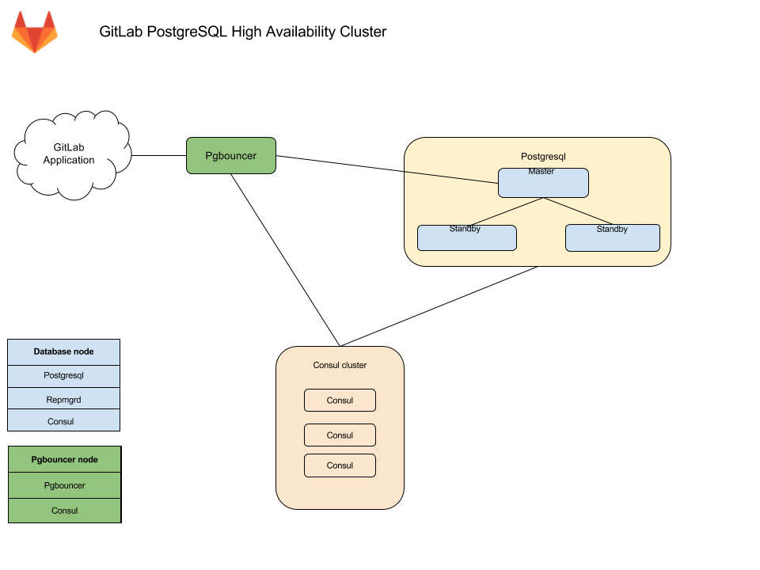

# PostgreSQL replication and failover with Omnibus GitLab **(PREMIUM ONLY)**

This document focuses on configuration supported with [GitLab Premium](https://about.gitlab.com/pricing/), using the Omnibus GitLab package.
If you're a Community Edition or Starter user, consider using a cloud hosted solution.
This document doesn't cover installations from source.

If a setup with replication and failover isn't what you were looking for, see
the [database configuration document](https://docs.gitlab.com/omnibus/settings/database.html)
for the Omnibus GitLab packages.

It's recommended to read this document fully before attempting to configure PostgreSQL with
replication and failover for GitLab.

## Architecture

The Omnibus GitLab recommended configuration for a PostgreSQL cluster with
replication and failover requires:

- A minimum of three database nodes.
- A minimum of three `Consul` server nodes.
- A minimum of one `pgbouncer` service node, but it's recommended to have one
  per database node.
  - An internal load balancer (TCP) is required when there is more than one
    `pgbouncer` service node.



You also need to take into consideration the underlying network topology, making
sure you have redundant connectivity between all Database and GitLab instances
to avoid the network becoming a single point of failure.

NOTE: **Note:**
As of GitLab 13.3, PostgreSQL 12 is shipped with Omnibus GitLab. Clustering for PostgreSQL 12 is only supported with
Patroni. See the [Patroni](#patroni) section for further details. The support for repmgr will not be extended beyond
PostgreSQL 11.

### Database node

Each database node runs three services:

`PostgreSQL` - The database itself.

`repmgrd` - Communicates with other repmgrd services in the cluster and handles
failover when issues with the master server occurs. The failover procedure
consists of:

- Selecting a new master for the cluster.
- Promoting the new node to master.
- Instructing remaining servers to follow the new master node.
- The old master node is automatically evicted from the cluster and should be
  rejoined manually once recovered.

`Consul` agent - Monitors the status of each node in the database cluster and
tracks its health in a service definition on the Consul cluster.

### Consul server node

The Consul server node runs the Consul server service.

### PgBouncer node

Each PgBouncer node runs two services:

`PgBouncer` - The database connection pooler itself.

`Consul` agent - Watches the status of the PostgreSQL service definition on the
Consul cluster. If that status changes, Consul runs a script which updates the
PgBouncer configuration to point to the new PostgreSQL master node and reloads
the PgBouncer service.

### Connection flow

Each service in the package comes with a set of [default ports](https://docs.gitlab.com/omnibus/package-information/defaults.html#ports). You may need to make specific firewall rules for the connections listed below:

- Application servers connect to either PgBouncer directly via its [default port](https://docs.gitlab.com/omnibus/package-information/defaults.html#pgbouncer) or via a configured Internal Load Balancer (TCP) that serves multiple PgBouncers.
- PgBouncer connects to the primary database servers [PostgreSQL default port](https://docs.gitlab.com/omnibus/package-information/defaults.html#postgresql)
- Repmgr connects to the database servers [PostgreSQL default port](https://docs.gitlab.com/omnibus/package-information/defaults.html#postgresql)
- PostgreSQL secondaries connect to the primary database servers [PostgreSQL default port](https://docs.gitlab.com/omnibus/package-information/defaults.html#postgresql)
- Consul servers and agents connect to each others [Consul default ports](https://docs.gitlab.com/omnibus/package-information/defaults.html#consul)

## Setting it up

### Required information

Before proceeding with configuration, you will need to collect all the necessary
information.

#### Network information

PostgreSQL doesn't listen on any network interface by default. It needs to know
which IP address to listen on to be accessible to other services. Similarly,
PostgreSQL access is controlled based on the network source.

This is why you will need:

- IP address of each nodes network interface. This can be set to `0.0.0.0` to
  listen on all interfaces. It cannot be set to the loopback address `127.0.0.1`.
- Network Address. This can be in subnet (i.e. `192.168.0.0/255.255.255.0`)
  or CIDR (i.e. `192.168.0.0/24`) form.

#### Consul information

When using default setup, minimum configuration requires:

- `CONSUL_USERNAME`. The default user for Omnibus GitLab is `gitlab-consul`
- `CONSUL_DATABASE_PASSWORD`. Password for the database user.
- `CONSUL_PASSWORD_HASH`. This is a hash generated out of Consul username/password pair.
   Can be generated with:

   ```shell
   sudo gitlab-ctl pg-password-md5 CONSUL_USERNAME
   ```

- `CONSUL_SERVER_NODES`. The IP addresses or DNS records of the Consul server nodes.

Few notes on the service itself:

- The service runs under a system account, by default `gitlab-consul`.
  - If you are using a different username, you will have to specify it. We
    will refer to it with `CONSUL_USERNAME`,
- There will be a database user created with read only access to the repmgr
  database
- Passwords will be stored in the following locations:
  - `/etc/gitlab/gitlab.rb`: hashed
  - `/var/opt/gitlab/pgbouncer/pg_auth`: hashed
  - `/var/opt/gitlab/consul/.pgpass`: plaintext

#### PostgreSQL information

When configuring PostgreSQL, we will set `max_wal_senders` to one more than
the number of database nodes in the cluster.
This is used to prevent replication from using up all of the
available database connections.

In this document we are assuming 3 database nodes, which makes this configuration:

```ruby
postgresql['max_wal_senders'] = 4
```

As previously mentioned, you'll have to prepare the network subnets that will
be allowed to authenticate with the database.
You'll also need to supply the IP addresses or DNS records of Consul
server nodes.

We will need the following password information for the application's database user:

- `POSTGRESQL_USERNAME`. The default user for Omnibus GitLab is `gitlab`
- `POSTGRESQL_USER_PASSWORD`. The password for the database user
- `POSTGRESQL_PASSWORD_HASH`. This is a hash generated out of the username/password pair.
  Can be generated with:

  ```shell
  sudo gitlab-ctl pg-password-md5 POSTGRESQL_USERNAME
  ```

#### PgBouncer information

When using default setup, minimum configuration requires:

- `PGBOUNCER_USERNAME`. The default user for Omnibus GitLab is `pgbouncer`
- `PGBOUNCER_PASSWORD`. This is a password for PgBouncer service.
- `PGBOUNCER_PASSWORD_HASH`. This is a hash generated out of PgBouncer username/password pair.
  Can be generated with:

  ```shell
  sudo gitlab-ctl pg-password-md5 PGBOUNCER_USERNAME
  ```

- `PGBOUNCER_NODE`, is the IP address or a FQDN of the node running PgBouncer.

Few notes on the service itself:

- The service runs as the same system account as the database
  - In the package, this is by default `gitlab-psql`
- If you use a non-default user account for PgBouncer service (by default `pgbouncer`), you will have to specify this username. We will refer to this requirement with `PGBOUNCER_USERNAME`.
- The service will have a regular database user account generated for it
  - This defaults to `repmgr`
- Passwords will be stored in the following locations:
  - `/etc/gitlab/gitlab.rb`: hashed, and in plain text
  - `/var/opt/gitlab/pgbouncer/pg_auth`: hashed

#### Repmgr information

When using default setup, you will only have to prepare the network subnets that will
be allowed to authenticate with the service.

Few notes on the service itself:

- The service runs under the same system account as the database
  - In the package, this is by default `gitlab-psql`
- The service will have a superuser database user account generated for it
  - This defaults to `gitlab_repmgr`

### Installing Omnibus GitLab

First, make sure to [download/install](https://about.gitlab.com/install/)
Omnibus GitLab **on each node**.

Make sure you install the necessary dependencies from step 1,
add GitLab package repository from step 2.
When installing the GitLab package, do not supply `EXTERNAL_URL` value.

### Configuring the Database nodes

1. Make sure to [configure the Consul nodes](../consul.md).
1. Make sure you collect [`CONSUL_SERVER_NODES`](#consul-information), [`PGBOUNCER_PASSWORD_HASH`](#pgbouncer-information), [`POSTGRESQL_PASSWORD_HASH`](#postgresql-information), the [number of db nodes](#postgresql-information), and the [network address](#network-information) before executing the next step.

1. On the master database node, edit `/etc/gitlab/gitlab.rb` replacing values noted in the `# START user configuration` section:

   ```ruby
   # Disable all components except PostgreSQL and Repmgr and Consul
   roles ['postgres_role']

   # PostgreSQL configuration
   postgresql['listen_address'] = '0.0.0.0'
   postgresql['hot_standby'] = 'on'
   postgresql['wal_level'] = 'replica'
   postgresql['shared_preload_libraries'] = 'repmgr_funcs'

   # Disable automatic database migrations
   gitlab_rails['auto_migrate'] = false

   # Configure the Consul agent
   consul['services'] = %w(postgresql)

   # START user configuration
   # Please set the real values as explained in Required Information section
   #
   # Replace PGBOUNCER_PASSWORD_HASH with a generated md5 value
   postgresql['pgbouncer_user_password'] = 'PGBOUNCER_PASSWORD_HASH'
   # Replace POSTGRESQL_PASSWORD_HASH with a generated md5 value
   postgresql['sql_user_password'] = 'POSTGRESQL_PASSWORD_HASH'
   # Replace X with value of number of db nodes + 1
   postgresql['max_wal_senders'] = X
   postgresql['max_replication_slots'] = X

   # Replace XXX.XXX.XXX.XXX/YY with Network Address
   postgresql['trust_auth_cidr_addresses'] = %w(XXX.XXX.XXX.XXX/YY)
   repmgr['trust_auth_cidr_addresses'] = %w(127.0.0.1/32 XXX.XXX.XXX.XXX/YY)

   # Replace placeholders:
   #
   # Y.Y.Y.Y consul1.gitlab.example.com Z.Z.Z.Z
   # with the addresses gathered for CONSUL_SERVER_NODES
   consul['configuration'] = {
     retry_join: %w(Y.Y.Y.Y consul1.gitlab.example.com Z.Z.Z.Z)
   }
   #
   # END user configuration
   ```

   > `postgres_role` was introduced with GitLab 10.3

1. On secondary nodes, add all the configuration specified above for primary node
   to `/etc/gitlab/gitlab.rb`. In addition, append the following configuration
   to inform `gitlab-ctl` that they are standby nodes initially and it need not
   attempt to register them as primary node

   ```ruby
   # Specify if a node should attempt to be master on initialization
   repmgr['master_on_initialization'] = false
   ```

1. [Reconfigure GitLab](../restart_gitlab.md#omnibus-gitlab-reconfigure) for the changes to take effect.
1. [Enable Monitoring](#enable-monitoring)

> Please note:
>
> - If you want your database to listen on a specific interface, change the configuration:
>   `postgresql['listen_address'] = '0.0.0.0'`.
> - If your PgBouncer service runs under a different user account,
>   you also need to specify: `postgresql['pgbouncer_user'] = PGBOUNCER_USERNAME` in
>   your configuration.

#### Enable Monitoring

> [Introduced](https://gitlab.com/gitlab-org/omnibus-gitlab/-/issues/3786) in GitLab 12.0.

If you enable Monitoring, it must be enabled on **all** database servers.

1. Create/edit `/etc/gitlab/gitlab.rb` and add the following configuration:

   ```ruby
   # Enable service discovery for Prometheus
   consul['monitoring_service_discovery'] = true

   # Set the network addresses that the exporters will listen on
   node_exporter['listen_address'] = '0.0.0.0:9100'
   postgres_exporter['listen_address'] = '0.0.0.0:9187'
   ```

1. Run `sudo gitlab-ctl reconfigure` to compile the configuration.

#### Database nodes post-configuration

##### Primary node

Select one node as a primary node.

1. Open a database prompt:

   ```shell
   gitlab-psql -d gitlabhq_production
   ```

1. Enable the `pg_trgm` extension:

   ```shell
   CREATE EXTENSION pg_trgm;
   ```

1. Enable the `btree_gist` extension:

   ```shell
   CREATE EXTENSION btree_gist;
   ```

1. Exit the database prompt by typing `\q` and Enter.

1. Verify the cluster is initialized with one node:

   ```shell
   gitlab-ctl repmgr cluster show
   ```

   The output should be similar to the following:

   ```plaintext
   Role      | Name     | Upstream | Connection String
   ----------+----------|----------|----------------------------------------
   * master  | HOSTNAME |          | host=HOSTNAME user=gitlab_repmgr dbname=gitlab_repmgr
   ```

1. Note down the hostname or IP address in the connection string: `host=HOSTNAME`. We will
   refer to the hostname in the next section as `MASTER_NODE_NAME`. If the value
   is not an IP address, it will need to be a resolvable name (via DNS or
   `/etc/hosts`)

##### Secondary nodes

1. Set up the repmgr standby:

   ```shell
   gitlab-ctl repmgr standby setup MASTER_NODE_NAME
   ```

   Do note that this will remove the existing data on the node. The command
   has a wait time.

   The output should be similar to the following:

   ```console
   # gitlab-ctl repmgr standby setup MASTER_NODE_NAME
   Doing this will delete the entire contents of /var/opt/gitlab/postgresql/data
   If this is not what you want, hit Ctrl-C now to exit
   To skip waiting, rerun with the -w option
   Sleeping for 30 seconds
   Stopping the database
   Removing the data
   Cloning the data
   Starting the database
   Registering the node with the cluster
   ok: run: repmgrd: (pid 19068) 0s
   ```

1. Verify the node now appears in the cluster:

   ```shell
   gitlab-ctl repmgr cluster show
   ```

   The output should be similar to the following:

   ```plaintext
   Role      | Name    | Upstream  | Connection String
   ----------+---------|-----------|------------------------------------------------
   * master  | MASTER  |           | host=MASTER_NODE_NAME user=gitlab_repmgr dbname=gitlab_repmgr
     standby | STANDBY | MASTER    | host=STANDBY_HOSTNAME user=gitlab_repmgr dbname=gitlab_repmgr
   ```

Repeat the above steps on all secondary nodes.

#### Database checkpoint

Before moving on, make sure the databases are configured correctly. Run the
following command on the **primary** node to verify that replication is working
properly:

```shell
gitlab-ctl repmgr cluster show
```

The output should be similar to:

```plaintext
Role      | Name         | Upstream     | Connection String
----------+--------------|--------------|--------------------------------------------------------------------
* master  | MASTER  |        | host=MASTER port=5432 user=gitlab_repmgr dbname=gitlab_repmgr
  standby | STANDBY | MASTER | host=STANDBY port=5432 user=gitlab_repmgr dbname=gitlab_repmgr
```

If the 'Role' column for any node says "FAILED", check the
[Troubleshooting section](#troubleshooting) before proceeding.

Also, check that the check master command works successfully on each node:

```shell
su - gitlab-consul
gitlab-ctl repmgr-check-master || echo 'This node is a standby repmgr node'
```

This command relies on exit codes to tell Consul whether a particular node is a master
or secondary. The most important thing here is that this command does not produce errors.
If there are errors it's most likely due to incorrect `gitlab-consul` database user permissions.
Check the [Troubleshooting section](#troubleshooting) before proceeding.

### Configuring the PgBouncer node

1. Make sure you collect [`CONSUL_SERVER_NODES`](#consul-information), [`CONSUL_PASSWORD_HASH`](#consul-information), and [`PGBOUNCER_PASSWORD_HASH`](#pgbouncer-information) before executing the next step.

1. One each node, edit the `/etc/gitlab/gitlab.rb` configuration file and replace values noted in the `# START user configuration` section as below:

   ```ruby
   # Disable all components except PgBouncer and Consul agent
   roles ['pgbouncer_role']

   # Configure PgBouncer
   pgbouncer['admin_users'] = %w(pgbouncer gitlab-consul)

   # Configure Consul agent
   consul['watchers'] = %w(postgresql)

   # START user configuration
   # Please set the real values as explained in Required Information section
   # Replace CONSUL_PASSWORD_HASH with with a generated md5 value
   # Replace PGBOUNCER_PASSWORD_HASH with with a generated md5 value
   pgbouncer['users'] = {
     'gitlab-consul': {
       password: 'CONSUL_PASSWORD_HASH'
     },
     'pgbouncer': {
       password: 'PGBOUNCER_PASSWORD_HASH'
     }
   }
   # Replace placeholders:
   #
   # Y.Y.Y.Y consul1.gitlab.example.com Z.Z.Z.Z
   # with the addresses gathered for CONSUL_SERVER_NODES
   consul['configuration'] = {
     retry_join: %w(Y.Y.Y.Y consul1.gitlab.example.com Z.Z.Z.Z)
   }
   #
   # END user configuration
   ```

   NOTE: **Note:**
   `pgbouncer_role` was introduced with GitLab 10.3.

1. Run `gitlab-ctl reconfigure`

1. Create a `.pgpass` file so Consul is able to
   reload PgBouncer. Enter the `PGBOUNCER_PASSWORD` twice when asked:

   ```shell
   gitlab-ctl write-pgpass --host 127.0.0.1 --database pgbouncer --user pgbouncer --hostuser gitlab-consul
   ```

1. [Enable monitoring](../postgresql/pgbouncer.md#enable-monitoring)

#### PgBouncer Checkpoint

1. Ensure each node is talking to the current master:

   ```shell
   gitlab-ctl pgb-console # You will be prompted for PGBOUNCER_PASSWORD
   ```

   If there is an error `psql: ERROR:  Auth failed` after typing in the
   password, ensure you previously generated the MD5 password hashes with the correct
   format. The correct format is to concatenate the password and the username:
   `PASSWORDUSERNAME`. For example, `Sup3rS3cr3tpgbouncer` would be the text
   needed to generate an MD5 password hash for the `pgbouncer` user.

1. Once the console prompt is available, run the following queries:

   ```shell
   show databases ; show clients ;
   ```

   The output should be similar to the following:

   ```plaintext
           name         |  host       | port |      database       | force_user | pool_size | reserve_pool | pool_mode | max_connections | current_connections
   ---------------------+-------------+------+---------------------+------------+-----------+--------------+-----------+-----------------+---------------------
    gitlabhq_production | MASTER_HOST | 5432 | gitlabhq_production |            |        20 |            0 |           |               0 |                   0
    pgbouncer           |             | 6432 | pgbouncer           | pgbouncer  |         2 |            0 | statement |               0 |                   0
   (2 rows)

    type |   user    |      database       |  state  |   addr         | port  | local_addr | local_port |    connect_time     |    request_time     |    ptr    | link | remote_pid | tls
   ------+-----------+---------------------+---------+----------------+-------+------------+------------+---------------------+---------------------+-----------+------+------------+-----
    C    | pgbouncer | pgbouncer           | active  | 127.0.0.1      | 56846 | 127.0.0.1  |       6432 | 2017-08-21 18:09:59 | 2017-08-21 18:10:48 | 0x22b3880 |      |          0 |
   (2 rows)
   ```

#### Configure the internal load balancer

If you're running more than one PgBouncer node as recommended, then at this time you'll need to set up a TCP internal load balancer to serve each correctly. This can be done with any reputable TCP load balancer.

As an example here's how you could do it with [HAProxy](https://www.haproxy.org/):

```plaintext
global
    log /dev/log local0
    log localhost local1 notice
    log stdout format raw local0

defaults
    log global
    default-server inter 10s fall 3 rise 2
    balance leastconn

frontend internal-pgbouncer-tcp-in
    bind *:6432
    mode tcp
    option tcplog

    default_backend pgbouncer

backend pgbouncer
    mode tcp
    option tcp-check

    server pgbouncer1 <ip>:6432 check
    server pgbouncer2 <ip>:6432 check
    server pgbouncer3 <ip>:6432 check
```

Refer to your preferred Load Balancer's documentation for further guidance.

### Configuring the Application nodes

These will be the nodes running the `gitlab-rails` service. You may have other
attributes set, but the following need to be set.

1. Edit `/etc/gitlab/gitlab.rb`:

   ```ruby
   # Disable PostgreSQL on the application node
   postgresql['enable'] = false

   gitlab_rails['db_host'] = 'PGBOUNCER_NODE' or 'INTERNAL_LOAD_BALANCER'
   gitlab_rails['db_port'] = 6432
   gitlab_rails['db_password'] = 'POSTGRESQL_USER_PASSWORD'
   gitlab_rails['auto_migrate'] = false
   ```

1. [Reconfigure GitLab](../restart_gitlab.md#omnibus-gitlab-reconfigure) for the changes to take effect.

#### Application node post-configuration

Ensure that all migrations ran:

```shell
gitlab-rake gitlab:db:configure
```

> **Note**: If you encounter a `rake aborted!` error stating that PgBouncer is failing to connect to
PostgreSQL it may be that your PgBouncer node's IP address is missing from
PostgreSQL's `trust_auth_cidr_addresses` in `gitlab.rb` on your database nodes. See
[PgBouncer error `ERROR:  pgbouncer cannot connect to server`](#pgbouncer-error-error-pgbouncer-cannot-connect-to-server)
in the Troubleshooting section before proceeding.

### Ensure GitLab is running

At this point, your GitLab instance should be up and running. Verify you're able
to sign in, and create issues and merge requests. If you encounter issues, see
the [Troubleshooting section](#troubleshooting).

## Example configuration

This section describes several fully expanded example configurations.

### Example recommended setup

This example uses three Consul servers, three PgBouncer servers (with an
associated internal load balancer), three PostgreSQL servers, and one
application node.

We start with all servers on the same 10.6.0.0/16 private network range, they
can connect to each freely other on those addresses.

Here is a list and description of each machine and the assigned IP:

- `10.6.0.11`: Consul 1
- `10.6.0.12`: Consul 2
- `10.6.0.13`: Consul 3
- `10.6.0.20`: Internal Load Balancer
- `10.6.0.21`: PgBouncer 1
- `10.6.0.22`: PgBouncer 2
- `10.6.0.23`: PgBouncer 3
- `10.6.0.31`: PostgreSQL master
- `10.6.0.32`: PostgreSQL secondary
- `10.6.0.33`: PostgreSQL secondary
- `10.6.0.41`: GitLab application

All passwords are set to `toomanysecrets`, please do not use this password or derived hashes and the `external_url` for GitLab is `http://gitlab.example.com`.

Please note that after the initial configuration, if a failover occurs, the PostgresSQL master will change to one of the available secondaries until it is failed back.

#### Example recommended setup for Consul servers

On each server edit `/etc/gitlab/gitlab.rb`:

```ruby
# Disable all components except Consul
roles ['consul_role']

consul['configuration'] = {
  server: true,
  retry_join: %w(10.6.0.11 10.6.0.12 10.6.0.13)
}
consul['monitoring_service_discovery'] =  true
```

[Reconfigure Omnibus GitLab](../restart_gitlab.md#omnibus-gitlab-reconfigure) for the changes to take effect.

#### Example recommended setup for PgBouncer servers

On each server edit `/etc/gitlab/gitlab.rb`:

```ruby
# Disable all components except Pgbouncer and Consul agent
roles ['pgbouncer_role']

# Configure PgBouncer
pgbouncer['admin_users'] = %w(pgbouncer gitlab-consul)

pgbouncer['users'] = {
  'gitlab-consul': {
    password: '5e0e3263571e3704ad655076301d6ebe'
  },
  'pgbouncer': {
    password: '771a8625958a529132abe6f1a4acb19c'
  }
}

consul['watchers'] = %w(postgresql)
consul['enable'] = true
consul['configuration'] = {
  retry_join: %w(10.6.0.11 10.6.0.12 10.6.0.13)
}
consul['monitoring_service_discovery'] =  true
```

[Reconfigure Omnibus GitLab](../restart_gitlab.md#omnibus-gitlab-reconfigure) for the changes to take effect.

#### Internal load balancer setup

An internal load balancer (TCP) is then required to be setup to serve each PgBouncer node (in this example on the IP of `10.6.0.20`). An example of how to do this can be found in the [PgBouncer Configure Internal Load Balancer](#configure-the-internal-load-balancer) section.

#### Example recommended setup for PostgreSQL servers

##### Primary node

On primary node edit `/etc/gitlab/gitlab.rb`:

```ruby
# Disable all components except PostgreSQL and Repmgr and Consul
roles ['postgres_role']

# PostgreSQL configuration
postgresql['listen_address'] = '0.0.0.0'
postgresql['hot_standby'] = 'on'
postgresql['wal_level'] = 'replica'
postgresql['shared_preload_libraries'] = 'repmgr_funcs'

# Disable automatic database migrations
gitlab_rails['auto_migrate'] = false

postgresql['pgbouncer_user_password'] = '771a8625958a529132abe6f1a4acb19c'
postgresql['sql_user_password'] = '450409b85a0223a214b5fb1484f34d0f'
postgresql['max_wal_senders'] = 4

postgresql['trust_auth_cidr_addresses'] = %w(10.6.0.0/16)
repmgr['trust_auth_cidr_addresses'] = %w(10.6.0.0/16)

# Configure the Consul agent
consul['services'] = %w(postgresql)
consul['enable'] = true
consul['configuration'] = {
  retry_join: %w(10.6.0.11 10.6.0.12 10.6.0.13)
}
consul['monitoring_service_discovery'] =  true
```

[Reconfigure Omnibus GitLab](../restart_gitlab.md#omnibus-gitlab-reconfigure) for the changes to take effect.

##### Secondary nodes

On secondary nodes, edit `/etc/gitlab/gitlab.rb` and add all the configuration
added to primary node, noted above. In addition, append the following
configuration:

```ruby
# Specify if a node should attempt to be master on initialization
repmgr['master_on_initialization'] = false
```

[Reconfigure Omnibus GitLab](../restart_gitlab.md#omnibus-gitlab-reconfigure) for the changes to take effect.

###### Example recommended setup for application server

On the server edit `/etc/gitlab/gitlab.rb`:

```ruby
external_url 'http://gitlab.example.com'

gitlab_rails['db_host'] = '10.6.0.20' # Internal Load Balancer for PgBouncer nodes
gitlab_rails['db_port'] = 6432
gitlab_rails['db_password'] = 'toomanysecrets'
gitlab_rails['auto_migrate'] = false

postgresql['enable'] = false
pgbouncer['enable'] = false
consul['enable'] = true

# Configure Consul agent
consul['watchers'] = %w(postgresql)

pgbouncer['users'] = {
  'gitlab-consul': {
    password: '5e0e3263571e3704ad655076301d6ebe'
  },
  'pgbouncer': {
    password: '771a8625958a529132abe6f1a4acb19c'
  }
}

consul['configuration'] = {
  retry_join: %w(10.6.0.11 10.6.0.12 10.6.0.13)
}
```

[Reconfigure Omnibus GitLab](../restart_gitlab.md#omnibus-gitlab-reconfigure) for the changes to take effect.

#### Example recommended setup manual steps

After deploying the configuration follow these steps:

1. On `10.6.0.31`, our primary database:

   Enable the `pg_trgm` and `btree_gist` extensions:

   ```shell
   gitlab-psql -d gitlabhq_production
   ```

   ```shell
   CREATE EXTENSION pg_trgm;
   CREATE EXTENSION btree_gist;
   ```

1. On `10.6.0.32`, our first standby database:

   Make this node a standby of the primary:

   ```shell
   gitlab-ctl repmgr standby setup 10.6.0.21
   ```

1. On `10.6.0.33`, our second standby database:

   Make this node a standby of the primary:

   ```shell
   gitlab-ctl repmgr standby setup 10.6.0.21
   ```

1. On `10.6.0.41`, our application server:

   Set `gitlab-consul` user's PgBouncer password to `toomanysecrets`:

   ```shell
   gitlab-ctl write-pgpass --host 127.0.0.1 --database pgbouncer --user pgbouncer --hostuser gitlab-consul
   ```

   Run database migrations:

   ```shell
   gitlab-rake gitlab:db:configure
   ```

### Example minimal setup

This example uses 3 PostgreSQL servers, and 1 application node (with PgBouncer setup alongside).

It differs from the [recommended setup](#example-recommended-setup) by moving the Consul servers into the same servers we use for PostgreSQL.
The trade-off is between reducing server counts, against the increased operational complexity of needing to deal with PostgreSQL [failover](#failover-procedure) and [restore](#restore-procedure) procedures in addition to [Consul outage recovery](../consul.md#outage-recovery) on the same set of machines.

In this example we start with all servers on the same 10.6.0.0/16 private network range, they can connect to each freely other on those addresses.

Here is a list and description of each machine and the assigned IP:

- `10.6.0.21`: PostgreSQL master
- `10.6.0.22`: PostgreSQL secondary
- `10.6.0.23`: PostgreSQL secondary
- `10.6.0.31`: GitLab application

All passwords are set to `toomanysecrets`, please do not use this password or derived hashes.

The `external_url` for GitLab is `http://gitlab.example.com`

Please note that after the initial configuration, if a failover occurs, the PostgresSQL master will change to one of the available secondaries until it is failed back.

#### Example minimal configuration for database servers

##### Primary node

On primary database node edit `/etc/gitlab/gitlab.rb`:

```ruby
# Disable all components except PostgreSQL, Repmgr, and Consul
roles ['postgres_role']

# PostgreSQL configuration
postgresql['listen_address'] = '0.0.0.0'
postgresql['hot_standby'] = 'on'
postgresql['wal_level'] = 'replica'
postgresql['shared_preload_libraries'] = 'repmgr_funcs'

# Disable automatic database migrations
gitlab_rails['auto_migrate'] = false

# Configure the Consul agent
consul['services'] = %w(postgresql)

postgresql['pgbouncer_user_password'] = '771a8625958a529132abe6f1a4acb19c'
postgresql['sql_user_password'] = '450409b85a0223a214b5fb1484f34d0f'
postgresql['max_wal_senders'] = 4

postgresql['trust_auth_cidr_addresses'] = %w(10.6.0.0/16)
repmgr['trust_auth_cidr_addresses'] = %w(10.6.0.0/16)

consul['configuration'] = {
  server: true,
  retry_join: %w(10.6.0.21 10.6.0.22 10.6.0.23)
}
```

[Reconfigure Omnibus GitLab](../restart_gitlab.md#omnibus-gitlab-reconfigure) for the changes to take effect.

##### Secondary nodes

On secondary nodes, edit `/etc/gitlab/gitlab.rb` and add all the information added
to primary node, noted above. In addition, append the following configuration

```ruby
# Specify if a node should attempt to be master on initialization
repmgr['master_on_initialization'] = false
```

#### Example minimal configuration for application server

On the server edit `/etc/gitlab/gitlab.rb`:

```ruby
external_url 'http://gitlab.example.com'

gitlab_rails['db_host'] = '127.0.0.1'
gitlab_rails['db_port'] = 6432
gitlab_rails['db_password'] = 'toomanysecrets'
gitlab_rails['auto_migrate'] = false

postgresql['enable'] = false
pgbouncer['enable'] = true
consul['enable'] = true

# Configure PgBouncer
pgbouncer['admin_users'] = %w(pgbouncer gitlab-consul)

# Configure Consul agent
consul['watchers'] = %w(postgresql)

pgbouncer['users'] = {
  'gitlab-consul': {
    password: '5e0e3263571e3704ad655076301d6ebe'
  },
  'pgbouncer': {
    password: '771a8625958a529132abe6f1a4acb19c'
  }
}

consul['configuration'] = {
  retry_join: %w(10.6.0.21 10.6.0.22 10.6.0.23)
}
```

[Reconfigure Omnibus GitLab](../restart_gitlab.md#omnibus-gitlab-reconfigure) for the changes to take effect.

#### Example minimal setup manual steps

The manual steps for this configuration are the same as for the [example recommended setup](#example-recommended-setup-manual-steps).

### Failover procedure

By default, if the master database fails, `repmgrd` should promote one of the
standby nodes to master automatically, and Consul will update PgBouncer with
the new master.

If you need to failover manually, you have two options:

**Shutdown the current master database**

Run:

```shell
gitlab-ctl stop postgresql
```

The automated failover process will see this and failover to one of the
standby nodes.

**Or perform a manual failover**

1. Ensure the old master node is not still active.
1. Login to the server that should become the new master and run:

   ```shell
   gitlab-ctl repmgr standby promote
   ```

1. If there are any other standby servers in the cluster, have them follow
   the new master server:

   ```shell
   gitlab-ctl repmgr standby follow NEW_MASTER
   ```

### Restore procedure

If a node fails, it can be removed from the cluster, or added back as a standby
after it has been restored to service.

#### Remove a standby from the cluster

  From any other node in the cluster, run:

  ```shell
  gitlab-ctl repmgr standby unregister --node=X
  ```

  where X is the value of node in `repmgr.conf` on the old server.

  To find this, you can use:

  ```shell
  awk -F = '$1 == "node" { print $2 }' /var/opt/gitlab/postgresql/repmgr.conf
  ```

  It will output something like:

  ```plaintext
  959789412
  ```

  Then you will use this ID to unregister the node:

  ```shell
  gitlab-ctl repmgr standby unregister --node=959789412
  ```

#### Add a node as a standby server

  From the standby node, run:

  ```shell
  gitlab-ctl repmgr standby follow NEW_MASTER
  gitlab-ctl restart repmgrd
  ```

  CAUTION: **Warning:**
  When the server is brought back online, and before
  you switch it to a standby node, repmgr will report that there are two masters.
  If there are any clients that are still attempting to write to the old master,
  this will cause a split, and the old master will need to be resynced from
  scratch by performing a `gitlab-ctl repmgr standby setup NEW_MASTER`.

#### Add a failed master back into the cluster as a standby node

  Once `repmgrd` and PostgreSQL are running, the node will need to follow the new
  as a standby node.

  ```shell
  gitlab-ctl repmgr standby follow NEW_MASTER
  ```

  Once the node is following the new master as a standby, the node needs to be
  [unregistered from the cluster on the new master node](#remove-a-standby-from-the-cluster).

  Once the old master node has been unregistered from the cluster, it will need
  to be setup as a new standby:

  ```shell
  gitlab-ctl repmgr standby setup NEW_MASTER
  ```

  Failure to unregister and read the old master node can lead to subsequent failovers
  not working.

### Alternate configurations

#### Database authorization

By default, we give any host on the database network the permission to perform
repmgr operations using PostgreSQL's `trust` method. If you do not want this
level of trust, there are alternatives.

You can trust only the specific nodes that will be database clusters, or you
can require md5 authentication.

#### Trust specific addresses

If you know the IP address, or FQDN of all database and PgBouncer nodes in the
cluster, you can trust only those nodes.

In `/etc/gitlab/gitlab.rb` on all of the database nodes, set
`repmgr['trust_auth_cidr_addresses']` to an array of strings containing all of
the addresses.

If setting to a node's FQDN, they must have a corresponding PTR record in DNS.
If setting to a node's IP address, specify it as `XXX.XXX.XXX.XXX/32`.

For example:

```ruby
repmgr['trust_auth_cidr_addresses'] = %w(192.168.1.44/32 db2.example.com)
```

#### MD5 Authentication

If you are running on an untrusted network, repmgr can use md5 authentication
with a [`.pgpass` file](https://www.postgresql.org/docs/11/libpq-pgpass.html)
to authenticate.

You can specify by IP address, FQDN, or by subnet, using the same format as in
the previous section:

1. On the current master node, create a password for the `gitlab` and
   `gitlab_repmgr` user:

   ```shell
   gitlab-psql -d template1
   template1=# \password gitlab_repmgr
   Enter password: ****
   Confirm password: ****
   template1=# \password gitlab
   ```

1. On each database node:

   1. Edit `/etc/gitlab/gitlab.rb`:
      1. Ensure `repmgr['trust_auth_cidr_addresses']` is **not** set
      1. Set `postgresql['md5_auth_cidr_addresses']` to the desired value
      1. Set `postgresql['sql_replication_user'] = 'gitlab_repmgr'`
      1. Reconfigure with `gitlab-ctl reconfigure`
      1. Restart PostgreSQL with `gitlab-ctl restart postgresql`

   1. Create a `.pgpass` file. Enter the `gitlab_repmgr` password twice to
      when asked:

      ```shell
      gitlab-ctl write-pgpass --user gitlab_repmgr --hostuser gitlab-psql --database '*'
      ```

1. On each PgBouncer node, edit `/etc/gitlab/gitlab.rb`:
   1. Ensure `gitlab_rails['db_password']` is set to the plaintext password for
      the `gitlab` database user
   1. [Reconfigure GitLab](../restart_gitlab.md#omnibus-gitlab-reconfigure) for the changes to take effect

## Troubleshooting

### Consul and PostgreSQL changes not taking effect

Due to the potential impacts, `gitlab-ctl reconfigure` only reloads Consul and PostgreSQL, it will not restart the services. However, not all changes can be activated by reloading.

To restart either service, run `gitlab-ctl restart SERVICE`

For PostgreSQL, it is usually safe to restart the master node by default. Automatic failover defaults to a 1 minute timeout. Provided the database returns before then, nothing else needs to be done. To be safe, you can stop `repmgrd` on the standby nodes first with `gitlab-ctl stop repmgrd`, then start afterwards with `gitlab-ctl start repmgrd`.

On the Consul server nodes, it is important to [restart the Consul service](../consul.md#restart-consul) in a controlled manner.

### `gitlab-ctl repmgr-check-master` command produces errors

If this command displays errors about database permissions it is likely that something failed during
install, resulting in the `gitlab-consul` database user getting incorrect permissions. Follow these
steps to fix the problem:

1. On the master database node, connect to the database prompt - `gitlab-psql -d template1`
1. Delete the `gitlab-consul` user - `DROP USER "gitlab-consul";`
1. Exit the database prompt - `\q`
1. [Reconfigure GitLab](../restart_gitlab.md#omnibus-gitlab-reconfigure) and the user will be re-added with the proper permissions.
1. Change to the `gitlab-consul` user - `su - gitlab-consul`
1. Try the check command again - `gitlab-ctl repmgr-check-master`.

Now there should not be errors. If errors still occur then there is another problem.

### PgBouncer error `ERROR: pgbouncer cannot connect to server`

You may get this error when running `gitlab-rake gitlab:db:configure` or you
may see the error in the PgBouncer log file.

```plaintext
PG::ConnectionBad: ERROR:  pgbouncer cannot connect to server
```

The problem may be that your PgBouncer node's IP address is not included in the
`trust_auth_cidr_addresses` setting in `/etc/gitlab/gitlab.rb` on the database nodes.

You can confirm that this is the issue by checking the PostgreSQL log on the master
database node. If you see the following error then `trust_auth_cidr_addresses`
is the problem.

```plaintext
2018-03-29_13:59:12.11776 FATAL:  no pg_hba.conf entry for host "123.123.123.123", user "pgbouncer", database "gitlabhq_production", SSL off
```

To fix the problem, add the IP address to `/etc/gitlab/gitlab.rb`.

```ruby
postgresql['trust_auth_cidr_addresses'] = %w(123.123.123.123/32 <other_cidrs>)
```

[Reconfigure GitLab](../restart_gitlab.md#omnibus-gitlab-reconfigure) for the changes to take effect.

### Issues with other components

If you're running into an issue with a component not outlined here, be sure to check the troubleshooting section of their specific documentation page:

- [Consul](../consul.md#troubleshooting-consul)
- [PostgreSQL](https://docs.gitlab.com/omnibus/settings/database.html#troubleshooting)

## Patroni

NOTE: **Note:**
Starting from GitLab 13.1, Patroni is available for **experimental** use to replace repmgr. Due to its
experimental nature, Patroni support is **subject to change without notice.**

Patroni is an opinionated solution for PostgreSQL high-availability. It takes the control of PostgreSQL, overrides its
configuration and manages its lifecycle (start, stop, restart). This is a more active approach when compared to repmgr.
Both repmgr and Patroni are both supported and available. But Patroni will be the default (and perhaps the only) option
for PostgreSQL 12 clustering and cascading replication for Geo deployments.

The [architecture](#example-recommended-setup-manual-steps) (that was mentioned above) does not change for Patroni.
You do not need any special consideration for Patroni while provisioning your database nodes. Patroni heavily relies on
Consul to store the state of the cluster and elect a leader. Any failure in Consul cluster and its leader election will
propagate to Patroni cluster as well.

Similar to repmgr, Patroni monitors the cluster and handles failover. When the primary node fails it works with Consul
to notify PgBouncer. However, as opposed to repmgr, on failure, Patroni handles the transitioning of the old primary to
a replica and rejoins it to the cluster automatically. So you do not need any manual operation for recovering the
cluster as you do with repmgr.

With Patroni the connection flow is slightly different. Patroni on each node connects to Consul agent to join the
cluster. Only after this point it decides if the node is the primary or a replica. Based on this decision, it configures
and starts PostgreSQL which it communicates with directly over a Unix socket. This implies that if Consul cluster is not
functional or does not have a leader, Patroni and by extension PostgreSQL will not start. Patroni also exposes a REST
API which can be accessed via its [default port](https://docs.gitlab.com/omnibus/package-information/defaults.html#patroni)
on each node.

### Configuring Patroni cluster

You must enable Patroni explicitly to be able to use it (with `patroni['enable'] = true`). When Patroni is enabled
repmgr will be disabled automatically.

Any PostgreSQL configuration item that controls replication, for example `wal_level`, `max_wal_senders`, etc, are strictly
controlled by Patroni and will override the original settings that you make with the `postgresql[...]` configuration key.
Hence, they are all separated and placed under `patroni['postgresql'][...]`. This behavior is limited to replication.
Patroni honours any other PostgreSQL configuration that was made with the `postgresql[...]` configuration key. For example,
`max_wal_senders` by default is set to `5`. If you wish to change this you must set it with the `patroni['postgresql']['max_wal_senders']`
configuration key.

The configuration of Patroni node is very similar to a repmgr but shorter. When Patroni is enabled, first you can ignore
any replication setting of PostgreSQL (it will be overwritten anyway). Then you can remove any `repmgr[...]` or
repmgr-specific configuration as well. Especially, make sure that you remove `postgresql['shared_preload_libraries'] = 'repmgr_funcs'`.

Here is an example similar to [the one that was done with repmgr](#configuring-the-database-nodes):

```ruby
# Disable all components except PostgreSQL and Repmgr and Consul
roles['postgres_role']

# Enable Patroni
patroni['enable'] = true

# PostgreSQL configuration
postgresql['listen_address'] = '0.0.0.0'

# Disable automatic database migrations
gitlab_rails['auto_migrate'] = false

# Configure the Consul agent
consul['services'] = %w(postgresql)

# START user configuration
# Please set the real values as explained in Required Information section
#
# Replace PGBOUNCER_PASSWORD_HASH with a generated md5 value
postgresql['pgbouncer_user_password'] = 'PGBOUNCER_PASSWORD_HASH'
# Replace POSTGRESQL_PASSWORD_HASH with a generated md5 value
postgresql['sql_user_password'] = 'POSTGRESQL_PASSWORD_HASH'

# Replace X with value of number of db nodes + 1 (OPTIONAL the default value is 5)
patroni['postgresql']['max_wal_senders'] = X
patroni['postgresql']['max_replication_slots'] = X

# Replace XXX.XXX.XXX.XXX/YY with Network Address
postgresql['trust_auth_cidr_addresses'] = %w(XXX.XXX.XXX.XXX/YY)

# Replace placeholders:
#
# Y.Y.Y.Y consul1.gitlab.example.com Z.Z.Z.Z
# with the addresses gathered for CONSUL_SERVER_NODES
consul['configuration'] = {
  retry_join: %w(Y.Y.Y.Y consul1.gitlab.example.com Z.Z.Z.Z)
}
#
# END user configuration
```

You do not need an additional or different configuration for replica nodes. As a matter of fact, you don't have to have
a predetermined primary node. Therefore all database nodes use the same configuration.

Once the configuration of a node is done, you must [reconfigure Omnibus GitLab](../restart_gitlab.md#omnibus-gitlab-reconfigure)
on each node for the changes to take effect.

Generally, when Consul cluster is ready, the first node that [reconfigures](../restart_gitlab.md#omnibus-gitlab-reconfigure)
becomes the leader. You do not need to sequence the nodes reconfiguration. You can run them in parallel or in any order.
If you choose an arbitrary order you do not have any predetermined master.

As opposed to repmgr, once the nodes are reconfigured you do not need any further action or additional command to join
the replicas.

#### Database authorization for Patroni

Patroni uses Unix socket to manage PostgreSQL instance. Therefore, the connection from the `local` socket must be trusted.

Also, replicas use the replication user (`gitlab_replicator` by default) to communicate with the leader. For this user,
you can choose between `trust` and `md5` authentication. If you set `postgresql['sql_replication_password']`,
Patroni will use `md5` authentication, otherwise it falls back to `trust`. You must to specify the cluster CIDR in
`postgresql['md5_auth_cidr_addresses']` or `postgresql['trust_auth_cidr_addresses']` respectively.

### Interacting with Patroni cluster

You can use `gitlab-ctl patroni members` to check the status of the cluster members. To check the status of each node
`gitlab-ctl patroni` provides two additional sub-commands, `check-leader` and `check-replica` which indicate if a node
is the primary or a replica.

When Patroni is enabled, you don't have direct control over `postgresql` service. Patroni will signal PostgreSQL's startup,
shutdown, and restart. For example, for shutting down PostgreSQL on a node, you must shutdown Patroni on the same node
with:

```shell
sudo gitlab-ctl stop patroni
```

Note that stopping or restarting Patroni service on the leader node will trigger the automatic failover. If you
want to signal Patroni to reload its configuration or restart PostgreSQL process without triggering the failover, you
must use the `reload` or `restart` sub-commands of `gitlab-ctl patroni` instead. These two sub-commands are wrappers of
the same `patronictl` commands.

### Manual failover procedure for Patroni

While Patroni supports automatic failover, you also have the ability to perform
a manual one, where you have two slightly different options:

- **Failover**: allows you to perform a manual failover when there are no healthy nodes.
  You can perform this action in any PostgreSQL node:

  ```shell
  sudo gitlab-ctl patroni failover
  ```

- **Switchover**: only works when the cluster is healthy and allows you to schedule a switchover (it can happen immediately).
  You can perform this action in any PostgreSQL node:

  ```shell
  sudo gitlab-ctl patroni switchover
  ```

For further details on this subject, see the
[Patroni documentation](https://patroni.readthedocs.io/en/latest/rest_api.html#switchover-and-failover-endpoints).

### Recovering the Patroni cluster

To recover the old primary and rejoin it to the cluster as a replica, you can simply start Patroni with:

```shell
sudo gitlab-ctl start patroni
```

No further configuration or intervention is needed.

### Maintenance procedure for Patroni

With Patroni enabled, you can run a planned maintenance. If you want to do some maintenance work on one node and you
don't want Patroni to manage it, you can use put it into maintenance mode:

```shell
sudo gitlab-ctl patroni pause
```

When Patroni runs in a paused mode, it does not change the state of PostgreSQL. Once you are done you can resume Patroni:

```shell
sudo gitlab-ctl patroni resume
```

For further details, see [Patroni documentation on this subject](https://patroni.readthedocs.io/en/latest/pause.html).

### Switching from repmgr to Patroni

CAUTION: **Warning:**
Although switching from repmgr to Patroni is fairly straightforward the other way around is not. Rolling back from
Patroni to repmgr can be complicated and may involve deletion of data directory. If you need to do that, please contact
GitLab support.

You can switch an exiting database cluster to use Patroni instead of repmgr with the following steps:

1. Stop repmgr on all replica nodes and lastly with the primary node:

   ```shell
   sudo gitlab-ctl stop repmgrd
   ```

1. Stop PostgreSQL on all replica nodes:

   ```shell
   sudo gitlab-ctl stop postgresql
   ```

   NOTE: **Note:**
   Ensure that there is no `walsender` process running on the primary node.
   `ps aux | grep walsender` must not show any running process.

1. On the primary node, [configure Patroni](#configuring-patroni-cluster). Remove `repmgr` and any other
   repmgr-specific configuration. Also remove any configuration that is related to PostgreSQL replication.
1. [Reconfigure Omnibus GitLab](../restart_gitlab.md#omnibus-gitlab-reconfigure) on the primary node. It will become
   the leader. You can check this with:

   ```shell
   sudo gitlab-ctl tail patroni
   ```

1. Repeat the last two steps for all replica nodes. `gitlab.rb` should look the same on all nodes.
1. Optional: You can remove `gitlab_repmgr` database and role on the primary.

### Upgrading PostgreSQL major version in a Patroni cluster

As of GitLab 13.3, PostgreSQL 11.7 and 12.3 are both shipped with Omnibus GitLab. GitLab still
uses PostgreSQL 11 by default. Therefore `gitlab-ctl pg-upgrade` does not automatically upgrade
to PostgreSQL 12. If you want to upgrade to PostgreSQL 12, you must ask for it explicitly.

CAUTION: **Warning:**
The procedure for upgrading PostgreSQL in a Patroni cluster is different than when upgrading using repmgr.
The following outlines the key differences and important considerations that need to be accounted for when
upgrading PostgreSQL.

Here are a few key facts that you must consider before upgrading PostgreSQL:

- The main point is that you will have to **shut down the Patroni cluster**. This means that your
  GitLab deployment will be down for the duration of database upgrade or, at least, as long as your leader
  node is upgraded. This can be **a significant downtime depending on the size of your database**.

- Upgrading PostgreSQL creates a new data directory with a new control data. From Patroni's perspective
  this is a new cluster that needs to be bootstrapped again. Therefore, as part of the upgrade procedure,
  the cluster state, which is stored in Consul, will be wiped out. Once the upgrade is completed, Patroni
  will be instructed to bootstrap a new cluster. **Note that this will change your _cluster ID_**.

- The procedures for upgrading leader and replicas are not the same. That is why it is important to use the
  right procedure on each node.

- Upgrading a replica node **deletes the data directory and resynchronizes it** from the leader using the
  configured replication method (currently `pg_basebackup` is the only available option). It might take some
  time for replica to catch up with the leader, depending on the size of your database.

- An overview of the upgrade procedure is outlined in [Patoni's documentation](https://patroni.readthedocs.io/en/latest/existing_data.html#major-upgrade-of-postgresql-version).
  You can still use `gitlab-ctl pg-upgrade` which implements this procedure with a few adjustments.

Considering these, you should carefully plan your PostgreSQL upgrade:

1. Find out which node is the leader and which node is a replica:

   ```shell
   gitlab-ctl patroni members
   ```

   NOTE: **Note:**
   `gitlab-ctl pg-upgrade` tries to detect the role of the node. If for any reason the auto-detection
   does not work or you believe it did not detect the role correctly, you can use the `--leader` or `--replica`
   arguments to manually override it.

1. Stop Patroni **only on replicas**.

   ```shell
   sudo gitlab-ctl stop patroni
   ```

1. Enable the maintenance mode on the **application node**:

   ```shell
   sudo gitlab-ctl deploy-page up
   ```

1. Upgrade PostgreSQL on **the leader node** and make sure that the upgrade is completed successfully:

   ```shell
   sudo gitlab-ctl pg-upgrade -V 12
   ```

1. Check the status of the leader and cluster. You can only proceed if you have a healthy leader:

   ```shell
   gitlab-ctl patroni check-leader

   # OR

   gitlab-ctl patroni members
   ```

1. You can now disable the maintenance mode on the **application node**:

   ```shell
   sudo gitlab-ctl deploy-page down
   ```

1. Upgrade PostgreSQL **on replicas** (you can do this in parallel on all of them):

   ```shell
   sudo gitlab-ctl pg-upgrade -V 12
   ```

NOTE: **Note:**
Reverting PostgreSQL upgrade with `gitlab-ctl revert-pg-upgrade` has the same considerations as
`gitlab-ctl pg-upgrade`. You should follow the same procedure by first stopping the replicas,
then reverting the leader, and finally reverting the replicas.
