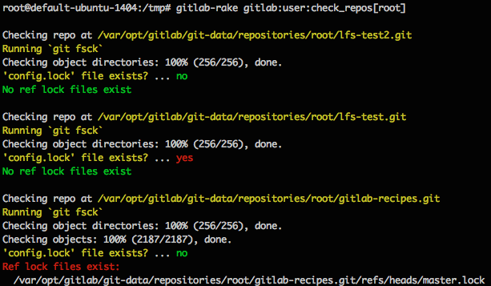

# Check Rake Tasks

## Repository Integrity

Even though Git is very resilient and tries to prevent data integrity issues,
there are times when things go wrong. The following Rake tasks intend to
help GitLab administrators diagnose problem repositories so they can be fixed.

There are 3 things that are checked to determine integrity.

1. Git repository file system check ([git fsck](https://git-scm.com/docs/git-fsck)).
   This step verifies the connectivity and validity of objects in the repository.
1. Check for `config.lock` in the repository directory.
1. Check for any branch/references lock files in `refs/heads`.

It's important to note that the existence of `config.lock` or reference locks
alone do not necessarily indicate a problem. Lock files are routinely created
and removed as Git and GitLab perform operations on the repository. They serve
to prevent data integrity issues. However, if a Git operation is interrupted these
locks may not be cleaned up properly.

The following symptoms may indicate a problem with repository integrity. If users
experience these symptoms you may use the rake tasks described below to determine
exactly which repositories are causing the trouble.

- Receiving an error when trying to push code - `remote: error: cannot lock ref`
- A 500 error when viewing the GitLab dashboard or when accessing a specific project.

### Check all GitLab repositories

This task loops through all repositories on the GitLab server and runs the
3 integrity checks described previously.

```
# omnibus-gitlab
sudo gitlab-rake gitlab:repo:check

# installation from source
bundle exec rake gitlab:repo:check RAILS_ENV=production
```

### Check repositories for a specific user

This task checks all repositories that a specific user has access to. This is important
because sometimes you know which user is experiencing trouble but you don't know
which project might be the cause.

If the rake task is executed without brackets at the end, you will be prompted
to enter a username.

```bash
# omnibus-gitlab
sudo gitlab-rake gitlab:user:check_repos
sudo gitlab-rake gitlab:user:check_repos[<username>]

# installation from source
bundle exec rake gitlab:user:check_repos RAILS_ENV=production
bundle exec rake gitlab:user:check_repos[<username>] RAILS_ENV=production
```

Example output:


