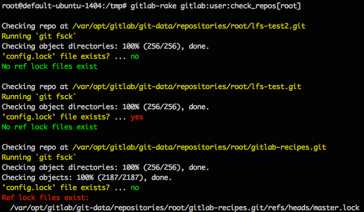

# Check Rake Tasks

## Repository Integrity

Even though Git is very resilient and tries to prevent data integrity issues,
there are times when things go wrong. The following Rake tasks intend to
help GitLab administrators diagnose problem repositories so they can be fixed.

There are 3 things that are checked to determine integrity.

1. Git repository file system check ([git fsck](https://git-scm.com/docs/git-fsck)).
   This step verifies the connectivity and validity of objects in the repository.
1. Check for `config.lock` in the repository directory.
1. Check for any branch/references lock files in `refs/heads`.

It's important to note that the existence of `config.lock` or reference locks
alone do not necessarily indicate a problem. Lock files are routinely created
and removed as Git and GitLab perform operations on the repository. They serve
to prevent data integrity issues. However, if a Git operation is interrupted these
locks may not be cleaned up properly.

The following symptoms may indicate a problem with repository integrity. If users
experience these symptoms you may use the rake tasks described below to determine
exactly which repositories are causing the trouble.

- Receiving an error when trying to push code - `remote: error: cannot lock ref`
- A 500 error when viewing the GitLab dashboard or when accessing a specific project.

### Check all GitLab repositories

>**Note:**
>
>  - `gitlab:repo:check` has been deprecated in favor of `gitlab:git:fsck`
>  - [Deprecated][ce-15931] in GitLab 10.4.
>  - `gitlab:repo:check` will be removed in the future. [Removal issue][ce-41699]

This task loops through all repositories on the GitLab server and runs the
3 integrity checks described previously.

**Omnibus Installation**

```
sudo gitlab-rake gitlab:git:fsck
```

**Source Installation**

```bash
sudo -u git -H bundle exec rake gitlab:git:fsck RAILS_ENV=production
```

### Check repositories for a specific user

This task checks all repositories that a specific user has access to. This is important
because sometimes you know which user is experiencing trouble but you don't know
which project might be the cause.

If the rake task is executed without brackets at the end, you will be prompted
to enter a username.

**Omnibus Installation**

```bash
sudo gitlab-rake gitlab:user:check_repos
sudo gitlab-rake gitlab:user:check_repos[<username>]
```

**Source Installation**

```bash
sudo -u git -H bundle exec rake gitlab:user:check_repos RAILS_ENV=production
sudo -u git -H bundle exec rake gitlab:user:check_repos[<username>] RAILS_ENV=production
```

Example output:



## Uploaded Files Integrity

Various types of file can be uploaded to a GitLab installation by users.
Checksums are generated and stored in the database upon upload, and integrity
checks using those checksums can be run. These checks also detect missing files.

Currently, integrity checks are supported for the following types of file:

* CI artifacts (Available from version 10.7.0)
* LFS objects (Available from version 10.6.0)
* User uploads (Available from version 10.6.0)

**Omnibus Installation**

```
sudo gitlab-rake gitlab:artifacts:check
sudo gitlab-rake gitlab:lfs:check
sudo gitlab-rake gitlab:uploads:check
```

**Source Installation**

```bash
sudo -u git -H bundle exec rake gitlab:artifacts:check RAILS_ENV=production
sudo -u git -H bundle exec rake gitlab:lfs:check RAILS_ENV=production
sudo -u git -H bundle exec rake gitlab:uploads:check RAILS_ENV=production
```

These tasks also accept some environment variables which you can use to override
certain values:

Variable  | Type    | Description
--------- | ------- | -----------
`BATCH`   | integer | Specifies the size of the batch. Defaults to 200.
`ID_FROM` | integer | Specifies the ID to start from, inclusive of the value.
`ID_TO`   | integer | Specifies the ID value to end at, inclusive of the value.
`VERBOSE` | boolean | Causes failures to be listed individually, rather than being summarized.

```bash
sudo gitlab-rake gitlab:artifacts:check BATCH=100 ID_FROM=50 ID_TO=250
sudo gitlab-rake gitlab:lfs:check BATCH=100 ID_FROM=50 ID_TO=250
sudo gitlab-rake gitlab:uploads:check BATCH=100 ID_FROM=50 ID_TO=250
```

## LDAP Check

The LDAP check Rake task will test the bind_dn and password credentials
(if configured) and will list a sample of LDAP users. This task is also
executed as part of the `gitlab:check` task, but can run independently.
See [LDAP Rake Tasks - LDAP Check](ldap.md#check) for details.

[ce-15931]: https://gitlab.com/gitlab-org/gitlab-ce/merge_requests/15931
[ce-41699]: https://gitlab.com/gitlab-org/gitlab-ce/issues/41699
