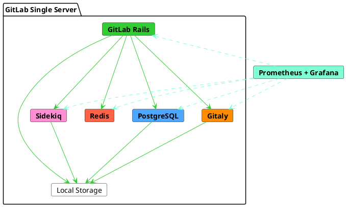

# Reference architecture: up to 1,000 users **(FREE SELF)**

This page describes GitLab reference architecture for up to 1,000 users. For a
full list of reference architectures, see
[Available reference architectures](index.md#available-reference-architectures).

If you need to serve up to 1,000 users and you don't have strict availability
requirements, a single-node solution with
[frequent backups](index.md#automated-backups) is appropriate for
many organizations.

> - **Supported users (approximate):** 1,000
> - **High Availability:** No. For a highly-available environment, you can
>   follow a modified [3K reference architecture](3k_users.md#supported-modifications-for-lower-user-counts-ha).
> - **Estimated Costs:** [See cost table](index.md#cost-to-run)
> - **Cloud Native Hybrid:** No. For a cloud native hybrid environment, you
>  can follow a [modified hybrid reference architecture](#cloud-native-hybrid-reference-architecture-with-helm-charts).
> - **Validation and test results:** The Quality Engineering team does [regular smoke and performance tests](index.md#validation-and-test-results) to ensure the reference architectures remain compliant
>   - **Test requests per second (RPS) rates:** API: 20 RPS, Web: 2 RPS, Git (Pull): 2 RPS, Git (Push): 1 RPS
>   - **[Latest Results](https://gitlab.com/gitlab-org/quality/performance/-/wikis/Benchmarks/Latest/1k)**

| Users        | Configuration           | GCP            | AWS          | Azure    |
|--------------|-------------------------|----------------|--------------|----------|
| Up to 500    | 4 vCPU, 3.6 GB memory   | `n1-highcpu-4` | `c5.xlarge`  | `F4s v2` |
| Up to 1,000  | 8 vCPU, 7.2 GB memory   | `n1-highcpu-8` | `c5.2xlarge` | `F8s v2` |

The diagram above shows that while GitLab can be installed on a single server, it is internally composed of multiple services. As a GitLab instance is scaled, each of these services are broken out and independently scaled according to the demands placed on them. In some cases PaaS can be leveraged for some services (for example, Cloud Object Storage for some file systems). For the sake of redundancy some of the services become clusters of nodes storing the same data. In a horizontal configuration of GitLab there are various ancillary services required to coordinate clusters or discover of resources (for example, PgBouncer for PostgreSQL connection management, Consul for Prometheus end point discovery).

## Requirements

Before starting, you should take note of the following requirements / guidance for this reference architecture.

### Supported CPUs

This reference architecture was built and tested on Google Cloud Platform (GCP) using the
[Intel Xeon E5 v3 (Haswell)](https://cloud.google.com/compute/docs/cpu-platforms)
CPU platform. On different hardware you may find that adjustments, either lower
or higher, are required for your CPU or node counts. For more information, see
our [Sysbench](https://github.com/akopytov/sysbench)-based
[CPU benchmarks](https://gitlab.com/gitlab-org/quality/performance/-/wikis/Reference-Architectures/GCP-CPU-Benchmarks).

### Supported infrastructure

As a general guidance, GitLab should run on most infrastructure such as reputable Cloud Providers (AWS, GCP, Azure) and their services, or self managed (ESXi) that meet both the specs detailed above, as well as any requirements in this section. However, this does not constitute a guarantee for every potential permutation.

Be aware of the following specific call outs:

- [Azure Database for PostgreSQL](https://docs.microsoft.com/en-us/azure/postgresql/#:~:text=Azure%20Database%20for%20PostgreSQL%20is,high%20availability%2C%20and%20dynamic%20scalability.) is [not recommended](https://gitlab.com/gitlab-org/quality/reference-architectures/-/issues/61) due to known performance issues or missing features.
- [Azure Blob Storage](https://docs.microsoft.com/en-us/azure/storage/blobs/) is recommended to be configured with [Premium accounts](https://docs.microsoft.com/en-us/azure/storage/blobs/storage-blob-block-blob-premium) to ensure consistent performance.

### Swap

In addition to the stated configurations, we recommend having at least 2 GB of
swap on your server, even if you currently have enough available memory. Having
swap helps to reduce the chance of errors occurring if your available memory
changes. We also recommend configuring the kernel's swappiness setting to a
lower value (such as `10`) to make the most of your memory, while still having
the swap available when needed. View the
[Memory requirements](../../install/requirements.md#memory) for details.

## Setup instructions

To install GitLab for this default reference architecture, use the standard
[installation instructions](../../install/index.md).

You can also optionally configure GitLab to use an [external PostgreSQL service](../postgresql/external.md)
or an [external object storage service](../object_storage.md) for added
performance and reliability at an increased complexity cost.

## Configure Advanced Search **(PREMIUM SELF)**

You can leverage Elasticsearch and [enable Advanced Search](../../integration/advanced_search/elasticsearch.md)
for faster, more advanced code search across your entire GitLab instance.

Elasticsearch cluster design and requirements are dependent on your specific
data. For recommended best practices about how to set up your Elasticsearch
cluster alongside your instance, read how to
[choose the optimal cluster configuration](../../integration/advanced_search/elasticsearch.md#guidance-on-choosing-optimal-cluster-configuration).

## Cloud Native Hybrid reference architecture with Helm Charts

Cloud Native Hybrid Reference Architecture is an alternative approach where select _stateless_
components are deployed in Kubernetes via our official [Helm Charts](https://docs.gitlab.com/charts/),
and _stateful_ components are deployed in compute VMs with Omnibus.

The [2k GitLab Cloud Native Hybrid](2k_users.md#cloud-native-hybrid-reference-architecture-with-helm-charts-alternative) (non HA) and [3k GitLab Cloud Native Hybrid](3k_users.md#cloud-native-hybrid-reference-architecture-with-helm-charts-alternative) (HA) reference architectures are the smallest we recommend in Kubernetes.
For environments that need to serve less users, you can lower the node specs. Depending on your user count, you can lower all suggested node specs as desired. However, it's recommended that you don't go lower than the [general requirements](../../install/requirements.md).
