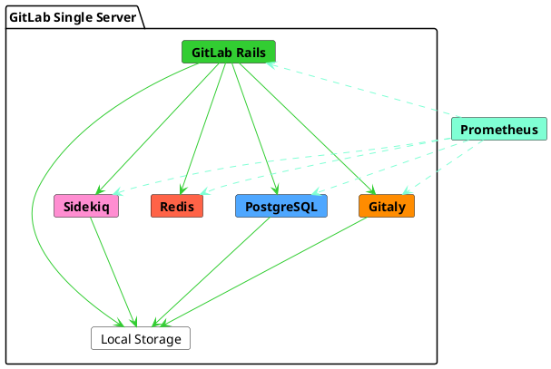

DETAILS:
**Tier:** Free, Premium, Ultimate
**Offering:** GitLab Self-Managed

This reference architecture targets a peak load of 20 requests per second (RPS). Based on real data, this load typically corresponds to up to 1,000 users, which includes both manual and automated interactions.

For a full list of reference architectures, see
[available reference architectures](_index.md#available-reference-architectures).

> - **Target Load:** API: 20 RPS, Web: 2 RPS, Git (Pull): 2 RPS, Git (Push): 1 RPS
> - **High Availability:** No. For a high availability environment,
>   follow a modified [3K reference architecture](3k_users.md#supported-modifications-for-lower-user-counts-ha).
> - **Cost calculator template:** For more information, see [cost calculator templates](_index.md#cost-calculator-templates).
> - **Cloud Native Hybrid:** No. For a cloud native hybrid environment, you
>   can follow a [modified hybrid reference architecture](#cloud-native-hybrid-reference-architecture-with-helm-charts).
> - **Unsure which Reference Architecture to use?** For more information, see [deciding which architecture to start with](_index.md#deciding-which-architecture-to-start-with).

| Users        | Configuration        | GCP            | AWS          | Azure    |
|--------------|----------------------|----------------|--------------|----------|
| Up to 1,000 or 20 RPS | 8 vCPU, 16 GB memory | `n1-standard-8`1 | `c5.2xlarge` | `F8s v2` |

**Footnotes:**

<!-- Disable ordered list rule https://github.com/DavidAnson/markdownlint/blob/main/doc/Rules.md#md029---ordered-list-item-prefix -->
<!-- markdownlint-disable MD029 -->
1. For GCP, the closest and equivalent standard machine type has been selected that matches the recommended requirement of 8 vCPU and 16 GB of RAM. A [custom machine type](https://cloud.google.com/compute/docs/instances/creating-instance-with-custom-machine-type) can also be used if desired.
<!-- markdownlint-enable MD029 -->

The following diagram shows that while GitLab can be installed on a single server, it is internally composed of multiple services. When an instance scales, these services are separated and independently scaled according to their specific demands.

In some cases, you can leverage PaaS for some services. For example, you can use Cloud Object Storage for some file systems. For the sake of redundancy, some services become clusters of nodes and store the same data.

In a horizontally scaled GitLab configuration, various ancillary services are required to coordinate clusters or discover resources. For example, PgBouncer for PostgreSQL connection management, or Consul for Prometheus end point discovery.

## Requirements

Before starting, see the [requirements](_index.md#requirements) for reference architectures.

WARNING:
**The node's specifications are based on high percentiles of both usage patterns and repository sizes in good health.**
**However, if you have [large monorepos](_index.md#large-monorepos) (larger than several gigabytes) or [additional workloads](_index.md#additional-workloads), it might *significantly* impact the performance of the environment.**
If this applies to you, [further adjustments might be required](_index.md#scaling-an-environment). See the linked documentation and reach out to your [Customer Success Manager](https://handbook.gitlab.com/job-families/sales/customer-success-management/) or our [Support team](https://about.gitlab.com/support/) for further guidance.

## Testing methodology

The 1k architecture is designed to cover a large majority of workflows. It is regularly
[smoke and performance tested](_index.md#validation-and-test-results) by the Test Platform team
against the following endpoint throughput targets:

- API: 20 RPS
- Web: 2 RPS
- Git (Pull): 2 RPS
- Git (Push): 1 RPS

These targets are selected based on the real customer data of total environmental loads corresponding to the user count,
including CI and other workloads.

Testing is done regularly by using our [GitLab Performance Tool (GPT)](https://gitlab.com/gitlab-org/quality/performance) and its dataset, which is available for anyone to use.
The results of this testing are [available publicly on the GPT wiki](https://gitlab.com/gitlab-org/quality/performance/-/wikis/Benchmarks/Latest). For more information on our testing strategy, see [validation and test results](_index.md#validation-and-test-results).

## Setup instructions

To install GitLab for this default reference architecture, use the standard
[installation instructions](../../install/_index.md).

You can also optionally configure GitLab to use an [external PostgreSQL service](../postgresql/external.md)
or [external object storage service](../object_storage.md). It improves performance and reliability, but at an increased complexity cost.

## Configure advanced search

DETAILS:
**Tier:** Premium, Ultimate
**Offering:** GitLab Self-Managed

You can leverage Elasticsearch and [enable advanced search](../../integration/advanced_search/elasticsearch.md)
for faster, more advanced code search across your entire GitLab instance.

Elasticsearch cluster design and requirements depends on your
data. For recommended best practices about how to set up your Elasticsearch
cluster alongside your instance, see
[choose the optimal cluster configuration](../../integration/advanced_search/elasticsearch.md#guidance-on-choosing-optimal-cluster-configuration).

## Cloud Native Hybrid reference architecture with Helm Charts

In the Cloud Native Hybrid reference architecture setup, the select _stateless_
components are deployed in Kubernetes by using our official [Helm Charts](https://docs.gitlab.com/charts/).
The _stateful_ components are deployed in compute VMs with the Linux package.

The smallest reference architecture available for use in Kubernetes is the [2k or 40 RPS GitLab Cloud Native Hybrid](2k_users.md#cloud-native-hybrid-reference-architecture-with-helm-charts-alternative) (non HA) and [3k or 60 RPS GitLab Cloud Native Hybrid](3k_users.md#cloud-native-hybrid-reference-architecture-with-helm-charts-alternative) (HA).

For environments that serve fewer users or a lower RPS, you can lower the node specification. Depending on your user count, you can lower all suggested node specifications as desired. However, you should not go lower than the [general requirements](../../install/requirements.md).

## Next steps

Now you have a fresh GitLab environment with core functionality configured accordingly. You might want to configure additional optional GitLab features depending on your requirements. See [Steps after installing GitLab](../../install/next_steps.md) for more information.

NOTE:
Depending on your environment and requirements, additional hardware requirements or adjustments may be required to set up additional features. See the individual pages for more information.
