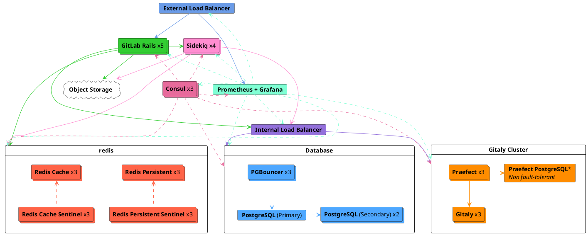

# Reference architecture: up to 25,000 users **(PREMIUM SELF)**

This page describes GitLab reference architecture for up to 25,000 users. For a
full list of reference architectures, see
[Available reference architectures](index.md#available-reference-architectures).

> - **Supported users (approximate):** 25,000
> - **High Availability:** Yes ([Praefect](#configure-praefect-postgresql) needs a third-party PostgreSQL solution for HA)
> - **Test requests per second (RPS) rates:** API: 500 RPS, Web: 50 RPS, Git (Pull): 50 RPS, Git (Push): 10 RPS

| Service                                  | Nodes       | Configuration           | GCP              | AWS          | Azure     |
|------------------------------------------|-------------|-------------------------|------------------|--------------|-----------|
| External load balancing node(3)          | 1           | 4 vCPU, 3.6 GB memory   | `n1-highcpu-4`   | `c5.xlarge`  | `F4s v2`  |
| Consul(1)                                | 3           | 2 vCPU, 1.8 GB memory   | `n1-highcpu-2`   | `c5.large`   | `F2s v2`  |
| PostgreSQL(1)                            | 3           | 16 vCPU, 60 GB memory   | `n1-standard-1`  | `m5.4xlarge` | `D16s v3` |
| PgBouncer(1)                             | 3           | 2 vCPU, 1.8 GB memory   | `n1-highcpu-2`   | `c5.large`   | `F2s v2`  |
| Internal load balancing node(3)          | 1           | 4 vCPU, 3.6GB memory    | `n1-highcpu-4`   | `c5.large`   | `F2s v2`  |
| Redis - Cache(2)                         | 3           | 4 vCPU, 15 GB memory    | `n1-standard-4`  | `m5.xlarge`  | `D4s v3`  |
| Redis - Queues / Shared State(2)         | 3           | 4 vCPU, 15 GB memory    | `n1-standard-4`  | `m5.xlarge`  | `D4s v3`  |
| Redis Sentinel - Cache(2)                | 3           | 1 vCPU, 3.75 GB memory  | `n1-standard-1`  | `c5.large`   | `A1 v2`   |
| Redis Sentinel - Queues / Shared State(2)| 3           | 1 vCPU, 3.75 GB memory  | `n1-standard-1`  | `c5.large`   | `A1 v2`   |
| Gitaly                                   | 3           | 32 vCPU, 120 GB memory  | `n1-standard-32` | `m5.8xlarge` | `D32s v3` |
| Praefect                                 | 3           | 4 vCPU, 3.6 GB memory   | `n1-highcpu-4`   | `c5.xlarge`  | `F4s v2`  |
| Praefect PostgreSQL(1)                   | 1+          | 2 vCPU, 1.8 GB memory   | `n1-highcpu-2`   | `c5.large`   | `F2s v2`  |
| Sidekiq                                  | 4           | 4 vCPU, 15 GB memory    | `n1-standard-4`  | `m5.xlarge`  | `D4s v3`  |
| GitLab Rails                             | 5           | 32 vCPU, 28.8 GB memory | `n1-highcpu-32`  | `c5.9xlarge` | `F32s v2` |
| Monitoring node                          | 1           | 4 vCPU, 3.6 GB memory   | `n1-highcpu-4`   | `c5.xlarge`  | `F4s v2`  |
| Object storage(4)                        | n/a         | n/a                     | n/a              | n/a          | n/a       |
| NFS server (optional, not recommended)   | 1           | 4 vCPU, 3.6 GB memory   | `n1-highcpu-4`   | `c5.xlarge`  | `F4s v2`  |

<!-- Disable ordered list rule https://github.com/DavidAnson/markdownlint/blob/main/doc/Rules.md#md029---ordered-list-item-prefix -->
<!-- markdownlint-disable MD029 -->
1. Can be optionally run on reputable third-party external PaaS PostgreSQL solutions. Google Cloud SQL and AWS RDS are known to work, however Azure Database for PostgreSQL is [not recommended](https://gitlab.com/gitlab-org/quality/reference-architectures/-/issues/61) due to performance issues. Consul is primarily used for PostgreSQL high availability so can be ignored when using a PostgreSQL PaaS setup. However it is also used optionally by Prometheus for Omnibus auto host discovery.
2. Can be optionally run on reputable third-party external PaaS Redis solutions. Google Memorystore and AWS Elasticache are known to work.
3. Can be optionally run on reputable third-party load balancing services (LB PaaS). AWS ELB is known to work.
4. Should be run on reputable third party object storage (storage PaaS) for cloud implementations. Google Cloud Storage and AWS S3 are known to work.
<!-- markdownlint-enable MD029 -->

NOTE:
For all PaaS solutions that involve configuring instances, it is strongly recommended to implement a minimum of three nodes in three different availability zones to align with resilient cloud architecture practices.



The Google Cloud Platform (GCP) architectures were built and tested using the
[Intel Xeon E5 v3 (Haswell)](https://cloud.google.com/compute/docs/cpu-platforms)
CPU platform. On different hardware you may find that adjustments, either lower
or higher, are required for your CPU or node counts. For more information, see
our [Sysbench](https://github.com/akopytov/sysbench)-based
[CPU benchmarks](https://gitlab.com/gitlab-org/quality/performance/-/wikis/Reference-Architectures/GCP-CPU-Benchmarks).

Due to better performance and availability, for data objects (such as LFS,
uploads, or artifacts), using an [object storage service](#configure-the-object-storage)
is recommended instead of using NFS. Using an object storage service also
doesn't require you to provision and maintain a node.

It's also worth noting that at this time [Praefect requires its own database server](../gitaly/praefect.md#postgresql) and
that to achieve full High Availability a third party PostgreSQL database solution will be required.
We hope to offer a built in solutions for these restrictions in the future but in the meantime a non HA PostgreSQL server
can be set up via Omnibus GitLab, which the above specs reflect. Refer to the following issues for more information: [`omnibus-gitlab#5919`](https://gitlab.com/gitlab-org/omnibus-gitlab/-/issues/5919) & [`gitaly#3398`](https://gitlab.com/gitlab-org/gitaly/-/issues/3398)

## Setup components

To set up GitLab and its components to accommodate up to 25,000 users:

1. [Configure the external load balancer](#configure-the-external-load-balancer)
   to handle the load balancing of the GitLab application services nodes.
1. [Configure the internal load balancer](#configure-the-internal-load-balancer).
   to handle the load balancing of GitLab application internal connections.
1. [Configure Consul](#configure-consul).
1. [Configure PostgreSQL](#configure-postgresql), the database for GitLab.
1. [Configure PgBouncer](#configure-pgbouncer).
1. [Configure Redis](#configure-redis).
1. [Configure Gitaly Cluster](#configure-gitaly-cluster),
   provides access to the Git repositories.
1. [Configure Sidekiq](#configure-sidekiq).
1. [Configure the main GitLab Rails application](#configure-gitlab-rails)
   to run Puma, Workhorse, GitLab Shell, and to serve all frontend
   requests (which include UI, API, and Git over HTTP/SSH).
1. [Configure Prometheus](#configure-prometheus) to monitor your GitLab
   environment.
1. [Configure the object storage](#configure-the-object-storage)
   used for shared data objects.
1. [Configure Advanced Search](#configure-advanced-search) (optional) for faster,
   more advanced code search across your entire GitLab instance.
1. [Configure NFS](#configure-nfs-optional) (optional, and not recommended)
   to have shared disk storage service as an alternative to Gitaly or object
   storage. You can skip this step if you're not using GitLab Pages (which
   requires NFS).

The servers start on the same 10.6.0.0/24 private network range, and can
connect to each other freely on these addresses.

The following list includes descriptions of each server and its assigned IP:

- `10.6.0.10`: External Load Balancer
- `10.6.0.11`: Consul 1
- `10.6.0.12`: Consul 2
- `10.6.0.13`: Consul 3
- `10.6.0.21`: PostgreSQL primary
- `10.6.0.22`: PostgreSQL secondary 1
- `10.6.0.23`: PostgreSQL secondary 2
- `10.6.0.31`: PgBouncer 1
- `10.6.0.32`: PgBouncer 2
- `10.6.0.33`: PgBouncer 3
- `10.6.0.40`: Internal Load Balancer
- `10.6.0.51`: Redis - Cache Primary
- `10.6.0.52`: Redis - Cache Replica 1
- `10.6.0.53`: Redis - Cache Replica 2
- `10.6.0.71`: Sentinel - Cache 1
- `10.6.0.72`: Sentinel - Cache 2
- `10.6.0.73`: Sentinel - Cache 3
- `10.6.0.61`: Redis - Queues Primary
- `10.6.0.62`: Redis - Queues Replica 1
- `10.6.0.63`: Redis - Queues Replica 2
- `10.6.0.81`: Sentinel - Queues 1
- `10.6.0.82`: Sentinel - Queues 2
- `10.6.0.83`: Sentinel - Queues 3
- `10.6.0.91`: Gitaly 1
- `10.6.0.92`: Gitaly 2
- `10.6.0.93`: Gitaly 3
- `10.6.0.131`: Praefect 1
- `10.6.0.132`: Praefect 2
- `10.6.0.133`: Praefect 3
- `10.6.0.141`: Praefect PostgreSQL 1 (non HA)
- `10.6.0.101`: Sidekiq 1
- `10.6.0.102`: Sidekiq 2
- `10.6.0.103`: Sidekiq 3
- `10.6.0.104`: Sidekiq 4
- `10.6.0.111`: GitLab application 1
- `10.6.0.112`: GitLab application 2
- `10.6.0.113`: GitLab application 3
- `10.6.0.114`: GitLab application 4
- `10.6.0.115`: GitLab application 5
- `10.6.0.151`: Prometheus

## Configure the external load balancer

In a multi-node GitLab configuration, you'll need a load balancer to route
traffic to the application servers. The specifics on which load balancer to use
or its exact configuration is beyond the scope of GitLab documentation. We assume
that if you're managing multi-node systems like GitLab, you already have a load
balancer of choice and that the routing methods used are distributing calls evenly
between all nodes. Some load balancer examples include HAProxy (open-source),
F5 Big-IP LTM, and Citrix Net Scaler. This documentation outline the ports and
protocols needed for use with GitLab.

This architecture has been tested and validated with [HAProxy](https://www.haproxy.org/)
as the load balancer. Although other load balancers with similar feature sets
could also be used, those load balancers have not been validated.

The next question is how you will handle SSL in your environment.
There are several different options:

- [The application node terminates SSL](#application-node-terminates-ssl).
- [The load balancer terminates SSL without backend SSL](#load-balancer-terminates-ssl-without-backend-ssl)
  and communication is not secure between the load balancer and the application node.
- [The load balancer terminates SSL with backend SSL](#load-balancer-terminates-ssl-with-backend-ssl)
  and communication is *secure* between the load balancer and the application node.

### Application node terminates SSL

Configure your load balancer to pass connections on port 443 as `TCP` rather
than `HTTP(S)` protocol. This will pass the connection to the application node's
NGINX service untouched. NGINX will have the SSL certificate and listen on port 443.

See the [NGINX HTTPS documentation](https://docs.gitlab.com/omnibus/settings/nginx.html#enable-https)
for details on managing SSL certificates and configuring NGINX.

### Load balancer terminates SSL without backend SSL

Configure your load balancer to use the `HTTP(S)` protocol rather than `TCP`.
The load balancer will then be responsible for managing SSL certificates and
terminating SSL.

Since communication between the load balancer and GitLab will not be secure,
there is some additional configuration needed. See the
[NGINX proxied SSL documentation](https://docs.gitlab.com/omnibus/settings/nginx.html#supporting-proxied-ssl)
for details.

### Load balancer terminates SSL with backend SSL

Configure your load balancer(s) to use the 'HTTP(S)' protocol rather than 'TCP'.
The load balancer(s) will be responsible for managing SSL certificates that
end users will see.

Traffic will also be secure between the load balancer(s) and NGINX in this
scenario. There is no need to add configuration for proxied SSL since the
connection will be secure all the way. However, configuration will need to be
added to GitLab to configure SSL certificates. See
[NGINX HTTPS documentation](https://docs.gitlab.com/omnibus/settings/nginx.html#enable-https)
for details on managing SSL certificates and configuring NGINX.

### Readiness checks

Ensure the external load balancer only routes to working services with built
in monitoring endpoints. The [readiness checks](../../user/admin_area/monitoring/health_check.md)
all require [additional configuration](../monitoring/ip_whitelist.md)
on the nodes being checked, otherwise, the external load balancer will not be able to
connect.

### Ports

The basic ports to be used are shown in the table below.

| LB Port | Backend Port | Protocol                 |
| ------- | ------------ | ------------------------ |
| 80      | 80           | HTTP (*1*)               |
| 443     | 443          | TCP or HTTPS (*1*) (*2*) |
| 22      | 22           | TCP                      |

- (*1*): [Web terminal](../../ci/environments/index.md#web-terminals) support requires
  your load balancer to correctly handle WebSocket connections. When using
  HTTP or HTTPS proxying, this means your load balancer must be configured
  to pass through the `Connection` and `Upgrade` hop-by-hop headers. See the
  [web terminal](../integration/terminal.md) integration guide for
  more details.
- (*2*): When using HTTPS protocol for port 443, you will need to add an SSL
  certificate to the load balancers. If you wish to terminate SSL at the
  GitLab application server instead, use TCP protocol.

If you're using GitLab Pages with custom domain support you will need some
additional port configurations.
GitLab Pages requires a separate virtual IP address. Configure DNS to point the
`pages_external_url` from `/etc/gitlab/gitlab.rb` at the new virtual IP address. See the
[GitLab Pages documentation](../pages/index.md) for more information.

| LB Port | Backend Port  | Protocol  |
| ------- | ------------- | --------- |
| 80      | Varies (*1*)  | HTTP      |
| 443     | Varies (*1*)  | TCP (*2*) |

- (*1*): The backend port for GitLab Pages depends on the
  `gitlab_pages['external_http']` and `gitlab_pages['external_https']`
  setting. See [GitLab Pages documentation](../pages/index.md) for more details.
- (*2*): Port 443 for GitLab Pages should always use the TCP protocol. Users can
  configure custom domains with custom SSL, which would not be possible
  if SSL was terminated at the load balancer.

#### Alternate SSH Port

Some organizations have policies against opening SSH port 22. In this case,
it may be helpful to configure an alternate SSH hostname that allows users
to use SSH on port 443. An alternate SSH hostname will require a new virtual IP address
compared to the other GitLab HTTP configuration above.

Configure DNS for an alternate SSH hostname such as `altssh.gitlab.example.com`.

| LB Port | Backend Port | Protocol |
| ------- | ------------ | -------- |
| 443     | 22           | TCP      |

<div align="right">
  <a type="button" class="btn btn-default" href="#setup-components">
    Back to setup components <i class="fa fa-angle-double-up" aria-hidden="true"></i>
  </a>
</div>

## Configure the internal load balancer

The Internal Load Balancer is used to balance any internal connections the GitLab environment requires
such as connections to [PgBouncer](#configure-pgbouncer) and [Praefect](#configure-praefect) (Gitaly Cluster).

Note that it's a separate node from the External Load Balancer and shouldn't have any access externally.

The following IP will be used as an example:

- `10.6.0.40`: Internal Load Balancer

Here's how you could do it with [HAProxy](https://www.haproxy.org/):

```plaintext
global
    log /dev/log local0
    log localhost local1 notice
    log stdout format raw local0

defaults
    log global
    default-server inter 10s fall 3 rise 2
    balance leastconn

frontend internal-pgbouncer-tcp-in
    bind *:6432
    mode tcp
    option tcplog

    default_backend pgbouncer

frontend internal-praefect-tcp-in
    bind *:2305
    mode tcp
    option tcplog
    option clitcpka

    default_backend praefect

backend pgbouncer
    mode tcp
    option tcp-check

    server pgbouncer1 10.6.0.21:6432 check
    server pgbouncer2 10.6.0.22:6432 check
    server pgbouncer3 10.6.0.23:6432 check

backend praefect
    mode tcp
    option tcp-check
    option srvtcpka

    server praefect1 10.6.0.131:2305 check
    server praefect2 10.6.0.132:2305 check
    server praefect3 10.6.0.133:2305 check
```

Refer to your preferred Load Balancer's documentation for further guidance.
Also ensure that the routing methods used are distributing calls evenly across
all nodes.

<div align="right">
  <a type="button" class="btn btn-default" href="#setup-components">
    Back to setup components <i class="fa fa-angle-double-up" aria-hidden="true"></i>
  </a>
</div>

## Configure Consul

The following IPs will be used as an example:

- `10.6.0.11`: Consul 1
- `10.6.0.12`: Consul 2
- `10.6.0.13`: Consul 3

To configure Consul:

1. SSH in to the server that will host Consul.
1. [Download and install](https://about.gitlab.com/install/) the Omnibus GitLab
   package of your choice. Be sure to both follow _only_ installation steps 1 and 2
   on the page, and to select the correct Omnibus GitLab package, with the same version
   and type (Community or Enterprise editions) as your current install.
1. Edit `/etc/gitlab/gitlab.rb` and add the contents:

   ```ruby
   roles(['consul_role'])

   ## Enable service discovery for Prometheus
   consul['monitoring_service_discovery'] =  true

   ## The IPs of the Consul server nodes
   ## You can also use FQDNs and intermix them with IPs
   consul['configuration'] = {
      server: true,
      retry_join: %w(10.6.0.11 10.6.0.12 10.6.0.13),
   }

   # Set the network addresses that the exporters will listen on
   node_exporter['listen_address'] = '0.0.0.0:9100'

   # Prevent database migrations from running on upgrade automatically
   gitlab_rails['auto_migrate'] = false
   ```

1. Copy the `/etc/gitlab/gitlab-secrets.json` file from the first Omnibus node you configured and add or replace
   the file of the same name on this server. If this is the first Omnibus node you are configuring then you can skip this step.

1. [Reconfigure Omnibus GitLab](../restart_gitlab.md#omnibus-gitlab-reconfigure) for the changes to take effect.

1. Go through the steps again for all the other Consul nodes, and
   make sure you set up the correct IPs.

A Consul leader is _elected_ when the provisioning of the third Consul server is
complete. Viewing the Consul logs `sudo gitlab-ctl tail consul` displays
`...[INFO] consul: New leader elected: ...`.

You can list the current Consul members (server, client):

```shell
sudo /opt/gitlab/embedded/bin/consul members
```

You can verify the GitLab services are running:

```shell
sudo gitlab-ctl status
```

The output should be similar to the following:

```plaintext
run: consul: (pid 30074) 76834s; run: log: (pid 29740) 76844s
run: logrotate: (pid 30925) 3041s; run: log: (pid 29649) 76861s
run: node-exporter: (pid 30093) 76833s; run: log: (pid 29663) 76855s
```

<div align="right">
  <a type="button" class="btn btn-default" href="#setup-components">
    Back to setup components <i class="fa fa-angle-double-up" aria-hidden="true"></i>
  </a>
</div>

## Configure PostgreSQL

In this section, you'll be guided through configuring an external PostgreSQL database
to be used with GitLab.

### Provide your own PostgreSQL instance

If you're hosting GitLab on a cloud provider, you can optionally use a
managed service for PostgreSQL. For example, AWS offers a managed Relational
Database Service (RDS) that runs PostgreSQL.

If you use a cloud-managed service, or provide your own PostgreSQL:

1. Set up PostgreSQL according to the
   [database requirements document](../../install/requirements.md#database).
1. Set up a `gitlab` username with a password of your choice. The `gitlab` user
   needs privileges to create the `gitlabhq_production` database.
1. Configure the GitLab application servers with the appropriate details.
   This step is covered in [Configuring the GitLab Rails application](#configure-gitlab-rails).

See [Configure GitLab using an external PostgreSQL service](../postgresql/external.md) for
further configuration steps.

### Standalone PostgreSQL using Omnibus GitLab

The following IPs will be used as an example:

- `10.6.0.21`: PostgreSQL primary
- `10.6.0.22`: PostgreSQL secondary 1
- `10.6.0.23`: PostgreSQL secondary 2

First, make sure to [install](https://about.gitlab.com/install/)
the Linux GitLab package **on each node**. Following the steps,
install the necessary dependencies from step 1, and add the
GitLab package repository from step 2. When installing GitLab
in the second step, do not supply the `EXTERNAL_URL` value.

#### PostgreSQL nodes

1. SSH in to one of the PostgreSQL nodes.
1. Generate a password hash for the PostgreSQL username/password pair. This assumes you will use the default
   username of `gitlab` (recommended). The command will request a password
   and confirmation. Use the value that is output by this command in the next
   step as the value of `<postgresql_password_hash>`:

   ```shell
   sudo gitlab-ctl pg-password-md5 gitlab
   ```

1. Generate a password hash for the PgBouncer username/password pair. This assumes you will use the default
   username of `pgbouncer` (recommended). The command will request a password
   and confirmation. Use the value that is output by this command in the next
   step as the value of `<pgbouncer_password_hash>`:

   ```shell
   sudo gitlab-ctl pg-password-md5 pgbouncer
   ```

1. Generate a password hash for the PostgreSQL replication username/password pair. This assumes you will use the default
   username of `gitlab_replicator` (recommended). The command will request a password
   and a confirmation. Use the value that is output by this command in the next step
   as the value of `<postgresql_replication_password_hash>`:

   ```shell
   sudo gitlab-ctl pg-password-md5 gitlab_replicator
   ```

1. Generate a password hash for the Consul database username/password pair. This assumes you will use the default
   username of `gitlab-consul` (recommended). The command will request a password
   and confirmation. Use the value that is output by this command in the next
   step as the value of `<consul_password_hash>`:

   ```shell
   sudo gitlab-ctl pg-password-md5 gitlab-consul
   ```

1. On every database node, edit `/etc/gitlab/gitlab.rb` replacing values noted in the `# START user configuration` section:

   ```ruby
   # Disable all components except Patroni and Consul
   roles(['patroni_role'])

   # PostgreSQL configuration
   postgresql['listen_address'] = '0.0.0.0'

   # Sets `max_replication_slots` to double the number of database nodes.
   # Patroni uses one extra slot per node when initiating the replication.
   patroni['postgresql']['max_replication_slots'] = 8

   # Set `max_wal_senders` to one more than the number of replication slots in the cluster.
   # This is used to prevent replication from using up all of the
   # available database connections.
   patroni['postgresql']['max_wal_senders'] = 9

   # Incoming recommended value for max connections is 500. See https://gitlab.com/gitlab-org/omnibus-gitlab/-/issues/5691.
   patroni['postgresql']['max_connections'] = 500

   # Prevent database migrations from running on upgrade automatically
   gitlab_rails['auto_migrate'] = false

   # Configure the Consul agent
   consul['services'] = %w(postgresql)
   ## Enable service discovery for Prometheus
   consul['monitoring_service_discovery'] =  true

   # START user configuration
   # Please set the real values as explained in Required Information section
   #
   # Replace PGBOUNCER_PASSWORD_HASH with a generated md5 value
   postgresql['pgbouncer_user_password'] = '<pgbouncer_password_hash>'
   # Replace POSTGRESQL_REPLICATION_PASSWORD_HASH with a generated md5 value
   postgresql['sql_replication_password'] = '<postgresql_replication_password_hash>'
   # Replace POSTGRESQL_PASSWORD_HASH with a generated md5 value
   postgresql['sql_user_password'] = '<postgresql_password_hash>'

   # Replace XXX.XXX.XXX.XXX/YY with Network Address
   postgresql['trust_auth_cidr_addresses'] = %w(10.6.0.0/24)

   # Set the network addresses that the exporters will listen on for monitoring
   node_exporter['listen_address'] = '0.0.0.0:9100'
   postgres_exporter['listen_address'] = '0.0.0.0:9187'

   ## The IPs of the Consul server nodes
   ## You can also use FQDNs and intermix them with IPs
   consul['configuration'] = {
      retry_join: %w(10.6.0.11 10.6.0.12 10.6.0.13),
   }
   #
   # END user configuration
   ```

PostgreSQL, with Patroni managing its failover, will default to use `pg_rewind` by default to handle conflicts.
Like most failover handling methods, this has a small chance of leading to data loss.
Learn more about the various [Patroni replication methods](../postgresql/replication_and_failover.md#selecting-the-appropriate-patroni-replication-method).

1. Copy the `/etc/gitlab/gitlab-secrets.json` file from the first Omnibus node you configured and add or replace
   the file of the same name on this server. If this is the first Omnibus node you are configuring then you can skip this step.

1. [Reconfigure GitLab](../restart_gitlab.md#omnibus-gitlab-reconfigure) for the changes to take effect.

Advanced [configuration options](https://docs.gitlab.com/omnibus/settings/database.html)
are supported and can be added if needed.

<div align="right">
  <a type="button" class="btn btn-default" href="#setup-components">
    Back to setup components <i class="fa fa-angle-double-up" aria-hidden="true"></i>
  </a>
</div>

#### PostgreSQL post-configuration

SSH in to any of the Patroni nodes on the **primary site**:

1. Check the status of the leader and cluster:

   ```shell
   gitlab-ctl patroni members
   ```

   The output should be similar to the following:

   ```plaintext
   | Cluster       | Member                            |  Host     | Role   | State   | TL  | Lag in MB | Pending restart |
   |---------------|-----------------------------------|-----------|--------|---------|-----|-----------|-----------------|
   | postgresql-ha | <PostgreSQL primary hostname>     | 10.6.0.21 | Leader | running | 175 |           | *               |
   | postgresql-ha | <PostgreSQL secondary 1 hostname> | 10.6.0.22 |        | running | 175 | 0         | *               |
   | postgresql-ha | <PostgreSQL secondary 2 hostname> | 10.6.0.23 |        | running | 175 | 0         | *               |
   ```

If the 'State' column for any node doesn't say "running", check the
[Troubleshooting section](troubleshooting.md) before proceeding.

<div align="right">
  <a type="button" class="btn btn-default" href="#setup-components">
    Back to setup components <i class="fa fa-angle-double-up" aria-hidden="true"></i>
  </a>
</div>

## Configure PgBouncer

Now that the PostgreSQL servers are all set up, let's configure PgBouncer.
The following IPs will be used as an example:

- `10.6.0.31`: PgBouncer 1
- `10.6.0.32`: PgBouncer 2
- `10.6.0.33`: PgBouncer 3

1. On each PgBouncer node, edit `/etc/gitlab/gitlab.rb`, and replace
   `<consul_password_hash>` and `<pgbouncer_password_hash>` with the
   password hashes you [set up previously](#postgresql-nodes):

   ```ruby
   # Disable all components except Pgbouncer and Consul agent
   roles(['pgbouncer_role'])

   # Configure PgBouncer
   pgbouncer['admin_users'] = %w(pgbouncer gitlab-consul)
   pgbouncer['users'] = {
      'gitlab-consul': {
         password: '<consul_password_hash>'
      },
      'pgbouncer': {
         password: '<pgbouncer_password_hash>'
      }
   }
   # Incoming recommended value for max db connections is 150. See https://gitlab.com/gitlab-org/omnibus-gitlab/-/issues/5691.
   pgbouncer['max_db_connections'] = 150

   # Configure Consul agent
   consul['watchers'] = %w(postgresql)
   consul['configuration'] = {
   retry_join: %w(10.6.0.11 10.6.0.12 10.6.0.13)
   }

   # Enable service discovery for Prometheus
   consul['monitoring_service_discovery'] = true

   # Set the network addresses that the exporters will listen on
   node_exporter['listen_address'] = '0.0.0.0:9100'
   ```

1. Copy the `/etc/gitlab/gitlab-secrets.json` file from the first Omnibus node you configured and add or replace
   the file of the same name on this server. If this is the first Omnibus node you are configuring then you can skip this step.

1. [Reconfigure Omnibus GitLab](../restart_gitlab.md#omnibus-gitlab-reconfigure) for the changes to take effect.

   If an error `execute[generate databases.ini]` occurs, this is due to an existing
   [known issue](https://gitlab.com/gitlab-org/omnibus-gitlab/-/issues/4713).
   It will be resolved when you run a second `reconfigure` after the next step.

1. Create a `.pgpass` file so Consul is able to
   reload PgBouncer. Enter the PgBouncer password twice when asked:

   ```shell
   gitlab-ctl write-pgpass --host 127.0.0.1 --database pgbouncer --user pgbouncer --hostuser gitlab-consul
   ```

1. [Reconfigure GitLab](../restart_gitlab.md#omnibus-gitlab-reconfigure) once again
   to resolve any potential errors from the previous steps.
1. Ensure each node is talking to the current primary:

   ```shell
   gitlab-ctl pgb-console # You will be prompted for PGBOUNCER_PASSWORD
   ```

1. Once the console prompt is available, run the following queries:

   ```shell
   show databases ; show clients ;
   ```

   The output should be similar to the following:

   ```plaintext
           name         |  host       | port |      database       | force_user | pool_size | reserve_pool | pool_mode | max_connections | current_connections
   ---------------------+-------------+------+---------------------+------------+-----------+--------------+-----------+-----------------+---------------------
    gitlabhq_production | MASTER_HOST | 5432 | gitlabhq_production |            |        20 |            0 |           |               0 |                   0
    pgbouncer           |             | 6432 | pgbouncer           | pgbouncer  |         2 |            0 | statement |               0 |                   0
   (2 rows)

    type |   user    |      database       |  state  |   addr         | port  | local_addr | local_port |    connect_time     |    request_time     |    ptr    | link | remote_pid | tls
   ------+-----------+---------------------+---------+----------------+-------+------------+------------+---------------------+---------------------+-----------+------+------------+-----
    C    | pgbouncer | pgbouncer           | active  | 127.0.0.1      | 56846 | 127.0.0.1  |       6432 | 2017-08-21 18:09:59 | 2017-08-21 18:10:48 | 0x22b3880 |      |          0 |
   (2 rows)
   ```

<div align="right">
  <a type="button" class="btn btn-default" href="#setup-components">
    Back to setup components <i class="fa fa-angle-double-up" aria-hidden="true"></i>
  </a>
</div>

## Configure Redis

Using [Redis](https://redis.io/) in scalable environment is possible using a **Primary** x **Replica**
topology with a [Redis Sentinel](https://redis.io/topics/sentinel) service to watch and automatically
start the failover procedure.

Redis requires authentication if used with Sentinel. See
[Redis Security](https://redis.io/topics/security) documentation for more
information. We recommend using a combination of a Redis password and tight
firewall rules to secure your Redis service.
You are highly encouraged to read the [Redis Sentinel](https://redis.io/topics/sentinel) documentation
before configuring Redis with GitLab to fully understand the topology and
architecture.

The requirements for a Redis setup are the following:

1. All Redis nodes must be able to talk to each other and accept incoming
   connections over Redis (`6379`) and Sentinel (`26379`) ports (unless you
   change the default ones).
1. The server that hosts the GitLab application must be able to access the
   Redis nodes.
1. Protect the nodes from access from external networks
   ([Internet](https://gitlab.com/gitlab-org/gitlab-foss/uploads/c4cc8cd353604bd80315f9384035ff9e/The_Internet_IT_Crowd.png)),
   using a firewall.

In this section, you'll be guided through configuring two external Redis clusters
to be used with GitLab. The following IPs will be used as an example:

- `10.6.0.51`: Redis - Cache Primary
- `10.6.0.52`: Redis - Cache Replica 1
- `10.6.0.53`: Redis - Cache Replica 2
- `10.6.0.71`: Sentinel - Cache 1
- `10.6.0.72`: Sentinel - Cache 2
- `10.6.0.73`: Sentinel - Cache 3
- `10.6.0.61`: Redis - Queues Primary
- `10.6.0.62`: Redis - Queues Replica 1
- `10.6.0.63`: Redis - Queues Replica 2
- `10.6.0.81`: Sentinel - Queues 1
- `10.6.0.82`: Sentinel - Queues 2
- `10.6.0.83`: Sentinel - Queues 3

### Providing your own Redis instance

Managed Redis from cloud providers (such as AWS ElastiCache) will work. If these
services support high availability, be sure it _isn't_ of the Redis Cluster type.
Redis version 5.0 or higher is required, which is included with Omnibus GitLab
packages starting with GitLab 13.0. Older Redis versions don't support an
optional count argument to SPOP, which is required for [Merge Trains](../../ci/pipelines/merge_trains.md).
Note the Redis node's IP address or hostname, port, and password (if required).
These will be necessary later when configuring the [GitLab application servers](#configure-gitlab-rails).

### Configure the Redis and Sentinel Cache cluster

This is the section where we install and set up the new Redis Cache instances.

Both the primary and replica Redis nodes need the same password defined in
`redis['password']`. At any time during a failover, the Sentinels can reconfigure
a node and change its status from primary to replica (and vice versa).

#### Configure the primary Redis Cache node

1. SSH in to the **Primary** Redis server.
1. [Download and install](https://about.gitlab.com/install/) the Omnibus GitLab
   package of your choice. Be sure to both follow _only_ installation steps 1 and 2
   on the page, and to select the correct Omnibus GitLab package, with the same version
   and type (Community or Enterprise editions) as your current install.
1. Edit `/etc/gitlab/gitlab.rb` and add the contents:

   ```ruby
   # Specify server role as 'redis_master_role' and enable Consul agent
   roles(['redis_master_role', 'consul_role']

   # IP address pointing to a local IP that the other machines can reach to.
   # You can also set bind to '0.0.0.0' which listen in all interfaces.
   # If you really need to bind to an external accessible IP, make
   # sure you add extra firewall rules to prevent unauthorized access.
   redis['bind'] = '10.6.0.51'

   # Define a port so Redis can listen for TCP requests which will allow other
   # machines to connect to it.
   redis['port'] = 6379

   # Set up password authentication for Redis (use the same password in all nodes).
   redis['password'] = 'REDIS_PRIMARY_PASSWORD_OF_FIRST_CLUSTER'

   # Set the Redis Cache instance as an LRU
   # 90% of available RAM in MB
   redis['maxmemory'] = '13500mb'
   redis['maxmemory_policy'] = "allkeys-lru"
   redis['maxmemory_samples'] = 5

   ## Enable service discovery for Prometheus
   consul['monitoring_service_discovery'] =  true

   ## The IPs of the Consul server nodes
   ## You can also use FQDNs and intermix them with IPs
   consul['configuration'] = {
      retry_join: %w(10.6.0.11 10.6.0.12 10.6.0.13),
   }

   # Set the network addresses that the exporters will listen on
   node_exporter['listen_address'] = '0.0.0.0:9100'
   redis_exporter['listen_address'] = '0.0.0.0:9121'
   redis_exporter['flags'] = {
        'redis.addr' => 'redis://10.6.0.51:6379',
        'redis.password' => 'redis-password-goes-here',
   }   

   # Prevent database migrations from running on upgrade automatically
   gitlab_rails['auto_migrate'] = false
   ```

1. Copy the `/etc/gitlab/gitlab-secrets.json` file from the first Omnibus node you configured and add or replace
   the file of the same name on this server. If this is the first Omnibus node you are configuring then you can skip this step.

1. [Reconfigure Omnibus GitLab](../restart_gitlab.md#omnibus-gitlab-reconfigure) for the changes to take effect.

You can specify multiple roles, like sentinel and Redis, as:
`roles(['redis_sentinel_role', 'redis_master_role'])`. Read more about
[roles](https://docs.gitlab.com/omnibus/roles/).

#### Configure the replica Redis Cache nodes

1. SSH in to the **replica** Redis server.
1. [Download and install](https://about.gitlab.com/install/) the Omnibus GitLab
   package of your choice. Be sure to both follow _only_ installation steps 1 and 2
   on the page, and to select the correct Omnibus GitLab package, with the same version
   and type (Community or Enterprise editions) as your current install.
1. Edit `/etc/gitlab/gitlab.rb` and add the contents:

   ```ruby
   # Specify server role as 'redis_replica_role' and enable Consul agent
   roles(['redis_replica_role', 'consul_role']

   # IP address pointing to a local IP that the other machines can reach to.
   # You can also set bind to '0.0.0.0' which listen in all interfaces.
   # If you really need to bind to an external accessible IP, make
   # sure you add extra firewall rules to prevent unauthorized access.
   redis['bind'] = '10.6.0.52'

   # Define a port so Redis can listen for TCP requests which will allow other
   # machines to connect to it.
   redis['port'] = 6379

   # The same password for Redis authentication you set up for the primary node.
   redis['password'] = 'REDIS_PRIMARY_PASSWORD_OF_FIRST_CLUSTER'

   # The IP of the primary Redis node.
   redis['master_ip'] = '10.6.0.51'

   # Port of primary Redis server, uncomment to change to non default. Defaults
   # to `6379`.
   #redis['master_port'] = 6379

   # Set the Redis Cache instance as an LRU
   # 90% of available RAM in MB
   redis['maxmemory'] = '13500mb'
   redis['maxmemory_policy'] = "allkeys-lru"
   redis['maxmemory_samples'] = 5

   ## Enable service discovery for Prometheus
   consul['monitoring_service_discovery'] =  true

   ## The IPs of the Consul server nodes
   ## You can also use FQDNs and intermix them with IPs
   consul['configuration'] = {
      retry_join: %w(10.6.0.11 10.6.0.12 10.6.0.13),
   }

   # Set the network addresses that the exporters will listen on
   node_exporter['listen_address'] = '0.0.0.0:9100'
   redis_exporter['listen_address'] = '0.0.0.0:9121'
   redis_exporter['flags'] = {
        'redis.addr' => 'redis://10.6.0.52:6379',
        'redis.password' => 'redis-password-goes-here',
   }

   # Prevent database migrations from running on upgrade automatically
   gitlab_rails['auto_migrate'] = false
   ```

1. Copy the `/etc/gitlab/gitlab-secrets.json` file from the first Omnibus node you configured and add or replace
   the file of the same name on this server. If this is the first Omnibus node you are configuring then you can skip this step.

1. [Reconfigure Omnibus GitLab](../restart_gitlab.md#omnibus-gitlab-reconfigure) for the changes to take effect.

1. Go through the steps again for all the other replica nodes, and
   make sure to set up the IPs correctly.

You can specify multiple roles, like sentinel and Redis, as:
`roles(['redis_sentinel_role', 'redis_master_role'])`. Read more about
[roles](https://docs.gitlab.com/omnibus/roles/).

These values don't have to be changed again in `/etc/gitlab/gitlab.rb` after
a failover, as the nodes will be managed by the [Sentinels](#configure-the-sentinel-cache-nodes), and even after a
`gitlab-ctl reconfigure`, they will get their configuration restored by
the same Sentinels.

Advanced [configuration options](https://docs.gitlab.com/omnibus/settings/redis.html)
are supported and can be added if needed.

<div align="right">
  <a type="button" class="btn btn-default" href="#setup-components">
    Back to setup components <i class="fa fa-angle-double-up" aria-hidden="true"></i>
  </a>
</div>

#### Configure the Sentinel Cache nodes

Now that the Redis servers are all set up, let's configure the Sentinel
servers. The following IPs will be used as an example:

- `10.6.0.71`: Sentinel - Cache 1
- `10.6.0.72`: Sentinel - Cache 2
- `10.6.0.73`: Sentinel - Cache 3

NOTE:
If you're using an external Redis Sentinel instance, be sure to exclude the
`requirepass` parameter from the Sentinel configuration. This parameter causes
clients to report `NOAUTH Authentication required.`.
[Redis Sentinel 3.2.x doesn't support password authentication](https://github.com/antirez/redis/issues/3279).

To configure the Sentinel Cache server:

1. SSH in to the server that will host Consul/Sentinel.
1. [Download and install](https://about.gitlab.com/install/) the Omnibus GitLab
   package of your choice. Be sure to both follow _only_ installation steps 1 and 2
   on the page, and to select the correct Omnibus GitLab package, with the same version
   and type (Community or Enterprise editions) as your current install.
1. Edit `/etc/gitlab/gitlab.rb` and add the contents:

   ```ruby
   roles(['redis_sentinel_role', 'consul_role'])

   ## Must be the same in every sentinel node
   redis['master_name'] = 'gitlab-redis-cache'

   ## The same password for Redis authentication you set up for the primary node.
   redis['master_password'] = 'REDIS_PRIMARY_PASSWORD_OF_FIRST_CLUSTER'

   ## The IP of the primary Redis node.
   redis['master_ip'] = '10.6.0.51'

   ## Define a port so Redis can listen for TCP requests which will allow other
   ## machines to connect to it.
   redis['port'] = 6379

   ## Port of primary Redis server, uncomment to change to non default. Defaults
   ## to `6379`.
   #redis['master_port'] = 6379

   ## Configure Sentinel's IP
   sentinel['bind'] = '10.6.0.71'

   ## Port that Sentinel listens on, uncomment to change to non default. Defaults
   ## to `26379`.
   #sentinel['port'] = 26379

   ## Quorum must reflect the amount of voting sentinels it take to start a failover.
   ## Value must NOT be greater then the amount of sentinels.
   ##
   ## The quorum can be used to tune Sentinel in two ways:
   ## 1. If a the quorum is set to a value smaller than the majority of Sentinels
   ##    we deploy, we are basically making Sentinel more sensible to primary failures,
   ##    triggering a failover as soon as even just a minority of Sentinels is no longer
   ##    able to talk with the primary.
   ## 1. If a quorum is set to a value greater than the majority of Sentinels, we are
   ##    making Sentinel able to failover only when there are a very large number (larger
   ##    than majority) of well connected Sentinels which agree about the primary being down.s
   sentinel['quorum'] = 2

   ## Consider unresponsive server down after x amount of ms.
   #sentinel['down_after_milliseconds'] = 10000

   ## Specifies the failover timeout in milliseconds. It is used in many ways:
   ##
   ## - The time needed to re-start a failover after a previous failover was
   ##   already tried against the same primary by a given Sentinel, is two
   ##   times the failover timeout.
   ##
   ## - The time needed for a replica replicating to a wrong primary according
   ##   to a Sentinel current configuration, to be forced to replicate
   ##   with the right primary, is exactly the failover timeout (counting since
   ##   the moment a Sentinel detected the misconfiguration).
   ##
   ## - The time needed to cancel a failover that is already in progress but
   ##   did not produced any configuration change (REPLICAOF NO ONE yet not
   ##   acknowledged by the promoted replica).
   ##
   ## - The maximum time a failover in progress waits for all the replica to be
   ##   reconfigured as replicas of the new primary. However even after this time
   ##   the replicas will be reconfigured by the Sentinels anyway, but not with
   ##   the exact parallel-syncs progression as specified.
   #sentinel['failover_timeout'] = 60000

   ## Enable service discovery for Prometheus
   consul['monitoring_service_discovery'] =  true

   ## The IPs of the Consul server nodes
   ## You can also use FQDNs and intermix them with IPs
   consul['configuration'] = {
      retry_join: %w(10.6.0.11 10.6.0.12 10.6.0.13),
   }

   # Set the network addresses that the exporters will listen on
   node_exporter['listen_address'] = '0.0.0.0:9100'
   redis_exporter['listen_address'] = '0.0.0.0:9121'

   # Prevent database migrations from running on upgrade automatically
   gitlab_rails['auto_migrate'] = false
   ```

1. Copy the `/etc/gitlab/gitlab-secrets.json` file from the first Omnibus node you configured and add or replace
   the file of the same name on this server. If this is the first Omnibus node you are configuring then you can skip this step.

1. [Reconfigure Omnibus GitLab](../restart_gitlab.md#omnibus-gitlab-reconfigure) for the changes to take effect.

1. Go through the steps again for all the other Consul/Sentinel nodes, and
   make sure you set up the correct IPs.

<div align="right">
  <a type="button" class="btn btn-default" href="#setup-components">
    Back to setup components <i class="fa fa-angle-double-up" aria-hidden="true"></i>
  </a>
</div>

### Configure the Redis and Sentinel Queues cluster

This is the section where we install and set up the new Redis Queues instances.

Both the primary and replica Redis nodes need the same password defined in
`redis['password']`. At any time during a failover, the Sentinels can reconfigure
a node and change its status from primary to replica (and vice versa).

#### Configure the primary Redis Queues node

1. SSH in to the **Primary** Redis server.
1. [Download and install](https://about.gitlab.com/install/) the Omnibus GitLab
   package of your choice. Be sure to both follow _only_ installation steps 1 and 2
   on the page, and to select the correct Omnibus GitLab package, with the same version
   and type (Community or Enterprise editions) as your current install.
1. Edit `/etc/gitlab/gitlab.rb` and add the contents:

   ```ruby
   # Specify server role as 'redis_master_role' and enable Consul agent
   roles(['redis_master_role', 'consul_role'])

   # IP address pointing to a local IP that the other machines can reach to.
   # You can also set bind to '0.0.0.0' which listen in all interfaces.
   # If you really need to bind to an external accessible IP, make
   # sure you add extra firewall rules to prevent unauthorized access.
   redis['bind'] = '10.6.0.61'

   # Define a port so Redis can listen for TCP requests which will allow other
   # machines to connect to it.
   redis['port'] = 6379

   # Set up password authentication for Redis (use the same password in all nodes).
   redis['password'] = 'REDIS_PRIMARY_PASSWORD_OF_SECOND_CLUSTER'

   ## Enable service discovery for Prometheus
   consul['monitoring_service_discovery'] =  true

   ## The IPs of the Consul server nodes
   ## You can also use FQDNs and intermix them with IPs
   consul['configuration'] = {
      retry_join: %w(10.6.0.11 10.6.0.12 10.6.0.13),
   }

   # Set the network addresses that the exporters will listen on
   node_exporter['listen_address'] = '0.0.0.0:9100'
   redis_exporter['listen_address'] = '0.0.0.0:9121'

   # Prevent database migrations from running on upgrade automatically
   gitlab_rails['auto_migrate'] = false
   ```

1. Copy the `/etc/gitlab/gitlab-secrets.json` file from the first Omnibus node you configured and add or replace
   the file of the same name on this server. If this is the first Omnibus node you are configuring then you can skip this step.

1. [Reconfigure Omnibus GitLab](../restart_gitlab.md#omnibus-gitlab-reconfigure) for the changes to take effect.

You can specify multiple roles, like sentinel and Redis, as:
`roles(['redis_sentinel_role', 'redis_master_role'])`. Read more about
[roles](https://docs.gitlab.com/omnibus/roles/).

#### Configure the replica Redis Queues nodes

1. SSH in to the **replica** Redis Queue server.
1. [Download and install](https://about.gitlab.com/install/) the Omnibus GitLab
   package of your choice. Be sure to both follow _only_ installation steps 1 and 2
   on the page, and to select the correct Omnibus GitLab package, with the same version
   and type (Community or Enterprise editions) as your current install.
1. Edit `/etc/gitlab/gitlab.rb` and add the contents:

   ```ruby
   # Specify server role as 'redis_replica_role' and enable Consul agent
   roles(['redis_replica_role', 'consul_role'])

   # IP address pointing to a local IP that the other machines can reach to.
   # You can also set bind to '0.0.0.0' which listen in all interfaces.
   # If you really need to bind to an external accessible IP, make
   # sure you add extra firewall rules to prevent unauthorized access.
   redis['bind'] = '10.6.0.62'

   # Define a port so Redis can listen for TCP requests which will allow other
   # machines to connect to it.
   redis['port'] = 6379

   # The same password for Redis authentication you set up for the primary node.
   redis['password'] = 'REDIS_PRIMARY_PASSWORD_OF_SECOND_CLUSTER'

   # The IP of the primary Redis node.
   redis['master_ip'] = '10.6.0.61'

   # Port of primary Redis server, uncomment to change to non default. Defaults
   # to `6379`.
   #redis['master_port'] = 6379

   ## Enable service discovery for Prometheus
   consul['monitoring_service_discovery'] =  true

   ## The IPs of the Consul server nodes
   ## You can also use FQDNs and intermix them with IPs
   consul['configuration'] = {
      retry_join: %w(10.6.0.11 10.6.0.12 10.6.0.13),
   }

   # Set the network addresses that the exporters will listen on
   node_exporter['listen_address'] = '0.0.0.0:9100'
   redis_exporter['listen_address'] = '0.0.0.0:9121'
   redis_exporter['flags'] = {
        'redis.addr' => 'redis://10.6.0.62:6379',
        'redis.password' => 'redis-password-goes-here',
   }

   # Prevent database migrations from running on upgrade automatically
   gitlab_rails['auto_migrate'] = false
   ```

1. Copy the `/etc/gitlab/gitlab-secrets.json` file from the first Omnibus node you configured and add or replace
   the file of the same name on this server. If this is the first Omnibus node you are configuring then you can skip this step.

1. [Reconfigure Omnibus GitLab](../restart_gitlab.md#omnibus-gitlab-reconfigure) for the changes to take effect.

1. Go through the steps again for all the other replica nodes, and
   make sure to set up the IPs correctly.

You can specify multiple roles, like sentinel and Redis, as:
`roles(['redis_sentinel_role', 'redis_master_role'])`. Read more about
[roles](https://docs.gitlab.com/omnibus/roles/).

These values don't have to be changed again in `/etc/gitlab/gitlab.rb` after
a failover, as the nodes will be managed by the [Sentinels](#configure-the-sentinel-queues-nodes), and even after a
`gitlab-ctl reconfigure`, they will get their configuration restored by
the same Sentinels.

Advanced [configuration options](https://docs.gitlab.com/omnibus/settings/redis.html)
are supported and can be added if needed.

<div align="right">
  <a type="button" class="btn btn-default" href="#setup-components">
    Back to setup components <i class="fa fa-angle-double-up" aria-hidden="true"></i>
  </a>
</div>

#### Configure the Sentinel Queues nodes

Now that the Redis servers are all set up, let's configure the Sentinel
servers. The following IPs will be used as an example:

- `10.6.0.81`: Sentinel - Queues 1
- `10.6.0.82`: Sentinel - Queues 2
- `10.6.0.83`: Sentinel - Queues 3

NOTE:
If you're using an external Redis Sentinel instance, be sure to exclude the
`requirepass` parameter from the Sentinel configuration. This parameter causes
clients to report `NOAUTH Authentication required.`.
[Redis Sentinel 3.2.x doesn't support password authentication](https://github.com/antirez/redis/issues/3279).

To configure the Sentinel Queues server:

1. SSH in to the server that will host Sentinel.
1. [Download and install](https://about.gitlab.com/install/) the Omnibus GitLab
   package of your choice. Be sure to both follow _only_ installation steps 1 and 2
   on the page, and to select the correct Omnibus GitLab package, with the same version
   and type (Community or Enterprise editions) as your current install.
1. Edit `/etc/gitlab/gitlab.rb` and add the contents:

   ```ruby
   roles(['redis_sentinel_role', 'consul_role'])

   ## Must be the same in every sentinel node
   redis['master_name'] = 'gitlab-redis-persistent'

   ## The same password for Redis authentication you set up for the primary node.
   redis['master_password'] = 'REDIS_PRIMARY_PASSWORD_OF_SECOND_CLUSTER'

   ## The IP of the primary Redis node.
   redis['master_ip'] = '10.6.0.61'

   ## Define a port so Redis can listen for TCP requests which will allow other
   ## machines to connect to it.
   redis['port'] = 6379

   ## Port of primary Redis server, uncomment to change to non default. Defaults
   ## to `6379`.
   #redis['master_port'] = 6379

   ## Configure Sentinel's IP
   sentinel['bind'] = '10.6.0.81'

   ## Port that Sentinel listens on, uncomment to change to non default. Defaults
   ## to `26379`.
   #sentinel['port'] = 26379

   ## Quorum must reflect the amount of voting sentinels it take to start a failover.
   ## Value must NOT be greater then the amount of sentinels.
   ##
   ## The quorum can be used to tune Sentinel in two ways:
   ## 1. If a the quorum is set to a value smaller than the majority of Sentinels
   ##    we deploy, we are basically making Sentinel more sensible to primary failures,
   ##    triggering a failover as soon as even just a minority of Sentinels is no longer
   ##    able to talk with the primary.
   ## 1. If a quorum is set to a value greater than the majority of Sentinels, we are
   ##    making Sentinel able to failover only when there are a very large number (larger
   ##    than majority) of well connected Sentinels which agree about the primary being down.s
   sentinel['quorum'] = 2

   ## Consider unresponsive server down after x amount of ms.
   #sentinel['down_after_milliseconds'] = 10000

   ## Specifies the failover timeout in milliseconds. It is used in many ways:
   ##
   ## - The time needed to re-start a failover after a previous failover was
   ##   already tried against the same primary by a given Sentinel, is two
   ##   times the failover timeout.
   ##
   ## - The time needed for a replica replicating to a wrong primary according
   ##   to a Sentinel current configuration, to be forced to replicate
   ##   with the right primary, is exactly the failover timeout (counting since
   ##   the moment a Sentinel detected the misconfiguration).
   ##
   ## - The time needed to cancel a failover that is already in progress but
   ##   did not produced any configuration change (REPLICAOF NO ONE yet not
   ##   acknowledged by the promoted replica).
   ##
   ## - The maximum time a failover in progress waits for all the replica to be
   ##   reconfigured as replicas of the new primary. However even after this time
   ##   the replicas will be reconfigured by the Sentinels anyway, but not with
   ##   the exact parallel-syncs progression as specified.
   #sentinel['failover_timeout'] = 60000

   ## Enable service discovery for Prometheus
   consul['monitoring_service_discovery'] =  true

   ## The IPs of the Consul server nodes
   ## You can also use FQDNs and intermix them with IPs
   consul['configuration'] = {
      retry_join: %w(10.6.0.11 10.6.0.12 10.6.0.13),
   }

   # Set the network addresses that the exporters will listen on
   node_exporter['listen_address'] = '0.0.0.0:9100'
   redis_exporter['listen_address'] = '0.0.0.0:9121'

   # Prevent database migrations from running on upgrade automatically
   gitlab_rails['auto_migrate'] = false
   ```

1. Copy the `/etc/gitlab/gitlab-secrets.json` file from the first Omnibus node you configured and add or replace
   the file of the same name on this server. If this is the first Omnibus node you are configuring then you can skip this step.

1. To ensure database migrations are only run during reconfigure and not automatically on upgrade, run:

   ```shell
   sudo touch /etc/gitlab/skip-auto-reconfigure
   ```

   Only the primary GitLab application server should handle migrations.

1. [Reconfigure Omnibus GitLab](../restart_gitlab.md#omnibus-gitlab-reconfigure) for the changes to take effect.

1. Go through the steps again for all the other Sentinel nodes, and
   make sure you set up the correct IPs.

<div align="right">
  <a type="button" class="btn btn-default" href="#setup-components">
    Back to setup components <i class="fa fa-angle-double-up" aria-hidden="true"></i>
  </a>
</div>

## Configure Gitaly Cluster

[Gitaly Cluster](../gitaly/praefect.md) is a GitLab provided and recommended fault tolerant solution for storing Git repositories.
In this configuration, every Git repository is stored on every Gitaly node in the cluster, with one being designated the primary, and failover occurs automatically if the primary node goes down.

The recommended cluster setup includes the following components:

- 3 Gitaly nodes: Replicated storage of Git repositories.
- 3 Praefect nodes: Router and transaction manager for Gitaly Cluster.
- 1 Praefect PostgreSQL node: Database server for Praefect. A third-party solution
  is required for Praefect database connections to be made highly available.
- 1 load balancer: A load balancer is required for Praefect. The
  [internal load balancer](#configure-the-internal-load-balancer) will be used.

This section will detail how to configure the recommended standard setup in order.
For more advanced setups refer to the [standalone Gitaly Cluster documentation](../gitaly/praefect.md).

### Configure Praefect PostgreSQL

Praefect, the routing and transaction manager for Gitaly Cluster, requires its own database server to store data on Gitaly Cluster status.

If you want to have a highly available setup, Praefect requires a third-party PostgreSQL database.
A built-in solution is being [worked on](https://gitlab.com/gitlab-org/omnibus-gitlab/-/issues/5919).

#### Praefect non-HA PostgreSQL standalone using Omnibus GitLab

The following IPs will be used as an example:

- `10.6.0.141`: Praefect PostgreSQL

First, make sure to [install](https://about.gitlab.com/install/)
the Linux GitLab package in the Praefect PostgreSQL node. Following the steps,
install the necessary dependencies from step 1, and add the
GitLab package repository from step 2. When installing GitLab
in the second step, do not supply the `EXTERNAL_URL` value.

1. SSH in to the Praefect PostgreSQL node.
1. Create a strong password to be used for the Praefect PostgreSQL user. Take note of this password as `<praefect_postgresql_password>`.
1. Generate the password hash for the Praefect PostgreSQL username/password pair. This assumes you will use the default
   username of `praefect` (recommended). The command will request the password `<praefect_postgresql_password>`
   and confirmation. Use the value that is output by this command in the next
   step as the value of `<praefect_postgresql_password_hash>`:

   ```shell
   sudo gitlab-ctl pg-password-md5 praefect
   ```

1. Edit `/etc/gitlab/gitlab.rb` replacing values noted in the `# START user configuration` section:

   ```ruby
   # Disable all components except PostgreSQL and Consul
   roles(['postgres_role', 'consul_role'])

   # PostgreSQL configuration
   postgresql['listen_address'] = '0.0.0.0'
   postgresql['max_connections'] = 200

   # Prevent database migrations from running on upgrade automatically
   gitlab_rails['auto_migrate'] = false

   # Configure the Consul agent
   ## Enable service discovery for Prometheus
   consul['monitoring_service_discovery'] =  true

   # START user configuration
   # Please set the real values as explained in Required Information section
   #
   # Replace PRAEFECT_POSTGRESQL_PASSWORD_HASH with a generated md5 value
   postgresql['sql_user_password'] = "<praefect_postgresql_password_hash>"

   # Replace XXX.XXX.XXX.XXX/YY with Network Address
   postgresql['trust_auth_cidr_addresses'] = %w(10.6.0.0/24)

   # Set the network addresses that the exporters will listen on for monitoring
   node_exporter['listen_address'] = '0.0.0.0:9100'
   postgres_exporter['listen_address'] = '0.0.0.0:9187'

   ## The IPs of the Consul server nodes
   ## You can also use FQDNs and intermix them with IPs
   consul['configuration'] = {
      retry_join: %w(10.6.0.11 10.6.0.12 10.6.0.13),
   }
   #
   # END user configuration
   ```

1. Copy the `/etc/gitlab/gitlab-secrets.json` file from the first Omnibus node you configured and add or replace
   the file of the same name on this server. If this is the first Omnibus node you are configuring then you can skip this step.

1. [Reconfigure GitLab](../restart_gitlab.md#omnibus-gitlab-reconfigure) for the changes to take effect.

1. Follow the [post configuration](#praefect-postgresql-post-configuration).

<div align="right">
  <a type="button" class="btn btn-default" href="#setup-components">
    Back to setup components <i class="fa fa-angle-double-up" aria-hidden="true"></i>
  </a>
</div>

#### Praefect HA PostgreSQL third-party solution

[As noted](#configure-praefect-postgresql), a third-party PostgreSQL solution for
Praefect's database is recommended if aiming for full High Availability.

There are many third-party solutions for PostgreSQL HA. The solution selected must have the following to work with Praefect:

- A static IP for all connections that doesn't change on failover.
- [`LISTEN`](https://www.postgresql.org/docs/12/sql-listen.html) SQL functionality must be supported.

Examples of the above could include [Google's Cloud SQL](https://cloud.google.com/sql/docs/postgres/high-availability#normal) or [Amazon RDS](https://aws.amazon.com/rds/).

Once the database is set up, follow the [post configuration](#praefect-postgresql-post-configuration).

#### Praefect PostgreSQL post-configuration

After the Praefect PostgreSQL server has been set up, you'll then need to configure the user and database for Praefect to use.

We recommend the user be named `praefect` and the database `praefect_production`, and these can be configured as standard in PostgreSQL.
The password for the user is the same as the one you configured earlier as `<praefect_postgresql_password>`.

This is how this would work with a Omnibus GitLab PostgreSQL setup:

1. SSH in to the Praefect PostgreSQL node.
1. Connect to the PostgreSQL server with administrative access.
   The `gitlab-psql` user should be used here for this as it's added by default in Omnibus.
   The database `template1` is used because it is created by default on all PostgreSQL servers.

   ```shell
   /opt/gitlab/embedded/bin/psql -U gitlab-psql -d template1 -h POSTGRESQL_SERVER_ADDRESS
   ```

1. Create the new user `praefect`, replacing `<praefect_postgresql_password>`:

   ```shell
   CREATE ROLE praefect WITH LOGIN CREATEDB PASSWORD <praefect_postgresql_password>;
   ```

1. Reconnect to the PostgreSQL server, this time as the `praefect` user:

   ```shell
   /opt/gitlab/embedded/bin/psql -U praefect -d template1 -h POSTGRESQL_SERVER_ADDRESS
   ```

1. Create a new database `praefect_production`:

   ```shell
   CREATE DATABASE praefect_production WITH ENCODING=UTF8;
   ```

<div align="right">
  <a type="button" class="btn btn-default" href="#setup-components">
    Back to setup components <i class="fa fa-angle-double-up" aria-hidden="true"></i>
  </a>
</div>

### Configure Praefect

Praefect is the router and transaction manager for Gitaly Cluster and all connections to Gitaly go through
it. This section details how to configure it.

Praefect requires several secret tokens to secure communications across the Cluster:

- `<praefect_external_token>`: Used for repositories hosted on your Gitaly cluster and can only be accessed by Gitaly clients that carry this token.
- `<praefect_internal_token>`: Used for replication traffic inside your Gitaly cluster. This is distinct from `praefect_external_token` because Gitaly clients must not be able to access internal nodes of the Praefect cluster directly; that could lead to data loss.
- `<praefect_postgresql_password>`: The Praefect PostgreSQL password defined in the previous section is also required as part of this setup.

Gitaly Cluster nodes are configured in Praefect via a `virtual storage`. Each storage contains
the details of each Gitaly node that makes up the cluster. Each storage is also given a name
and this name is used in several areas of the configuration. In this guide, the name of the storage will be
`default`. Also, this guide is geared towards new installs, if upgrading an existing environment
to use Gitaly Cluster, you may need to use a different name.
Refer to the [Praefect documentation](../gitaly/praefect.md#praefect) for more info.

The following IPs will be used as an example:

- `10.6.0.131`: Praefect 1
- `10.6.0.132`: Praefect 2
- `10.6.0.133`: Praefect 3

To configure the Praefect nodes, on each one:

1. SSH in to the Praefect server.
1. [Download and install](https://about.gitlab.com/install/) the Omnibus GitLab
   package of your choice. Be sure to follow _only_ installation steps 1 and 2
   on the page.
1. Edit the `/etc/gitlab/gitlab.rb` file to configure Praefect:

   ```ruby
   # Avoid running unnecessary services on the Praefect server
   gitaly['enable'] = false
   postgresql['enable'] = false
   redis['enable'] = false
   puma['enable'] = false
   sidekiq['enable'] = false
   gitlab_workhorse['enable'] = false
   prometheus['enable'] = false
   alertmanager['enable'] = false
   grafana['enable'] = false
   gitlab_exporter['enable'] = false
   nginx['enable'] = false

   # Praefect Configuration
   praefect['enable'] = true
   praefect['listen_addr'] = '0.0.0.0:2305'

   # Prevent database migrations from running on upgrade automatically
   praefect['auto_migrate'] = false
   gitlab_rails['auto_migrate'] = false

   # Configure the Consul agent
   consul['enable'] = true
   ## Enable service discovery for Prometheus
   consul['monitoring_service_discovery'] =  true

   # START user configuration
   # Please set the real values as explained in Required Information section
   #

   # Praefect External Token
   # This is needed by clients outside the cluster (like GitLab Shell) to communicate with the Praefect cluster
   praefect['auth_token'] = '<praefect_external_token>'

   # Praefect Database Settings
   praefect['database_host'] = '10.6.0.141'
   praefect['database_port'] = 5432
   # `no_proxy` settings must always be a direct connection for caching
   praefect['database_host_no_proxy'] = '10.6.0.141'
   praefect['database_port_no_proxy'] = 5432
   praefect['database_dbname'] = 'praefect_production'
   praefect['database_user'] = 'praefect'
   praefect['database_password'] = '<praefect_postgresql_password>'

   # Praefect Virtual Storage config
   # Name of storage hash must match storage name in git_data_dirs on GitLab
   # server ('praefect') and in git_data_dirs on Gitaly nodes ('gitaly-1')
   praefect['virtual_storages'] = {
     'default' => {
       'nodes' => {
         'gitaly-1' => {
           'address' => 'tcp://10.6.0.91:8075',
           'token'   => '<praefect_internal_token>'
         },
         'gitaly-2' => {
           'address' => 'tcp://10.6.0.92:8075',
           'token'   => '<praefect_internal_token>'
         },
         'gitaly-3' => {
           'address' => 'tcp://10.6.0.93:8075',
           'token'   => '<praefect_internal_token>'
         },
       }
     }
   }

   # Set the network addresses that the exporters will listen on for monitoring
   node_exporter['listen_address'] = '0.0.0.0:9100'
   praefect['prometheus_listen_addr'] = '0.0.0.0:9652'

   ## The IPs of the Consul server nodes
   ## You can also use FQDNs and intermix them with IPs
   consul['configuration'] = {
      retry_join: %w(10.6.0.11 10.6.0.12 10.6.0.13),
   }
   #
   # END user configuration
   ```

1. Copy the `/etc/gitlab/gitlab-secrets.json` file from the first Omnibus node you configured and add or replace
the file of the same name on this server. If this is the first Omnibus node you are configuring then you can skip this step.

1. Praefect requires to run some database migrations, much like the main GitLab application. For this
   you should select **one Praefect node only to run the migrations**, AKA the _Deploy Node_. This node
   must be configured first before the others as follows:

   1. In the `/etc/gitlab/gitlab.rb` file, change the `praefect['auto_migrate']` setting value from `false` to `true`

   1. To ensure database migrations are only run during reconfigure and not automatically on upgrade, run:

   ```shell
   sudo touch /etc/gitlab/skip-auto-reconfigure
   ```

   1. [Reconfigure GitLab](../restart_gitlab.md#omnibus-gitlab-reconfigure) for the changes to take effect and
      to run the Praefect database migrations.

1. On all other Praefect nodes, [Reconfigure GitLab](../restart_gitlab.md#omnibus-gitlab-reconfigure) for the changes to take effect.

### Configure Gitaly

The [Gitaly](../gitaly/index.md) server nodes that make up the cluster have
requirements that are dependent on data, specifically the number of projects
and those projects' sizes. It's recommended that a Gitaly Cluster stores
no more than 5 TB of data on each node. Depending on your
repository storage requirements, you may require additional Gitaly Clusters.

Due to Gitaly having notable input and output requirements, we strongly
recommend that all Gitaly nodes use solid-state drives (SSDs). These SSDs
should have a throughput of at least 8,000
input/output operations per second (IOPS) for read operations and 2,000 IOPS for
write operations. These IOPS values are initial recommendations, and may be
adjusted to greater or lesser values depending on the scale of your
environment's workload. If you're running the environment on a Cloud provider,
refer to their documentation about how to configure IOPS correctly.

Gitaly servers must not be exposed to the public internet, as Gitaly's network
traffic is unencrypted by default. The use of a firewall is highly recommended
to restrict access to the Gitaly server. Another option is to
[use TLS](#gitaly-cluster-tls-support).

For configuring Gitaly you should note the following:

- `git_data_dirs` should be configured to reflect the storage path for the specific Gitaly node
- `auth_token` should be the same as `praefect_internal_token`

The following IPs will be used as an example:

- `10.6.0.91`: Gitaly 1
- `10.6.0.92`: Gitaly 2
- `10.6.0.93`: Gitaly 3

On each node:

1. [Download and install](https://about.gitlab.com/install/) the Omnibus GitLab
   package of your choice. Be sure to follow _only_ installation steps 1 and 2
   on the page, and _do not_ provide the `EXTERNAL_URL` value.
1. Edit the Gitaly server node's `/etc/gitlab/gitlab.rb` file to configure
   storage paths, enable the network listener, and to configure the token:

   ```ruby
   # Avoid running unnecessary services on the Gitaly server
   postgresql['enable'] = false
   redis['enable'] = false
   puma['enable'] = false
   sidekiq['enable'] = false
   gitlab_workhorse['enable'] = false
   prometheus['enable'] = false
   alertmanager['enable'] = false
   grafana['enable'] = false
   gitlab_exporter['enable'] = false
   nginx['enable'] = false

   # Prevent database migrations from running on upgrade automatically
   gitlab_rails['auto_migrate'] = false

   # Configure the gitlab-shell API callback URL. Without this, `git push` will
   # fail. This can be your 'front door' GitLab URL or an internal load
   # balancer.
   gitlab_rails['internal_api_url'] = 'https://gitlab.example.com'

   # Gitaly 
   gitaly['enable'] = true

   # Make Gitaly accept connections on all network interfaces. You must use
   # firewalls to restrict access to this address/port.
   # Comment out following line if you only want to support TLS connections
   gitaly['listen_addr'] = "0.0.0.0:8075"

   # Gitaly Auth Token
   # Should be the same as praefect_internal_token
   gitaly['auth_token'] = '<praefect_internal_token>'
   ```

1. Append the following to `/etc/gitlab/gitlab.rb` for each respective server:
   - On Gitaly node 1:

     ```ruby
     git_data_dirs({
       "gitaly-1" => {
         "path" => "/var/opt/gitlab/git-data"
        }
     })
     ```

   - On Gitaly node 2:

     ```ruby
     git_data_dirs({
       "gitaly-2" => {
         "path" => "/var/opt/gitlab/git-data"
        }
     })
     ```

   - On Gitaly node 3:

     ```ruby
     git_data_dirs({
       "gitaly-3" => {
         "path" => "/var/opt/gitlab/git-data"
        }
     })
     ```

1. Copy the `/etc/gitlab/gitlab-secrets.json` file from the first Omnibus node you configured and add or replace
   the file of the same name on this server. If this is the first Omnibus node you are configuring then you can skip this step.

1. Save the file, and then [reconfigure GitLab](../restart_gitlab.md#omnibus-gitlab-reconfigure).

### Gitaly Cluster TLS support

Praefect supports TLS encryption. To communicate with a Praefect instance that listens
for secure connections, you must:

- Use a `tls://` URL scheme in the `gitaly_address` of the corresponding storage entry
  in the GitLab configuration.
- Bring your own certificates because this isn't provided automatically. The certificate
  corresponding to each Praefect server must be installed on that Praefect server.

Additionally the certificate, or its certificate authority, must be installed on all Gitaly servers
and on all Praefect clients that communicate with it following the procedure described in
[GitLab custom certificate configuration](https://docs.gitlab.com/omnibus/settings/ssl.html#install-custom-public-certificates) (and repeated below).

Note the following:

- The certificate must specify the address you use to access the Praefect server. If
  addressing the Praefect server by:

  - Hostname, you can either use the Common Name field for this, or add it as a Subject
    Alternative Name.
  - IP address, you must add it as a Subject Alternative Name to the certificate.

- You can configure Praefect servers with both an unencrypted listening address
  `listen_addr` and an encrypted listening address `tls_listen_addr` at the same time.
  This allows you to do a gradual transition from unencrypted to encrypted traffic, if
  necessary.

- The Internal Load Balancer will also access to the certificates and need to be configured
  to allow for TLS passthrough.
  Refer to the load balancers documentation on how to configure this.

To configure Praefect with TLS:

1. Create certificates for Praefect servers.

1. On the Praefect servers, create the `/etc/gitlab/ssl` directory and copy your key
   and certificate there:

   ```shell
   sudo mkdir -p /etc/gitlab/ssl
   sudo chmod 755 /etc/gitlab/ssl
   sudo cp key.pem cert.pem /etc/gitlab/ssl/
   sudo chmod 644 key.pem cert.pem
   ```

1. Edit `/etc/gitlab/gitlab.rb` and add:

   ```ruby
   praefect['tls_listen_addr'] = "0.0.0.0:3305"
   praefect['certificate_path'] = "/etc/gitlab/ssl/cert.pem"
   praefect['key_path'] = "/etc/gitlab/ssl/key.pem"
   ```

1. Save the file and [reconfigure](../restart_gitlab.md#omnibus-gitlab-reconfigure).

1. On the Praefect clients (including each Gitaly server), copy the certificates,
   or their certificate authority, into `/etc/gitlab/trusted-certs`:

   ```shell
   sudo cp cert.pem /etc/gitlab/trusted-certs/
   ```

1. On the Praefect clients (except Gitaly servers), edit `git_data_dirs` in
   `/etc/gitlab/gitlab.rb` as follows:

   ```ruby
   git_data_dirs({
     "default" => {
       "gitaly_address" => 'tls://LOAD_BALANCER_SERVER_ADDRESS:2305',
       "gitaly_token" => 'PRAEFECT_EXTERNAL_TOKEN'
     }
   })
   ```

1. Save the file and [reconfigure GitLab](../restart_gitlab.md#omnibus-gitlab-reconfigure).

<div align="right">
  <a type="button" class="btn btn-default" href="#setup-components">
    Back to setup components <i class="fa fa-angle-double-up" aria-hidden="true"></i>
  </a>
</div>

## Configure Sidekiq

Sidekiq requires connection to the [Redis](#configure-redis),
[PostgreSQL](#configure-postgresql) and [Gitaly](#configure-gitaly) instances.
[Object storage](#configure-the-object-storage) is also required to be configured.

- `10.6.0.101`: Sidekiq 1
- `10.6.0.102`: Sidekiq 2
- `10.6.0.103`: Sidekiq 3
- `10.6.0.104`: Sidekiq 4

To configure the Sidekiq nodes, on each one:

1. SSH in to the Sidekiq server.
1. [Download and install](https://about.gitlab.com/install/) the Omnibus GitLab
   package of your choice. Be sure to follow _only_ installation steps 1 and 2
   on the page.
1. Open `/etc/gitlab/gitlab.rb` with your editor:

   ```ruby
   # Avoid running unnecessary services on the Sidekiq server
   gitaly['enable'] = false
   postgresql['enable'] = false
   redis['enable'] = false
   puma['enable'] = false
   gitlab_workhorse['enable'] = false
   prometheus['enable'] = false
   alertmanager['enable'] = false
   grafana['enable'] = false
   gitlab_exporter['enable'] = false
   nginx['enable'] = false

   # Redis
   ## Redis connection details
   ## First cluster that will host the cache
   gitlab_rails['redis_cache_instance'] = 'redis://:<REDIS_PRIMARY_PASSWORD_OF_FIRST_CLUSTER>@gitlab-redis-cache'

   gitlab_rails['redis_cache_sentinels'] = [
     {host: '10.6.0.71', port: 26379},
     {host: '10.6.0.72', port: 26379},
     {host: '10.6.0.73', port: 26379},
   ]

   ## Second cluster that will host the queues, shared state, and actioncable
   gitlab_rails['redis_queues_instance'] = 'redis://:<REDIS_PRIMARY_PASSWORD_OF_SECOND_CLUSTER>@gitlab-redis-persistent'
   gitlab_rails['redis_shared_state_instance'] = 'redis://:<REDIS_PRIMARY_PASSWORD_OF_SECOND_CLUSTER>@gitlab-redis-persistent'
   gitlab_rails['redis_actioncable_instance'] = 'redis://:<REDIS_PRIMARY_PASSWORD_OF_SECOND_CLUSTER>@gitlab-redis-persistent'

   gitlab_rails['redis_queues_sentinels'] = [
     {host: '10.6.0.81', port: 26379},
     {host: '10.6.0.82', port: 26379},
     {host: '10.6.0.83', port: 26379},
   ]
   gitlab_rails['redis_shared_state_sentinels'] = [
     {host: '10.6.0.81', port: 26379},
     {host: '10.6.0.82', port: 26379},
     {host: '10.6.0.83', port: 26379},
   ]
   gitlab_rails['redis_actioncable_sentinels'] = [
     {host: '10.6.0.81', port: 26379},
     {host: '10.6.0.82', port: 26379},
     {host: '10.6.0.83', port: 26379},
   ]

   # Gitaly Cluster
   ## git_data_dirs get configured for the Praefect virtual storage
   ## Address is Internal Load Balancer for Praefect
   ## Token is praefect_external_token
   git_data_dirs({
     "default" => {
       "gitaly_address" => "tcp://10.6.0.40:2305", # internal load balancer IP
       "gitaly_token" => '<praefect_external_token>'
     }
   })

   # PostgreSQL
   gitlab_rails['db_host'] = '10.6.0.20' # internal load balancer IP
   gitlab_rails['db_port'] = 6432
   gitlab_rails['db_password'] = '<postgresql_user_password>'
   gitlab_rails['db_adapter'] = 'postgresql'
   gitlab_rails['db_encoding'] = 'unicode'
   ## Prevent database migrations from running on upgrade automatically
   gitlab_rails['auto_migrate'] = false

   # Sidekiq
   sidekiq['enable'] = true
   sidekiq['listen_address'] = "0.0.0.0"

   # Set number of Sidekiq queue processes to the same number as available CPUs
   sidekiq['queue_groups'] = ['*'] * 4

   # Set number of Sidekiq threads per queue process to the recommend number of 10
   sidekiq['max_concurrency'] = 10

   # Monitoring
   consul['enable'] = true
   consul['monitoring_service_discovery'] =  true

   consul['configuration'] = {
      retry_join: %w(10.6.0.11 10.6.0.12 10.6.0.13)
   }

   ## Set the network addresses that the exporters will listen on
   node_exporter['listen_address'] = '0.0.0.0:9100'

   ## Add the monitoring node's IP address to the monitoring whitelist
   gitlab_rails['monitoring_whitelist'] = ['10.6.0.151/32', '127.0.0.0/8']

   # Object Storage
   # This is an example for configuring Object Storage on GCP
   # Replace this config with your chosen Object Storage provider as desired
   gitlab_rails['object_store']['connection'] = {
     'provider' => 'Google',
     'google_project' => '<gcp-project-name>',
     'google_json_key_location' => '<path-to-gcp-service-account-key>'
   }
   gitlab_rails['object_store']['objects']['artifacts']['bucket'] = "<gcp-artifacts-bucket-name>"
   gitlab_rails['object_store']['objects']['external_diffs']['bucket'] = "<gcp-external-diffs-bucket-name>"
   gitlab_rails['object_store']['objects']['lfs']['bucket'] = "<gcp-lfs-bucket-name>"
   gitlab_rails['object_store']['objects']['uploads']['bucket'] = "<gcp-uploads-bucket-name>"
   gitlab_rails['object_store']['objects']['packages']['bucket'] = "<gcp-packages-bucket-name>"
   gitlab_rails['object_store']['objects']['dependency_proxy']['bucket'] = "<gcp-dependency-proxy-bucket-name>"
   gitlab_rails['object_store']['objects']['terraform_state']['bucket'] = "<gcp-terraform-state-bucket-name>"

   gitlab_rails['backup_upload_connection'] = {
     'provider' => 'Google',
     'google_project' => '<gcp-project-name>',
     'google_json_key_location' => '<path-to-gcp-service-account-key>'
   }
   gitlab_rails['backup_upload_remote_directory'] = "<gcp-backups-state-bucket-name>"
   ```

1. Copy the `/etc/gitlab/gitlab-secrets.json` file from the first Omnibus node you configured and add or replace
   the file of the same name on this server. If this is the first Omnibus node you are configuring then you can skip this step.

1. To ensure database migrations are only run during reconfigure and not automatically on upgrade, run:

   ```shell
   sudo touch /etc/gitlab/skip-auto-reconfigure
   ```

   Only a single designated node should handle migrations as detailed in the
   [GitLab Rails post-configuration](#gitlab-rails-post-configuration) section.

1. [Reconfigure GitLab](../restart_gitlab.md#omnibus-gitlab-reconfigure) for the changes to take effect.

NOTE:
If you find that the environment's Sidekiq job processing is slow with long queues,
more nodes can be added as required. You can also tune your Sidekiq nodes to
run [multiple Sidekiq processes](../operations/extra_sidekiq_processes.md).

<div align="right">
  <a type="button" class="btn btn-default" href="#setup-components">
    Back to setup components <i class="fa fa-angle-double-up" aria-hidden="true"></i>
  </a>
</div>

## Configure GitLab Rails

This section describes how to configure the GitLab application (Rails) component.
[Object storage](#configure-the-object-storage) is also required to be configured.

The following IPs will be used as an example:

- `10.6.0.111`: GitLab application 1
- `10.6.0.112`: GitLab application 2
- `10.6.0.113`: GitLab application 3
- `10.6.0.114`: GitLab application 4
- `10.6.0.115`: GitLab application 5

On each node perform the following:

1. [Download and install](https://about.gitlab.com/install/) the Omnibus GitLab
   package of your choice. Be sure to follow _only_ installation steps 1 and 2
   on the page.

1. Edit `/etc/gitlab/gitlab.rb` and use the following configuration.
   To maintain uniformity of links across nodes, the `external_url`
   on the application server should point to the external URL that users will use
   to access GitLab. This would be the URL of the [external load balancer](#configure-the-external-load-balancer)
   which will route traffic to the GitLab application server:

   ```ruby
   external_url 'https://gitlab.example.com'

   # git_data_dirs get configured for the Praefect virtual storage
   # Address is Internal Load Balancer for Praefect
   # Token is praefect_external_token
   git_data_dirs({
     "default" => {
       "gitaly_address" => "tcp://10.6.0.40:2305", # internal load balancer IP
       "gitaly_token" => '<praefect_external_token>'
     }
   })

   ## Disable components that will not be on the GitLab application server
   roles(['application_role'])
   gitaly['enable'] = false
   nginx['enable'] = true
   sidekiq['enable'] = false

   ## PostgreSQL connection details
   # Disable PostgreSQL on the application node
   postgresql['enable'] = false
   gitlab_rails['db_host'] = '10.6.0.20' # internal load balancer IP
   gitlab_rails['db_port'] = 6432
   gitlab_rails['db_password'] = '<postgresql_user_password>'
   # Prevent database migrations from running on upgrade automatically
   gitlab_rails['auto_migrate'] = false

   ## Redis connection details
   ## First cluster that will host the cache
   gitlab_rails['redis_cache_instance'] = 'redis://:<REDIS_PRIMARY_PASSWORD_OF_FIRST_CLUSTER>@gitlab-redis-cache'

   gitlab_rails['redis_cache_sentinels'] = [
     {host: '10.6.0.71', port: 26379},
     {host: '10.6.0.72', port: 26379},
     {host: '10.6.0.73', port: 26379},
   ]

   ## Second cluster that will host the queues, shared state, and actionable
   gitlab_rails['redis_queues_instance'] = 'redis://:<REDIS_PRIMARY_PASSWORD_OF_SECOND_CLUSTER>@gitlab-redis-persistent'
   gitlab_rails['redis_shared_state_instance'] = 'redis://:<REDIS_PRIMARY_PASSWORD_OF_SECOND_CLUSTER>@gitlab-redis-persistent'
   gitlab_rails['redis_actioncable_instance'] = 'redis://:<REDIS_PRIMARY_PASSWORD_OF_SECOND_CLUSTER>@gitlab-redis-persistent'

   gitlab_rails['redis_queues_sentinels'] = [
     {host: '10.6.0.81', port: 26379},
     {host: '10.6.0.82', port: 26379},
     {host: '10.6.0.83', port: 26379},
   ]
   gitlab_rails['redis_shared_state_sentinels'] = [
     {host: '10.6.0.81', port: 26379},
     {host: '10.6.0.82', port: 26379},
     {host: '10.6.0.83', port: 26379},
   ]
   gitlab_rails['redis_actioncable_sentinels'] = [
     {host: '10.6.0.81', port: 26379},
     {host: '10.6.0.82', port: 26379},
     {host: '10.6.0.83', port: 26379},
   ]

   # Set the network addresses that the exporters used for monitoring will listen on
   node_exporter['listen_address'] = '0.0.0.0:9100'
   gitlab_workhorse['prometheus_listen_addr'] = '0.0.0.0:9229'
   puma['listen'] = '0.0.0.0'

   # Add the monitoring node's IP address to the monitoring whitelist and allow it to
   # scrape the NGINX metrics
   gitlab_rails['monitoring_whitelist'] = ['10.6.0.151/32', '127.0.0.0/8']
   nginx['status']['options']['allow'] = ['10.6.0.151/32', '127.0.0.0/8']

   #############################
   ###     Object storage    ###
   #############################

   # This is an example for configuring Object Storage on GCP
   # Replace this config with your chosen Object Storage provider as desired
   gitlab_rails['object_store']['connection'] = {
     'provider' => 'Google',
     'google_project' => '<gcp-project-name>',
     'google_json_key_location' => '<path-to-gcp-service-account-key>'
   }
   gitlab_rails['object_store']['objects']['artifacts']['bucket'] = "<gcp-artifacts-bucket-name>"
   gitlab_rails['object_store']['objects']['external_diffs']['bucket'] = "<gcp-external-diffs-bucket-name>"
   gitlab_rails['object_store']['objects']['lfs']['bucket'] = "<gcp-lfs-bucket-name>"
   gitlab_rails['object_store']['objects']['uploads']['bucket'] = "<gcp-uploads-bucket-name>"
   gitlab_rails['object_store']['objects']['packages']['bucket'] = "<gcp-packages-bucket-name>"
   gitlab_rails['object_store']['objects']['dependency_proxy']['bucket'] = "<gcp-dependency-proxy-bucket-name>"
   gitlab_rails['object_store']['objects']['terraform_state']['bucket'] = "<gcp-terraform-state-bucket-name>"

   gitlab_rails['backup_upload_connection'] = {
     'provider' => 'Google',
     'google_project' => '<gcp-project-name>',
     'google_json_key_location' => '<path-to-gcp-service-account-key>'
   }
   gitlab_rails['backup_upload_remote_directory'] = "<gcp-backups-state-bucket-name>"
   ```

1. If you're using [Gitaly with TLS support](#gitaly-cluster-tls-support), make sure the
   `git_data_dirs` entry is configured with `tls` instead of `tcp`:

   ```ruby
   git_data_dirs({
     "default" => {
       "gitaly_address" => "tls://10.6.0.40:2305", # internal load balancer IP
       "gitaly_token" => '<praefect_external_token>'
     }
   })
   ```

   1. Copy the cert into `/etc/gitlab/trusted-certs`:

      ```shell
      sudo cp cert.pem /etc/gitlab/trusted-certs/
      ```

1. Copy the `/etc/gitlab/gitlab-secrets.json` file from the first Omnibus node you configured and add or replace
   the file of the same name on this server. If this is the first Omnibus node you are configuring then you can skip this step.

1. To ensure database migrations are only run during reconfigure and not automatically on upgrade, run:

   ```shell
   sudo touch /etc/gitlab/skip-auto-reconfigure
   ```

   Only a single designated node should handle migrations as detailed in the
   [GitLab Rails post-configuration](#gitlab-rails-post-configuration) section.

1. [Reconfigure GitLab](../restart_gitlab.md#omnibus-gitlab-reconfigure) for the changes to take effect.

1. If you're [using NFS](#configure-nfs-optional):
   1. If necessary, install the NFS client utility packages using the following
      commands:

      ```shell
      # Ubuntu/Debian
      apt-get install nfs-common

      # CentOS/Red Hat
      yum install nfs-utils nfs-utils-lib
      ```

   1. Specify the necessary NFS mounts in `/etc/fstab`.
      The exact contents of `/etc/fstab` will depend on how you chose
      to configure your NFS server. See the [NFS documentation](../nfs.md)
      for examples and the various options.

   1. Create the shared directories. These may be different depending on your NFS
      mount locations.

      ```shell
      mkdir -p /var/opt/gitlab/.ssh /var/opt/gitlab/gitlab-rails/uploads /var/opt/gitlab/gitlab-rails/shared /var/opt/gitlab/gitlab-ci/builds /var/opt/gitlab/git-data
      ```

   1. Edit `/etc/gitlab/gitlab.rb` and use the following configuration:

      ```ruby
      ## Prevent GitLab from starting if NFS data mounts are not available
      high_availability['mountpoint'] = '/var/opt/gitlab/git-data'

      ## Ensure UIDs and GIDs match between servers for permissions via NFS
      user['uid'] = 9000
      user['gid'] = 9000
      web_server['uid'] = 9001
      web_server['gid'] = 9001
      registry['uid'] = 9002
      registry['gid'] = 9002
      ```

   1. Save the file and [reconfigure GitLab](../restart_gitlab.md#omnibus-gitlab-reconfigure).
1. Confirm the node can connect to Gitaly:

   ```shell
   sudo gitlab-rake gitlab:gitaly:check
   ```

   Then, tail the logs to see the requests:

   ```shell
   sudo gitlab-ctl tail gitaly
   ```

1. Optionally, from the Gitaly servers, confirm that Gitaly can perform callbacks to the internal API:

   ```shell
   sudo /opt/gitlab/embedded/bin/gitaly-hooks check /var/opt/gitlab/gitaly/config.toml
   ```

When you specify `https` in the `external_url`, as in the previous example,
GitLab expects that the SSL certificates are in `/etc/gitlab/ssl/`. If the
certificates aren't present, NGINX will fail to start. For more information, see
the [NGINX documentation](https://docs.gitlab.com/omnibus/settings/nginx.html#enable-https).

### GitLab Rails post-configuration

1. Designate one application node for running database migrations during
   installation and updates. Initialize the GitLab database and ensure all
   migrations ran:

   ```shell
   sudo gitlab-rake gitlab:db:configure
   ```

   If you encounter a `rake aborted!` error message stating that PgBouncer is
   failing to connect to PostgreSQL, it may be that your PgBouncer node's IP
   address is missing from PostgreSQL's `trust_auth_cidr_addresses` in `gitlab.rb`
   on your database nodes. Before proceeding, see
   [PgBouncer error `ERROR:  pgbouncer cannot connect to server`](troubleshooting.md#pgbouncer-error-error-pgbouncer-cannot-connect-to-server).

1. [Configure fast lookup of authorized SSH keys in the database](../operations/fast_ssh_key_lookup.md).

<div align="right">
  <a type="button" class="btn btn-default" href="#setup-components">
    Back to setup components <i class="fa fa-angle-double-up" aria-hidden="true"></i>
  </a>
</div>

## Configure Prometheus

The Omnibus GitLab package can be used to configure a standalone Monitoring node
running [Prometheus](../monitoring/prometheus/index.md) and
[Grafana](../monitoring/performance/grafana_configuration.md).

The following IP will be used as an example:

- `10.6.0.151`: Prometheus

To configure the Monitoring node:

1. SSH in to the Monitoring node.
1. [Download and install](https://about.gitlab.com/install/) the Omnibus GitLab
   package of your choice. Be sure to follow _only_ installation steps 1 and 2
   on the page.

1. Edit `/etc/gitlab/gitlab.rb` and add the contents:

   ```ruby
   roles(['monitoring_role', 'consul_role'])

   external_url 'http://gitlab.example.com'

   # Prometheus
   prometheus['listen_address'] = '0.0.0.0:9090'
   prometheus['monitor_kubernetes'] = false

   # Grafana
   grafana['admin_password'] = '<grafana_password>'
   grafana['disable_login_form'] = false

   # Enable service discovery for Prometheus
   consul['monitoring_service_discovery'] =  true
   consul['configuration'] = {
      retry_join: %w(10.6.0.11 10.6.0.12 10.6.0.13)
   }

   # Nginx - For Grafana access
   nginx['enable'] = true
   ```

1. Save the file and [reconfigure GitLab](../restart_gitlab.md#omnibus-gitlab-reconfigure).
1. In the GitLab UI, set `admin/application_settings/metrics_and_profiling` > Metrics - Grafana to `/-/grafana` to
`http[s]://<MONITOR NODE>/-/grafana`

<div align="right">
  <a type="button" class="btn btn-default" href="#setup-components">
    Back to setup components <i class="fa fa-angle-double-up" aria-hidden="true"></i>
  </a>
</div>

## Configure the object storage

GitLab supports using an object storage service for holding numerous types of data.
It's recommended over [NFS](#configure-nfs-optional) and in general it's better
in larger setups as object storage is typically much more performant, reliable,
and scalable.

GitLab has been tested on a number of object storage providers:

- [Amazon S3](https://aws.amazon.com/s3/)
- [Google Cloud Storage](https://cloud.google.com/storage)
- [Digital Ocean Spaces](https://www.digitalocean.com/products/spaces/)
- [Oracle Cloud Infrastructure](https://docs.cloud.oracle.com/en-us/iaas/Content/Object/Tasks/s3compatibleapi.htm)
- [OpenStack Swift](https://docs.openstack.org/swift/latest/s3_compat.html)
- [Azure Blob storage](https://docs.microsoft.com/en-us/azure/storage/blobs/storage-blobs-introduction)
- On-premises hardware and appliances from various storage vendors.
- MinIO. We have [a guide to deploying this](https://docs.gitlab.com/charts/advanced/external-object-storage/minio.html) within our Helm Chart documentation.

There are two ways of specifying object storage configuration in GitLab:

- [Consolidated form](../object_storage.md#consolidated-object-storage-configuration): A single credential is
  shared by all supported object types.
- [Storage-specific form](../object_storage.md#storage-specific-configuration): Every object defines its
  own object storage [connection and configuration](../object_storage.md#connection-settings).

Starting with GitLab 13.2, consolidated object storage configuration is available. It simplifies your GitLab configuration since the connection details are shared across object types. Refer to [Consolidated object storage configuration](../object_storage.md#consolidated-object-storage-configuration) guide for instructions on how to set it up.

For configuring object storage in GitLab 13.1 and earlier, or for storage types not
supported by consolidated configuration form, refer to the following guides based
on what features you intend to use:

|Object storage type|Supported by consolidated configuration?|
|-------------------|----------------------------------------|
| [Backups](../../raketasks/backup_restore.md#uploading-backups-to-a-remote-cloud-storage) | No |
| [Job artifacts](../job_artifacts.md#using-object-storage) including archived job logs | Yes |
| [LFS objects](../lfs/index.md#storing-lfs-objects-in-remote-object-storage) | Yes |
| [Uploads](../uploads.md#using-object-storage) | Yes |
| [Container Registry](../packages/container_registry.md#use-object-storage) (optional feature) | No |
| [Merge request diffs](../merge_request_diffs.md#using-object-storage) | Yes |
| [Mattermost](https://docs.mattermost.com/administration/config-settings.html#file-storage)| No |
| [Packages](../packages/index.md#using-object-storage) (optional feature) | Yes |
| [Dependency Proxy](../packages/dependency_proxy.md#using-object-storage) (optional feature) | Yes |
| [Pseudonymizer](../pseudonymizer.md#configuration) (optional feature) **(ULTIMATE SELF)** | No |
| [Autoscale runner caching](https://docs.gitlab.com/runner/configuration/autoscale.html#distributed-runners-caching) (optional for improved performance) | No |
| [Terraform state files](../terraform_state.md#using-object-storage) | Yes |

Using separate buckets for each data type is the recommended approach for GitLab.
This ensures there are no collisions across the various types of data GitLab stores.
There are plans to [enable the use of a single bucket](https://gitlab.com/gitlab-org/gitlab/-/issues/292958)
in the future.

<div align="right">
  <a type="button" class="btn btn-default" href="#setup-components">
    Back to setup components <i class="fa fa-angle-double-up" aria-hidden="true"></i>
  </a>
</div>

## Configure Advanced Search

You can leverage Elasticsearch and [enable Advanced Search](../../integration/elasticsearch.md)
for faster, more advanced code search across your entire GitLab instance.

Elasticsearch cluster design and requirements are dependent on your specific
data. For recommended best practices about how to set up your Elasticsearch
cluster alongside your instance, read how to
[choose the optimal cluster configuration](../../integration/elasticsearch.md#guidance-on-choosing-optimal-cluster-configuration).

<div align="right">
  <a type="button" class="btn btn-default" href="#setup-components">
    Back to setup components <i class="fa fa-angle-double-up" aria-hidden="true"></i>
  </a>
</div>

## Configure NFS (optional)

[Object storage](#configure-the-object-storage), along with [Gitaly](#configure-gitaly)
are recommended over NFS wherever possible for improved performance. If you intend
to use GitLab Pages, this currently [requires NFS](troubleshooting.md#gitlab-pages-requires-nfs).

See how to [configure NFS](../nfs.md).

WARNING:
Engineering support for NFS for Git repositories is deprecated. Technical support is planned to be
unavailable from GitLab 15.0. No further enhancements are planned for this feature.

Read:

- The [Gitaly and NFS deprecation notice](../gitaly/index.md#nfs-deprecation-notice).
- About the [correct mount options to use](../nfs.md#upgrade-to-gitaly-cluster-or-disable-caching-if-experiencing-data-loss).

<div align="right">
  <a type="button" class="btn btn-default" href="#setup-components">
    Back to setup components <i class="fa fa-angle-double-up" aria-hidden="true"></i>
  </a>
</div>
