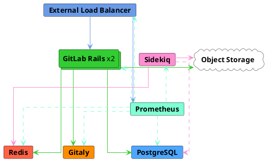
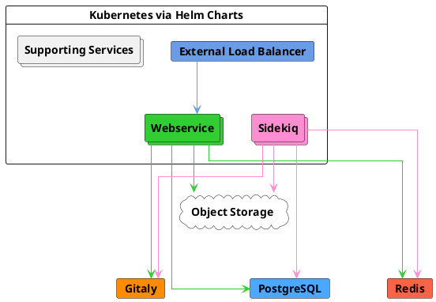

DETAILS:
**Tier:** Free, Premium, Ultimate
**Offering:** GitLab Self-Managed

This page describes the GitLab reference architecture designed to target a peak load of 40 requests per second (RPS), the typical peak load of up to 2,000 users, both manual and automated, based on real data.

For a full list of reference architectures, see
[Available reference architectures](_index.md#available-reference-architectures).

> - **Target Load:** API: 40 RPS, Web: 4 RPS, Git (Pull): 4 RPS, Git (Push): 1 RPS
> - **High Availability:** No. For a highly-available environment, you can
>   follow a modified [3K or 60 RPS reference architecture](3k_users.md#supported-modifications-for-lower-user-counts-ha).
> - **Cost calculator template:** [See cost calculator templates section](_index.md#cost-calculator-templates)
> - **Cloud Native Hybrid:** [Yes](#cloud-native-hybrid-reference-architecture-with-helm-charts-alternative)
> - **Unsure which Reference Architecture to use?** [Go to this guide for more info](_index.md#deciding-which-architecture-to-start-with).

| Service                            | Nodes | Configuration          | GCP             | AWS          | Azure    |
|------------------------------------|-------|------------------------|-----------------|--------------|----------|
| External Load balancer<sup>3</sup> | 1     | 4 vCPU, 3.6 GB memory  | `n1-highcpu-4`  | `c5n.xlarge` | `F4s v2` |
| PostgreSQL<sup>1</sup>             | 1     | 2 vCPU, 7.5 GB memory  | `n1-standard-2` | `m5.large`   | `D2s v3` |
| Redis<sup>2</sup>                  | 1     | 1 vCPU, 3.75 GB memory | `n1-standard-1` | `m5.large`   | `D2s v3` |
| Gitaly<sup>5</sup>                 | 1     | 4 vCPU, 15 GB memory<sup>5</sup> | `n1-standard-4` | `m5.xlarge` | `D4s v3` |
| Sidekiq<sup>6</sup>                | 1     | 4 vCPU, 15 GB memory   | `n1-standard-4` | `m5.xlarge`  | `D4s v3` |
| GitLab Rails<sup>6</sup>           | 2     | 8 vCPU, 7.2 GB memory  | `n1-highcpu-8`  | `c5.2xlarge` | `F8s v2` |
| Monitoring node                    | 1     | 2 vCPU, 1.8 GB memory  | `n1-highcpu-2`  | `c5.large`   | `F2s v2` |
| Object storage<sup>4</sup>         | -     | -                      | -               | -            | -        |

**Footnotes:**

<!-- Disable ordered list rule https://github.com/DavidAnson/markdownlint/blob/main/doc/Rules.md#md029---ordered-list-item-prefix -->
<!-- markdownlint-disable MD029 -->
1. Can be optionally run on reputable third-party external PaaS PostgreSQL solutions. See [Provide your own PostgreSQL instance](#provide-your-own-postgresql-instance) and [Recommended cloud providers and services](_index.md#recommended-cloud-providers-and-services) for more information.
2. Can be optionally run on reputable third-party external PaaS Redis solutions. See [Provide your own Redis instance](#provide-your-own-redis-instance) and [Recommended cloud providers and services](_index.md#recommended-cloud-providers-and-services) for more information.
3. Recommended to be run with a reputable third-party load balancer or service (LB PaaS).
   Sizing depends on selected Load Balancer and additional factors such as Network Bandwidth. See [Load Balancers](_index.md#load-balancers) for more information.
4. Should be run on reputable Cloud Provider or Self Managed solutions. See [Configure the object storage](#configure-the-object-storage) for more information.
5. Gitaly specifications are based on the use of normal-sized repositories in good health.
   However, if you have large monorepos (larger than several gigabytes) this can **significantly** impact Git and Gitaly performance and an increase of specifications will likely be required.
   Refer to [large monorepos](_index.md#large-monorepos) for more information.
6. Can be placed in Auto Scaling Groups (ASGs) as the component doesn't store any [stateful data](_index.md#autoscaling-of-stateful-nodes).
   However, [Cloud Native Hybrid setups](#cloud-native-hybrid-reference-architecture-with-helm-charts-alternative) are generally preferred as certain components
   such as like [migrations](#gitlab-rails-post-configuration) and [Mailroom](../incoming_email.md) can only be run on one node, which is handled better in Kubernetes.
<!-- markdownlint-enable MD029 -->

NOTE:
For all PaaS solutions that involve configuring instances, it's recommended to deploy them over multiple availability zones for resilience if desired.



## Requirements

Before starting, see the [requirements](_index.md#requirements) for reference architectures.

## Testing methodology

The 2k architecture is designed to cover a large majority of workflows and is regularly
[smoke and performance tested](_index.md#validation-and-test-results) by the Test Platform team
against the following endpoint throughput targets:

- API: 40 RPS
- Web: 4 RPS
- Git (Pull): 4 RPS
- Git (Push): 1 RPS

The above targets were selected based on real customer data of total environmental loads corresponding to the user count,
including CI and other workloads.

If you have metrics to suggest that you have regularly higher throughput against the above endpoint targets, [large monorepos](_index.md#large-monorepos)
or notable [additional workloads](_index.md#additional-workloads) these can notably impact the performance environment and [further adjustments may be required](_index.md#scaling-an-environment).
If this applies to you, we strongly recommended referring to the linked documentation and reaching out to your [Customer Success Manager](https://handbook.gitlab.com/job-families/sales/customer-success-management/) or our [Support team](https://about.gitlab.com/support/) for further guidance.

Testing is done regularly by using our [GitLab Performance Tool (GPT)](https://gitlab.com/gitlab-org/quality/performance) and its dataset, which is available for anyone to use.
The results of this testing are [available publicly on the GPT wiki](https://gitlab.com/gitlab-org/quality/performance/-/wikis/Benchmarks/Latest). For more information on our testing strategy [refer to this section of the documentation](_index.md#validation-and-test-results).

The load balancers used for testing were HAProxy for Linux package environments or equivalent Cloud Provider services with NGINX Ingress for Cloud Native Hybrids. These selections do not represent a specific requirement or recommendation as most [reputable load balancers are expected to work](#configure-the-external-load-balancer).

## Set up components

To set up GitLab and its components to accommodate up to 40 RPS or 2,000 users:

1. [Configure the external load balancing node](#configure-the-external-load-balancer)
   to handle the load balancing of the GitLab application services nodes.
1. [Configure PostgreSQL](#configure-postgresql), the database for GitLab.
1. [Configure Redis](#configure-redis), which stores session data, temporary
cache information, and background job queues.
1. [Configure Gitaly](#configure-gitaly), which provides access to the Git
   repositories.
1. [Configure Sidekiq](#configure-sidekiq) for background job processing.
1. [Configure the main GitLab Rails application](#configure-gitlab-rails)
   to run Puma, Workhorse, GitLab Shell, and to serve all frontend
   requests (which include UI, API, and Git over HTTP/SSH).
1. [Configure Prometheus](#configure-prometheus) to monitor your GitLab
   environment.
1. [Configure the object storage](#configure-the-object-storage) used for
   shared data objects.
1. [Configure advanced search](#configure-advanced-search) (optional) for faster,
   more advanced code search across your entire GitLab instance.

## Configure the external load balancer

In a multi-node GitLab configuration, you'll need an external load balancer to route
traffic to the application servers.

The specifics on which load balancer to use, or its exact configuration
is beyond the scope of GitLab documentation but refer to [Load Balancers](_index.md) for more information around
general requirements. This section will focus on the specifics of
what to configure for your load balancer of choice.

### Readiness checks

Ensure the external load balancer only routes to working services with built
in monitoring endpoints. The [readiness checks](../monitoring/health_check.md)
all require [additional configuration](../monitoring/ip_allowlist.md)
on the nodes being checked, otherwise, the external load balancer will not be able to
connect.

### Ports

The basic ports to be used are shown in the table below.

| LB Port | Backend Port | Protocol                 |
| ------- | ------------ | ------------------------ |
| 80      | 80           | HTTP (*1*)               |
| 443     | 443          | TCP or HTTPS (*1*) (*2*) |
| 22      | 22           | TCP                      |

- (*1*): [Web terminal](../../ci/environments/_index.md#web-terminals-deprecated) support requires
  your load balancer to correctly handle WebSocket connections. When using
  HTTP or HTTPS proxying, this means your load balancer must be configured
  to pass through the `Connection` and `Upgrade` hop-by-hop headers. See the
  [web terminal](../integration/terminal.md) integration guide for
  more details.
- (*2*): When using HTTPS protocol for port 443, you will need to add an SSL
  certificate to the load balancers. If you wish to terminate SSL at the
  GitLab application server instead, use TCP protocol.

If you're using GitLab Pages with custom domain support you will need some
additional port configurations.
GitLab Pages requires a separate virtual IP address. Configure DNS to point the
`pages_external_url` from `/etc/gitlab/gitlab.rb` at the new virtual IP address. See the
[GitLab Pages documentation](../pages/_index.md) for more information.

| LB Port | Backend Port  | Protocol  |
| ------- | ------------- | --------- |
| 80      | Varies (*1*)  | HTTP      |
| 443     | Varies (*1*)  | TCP (*2*) |

- (*1*): The backend port for GitLab Pages depends on the
  `gitlab_pages['external_http']` and `gitlab_pages['external_https']`
  setting. See [GitLab Pages documentation](../pages/_index.md) for more details.
- (*2*): Port 443 for GitLab Pages should always use the TCP protocol. Users can
  configure custom domains with custom SSL, which would not be possible
  if SSL was terminated at the load balancer.

#### Alternate SSH Port

Some organizations have policies against opening SSH port 22. In this case,
it may be helpful to configure an alternate SSH hostname that allows users
to use SSH on port 443. An alternate SSH hostname will require a new virtual IP address
compared to the other GitLab HTTP configuration above.

Configure DNS for an alternate SSH hostname such as `altssh.gitlab.example.com`.

| LB Port | Backend Port | Protocol |
| ------- | ------------ | -------- |
| 443     | 22           | TCP      |

### SSL

The next question is how you will handle SSL in your environment.
There are several different options:

- [The application node terminates SSL](#application-node-terminates-ssl).
- [The load balancer terminates SSL without backend SSL](#load-balancer-terminates-ssl-without-backend-ssl)
  and communication is not secure between the load balancer and the application node.
- [The load balancer terminates SSL with backend SSL](#load-balancer-terminates-ssl-with-backend-ssl)
  and communication is *secure* between the load balancer and the application node.

#### Application node terminates SSL

Configure your load balancer to pass connections on port 443 as `TCP` rather
than `HTTP(S)` protocol. This will pass the connection to the application node's
NGINX service untouched. NGINX will have the SSL certificate and listen on port 443.

See the [HTTPS documentation](https://docs.gitlab.com/omnibus/settings/ssl/index.html)
for details on managing SSL certificates and configuring NGINX.

#### Load balancer terminates SSL without backend SSL

Configure your load balancer to use the `HTTP(S)` protocol rather than `TCP`.
The load balancer will then be responsible for managing SSL certificates and
terminating SSL.

Since communication between the load balancer and GitLab will not be secure,
there is some additional configuration needed. See the
[proxied SSL documentation](https://docs.gitlab.com/omnibus/settings/ssl/index.html#configure-a-reverse-proxy-or-load-balancer-ssl-termination)
for details.

#### Load balancer terminates SSL with backend SSL

Configure your load balancers to use the 'HTTP(S)' protocol rather than 'TCP'.
The load balancers will be responsible for managing SSL certificates that
end users will see.

Traffic will also be secure between the load balancers and NGINX in this
scenario. There is no need to add configuration for proxied SSL since the
connection will be secure all the way. However, configuration will need to be
added to GitLab to configure SSL certificates. See
the [HTTPS documentation](https://docs.gitlab.com/omnibus/settings/ssl/index.html)
for details on managing SSL certificates and configuring NGINX.

<div align="right">
  <a type="button" class="btn btn-default" href="#set-up-components">
    Back to set up components <i class="fa fa-angle-double-up" aria-hidden="true"></i>
  </a>
</div>

## Configure PostgreSQL

In this section, you'll be guided through configuring an external PostgreSQL database
to be used with GitLab.

### Provide your own PostgreSQL instance

You can optionally use a [third party external service for PostgreSQL](../postgresql/external.md).

A reputable provider or solution should be used for this. [Google Cloud SQL](https://cloud.google.com/sql/docs/postgres/high-availability#normal)
and [Amazon RDS](https://aws.amazon.com/rds/) are known to work. However, Amazon Aurora is **incompatible** with load balancing enabled by default from
[14.4.0](https://docs.gitlab.com/17.3/ee/update/versions/gitlab_14_changes.html#1440).

See [Recommended cloud providers and services](_index.md#recommended-cloud-providers-and-services) for more information.

If you use a third party external service:

1. The HA Linux package PostgreSQL setup encompasses PostgreSQL, PgBouncer and Consul. All of these components would no longer be required when using a third party external service.
1. Set up PostgreSQL according to the
   [database requirements document](../../install/requirements.md#postgresql).
1. Set up a `gitlab` username with a password of your choice. The `gitlab` user
   needs privileges to create the `gitlabhq_production` database.
1. Configure the GitLab application servers with the appropriate details.
   This step is covered in [Configuring the GitLab Rails application](#configure-gitlab-rails).

### Standalone PostgreSQL using the Linux package

1. SSH in to the PostgreSQL server.
1. [Download and install](https://about.gitlab.com/install/) the Linux
   package of your choice. Be sure to follow _only_ installation steps 1 and 2
   on the page.
1. Generate a password hash for PostgreSQL. This assumes you will use the default
   username of `gitlab` (recommended). The command will request a password
   and confirmation. Use the value that is output by this command in the next
   step as the value of `POSTGRESQL_PASSWORD_HASH`.

   ```shell
   sudo gitlab-ctl pg-password-md5 gitlab
   ```

1. Edit `/etc/gitlab/gitlab.rb` and add the contents below, updating placeholder
   values appropriately.

   - `POSTGRESQL_PASSWORD_HASH` - The value output from the previous step
   - `APPLICATION_SERVER_IP_BLOCKS` - A space delimited list of IP subnets or IP
     addresses of the GitLab Rails and Sidekiq servers that will connect to the
     database. Example: `%w(123.123.123.123/32 123.123.123.234/32)`

   ```ruby
   # Disable all components except PostgreSQL related ones
   roles(['postgres_role'])

   # Set the network addresses that the exporters used for monitoring will listen on
   node_exporter['listen_address'] = '0.0.0.0:9100'
   postgres_exporter['listen_address'] = '0.0.0.0:9187'
   postgres_exporter['dbname'] = 'gitlabhq_production'
   postgres_exporter['password'] = 'POSTGRESQL_PASSWORD_HASH'

   # Set the PostgreSQL address and port
   postgresql['listen_address'] = '0.0.0.0'
   postgresql['port'] = 5432

   # Replace POSTGRESQL_PASSWORD_HASH with a generated md5 value
   postgresql['sql_user_password'] = 'POSTGRESQL_PASSWORD_HASH'

   # Replace APPLICATION_SERVER_IP_BLOCK with the CIDR address of the application node
   postgresql['trust_auth_cidr_addresses'] = %w(127.0.0.1/32 APPLICATION_SERVER_IP_BLOCK)

   # Prevent database migrations from running on upgrade automatically
   gitlab_rails['auto_migrate'] = false
   ```

1. Copy the `/etc/gitlab/gitlab-secrets.json` file from the first Linux package node you configured and add or replace
   the file of the same name on this server. If this is the first Linux package you are configuring then you can skip this step.

1. [Reconfigure GitLab](../restart_gitlab.md#reconfigure-a-linux-package-installation) for the changes to take effect.
1. Note the PostgreSQL node's IP address or hostname, port, and
   plain text password. These details are necessary when configuring the
   [GitLab application server](#configure-gitlab-rails) later.

Advanced [configuration options](https://docs.gitlab.com/omnibus/settings/database.html)
are supported and can be added if needed.

<div align="right">
  <a type="button" class="btn btn-default" href="#set-up-components">
    Back to set up components <i class="fa fa-angle-double-up" aria-hidden="true"></i>
  </a>
</div>

## Configure Redis

In this section, you'll be guided through configuring an external Redis instance
to be used with GitLab.

NOTE:
Redis is primarily single threaded and doesn't significantly benefit from an increase in CPU cores.
Refer to the [scaling documentation](_index.md#scaling-an-environment) for more information.

### Provide your own Redis instance

You can optionally use a [third party external service for the Redis instance](../redis/replication_and_failover_external.md#redis-as-a-managed-service-in-a-cloud-provider) with the following guidance:

- A reputable provider or solution should be used for this. [Google Memorystore](https://cloud.google.com/memorystore/docs/redis/memorystore-for-redis-overview) and [AWS ElastiCache](https://docs.aws.amazon.com/AmazonElastiCache/latest/red-ug/WhatIs.html) are known to work.
- Redis Cluster mode is specifically not supported, but Redis Standalone with HA is.
- You must set the [Redis eviction mode](../redis/replication_and_failover_external.md#setting-the-eviction-policy) according to your setup.

For more information, see [Recommended cloud providers and services](_index.md#recommended-cloud-providers-and-services).

### Standalone Redis using the Linux package

The Linux package can be used to configure a standalone Redis server.
The steps below are the minimum necessary to configure a Redis server with
the Linux package:

1. SSH in to the Redis server.
1. [Download and install](https://about.gitlab.com/install/) the Linux
   package of your choice. Be sure to follow _only_ installation steps 1 and 2
   on the page.
1. Edit `/etc/gitlab/gitlab.rb` and add the contents:

   ```ruby
   ## Enable Redis
   roles(["redis_master_role"])

   redis['bind'] = '0.0.0.0'
   redis['port'] = 6379
   redis['password'] = 'SECRET_PASSWORD_HERE'

   # Set the network addresses that the exporters used for monitoring will listen on
   node_exporter['listen_address'] = '0.0.0.0:9100'
   redis_exporter['listen_address'] = '0.0.0.0:9121'
   redis_exporter['flags'] = {
         'redis.addr' => 'redis://0.0.0.0:6379',
         'redis.password' => 'SECRET_PASSWORD_HERE',
   }

   # Prevent database migrations from running on upgrade automatically
   gitlab_rails['auto_migrate'] = false
   ```

1. Copy the `/etc/gitlab/gitlab-secrets.json` file from the first Linux package node you configured and add or replace
   the file of the same name on this server. If this is the first Linux package node you are configuring then you can skip this step.

1. [Reconfigure GitLab](../restart_gitlab.md#reconfigure-a-linux-package-installation) for the changes to take effect.

1. Note the Redis node's IP address or hostname, port, and
   Redis password. These will be necessary when
   [configuring the GitLab application servers](#configure-gitlab-rails) later.

Advanced [configuration options](https://docs.gitlab.com/omnibus/settings/redis.html)
are supported and can be added if needed.

<div align="right">
  <a type="button" class="btn btn-default" href="#set-up-components">
    Back to set up components <i class="fa fa-angle-double-up" aria-hidden="true"></i>
  </a>
</div>

## Configure Gitaly

[Gitaly](../gitaly/_index.md) server node requirements are dependent on data size,
specifically the number of projects and those projects' sizes.

WARNING:
**Gitaly specifications are based on high percentiles of both usage patterns and repository sizes in good health.**
**However, if you have [large monorepos](_index.md#large-monorepos) (larger than several gigabytes) or [additional workloads](_index.md#additional-workloads) these can *significantly* impact the performance of the environment and further adjustments may be required.**
If this applies to you, we strongly recommended referring to the linked documentation as well as reaching out to your [Customer Success Manager](https://handbook.gitlab.com/job-families/sales/customer-success-management/) or our [Support team](https://about.gitlab.com/support/) for further guidance.

Due to Gitaly having notable input and output requirements, we strongly
recommend that all Gitaly nodes use solid-state drives (SSDs). These SSDs
should have a throughput of at least 8,000
input/output operations per second (IOPS) for read operations and 2,000 IOPS
for write operations. If you're running the environment on a Cloud provider,
refer to their documentation about how to configure IOPS correctly.

Be sure to note the following items:

- The GitLab Rails application shards repositories into
  [repository storage paths](../repository_storage_paths.md).
- A Gitaly server can host one or more storage paths.
- A GitLab server can use one or more Gitaly server nodes.
- Gitaly addresses must be specified to be correctly resolvable for *all*
  Gitaly clients.
- Gitaly servers must not be exposed to the public internet, as network traffic
  on Gitaly is unencrypted by default. The use of a firewall is highly recommended
  to restrict access to the Gitaly server. Another option is to
  [use TLS](#gitaly-tls-support).

NOTE:
The token referred to throughout the Gitaly documentation is an arbitrary
password selected by the administrator. This token is unrelated to tokens
created for the GitLab API or other similar web API tokens.

The following procedure describes how to configure a single Gitaly server named
`gitaly1.internal` with the secret token `gitalysecret`. We assume your GitLab
installation has two repository storages: `default` and `storage1`.

To configure the Gitaly server, on the server node you want to use for Gitaly:

1. [Download and install](https://about.gitlab.com/install/) the Linux package
   of your choice. Be sure to follow _only_ installation steps 1 and 2
   on the page, and _do not_ provide the `EXTERNAL_URL` value.
1. Edit the Gitaly server node's `/etc/gitlab/gitlab.rb` file to configure
   storage paths, enable the network listener, and to configure the token:

   NOTE:
   You can't remove the `default` entry from `gitaly['configuration'][:storage]` because [GitLab requires it](../gitaly/configure_gitaly.md#gitlab-requires-a-default-repository-storage).

   <!--
   Updates to example must be made at:
   - https://gitlab.com/gitlab-org/charts/gitlab/blob/master/doc/advanced/external-gitaly/external-omnibus-gitaly.md#configure-omnibus-gitlab
   - https://gitlab.com/gitlab-org/gitlab/blob/master/doc/administration/gitaly/index.md#gitaly-server-configuration
   - all reference architecture pages
   -->

   ```ruby
   # Avoid running unnecessary services on the Gitaly server
   postgresql['enable'] = false
   redis['enable'] = false
   nginx['enable'] = false
   puma['enable'] = false
   sidekiq['enable'] = false
   gitlab_workhorse['enable'] = false
   prometheus['enable'] = false
   alertmanager['enable'] = false
   gitlab_exporter['enable'] = false
   gitlab_kas['enable'] = false

   # Prevent database migrations from running on upgrade automatically
   gitlab_rails['auto_migrate'] = false

   # Configure the gitlab-shell API callback URL. Without this, `git push` will
   # fail. This can be your 'front door' GitLab URL or an internal load
   # balancer.
   gitlab_rails['internal_api_url'] = 'https://gitlab.example.com'

   # Gitaly
   gitaly['enable'] = true

   # Set the network addresses that the exporters used for monitoring will listen on
   node_exporter['listen_address'] = '0.0.0.0:9100'

   gitaly['configuration'] = {
      # ...
      #
      # Make Gitaly accept connections on all network interfaces. You must use
      # firewalls to restrict access to this address/port.
      # Comment out following line if you only want to support TLS connections
      listen_addr: '0.0.0.0:8075',
      prometheus_listen_addr: '0.0.0.0:9236',
      # Gitaly Auth Token
      # Should be the same as praefect_internal_token
      auth: {
         # ...
         #
         # Gitaly's authentication token is used to authenticate gRPC requests to Gitaly. This must match
         # the respective value in GitLab Rails application setup.
         token: 'gitalysecret',
      },
      # Gitaly Pack-objects cache
      # Recommended to be enabled for improved performance but can notably increase disk I/O
      # Refer to https://docs.gitlab.com/ee/administration/gitaly/configure_gitaly.html#pack-objects-cache for more info
      pack_objects_cache: {
         # ...
         enabled: true,
      },
      storage: [
         {
            name: 'default',
            path: '/var/opt/gitlab/git-data',
         },
         {
            name: 'storage1',
            path: '/mnt/gitlab/git-data',
         },
      ],
   }
   ```

1. Copy the `/etc/gitlab/gitlab-secrets.json` file from the first Linux package node you configured and add or replace
   the file of the same name on this server. If this is the first Linux package node you are configuring then you can skip this step.

1. [Reconfigure GitLab](../restart_gitlab.md#reconfigure-a-linux-package-installation) for the changes to take effect.

1. Confirm that Gitaly can perform callbacks to the internal API:
   - For GitLab 15.3 and later, run `sudo -u git -- /opt/gitlab/embedded/bin/gitaly check /var/opt/gitlab/gitaly/config.toml`.
   - For GitLab 15.2 and earlier, run `sudo -u git -- /opt/gitlab/embedded/bin/gitaly-hooks check /var/opt/gitlab/gitaly/config.toml`.

### Gitaly TLS support

Gitaly supports TLS encryption. To communicate
with a Gitaly instance that listens for secure connections, you must use `tls://` URL
scheme in the `gitaly_address` of the corresponding storage entry in the GitLab configuration.

You must bring your own certificates as this isn't provided automatically.
The certificate, or its certificate authority, must be installed on all Gitaly
nodes (including the Gitaly node using the certificate) and on all client nodes
that communicate with it following the procedure described in
[GitLab custom certificate configuration](https://docs.gitlab.com/omnibus/settings/ssl/index.html#install-custom-public-certificates).

NOTE:
The self-signed certificate must specify the address you use to access the
Gitaly server. If you are addressing the Gitaly server by a hostname, add it as a Subject Alternative
Name. If you are addressing the Gitaly server by its IP address, you must add it
as a Subject Alternative Name to the certificate.

It's possible to configure Gitaly servers with both an unencrypted listening
address (`listen_addr`) and an encrypted listening address (`tls_listen_addr`)
at the same time. This allows you to do a gradual transition from unencrypted to
encrypted traffic, if necessary.

To configure Gitaly with TLS:

1. Create the `/etc/gitlab/ssl` directory and copy your key and certificate there:

   ```shell
   sudo mkdir -p /etc/gitlab/ssl
   sudo chmod 755 /etc/gitlab/ssl
   sudo cp key.pem cert.pem /etc/gitlab/ssl/
   sudo chmod 644 key.pem cert.pem
   ```

1. Copy the cert to `/etc/gitlab/trusted-certs` so Gitaly will trust the cert when
   calling into itself:

   ```shell
   sudo cp /etc/gitlab/ssl/cert.pem /etc/gitlab/trusted-certs/
   ```

1. Edit `/etc/gitlab/gitlab.rb` and add:

   <!-- Updates to following example must also be made at https://gitlab.com/gitlab-org/charts/gitlab/blob/master/doc/advanced/external-gitaly/external-omnibus-gitaly.md#configure-omnibus-gitlab -->

   ```ruby
   gitaly['configuration'] = {
      # ...
      tls_listen_addr: '0.0.0.0:9999',
      tls: {
         certificate_path: '/etc/gitlab/ssl/cert.pem',
         key_path: '/etc/gitlab/ssl/key.pem',
      },
   }
   ```

1. Delete `gitaly['listen_addr']` to allow only encrypted connections.
1. Save the file and [reconfigure GitLab](../restart_gitlab.md#reconfigure-a-linux-package-installation).

<div align="right">
  <a type="button" class="btn btn-default" href="#set-up-components">
    Back to set up components <i class="fa fa-angle-double-up" aria-hidden="true"></i>
  </a>
</div>

## Configure Sidekiq

Sidekiq requires connection to the [Redis](#configure-redis),
[PostgreSQL](#configure-postgresql) and [Gitaly](#configure-gitaly) instances.
It also requires a connection to [Object Storage](#configure-the-object-storage) as recommended.

NOTE:
If you find that the environment's Sidekiq job processing is slow with long queues
you can scale it accordingly. Refer to the [scaling documentation](_index.md#scaling-an-environment) for more information.

NOTE:
When configuring additional GitLab functionality such as Container Registry, SAML, or LDAP,
update the Sidekiq configuration in addition to the Rails configuration.
Refer to the [external Sidekiq documentation](../sidekiq/_index.md) for more information.

To configure the Sidekiq server, on the server node you want to use for Sidekiq:

1. SSH in to the Sidekiq server.
1. Confirm that you can access the PostgreSQL, Gitaly, and Redis ports:

   ```shell
   telnet <GitLab host> 5432 # PostgreSQL
   telnet <GitLab host> 8075 # Gitaly
   telnet <GitLab host> 6379 # Redis
   ```

1. [Download and install](https://about.gitlab.com/install/) the Linux
   package of your choice. Be sure to follow _only_ installation steps 1 and 2
   on the page.
1. Create or edit `/etc/gitlab/gitlab.rb` and use the following configuration:

   ```ruby
   # https://docs.gitlab.com/omnibus/roles/#sidekiq-roles
   roles(["sidekiq_role"])

   # External URL
   external_url 'https://gitlab.example.com'

   ## Redis connection details
   gitlab_rails['redis_port'] = '6379'
   gitlab_rails['redis_host'] = '10.1.0.6' # IP/hostname of Redis server
   gitlab_rails['redis_password'] = 'Redis Password'

   # Gitaly and GitLab use two shared secrets for authentication, one to authenticate gRPC requests
   # to Gitaly, and a second stored in /etc/gitlab/gitlab-secrets.json for authentication callbacks from GitLab-Shell to the GitLab internal API.
   # The following must be the same as their respective values
   # of the Gitaly setup
   gitlab_rails['gitaly_token'] = 'gitalysecret'

   gitlab_rails['repositories_storages'] = {
     'default' => { 'gitaly_address' => 'tcp://gitaly1.internal:8075' },
     'storage1' => { 'gitaly_address' => 'tcp://gitaly1.internal:8075' },
     'storage2' => { 'gitaly_address' => 'tcp://gitaly2.internal:8075' },
   }

   ## PostgreSQL connection details
   gitlab_rails['db_adapter'] = 'postgresql'
   gitlab_rails['db_encoding'] = 'unicode'
   gitlab_rails['db_host'] = '10.1.0.5' # IP/hostname of database server
   gitlab_rails['db_password'] = 'DB password'

   ## Prevent database migrations from running on upgrade automatically
   gitlab_rails['auto_migrate'] = false

   # Sidekiq
   sidekiq['listen_address'] = "0.0.0.0"

   ## Set number of Sidekiq queue processes to the same number as available CPUs
   sidekiq['queue_groups'] = ['*'] * 4

   ## Set the network addresses that the exporters will listen on
   node_exporter['listen_address'] = '0.0.0.0:9100'

   # Object Storage
   ## This is an example for configuring Object Storage on GCP
   ## Replace this config with your chosen Object Storage provider as desired
   gitlab_rails['object_store']['enabled'] = true
   gitlab_rails['object_store']['connection'] = {
     'provider' => 'Google',
     'google_project' => '<gcp-project-name>',
     'google_json_key_location' => '<path-to-gcp-service-account-key>'
   }
   gitlab_rails['object_store']['objects']['artifacts']['bucket'] = "<gcp-artifacts-bucket-name>"
   gitlab_rails['object_store']['objects']['external_diffs']['bucket'] = "<gcp-external-diffs-bucket-name>"
   gitlab_rails['object_store']['objects']['lfs']['bucket'] = "<gcp-lfs-bucket-name>"
   gitlab_rails['object_store']['objects']['uploads']['bucket'] = "<gcp-uploads-bucket-name>"
   gitlab_rails['object_store']['objects']['packages']['bucket'] = "<gcp-packages-bucket-name>"
   gitlab_rails['object_store']['objects']['dependency_proxy']['bucket'] = "<gcp-dependency-proxy-bucket-name>"
   gitlab_rails['object_store']['objects']['terraform_state']['bucket'] = "<gcp-terraform-state-bucket-name>"

   gitlab_rails['backup_upload_connection'] = {
     'provider' => 'Google',
     'google_project' => '<gcp-project-name>',
     'google_json_key_location' => '<path-to-gcp-service-account-key>'
   }
   gitlab_rails['backup_upload_remote_directory'] = "<gcp-backups-state-bucket-name>"
   gitlab_rails['ci_secure_files_object_store_enabled'] = true
   gitlab_rails['ci_secure_files_object_store_remote_directory'] = "gcp-ci_secure_files-bucket-name"

   gitlab_rails['ci_secure_files_object_store_connection'] = {
      'provider' => 'Google',
      'google_project' => '<gcp-project-name>',
      'google_json_key_location' => '<path-to-gcp-service-account-key>'
   }
   ```

1. Copy the `/etc/gitlab/gitlab-secrets.json` file from the first Linux package node you configured and add or replace
   the file of the same name on this server. If this is the first Linux package node you are configuring then you can skip this step.

1. To ensure database migrations are only run during reconfigure and not automatically on upgrade, run:

   ```shell
   sudo touch /etc/gitlab/skip-auto-reconfigure
   ```

   Only a single designated node should handle migrations as detailed in the
   [GitLab Rails post-configuration](#gitlab-rails-post-configuration) section.

1. Save the file and [reconfigure GitLab](../restart_gitlab.md#reconfigure-a-linux-package-installation).

1. Verify the GitLab services are running:

   ```shell
   sudo gitlab-ctl status
   ```

   The output should be similar to the following:

   ```plaintext
   run: logrotate: (pid 192292) 2990s; run: log: (pid 26374) 93048s
   run: node-exporter: (pid 26864) 92997s; run: log: (pid 26446) 93036s
   run: sidekiq: (pid 26870) 92996s; run: log: (pid 26391) 93042s
   ```

<div align="right">
  <a type="button" class="btn btn-default" href="#set-up-components">
    Back to set up components <i class="fa fa-angle-double-up" aria-hidden="true"></i>
  </a>
</div>

## Configure GitLab Rails

This section describes how to configure the GitLab application (Rails) component.

In our architecture, we run each GitLab Rails node using the Puma webserver, and
have its number of workers set to 90% of available CPUs, with four threads. For
nodes running Rails with other components, the worker value should be reduced
accordingly. We've determined that a worker value of 50% achieves a good balance,
but this is dependent on workload.

On each node perform the following:

1. [Download and install](https://about.gitlab.com/install/) the Linux
   package of your choice. Be sure to follow _only_ installation steps 1 and 2
   on the page.
1. Create or edit `/etc/gitlab/gitlab.rb` and use the following configuration.
   To maintain uniformity of links across nodes, the `external_url`
   on the application server should point to the external URL that users will use
   to access GitLab. This would be the URL of the [load balancer](#configure-the-external-load-balancer)
   which will route traffic to the GitLab application server:

   ```ruby
   external_url 'https://gitlab.example.com'

   # Gitaly and GitLab use two shared secrets for authentication, one to authenticate gRPC requests
   # to Gitaly, and a second stored in /etc/gitlab/gitlab-secrets.json for authentication callbacks from GitLab-Shell to the GitLab internal API.
   # The following must be the same as their respective values
   # of the Gitaly setup
   gitlab_rails['gitaly_token'] = 'gitalysecret'

   gitlab_rails['repositories_storages'] = {
     'default' => { 'gitaly_address' => 'tcp://gitaly1.internal:8075' },
     'storage1' => { 'gitaly_address' => 'tcp://gitaly1.internal:8075' },
     'storage2' => { 'gitaly_address' => 'tcp://gitaly2.internal:8075' },
   }

   ## Disable components that will not be on the GitLab application server
   roles(['application_role'])
   gitaly['enable'] = false
   sidekiq['enable'] = false

   ## PostgreSQL connection details
   gitlab_rails['db_adapter'] = 'postgresql'
   gitlab_rails['db_encoding'] = 'unicode'
   gitlab_rails['db_host'] = '10.1.0.5' # IP/hostname of database server
   gitlab_rails['db_password'] = 'DB password'

   ## Redis connection details
   gitlab_rails['redis_port'] = '6379'
   gitlab_rails['redis_host'] = '10.1.0.6' # IP/hostname of Redis server
   gitlab_rails['redis_password'] = 'Redis Password'

   # Set the network addresses that the exporters used for monitoring will listen on
   node_exporter['listen_address'] = '0.0.0.0:9100'
   gitlab_workhorse['prometheus_listen_addr'] = '0.0.0.0:9229'
   puma['listen'] = '0.0.0.0'

   # Add the monitoring node's IP address to the monitoring whitelist and allow it to
   # scrape the NGINX metrics. Replace placeholder `monitoring.gitlab.example.com` with
   # the address and/or subnets gathered from the monitoring node
   gitlab_rails['monitoring_whitelist'] = ['<MONITOR NODE IP>/32', '127.0.0.0/8']
   nginx['status']['options']['allow'] = ['<MONITOR NODE IP>/32', '127.0.0.0/8']

   # Object Storage
   # This is an example for configuring Object Storage on GCP
   # Replace this config with your chosen Object Storage provider as desired
   gitlab_rails['object_store']['enabled'] = true
   gitlab_rails['object_store']['connection'] = {
     'provider' => 'Google',
     'google_project' => '<gcp-project-name>',
     'google_json_key_location' => '<path-to-gcp-service-account-key>'
   }
   gitlab_rails['object_store']['objects']['artifacts']['bucket'] = "<gcp-artifacts-bucket-name>"
   gitlab_rails['object_store']['objects']['external_diffs']['bucket'] = "<gcp-external-diffs-bucket-name>"
   gitlab_rails['object_store']['objects']['lfs']['bucket'] = "<gcp-lfs-bucket-name>"
   gitlab_rails['object_store']['objects']['uploads']['bucket'] = "<gcp-uploads-bucket-name>"
   gitlab_rails['object_store']['objects']['packages']['bucket'] = "<gcp-packages-bucket-name>"
   gitlab_rails['object_store']['objects']['dependency_proxy']['bucket'] = "<gcp-dependency-proxy-bucket-name>"
   gitlab_rails['object_store']['objects']['terraform_state']['bucket'] = "<gcp-terraform-state-bucket-name>"

   gitlab_rails['backup_upload_connection'] = {
     'provider' => 'Google',
     'google_project' => '<gcp-project-name>',
     'google_json_key_location' => '<path-to-gcp-service-account-key>'
   }
   gitlab_rails['backup_upload_remote_directory'] = "<gcp-backups-state-bucket-name>"

   gitlab_rails['ci_secure_files_object_store_enabled'] = true
   gitlab_rails['ci_secure_files_object_store_remote_directory'] = "gcp-ci_secure_files-bucket-name"

   gitlab_rails['ci_secure_files_object_store_connection'] = {
      'provider' => 'Google',
      'google_project' => '<gcp-project-name>',
      'google_json_key_location' => '<path-to-gcp-service-account-key>'
   }

   ## Uncomment and edit the following options if you have set up NFS
   ##
   ## Prevent GitLab from starting if NFS data mounts are not available
   ##
   #high_availability['mountpoint'] = '/var/opt/gitlab/git-data'
   ##
   ## Ensure UIDs and GIDs match between servers for permissions via NFS
   ##
   #user['uid'] = 9000
   #user['gid'] = 9000
   #web_server['uid'] = 9001
   #web_server['gid'] = 9001
   #registry['uid'] = 9002
   #registry['gid'] = 9002
   ```

1. If you're using [Gitaly with TLS support](#gitaly-tls-support), make sure the
   `gitlab_rails['repositories_storages']` entry is configured with `tls` instead of `tcp`:

   ```ruby
   gitlab_rails['repositories_storages'] = {
     'default' => { 'gitaly_address' => 'tls://gitaly1.internal:9999' },
     'storage1' => { 'gitaly_address' => 'tls://gitaly1.internal:9999' },
     'storage2' => { 'gitaly_address' => 'tls://gitaly2.internal:9999' },
   }
   ```

   1. Copy the cert into `/etc/gitlab/trusted-certs`:

      ```shell
      sudo cp cert.pem /etc/gitlab/trusted-certs/
      ```

1. Copy the `/etc/gitlab/gitlab-secrets.json` file from the first Linux package node you configured and add or replace
   the file of the same name on this server. If this is the first Linux package node you are configuring then you can skip this step.
1. Copy the SSH host keys (all in the name format `/etc/ssh/ssh_host_*_key*`) from the first Rails node you configured and
   add or replace the files of the same name on this server. This ensures host mismatch errors aren't thrown
   for your users as they hit the load balanced Rails nodes. If this is the first Linux package node you are configuring,
   then you can skip this step.
1. To ensure database migrations are only run during reconfigure and not automatically on upgrade, run:

   ```shell
   sudo touch /etc/gitlab/skip-auto-reconfigure
   ```

   Only a single designated node should handle migrations as detailed in the
   [GitLab Rails post-configuration](#gitlab-rails-post-configuration) section.

1. [Reconfigure GitLab](../restart_gitlab.md#reconfigure-a-linux-package-installation) for the changes to take effect.
1. [Enable incremental logging](#enable-incremental-logging).
1. Run `sudo gitlab-rake gitlab:gitaly:check` to confirm the node can connect to Gitaly.

1. Tail the logs to see the requests:

   ```shell
   sudo gitlab-ctl tail gitaly
   ```

When you specify `https` in the `external_url`, as in the previous example,
GitLab expects that the SSL certificates are in `/etc/gitlab/ssl/`. If the
certificates aren't present, NGINX will fail to start. For more information, see
the [HTTPS documentation](https://docs.gitlab.com/omnibus/settings/ssl/index.html).

### GitLab Rails post-configuration

1. Designate one application node for running database migrations during
   installation and updates. Initialize the GitLab database and ensure all
   migrations ran:

   ```shell
   sudo gitlab-rake gitlab:db:configure
   ```

   This operation requires configuring the Rails node to connect to the primary database
   directly, [bypassing PgBouncer](../postgresql/pgbouncer.md#procedure-for-bypassing-pgbouncer).
   After migrations have completed, you must configure the node to pass through PgBouncer again.

1. [Configure fast lookup of authorized SSH keys in the database](../operations/fast_ssh_key_lookup.md).

<div align="right">
  <a type="button" class="btn btn-default" href="#set-up-components">
    Back to set up components <i class="fa fa-angle-double-up" aria-hidden="true"></i>
  </a>
</div>

## Configure Prometheus

The Linux package can be used to configure a standalone Monitoring node
running [Prometheus](../monitoring/prometheus/_index.md):

1. SSH in to the Monitoring node.
1. [Download and install](https://about.gitlab.com/install/) the Linux
   package of your choice. Be sure to follow _only_ installation steps 1 and 2
   on the page.
1. Edit `/etc/gitlab/gitlab.rb` and add the contents:

   ```ruby
   roles(['monitoring_role'])
   nginx['enable'] = false

   external_url 'http://gitlab.example.com'

   # Prometheus
   prometheus['listen_address'] = '0.0.0.0:9090'
   prometheus['monitor_kubernetes'] = false
   ```

1. Prometheus also needs some scrape configurations to pull all the data from the various
   nodes where we configured exporters. Assuming that your nodes' IPs are:

   ```plaintext
   1.1.1.1: postgres
   1.1.1.2: redis
   1.1.1.3: gitaly1
   1.1.1.4: rails1
   1.1.1.5: rails2
   1.1.1.6: sidekiq
   ```

   Add the following to `/etc/gitlab/gitlab.rb`:

   ```ruby
   prometheus['scrape_configs'] = [
     {
        'job_name': 'postgres',
        'static_configs' => [
        'targets' => ['1.1.1.1:9187'],
        ],
     },
     {
        'job_name': 'redis',
        'static_configs' => [
        'targets' => ['1.1.1.2:9121'],
        ],
     },
     {
        'job_name': 'gitaly',
        'static_configs' => [
        'targets' => ['1.1.1.3:9236'],
        ],
     },
     {
        'job_name': 'gitlab-nginx',
        'static_configs' => [
        'targets' => ['1.1.1.4:8060', '1.1.1.5:8060'],
        ],
     },
     {
        'job_name': 'gitlab-workhorse',
        'static_configs' => [
        'targets' => ['1.1.1.4:9229', '1.1.1.5:9229'],
        ],
     },
     {
        'job_name': 'gitlab-rails',
        'metrics_path': '/-/metrics',
        'static_configs' => [
        'targets' => ['1.1.1.4:8080', '1.1.1.5:8080'],
        ],
     },
     {
        'job_name': 'gitlab-sidekiq',
        'static_configs' => [
        'targets' => ['1.1.1.6:8082'],
        ],
     },
     {
        'job_name': 'static-node',
        'static_configs' => [
        'targets' => ['1.1.1.1:9100', '1.1.1.2:9100', '1.1.1.3:9100', '1.1.1.4:9100', '1.1.1.5:9100', '1.1.1.6:9100'],
        ],
     },
   ]
   ```

1. Save the file and [reconfigure GitLab](../restart_gitlab.md#reconfigure-a-linux-package-installation).

<div align="right">
  <a type="button" class="btn btn-default" href="#set-up-components">
    Back to set up components <i class="fa fa-angle-double-up" aria-hidden="true"></i>
  </a>
</div>

## Configure the object storage

GitLab supports using an [object storage](../object_storage.md) service for holding numerous types of data.
It's recommended over [NFS](../nfs.md) for data objects and in general it's better
in larger setups as object storage is typically much more performant, reliable,
and scalable. See [Recommended cloud providers and services](_index.md#recommended-cloud-providers-and-services) for more information.

There are two ways of specifying object storage configuration in GitLab:

- [Consolidated form](../object_storage.md#configure-a-single-storage-connection-for-all-object-types-consolidated-form): A single credential is
  shared by all supported object types.
- [Storage-specific form](../object_storage.md#configure-each-object-type-to-define-its-own-storage-connection-storage-specific-form): Every object defines its
  own object storage [connection and configuration](../object_storage.md#configure-the-connection-settings).

The consolidated form is used in the following examples when available.

Using separate buckets for each data type is the recommended approach for GitLab.
This ensures there are no collisions across the various types of data GitLab stores.
There are plans to [enable the use of a single bucket](https://gitlab.com/gitlab-org/gitlab/-/issues/292958)
in the future.

<div align="right">
  <a type="button" class="btn btn-default" href="#set-up-components">
    Back to set up components <i class="fa fa-angle-double-up" aria-hidden="true"></i>
  </a>
</div>

### Enable incremental logging

GitLab Runner returns job logs in chunks which the Linux package caches temporarily on disk in `/var/opt/gitlab/gitlab-ci/builds` by default, even when using consolidated object storage. With default configuration, this directory needs to be shared through NFS on any GitLab Rails and Sidekiq nodes.

While sharing the job logs through NFS is supported, it's recommended to avoid the need to use NFS by enabling [incremental logging](../cicd/job_logs.md#incremental-logging-architecture) (required when no NFS node has been deployed). Incremental logging uses Redis instead of disk space for temporary caching of job logs.

## Configure advanced search

DETAILS:
**Tier:** Premium, Ultimate
**Offering:** GitLab Self-Managed

You can leverage Elasticsearch and [enable advanced search](../../integration/advanced_search/elasticsearch.md)
for faster, more advanced code search across your entire GitLab instance.

Elasticsearch cluster design and requirements are dependent on your specific
data. For recommended best practices about how to set up your Elasticsearch
cluster alongside your instance, read how to
[choose the optimal cluster configuration](../../integration/advanced_search/elasticsearch.md#guidance-on-choosing-optimal-cluster-configuration).

<div align="right">
  <a type="button" class="btn btn-default" href="#set-up-components">
    Back to set up components <i class="fa fa-angle-double-up" aria-hidden="true"></i>
  </a>
</div>

## Cloud Native Hybrid reference architecture with Helm Charts (alternative)

An alternative approach is to run specific GitLab components in Kubernetes.
The following services are supported:

- GitLab Rails
- Sidekiq
- NGINX
- Toolbox
- Migrations
- Prometheus

Hybrid installations leverage the benefits of both cloud native and traditional
compute deployments. With this, _stateless_ components can benefit from cloud native
workload management benefits while _stateful_ components are deployed in compute VMs
with Linux package installations to benefit from increased permanence.

Refer to the Helm charts [Advanced configuration](https://docs.gitlab.com/charts/advanced/)
documentation for setup instructions including guidance on what GitLab secrets to sync
between Kubernetes and the backend components.

NOTE:
This is an **advanced** setup. Running services in Kubernetes is well known
to be complex. **This setup is only recommended** if you have strong working
knowledge and experience in Kubernetes. The rest of this
section assumes this.

NOTE:
The 2,000 reference architecture is not a highly-available setup. To achieve HA,
you can follow a modified [3K or 60 RPS reference architecture](3k_users.md#cloud-native-hybrid-reference-architecture-with-helm-charts-alternative).

WARNING:
**Gitaly Cluster is not supported to be run in Kubernetes**.
Refer to [epic 6127](https://gitlab.com/groups/gitlab-org/-/epics/6127) for more details.

### Cluster topology

The following tables and diagram detail the hybrid environment using the same formats
as the typical environment above.

First are the components that run in Kubernetes. These run across several node groups, although you can change
the overall makeup as desired as long as the minimum CPU and Memory requirements are observed.

| Component Node Group | Target Node Pool Totals | GCP Example     | AWS Example  |
|----------------------|-------------------------|-----------------|--------------|
| Webservice           | 12 vCPU<br/>15 GB memory (request)<br/>21 GB memory (limit) | 3 x `n1-standard-8` | 3 x `c5.2xlarge` |
| Sidekiq              | 3.6 vCPU<br/>8 GB memory (request)<br/>16 GB memory (limit) | 2 x `n1-standard-4` | 2 x `m5.xlarge`  |
| Supporting services  | 4 vCPU<br/>15 GB memory | 2 x `n1-standard-2` | 2 x `m5.large`   |

- For this setup, we **recommend** and regularly [test](_index.md#validation-and-test-results)
  [Google Kubernetes Engine (GKE)](https://cloud.google.com/kubernetes-engine) and [Amazon Elastic Kubernetes Service (EKS)](https://aws.amazon.com/eks/). Other Kubernetes services may also work, but your mileage may vary.
- GCP and AWS examples of how to reach the Target Node Pool Total are given for convenience. These sizes are used in performance testing but following the example is not required. Different node pool designs can be used as desired as long as the targets are met, and all pods can deploy.
- The [Webservice](#webservice) and [Sidekiq](#sidekiq) target node pool totals are given for GitLab components only. Additional resources are required for the chosen Kubernetes provider's system processes. The given examples take this into account.
- The [Supporting](#supporting) target node pool total is given generally to accommodate several resources for supporting the GitLab deployment and any additional deployments you may wish to make depending on your requirements. Similar to the other node pools, the chosen Kubernetes provider's system processes also require resources. The given examples take this into account.
- In production deployments, it's not required to assign pods to specific nodes. However, it is recommended to have several nodes in each pool spread across different availability zones to align with resilient cloud architecture practices.
- Enabling autoscaling, such as Cluster Autoscaler, for efficiency reasons is encouraged, but it's generally recommended targeting a floor of 75% for Webservice and Sidekiq pods to ensure ongoing performance.

Next are the backend components that run on static compute VMs using the Linux package (or External PaaS
services where applicable):

| Service                     | Nodes | Configuration          | GCP             | AWS         |
|-----------------------------|-------|------------------------|-----------------|-------------|
| PostgreSQL<sup>1</sup>      | 1     | 2 vCPU, 7.5 GB memory  | `n1-standard-2` | `m5.large`  |
| Redis<sup>2</sup>           | 1     | 1 vCPU, 3.75 GB memory | `n1-standard-1` | `m5.large`  |
| Gitaly                      | 1     | 4 vCPU, 15 GB memory   | `n1-standard-4` | `m5.xlarge` |
| Object storage<sup>3</sup>  | -     | -                      | -               | -           |

**Footnotes:**

<!-- Disable ordered list rule https://github.com/DavidAnson/markdownlint/blob/main/doc/Rules.md#md029---ordered-list-item-prefix -->
<!-- markdownlint-disable MD029 -->
1. Can be optionally run on reputable third-party external PaaS PostgreSQL solutions. See [Provide your own PostgreSQL instance](#provide-your-own-postgresql-instance) and [Recommended cloud providers and services](_index.md#recommended-cloud-providers-and-services) for more information.
2. Can be optionally run on reputable third-party external PaaS Redis solutions. See [Provide your own Redis instance](#provide-your-own-redis-instance) and [Recommended cloud providers and services](_index.md#recommended-cloud-providers-and-services) for more information.
3. Should be run on reputable Cloud Provider or Self Managed solutions. See [Configure the object storage](#configure-the-object-storage) for more information.
<!-- markdownlint-enable MD029 -->

NOTE:
For all PaaS solutions that involve configuring instances, it's recommended to implement a minimum of three nodes in three different availability zones to align with resilient cloud architecture practices.



### Kubernetes component targets

The following section details the targets used for the GitLab components deployed in Kubernetes.

#### Webservice

Each Webservice pod (Puma and Workhorse) is recommended to be run with the following configuration:

- 4 Puma Workers
- 4 vCPU
- 5 GB memory (request)
- 7 GB memory (limit)

For 40 RPS or 2,000 users, we recommend a total Puma worker count of around 12 so in turn it's recommended to run at
least 3 Webservice pods.

For further information on Webservice resource usage, see the Charts documentation on [Webservice resources](https://docs.gitlab.com/charts/charts/gitlab/webservice/#resources).

##### NGINX

It's also recommended deploying the NGINX controller pods across the Webservice nodes as a DaemonSet. This allows the controllers to scale dynamically with the Webservice pods they serve, and takes advantage of the higher network bandwidth larger machine types typically have.

This isn't a strict requirement. The NGINX controller pods can be deployed as desired as long as they have enough resources to handle the web traffic.

#### Sidekiq

Each Sidekiq pod is recommended to be run with the following configuration:

- 1 Sidekiq worker
- 900m vCPU
- 2 GB memory (request)
- 4 GB memory (limit)

Similar to the standard deployment above, an initial target of 4 Sidekiq workers has been used here.
Additional workers may be required depending on your specific workflow.

For further information on Sidekiq resource usage, see the Charts documentation on [Sidekiq resources](https://docs.gitlab.com/charts/charts/gitlab/sidekiq/#resources).

### Supporting

The Supporting Node Pool is designed to house all supporting deployments that don't need to be
on the Webservice and Sidekiq pools.

This includes various deployments related to the Cloud Provider's implementation and supporting
GitLab deployments such as [GitLab Shell](https://docs.gitlab.com/charts/charts/gitlab/gitlab-shell/).

If you wish to make any additional deployments such as Container Registry, Pages or Monitoring, it's recommended
to deploy these in this pool where possible and not in the Webservice or Sidekiq pools, as the Supporting pool has been designed
specifically to accommodate several additional deployments. However, if your deployments don't fit into the
pool as given, you can increase the node pool accordingly. Conversely, if the pool in your use case is over-provisioned you can reduce accordingly.

### Example config file

An example for the GitLab Helm Charts for the above 40 RPS or 2,000 reference architecture configuration [can be found in the Charts project](https://gitlab.com/gitlab-org/charts/gitlab/-/blob/master/examples/ref/2k.yaml).

<div align="right">
  <a type="button" class="btn btn-default" href="#set-up-components">
    Back to set up components <i class="fa fa-angle-double-up" aria-hidden="true"></i>
  </a>
</div>

## Next steps

After following this guide you should now have a fresh GitLab environment with core functionality configured accordingly.

You may want to configure additional optional features of GitLab depending on your requirements. See [Steps after installing GitLab](../../install/next_steps.md) for more information.

NOTE:
Depending on your environment and requirements, additional hardware requirements or adjustments may be required to set up additional features as desired. Refer to the individual pages for more information.
