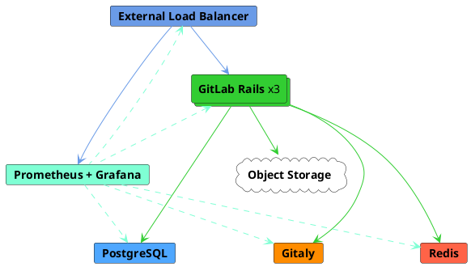

# Reference architecture: up to 2,000 users **(FREE SELF)**

This page describes GitLab reference architecture for up to 2,000 users.
For a full list of reference architectures, see
[Available reference architectures](index.md#available-reference-architectures).

> - **Supported users (approximate):** 2,000
> - **High Availability:** No. For a highly-available environment, you can
>   follow a modified [3K reference architecture](3k_users.md#supported-modifications-for-lower-user-counts-ha).
> - **Test requests per second (RPS) rates:** API: 40 RPS, Web: 4 RPS, Git (Pull): 4 RPS, Git (Push): 1 RPS

| Service                                  | Nodes  | Configuration           | GCP             | AWS          | Azure    |
|------------------------------------------|--------|-------------------------|-----------------|--------------|----------|
| Load balancer<sup>3</sup>                | 1      | 2 vCPU, 1.8 GB memory   | `n1-highcpu-2`  | `c5.large`   | `F2s v2` |
| PostgreSQL<sup>1</sup>                   | 1      | 2 vCPU, 7.5 GB memory   | `n1-standard-2` | `m5.large`   | `D2s v3` |
| Redis<sup>2</sup>                        | 1      | 1 vCPU, 3.75 GB memory  | `n1-standard-1` | `m5.large`   | `D2s v3` |
| Gitaly                                   | 1      | 4 vCPU, 15 GB memory    | `n1-standard-4` | `m5.xlarge`  | `D4s v3` |
| GitLab Rails                             | 2      | 8 vCPU, 7.2 GB memory   | `n1-highcpu-8`  | `c5.2xlarge` | `F8s v2` |
| Monitoring node                          | 1      | 2 vCPU, 1.8 GB memory   | `n1-highcpu-2`  | `c5.large`   | `F2s v2` |
| Object storage<sup>4</sup>               | n/a    | n/a                     | n/a             | n/a          | n/a      |
| NFS server (optional, not recommended)   | 1      | 4 vCPU, 3.6 GB memory   | `n1-highcpu-4`  | `c5.xlarge`  | `F4s v2` |

<!-- markdownlint-disable MD029 -->
1. Can be optionally run on reputable third-party external PaaS PostgreSQL solutions. Google Cloud SQL and AWS RDS are known to work, however Azure Database for PostgreSQL is [not recommended](https://gitlab.com/gitlab-org/quality/reference-architectures/-/issues/61) due to performance issues. Consul is primarily used for PostgreSQL high availability so can be ignored when using a PostgreSQL PaaS setup. However it is also used optionally by Prometheus for Omnibus auto host discovery.
2. Can be optionally run as reputable third-party external PaaS Redis solutions. Google Memorystore and AWS Elasticache are known to work.
3. Can be optionally run as reputable third-party load balancing services (LB PaaS). AWS ELB is known to work.
4. Should be run on reputable third-party object storage (storage PaaS) for cloud implementations. Google Cloud Storage and AWS S3 are known to work.
<!-- markdownlint-enable MD029 -->

NOTE:
For all PaaS solutions that involve configuring instances, it is strongly recommended to implement a minimum of three nodes in three different availability zones to align with resilient cloud architecture practices.



The Google Cloud Platform (GCP) architectures were built and tested using the
[Intel Xeon E5 v3 (Haswell)](https://cloud.google.com/compute/docs/cpu-platforms)
CPU platform. On different hardware you may find that adjustments, either lower
or higher, are required for your CPU or node counts. For more information, see
our [Sysbench](https://github.com/akopytov/sysbench)-based
[CPU benchmarks](https://gitlab.com/gitlab-org/quality/performance/-/wikis/Reference-Architectures/GCP-CPU-Benchmarks).

Due to better performance and availability, for data objects (such as LFS,
uploads, or artifacts), using an [object storage service](#configure-the-object-storage)
is recommended instead of using NFS. Using an object storage service also
doesn't require you to provision and maintain a node.

## Setup components

To set up GitLab and its components to accommodate up to 2,000 users:

1. [Configure the external load balancing node](#configure-the-external-load-balancer)
   to handle the load balancing of the GitLab application services nodes.
1. [Configure PostgreSQL](#configure-postgresql), the database for GitLab.
1. [Configure Redis](#configure-redis).
1. [Configure Gitaly](#configure-gitaly), which provides access to the Git
   repositories.
1. [Configure the main GitLab Rails application](#configure-gitlab-rails)
   to run Puma, Workhorse, GitLab Shell, and to serve all frontend
   requests (which include UI, API, and Git over HTTP/SSH).
1. [Configure Prometheus](#configure-prometheus) to monitor your GitLab
   environment.
1. [Configure the object storage](#configure-the-object-storage) used for
   shared data objects.
1. [Configure Advanced Search](#configure-advanced-search) (optional) for faster,
   more advanced code search across your entire GitLab instance.
1. [Configure NFS](#configure-nfs-optional) (optional, and not recommended)
   to have shared disk storage service as an alternative to Gitaly or object
   storage. You can skip this step if you're not using GitLab Pages (which
   requires NFS).

## Configure the external load balancer

In a multi-node GitLab configuration, you'll need a load balancer to route
traffic to the application servers. The specifics on which load balancer to use
or its exact configuration is beyond the scope of GitLab documentation. We assume
that if you're managing multi-node systems like GitLab, you already have a load
balancer of choice and that the routing methods used are distributing calls evenly
between all nodes. Some load balancer examples include HAProxy (open-source),
F5 Big-IP LTM, and Citrix Net Scaler. This documentation outline the ports and
protocols needed for use with GitLab.

This architecture has been tested and validated with [HAProxy](https://www.haproxy.org/)
as the load balancer. Although other load balancers with similar feature sets
could also be used, those load balancers have not been validated.

The next question is how you will handle SSL in your environment. There are
several different options:

- [The application node terminates SSL](#application-node-terminates-ssl).
- [The load balancer terminates SSL without backend SSL](#load-balancer-terminates-ssl-without-backend-ssl)
  and communication is not secure between the load balancer and the application node.
- [The load balancer terminates SSL with backend SSL](#load-balancer-terminates-ssl-with-backend-ssl)
  and communication is *secure* between the load balancer and the application node.

### Application node terminates SSL

Configure your load balancer to pass connections on port 443 as `TCP` instead
of `HTTP(S)`. This will pass the connection unaltered to the application node's
NGINX service, which has the SSL certificate and listens to port 443.

For details about managing SSL certificates and configuring NGINX, see the
[NGINX HTTPS documentation](https://docs.gitlab.com/omnibus/settings/nginx.html#enable-https).

### Load balancer terminates SSL without backend SSL

Configure your load balancer to use the `HTTP(S)` protocol instead of `TCP`.
The load balancer will be responsible for both managing SSL certificates and
terminating SSL.

Due to communication between the load balancer and GitLab not being secure,
you'll need to complete some additional configuration. For details, see the
[NGINX proxied SSL documentation](https://docs.gitlab.com/omnibus/settings/nginx.html#supporting-proxied-ssl).

### Load balancer terminates SSL with backend SSL

Configure your load balancers (or single balancer, if you have only one) to use
the `HTTP(S)` protocol rather than `TCP`. The load balancers will be
responsible for the managing SSL certificates for end users.

Traffic will be secure between the load balancers and NGINX in this scenario,
and there's no need to add a configuration for proxied SSL. However, you'll
need to add a configuration to GitLab to configure SSL certificates. For
details about managing SSL certificates and configuring NGINX, see the
[NGINX HTTPS documentation](https://docs.gitlab.com/omnibus/settings/nginx.html#enable-https).

### Readiness checks

Ensure the external load balancer only routes to working services with built
in monitoring endpoints. The [readiness checks](../../user/admin_area/monitoring/health_check.md)
all require [additional configuration](../monitoring/ip_whitelist.md)
on the nodes being checked, otherwise, the external load balancer will not be able to
connect.

### Ports

The basic load balancer ports you should use are described in the following
table:

| Port    | Backend Port | Protocol                 |
| ------- | ------------ | ------------------------ |
| 80      | 80           | HTTP (*1*)               |
| 443     | 443          | TCP or HTTPS (*1*) (*2*) |
| 22      | 22           | TCP                      |

- (*1*): [Web terminal](../../ci/environments/index.md#web-terminals) support
  requires your load balancer to correctly handle WebSocket connections.
  When using HTTP or HTTPS proxying, your load balancer must be configured
  to pass through the `Connection` and `Upgrade` hop-by-hop headers. For
  details, see the [web terminal](../integration/terminal.md) integration guide.
- (*2*): When using the HTTPS protocol for port 443, you'll need to add an SSL
  certificate to the load balancers. If you need to terminate SSL at the
  GitLab application server, use the TCP protocol.

If you're using GitLab Pages with custom domain support you will need some
additional port configurations. GitLab Pages requires a separate virtual IP
address. Configure DNS to point the `pages_external_url` from
`/etc/gitlab/gitlab.rb` to the new virtual IP address. For more information,
see the [GitLab Pages documentation](../pages/index.md).

| Port    | Backend Port  | Protocol  |
| ------- | ------------- | --------- |
| 80      | Varies (*1*)  | HTTP      |
| 443     | Varies (*1*)  | TCP (*2*) |

- (*1*): The backend port for GitLab Pages depends on the
  `gitlab_pages['external_http']` and `gitlab_pages['external_https']`
  settings. For details, see the [GitLab Pages documentation](../pages/index.md).
- (*2*): Port 443 for GitLab Pages must use the TCP protocol. Users can
  configure custom domains with custom SSL, which wouldn't be possible if SSL
  was terminated at the load balancer.

#### Alternate SSH Port

Some organizations have policies against opening SSH port 22. In this case,
it may be helpful to configure an alternate SSH hostname that instead allows
users to use SSH over port 443. An alternate SSH hostname requires a new
virtual IP address compared to the previously described GitLab HTTP
configuration.

Configure DNS for an alternate SSH hostname, such as `altssh.gitlab.example.com`:

| LB Port | Backend Port | Protocol |
| ------- | ------------ | -------- |
| 443     | 22           | TCP      |

<div align="right">
  <a type="button" class="btn btn-default" href="#setup-components">
    Back to setup components <i class="fa fa-angle-double-up" aria-hidden="true"></i>
  </a>
</div>

## Configure PostgreSQL

In this section, you'll be guided through configuring an external PostgreSQL database
to be used with GitLab.

### Provide your own PostgreSQL instance

If you're hosting GitLab on a cloud provider, you can optionally use a
managed service for PostgreSQL. For example, AWS offers a managed relational
database service (RDS) that runs PostgreSQL.

If you use a cloud-managed service, or provide your own PostgreSQL:

1. Set up PostgreSQL according to the
   [database requirements document](../../install/requirements.md#database).
1. Create a `gitlab` username with a password of your choice. The `gitlab` user
   needs privileges to create the `gitlabhq_production` database.
1. Configure the GitLab application servers with the appropriate details.
   This step is covered in [Configuring the GitLab Rails application](#configure-gitlab-rails).

See [Configure GitLab using an external PostgreSQL service](../postgresql/external.md) for
further configuration steps.

### Standalone PostgreSQL using Omnibus GitLab

1. SSH in to the PostgreSQL server.
1. [Download and install](https://about.gitlab.com/install/) the Omnibus GitLab
   package of your choice. Be sure to follow _only_ installation steps 1 and 2
   on the page.
1. Generate a password hash for PostgreSQL. This assumes you will use the default
   username of `gitlab` (recommended). The command will request a password
   and confirmation. Use the value that is output by this command in the next
   step as the value of `POSTGRESQL_PASSWORD_HASH`.

   ```shell
   sudo gitlab-ctl pg-password-md5 gitlab
   ```

1. Edit `/etc/gitlab/gitlab.rb` and add the contents below, updating placeholder
   values appropriately.

   - `POSTGRESQL_PASSWORD_HASH` - The value output from the previous step
   - `APPLICATION_SERVER_IP_BLOCKS` - A space delimited list of IP subnets or IP
     addresses of the GitLab application servers that will connect to the
     database. Example: `%w(123.123.123.123/32 123.123.123.234/32)`

   ```ruby
   # Disable all components except PostgreSQL related ones
   roles(['postgres_role'])
   prometheus['enable'] = false
   alertmanager['enable'] = false
   pgbouncer_exporter['enable'] = false
   redis_exporter['enable'] = false
   gitlab_exporter['enable'] = false

   # Set the network addresses that the exporters used for monitoring will listen on
   node_exporter['listen_address'] = '0.0.0.0:9100'
   postgres_exporter['listen_address'] = '0.0.0.0:9187'
   postgres_exporter['dbname'] = 'gitlabhq_production'
   postgres_exporter['password'] = 'POSTGRESQL_PASSWORD_HASH'

   # Set the PostgreSQL address and port
   postgresql['listen_address'] = '0.0.0.0'
   postgresql['port'] = 5432

   # Replace POSTGRESQL_PASSWORD_HASH with a generated md5 value
   postgresql['sql_user_password'] = 'POSTGRESQL_PASSWORD_HASH'

   # Replace APPLICATION_SERVER_IP_BLOCK with the CIDR address of the application node
   postgresql['trust_auth_cidr_addresses'] = %w(127.0.0.1/32 APPLICATION_SERVER_IP_BLOCK)

   # Prevent database migrations from running on upgrade automatically
   gitlab_rails['auto_migrate'] = false
   ```

1. Copy the `/etc/gitlab/gitlab-secrets.json` file from the first Omnibus node you configured and add or replace
   the file of the same name on this server. If this is the first Omnibus node you are configuring then you can skip this step.

1. [Reconfigure GitLab](../restart_gitlab.md#omnibus-gitlab-reconfigure) for the changes to take effect.
1. Note the PostgreSQL node's IP address or hostname, port, and
   plain text password. These will be necessary when configuring the [GitLab
   application server](#configure-gitlab-rails) later.

Advanced [configuration options](https://docs.gitlab.com/omnibus/settings/database.html)
are supported and can be added if needed.

<div align="right">
  <a type="button" class="btn btn-default" href="#setup-components">
    Back to setup components <i class="fa fa-angle-double-up" aria-hidden="true"></i>
  </a>
</div>

## Configure Redis

In this section, you'll be guided through configuring an external Redis instance
to be used with GitLab.

### Provide your own Redis instance

Redis version 5.0 or higher is required, as this is what ships with
Omnibus GitLab packages starting with GitLab 13.0. Older Redis versions
do not support an optional count argument to SPOP which is now required for
[Merge Trains](../../ci/pipelines/merge_trains.md).

In addition, GitLab makes use of certain commands like `UNLINK` and `USAGE` which
were introduced only in Redis 4.

Managed Redis from cloud providers such as AWS ElastiCache will work. If these
services support high availability, be sure it is not the Redis Cluster type.

Note the Redis node's IP address or hostname, port, and password (if required).
These will be necessary when configuring the
[GitLab application servers](#configure-gitlab-rails) later.

### Standalone Redis using Omnibus GitLab

The Omnibus GitLab package can be used to configure a standalone Redis server.
The steps below are the minimum necessary to configure a Redis server with
Omnibus:

1. SSH in to the Redis server.
1. [Download and install](https://about.gitlab.com/install/) the Omnibus GitLab
   package of your choice. Be sure to follow _only_ installation steps 1 and 2
   on the page.
1. Edit `/etc/gitlab/gitlab.rb` and add the contents:

   ```ruby
   ## Enable Redis
   redis['enable'] = true
   
   # Avoid running unnecessary services on the Redis server
   gitaly['enable'] = false
   postgresql['enable'] = false
   puma['enable'] = false
   sidekiq['enable'] = false
   gitlab_workhorse['enable'] = false
   prometheus['enable'] = false
   alertmanager['enable'] = false
   grafana['enable'] = false
   gitlab_exporter['enable'] = false
   nginx['enable'] = false

   redis['bind'] = '0.0.0.0'
   redis['port'] = 6379
   redis['password'] = 'SECRET_PASSWORD_HERE'

   gitlab_rails['enable'] = false

   # Set the network addresses that the exporters used for monitoring will listen on
   node_exporter['listen_address'] = '0.0.0.0:9100'
   redis_exporter['listen_address'] = '0.0.0.0:9121'
   redis_exporter['flags'] = {
         'redis.addr' => 'redis://0.0.0.0:6379',
         'redis.password' => 'SECRET_PASSWORD_HERE',
   }
   ```

1. Copy the `/etc/gitlab/gitlab-secrets.json` file from the first Omnibus node you configured and add or replace
   the file of the same name on this server. If this is the first Omnibus node you are configuring then you can skip this step.

1. [Reconfigure Omnibus GitLab](../restart_gitlab.md#omnibus-gitlab-reconfigure) for the changes to take effect.

1. Note the Redis node's IP address or hostname, port, and
   Redis password. These will be necessary when [configuring the GitLab
   application servers](#configure-gitlab-rails) later.

Advanced [configuration options](https://docs.gitlab.com/omnibus/settings/redis.html)
are supported and can be added if needed.

<div align="right">
  <a type="button" class="btn btn-default" href="#setup-components">
    Back to setup components <i class="fa fa-angle-double-up" aria-hidden="true"></i>
  </a>
</div>

## Configure Gitaly

[Gitaly](../gitaly/index.md) server node requirements are dependent on data,
specifically the number of projects and those projects' sizes. It's recommended
that a Gitaly server node stores no more than 5TB of data. Although this
reference architecture includes a single Gitaly server node, you may require
additional nodes depending on your repository storage requirements.

Due to Gitaly having notable input and output requirements, we strongly
recommend that all Gitaly nodes use solid-state drives (SSDs). These SSDs
should have a throughput of at least 8,000
input/output operations per second (IOPS) for read operations and 2,000 IOPS
for write operations. These IOPS values are initial recommendations, and may be
adjusted to greater or lesser values depending on the scale of your
environment's workload. If you're running the environment on a Cloud provider,
refer to their documentation about how to configure IOPS correctly.

Be sure to note the following items:

- The GitLab Rails application shards repositories into
  [repository storage paths](../repository_storage_paths.md).
- A Gitaly server can host one or more storage paths.
- A GitLab server can use one or more Gitaly server nodes.
- Gitaly addresses must be specified to be correctly resolvable for *all*
  Gitaly clients.
- Gitaly servers must not be exposed to the public internet, as Gitaly's network
  traffic is unencrypted by default. The use of a firewall is highly recommended
  to restrict access to the Gitaly server. Another option is to
  [use TLS](#gitaly-tls-support).

NOTE:
The token referred to throughout the Gitaly documentation is an arbitrary
password selected by the administrator. This token is unrelated to tokens
created for the GitLab API or other similar web API tokens.

The following procedure describes how to configure a single Gitaly server named
`gitaly1.internal` with the secret token `gitalysecret`. We assume your GitLab
installation has two repository storages: `default` and `storage1`.

To configure the Gitaly server, on the server node you want to use for Gitaly:

1. [Download and install](https://about.gitlab.com/install/) the Omnibus GitLab
   package of your choice. Be sure to follow _only_ installation steps 1 and 2
   on the page, and _do not_ provide the `EXTERNAL_URL` value.
1. Edit the Gitaly server node's `/etc/gitlab/gitlab.rb` file to configure
   storage paths, enable the network listener, and to configure the token:

   <!--
   updates to following example must also be made at
   https://gitlab.com/gitlab-org/charts/gitlab/blob/master/doc/advanced/external-gitaly/external-omnibus-gitaly.md#configure-omnibus-gitlab
   -->

   ```ruby
   # /etc/gitlab/gitlab.rb

   # Gitaly and GitLab use two shared secrets for authentication, one to authenticate gRPC requests
   # to Gitaly, and a second for authentication callbacks from GitLab-Shell to the GitLab internal API.
   # The following two values must be the same as their respective values
   # of the GitLab Rails application setup
   gitaly['auth_token'] = 'gitalysecret'
   gitlab_shell['secret_token'] = 'shellsecret'

   # Avoid running unnecessary services on the Gitaly server
   postgresql['enable'] = false
   redis['enable'] = false
   puma['enable'] = false
   sidekiq['enable'] = false
   gitlab_workhorse['enable'] = false
   prometheus['enable'] = false
   alertmanager['enable'] = false
   grafana['enable'] = false
   gitlab_exporter['enable'] = false
   nginx['enable'] = false

   # Prevent database migrations from running on upgrade automatically
   gitlab_rails['auto_migrate'] = false

   # Configure the gitlab-shell API callback URL. Without this, `git push` will
   # fail. This can be your 'front door' GitLab URL or an internal load
   # balancer.
   gitlab_rails['internal_api_url'] = 'https://gitlab.example.com'

   # Gitaly
   gitaly['enable'] = true

   # Make Gitaly accept connections on all network interfaces. You must use
   # firewalls to restrict access to this address/port.
   # Comment out following line if you only want to support TLS connections
   gitaly['listen_addr'] = "0.0.0.0:8075"
   gitaly['prometheus_listen_addr'] = "0.0.0.0:9236"

   # Set the network addresses that the exporters used for monitoring will listen on
   node_exporter['listen_address'] = '0.0.0.0:9100'

   git_data_dirs({
     'default' => {
       'path' => '/var/opt/gitlab/git-data'
     },
     'storage1' => {
       'path' => '/mnt/gitlab/git-data'
     },
   })
   ```

1. Copy the `/etc/gitlab/gitlab-secrets.json` file from the first Omnibus node you configured and add or replace
   the file of the same name on this server. If this is the first Omnibus node you are configuring then you can skip this step.

1. [Reconfigure GitLab](../restart_gitlab.md#omnibus-gitlab-reconfigure) for the changes to take effect.

1. Confirm that Gitaly can perform callbacks to the internal API:

   ```shell
   sudo /opt/gitlab/embedded/bin/gitaly-hooks check /var/opt/gitlab/gitaly/config.toml
   ```

### Gitaly TLS support

Gitaly supports TLS encryption. To be able to communicate
with a Gitaly instance that listens for secure connections you will need to use `tls://` URL
scheme in the `gitaly_address` of the corresponding storage entry in the GitLab configuration.

You will need to bring your own certificates as this isn't provided automatically.
The certificate, or its certificate authority, must be installed on all Gitaly
nodes (including the Gitaly node using the certificate) and on all client nodes
that communicate with it following the procedure described in
[GitLab custom certificate configuration](https://docs.gitlab.com/omnibus/settings/ssl.html#install-custom-public-certificates).

NOTE:
The self-signed certificate must specify the address you use to access the
Gitaly server. If you are addressing the Gitaly server by a hostname, you can
either use the Common Name field for this, or add it as a Subject Alternative
Name. If you are addressing the Gitaly server by its IP address, you must add it
as a Subject Alternative Name to the certificate.
[gRPC does not support using an IP address as Common Name in a certificate](https://github.com/grpc/grpc/issues/2691).

It's possible to configure Gitaly servers with both an unencrypted listening
address (`listen_addr`) and an encrypted listening address (`tls_listen_addr`)
at the same time. This allows you to do a gradual transition from unencrypted to
encrypted traffic, if necessary.

To configure Gitaly with TLS:

1. Create the `/etc/gitlab/ssl` directory and copy your key and certificate there:

   ```shell
   sudo mkdir -p /etc/gitlab/ssl
   sudo chmod 755 /etc/gitlab/ssl
   sudo cp key.pem cert.pem /etc/gitlab/ssl/
   sudo chmod 644 key.pem cert.pem
   ```

1. Copy the cert to `/etc/gitlab/trusted-certs` so Gitaly will trust the cert when
   calling into itself:

   ```shell
   sudo cp /etc/gitlab/ssl/cert.pem /etc/gitlab/trusted-certs/
   ```

1. Edit `/etc/gitlab/gitlab.rb` and add:

   <!--
   updates to following example must also be made at
   https://gitlab.com/gitlab-org/charts/gitlab/blob/master/doc/advanced/external-gitaly/external-omnibus-gitaly.md#configure-omnibus-gitlab
   -->

   ```ruby
   gitaly['tls_listen_addr'] = "0.0.0.0:9999"
   gitaly['certificate_path'] = "/etc/gitlab/ssl/cert.pem"
   gitaly['key_path'] = "/etc/gitlab/ssl/key.pem"
   ```

1. Delete `gitaly['listen_addr']` to allow only encrypted connections.
1. Save the file and [reconfigure GitLab](../restart_gitlab.md#omnibus-gitlab-reconfigure).

<div align="right">
  <a type="button" class="btn btn-default" href="#setup-components">
    Back to setup components <i class="fa fa-angle-double-up" aria-hidden="true"></i>
  </a>
</div>

## Configure GitLab Rails

This section describes how to configure the GitLab application (Rails) component.

In our architecture, we run each GitLab Rails node using the Puma webserver, and
have its number of workers set to 90% of available CPUs, with four threads. For
nodes running Rails with other components, the worker value should be reduced
accordingly. We've determined that a worker value of 50% achieves a good balance,
but this is dependent on workload.

On each node perform the following:

1. If you're [using NFS](#configure-nfs-optional):

   1. If necessary, install the NFS client utility packages using the following
      commands:

      ```shell
      # Ubuntu/Debian
      apt-get install nfs-common

      # CentOS/Red Hat
      yum install nfs-utils nfs-utils-lib
      ```

   1. Specify the necessary NFS mounts in `/etc/fstab`.
      The exact contents of `/etc/fstab` will depend on how you chose
      to configure your NFS server. See the [NFS documentation](../nfs.md)
      for examples and the various options.

   1. Create the shared directories. These may be different depending on your NFS
      mount locations.

      ```shell
      mkdir -p /var/opt/gitlab/.ssh /var/opt/gitlab/gitlab-rails/uploads /var/opt/gitlab/gitlab-rails/shared /var/opt/gitlab/gitlab-ci/builds /var/opt/gitlab/git-data
      ```

1. [Download and install](https://about.gitlab.com/install/) the Omnibus GitLab
   package of your choice. Be sure to follow _only_ installation steps 1 and 2
   on the page.
1. Create or edit `/etc/gitlab/gitlab.rb` and use the following configuration.
   To maintain uniformity of links across nodes, the `external_url`
   on the application server should point to the external URL that users will use
   to access GitLab. This would be the URL of the [load balancer](#configure-the-external-load-balancer)
   which will route traffic to the GitLab application server:

   ```ruby
   external_url 'https://gitlab.example.com'

   # Gitaly and GitLab use two shared secrets for authentication, one to authenticate gRPC requests
   # to Gitaly, and a second for authentication callbacks from GitLab-Shell to the GitLab internal API.
   # The following two values must be the same as their respective values
   # of the Gitaly setup
   gitlab_rails['gitaly_token'] = 'gitalysecret'
   gitlab_shell['secret_token'] = 'shellsecret'

   git_data_dirs({
     'default' => { 'gitaly_address' => 'tcp://gitaly1.internal:8075' },
     'storage1' => { 'gitaly_address' => 'tcp://gitaly1.internal:8075' },
     'storage2' => { 'gitaly_address' => 'tcp://gitaly2.internal:8075' },
   })

   ## Disable components that will not be on the GitLab application server
   roles(['application_role'])
   gitaly['enable'] = false
   nginx['enable'] = true

   ## PostgreSQL connection details
   gitlab_rails['db_adapter'] = 'postgresql'
   gitlab_rails['db_encoding'] = 'unicode'
   gitlab_rails['db_host'] = '10.1.0.5' # IP/hostname of database server
   gitlab_rails['db_password'] = 'DB password'

   ## Redis connection details
   gitlab_rails['redis_port'] = '6379'
   gitlab_rails['redis_host'] = '10.1.0.6' # IP/hostname of Redis server
   gitlab_rails['redis_password'] = 'Redis Password'

   # Set the network addresses that the exporters used for monitoring will listen on
   node_exporter['listen_address'] = '0.0.0.0:9100'
   gitlab_workhorse['prometheus_listen_addr'] = '0.0.0.0:9229'
   sidekiq['listen_address'] = "0.0.0.0"
   # Set number of Sidekiq threads per queue process to the recommend number of 10
   sidekiq['max_concurrency'] = 10
   puma['listen'] = '0.0.0.0'

   # Add the monitoring node's IP address to the monitoring whitelist and allow it to
   # scrape the NGINX metrics. Replace placeholder `monitoring.gitlab.example.com` with
   # the address and/or subnets gathered from the monitoring node
   gitlab_rails['monitoring_whitelist'] = ['<MONITOR NODE IP>/32', '127.0.0.0/8']
   nginx['status']['options']['allow'] = ['<MONITOR NODE IP>/32', '127.0.0.0/8']

   # Object Storage
   # This is an example for configuring Object Storage on GCP
   # Replace this config with your chosen Object Storage provider as desired
   gitlab_rails['object_store']['connection'] = {
     'provider' => 'Google',
     'google_project' => '<gcp-project-name>',
     'google_json_key_location' => '<path-to-gcp-service-account-key>'
   }
   gitlab_rails['object_store']['objects']['artifacts']['bucket'] = "<gcp-artifacts-bucket-name>"
   gitlab_rails['object_store']['objects']['external_diffs']['bucket'] = "<gcp-external-diffs-bucket-name>"
   gitlab_rails['object_store']['objects']['lfs']['bucket'] = "<gcp-lfs-bucket-name>"
   gitlab_rails['object_store']['objects']['uploads']['bucket'] = "<gcp-uploads-bucket-name>"
   gitlab_rails['object_store']['objects']['packages']['bucket'] = "<gcp-packages-bucket-name>"
   gitlab_rails['object_store']['objects']['dependency_proxy']['bucket'] = "<gcp-dependency-proxy-bucket-name>"
   gitlab_rails['object_store']['objects']['terraform_state']['bucket'] = "<gcp-terraform-state-bucket-name>"

   gitlab_rails['backup_upload_connection'] = {
     'provider' => 'Google',
     'google_project' => '<gcp-project-name>',
     'google_json_key_location' => '<path-to-gcp-service-account-key>'
   }
   gitlab_rails['backup_upload_remote_directory'] = "<gcp-backups-state-bucket-name>"

   ## Uncomment and edit the following options if you have set up NFS
   ##
   ## Prevent GitLab from starting if NFS data mounts are not available
   ##
   #high_availability['mountpoint'] = '/var/opt/gitlab/git-data'
   ##
   ## Ensure UIDs and GIDs match between servers for permissions via NFS
   ##
   #user['uid'] = 9000
   #user['gid'] = 9000
   #web_server['uid'] = 9001
   #web_server['gid'] = 9001
   #registry['uid'] = 9002
   #registry['gid'] = 9002
   ```

1. If you're using [Gitaly with TLS support](#gitaly-tls-support), make sure the
   `git_data_dirs` entry is configured with `tls` instead of `tcp`:

   ```ruby
   git_data_dirs({
     'default' => { 'gitaly_address' => 'tls://gitaly1.internal:9999' },
     'storage1' => { 'gitaly_address' => 'tls://gitaly1.internal:9999' },
     'storage2' => { 'gitaly_address' => 'tls://gitaly2.internal:9999' },
   })
   ```

   1. Copy the cert into `/etc/gitlab/trusted-certs`:

      ```shell
      sudo cp cert.pem /etc/gitlab/trusted-certs/
      ```

1. Copy the `/etc/gitlab/gitlab-secrets.json` file from the first Omnibus node you configured and add or replace
   the file of the same name on this server. If this is the first Omnibus node you are configuring then you can skip this step.

1. To ensure database migrations are only run during reconfigure and not automatically on upgrade, run:

   ```shell
   sudo touch /etc/gitlab/skip-auto-reconfigure
   ```

   Only a single designated node should handle migrations as detailed in the
   [GitLab Rails post-configuration](#gitlab-rails-post-configuration) section.

1. [Reconfigure GitLab](../restart_gitlab.md#omnibus-gitlab-reconfigure) for the changes to take effect.

1. Run `sudo gitlab-rake gitlab:gitaly:check` to confirm the node can connect to Gitaly.
1. Tail the logs to see the requests:

   ```shell
   sudo gitlab-ctl tail gitaly
   ```

When you specify `https` in the `external_url`, as in the previous example,
GitLab expects that the SSL certificates are in `/etc/gitlab/ssl/`. If the
certificates aren't present, NGINX will fail to start. For more information, see
the [NGINX documentation](https://docs.gitlab.com/omnibus/settings/nginx.html#enable-https).

### GitLab Rails post-configuration

1. Designate one application node for running database migrations during
   installation and updates. Initialize the GitLab database and ensure all
   migrations ran:

   ```shell
   sudo gitlab-rake gitlab:db:configure
   ```

   If you encounter a `rake aborted!` error message stating that PgBouncer is
   failing to connect to PostgreSQL, it may be that your PgBouncer node's IP
   address is missing from PostgreSQL's `trust_auth_cidr_addresses` in `gitlab.rb`
   on your database nodes. Before proceeding, see
   [PgBouncer error `ERROR:  pgbouncer cannot connect to server`](troubleshooting.md#pgbouncer-error-error-pgbouncer-cannot-connect-to-server).

1. [Configure fast lookup of authorized SSH keys in the database](../operations/fast_ssh_key_lookup.md).

<div align="right">
  <a type="button" class="btn btn-default" href="#setup-components">
    Back to setup components <i class="fa fa-angle-double-up" aria-hidden="true"></i>
  </a>
</div>

## Configure Prometheus

The Omnibus GitLab package can be used to configure a standalone Monitoring node
running [Prometheus](../monitoring/prometheus/index.md) and
[Grafana](../monitoring/performance/grafana_configuration.md):

1. SSH in to the Monitoring node.
1. [Download and install](https://about.gitlab.com/install/) the Omnibus GitLab
   package of your choice. Be sure to follow _only_ installation steps 1 and 2
   on the page.
1. Edit `/etc/gitlab/gitlab.rb` and add the contents:

   ```ruby
   roles(['monitoring_role'])

   external_url 'http://gitlab.example.com'

   # Prometheus
   prometheus['listen_address'] = '0.0.0.0:9090'
   prometheus['monitor_kubernetes'] = false

   # Grafana
   grafana['enable'] = true
   grafana['admin_password'] = '<grafana_password>'
   grafana['disable_login_form'] = false

   # Nginx - For Grafana access
   nginx['enable'] = true
   ```

1. Prometheus also needs some scrape configurations to pull all the data from the various
   nodes where we configured exporters. Assuming that your nodes' IPs are:

   ```plaintext
   1.1.1.1: postgres
   1.1.1.2: redis
   1.1.1.3: gitaly1
   1.1.1.4: rails1
   1.1.1.5: rails2
   ```

   Add the following to `/etc/gitlab/gitlab.rb`:

   ```ruby
   prometheus['scrape_configs'] = [
     {
        'job_name': 'postgres',
        'static_configs' => [
        'targets' => ['1.1.1.1:9187'],
        ],
     },
     {
        'job_name': 'redis',
        'static_configs' => [
        'targets' => ['1.1.1.2:9121'],
        ],
     },
     {
        'job_name': 'gitaly',
        'static_configs' => [
        'targets' => ['1.1.1.3:9236'],
        ],
     },
     {
        'job_name': 'gitlab-nginx',
        'static_configs' => [
        'targets' => ['1.1.1.4:8060', '1.1.1.5:8060'],
        ],
     },
     {
        'job_name': 'gitlab-workhorse',
        'static_configs' => [
        'targets' => ['1.1.1.4:9229', '1.1.1.5:9229'],
        ],
     },
     {
        'job_name': 'gitlab-rails',
        'metrics_path': '/-/metrics',
        'static_configs' => [
        'targets' => ['1.1.1.4:8080', '1.1.1.5:8080'],
        ],
     },
     {
        'job_name': 'gitlab-sidekiq',
        'static_configs' => [
        'targets' => ['1.1.1.4:8082', '1.1.1.5:8082'],
        ],
     },
     {
        'job_name': 'node',
        'static_configs' => [
        'targets' => ['1.1.1.1:9100', '1.1.1.2:9100', '1.1.1.3:9100', '1.1.1.4:9100', '1.1.1.5:9100'],
        ],
     },
   ]
   ```

1. Save the file and [reconfigure GitLab](../restart_gitlab.md#omnibus-gitlab-reconfigure).
1. In the GitLab UI, set `admin/application_settings/metrics_and_profiling` > Metrics - Grafana to `/-/grafana` to
`http[s]://<MONITOR NODE>/-/grafana`

<div align="right">
  <a type="button" class="btn btn-default" href="#setup-components">
    Back to setup components <i class="fa fa-angle-double-up" aria-hidden="true"></i>
  </a>
</div>

## Configure the object storage

GitLab supports using an object storage service for holding several types of
data, and is recommended over [NFS](#configure-nfs-optional). In general,
object storage services are better for larger environments, as object storage
is typically much more performant, reliable, and scalable.

GitLab has been tested on a number of object storage providers:

- [Amazon S3](https://aws.amazon.com/s3/)
- [Google Cloud Storage](https://cloud.google.com/storage)
- [Digital Ocean Spaces](https://www.digitalocean.com/products/spaces/)
- [Oracle Cloud Infrastructure](https://docs.cloud.oracle.com/en-us/iaas/Content/Object/Tasks/s3compatibleapi.htm)
- [OpenStack Swift](https://docs.openstack.org/swift/latest/s3_compat.html)
- [Azure Blob storage](https://docs.microsoft.com/en-us/azure/storage/blobs/storage-blobs-introduction)
- On-premises hardware and appliances from various storage vendors.
- MinIO. We have [a guide to deploying this](https://docs.gitlab.com/charts/advanced/external-object-storage/minio.html) within our Helm Chart documentation.

There are two ways of specifying object storage configuration in GitLab:

- [Consolidated form](../object_storage.md#consolidated-object-storage-configuration): A single credential is
  shared by all supported object types.
- [Storage-specific form](../object_storage.md#storage-specific-configuration): Every object defines its
  own object storage [connection and configuration](../object_storage.md#connection-settings).

Starting with GitLab 13.2, consolidated object storage configuration is available. It simplifies your GitLab configuration since the connection details are shared across object types. Refer to [Consolidated object storage configuration](../object_storage.md#consolidated-object-storage-configuration) guide for instructions on how to set it up.

For configuring object storage in GitLab 13.1 and earlier, or for storage types not
supported by consolidated configuration form, refer to the following guides based
on what features you intend to use:

|Object storage type|Supported by consolidated configuration?|
|-------------------|----------------------------------------|
| [Backups](../../raketasks/backup_restore.md#uploading-backups-to-a-remote-cloud-storage) | No |
| [Job artifacts](../job_artifacts.md#using-object-storage) including archived job logs | Yes |
| [LFS objects](../lfs/index.md#storing-lfs-objects-in-remote-object-storage) | Yes |
| [Uploads](../uploads.md#using-object-storage) | Yes |
| [Container Registry](../packages/container_registry.md#use-object-storage) (optional feature) | No |
| [Merge request diffs](../merge_request_diffs.md#using-object-storage) | Yes |
| [Mattermost](https://docs.mattermost.com/administration/config-settings.html#file-storage)| No |
| [Packages](../packages/index.md#using-object-storage) (optional feature) | Yes |
| [Dependency Proxy](../packages/dependency_proxy.md#using-object-storage) (optional feature) | Yes |
| [Pseudonymizer](../pseudonymizer.md#configuration) (optional feature) **(ULTIMATE SELF)** | No |
| [Autoscale runner caching](https://docs.gitlab.com/runner/configuration/autoscale.html#distributed-runners-caching) (optional for improved performance) | No |
| [Terraform state files](../terraform_state.md#using-object-storage) | Yes |

Using separate buckets for each data type is the recommended approach for GitLab.
This ensures there are no collisions across the various types of data GitLab stores.
There are plans to [enable the use of a single bucket](https://gitlab.com/gitlab-org/gitlab/-/issues/292958)
in the future.

<div align="right">
  <a type="button" class="btn btn-default" href="#setup-components">
    Back to setup components <i class="fa fa-angle-double-up" aria-hidden="true"></i>
  </a>
</div>

## Configure Advanced Search **(PREMIUM SELF)**

You can leverage Elasticsearch and [enable Advanced Search](../../integration/elasticsearch.md)
for faster, more advanced code search across your entire GitLab instance.

Elasticsearch cluster design and requirements are dependent on your specific
data. For recommended best practices about how to set up your Elasticsearch
cluster alongside your instance, read how to
[choose the optimal cluster configuration](../../integration/elasticsearch.md#guidance-on-choosing-optimal-cluster-configuration).

<div align="right">
  <a type="button" class="btn btn-default" href="#setup-components">
    Back to setup components <i class="fa fa-angle-double-up" aria-hidden="true"></i>
  </a>
</div>

## Configure NFS (optional)

For improved performance, [object storage](#configure-the-object-storage),
along with [Gitaly](#configure-gitaly), are recommended over using NFS whenever
possible. However, if you intend to use GitLab Pages,
[you must use NFS](troubleshooting.md#gitlab-pages-requires-nfs).

See how to [configure NFS](../nfs.md).

WARNING:
Engineering support for NFS for Git repositories is deprecated. Technical support is planned to be
unavailable from GitLab 15.0. No further enhancements are planned for this feature.

Read:

- The [Gitaly and NFS deprecation notice](../gitaly/index.md#nfs-deprecation-notice).
- About the [correct mount options to use](../nfs.md#upgrade-to-gitaly-cluster-or-disable-caching-if-experiencing-data-loss).

<div align="right">
  <a type="button" class="btn btn-default" href="#setup-components">
    Back to setup components <i class="fa fa-angle-double-up" aria-hidden="true"></i>
  </a>
</div>
