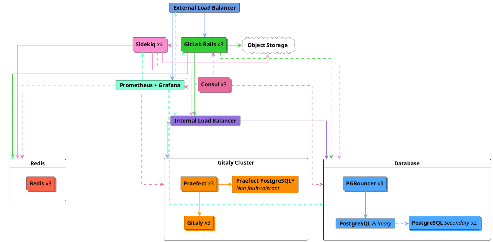
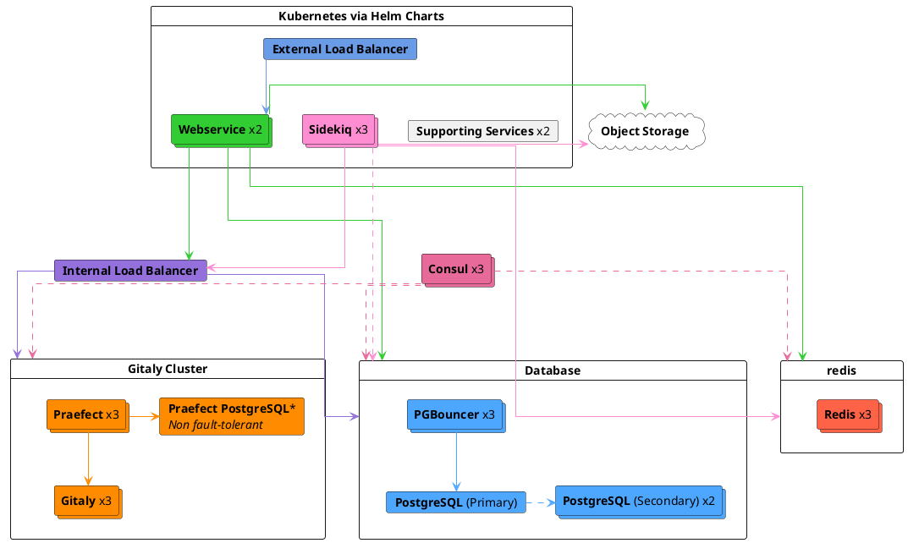

# Reference architecture: up to 3,000 users **(PREMIUM SELF)**

This GitLab reference architecture can help you deploy GitLab to up to 3,000
users, and then maintain uptime and access for those users. You can also use
this architecture to provide improved GitLab uptime and availability for fewer
than 3,000 users. For fewer users, reduce the stated node sizes as needed.

If maintaining a high level of uptime for your GitLab environment isn't a
requirement, or if you don't have the expertise to maintain this sort of
environment, we recommend using the non-HA [2,000-user reference architecture](2k_users.md)
for your GitLab installation. If HA is still a requirement, there's several supported
tweaks you can make to this architecture to reduce complexity as detailed here.

For a full list of reference architectures, see
[Available reference architectures](index.md#available-reference-architectures).

> - **Supported users (approximate):** 3,000
> - **High Availability:** Yes, although [Praefect](#configure-praefect-postgresql) needs a third-party PostgreSQL solution
> - **Estimated Costs:** [See cost table](index.md#cost-to-run)
> - **Cloud Native Hybrid Alternative:** [Yes](#cloud-native-hybrid-reference-architecture-with-helm-charts-alternative)
> - **Validation and test results:** The Quality Engineering team does [regular smoke and performance tests](index.md#validation-and-test-results) to ensure the reference architectures remain compliant
>   - **Test requests per second (RPS) rates:** API: 60 RPS, Web: 6 RPS, Git (Pull): 6 RPS, Git (Push): 1 RPS
>   - **[Latest Results](https://gitlab.com/gitlab-org/quality/performance/-/wikis/Benchmarks/Latest/3k)**
> - **Unsure which Reference Architecture to use?** [Go to this guide for more info](index.md#deciding-which-architecture-to-use).

| Service                                   | Nodes | Configuration         | GCP             | AWS          |
|-------------------------------------------|-------|-----------------------|-----------------|--------------|
| External load balancing node<sup>3</sup>  | 1     | 2 vCPU, 1.8 GB memory | `n1-highcpu-2`  | `c5.large`   |
| Redis<sup>2</sup>                         | 3     | 2 vCPU, 7.5 GB memory | `n1-standard-2` | `m5.large`   |
| Consul<sup>1</sup> + Sentinel<sup>2</sup> | 3     | 2 vCPU, 1.8 GB memory | `n1-highcpu-2`  | `c5.large`   |
| PostgreSQL<sup>1</sup>                    | 3     | 2 vCPU, 7.5 GB memory | `n1-standard-2` | `m5.large`   |
| PgBouncer<sup>1</sup>                     | 3     | 2 vCPU, 1.8 GB memory | `n1-highcpu-2`  | `c5.large`   |
| Internal load balancing node<sup>3</sup>  | 1     | 2 vCPU, 1.8 GB memory | `n1-highcpu-2`  | `c5.large`   |
| Gitaly<sup>5 6</sup>                      | 3     | 4 vCPU, 15 GB memory  | `n1-standard-4` | `m5.xlarge`  |
| Praefect<sup>5</sup>                      | 3     | 2 vCPU, 1.8 GB memory | `n1-highcpu-2`  | `c5.large`   |
| Praefect PostgreSQL<sup>1</sup>           | 1+    | 2 vCPU, 1.8 GB memory | `n1-highcpu-2`  | `c5.large`   |
| Sidekiq<sup>7</sup>                       | 4     | 2 vCPU, 7.5 GB memory | `n1-standard-2` | `m5.large`   |
| GitLab Rails<sup>7</sup>                  | 3     | 8 vCPU, 7.2 GB memory | `n1-highcpu-8`  | `c5.2xlarge` |
| Monitoring node                           | 1     | 2 vCPU, 1.8 GB memory | `n1-highcpu-2`  | `c5.large`   |
| Object storage<sup>4</sup>                | -     | -                     | -               | -            |

<!-- Disable ordered list rule https://github.com/DavidAnson/markdownlint/blob/main/doc/Rules.md#md029---ordered-list-item-prefix -->
<!-- markdownlint-disable MD029 -->
1. Can be optionally run on reputable third-party external PaaS PostgreSQL solutions. See [Recommended cloud providers and services](index.md#recommended-cloud-providers-and-services) for more information.
    - [Google Cloud SQL](https://cloud.google.com/sql/docs/postgres/high-availability#normal) and [Amazon RDS](https://aws.amazon.com/rds/) are known to work.
    - [Google AlloyDB](https://cloud.google.com/alloydb) and [Amazon RDS Multi-AZ DB cluster](https://docs.aws.amazon.com/AmazonRDS/latest/UserGuide/multi-az-db-clusters-concepts.html) have not been tested and are not recommended. Both solutions are specifically not expected to work with GitLab Geo.
      - Note that [Amazon RDS Multi-AZ DB instance](https://docs.aws.amazon.com/AmazonRDS/latest/UserGuide/Concepts.MultiAZSingleStandby.html) is a separate product and is supported.
    - [Amazon Aurora](https://aws.amazon.com/rds/aurora/) is **incompatible** with load balancing enabled by default in [14.4.0](../../update/index.md#1440).
    - Consul is primarily used for Omnibus PostgreSQL high availability so can be ignored when using a PostgreSQL PaaS setup. However, Consul is also used optionally by Prometheus for Omnibus auto host discovery.
2. Can be optionally run on reputable third-party external PaaS Redis solutions. See [Recommended cloud providers and services](index.md#recommended-cloud-providers-and-services) for more information.
    - [Google Memorystore](https://cloud.google.com/memorystore) and [Amazon ElastiCache](https://aws.amazon.com/elasticache/) are known to work.
3. Can be optionally run on reputable third-party load balancing services (LB PaaS). See [Recommended cloud providers and services](index.md#recommended-cloud-providers-and-services) for more information.
    - [Google Cloud Load Balancing](https://cloud.google.com/load-balancing) and [Amazon Elastic Load Balancing](https://aws.amazon.com/elasticloadbalancing/) are known to work.
4. Should be run on reputable Cloud Provider or Self Managed solutions. More information can be found in the [Configure the object storage](#configure-the-object-storage) section.
5. Gitaly Cluster provides the benefits of fault tolerance, but comes with additional complexity of setup and management. Review the existing [technical limitations and considerations before deploying Gitaly Cluster](../gitaly/index.md#before-deploying-gitaly-cluster). If you want sharded Gitaly, use the same specs listed above for `Gitaly`.
6. Gitaly has been designed and tested with repositories of varying sizes that follow best practices. However, large
   repositories or monorepos that don't follow these practices can significantly impact Gitaly requirements. Refer to
   [Large repositories](index.md#large-repositories) for more information.
7. Can be placed in Auto Scaling Groups (ASGs) as the component doesn't store any [stateful data](index.md#autoscaling-of-stateful-nodes).
   However, for GitLab Rails certain processes like [migrations](#gitlab-rails-post-configuration) and [Mailroom](../incoming_email.md) should be run on only one node.
<!-- markdownlint-enable MD029 -->

NOTE:
For all PaaS solutions that involve configuring instances, it is strongly recommended to implement a minimum of three nodes in three different availability zones to align with resilient cloud architecture practices.



## Requirements

Before starting, see the [requirements](index.md#requirements) for reference architectures.

## Setup components

To set up GitLab and its components to accommodate up to 3,000 users:

1. [Configure the external load balancer](#configure-the-external-load-balancer)
   to handle the load balancing of the GitLab application services nodes.
1. [Configure the internal load balancer](#configure-the-internal-load-balancer).
   to handle the load balancing of GitLab application internal connections.
1. [Configure Redis](#configure-redis).
1. [Configure Consul and Sentinel](#configure-consul-and-sentinel).
1. [Configure PostgreSQL](#configure-postgresql), the database for GitLab.
1. [Configure PgBouncer](#configure-pgbouncer).
1. [Configure Gitaly Cluster](#configure-gitaly-cluster),
   provides access to the Git repositories.
1. [Configure Sidekiq](#configure-sidekiq).
1. [Configure the main GitLab Rails application](#configure-gitlab-rails)
   to run Puma, Workhorse, GitLab Shell, and to serve all frontend
   requests (which include UI, API, and Git over HTTP/SSH).
1. [Configure Prometheus](#configure-prometheus) to monitor your GitLab
   environment.
1. [Configure the object storage](#configure-the-object-storage)
   used for shared data objects.
1. [Configure advanced search](#configure-advanced-search) (optional) for faster,
   more advanced code search across your entire GitLab instance.

The servers start on the same 10.6.0.0/24 private network range, and can
connect to each other freely on these addresses.

The following list includes descriptions of each server and its assigned IP:

- `10.6.0.10`: External Load Balancer
- `10.6.0.61`: Redis Primary
- `10.6.0.62`: Redis Replica 1
- `10.6.0.63`: Redis Replica 2
- `10.6.0.11`: Consul/Sentinel 1
- `10.6.0.12`: Consul/Sentinel 2
- `10.6.0.13`: Consul/Sentinel 3
- `10.6.0.31`: PostgreSQL primary
- `10.6.0.32`: PostgreSQL secondary 1
- `10.6.0.33`: PostgreSQL secondary 2
- `10.6.0.21`: PgBouncer 1
- `10.6.0.22`: PgBouncer 2
- `10.6.0.23`: PgBouncer 3
- `10.6.0.20`: Internal Load Balancer
- `10.6.0.51`: Gitaly 1
- `10.6.0.52`: Gitaly 2
- `10.6.0.93`: Gitaly 3
- `10.6.0.131`: Praefect 1
- `10.6.0.132`: Praefect 2
- `10.6.0.133`: Praefect 3
- `10.6.0.141`: Praefect PostgreSQL 1 (non HA)
- `10.6.0.71`: Sidekiq 1
- `10.6.0.72`: Sidekiq 2
- `10.6.0.73`: Sidekiq 3
- `10.6.0.74`: Sidekiq 4
- `10.6.0.41`: GitLab application 1
- `10.6.0.42`: GitLab application 2
- `10.6.0.43`: GitLab application 3
- `10.6.0.81`: Prometheus

## Configure the external load balancer

In a multi-node GitLab configuration, you'll need a load balancer to route
traffic to the application servers. The specifics on which load balancer to use
or its exact configuration is beyond the scope of GitLab documentation. We assume
that if you're managing multi-node systems like GitLab, you already have a load
balancer of choice. Some load balancer examples include HAProxy (open-source),
F5 Big-IP LTM, and Citrix Net Scaler. This documentation outline the ports and
protocols needed for use with GitLab.

This architecture has been tested and validated with [HAProxy](https://www.haproxy.org/)
as the load balancer. Although other load balancers with similar feature sets
could also be used, those load balancers have not been validated.

The next question is how you will handle SSL in your environment.
There are several different options:

- [The application node terminates SSL](#application-node-terminates-ssl).
- [The load balancer terminates SSL without backend SSL](#load-balancer-terminates-ssl-without-backend-ssl)
  and communication is not secure between the load balancer and the application node.
- [The load balancer terminates SSL with backend SSL](#load-balancer-terminates-ssl-with-backend-ssl)
  and communication is *secure* between the load balancer and the application node.

### Balancing algorithm

We recommend that a least-connection load balancing algorithm or equivalent
is used wherever possible to ensure equal spread of calls to the nodes and good performance.

We don't recommend the use of round-robin algorithms as they are known to not
spread connections equally in practice.

### Readiness checks

Ensure the external load balancer only routes to working services with built
in monitoring endpoints. The [readiness checks](../../user/admin_area/monitoring/health_check.md)
all require [additional configuration](../monitoring/ip_allowlist.md)
on the nodes being checked, otherwise, the external load balancer will not be able to
connect.

### Ports

The basic ports to be used are shown in the table below.

| LB Port | Backend Port | Protocol                 |
| ------- | ------------ | ------------------------ |
| 80      | 80           | HTTP (*1*)               |
| 443     | 443          | TCP or HTTPS (*1*) (*2*) |
| 22      | 22           | TCP                      |

- (*1*): [Web terminal](../../ci/environments/index.md#web-terminals-deprecated) support requires
  your load balancer to correctly handle WebSocket connections. When using
  HTTP or HTTPS proxying, this means your load balancer must be configured
  to pass through the `Connection` and `Upgrade` hop-by-hop headers. See the
  [web terminal](../integration/terminal.md) integration guide for
  more details.
- (*2*): When using HTTPS protocol for port 443, you will need to add an SSL
  certificate to the load balancers. If you wish to terminate SSL at the
  GitLab application server instead, use TCP protocol.

If you're using GitLab Pages with custom domain support you will need some
additional port configurations.
GitLab Pages requires a separate virtual IP address. Configure DNS to point the
`pages_external_url` from `/etc/gitlab/gitlab.rb` at the new virtual IP address. See the
[GitLab Pages documentation](../pages/index.md) for more information.

| LB Port | Backend Port  | Protocol  |
| ------- | ------------- | --------- |
| 80      | Varies (*1*)  | HTTP      |
| 443     | Varies (*1*)  | TCP (*2*) |

- (*1*): The backend port for GitLab Pages depends on the
  `gitlab_pages['external_http']` and `gitlab_pages['external_https']`
  setting. See [GitLab Pages documentation](../pages/index.md) for more details.
- (*2*): Port 443 for GitLab Pages should always use the TCP protocol. Users can
  configure custom domains with custom SSL, which would not be possible
  if SSL was terminated at the load balancer.

#### Alternate SSH Port

Some organizations have policies against opening SSH port 22. In this case,
it may be helpful to configure an alternate SSH hostname that allows users
to use SSH on port 443. An alternate SSH hostname will require a new virtual IP address
compared to the other GitLab HTTP configuration above.

Configure DNS for an alternate SSH hostname such as `altssh.gitlab.example.com`.

| LB Port | Backend Port | Protocol |
| ------- | ------------ | -------- |
| 443     | 22           | TCP      |

### SSL

The next question is how you will handle SSL in your environment.
There are several different options:

- [The application node terminates SSL](#application-node-terminates-ssl).
- [The load balancer terminates SSL without backend SSL](#load-balancer-terminates-ssl-without-backend-ssl)
  and communication is not secure between the load balancer and the application node.
- [The load balancer terminates SSL with backend SSL](#load-balancer-terminates-ssl-with-backend-ssl)
  and communication is *secure* between the load balancer and the application node.

#### Application node terminates SSL

Configure your load balancer to pass connections on port 443 as `TCP` rather
than `HTTP(S)` protocol. This will pass the connection to the application node's
NGINX service untouched. NGINX will have the SSL certificate and listen on port 443.

See the [HTTPS documentation](https://docs.gitlab.com/omnibus/settings/ssl/index.html)
for details on managing SSL certificates and configuring NGINX.

#### Load balancer terminates SSL without backend SSL

Configure your load balancer to use the `HTTP(S)` protocol rather than `TCP`.
The load balancer will then be responsible for managing SSL certificates and
terminating SSL.

Since communication between the load balancer and GitLab will not be secure,
there is some additional configuration needed. See the
[proxied SSL documentation](https://docs.gitlab.com/omnibus/settings/ssl/index.html#configure-a-reverse-proxy-or-load-balancer-ssl-termination)
for details.

#### Load balancer terminates SSL with backend SSL

Configure your load balancers to use the 'HTTP(S)' protocol rather than 'TCP'.
The load balancers will be responsible for managing SSL certificates that
end users will see.

Traffic will also be secure between the load balancers and NGINX in this
scenario. There is no need to add configuration for proxied SSL since the
connection will be secure all the way. However, configuration will need to be
added to GitLab to configure SSL certificates. See
the [HTTPS documentation](https://docs.gitlab.com/omnibus/settings/ssl/index.html)
for details on managing SSL certificates and configuring NGINX.

<div align="right">
  <a type="button" class="btn btn-default" href="#setup-components">
    Back to setup components <i class="fa fa-angle-double-up" aria-hidden="true"></i>
  </a>
</div>

## Configure the internal load balancer

The Internal Load Balancer is used to balance any internal connections the GitLab environment requires
such as connections to [PgBouncer](#configure-pgbouncer) and [Praefect](#configure-praefect) (Gitaly Cluster).

It's a separate node from the External Load Balancer and shouldn't have any access externally.

The following IP will be used as an example:

- `10.6.0.40`: Internal Load Balancer

Here's how you could do it with [HAProxy](https://www.haproxy.org/):

```plaintext
global
    log /dev/log local0
    log localhost local1 notice
    log stdout format raw local0

defaults
    log global
    default-server inter 10s fall 3 rise 2
    balance leastconn

frontend internal-pgbouncer-tcp-in
    bind *:6432
    mode tcp
    option tcplog

    default_backend pgbouncer

frontend internal-praefect-tcp-in
    bind *:2305
    mode tcp
    option tcplog
    option clitcpka

    default_backend praefect

backend pgbouncer
    mode tcp
    option tcp-check

    server pgbouncer1 10.6.0.21:6432 check
    server pgbouncer2 10.6.0.22:6432 check
    server pgbouncer3 10.6.0.23:6432 check

backend praefect
    mode tcp
    option tcp-check
    option srvtcpka

    server praefect1 10.6.0.131:2305 check
    server praefect2 10.6.0.132:2305 check
    server praefect3 10.6.0.133:2305 check
```

Refer to your preferred Load Balancer's documentation for further guidance.

### Balancing algorithm

We recommend that a least-connection load balancing algorithm or equivalent
is used wherever possible to ensure equal spread of calls to the nodes and good performance.

We don't recommend the use of round-robin algorithms as they are known to not
spread connections equally in practice.

<div align="right">
  <a type="button" class="btn btn-default" href="#setup-components">
    Back to setup components <i class="fa fa-angle-double-up" aria-hidden="true"></i>
  </a>
</div>

## Configure Redis

Using [Redis](https://redis.io/) in scalable environment is possible using a **Primary** x **Replica**
topology with a [Redis Sentinel](https://redis.io/docs/manual/sentinel/) service to watch and automatically
start the failover procedure.

Redis requires authentication if used with Sentinel. See
[Redis Security](https://redis.io/docs/manual/security/) documentation for more
information. We recommend using a combination of a Redis password and tight
firewall rules to secure your Redis service.
You are highly encouraged to read the [Redis Sentinel](https://redis.io/docs/manual/sentinel/) documentation
before configuring Redis with GitLab to fully understand the topology and
architecture.

In this section, you'll be guided through configuring an external Redis instance
to be used with GitLab. The following IPs will be used as an example:

- `10.6.0.61`: Redis Primary
- `10.6.0.62`: Redis Replica 1
- `10.6.0.63`: Redis Replica 2

### Provide your own Redis instance

Managed Redis from cloud providers such as AWS ElastiCache will work. If these
services support high availability, be sure it is **not** the Redis Cluster type.

Because Omnibus GitLab packages ship with Redis 6.0 or later, Redis 6.0 or higher is required. Older Redis versions have reached end-of-life.

Note the Redis node's IP address or hostname, port, and password (if required).
These will be necessary when configuring the
[GitLab application servers](#configure-gitlab-rails) later.

### Standalone Redis using Omnibus GitLab

This is the section where we install and set up the new Redis instances.

The requirements for a Redis setup are the following:

1. All Redis nodes must be able to talk to each other and accept incoming
   connections over Redis (`6379`) and Sentinel (`26379`) ports (unless you
   change the default ones).
1. The server that hosts the GitLab application must be able to access the
   Redis nodes.
1. Protect the nodes from access from external networks
   ([Internet](https://gitlab.com/gitlab-org/gitlab-foss/uploads/c4cc8cd353604bd80315f9384035ff9e/The_Internet_IT_Crowd.png)),
   using a firewall.

Both the primary and replica Redis nodes need the same password defined in
`redis['password']`. At any time during a failover, the Sentinels can reconfigure
a node and change its status from primary to replica (and vice versa).

#### Configuring the primary Redis instance

1. SSH in to the **Primary** Redis server.
1. [Download and install](https://about.gitlab.com/install/) the Omnibus GitLab
   package of your choice. Be sure to both follow _only_ installation steps 1 and 2
   on the page, and to select the correct Omnibus GitLab package, with the same version
   and type (Community or Enterprise editions) as your current install.
1. Edit `/etc/gitlab/gitlab.rb` and add the contents:

   ```ruby
   # Specify server role as 'redis_master_role' and enable Consul agent
   roles(['redis_master_role', 'consul_role'])

   # IP address pointing to a local IP that the other machines can reach to.
   # You can also set bind to '0.0.0.0' which listen in all interfaces.
   # If you really need to bind to an external accessible IP, make
   # sure you add extra firewall rules to prevent unauthorized access.
   redis['bind'] = '10.6.0.61'

   # Define a port so Redis can listen for TCP requests which will allow other
   # machines to connect to it.
   redis['port'] = 6379

   # Set up password authentication for Redis (use the same password in all nodes).
   redis['password'] = 'redis-password-goes-here'

   ## Enable service discovery for Prometheus
   consul['monitoring_service_discovery'] =  true

   ## The IPs of the Consul server nodes
   ## You can also use FQDNs and intermix them with IPs
   consul['configuration'] = {
      retry_join: %w(10.6.0.11 10.6.0.12 10.6.0.13),
   }

   # Set the network addresses that the exporters will listen on
   node_exporter['listen_address'] = '0.0.0.0:9100'
   redis_exporter['listen_address'] = '0.0.0.0:9121'
   redis_exporter['flags'] = {
        'redis.addr' => 'redis://10.6.0.61:6379',
        'redis.password' => 'redis-password-goes-here',
   }

   # Prevent database migrations from running on upgrade automatically
   gitlab_rails['auto_migrate'] = false
   ```

1. Copy the `/etc/gitlab/gitlab-secrets.json` file from the first Omnibus node you configured and add or replace
   the file of the same name on this server. If this is the first Omnibus node you are configuring then you can skip this step.

1. [Reconfigure Omnibus GitLab](../restart_gitlab.md#omnibus-gitlab-reconfigure) for the changes to take effect.

You can specify multiple roles, like sentinel and Redis, as:
`roles ['redis_sentinel_role', 'redis_master_role']`. Read more about
[roles](https://docs.gitlab.com/omnibus/roles/).

You can list the current Redis Primary, Replica status by using:

```shell
/opt/gitlab/embedded/bin/redis-cli -h <host> -a 'redis-password-goes-here' info replication
```

Show running GitLab services by using:

```shell
gitlab-ctl status
```

The output should be similar to the following:

```plaintext
run: consul: (pid 30043) 76863s; run: log: (pid 29691) 76892s
run: logrotate: (pid 31152) 3070s; run: log: (pid 29595) 76908s
run: node-exporter: (pid 30064) 76862s; run: log: (pid 29624) 76904s
run: redis: (pid 30070) 76861s; run: log: (pid 29573) 76914s
run: redis-exporter: (pid 30075) 76861s; run: log: (pid 29674) 76896s
```

#### Configuring the replica Redis instances

1. SSH in to the **replica** Redis server.
1. [Download and install](https://about.gitlab.com/install/) the Omnibus GitLab
   package of your choice. Be sure to both follow _only_ installation steps 1 and 2
   on the page, and to select the correct Omnibus GitLab package, with the same version
   and type (Community or Enterprise editions) as your current install.
1. Edit `/etc/gitlab/gitlab.rb` and add the contents:

   ```ruby
   # Specify server role as 'redis_replica_role' and enable Consul agent
   roles(['redis_replica_role', 'consul_role'])

   # IP address pointing to a local IP that the other machines can reach to.
   # You can also set bind to '0.0.0.0' which listen in all interfaces.
   # If you really need to bind to an external accessible IP, make
   # sure you add extra firewall rules to prevent unauthorized access.
   redis['bind'] = '10.6.0.62'

   # Define a port so Redis can listen for TCP requests which will allow other
   # machines to connect to it.
   redis['port'] = 6379

   # The same password for Redis authentication you set up for the primary node.
   redis['password'] = 'redis-password-goes-here'

   # The IP of the primary Redis node.
   redis['master_ip'] = '10.6.0.61'

   # Port of primary Redis server, uncomment to change to non default. Defaults
   # to `6379`.
   #redis['master_port'] = 6379

   ## Enable service discovery for Prometheus
   consul['monitoring_service_discovery'] =  true

   ## The IPs of the Consul server nodes
   ## You can also use FQDNs and intermix them with IPs
   consul['configuration'] = {
      retry_join: %w(10.6.0.11 10.6.0.12 10.6.0.13),
   }

   # Set the network addresses that the exporters will listen on
   node_exporter['listen_address'] = '0.0.0.0:9100'
   redis_exporter['listen_address'] = '0.0.0.0:9121'
   redis_exporter['flags'] = {
        'redis.addr' => 'redis://10.6.0.62:6379',
        'redis.password' => 'redis-password-goes-here',
   }

   # Prevent database migrations from running on upgrade automatically
   gitlab_rails['auto_migrate'] = false
   ```

1. Copy the `/etc/gitlab/gitlab-secrets.json` file from the first Omnibus node you configured and add or replace
   the file of the same name on this server. If this is the first Omnibus node you are configuring then you can skip this step.

1. [Reconfigure Omnibus GitLab](../restart_gitlab.md#omnibus-gitlab-reconfigure) for the changes to take effect.
1. Go through the steps again for all the other replica nodes, and
   make sure to set up the IPs correctly.

You can specify multiple roles, like sentinel and Redis, as:
`roles(['redis_sentinel_role', 'redis_master_role'])`. Read more about
[roles](https://docs.gitlab.com/omnibus/roles/).

These values don't have to be changed again in `/etc/gitlab/gitlab.rb` after
a failover, as the nodes will be managed by the [Sentinels](#configure-consul-and-sentinel), and even after a
`gitlab-ctl reconfigure`, they will get their configuration restored by
the same Sentinels.

Advanced [configuration options](https://docs.gitlab.com/omnibus/settings/redis.html)
are supported and can be added if needed.

<div align="right">
  <a type="button" class="btn btn-default" href="#setup-components">
    Back to setup components <i class="fa fa-angle-double-up" aria-hidden="true"></i>
  </a>
</div>

## Configure Consul and Sentinel

Now that the Redis servers are all set up, let's configure the Consul + Sentinel
servers.

NOTE:
Consul and Redis Sentinel must be deployed in an odd number of 3 nodes or higher. This is to ensure the nodes can take votes as part of a quorum.

The following IPs will be used as an example:

- `10.6.0.11`: Consul/Sentinel 1
- `10.6.0.12`: Consul/Sentinel 2
- `10.6.0.13`: Consul/Sentinel 3

NOTE:
If you're using an external Redis Sentinel instance, be sure to exclude the
`requirepass` parameter from the Sentinel configuration. This parameter causes
clients to report `NOAUTH Authentication required.`.
[Redis Sentinel 3.2.x doesn't support password authentication](https://github.com/antirez/redis/issues/3279).

To configure the Sentinel:

1. SSH in to the server that will host Consul/Sentinel.
1. [Download and install](https://about.gitlab.com/install/) the Omnibus GitLab
   package of your choice. Be sure to both follow _only_ installation steps 1 and 2
   on the page, and to select the correct Omnibus GitLab package, with the same version
   and type (Community or Enterprise editions) as your current install.
1. Edit `/etc/gitlab/gitlab.rb` and add the contents:

   ```ruby
   roles(['redis_sentinel_role', 'consul_role'])

   # Must be the same in every sentinel node
   redis['master_name'] = 'gitlab-redis'

   # The same password for Redis authentication you set up for the primary node.
   redis['master_password'] = 'redis-password-goes-here'

   # The IP of the primary Redis node.
   redis['master_ip'] = '10.6.0.61'

   # Define a port so Redis can listen for TCP requests which will allow other
   # machines to connect to it.
   redis['port'] = 6379

   # Port of primary Redis server, uncomment to change to non default. Defaults
   # to `6379`.
   #redis['master_port'] = 6379

   ## Configure Sentinel
   sentinel['bind'] = '10.6.0.11'

   # Port that Sentinel listens on, uncomment to change to non default. Defaults
   # to `26379`.
   # sentinel['port'] = 26379

   ## Quorum must reflect the amount of voting sentinels it take to start a failover.
   ## Value must NOT be greater then the amount of sentinels.
   ##
   ## The quorum can be used to tune Sentinel in two ways:
   ## 1. If a the quorum is set to a value smaller than the majority of Sentinels
   ##    we deploy, we are basically making Sentinel more sensible to primary failures,
   ##    triggering a failover as soon as even just a minority of Sentinels is no longer
   ##    able to talk with the primary.
   ## 1. If a quorum is set to a value greater than the majority of Sentinels, we are
   ##    making Sentinel able to failover only when there are a very large number (larger
   ##    than majority) of well connected Sentinels which agree about the primary being down.s
   sentinel['quorum'] = 2

   ## Consider unresponsive server down after x amount of ms.
   # sentinel['down_after_milliseconds'] = 10000

   ## Specifies the failover timeout in milliseconds. It is used in many ways:
   ##
   ## - The time needed to re-start a failover after a previous failover was
   ##   already tried against the same primary by a given Sentinel, is two
   ##   times the failover timeout.
   ##
   ## - The time needed for a replica replicating to a wrong primary according
   ##   to a Sentinel current configuration, to be forced to replicate
   ##   with the right primary, is exactly the failover timeout (counting since
   ##   the moment a Sentinel detected the misconfiguration).
   ##
   ## - The time needed to cancel a failover that is already in progress but
   ##   did not produced any configuration change (REPLICAOF NO ONE yet not
   ##   acknowledged by the promoted replica).
   ##
   ## - The maximum time a failover in progress waits for all the replica to be
   ##   reconfigured as replicas of the new primary. However even after this time
   ##   the replicas will be reconfigured by the Sentinels anyway, but not with
   ##   the exact parallel-syncs progression as specified.
   # sentinel['failover_timeout'] = 60000

   ## Enable service discovery for Prometheus
   consul['monitoring_service_discovery'] =  true

   ## The IPs of the Consul server nodes
   ## You can also use FQDNs and intermix them with IPs
   consul['configuration'] = {
      server: true,
      retry_join: %w(10.6.0.11 10.6.0.12 10.6.0.13),
   }

   # Set the network addresses that the exporters will listen on
   node_exporter['listen_address'] = '0.0.0.0:9100'
   redis_exporter['listen_address'] = '0.0.0.0:9121'

   # Prevent database migrations from running on upgrade automatically
   gitlab_rails['auto_migrate'] = false
   ```

1. Copy the `/etc/gitlab/gitlab-secrets.json` file from the first Omnibus node you configured and add or replace
   the file of the same name on this server. If this is the first Omnibus node you are configuring then you can skip this step.

1. [Reconfigure Omnibus GitLab](../restart_gitlab.md#omnibus-gitlab-reconfigure) for the changes to take effect.

1. Go through the steps again for all the other Consul/Sentinel nodes, and
   make sure you set up the correct IPs.

A Consul leader is _elected_ when the provisioning of the third Consul server is
complete. Viewing the Consul logs `sudo gitlab-ctl tail consul` displays
`...[INFO] consul: New leader elected: ...`.

You can list the current Consul members (server, client):

```shell
sudo /opt/gitlab/embedded/bin/consul members
```

You can verify the GitLab services are running:

```shell
sudo gitlab-ctl status
```

The output should be similar to the following:

```plaintext
run: consul: (pid 30074) 76834s; run: log: (pid 29740) 76844s
run: logrotate: (pid 30925) 3041s; run: log: (pid 29649) 76861s
run: node-exporter: (pid 30093) 76833s; run: log: (pid 29663) 76855s
run: sentinel: (pid 30098) 76832s; run: log: (pid 29704) 76850s
```

<div align="right">
  <a type="button" class="btn btn-default" href="#setup-components">
    Back to setup components <i class="fa fa-angle-double-up" aria-hidden="true"></i>
  </a>
</div>

## Configure PostgreSQL

In this section, you'll be guided through configuring a highly available PostgreSQL
cluster to be used with GitLab.

### Provide your own PostgreSQL instance

If you're hosting GitLab on a cloud provider, you can optionally use a
managed service for PostgreSQL.

A reputable provider or solution should be used for this. [Google Cloud SQL](https://cloud.google.com/sql/docs/postgres/high-availability#normal) and [Amazon RDS](https://aws.amazon.com/rds/) are known to work. However, Amazon Aurora is **incompatible** with load balancing enabled by default in [14.4.0](../../update/index.md#1440). See [Recommended cloud providers and services](index.md#recommended-cloud-providers-and-services) for more information.

If you use a cloud-managed service, or provide your own PostgreSQL:

1. Set up PostgreSQL according to the
   [database requirements document](../../install/requirements.md#database).
1. Set up a `gitlab` username with a password of your choice. The `gitlab` user
   needs privileges to create the `gitlabhq_production` database.
1. Configure the GitLab application servers with the appropriate details.
   This step is covered in [Configuring the GitLab Rails application](#configure-gitlab-rails).
1. For improved performance, configuring [Database Load Balancing](../postgresql/database_load_balancing.md)
   with multiple read replicas is recommended.

See [Configure GitLab using an external PostgreSQL service](../postgresql/external.md) for
further configuration steps.

### Standalone PostgreSQL using Omnibus GitLab

The recommended Omnibus GitLab configuration for a PostgreSQL cluster with
replication and failover requires:

- A minimum of three PostgreSQL nodes.
- A minimum of three Consul server nodes.
- A minimum of three PgBouncer nodes that track and handle primary database reads and writes.
  - An [internal load balancer](#configure-the-internal-load-balancer) (TCP) to balance requests between the PgBouncer nodes.
- [Database Load Balancing](../postgresql/database_load_balancing.md) enabled.

  A local PgBouncer service to be configured on each PostgreSQL node. Note that this is separate from the main PgBouncer cluster that tracks the primary.

The following IPs will be used as an example:

- `10.6.0.31`: PostgreSQL primary
- `10.6.0.32`: PostgreSQL secondary 1
- `10.6.0.33`: PostgreSQL secondary 2

First, make sure to [install](https://about.gitlab.com/install/)
the Linux GitLab package **on each node**. Following the steps,
install the necessary dependencies from step 1, and add the
GitLab package repository from step 2. When installing GitLab
in the second step, do not supply the `EXTERNAL_URL` value.

#### PostgreSQL nodes

1. SSH in to one of the PostgreSQL nodes.
1. Generate a password hash for the PostgreSQL username/password pair. This assumes you will use the default
   username of `gitlab` (recommended). The command will request a password
   and confirmation. Use the value that is output by this command in the next
   step as the value of `<postgresql_password_hash>`:

   ```shell
   sudo gitlab-ctl pg-password-md5 gitlab
   ```

1. Generate a password hash for the PgBouncer username/password pair. This assumes you will use the default
   username of `pgbouncer` (recommended). The command will request a password
   and confirmation. Use the value that is output by this command in the next
   step as the value of `<pgbouncer_password_hash>`:

   ```shell
   sudo gitlab-ctl pg-password-md5 pgbouncer
   ```

1. Generate a password hash for the PostgreSQL replication username/password pair. This assumes you will use the default
   username of `gitlab_replicator` (recommended). The command will request a password
   and a confirmation. Use the value that is output by this command in the next step
   as the value of `<postgresql_replication_password_hash>`:

   ```shell
   sudo gitlab-ctl pg-password-md5 gitlab_replicator
   ```

1. Generate a password hash for the Consul database username/password pair. This assumes you will use the default
   username of `gitlab-consul` (recommended). The command will request a password
   and confirmation. Use the value that is output by this command in the next
   step as the value of `<consul_password_hash>`:

   ```shell
   sudo gitlab-ctl pg-password-md5 gitlab-consul
   ```

1. On every database node, edit `/etc/gitlab/gitlab.rb` replacing values noted in the `# START user configuration` section:

   ```ruby
   # Disable all components except Patroni, PgBouncer and Consul
   roles(['patroni_role', 'pgbouncer_role'])

   # PostgreSQL configuration
   postgresql['listen_address'] = '0.0.0.0'

   # Sets `max_replication_slots` to double the number of database nodes.
   # Patroni uses one extra slot per node when initiating the replication.
   patroni['postgresql']['max_replication_slots'] = 6

   # Set `max_wal_senders` to one more than the number of replication slots in the cluster.
   # This is used to prevent replication from using up all of the
   # available database connections.
   patroni['postgresql']['max_wal_senders'] = 7

   # Incoming recommended value for max connections is 500. See https://gitlab.com/gitlab-org/omnibus-gitlab/-/issues/5691.
   patroni['postgresql']['max_connections'] = 500

   # Prevent database migrations from running on upgrade automatically
   gitlab_rails['auto_migrate'] = false

   # Configure the Consul agent
   consul['services'] = %w(postgresql)
   ## Enable service discovery for Prometheus
   consul['monitoring_service_discovery'] =  true

   # START user configuration
   # Please set the real values as explained in Required Information section
   #
   # Replace PGBOUNCER_PASSWORD_HASH with a generated md5 value
   postgresql['pgbouncer_user_password'] = '<pgbouncer_password_hash>'
   # Replace POSTGRESQL_REPLICATION_PASSWORD_HASH with a generated md5 value
   postgresql['sql_replication_password'] = '<postgresql_replication_password_hash>'
   # Replace POSTGRESQL_PASSWORD_HASH with a generated md5 value
   postgresql['sql_user_password'] = '<postgresql_password_hash>'

   # Set up basic authentication for the Patroni API (use the same username/password in all nodes).
   patroni['username'] = '<patroni_api_username>'
   patroni['password'] = '<patroni_api_password>'

   # Replace 10.6.0.0/24 with Network Addresses for your other patroni nodes
   patroni['allowlist'] = %w(10.6.0.0/24 127.0.0.1/32)

   # Replace 10.6.0.0/24 with Network Address
   postgresql['trust_auth_cidr_addresses'] = %w(10.6.0.0/24 127.0.0.1/32)

   # Local PgBouncer service for Database Load Balancing
   pgbouncer['databases'] = {
      gitlabhq_production: {
         host: "127.0.0.1",
         user: "pgbouncer",
         password: '<pgbouncer_password_hash>'
      }
   }

   # Set the network addresses that the exporters will listen on for monitoring
   node_exporter['listen_address'] = '0.0.0.0:9100'
   postgres_exporter['listen_address'] = '0.0.0.0:9187'

   ## The IPs of the Consul server nodes
   ## You can also use FQDNs and intermix them with IPs
   consul['configuration'] = {
      retry_join: %w(10.6.0.11 10.6.0.12 10.6.0.13),
   }
   #
   # END user configuration
   ```

PostgreSQL, with Patroni managing its failover, will default to use `pg_rewind` by default to handle conflicts.
Like most failover handling methods, this has a small chance of leading to data loss.
For more information, see the various [Patroni replication methods](../postgresql/replication_and_failover.md#selecting-the-appropriate-patroni-replication-method).

1. Copy the `/etc/gitlab/gitlab-secrets.json` file from the first Omnibus node you configured and add or replace
   the file of the same name on this server. If this is the first Omnibus node you are configuring then you can skip this step.

1. [Reconfigure GitLab](../restart_gitlab.md#omnibus-gitlab-reconfigure) for the changes to take effect.

Advanced [configuration options](https://docs.gitlab.com/omnibus/settings/database.html)
are supported and can be added if needed.

<div align="right">
  <a type="button" class="btn btn-default" href="#setup-components">
    Back to setup components <i class="fa fa-angle-double-up" aria-hidden="true"></i>
  </a>
</div>

#### PostgreSQL post-configuration

SSH in to any of the Patroni nodes on the **primary site**:

1. Check the status of the leader and cluster:

   ```shell
   gitlab-ctl patroni members
   ```

   The output should be similar to the following:

   ```plaintext
   | Cluster       | Member                            |  Host     | Role   | State   | TL  | Lag in MB | Pending restart |
   |---------------|-----------------------------------|-----------|--------|---------|-----|-----------|-----------------|
   | postgresql-ha | <PostgreSQL primary hostname>     | 10.6.0.31 | Leader | running | 175 |           | *               |
   | postgresql-ha | <PostgreSQL secondary 1 hostname> | 10.6.0.32 |        | running | 175 | 0         | *               |
   | postgresql-ha | <PostgreSQL secondary 2 hostname> | 10.6.0.33 |        | running | 175 | 0         | *               |
   ```

If the 'State' column for any node doesn't say "running", check the
[PostgreSQL replication and failover troubleshooting section](../postgresql/replication_and_failover.md#pgbouncer-error-error-pgbouncer-cannot-connect-to-server)
before proceeding.

<div align="right">
  <a type="button" class="btn btn-default" href="#setup-components">
    Back to setup components <i class="fa fa-angle-double-up" aria-hidden="true"></i>
  </a>
</div>

### Configure PgBouncer

Now that the PostgreSQL servers are all set up, let's configure PgBouncer
for tracking and handling reads/writes to the primary database.

The following IPs will be used as an example:

- `10.6.0.21`: PgBouncer 1
- `10.6.0.22`: PgBouncer 2
- `10.6.0.23`: PgBouncer 3

1. On each PgBouncer node, edit `/etc/gitlab/gitlab.rb`, and replace
   `<consul_password_hash>` and `<pgbouncer_password_hash>` with the
   password hashes you [set up previously](#postgresql-nodes):

   ```ruby
   # Disable all components except Pgbouncer and Consul agent
   roles(['pgbouncer_role'])

   # Configure PgBouncer
   pgbouncer['admin_users'] = %w(pgbouncer gitlab-consul)
   pgbouncer['users'] = {
      'gitlab-consul': {
         password: '<consul_password_hash>'
      },
      'pgbouncer': {
         password: '<pgbouncer_password_hash>'
      }
   }
   # Incoming recommended value for max db connections is 150. See https://gitlab.com/gitlab-org/omnibus-gitlab/-/issues/5691.
   pgbouncer['max_db_connections'] = 150

   # Configure Consul agent
   consul['watchers'] = %w(postgresql)
   consul['configuration'] = {
   retry_join: %w(10.6.0.11 10.6.0.12 10.6.0.13)
   }

   # Enable service discovery for Prometheus
   consul['monitoring_service_discovery'] = true

   # Set the network addresses that the exporters will listen on
   node_exporter['listen_address'] = '0.0.0.0:9100'
   pgbouncer_exporter['listen_address'] = '0.0.0.0:9188'
   ```

1. Copy the `/etc/gitlab/gitlab-secrets.json` file from the first Omnibus node you configured and add or replace
   the file of the same name on this server. If this is the first Omnibus node you are configuring then you can skip this step.

1. [Reconfigure Omnibus GitLab](../restart_gitlab.md#omnibus-gitlab-reconfigure) for the changes to take effect.

1. Create a `.pgpass` file so Consul is able to
   reload PgBouncer. Enter the PgBouncer password twice when asked:

   ```shell
   gitlab-ctl write-pgpass --host 127.0.0.1 --database pgbouncer --user pgbouncer --hostuser gitlab-consul
   ```

1. Ensure each node is talking to the current master:

   ```shell
   gitlab-ctl pgb-console # You will be prompted for PGBOUNCER_PASSWORD
   ```

   If there is an error `psql: ERROR:  Auth failed` after typing in the
   password, ensure you previously generated the MD5 password hashes with the correct
   format. The correct format is to concatenate the password and the username:
   `PASSWORDUSERNAME`. For example, `Sup3rS3cr3tpgbouncer` would be the text
   needed to generate an MD5 password hash for the `pgbouncer` user.

1. Once the console prompt is available, run the following queries:

   ```shell
   show databases ; show clients ;
   ```

   The output should be similar to the following:

   ```plaintext
           name         |  host       | port |      database       | force_user | pool_size | reserve_pool | pool_mode | max_connections | current_connections
   ---------------------+-------------+------+---------------------+------------+-----------+--------------+-----------+-----------------+---------------------
    gitlabhq_production | MASTER_HOST | 5432 | gitlabhq_production |            |        20 |            0 |           |               0 |                   0
    pgbouncer           |             | 6432 | pgbouncer           | pgbouncer  |         2 |            0 | statement |               0 |                   0
   (2 rows)

    type |   user    |      database       |  state  |   addr         | port  | local_addr | local_port |    connect_time     |    request_time     |    ptr    | link | remote_pid | tls
   ------+-----------+---------------------+---------+----------------+-------+------------+------------+---------------------+---------------------+-----------+------+------------+-----
    C    | pgbouncer | pgbouncer           | active  | 127.0.0.1      | 56846 | 127.0.0.1  |       6432 | 2017-08-21 18:09:59 | 2017-08-21 18:10:48 | 0x22b3880 |      |          0 |
   (2 rows)
   ```

1. Verify the GitLab services are running:

   ```shell
   sudo gitlab-ctl status
   ```

   The output should be similar to the following:

   ```plaintext
   run: consul: (pid 31530) 77150s; run: log: (pid 31106) 77182s
   run: logrotate: (pid 32613) 3357s; run: log: (pid 30107) 77500s
   run: node-exporter: (pid 31550) 77149s; run: log: (pid 30138) 77493s
   run: pgbouncer: (pid 32033) 75593s; run: log: (pid 31117) 77175s
   run: pgbouncer-exporter: (pid 31558) 77148s; run: log: (pid 31498) 77156s
   ```

<div align="right">
  <a type="button" class="btn btn-default" href="#setup-components">
    Back to setup components <i class="fa fa-angle-double-up" aria-hidden="true"></i>
  </a>
</div>

## Configure Gitaly Cluster

[Gitaly Cluster](../gitaly/praefect.md) is a GitLab-provided and recommended fault tolerant solution for storing Git
repositories. In this configuration, every Git repository is stored on every Gitaly node in the cluster, with one being
designated the primary, and failover occurs automatically if the primary node goes down.

Gitaly Cluster provides the benefits of fault tolerance, but comes with additional complexity of setup and management.
Review the existing [technical limitations and considerations before deploying Gitaly Cluster](../gitaly/index.md#before-deploying-gitaly-cluster).

For guidance on:

- Implementing sharded Gitaly instead, follow the [separate Gitaly documentation](../gitaly/configure_gitaly.md)
  instead of this section. Use the same Gitaly specs.
- Migrating existing repositories that aren't managed by Gitaly Cluster, see
  [migrate to Gitaly Cluster](../gitaly/index.md#migrate-to-gitaly-cluster).

NOTE:
Gitaly has been designed and tested with repositories of varying sizes that follow best practices.
However, large repositories or monorepos not following these practices can significantly
impact Gitaly performance and requirements.
Refer to [Large repositories](index.md#large-repositories) for more information.

The recommended cluster setup includes the following components:

- 3 Gitaly nodes: Replicated storage of Git repositories.
- 3 Praefect nodes: Router and transaction manager for Gitaly Cluster.
- 1 Praefect PostgreSQL node: Database server for Praefect. A third-party solution
  is required for Praefect database connections to be made highly available.
- 1 load balancer: A load balancer is required for Praefect. The
  [internal load balancer](#configure-the-internal-load-balancer) is used.

This section details how to configure the recommended standard setup in order.
For more advanced setups refer to the [standalone Gitaly Cluster documentation](../gitaly/praefect.md).

### Configure Praefect PostgreSQL

Praefect, the routing and transaction manager for Gitaly Cluster, requires its own database server to store data on Gitaly Cluster status.

If you want to have a highly available setup, Praefect requires a third-party PostgreSQL database.
A built-in solution is being [worked on](https://gitlab.com/gitlab-org/omnibus-gitlab/-/issues/5919).

#### Praefect non-HA PostgreSQL standalone using Omnibus GitLab

The following IPs will be used as an example:

- `10.6.0.141`: Praefect PostgreSQL

First, make sure to [install](https://about.gitlab.com/install/)
the Linux GitLab package in the Praefect PostgreSQL node. Following the steps,
install the necessary dependencies from step 1, and add the
GitLab package repository from step 2. When installing GitLab
in the second step, do not supply the `EXTERNAL_URL` value.

1. SSH in to the Praefect PostgreSQL node.
1. Create a strong password to be used for the Praefect PostgreSQL user. Take note of this password as `<praefect_postgresql_password>`.
1. Generate the password hash for the Praefect PostgreSQL username/password pair. This assumes you will use the default
   username of `praefect` (recommended). The command will request the password `<praefect_postgresql_password>`
   and confirmation. Use the value that is output by this command in the next
   step as the value of `<praefect_postgresql_password_hash>`:

   ```shell
   sudo gitlab-ctl pg-password-md5 praefect
   ```

1. Edit `/etc/gitlab/gitlab.rb` replacing values noted in the `# START user configuration` section:

   ```ruby
   # Disable all components except PostgreSQL and Consul
   roles(['postgres_role', 'consul_role'])

   # PostgreSQL configuration
   postgresql['listen_address'] = '0.0.0.0'
   postgresql['max_connections'] = 500

   # Prevent database migrations from running on upgrade automatically
   gitlab_rails['auto_migrate'] = false

   # Configure the Consul agent
   ## Enable service discovery for Prometheus
   consul['monitoring_service_discovery'] =  true

   # START user configuration
   # Please set the real values as explained in Required Information section
   #
   # Replace PRAEFECT_POSTGRESQL_PASSWORD_HASH with a generated md5 value
   postgresql['sql_user_password'] = "<praefect_postgresql_password_hash>"

   # Replace XXX.XXX.XXX.XXX/YY with Network Address
   postgresql['trust_auth_cidr_addresses'] = %w(10.6.0.0/24 127.0.0.1/32)

   # Set the network addresses that the exporters will listen on for monitoring
   node_exporter['listen_address'] = '0.0.0.0:9100'
   postgres_exporter['listen_address'] = '0.0.0.0:9187'

   ## The IPs of the Consul server nodes
   ## You can also use FQDNs and intermix them with IPs
   consul['configuration'] = {
      retry_join: %w(10.6.0.11 10.6.0.12 10.6.0.13),
   }
   #
   # END user configuration
   ```

1. Copy the `/etc/gitlab/gitlab-secrets.json` file from the first Omnibus node you configured and add or replace
   the file of the same name on this server. If this is the first Omnibus node you are configuring then you can skip this step.

1. [Reconfigure GitLab](../restart_gitlab.md#omnibus-gitlab-reconfigure) for the changes to take effect.
1. Follow the [post configuration](#praefect-postgresql-post-configuration).

<div align="right">
  <a type="button" class="btn btn-default" href="#setup-components">
    Back to setup components <i class="fa fa-angle-double-up" aria-hidden="true"></i>
  </a>
</div>

#### Praefect HA PostgreSQL third-party solution

[As noted](#configure-praefect-postgresql), a third-party PostgreSQL solution for
Praefect's database is recommended if aiming for full High Availability.

There are many third-party solutions for PostgreSQL HA. The solution selected must have the following to work with Praefect:

- A static IP for all connections that doesn't change on failover.
- [`LISTEN`](https://www.postgresql.org/docs/12/sql-listen.html) SQL functionality must be supported.

NOTE:
With a third-party setup, it's possible to colocate Praefect's database on the same server as
the main [GitLab](#provide-your-own-postgresql-instance) database as a convenience unless
you are using Geo, where separate database instances are required for handling replication correctly.
In this setup, the specs of the main database setup shouldn't need to be changed as the impact should be
minimal.

A reputable provider or solution should be used for this. [Google Cloud SQL](https://cloud.google.com/sql/docs/postgres/high-availability#normal) and [Amazon RDS](https://aws.amazon.com/rds/) are known to work. However, Amazon Aurora is **incompatible** with load balancing enabled by default in [14.4.0](../../update/index.md#1440). See [Recommended cloud providers and services](index.md#recommended-cloud-providers-and-services) for more information.

Once the database is set up, follow the [post configuration](#praefect-postgresql-post-configuration).

#### Praefect PostgreSQL post-configuration

After the Praefect PostgreSQL server has been set up, you'll then need to configure the user and database for Praefect to use.

We recommend the user be named `praefect` and the database `praefect_production`, and these can be configured as standard in PostgreSQL.
The password for the user is the same as the one you configured earlier as `<praefect_postgresql_password>`.

This is how this would work with a Omnibus GitLab PostgreSQL setup:

1. SSH in to the Praefect PostgreSQL node.
1. Connect to the PostgreSQL server with administrative access.
   The `gitlab-psql` user should be used here for this as it's added by default in Omnibus.
   The database `template1` is used because it is created by default on all PostgreSQL servers.

   ```shell
   /opt/gitlab/embedded/bin/psql -U gitlab-psql -d template1 -h POSTGRESQL_SERVER_ADDRESS
   ```

1. Create the new user `praefect`, replacing `<praefect_postgresql_password>`:

   ```shell
   CREATE ROLE praefect WITH LOGIN CREATEDB PASSWORD <praefect_postgresql_password>;
   ```

1. Reconnect to the PostgreSQL server, this time as the `praefect` user:

   ```shell
   /opt/gitlab/embedded/bin/psql -U praefect -d template1 -h POSTGRESQL_SERVER_ADDRESS
   ```

1. Create a new database `praefect_production`:

   ```shell
   CREATE DATABASE praefect_production WITH ENCODING=UTF8;
   ```

<div align="right">
  <a type="button" class="btn btn-default" href="#setup-components">
    Back to setup components <i class="fa fa-angle-double-up" aria-hidden="true"></i>
  </a>
</div>

### Configure Praefect

Praefect is the router and transaction manager for Gitaly Cluster and all connections to Gitaly go through
it. This section details how to configure it.

NOTE:
Praefect must be deployed in an odd number of 3 nodes or higher. This is to ensure the nodes can take votes as part of a quorum.

Praefect requires several secret tokens to secure communications across the Cluster:

- `<praefect_external_token>`: Used for repositories hosted on your Gitaly cluster and can only be accessed by Gitaly clients that carry this token.
- `<praefect_internal_token>`: Used for replication traffic inside your Gitaly cluster. This is distinct from `praefect_external_token` because Gitaly clients must not be able to access internal nodes of the Praefect cluster directly; that could lead to data loss.
- `<praefect_postgresql_password>`: The Praefect PostgreSQL password defined in the previous section is also required as part of this setup.

Gitaly Cluster nodes are configured in Praefect via a `virtual storage`. Each storage contains
the details of each Gitaly node that makes up the cluster. Each storage is also given a name
and this name is used in several areas of the configuration. In this guide, the name of the storage will be
`default`. Also, this guide is geared towards new installs, if upgrading an existing environment
to use Gitaly Cluster, you may need to use a different name.
Refer to the [Praefect documentation](../gitaly/praefect.md#praefect) for more information.

The following IPs will be used as an example:

- `10.6.0.131`: Praefect 1
- `10.6.0.132`: Praefect 2
- `10.6.0.133`: Praefect 3

To configure the Praefect nodes, on each one:

1. SSH in to the Praefect server.
1. [Download and install](https://about.gitlab.com/install/) the Omnibus GitLab
   package of your choice. Be sure to follow _only_ installation steps 1 and 2
   on the page.
1. Edit the `/etc/gitlab/gitlab.rb` file to configure Praefect:

   NOTE:
   You can't remove the `default` entry from `virtual_storages` because [GitLab requires it](../gitaly/configure_gitaly.md#gitlab-requires-a-default-repository-storage).

<!--
Updates to example must be made at:
- https://gitlab.com/gitlab-org/gitlab/-/blob/master/doc/administration/gitaly/praefect.md
- all reference architecture pages
-->

   ```ruby
   # Avoid running unnecessary services on the Praefect server
   gitaly['enable'] = false
   postgresql['enable'] = false
   redis['enable'] = false
   nginx['enable'] = false
   puma['enable'] = false
   sidekiq['enable'] = false
   gitlab_workhorse['enable'] = false
   prometheus['enable'] = false
   alertmanager['enable'] = false
   grafana['enable'] = false
   gitlab_exporter['enable'] = false
   gitlab_kas['enable'] = false

   # Praefect Configuration
   praefect['enable'] = true

   # Prevent database migrations from running on upgrade automatically
   praefect['auto_migrate'] = false
   gitlab_rails['auto_migrate'] = false

   # Configure the Consul agent
   consul['enable'] = true
   ## Enable service discovery for Prometheus
   consul['monitoring_service_discovery'] = true

   # START user configuration
   # Please set the real values as explained in Required Information section
   #

   praefect['configuration'] = {
      # ...
      listen_addr: '0.0.0.0:2305',
      auth: {
        # ...
        #
        # Praefect External Token
        # This is needed by clients outside the cluster (like GitLab Shell) to communicate with the Praefect cluster
        token: '<praefect_external_token>',
      },
      # Praefect Database Settings
      database: {
        # ...
        host: '10.6.0.141',
        port: 5432,
        # `no_proxy` settings must always be a direct connection for caching
        session_pooled: {
           # ...
           host: '10.6.0.141',
           port: 5432,
           dbname: 'praefect_production',
           user: 'praefect',
           password: '<praefect_postgresql_password>',
        },
      },
      # Praefect Virtual Storage config
      # Name of storage hash must match storage name in git_data_dirs on GitLab
      # server ('praefect') and in gitaly['configuration'][:storage] on Gitaly nodes ('gitaly-1')
      virtual_storage: [
         {
            # ...
            name: 'default',
            node: [
               {
                  storage: 'gitaly-1',
                  address: 'tcp://10.6.0.91:8075',
                  token: '<praefect_internal_token>'
               },
               {
                  storage: 'gitaly-2',
                  address: 'tcp://10.6.0.92:8075',
                  token: '<praefect_internal_token>'
               },
               {
                  storage: 'gitaly-3',
                  address: 'tcp://10.6.0.93:8075',
                  token: '<praefect_internal_token>'
               },
            ],
         },
      ],
      # Set the network address Praefect will listen on for monitoring
      prometheus_listen_addr: '0.0.0.0:9652',
   }

   # Set the network address the node exporter will listen on for monitoring
   node_exporter['listen_address'] = '0.0.0.0:9100'

   ## The IPs of the Consul server nodes
   ## You can also use FQDNs and intermix them with IPs
   consul['configuration'] = {
      retry_join: %w(10.6.0.11 10.6.0.12 10.6.0.13),
   }
   #
   # END user configuration
   ```

1. Copy the `/etc/gitlab/gitlab-secrets.json` file from the first Omnibus node you configured and add or replace
the file of the same name on this server. If this is the first Omnibus node you are configuring then you can skip this step.

1. Praefect requires to run some database migrations, much like the main GitLab application. For this
   you should select **one Praefect node only to run the migrations**, AKA the _Deploy Node_. This node
   must be configured first before the others as follows:

   1. In the `/etc/gitlab/gitlab.rb` file, change the `praefect['auto_migrate']` setting value from `false` to `true`

   1. To ensure database migrations are only run during reconfigure and not automatically on upgrade, run:

   ```shell
   sudo touch /etc/gitlab/skip-auto-reconfigure
   ```

   1. [Reconfigure GitLab](../restart_gitlab.md#omnibus-gitlab-reconfigure) for the changes to take effect and
      to run the Praefect database migrations.

1. On all other Praefect nodes, [Reconfigure GitLab](../restart_gitlab.md#omnibus-gitlab-reconfigure) for the changes to take effect.

### Configure Gitaly

The [Gitaly](../gitaly/index.md) server nodes that make up the cluster have
requirements that are dependent on data and load.

NOTE:
Increased specs for Gitaly nodes may be required in some circumstances such as
significantly large repositories or if any [additional workloads](index.md#additional-workloads),
such as [server hooks](../server_hooks.md), have been added.

NOTE:
Gitaly has been designed and tested with repositories of varying sizes that follow best practices.
However, large repositories or monorepos not following these practices can significantly
impact Gitaly performance and requirements.
Refer to the [Large repositories](index.md#large-repositories) for more information.

Due to Gitaly having notable input and output requirements, we strongly
recommend that all Gitaly nodes use solid-state drives (SSDs). These SSDs
should have a throughput of at least 8,000
input/output operations per second (IOPS) for read operations and 2,000 IOPS for
write operations. If you're running the environment on a Cloud provider,
refer to their documentation about how to configure IOPS correctly.

Gitaly servers must not be exposed to the public internet, as Gitaly's network
traffic is unencrypted by default. The use of a firewall is highly recommended
to restrict access to the Gitaly server. Another option is to
[use TLS](#gitaly-cluster-tls-support).

For configuring Gitaly you should note the following:

- `gitaly['configuration'][:storage]` should be configured to reflect the storage path for the specific Gitaly node
- `auth_token` should be the same as `praefect_internal_token`

The following IPs will be used as an example:

- `10.6.0.91`: Gitaly 1
- `10.6.0.92`: Gitaly 2
- `10.6.0.93`: Gitaly 3

On each node:

1. [Download and install](https://about.gitlab.com/install/) the Omnibus GitLab
   package of your choice. Be sure to follow _only_ installation steps 1 and 2
   on the page, and _do not_ provide the `EXTERNAL_URL` value.
1. Edit the Gitaly server node's `/etc/gitlab/gitlab.rb` file to configure
   storage paths, enable the network listener, and to configure the token:

<!--
Updates to example must be made at:
- https://gitlab.com/gitlab-org/charts/gitlab/blob/master/doc/advanced/external-gitaly/external-omnibus-gitaly.md#configure-omnibus-gitlab
- https://gitlab.com/gitlab-org/gitlab/blob/master/doc/administration/gitaly/index.md#gitaly-server-configuration
- all reference architecture pages
-->

   ```ruby
   # Avoid running unnecessary services on the Gitaly server
   postgresql['enable'] = false
   redis['enable'] = false
   nginx['enable'] = false
   puma['enable'] = false
   sidekiq['enable'] = false
   gitlab_workhorse['enable'] = false
   prometheus['enable'] = false
   alertmanager['enable'] = false
   grafana['enable'] = false
   gitlab_exporter['enable'] = false
   gitlab_kas['enable'] = false

   # Prevent database migrations from running on upgrade automatically
   gitlab_rails['auto_migrate'] = false

   # Gitaly
   gitaly['enable'] = true

   # Configure the gitlab-shell API callback URL. Without this, `git push` will
   # fail. This can be your 'front door' GitLab URL or an internal load
   # balancer.
   gitlab_rails['internal_api_url'] = 'https://gitlab.example.com'

   # Configure the Consul agent
   consul['enable'] = true
   ## Enable service discovery for Prometheus
   consul['monitoring_service_discovery'] = true

   # START user configuration
   # Please set the real values as explained in Required Information section
   #
   ## The IPs of the Consul server nodes
   ## You can also use FQDNs and intermix them with IPs
   consul['configuration'] = {
      retry_join: %w(10.6.0.11 10.6.0.12 10.6.0.13),
   }

   # Set the network address that the node exporter will listen on for monitoring
   node_exporter['listen_address'] = '0.0.0.0:9100'

   gitaly['configuration'] = {
      # ...
      #
      # Make Gitaly accept connections on all network interfaces. You must use
      # firewalls to restrict access to this address/port.
      # Comment out following line if you only want to support TLS connections
      listen_addr: '0.0.0.0:8075',
      # Set the network address that Gitaly will listen on for monitoring
      prometheus_listen_addr: '0.0.0.0:9236',
      # Gitaly Auth Token
      # Should be the same as praefect_internal_token
      auth: {
         # ...
         token: '<praefect_internal_token>',
      },
      # Gitaly Pack-objects cache
      # Recommended to be enabled for improved performance but can notably increase disk I/O
      # Refer to https://docs.gitlab.com/ee/administration/gitaly/configure_gitaly.html#pack-objects-cache for more info
      pack_objects_cache: {
         # ...
         enabled: true,
      },
   }

   #
   # END user configuration
   ```

1. Append the following to `/etc/gitlab/gitlab.rb` for each respective server:
   - On Gitaly node 1:

     ```ruby
     gitaly['configuration'] = {
        # ...
        storage: [
           {
              name: 'gitaly-1',
              path: '/var/opt/gitlab/git-data',
           },
        ],
     }
     ```

   - On Gitaly node 2:

     ```ruby
     gitaly['configuration'] = {
        # ...
        storage: [
           {
              name: 'gitaly-2',
              path: '/var/opt/gitlab/git-data',
           },
        ],
     }
     ```

   - On Gitaly node 3:

     ```ruby
     gitaly['configuration'] = {
        # ...
        storage: [
           {
              name: 'gitaly-3',
              path: '/var/opt/gitlab/git-data',
           },
        ],
     }
     ```

1. Copy the `/etc/gitlab/gitlab-secrets.json` file from the first Omnibus node you configured and add or replace
   the file of the same name on this server. If this is the first Omnibus node you are configuring then you can skip this step.

1. Save the file, and then [reconfigure GitLab](../restart_gitlab.md#omnibus-gitlab-reconfigure).

### Gitaly Cluster TLS support

Praefect supports TLS encryption. To communicate with a Praefect instance that listens
for secure connections, you must:

- Use a `tls://` URL scheme in the `gitaly_address` of the corresponding storage entry
  in the GitLab configuration.
- Bring your own certificates because this isn't provided automatically. The certificate
  corresponding to each Praefect server must be installed on that Praefect server.

Additionally the certificate, or its certificate authority, must be installed on all Gitaly servers
and on all Praefect clients that communicate with it following the procedure described in
[GitLab custom certificate configuration](https://docs.gitlab.com/omnibus/settings/ssl/index.html#install-custom-public-certificates) (and repeated below).

Note the following:

- The certificate must specify the address you use to access the Praefect server. You must add the hostname or IP
  address as a Subject Alternative Name to the certificate.
- You can configure Praefect servers with both an unencrypted listening address
  `listen_addr` and an encrypted listening address `tls_listen_addr` at the same time.
  This allows you to do a gradual transition from unencrypted to encrypted traffic, if
  necessary. To disable the unencrypted listener, set `praefect['configuration'][:listen_addr] = nil`.
- The Internal Load Balancer will also access to the certificates and need to be configured
  to allow for TLS passthrough.
  Refer to the load balancers documentation on how to configure this.

To configure Praefect with TLS:

1. Create certificates for Praefect servers.

1. On the Praefect servers, create the `/etc/gitlab/ssl` directory and copy your key
   and certificate there:

   ```shell
   sudo mkdir -p /etc/gitlab/ssl
   sudo chmod 755 /etc/gitlab/ssl
   sudo cp key.pem cert.pem /etc/gitlab/ssl/
   sudo chmod 644 key.pem cert.pem
   ```

1. Edit `/etc/gitlab/gitlab.rb` and add:

   ```ruby
   praefect['configuration'] = {
      # ...
      tls_listen_addr: '0.0.0.0:3305',
      tls: {
         # ...
         certificate_path: '/etc/gitlab/ssl/cert.pem',
         key_path: '/etc/gitlab/ssl/key.pem',
      },
   }
   ```

1. Save the file and [reconfigure](../restart_gitlab.md#omnibus-gitlab-reconfigure).

1. On the Praefect clients (including each Gitaly server), copy the certificates,
   or their certificate authority, into `/etc/gitlab/trusted-certs`:

   ```shell
   sudo cp cert.pem /etc/gitlab/trusted-certs/
   ```

1. On the Praefect clients (except Gitaly servers), edit `git_data_dirs` in
   `/etc/gitlab/gitlab.rb` as follows:

   ```ruby
   git_data_dirs({
     "default" => {
       "gitaly_address" => 'tls://LOAD_BALANCER_SERVER_ADDRESS:3305',
       "gitaly_token" => 'PRAEFECT_EXTERNAL_TOKEN'
     }
   })
   ```

1. Save the file and [reconfigure GitLab](../restart_gitlab.md#omnibus-gitlab-reconfigure).

<div align="right">
  <a type="button" class="btn btn-default" href="#setup-components">
    Back to setup components <i class="fa fa-angle-double-up" aria-hidden="true"></i>
  </a>
</div>

## Configure Sidekiq

Sidekiq requires connection to the [Redis](#configure-redis),
[PostgreSQL](#configure-postgresql) and [Gitaly](#configure-gitaly) instances.
It also requires a connection to [Object Storage](#configure-the-object-storage) as recommended.

NOTE:
[Because it's recommended to use Object storage](../object_storage.md) instead of NFS for data objects, the following
examples include the Object storage configuration.

The following IPs will be used as an example:

- `10.6.0.71`: Sidekiq 1
- `10.6.0.72`: Sidekiq 2
- `10.6.0.73`: Sidekiq 3
- `10.6.0.74`: Sidekiq 4

To configure the Sidekiq nodes, one each one:

1. SSH in to the Sidekiq server.
1. [Download and install](https://about.gitlab.com/install/) the Omnibus GitLab
   package of your choice. Be sure to follow _only_ installation steps 1 and 2
   on the page.
1. Create or edit `/etc/gitlab/gitlab.rb` and use the following configuration:

<!--
Updates to example must be made at:
- https://gitlab.com/gitlab-org/gitlab/blob/master/doc/administration/sidekiq.md
- all reference architecture pages
-->

   ```ruby
   # Avoid running unnecessary services on the Sidekiq server
   gitaly['enable'] = false
   postgresql['enable'] = false
   redis['enable'] = false
   nginx['enable'] = false
   puma['enable'] = false
   gitlab_workhorse['enable'] = false
   prometheus['enable'] = false
   alertmanager['enable'] = false
   grafana['enable'] = false
   gitlab_exporter['enable'] = false
   gitlab_kas['enable'] = false

   # External URL
   ## This should match the URL of the external load balancer
   external_url 'https://gitlab.example.com'

   # Redis
   redis['master_name'] = 'gitlab-redis'

   ## The same password for Redis authentication you set up for the master node.
   redis['master_password'] = '<redis_primary_password>'

   ## A list of sentinels with `host` and `port`
   gitlab_rails['redis_sentinels'] = [
      {'host' => '10.6.0.11', 'port' => 26379},
      {'host' => '10.6.0.12', 'port' => 26379},
      {'host' => '10.6.0.13', 'port' => 26379},
   ]

   # Gitaly Cluster
   ## git_data_dirs get configured for the Praefect virtual storage
   ## Address is Internal Load Balancer for Praefect
   ## Token is praefect_external_token
   git_data_dirs({
     "default" => {
       "gitaly_address" => "tcp://10.6.0.40:2305", # internal load balancer IP
       "gitaly_token" => '<praefect_external_token>'
     }
   })

   # PostgreSQL
   gitlab_rails['db_host'] = '10.6.0.40' # internal load balancer IP
   gitlab_rails['db_port'] = 6432
   gitlab_rails['db_password'] = '<postgresql_user_password>'
   gitlab_rails['db_load_balancing'] = { 'hosts' => ['10.6.0.31', '10.6.0.32', '10.6.0.33'] } # PostgreSQL IPs

   ## Prevent database migrations from running on upgrade automatically
   gitlab_rails['auto_migrate'] = false

   # Sidekiq
   sidekiq['enable'] = true
   sidekiq['listen_address'] = "0.0.0.0"

   ## Set number of Sidekiq queue processes to the same number as available CPUs
   sidekiq['queue_groups'] = ['*'] * 2

   ## Set number of Sidekiq threads per queue process to the recommend number of 20
   sidekiq['max_concurrency'] = 20

   # Monitoring
   consul['enable'] = true
   consul['monitoring_service_discovery'] =  true

   consul['configuration'] = {
      retry_join: %w(10.6.0.11 10.6.0.12 10.6.0.13)
   }

   ## Set the network addresses that the exporters will listen on
   node_exporter['listen_address'] = '0.0.0.0:9100'

   ## Add the monitoring node's IP address to the monitoring whitelist
   gitlab_rails['monitoring_whitelist'] = ['10.6.0.81/32', '127.0.0.0/8']
   gitlab_rails['prometheus_address'] = '10.6.0.81:9090'

   # Object Storage
   ## This is an example for configuring Object Storage on GCP
   ## Replace this config with your chosen Object Storage provider as desired
   gitlab_rails['object_store']['enabled'] = true
   gitlab_rails['object_store']['connection'] = {
     'provider' => 'Google',
     'google_project' => '<gcp-project-name>',
     'google_json_key_location' => '<path-to-gcp-service-account-key>'
   }
   gitlab_rails['object_store']['objects']['artifacts']['bucket'] = "<gcp-artifacts-bucket-name>"
   gitlab_rails['object_store']['objects']['external_diffs']['bucket'] = "<gcp-external-diffs-bucket-name>"
   gitlab_rails['object_store']['objects']['lfs']['bucket'] = "<gcp-lfs-bucket-name>"
   gitlab_rails['object_store']['objects']['uploads']['bucket'] = "<gcp-uploads-bucket-name>"
   gitlab_rails['object_store']['objects']['packages']['bucket'] = "<gcp-packages-bucket-name>"
   gitlab_rails['object_store']['objects']['dependency_proxy']['bucket'] = "<gcp-dependency-proxy-bucket-name>"
   gitlab_rails['object_store']['objects']['terraform_state']['bucket'] = "<gcp-terraform-state-bucket-name>"

   gitlab_rails['backup_upload_connection'] = {
     'provider' => 'Google',
     'google_project' => '<gcp-project-name>',
     'google_json_key_location' => '<path-to-gcp-service-account-key>'
   }
   gitlab_rails['backup_upload_remote_directory'] = "<gcp-backups-state-bucket-name>"
   ```

1. Copy the `/etc/gitlab/gitlab-secrets.json` file from the first Omnibus node you configured and add or replace
   the file of the same name on this server. If this is the first Omnibus node you are configuring then you can skip this step.

1. To ensure database migrations are only run during reconfigure and not automatically on upgrade, run:

   ```shell
   sudo touch /etc/gitlab/skip-auto-reconfigure
   ```

   Only a single designated node should handle migrations as detailed in the
   [GitLab Rails post-configuration](#gitlab-rails-post-configuration) section.

1. Save the file and [reconfigure GitLab](../restart_gitlab.md#omnibus-gitlab-reconfigure).

1. Verify the GitLab services are running:

   ```shell
   sudo gitlab-ctl status
   ```

   The output should be similar to the following:

   ```plaintext
   run: consul: (pid 30114) 77353s; run: log: (pid 29756) 77367s
   run: logrotate: (pid 9898) 3561s; run: log: (pid 29653) 77380s
   run: node-exporter: (pid 30134) 77353s; run: log: (pid 29706) 77372s
   run: sidekiq: (pid 30142) 77351s; run: log: (pid 29638) 77386s
   ```

NOTE:
If you find that the environment's Sidekiq job processing is slow with long queues,
more nodes can be added as required. You can also tune your Sidekiq nodes to
run [multiple Sidekiq processes](../sidekiq/extra_sidekiq_processes.md).

<div align="right">
  <a type="button" class="btn btn-default" href="#setup-components">
    Back to setup components <i class="fa fa-angle-double-up" aria-hidden="true"></i>
  </a>
</div>

## Configure GitLab Rails

This section describes how to configure the GitLab application (Rails) component.

Rails requires connections to the [Redis](#configure-redis),
[PostgreSQL](#configure-postgresql) and [Gitaly](#configure-gitaly) instances.
It also requires a connection to [Object Storage](#configure-the-object-storage) as recommended.

NOTE:
[Because it's recommended to use Object storage](../object_storage.md) instead of NFS for data objects, the following
examples include the Object storage configuration.

On each node perform the following:

1. [Download and install](https://about.gitlab.com/install/) the Omnibus GitLab
   package of your choice. Be sure to follow _only_ installation steps 1 and 2
   on the page.
1. Create or edit `/etc/gitlab/gitlab.rb` and use the following configuration.
   To maintain uniformity of links across nodes, the `external_url`
   on the application server should point to the external URL that users will use
   to access GitLab. This would be the URL of the [external load balancer](#configure-the-external-load-balancer)
   which will route traffic to the GitLab application server:

   ```ruby
   external_url 'https://gitlab.example.com'

   # git_data_dirs get configured for the Praefect virtual storage
   # Address is Internal Load Balancer for Praefect
   # Token is praefect_external_token
   git_data_dirs({
     "default" => {
       "gitaly_address" => "tcp://10.6.0.40:2305", # internal load balancer IP
       "gitaly_token" => '<praefect_external_token>'
     }
   })

   ## Disable components that will not be on the GitLab application server
   roles(['application_role'])
   gitaly['enable'] = false
   nginx['enable'] = true
   sidekiq['enable'] = false

   ## PostgreSQL connection details
   # Disable PostgreSQL on the application node
   postgresql['enable'] = false
   gitlab_rails['db_host'] = '10.6.0.20' # internal load balancer IP
   gitlab_rails['db_port'] = 6432
   gitlab_rails['db_password'] = '<postgresql_user_password>'
   gitlab_rails['db_load_balancing'] = { 'hosts' => ['10.6.0.31', '10.6.0.32', '10.6.0.33'] } # PostgreSQL IPs

   # Prevent database migrations from running on upgrade automatically
   gitlab_rails['auto_migrate'] = false

   ## Redis connection details
   ## Must be the same in every sentinel node
   redis['master_name'] = 'gitlab-redis'

   ## The same password for Redis authentication you set up for the Redis primary node.
   redis['master_password'] = '<redis_primary_password>'

   ## A list of sentinels with `host` and `port`
   gitlab_rails['redis_sentinels'] = [
     {'host' => '10.6.0.11', 'port' => 26379},
     {'host' => '10.6.0.12', 'port' => 26379},
     {'host' => '10.6.0.13', 'port' => 26379}
   ]

   ## Enable service discovery for Prometheus
   consul['enable'] = true
   consul['monitoring_service_discovery'] =  true

   # Set the network addresses that the exporters used for monitoring will listen on
   node_exporter['listen_address'] = '0.0.0.0:9100'
   gitlab_workhorse['prometheus_listen_addr'] = '0.0.0.0:9229'
   sidekiq['listen_address'] = "0.0.0.0"
   puma['listen'] = '0.0.0.0'

   ## The IPs of the Consul server nodes
   ## You can also use FQDNs and intermix them with IPs
   consul['configuration'] = {
      retry_join: %w(10.6.0.11 10.6.0.12 10.6.0.13),
   }

   # Add the monitoring node's IP address to the monitoring whitelist and allow it to
   # scrape the NGINX metrics
   gitlab_rails['monitoring_whitelist'] = ['10.6.0.81/32', '127.0.0.0/8']
   nginx['status']['options']['allow'] = ['10.6.0.81/32', '127.0.0.0/8']
   gitlab_rails['prometheus_address'] = '10.6.0.81:9090'

   ## Uncomment and edit the following options if you have set up NFS
   ##
   ## Prevent GitLab from starting if NFS data mounts are not available
   ##
   #high_availability['mountpoint'] = '/var/opt/gitlab/git-data'
   ##
   ## Ensure UIDs and GIDs match between servers for permissions via NFS
   ##
   #user['uid'] = 9000
   #user['gid'] = 9000
   #web_server['uid'] = 9001
   #web_server['gid'] = 9001
   #registry['uid'] = 9002
   #registry['gid'] = 9002

   # Object storage
   # This is an example for configuring Object Storage on GCP
   # Replace this config with your chosen Object Storage provider as desired
   gitlab_rails['object_store']['enabled'] = true
   gitlab_rails['object_store']['connection'] = {
     'provider' => 'Google',
     'google_project' => '<gcp-project-name>',
     'google_json_key_location' => '<path-to-gcp-service-account-key>'
   }
   gitlab_rails['object_store']['objects']['artifacts']['bucket'] = "<gcp-artifacts-bucket-name>"
   gitlab_rails['object_store']['objects']['external_diffs']['bucket'] = "<gcp-external-diffs-bucket-name>"
   gitlab_rails['object_store']['objects']['lfs']['bucket'] = "<gcp-lfs-bucket-name>"
   gitlab_rails['object_store']['objects']['uploads']['bucket'] = "<gcp-uploads-bucket-name>"
   gitlab_rails['object_store']['objects']['packages']['bucket'] = "<gcp-packages-bucket-name>"
   gitlab_rails['object_store']['objects']['dependency_proxy']['bucket'] = "<gcp-dependency-proxy-bucket-name>"
   gitlab_rails['object_store']['objects']['terraform_state']['bucket'] = "<gcp-terraform-state-bucket-name>"

   gitlab_rails['backup_upload_connection'] = {
     'provider' => 'Google',
     'google_project' => '<gcp-project-name>',
     'google_json_key_location' => '<path-to-gcp-service-account-key>'
   }
   gitlab_rails['backup_upload_remote_directory'] = "<gcp-backups-state-bucket-name>"
   ```

1. If you're using [Gitaly with TLS support](#gitaly-cluster-tls-support), make sure the
   `git_data_dirs` entry is configured with `tls` instead of `tcp`:

   ```ruby
   git_data_dirs({
     "default" => {
       "gitaly_address" => "tls://10.6.0.40:2305", # internal load balancer IP
       "gitaly_token" => '<praefect_external_token>'
     }
   })
   ```

   1. Copy the cert into `/etc/gitlab/trusted-certs`:

      ```shell
      sudo cp cert.pem /etc/gitlab/trusted-certs/
      ```

1. Copy the `/etc/gitlab/gitlab-secrets.json` file from the first Omnibus node you configured and add or replace
   the file of the same name on this server. If this is the first Omnibus node you are configuring then you can skip this step.
1. Copy the SSH host keys (all in the name format `/etc/ssh/ssh_host_*_key*`) from the first Omnibus node you configured and
   add or replace the files of the same name on this server. This ensures host mismatch errors aren't thrown
   for your users as they hit the load balanced Rails nodes. If this is the first Omnibus node you are configuring,
   then you can skip this step.
1. To ensure database migrations are only run during reconfigure and not automatically on upgrade, run:

   ```shell
   sudo touch /etc/gitlab/skip-auto-reconfigure
   ```

   Only a single designated node should handle migrations as detailed in the
   [GitLab Rails post-configuration](#gitlab-rails-post-configuration) section.

1. [Reconfigure GitLab](../restart_gitlab.md#omnibus-gitlab-reconfigure) for the changes to take effect.
1. [Enable incremental logging](#enable-incremental-logging).
1. Run `sudo gitlab-rake gitlab:gitaly:check` to confirm the node can connect to Gitaly.
1. Tail the logs to see the requests:

   ```shell
   sudo gitlab-ctl tail gitaly
   ```

1. Verify the GitLab services are running:

   ```shell
   sudo gitlab-ctl status
   ```

   The output should be similar to the following:

   ```plaintext
   run: consul: (pid 4890) 8647s; run: log: (pid 29962) 79128s
   run: gitlab-exporter: (pid 4902) 8647s; run: log: (pid 29913) 79134s
   run: gitlab-workhorse: (pid 4904) 8646s; run: log: (pid 29713) 79155s
   run: logrotate: (pid 12425) 1446s; run: log: (pid 29798) 79146s
   run: nginx: (pid 4925) 8646s; run: log: (pid 29726) 79152s
   run: node-exporter: (pid 4931) 8645s; run: log: (pid 29855) 79140s
   run: puma: (pid 4936) 8645s; run: log: (pid 29656) 79161s
   ```

When you specify `https` in the `external_url`, as in the previous example,
GitLab expects that the SSL certificates are in `/etc/gitlab/ssl/`. If the
certificates aren't present, NGINX will fail to start. For more information, see
the [HTTPS documentation](https://docs.gitlab.com/omnibus/settings/ssl/index.html).

### GitLab Rails post-configuration

1. Ensure that all migrations ran:

   ```shell
   gitlab-rake gitlab:db:configure
   ```

   Note that this requires the Rails node to be configured to connect to the primary database
   directly, [bypassing PgBouncer](../postgresql/pgbouncer.md#procedure-for-bypassing-pgbouncer).
   After migrations have completed, you must configure the node to pass through PgBouncer again.

1. [Configure fast lookup of authorized SSH keys in the database](../operations/fast_ssh_key_lookup.md).

<div align="right">
  <a type="button" class="btn btn-default" href="#setup-components">
    Back to setup components <i class="fa fa-angle-double-up" aria-hidden="true"></i>
  </a>
</div>

## Configure Prometheus

The Omnibus GitLab package can be used to configure a standalone Monitoring node
running [Prometheus](../monitoring/prometheus/index.md) and
[Grafana](../monitoring/performance/grafana_configuration.md):

1. SSH in to the Monitoring node.
1. [Download and install](https://about.gitlab.com/install/) the Omnibus GitLab
   package of your choice. Be sure to follow _only_ installation steps 1 and 2
   on the page.
1. Edit `/etc/gitlab/gitlab.rb` and add the contents:

   ```ruby
   roles(['monitoring_role', 'consul_role'])

   external_url 'http://gitlab.example.com'

   # Prometheus
   prometheus['listen_address'] = '0.0.0.0:9090'
   prometheus['monitor_kubernetes'] = false

   # Grafana
   grafana['admin_password'] = '<grafana_password>'
   grafana['disable_login_form'] = false

   # Enable service discovery for Prometheus
   consul['monitoring_service_discovery'] =  true
   consul['configuration'] = {
      retry_join: %w(10.6.0.11 10.6.0.12 10.6.0.13)
   }

   # Configure Prometheus to scrape services not covered by discovery
   prometheus['scrape_configs'] = [
      {
         'job_name': 'pgbouncer',
         'static_configs' => [
            'targets' => [
            "10.6.0.21:9188",
            "10.6.0.22:9188",
            "10.6.0.23:9188",
            ],
         ],
      },
      {
         'job_name': 'praefect',
         'static_configs' => [
            'targets' => [
            "10.6.0.131:9652",
            "10.6.0.132:9652",
            "10.6.0.133:9652",
            ],
         ],
      },
   ]

   # Nginx - For Grafana access
   nginx['enable'] = true
   ```

1. Save the file and [reconfigure GitLab](../restart_gitlab.md#omnibus-gitlab-reconfigure).
1. In the GitLab UI, set `admin/application_settings/metrics_and_profiling` > Metrics - Grafana to `/-/grafana` to
   `http[s]://<MONITOR NODE>/-/grafana`.
1. Verify the GitLab services are running:

   ```shell
   sudo gitlab-ctl status
   ```

   The output should be similar to the following:

   ```plaintext
   run: consul: (pid 31637) 17337s; run: log: (pid 29748) 78432s
   run: grafana: (pid 31644) 17337s; run: log: (pid 29719) 78438s
   run: logrotate: (pid 31809) 2936s; run: log: (pid 29581) 78462s
   run: nginx: (pid 31665) 17335s; run: log: (pid 29556) 78468s
   run: prometheus: (pid 31672) 17335s; run: log: (pid 29633) 78456s
   ```

<div align="right">
  <a type="button" class="btn btn-default" href="#setup-components">
    Back to setup components <i class="fa fa-angle-double-up" aria-hidden="true"></i>
  </a>
</div>

## Configure the object storage

GitLab supports using an [object storage](../object_storage.md) service for holding numerous types of data.
It's recommended over [NFS](../nfs.md) for data objects and in general it's better
in larger setups as object storage is typically much more performant, reliable,
and scalable.

There are two ways of specifying object storage configuration in GitLab:

- [Consolidated form](../object_storage.md#configure-a-single-storage-connection-for-all-object-types-consolidated-form): A single credential is
  shared by all supported object types.
- [Storage-specific form](../object_storage.md#configure-each-object-type-to-define-its-own-storage-connection-storage-specific-form): Every object defines its
  own object storage [connection and configuration](../object_storage.md#configure-the-connection-settings).

The consolidated form is used in the following examples when available.

NOTE:
When using the [storage-specific form](../object_storage.md#configure-each-object-type-to-define-its-own-storage-connection-storage-specific-form)
in GitLab 14.x and earlier, you should enable [direct upload mode](../../development/uploads/index.md#direct-upload).
The previous [background upload](../../development/uploads/index.md#direct-upload) mode,
which was deprecated in 14.9, requires shared storage such as NFS.

Using separate buckets for each data type is the recommended approach for GitLab.
This ensures there are no collisions across the various types of data GitLab stores.
There are plans to [enable the use of a single bucket](https://gitlab.com/gitlab-org/gitlab/-/issues/292958)
in the future.

<div align="right">
  <a type="button" class="btn btn-default" href="#setup-components">
    Back to setup components <i class="fa fa-angle-double-up" aria-hidden="true"></i>
  </a>
</div>

### Enable incremental logging

GitLab Runner returns job logs in chunks which Omnibus GitLab caches temporarily on disk in `/var/opt/gitlab/gitlab-ci/builds` by default, even when using consolidated object storage. With default configuration, this directory needs to be shared through NFS on any GitLab Rails and Sidekiq nodes.

While sharing the job logs through NFS is supported, it's recommended to avoid the need to use NFS by enabling [incremental logging](../job_logs.md#incremental-logging-architecture) (required when no NFS node has been deployed). Incremental logging uses Redis instead of disk space for temporary caching of job logs.

## Configure advanced search

You can leverage Elasticsearch and [enable advanced search](../../integration/advanced_search/elasticsearch.md)
for faster, more advanced code search across your entire GitLab instance.

Elasticsearch cluster design and requirements are dependent on your specific
data. For recommended best practices about how to set up your Elasticsearch
cluster alongside your instance, read how to
[choose the optimal cluster configuration](../../integration/advanced_search/elasticsearch.md#guidance-on-choosing-optimal-cluster-configuration).

<div align="right">
  <a type="button" class="btn btn-default" href="#setup-components">
    Back to setup components <i class="fa fa-angle-double-up" aria-hidden="true"></i>
  </a>
</div>

## Supported modifications for lower user counts (HA)

The 3,000 user GitLab reference architecture is the smallest we recommend that achieves High Availability (HA).
However, for environments that need to serve fewer users but maintain HA, there are several
supported modifications you can make to this architecture to reduce complexity and cost.

It should be noted that to achieve HA with GitLab, the 3,000 user architecture's makeup is ultimately what is
required. Each component has various considerations and rules to follow, and the 3,000 user architecture
meets all of these. Smaller versions of this architecture will be fundamentally the same,
but with smaller performance requirements, several modifications can be considered as follows:

- Lowering node specs: Depending on your user count, you can lower all suggested node specs as desired. However, it's recommended that you don't go lower than the [general requirements](../../install/requirements.md).
- Combining select nodes: Some nodes can be combined to reduce complexity at the cost of some performance:
  - GitLab Rails and Sidekiq: Sidekiq nodes can be removed and the component instead enabled on the GitLab Rails nodes.
  - PostgreSQL and PgBouncer: PgBouncer nodes could be removed and instead be enabled on PostgreSQL nodes with the Internal Load Balancer pointing to them. However, to enable [Database Load Balancing](../postgresql/database_load_balancing.md), a separate PgBouncer array is still required.
- Reducing the node counts: Some node types do not need consensus and can run with fewer nodes (but more than one for redundancy). This will also lead to reduced performance.
  - GitLab Rails and Sidekiq: Stateless services don't have a minimum node count. Two are enough for redundancy.
  - PostgreSQL and PgBouncer: A quorum is not strictly necessary. Two PostgreSQL nodes and two PgBouncer nodes are enough for redundancy.
- Running select components in reputable Cloud PaaS solutions: Select components of the GitLab setup can instead be run on Cloud Provider PaaS solutions. By doing this, additional dependent components can also be removed:
  - PostgreSQL: Can be run on reputable Cloud PaaS solutions such as Google Cloud SQL or Amazon RDS. In this setup, the PgBouncer and Consul nodes are no longer required:
    - Consul may still be desired if [Prometheus](../monitoring/prometheus/index.md) auto discovery is a requirement, otherwise you would need to [manually add scrape configurations](../monitoring/prometheus/index.md#adding-custom-scrape-configurations) for all nodes.
      - As Redis Sentinel runs on the same box as Consul in this architecture, it may need to be run on a separate box if Redis is still being run via Omnibus.
  - Redis: Can be run on reputable Cloud PaaS solutions such as Google Memorystore and AWS ElastiCache. In this setup, the Redis Sentinel is no longer required.

## Cloud Native Hybrid reference architecture with Helm Charts (alternative)

As an alternative approach, you can also run select components of GitLab as Cloud Native
in Kubernetes via our official [Helm Charts](https://docs.gitlab.com/charts/).
In this setup, we support running the equivalent of GitLab Rails and Sidekiq nodes
in a Kubernetes cluster, named Webservice and Sidekiq respectively. In addition,
the following other supporting services are supported: NGINX, Task Runner, Migrations,
Prometheus, and Grafana.

Hybrid installations leverage the benefits of both cloud native and traditional
compute deployments. With this, _stateless_ components can benefit from cloud native
workload management benefits while _stateful_ components are deployed in compute VMs
with Omnibus to benefit from increased permanence.

Refer to the Helm charts [Advanced configuration](https://docs.gitlab.com/charts/advanced/)
documentation for setup instructions including guidance on what GitLab secrets to sync
between Kubernetes and the backend components.

NOTE:
This is an **advanced** setup. Running services in Kubernetes is well known
to be complex. **This setup is only recommended** if you have strong working
knowledge and experience in Kubernetes. The rest of this
section assumes this.

NOTE:
**Gitaly Cluster is not supported to be run in Kubernetes**.
Refer to [epic 6127](https://gitlab.com/groups/gitlab-org/-/epics/6127) for more details.

### Cluster topology

The following tables and diagram detail the hybrid environment using the same formats
as the normal environment above.

First are the components that run in Kubernetes. These run across several node groups, although you can change
the overall makeup as desired as long as the minimum CPU and Memory requirements are observed.

| Service Node Group  | Nodes | Configuration           | GCP             | AWS          | Min Allocatable CPUs and Memory |
|---------------------|-------|-------------------------|-----------------|--------------|---------------------------------|
| Webservice          | 2     | 16 vCPU, 14.4 GB memory | `n1-highcpu-16` | `c5.4xlarge` | 31.8 vCPU, 24.8 GB memory       |
| Sidekiq             | 3     | 4 vCPU, 15 GB memory    | `n1-standard-4` | `m5.xlarge`  | 11.8 vCPU, 38.9 GB memory       |
| Supporting services | 2     | 2 vCPU, 7.5 GB memory   | `n1-standard-2` | `m5.large`   | 3.9 vCPU, 11.8 GB memory        |

- For this setup, we **recommend** and regularly [test](index.md#validation-and-test-results)
[Google Kubernetes Engine (GKE)](https://cloud.google.com/kubernetes-engine) and [Amazon Elastic Kubernetes Service (EKS)](https://aws.amazon.com/eks/). Other Kubernetes services may also work, but your mileage may vary.
- Nodes configuration is shown as it is forced to ensure pod vCPU / memory ratios and avoid scaling during **performance testing**.
  - In production deployments, there is no need to assign pods to specific nodes. A minimum of three nodes per node group in three different availability zones is strongly recommended to align with resilient cloud architecture practices.

Next are the backend components that run on static compute VMs via Omnibus (or External PaaS
services where applicable):

| Service                                   | Nodes | Configuration         | GCP             | AWS         |
|-------------------------------------------|-------|-----------------------|-----------------|-------------|
| Redis<sup>2</sup>                         | 3     | 2 vCPU, 7.5 GB memory | `n1-standard-2` | `m5.large`  |
| Consul<sup>1</sup> + Sentinel<sup>2</sup> | 3     | 2 vCPU, 1.8 GB memory | `n1-highcpu-2`  | `c5.large`  |
| PostgreSQL<sup>1</sup>                    | 3     | 2 vCPU, 7.5 GB memory | `n1-standard-2` | `m5.large`  |
| PgBouncer<sup>1</sup>                     | 3     | 2 vCPU, 1.8 GB memory | `n1-highcpu-2`  | `c5.large`  |
| Internal load balancing node<sup>3</sup>  | 1     | 2 vCPU, 1.8 GB memory | `n1-highcpu-2`  | `c5.large`  |
| Gitaly<sup>5 6</sup>                      | 3     | 4 vCPU, 15 GB memory  | `n1-standard-4` | `m5.xlarge` |
| Praefect<sup>5</sup>                      | 3     | 2 vCPU, 1.8 GB memory | `n1-highcpu-2`  | `c5.large`  |
| Praefect PostgreSQL<sup>1</sup>           | 1+    | 2 vCPU, 1.8 GB memory | `n1-highcpu-2`  | `c5.large`  |
| Object storage<sup>4</sup>                | -     | -                     | -               | -           |

<!-- Disable ordered list rule https://github.com/DavidAnson/markdownlint/blob/main/doc/Rules.md#md029---ordered-list-item-prefix -->
<!-- markdownlint-disable MD029 -->
1. Can be optionally run on reputable third-party external PaaS PostgreSQL solutions. See [Recommended cloud providers and services](index.md#recommended-cloud-providers-and-services) for more information.
    - [Google Cloud SQL](https://cloud.google.com/sql/docs/postgres/high-availability#normal) and [Amazon RDS](https://aws.amazon.com/rds/) are known to work.
    - [Google AlloyDB](https://cloud.google.com/alloydb) and [Amazon RDS Multi-AZ DB cluster](https://docs.aws.amazon.com/AmazonRDS/latest/UserGuide/multi-az-db-clusters-concepts.html) have not been tested and are not recommended. Both solutions are specifically not expected to work with GitLab Geo.
      - Note that [Amazon RDS Multi-AZ DB instance](https://docs.aws.amazon.com/AmazonRDS/latest/UserGuide/Concepts.MultiAZSingleStandby.html) is a separate product and is supported.
    - [Amazon Aurora](https://aws.amazon.com/rds/aurora/) is **incompatible** with load balancing enabled by default in [14.4.0](../../update/index.md#1440).
    - Consul is primarily used for Omnibus PostgreSQL high availability so can be ignored when using a PostgreSQL PaaS setup. However, Consul is also used optionally by Prometheus for Omnibus auto host discovery.
2. Can be optionally run on reputable third-party external PaaS Redis solutions. See [Recommended cloud providers and services](index.md#recommended-cloud-providers-and-services) for more information.
    - [Google Memorystore](https://cloud.google.com/memorystore) and [Amazon ElastiCache](https://aws.amazon.com/elasticache/) are known to work.
3. Can be optionally run on reputable third-party load balancing services (LB PaaS). See [Recommended cloud providers and services](index.md#recommended-cloud-providers-and-services) for more information.
    - [Google Cloud Load Balancing](https://cloud.google.com/load-balancing) and [Amazon Elastic Load Balancing](https://aws.amazon.com/elasticloadbalancing/) are known to work.
4. Should be run on reputable Cloud Provider or Self Managed solutions. More information can be found in the [Configure the object storage](#configure-the-object-storage) section.
5. Gitaly Cluster provides the benefits of fault tolerance, but comes with additional complexity of setup and management. Review the existing [technical limitations and considerations before deploying Gitaly Cluster](../gitaly/index.md#before-deploying-gitaly-cluster). If you want sharded Gitaly, use the same specs listed above for `Gitaly`.
6. Gitaly has been designed and tested with repositories of varying sizes that follow best practices. However, large
   repositories or monorepos that don't follow these practices can significantly impact Gitaly requirements. Refer to
   [Large repositories](index.md#large-repositories) for more information.
<!-- markdownlint-enable MD029 -->

NOTE:
For all PaaS solutions that involve configuring instances, it is strongly recommended to implement a minimum of three nodes in three different availability zones to align with resilient cloud architecture practices.



### Resource usage settings

The following formulas help when calculating how many pods may be deployed within resource constraints.
The [3k reference architecture example values file](https://gitlab.com/gitlab-org/charts/gitlab/-/blob/master/examples/ref/3k.yaml)
documents how to apply the calculated configuration to the Helm Chart.

#### Webservice

Webservice pods typically need about 1 CPU and 1.25 GB of memory _per worker_.
Each Webservice pod consumes roughly 4 CPUs and 5 GB of memory using
the [recommended topology](#cluster-topology) because four worker processes
are created by default and each pod has other small processes running.

For 3,000 users we recommend a total Puma worker count of around 16.
With the [provided recommendations](#cluster-topology) this allows the deployment of up to 4
Webservice pods with 4 workers per pod and 2 pods per node. Expand available resources using
the ratio of 1 CPU to 1.25 GB of memory _per each worker process_ for each additional
Webservice pod.

For further information on resource usage, see the [Webservice resources](https://docs.gitlab.com/charts/charts/gitlab/webservice/#resources).

#### Sidekiq

Sidekiq pods should generally have 0.9 CPU and 2 GB of memory.

[The provided starting point](#cluster-topology) allows the deployment of up to
8 Sidekiq pods. Expand available resources using the 0.9 CPU to 2 GB memory
ratio for each additional pod.

For further information on resource usage, see the [Sidekiq resources](https://docs.gitlab.com/charts/charts/gitlab/sidekiq/#resources).

### Supporting

The Supporting Node Pool is designed to house all supporting deployments that don't need to be
on the Webservice and Sidekiq pools.

This includes various deployments related to the Cloud Provider's implementation and supporting
GitLab deployments such as NGINX or [GitLab Shell](https://docs.gitlab.com/charts/charts/gitlab/gitlab-shell/).

If you wish to make any additional deployments, such as for Monitoring, it's recommended
to deploy these in this pool where possible and not in the Webservice or Sidekiq pools, as the Supporting pool has been designed
specifically to accommodate several additional deployments. However, if your deployments don't fit into the
pool as given, you can increase the node pool accordingly.

<div align="right">
  <a type="button" class="btn btn-default" href="#setup-components">
    Back to setup components <i class="fa fa-angle-double-up" aria-hidden="true"></i>
  </a>
</div>
