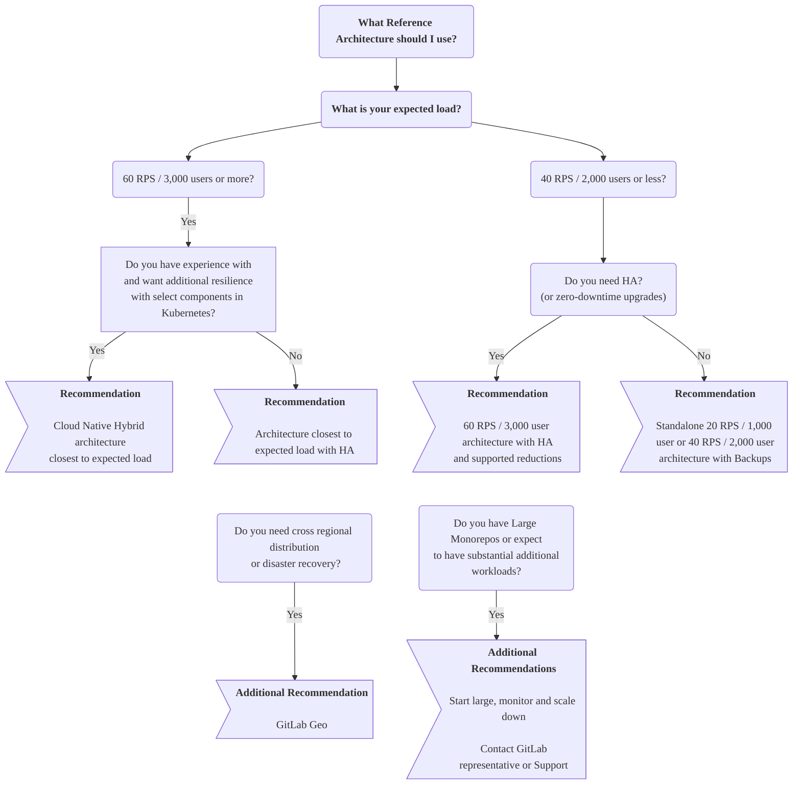



- Tier: Free, Premium, Ultimate
- Offering: GitLab Self-Managed



The GitLab reference architectures are validated, production-ready environment designs for deploying GitLab at scale. Each architecture provides detailed specifications that you can use or adapt based on your requirements.

## Before you start

First, consider whether GitLab Self-Managed is the right choice for you and your requirements.

Running any application in production is complex, and the same applies for GitLab. While we aim to make this as smooth as possible, there are still the general complexities based on your design. Typically, you have to manage all aspects such as hardware, operating systems, networking, storage, security, GitLab itself, and more. This includes both the initial setup of the environment and the longer term maintenance.

You must have a working knowledge of running and maintaining applications in production if you decide to go down this route. If you aren't in this position, our [Professional Services](https://about.gitlab.com/services/#implementation-services) team offers implementation services. Those who want a more managed solution long term, can explore our other offerings such as [GitLab SaaS](../../subscriptions/manage_users_and_seats.md#gitlabcom-billing-and-usage) or [GitLab Dedicated](../../subscriptions/gitlab_dedicated/_index.md).

If you are considering using the GitLab Self-Managed approach, we encourage you to read through this page in full, specifically the following sections:

- [Deciding which architecture to start with](#deciding-which-architecture-to-start-with)
- [Large monorepos](#large-monorepos)
- [Additional workloads](#additional-workloads)
- [Monitoring and adjusting your environment](#monitoring)

## Deciding which architecture to start with

The reference architectures are designed to strike a balance between three important factors: performance, resilience, and cost. They provide validated starting points for deploying GitLab at scale based on typical workload patterns. While they make initial deployment easier, most environments benefit from tuning based on actual usage patterns that emerge through [monitoring](#monitoring). Selecting an appropriate starting point is important, but expect to adjust based on your specific workload characteristics.

As a general guide, the more performant or resilient you want your environment to be, the more complex it is.

This section explains the things to consider when picking a reference architecture.

### Expected load

The right architecture size depends primarily on your environment's expected peak load. Requests per second (RPS) is the primary metric for sizing a GitLab infrastructure, but other factors can also apply.

For comprehensive RPS analysis and data-driven sizing decisions, see [reference architecture sizing](sizing.md), which provides:

- Detailed PromQL queries for extracting peak and sustained RPS metrics
- Workload pattern analysis and RPS composition guidance to identify component-specific adjustments
- Assessment methodology for monorepos, network usage, and growth planning

For quick RPS estimation, some potential options include:

- [Prometheus](../monitoring/prometheus/_index.md#sample-prometheus-queries) queries, such as:

  ```prometheus
  sum(irate(gitlab_transaction_duration_seconds_count{controller!~'HealthController|MetricsController'}[1m])) by (controller, action)
  ```

- [GitLab RPS Analyzer](https://gitlab.com/gitlab-org/professional-services-automation/tools/utilities/gitlab-rps-analyzer#gitlab-rps-analyzer).
- Other monitoring solutions.
- Load balancer statistics.

If you can't determine your RPS, user count equivalents are provided for Linux package and Cloud Native Hybrid architectures as an alternative sizing method. This count is mapped to typical RPS values, considering both manual and automated usage.

## Available reference architectures

The following reference architectures are available as recommended starting points for your environment.

> [!note]
> Each architecture is designed to be [scalable](#scaling-an-environment). They can be adjusted accordingly based on your workload, upwards or downwards. For example, some known heavy scenarios such as using [large monorepos](#large-monorepos) or notable [additional workloads](#additional-workloads).

### Linux package (Omnibus)

Linux package-based reference architectures deploy all GitLab components on virtual machines with the package. Select components (PostgreSQL, Redis, Object Storage) can optionally use cloud provider services.

The following RPS targets reflect typical workload composition. For atypical workloads, see [Understanding RPS composition](sizing.md#understanding-rps-composition-and-workload-patterns).

| Size                         | API RPS | Web RPS | Git (Pull) RPS | Git (Push) RPS |
|------------------------------|---------|---------|----------------|----------------|
| [1,000 users](1k_users.md)   | 20      | 2       | 2              | 1              |
| [2,000 users](2k_users.md)   | 40      | 4       | 4              | 1              |
| [3,000 users](3k_users.md)   | 60      | 6       | 6              | 1              |
| [5,000 users](5k_users.md)   | 100     | 10      | 10             | 2              |
| [10,000 users](10k_users.md) | 200     | 20      | 20             | 4              |
| [25,000 users](25k_users.md) | 500     | 50      | 50             | 10             |
| [50,000 users](50k_users.md) | 1000    | 100     | 100            | 20             |

### Cloud Native Hybrid

Cloud Native Hybrid reference architectures deploy select stateless components (Webservice, Sidekiq) in Kubernetes using Helm Charts, while select components remain on virtual machines or use cloud provider services (PostgreSQL, Redis, Object Storage).

| Size                                                                                                 | API RPS | Web RPS | Git (Pull) RPS | Git (Push) RPS |
|------------------------------------------------------------------------------------------------------|---------|---------|----------------|----------------|
| [2,000 users](2k_users.md#cloud-native-hybrid-reference-architecture-with-helm-charts-alternative)   | 40      | 4       | 4              | 1              |
| [3,000 users](3k_users.md#cloud-native-hybrid-reference-architecture-with-helm-charts-alternative)   | 60      | 6       | 6              | 1              |
| [5,000 users](5k_users.md#cloud-native-hybrid-reference-architecture-with-helm-charts-alternative)   | 100     | 10      | 10             | 2              |
| [10,000 users](10k_users.md#cloud-native-hybrid-reference-architecture-with-helm-charts-alternative) | 200     | 20      | 20             | 4              |
| [25,000 users](25k_users.md#cloud-native-hybrid-reference-architecture-with-helm-charts-alternative) | 500     | 50      | 50             | 10             |
| [50,000 users](50k_users.md#cloud-native-hybrid-reference-architecture-with-helm-charts-alternative) | 1000    | 100     | 100            | 20             |

### Cloud Native First (Beta)



- Tier: Free, Premium, Ultimate
- Offering: GitLab Self-Managed
- Status: Beta



Cloud Native First architectures are our next generation of architectures that target modern deployment methods with four standardized sizes (S/M/L/XL) based on workload characteristics. These architectures deploy all GitLab components in Kubernetes, while PostgreSQL, Redis, and Object Storage use external third-party solutions including managed services or on-premises options.

These architectures provide reduced operational overhead, simplified deployment, and enhanced resilience through Kubernetes orchestration.

| Size | Target RPS | Workload Characteristics |
|------|------------|--------------------------|
| Small (S) | ≤100 RPS | Light overall load, not suitable for active monorepos |
| Medium (M) | ≤200 RPS | Moderate load, supports lightly-used monorepos |
| Large (L) | ≤500 RPS | Heavy load, handles moderately-used monorepos |
| Extra Large (XL) | ≤1000 RPS | Intensive load, designed for heavily-used monorepos |

For more information, see [Cloud Native First reference architectures](cloud_native_first.md).

### If in doubt, start large, monitor, and then scale down

If you're uncertain about the required environment size, consider starting with a larger size, [monitoring](#monitoring) it, and then [scaling down](#scaling-an-environment) accordingly if the metrics support your situation.

Starting large and then scaling down is a prudent approach when:

- You can't determine RPS
- The environment load could be atypically higher than expected
- You have [large monorepos](#large-monorepos) or notable [additional workloads](#additional-workloads)

For example, if you have 3,000 users but also know that there's automation at play that would significantly increase the concurrent load, then you could start with a 100 RPS / 5k User class environment, monitor it, and if the metrics support it, scale down all components at once, or one by one.

### Standalone (non-HA)

For environments serving 2,000 or fewer users, it's generally recommended to follow a standalone approach by deploying a non-HA, single, or multi-node environment. With this approach, you can employ strategies such as [automated backups](../backup_restore/backup_gitlab.md#configuring-cron-to-make-daily-backups) for recovery. These strategies provide a good level of recovery time objective (RTO) or recovery point objective (RPO) while avoiding the complexities that come with HA.

With standalone setups, especially single node environments, various options are available for [installation](../../install/_index.md) and management. The options include [the ability to deploy directly by using select cloud provider marketplaces](https://page.gitlab.com/cloud-partner-marketplaces.html) that reduce the complexity a little further.

### High Availability (HA)

High Availability ensures every component in the GitLab setup can handle failures through various mechanisms. However, to achieve this is complex, and the environments required can be sizable.

For environments serving 3,000 or more users, we generally recommend using an HA strategy. At this level, outages have a bigger impact against more users. All the architectures in this range have HA built in by design for this reason.

#### Do you need High Availability (HA)?

As mentioned previously, achieving HA comes at a cost. The environment requirements are sizable as each component needs to be multiplied, which comes with additional actual and maintenance costs.

For a lot of our customers with fewer than 3,000 users, we've found that a backup strategy is sufficient and even preferable. While this does have a slower recovery time, it also means you have a much smaller architecture and less maintenance costs as a result.

As a general guideline, employ HA only in the following scenarios:

- When you have 3,000 or more users.
- When GitLab being down would critically impact your workflow.

#### Scaled-down High Availability (HA) approach

If you still need HA for fewer users, you can achieve it with an adjusted [3K architecture](3k_users.md#supported-modifications-for-lower-user-counts-ha).

#### Zero-downtime upgrades

[Zero-downtime upgrades](../../update/zero_downtime.md) are available for standard environments with HA (Cloud Native Hybrid is [not supported](https://gitlab.com/groups/gitlab-org/cloud-native/-/epics/52)). This allows for an environment to stay up during an upgrade. However, this process is more complex as a result and has some limitations as detailed in the documentation.

When going through this process, it's worth noting that there may still be brief moments of downtime when the HA mechanisms take effect.

In most cases, the downtime required for doing an upgrade shouldn't be substantial. Use this approach only if it's a key requirement for you.

### GitLab Geo (Cross Regional Distribution / Disaster Recovery)

With [GitLab Geo](../geo/_index.md), you can achieve distributed environments in
different regions with a full Disaster Recovery (DR) setup in place. GitLab Geo
requires at least two separate environments:

- One primary site.
- One or more secondary sites that serve as replicas.

If the primary site becomes unavailable, you can fail over to one of the secondary sites.

> [!note]
> Use this **advanced and complex** setup only if DR is
> a key requirement for your environment. You must also make additional decisions
> on how each site is configured. For example, if each secondary site would be the
> same architecture as the primary or if each site is configured for HA.

### Large monorepos / Additional workloads

[Large monorepos](#large-monorepos) or significant [additional workloads](#additional-workloads) can affect the performance of the environment notably. Some adjustments may be required depending on the context.

For comprehensive analysis of these factors, see [reference architecture sizing](sizing.md), which provides:

- Detailed assessment methodology for monorepo impacts on infrastructure.
- Component-specific scaling recommendations for different workload patterns.
- Network bandwidth analysis for heavy data transfer scenarios.

If this situation applies to you, reach out to your GitLab representative or our [Support team](https://about.gitlab.com/support/)
for further guidance.

### Cloud provider services

For all the previously described strategies, you can run select GitLab components on equivalent cloud provider services such as the PostgreSQL database or Redis.

For more information, see the [recommended cloud providers and services](#recommended-cloud-providers-and-services).

### Decision Tree

Read through the guidance documented previously in full first before you refer to the following decision tree.



> [!note]
> The decision tree above reflects production-ready architectures. For fully Kubernetes-native deployments including Gitaly, see [Cloud Native First (Beta)](cloud_native_first.md), which is currently in Beta and not yet recommended for production use.

## Requirements

Before implementing a reference architecture, see the following requirements and guidance.

### Supported machine types

The architectures are designed to be flexible in terms of machine type selection while ensuring consistent performance. While we provide specific machine type examples in each reference architecture, these are not intended to be prescriptive defaults.

You can use any machine types that meet or exceed the specified requirements for each component, such as:

- Newer generation machine types (like GCP `n2` series or AWS `m6` series)
- Different architectures like ARM-based instances (such as AWS Graviton)
- Alternative machine type families that better match your specific workload characteristics (such as higher network bandwidth)

This guidance is also applicable for any Cloud Provider services such as AWS RDS.

> [!note]
> Any "burstable" instance types are not recommended due to inconsistent performance.

For details about what machine types we test against and how, refer to [validation and test results](#validation-and-test-results).

### Supported disk types

Most standard disk types are expected to work for GitLab. However, be aware of the following specific call-outs:

- Gitaly has certain [disk requirements](../gitaly/_index.md#disk-requirements) for Gitaly storages.
- We don't recommend the use of any disk types that are "burstable" due to inconsistent performance.

Other disk types are expected to work with GitLab. Choose based on your requirements such as durability or cost.

### Supported infrastructure

GitLab should run on most infrastructures such as reputable cloud providers (AWS, GCP, Azure) and
their services, or self-managed (ESXi) that meet both:

- The specifications detailed in each architecture.
- Any requirements in this section.

However, this does not guarantee compatibility with every potential permutation.

See [Recommended cloud providers and services](#recommended-cloud-providers-and-services) for more information.

### Networking (High Availability)

Below are the network requirements for running GitLab in a High Availability fashion.

#### Network latency

Network latency should be as low as possible to allow for synchronous replication across the GitLab application, such as database replication. Generally this should be lower than 5 ms.

#### Availability zones (Cloud Providers)

Deploying across availability zones is supported and generally recommended for additional resilience. You should use an odd number of zones to align with GitLab application requirements, as some components use an odd number of nodes for quorum voting.

#### Data centers (Self Hosted)

Deploying across multiple self-hosted data centers is possible but requires careful consideration. This requires synchronous capable latency between centers, robust redundant network links to prevent split-brain scenarios, all centers located in the same geographic region, and deployment across an odd number of centers for proper quorum voting (like [availability zones](#availability-zones-cloud-providers)).

> [!warning]
> It may not be possible for GitLab Support to assist with infrastructure-related issues stemming from multi-data center deployments.
> Choosing to deploy across centers is generally at your own risk.
> Additionally, it is not supported to deploy a single [GitLab environment across different regions](#deploying-one-environment-over-multiple-regions).
> Data centers should be in the same region.

### Large Monorepos

The architectures were tested with repositories of varying sizes that follow best practices.

However, [large monorepos](../../user/project/repository/monorepos/_index.md) (several gigabytes or more) can significantly impact the performance of Git and in turn the environment itself.
Their presence and how they are used can put a significant strain on the entire system from Gitaly to the underlying infrastructure.

The performance implications are largely software in nature. Additional hardware resources lead to diminishing returns.

> [!warning]
> If this applies to you, we strongly recommend you follow the linked documentation and reach out to your GitLab representative or our [Support team](https://about.gitlab.com/support/) for further guidance.

Large monorepos come with notable cost. If you have such a repository,
follow these guidance to ensure good performance and to keep costs in check:

- [Optimize the large monorepo](../../user/project/repository/monorepos/_index.md). Using features such as
  [LFS](../../user/project/repository/monorepos/_index.md#use-git-lfs-for-large-binary-files) to not store binaries, and other approaches for reducing repository size, can
  dramatically improve performance and reduce costs.
- Depending on the monorepo, increased environment specifications may be required to compensate. Gitaly might require additional resources along with Praefect, GitLab Rails, and Load Balancers. This depends on the monorepo itself and its usage.
- When the monorepo is significantly large (20 gigabytes or more), further additional strategies may be required such as even further increased specifications or in some cases, a separate Gitaly backend for the monorepo alone.
- Network and disk bandwidth is another potential consideration with large monorepos. In very heavy cases, bandwidth saturation is possible if there's a high amount of concurrent clones (such as with CI). [Reduce full clones wherever possible](../../user/project/repository/monorepos/_index.md#reduce-concurrent-clones-in-cicd) in this scenario. Otherwise, additional environment specifications may be required to increase bandwidth. This differs based on cloud providers.

### Additional workloads

These architectures have been [designed and tested](#validation-and-test-results) for standard GitLab
setups based on real data.

However, additional workloads can multiply the impact of operations by triggering follow-up actions.
You might have to adjust the suggested specifications to compensate if you use:

- Security software on the nodes.
- Hundreds of concurrent CI jobs for [large repositories](../../user/project/repository/monorepos/_index.md).
- Custom scripts that [run at high frequency](../logs/log_parsing.md#print-top-api-user-agents).
- [Integrations](../../integration/_index.md) in many large projects.
- [Server hooks](../server_hooks.md).
- [System hooks](../system_hooks.md).

Generally, you should have robust monitoring in place to measure the impact of any additional workloads to
inform any changes needed to be made. Reach out to your GitLab representative or our [Support team](https://about.gitlab.com/support/)
for further guidance.

### Load Balancers

The architectures make use of up to two load balancers depending on the class:

- External load balancer - Serves traffic to any external facing components, primarily Rails.
- Internal load balancer - Serves traffic to select internal components that are deployed in an HA fashion such as Praefect or PgBouncer.

The specifics on which load balancer to use, or its exact configuration is beyond the scope of GitLab documentation. The most common options
are to set up load balancers on machine nodes or to use a service such as one offered by cloud providers. If deploying a Cloud Native Hybrid environment, the charts can handle the external load balancer setup by using Kubernetes Ingress.

Each architecture class includes a recommended base machine size to deploy directly on machines. However, they may need adjustment based on factors such as the chosen load balancer and expected workload. Of note machines can have varying [network bandwidth](#network-bandwidth) that should also be taken into consideration.

The following sections provide additional guidance for load balancers.

#### Balancing algorithm

To ensure equal spread of calls to the nodes and good performance, use a least-connection-based load balancing algorithm or equivalent wherever possible.

We don't recommend the use of round-robin algorithms as they are known to not spread connections equally in practice.

#### Network Bandwidth

The total network bandwidth available to a load balancer when deployed on a machine can vary notably across cloud providers. Some cloud providers, like [AWS](https://docs.aws.amazon.com/AWSEC2/latest/UserGuide/ec2-instance-network-bandwidth.html), may operate on a burst system with credits to determine the bandwidth at any time.

The required network bandwidth for your load balancers depends on factors such as data shape and workload. The recommended base sizes for each architecture class have been selected based on real data. However, in some scenarios such as consistent clones of [large monorepos](#large-monorepos), heavy usage of [GitLab Container Registry](../../user/packages/container_registry/_index.md), large CI artifacts, or any workloads involving frequent transfer of large files, you might have to adjust the sizes accordingly.

### No swap

Swap is not recommended in the reference architectures. It's a failsafe that impacts performance greatly. The
architectures are designed to have enough memory in most cases to avoid the need for swap.

### Praefect PostgreSQL

[Praefect requires its own database server](../gitaly/praefect/configure.md#postgresql). To achieve full HA, a third-party PostgreSQL database solution is required.

We hope to offer a built-in solution for these restrictions in the future. In the meantime, a non-HA PostgreSQL server
can be set up using the Linux package as the specifications reflect. For more details, see the following issues:

- [`omnibus-gitlab#7292`](https://gitlab.com/gitlab-org/omnibus-gitlab/-/issues/7292).
- [`gitaly#3398`](https://gitlab.com/gitlab-org/gitaly/-/issues/3398).

## Recommended cloud providers and services

> [!note]
> The following lists are non-exhaustive. Other cloud providers not listed
> here may work with the same specifications, but they have not been validated.
> For the cloud provider services not listed here,
> use caution because each implementation can be notably different.
> Test thoroughly before using them in production.

The following architectures are recommended for the following cloud providers based on testing and real life usage:

| Reference Architecture | GCP         | AWS         | Azure                    | Bare Metal  |
|------------------------|-------------|-------------|--------------------------|-------------|
| [Linux package](#linux-package-omnibus)          |  |  |  <sup>1</sup> |  |
| [Cloud Native Hybrid](#cloud-native-hybrid)    |  |  |                          |             |
| [Cloud Native First](cloud_native_first.md) (Beta) |  |  |  |  |

Additionally, the following cloud provider services are recommended for use as part of the architectures:

| Cloud Service  | GCP                                                    | AWS                                                | Azure                                                                                                   | Bare Metal               |
|----------------|--------------------------------------------------------|----------------------------------------------------|---------------------------------------------------------------------------------------------------------|--------------------------|
| Object Storage | [Cloud Storage](https://cloud.google.com/storage)      | [S3](https://aws.amazon.com/s3/)                   | [Azure Blob Storage](https://azure.microsoft.com/en-gb/products/storage/blobs)                          | [MinIO](https://min.io/) |
| Database       | [Cloud SQL](https://cloud.google.com/sql) <sup>2</sup> | [RDS](https://aws.amazon.com/rds/)                 | [Azure Database for PostgreSQL Flexible Server](https://azure.microsoft.com/en-gb/products/postgresql/) |                          |
| Redis          | [Memorystore](https://cloud.google.com/memorystore)    | [ElastiCache](https://aws.amazon.com/elasticache/) | [Azure Cache for Redis (Premium)](https://azure.microsoft.com/en-gb/products/cache)                     |                          |

<!-- Disable ordered list rule https://github.com/DavidAnson/markdownlint/blob/main/doc/Rules.md#md029---ordered-list-item-prefix -->
<!-- markdownlint-disable MD029 -->
1. To ensure good performance, deploy the [Premium tier of Azure Cache for Redis](https://learn.microsoft.com/en-us/azure/azure-cache-for-redis/cache-overview#service-tiers).
2. For optimal performance, especially in larger environments (500 RPS / 25k users or higher),
   use the [Enterprise Plus edition](https://cloud.google.com/sql/docs/editions-intro) for GCP Cloud SQL.
   You might have to adjust the maximum connections higher than the service's defaults, depending on your workload.
<!-- markdownlint-enable MD029 -->

### Best practices for the database services

Instead of the Linux package-bundled PostgreSQL, PgBouncer, and Consul service discovery components, you can use a
[third-party external service for PostgreSQL](../postgresql/external.md).

Use a reputable provider that runs a [supported PostgreSQL version](../../install/requirements.md#postgresql). These services are known to work well:

- [Google Cloud SQL](https://cloud.google.com/sql/docs/postgres/high-availability#normal).
- [Amazon RDS](https://aws.amazon.com/rds/).

#### Configuration considerations

Consider the following when using external database services:

- For optimal performance, enable [database load balancing](../postgresql/database_load_balancing.md) with read replicas. Match the node counts to those used in standard Linux package deployments. This approach is particularly important for larger environments (more than 200 requests per second or 10,000+ users).
- High availability node requirements might vary by service and differ from Linux package installations.
- For [GitLab Geo](../geo/_index.md), ensure the service supports cross-region replication.

#### Connection management

For optimal connection handling with external database services:

- Use [database load balancing](../postgresql/database_load_balancing.md) to distribute connections across read replicas.
- Tune PostgreSQL connection count configuration for your environment size and workload. Monitor and adjust based on performance.
- If additional connection pooling is required, deploy your own PgBouncer. Other third-party pooling solutions may work but have not been validated.

Cloud provider pooling services have the following limitations and are either incompatible or not recommended:

- [AWS RDS Proxy](https://aws.amazon.com/rds/proxy/): Not validated for use with GitLab.
- [Azure Database for PostgreSQL PgBouncer](https://learn.microsoft.com/en-us/azure/postgresql/connectivity/concepts-pgbouncer): Single-threaded architecture with limited observability. Can cause bottlenecks under heavy load.

> [!note]
> The GitLab-bundled PgBouncer only works with the bundled PostgreSQL and cannot be used with external database services.

#### Database service compatibility

The following database cloud provider services are either incompatible or not recommended:

- [Amazon Aurora](https://aws.amazon.com/rds/aurora/) is incompatible and not supported. For more details, see [14.4.0](https://archives.docs.gitlab.com/17.3/ee/update/versions/gitlab_14_changes/#1440).
- [Google AlloyDB](https://cloud.google.com/alloydb) and [Amazon RDS Multi-AZ DB cluster](https://docs.aws.amazon.com/AmazonRDS/latest/UserGuide/multi-az-db-clusters-concepts.html) are not tested and are not recommended. Both solutions are not expected to work with GitLab Geo.
  - [Amazon RDS Multi-AZ DB instance](https://docs.aws.amazon.com/AmazonRDS/latest/UserGuide/Concepts.MultiAZSingleStandby.html) is a separate product and is supported.

### Best practices for Redis services

Use an [external Redis service](../redis/replication_and_failover_external.md#redis-as-a-managed-service-in-a-cloud-provider) that runs a standard, performant, and supported version. The service must support:

- Redis Standalone (Primary x Replica) mode - Redis Cluster mode is specifically not supported
- High availability through replication
- The ability to set the [Redis eviction policy](../redis/replication_and_failover_external.md#setting-the-eviction-policy)

Redis is primarily single threaded. For environments targeting the 200 RPS / 10,000 users class or larger, separate the instances into cache & persistent data to achieve optimum performance.

> [!note]
> Serverless variants of Redis services are not supported at this time.

### Best practices for object storage

GitLab has been tested against [various object storage providers](../object_storage.md#supported-object-storage-providers) that are expected to work.

Use a reputable solution that has full S3 compatibility.

## Deviating from the suggested reference architectures

The further away you move from the reference architectures,
the harder it is to get support. With each deviation, you introduce
a layer of complexity that complicates troubleshooting potential
issues.

These architectures use the official Linux packages or [Helm Charts](https://docs.gitlab.com/charts/) to
install and configure the various components. The components are
installed on separate machines (virtualized or Bare Metal). Machine hardware
requirements listed in the "Configuration" columns on specific reference architecture pages. Equivalent VM standard sizes are listed
in the GCP/AWS/Azure columns of each [available architecture](#available-reference-architectures).

You can run GitLab components on Docker, including Docker Compose. Docker is well supported and provides consistent specifications across environments.
However, it is still an additional layer and might add some support complexities. For example, not being able to run `strace` in containers.

### Unsupported designs

While we try to have a good range of support for GitLab environment designs, certain approaches don't work effectively. The following sections detail these unsupported approaches.

#### Stateful components in Kubernetes

[Running stateful components in Kubernetes, such as Postgres and Redis, is not supported](https://docs.gitlab.com/charts/installation/#configure-the-helm-chart-to-use-external-stateful-data).

You can use other supported cloud provider services, unless specifically called out as unsupported.

Individual Gitaly nodes can be deployed on Kubernetes in [limited availability](../gitaly/kubernetes.md#timeline). This provides a non-HA solution where each repository is stored on a single node. For context on Gitaly deployment options and limitations, see [Gitaly on Kubernetes](../gitaly/kubernetes.md#context).

For reference architectures that deploy Gitaly in Kubernetes as part of a fully cloud-native setup, see [Cloud Native First reference architectures (Beta)](cloud_native_first.md).

#### Autoscaling of stateful nodes

As a general guidance, only stateless components of GitLab can be run in autoscaling groups, namely GitLab Rails
and Sidekiq. Other components that have state, such as Gitaly, are not supported in this fashion. For more information, see [issue 2997](https://gitlab.com/gitlab-org/gitaly/-/issues/2997).

This applies to stateful components such as Postgres and Redis. You can use other supported cloud provider services, unless specifically called out as unsupported.

[Cloud Native Hybrid setups](#cloud-native-hybrid) are generally preferred over autoscaling groups. Kubernetes better handles components that can only run on one node,
such as database migrations and [Mailroom](../incoming_email.md).

#### Deploying one environment over multiple regions

GitLab does not support deploying a single environment across multiple regions. These setups can result in significant issues, such as excessive network latency or split-brain scenarios if connectivity between regions fails.

Several GitLab components perform synchronous replication or require an odd number of nodes to function correctly, such as Consul, Redis Sentinel, and Praefect. Distributing these components across multiple regions with high latency can severely impact their functionality and the overall system performance.

This limitation applies to all potential GitLab environment setups, including Cloud Native Hybrid alternatives.

For deploying GitLab over multiple data centers or regions, we offer [GitLab Geo](../geo/_index.md) as a comprehensive solution.

## Validation and test results

GitLab
does regular smoke and performance tests for these architectures to ensure they
remain compliant.

### How we perform the tests

Testing is conducted using specific coded workloads derived from sample customer data, utilizing both the [GitLab Environment Toolkit (GET)](https://gitlab.com/gitlab-org/gitlab-environment-toolkit) for environment deployment with Terraform and Ansible, and the [GitLab Performance Tool (GPT)](https://gitlab.com/gitlab-org/quality/performance) for performance testing with k6.

Testing is performed primarily on GCP and AWS using their standard compute offerings (n1 series for GCP, m5 series for AWS) as baseline configurations. These machine types were selected as a lowest common denominator target to ensure broad compatibility. Using different or newer machine types that meet the CPU and memory requirements is fully supported - see [Supported Machine Types](#supported-machine-types) for more information. The architectures are expected to perform similarly on any hardware meeting the specifications, whether on other cloud providers or on-premises.

### Performance targets

Each reference architecture is tested against specific throughput targets based on real customer data. For every 1,000 users, we test:

- API: 20 RPS
- Web: 2 RPS
- Git (Pull): 2 RPS
- Git (Push): 0.4 RPS (rounded to the nearest integer)

The listed RPS targets were selected based on real customer data of total environmental loads corresponding to the user count, including CI and other workloads.

>>> [!note]

- These RPS breakdowns represent test targets based on typical workload patterns. Your actual workload composition may vary. For guidance on assessing your specific RPS composition and when adjustments are needed, see [Understanding RPS composition](sizing.md#understanding-rps-composition-and-workload-patterns).
- Network latency between components in test environments was observed at <5 ms but note this is not intended as a hard requirement.

>>>

### Test coverage and results

Testing is designed to be effective and provide good coverage for all reference architecture targets. Testing frequency varies by architecture type and size:

- Linux package environments: Daily or weekly of all sizes on GCP and AWS.
- Cloud Native environments: Weekly testing of select configurations on GCP and AWS.

Our testing also includes prototype variations of these architectures being explored for potential future inclusion. Test results are publicly available on the [Reference Architecture wiki](https://gitlab.com/gitlab-org/reference-architectures/-/wikis/Benchmarks/Latest).

## Maintaining a reference architecture environment

Maintaining a reference architecture environment is generally the same as any other GitLab environment.

In this section you can find links to documentation for relevant areas and specific architecture notes.

### Scaling an environment

The reference architectures are designed as validated starting points based on typical workload patterns, not final configurations. Most production deployments benefit from adjustments based on actual usage patterns that emerge through monitoring. The architectures are scalable throughout, and you can tune them iteratively as your workload characteristics become clear. Scaling can be done component-by-component or wholesale to the next architecture size when metrics indicate sustained resource pressure.

> [!note]
> If a component is continuously exhausting its given resources, reach out to our [Support team](https://about.gitlab.com/support/) before performing any significant scaling.

#### When to scale

Most deployments benefit from adjustments after observing actual workload patterns. Common scenarios that trigger scaling include:

**Resource sizing adjustments:**

- Increasing Webservice/Rails capacity for API-heavy workloads, particularly when API traffic exceeds 90% of total RPS (see [Understanding RPS composition](sizing.md#understanding-rps-composition-and-workload-patterns))
- Scaling Gitaly for monorepo-heavy environments or when repository sizes exceed 2 GB (see [Identify component adjustments](sizing.md#identify-component-adjustments))
- Adjusting Sidekiq workers for high CI/CD throughput or heavy background job processing

**Configuration tuning:**

- Setting Gitaly repository cgroup counts based on concurrent access patterns (see [Gitaly cgroups](../gitaly/cgroups.md))
- Configuring Sidekiq queue priorities for job processing optimization (see [processing specific job classes](../sidekiq/processing_specific_job_classes.md))

**Architecture refinements:**

- Adding PostgreSQL read replicas for read-heavy workloads
- Splitting Sidekiq into specialized pools for different job types
- Adjusting minimum instance counts for environments with sharp traffic spikes

These adjustments are typical and expected. Reference architectures provide the foundation, but monitoring your specific workload determines the optimal configuration. For systematic assessment of your environment, see [reference architecture sizing](sizing.md).

#### Scaling for GitLab Duo Agent Platform

GitLab Duo Agent Platform introduces additional infrastructure requirements beyond standard GitLab workloads. Agent Platform workflows execute through the GitLab Rails API, process jobs asynchronously through Sidekiq, and access repository data for code context and analysis.

Primary component impacts:

- **Rails (Webservice/Puma)** - Agent Platform API requests add to overall request load and WebSocket connections for streaming AI responses are managed by Workhorse
- **Sidekiq** - AI completion jobs and workflow state updates are processed as background jobs
- **PostgreSQL** - Agent workflow sessions and state data are stored in the database
- **Gitaly** - Repository file access for code context and commit operations for agent-generated changes

For environments planning Agent Platform adoption:

- Deploy the recommended architecture size based on your standard workload RPS
- Monitor Rails CPU utilization during initial rollout
- Monitor Sidekiq CPU utilization and job queue depths
- Monitor PostgreSQL for increased transaction rates from workflow state management
- Monitor Gitaly for increased file access patterns from code analysis features

For example Prometheus queries to monitor these components, see [sample Prometheus queries](../monitoring/prometheus/_index.md#sample-prometheus-queries).

If you observe sustained resource pressure, increase capacity by scaling the affected components. In Kubernetes deployments, increase pod replicas and node pool capacity. In Linux package deployments, scale horizontally by adding nodes or vertically by increasing node specifications.

Resource requirements vary based on Agent Platform usage intensity and specific features enabled. Reference architectures provide sufficient baseline capacity for typical Agent Platform usage patterns alongside standard GitLab workloads.

#### How to scale

For most components, vertical and horizontal scaling can be applied as usual. However, before doing so, be aware of the following caveats:

- When scaling Puma or Sidekiq vertically, the amount of workers must be adjusted to use the additional specifications. Puma worker counts are typically adjusted automatically, but Sidekiq may require [manual configuration](../sidekiq/extra_sidekiq_processes.md#start-multiple-processes).
- Redis and PgBouncer are primarily single threaded. If these components are seeing CPU exhaustion, they might have to be scaled out horizontally.
- In Linux package deployments, the Consul, Redis Sentinel, and Praefect components require an odd number of nodes for a voting quorum when deployed in HA form.
- Scaling certain components significantly can result in notable knock on effects that affect the performance of the environment. For more guidance, see [Scaling knock on effects](#scaling-knock-on-effects).

Conversely, if you have robust metrics in place that show the environment is over-provisioned, you can scale downwards.
You should take an iterative approach when scaling downwards, to ensure there are no issues.

#### Scaling knock on effects

In some cases, scaling a component significantly may result in knock on effects for downstream components, impacting performance. The architectures are designed with balance in mind to ensure components that depend on each other are congruent in terms of specifications. Notably scaling a component may result in additional throughput being passed to the other components it depends on. As a result, you could have to scale these other dependent components as well. To determine this, monitor the saturation metrics of all dependent services before scaling. If multiple interdependent components show saturation, they should be scaled together in a coordinated manner rather than sequentially, preventing bottlenecks from simply shifting between components.

> [!note]
> The architectures have been designed to have elasticity to accommodate an upstream component being scaled. However, reach out to our [Support team](https://about.gitlab.com/support/) before you make any significant changes to your environment to be safe.

The following components can impact others when they have been significantly scaled:

- Puma and Sidekiq - Notable scale ups of either Puma or Sidekiq workers will result in higher concurrent connections to the internal load balancer, PostgreSQL (via PgBouncer if present), Gitaly (via Praefect if present) and Redis.
  - Redis is primarily single-threaded. In some cases, you might have to split Redis into separate instances (for example, cache and persistent) if the increased throughput causes CPU exhaustion in a combined cluster.
  - PgBouncer is also single threaded but a scale out might result in a new pool being added that in turn might increase the total connections to Postgres. It's strongly recommended to only do this if you have experience in managing Postgres connections and to seek assistance if in doubt.
- Gitaly Cluster (Praefect)/PostgreSQL - A notable scale out of additional nodes can have a detrimental effect on the HA system and performance due to increased replication calls to the primary node.

#### Scaling from a non-HA to an HA architecture

In most cases, vertical scaling is only required to increase an environment's resources. However, if you are moving to an HA environment,
additional steps are required for the following components to switch over to their HA forms.

For more information, see the following documentation:

- [Redis to multi-node Redis w/ Redis Sentinel](../redis/replication_and_failover.md#switching-from-an-existing-single-machine-installation)
- [Postgres to multi-node Postgres w/ Consul + PgBouncer](../postgresql/moving.md)
- [Gitaly to Gitaly Cluster (Praefect)](../gitaly/praefect/_index.md#migrate-to-gitaly-cluster-praefect)

### Upgrades

Upgrading a reference architecture environment is the same as any other GitLab environment. For more information, see
[upgrade GitLab](../../update/_index.md). [Zero-downtime upgrades](#zero-downtime-upgrades) are also available.

> [!note]
> You should upgrade a reference architecture in the same order as you created it.

### Monitoring

You can monitor your infrastructure and [GitLab](../monitoring/_index.md) using various options. See the selected monitoring solution's documentation for more information.

> [!note]
> GitLab application is bundled with [Prometheus and various Prometheus compatible exporters](../monitoring/prometheus/_index.md) that could be hooked into your solution.

## Update history

You can find a full history of changes [on the GitLab project](https://gitlab.com/gitlab-org/gitlab/-/merge_requests?scope=all&state=merged&label_name%5B%5D=Reference%20Architecture&label_name%5B%5D=documentation).
