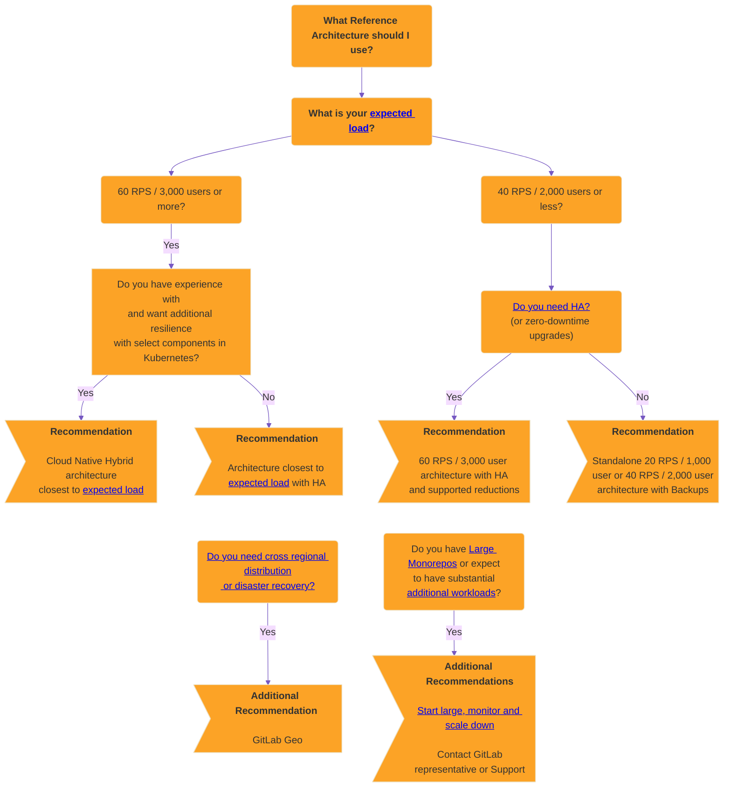

DETAILS:
**Tier:** Free, Premium, Ultimate
**Offering:** GitLab Self-Managed

The GitLab reference architectures provide recommended scalable and elastic environment sizes.

## Available reference architectures

The following reference architectures are available as recommended starting points for your environment.

The architectures are named in terms of peak load, based on user count or requests per second (RPS). RPS is calculated based on average real data.

NOTE:
Each architecture is designed to be [scalable and elastic](#scaling-an-environment). They can be adjusted accordingly based on your workload, upwards or downwards. For example, some known heavy scenarios such as using [large monorepos](#large-monorepos) or notable [additional workloads](#additional-workloads).

For details about what each reference architecture is tested against, see the **Testing Methodology** section of each page.

### GitLab package (Omnibus)

The following is the list of Linux package based reference architectures:

- [Up to 20 RPS or 1,000 users](1k_users.md) _API: 20 RPS, Web: 2 RPS, Git (Pull): 2 RPS, Git (Push): 1 RPS_
- [Up to 40 RPS or 2,000 users](2k_users.md) _API: 40 RPS, Web: 4 RPS, Git (Pull): 4 RPS, Git (Push): 1 RPS_
- [Up to 60 RPS or 3,000 users](3k_users.md) _API: 60 RPS, Web: 6 RPS, Git (Pull): 6 RPS, Git (Push): 1 RPS_
- [Up to 100 RPS or 5,000 users](5k_users.md) _API: 100 RPS, Web: 10 RPS, Git (Pull): 10 RPS, Git (Push): 2 RPS_
- [Up to 200 RPS or 10,000 users](10k_users.md) _API: 200 RPS, Web: 20 RPS, Git (Pull): 20 RPS, Git (Push): 4 RPS_
- [Up to 500 RPS or 25,000 users](25k_users.md) _API: 500 RPS, Web: 50 RPS, Git (Pull): 50 RPS, Git (Push): 10 RPS_
- [Up to 1000 RPS or 50,000 users](50k_users.md) _API: 1000 RPS, Web: 100 RPS, Git (Pull): 100 RPS, Git (Push): 20 RPS_

### Cloud native hybrid

The following is a list of Cloud Native Hybrid reference architectures, where select recommended components can be run in Kubernetes:

- [Up to 40 RPS or 2,000 users](2k_users.md#cloud-native-hybrid-reference-architecture-with-helm-charts-alternative) _API: 40 RPS, Web: 4 RPS, Git (Pull): 4 RPS, Git (Push): 1 RPS_
- [Up to 60 RPS or 3,000 users](3k_users.md#cloud-native-hybrid-reference-architecture-with-helm-charts-alternative) _API: 60 RPS, Web: 6 RPS, Git (Pull): 6 RPS, Git (Push): 1 RPS_
- [Up to 100 RPS or 5,000 users](5k_users.md#cloud-native-hybrid-reference-architecture-with-helm-charts-alternative) _API: 100 RPS, Web: 10 RPS, Git (Pull): 10 RPS, Git (Push): 2 RPS_
- [Up to 200 RPS or 10,000 users](10k_users.md#cloud-native-hybrid-reference-architecture-with-helm-charts-alternative) _API: 200 RPS, Web: 20 RPS, Git (Pull): 20 RPS, Git (Push): 4 RPS_
- [Up to 500 RPS or 25,000 users](25k_users.md#cloud-native-hybrid-reference-architecture-with-helm-charts-alternative) _API: 500 RPS, Web: 50 RPS, Git (Pull): 50 RPS, Git (Push): 10 RPS_
- [Up to 1000 RPS or 50,000 users](50k_users.md#cloud-native-hybrid-reference-architecture-with-helm-charts-alternative) _API: 1000 RPS, Web: 100 RPS, Git (Pull): 100 RPS, Git (Push): 20 RPS_

## Before you start

First, consider whether a self-managed approach is the right choice for you and your requirements.

Running any application in production is complex, and the same applies for GitLab. While we aim to make this as smooth as possible, there are still the general complexities based on your design. Typically you have to manage all aspects such as hardware, operating systems, networking, storage, security, GitLab itself, and more. This includes both the initial setup of the environment and the longer term maintenance.

You must have a working knowledge of running and maintaining applications in production if you decide to go down this route. If you aren't in this position, our [Professional Services](https://about.gitlab.com/services/#implementation-services) team offers implementation services. Those who want a more managed solution long term, can explore our other offerings such as [GitLab SaaS](../../subscriptions/gitlab_com/_index.md) or [GitLab Dedicated](../../subscriptions/gitlab_dedicated/_index.md).

If you are considering using the Self Managed approach, we encourage you to read through this page in full, specifically the following sections:

- [Deciding which architecture to use](#deciding-which-architecture-to-start-with)
- [Large monorepos](#large-monorepos)
- [Additional workloads](#additional-workloads)

## Deciding which architecture to start with

The reference architectures are designed to strike a balance between three important factors: performance, resilience, and cost. They are designed to make it easier to set up GitLab at scale. However, it can still be a challenge to know which one meets your requirements and where to start accordingly.

As a general guide, **the more performant and/or resilient you want your environment to be, the more complex it is**.

This section explains the things to consider when picking a reference architecture.

### Expected load (RPS or user count)

The right architecture size depends primarily on your environment's expected peak load. The most objective measure of this load is through peak Requests per Second (RPS) coming into the environment.

Each architecture is designed to handle specific RPS targets for different types of requests (API, Web, Git). These details are described in the **Testing Methodology** section on each page.

Finding out the RPS can depend notably on the specific environment setup and monitoring stack. Some potential options include:

- [GitLab Prometheus](../monitoring/prometheus/_index.md#sample-prometheus-queries) with queries like `sum(irate(gitlab_transaction_duration_seconds_count{controller!~'HealthController|MetricsController|'}[1m])) by (controller, action)`.
- [`get-rps` script](https://gitlab.com/gitlab-com/support/toolbox/dotfiles/-/blob/main/scripts/get-rps.rb?ref_type=heads) from GitLab Support.
- Other monitoring solutions.
- Load Balancer statistics.

If you can't determine your RPS, we provide an alternative sizing method based on equivalent User Count by Load Category. This count is mapped to typical RPS values, considering both manual and automated usage.

#### Initial sizing guide

To determine which architecture to pick for the expected load, see the following initial sizing guide table:

<table class="ra-table">
  <col>
  <tr>
    <th style="text-align: center" rowspan="2"> Load Category</th>
    <th style="text-align: center" colspan="4" scope="colgroup">Requests per Second (RPS)</th>
    <th rowspan="2" style="text-align: center"> Typical User Count</th>
    <th rowspan="2" style="text-align: center"> Reference Architecture</th>
  </tr>
  <tr>
    <th scope="col" style="text-align: center">API</th>
    <th scope="col" style="text-align: center">Web</th>
    <th scope="col" style="text-align: center">Git Pull</th>
    <th scope="col" style="text-align: center">Git Push</th>
  </tr>
  <tr>
    <td>X Small</td>
    <td>20</td>
    <td>2</td>
    <td>2</td>
    <td>1</td>
    <td>1,000</td>
    <th scope="row"><a href="https://docs.gitlab.com/ee/administration/reference_architectures/1k_users.html">Up to 20 RPS or 1,000 users</a></th>
  </tr>
  <tr>
    <td>Small</td>
    <td>40</td>
    <td>4</td>
    <td>4</td>
    <td>1</td>
    <td>2,000</td>
    <th scope="row"><a href="https://docs.gitlab.com/ee/administration/reference_architectures/2k_users.html">Up to 40 RPS or 2,000 users</a></th>
  </tr>
  <tr>
    <td>Medium</td>
    <td>60</td>
    <td>6</td>
    <td>6</td>
    <td>1</td>
    <td>3,000</td>
    <th scope="row"><a href="https://docs.gitlab.com/ee/administration/reference_architectures/3k_users.html">Up to 60 RPS or 3,000 users</a></th>
  </tr>
  <tr>
    <td>Large</td>
    <td>100</td>
    <td>10</td>
    <td>10</td>
    <td>2</td>
    <td>5,000</td>
    <th scope="row"><a href="https://docs.gitlab.com/ee/administration/reference_architectures/5k_users.html">Up to 100 RPS or 5,000 users</a></th>
  </tr>
  <tr>
    <td>X Large</td>
    <td>200</td>
    <td>20</td>
    <td>20</td>
    <td>4</td>
    <td>10,000</td>
    <th scope="row"><a href="https://docs.gitlab.com/ee/administration/reference_architectures/10k_users.html">Up to 200 RPS or 10,000 users</a></th>
  </tr>
  <tr>
    <td>2X Large</td>
    <td>500</td>
    <td>50</td>
    <td>50</td>
    <td>10</td>
    <td>25,000</td>
    <th scope="row"><a href="https://docs.gitlab.com/ee/administration/reference_architectures/25k_users.html">Up to 500 RPS or 25,000 users</a></th>
  </tr>
  <tr>
    <td>3X Large</td>
    <td>1000</td>
    <td>100</td>
    <td>100</td>
    <td>20</td>
    <td>50,000</td>
    <th scope="row"><a href="https://docs.gitlab.com/ee/administration/reference_architectures/50k_users.html">Up to 1000 RPS or 50,000 users</a></th>
  </tr>
</table>

NOTE:
Before you select an initial architecture, review this section thoroughly. Consider other factors such as High Availability (HA) or use of large monorepos, as they may impact the choice beyond just RPS or user count.

#### If in doubt, start large, monitor, and then scale down

If you're uncertain about the required environment size, consider starting with a larger size, [monitoring](#monitoring) it, and then [scaling down](#scaling-an-environment) accordingly if the metrics support your situation.

Starting large and then scaling down is a prudent approach when you can't determine RPS, or if the environment load could be atypically higher than expected, mostly due to [large monorepos](#large-monorepos) or notable [additional workloads](#additional-workloads).

For example, if you have 3,000 users but also know that there's automation at play that would significantly increase the concurrent load, then you could start with a 100 RPS / 5k User class environment, monitor it, and if the metrics support it, scale down all components at once or one by one.

### Standalone (non-HA)

For environments serving 2,000 or fewer users, we recommend a standalone approach by deploying a non-HA, single or multi-node environment. With this approach, you can employ strategies such as [automated backups](../backup_restore/backup_gitlab.md#configuring-cron-to-make-daily-backups) for recovery. These strategies provide a good level of recovery time objective (RTO) or recovery point objective (RPO) while avoiding the complexities that come with HA.

With standalone setups, especially single node environments, various options are available for [installation](../../install/_index.md) and management. The options include [the ability to deploy directly by using select cloud provider marketplaces](https://page.gitlab.com/cloud-partner-marketplaces.html) that reduce the complexity a little further.

### High Availability (HA)

High Availability ensures every component in the GitLab setup can handle failures through various mechanisms. However, to achieve this is complex, and the environments required can be sizable.

For environments serving 3,000 or more users, we generally recommend using an HA strategy. At this level, outages have a bigger impact against more users. All the architectures in this range have HA built in by design for this reason.

#### Do you need High Availability (HA)?

As mentioned previously, achieving HA comes at a cost. The environment requirements are sizable as each component needs to be multiplied, which comes with additional actual and maintenance costs.

For a lot of our customers with fewer than 3,000 users, we've found that a backup strategy is sufficient and even preferable. While this does have a slower recovery time, it also means you have a much smaller architecture and less maintenance costs as a result.

As a general guideline, employ HA only in the following scenarios:

- When you have 3,000 or more users.
- When GitLab being down would critically impact your workflow.

#### Scaled-down High Availability (HA) approach

If you still need HA for fewer users, you can achieve it with an adjusted [3K architecture](3k_users.md#supported-modifications-for-lower-user-counts-ha).

#### Zero-downtime upgrades

[Zero-downtime upgrades](../../update/zero_downtime.md) are available for standard environments with HA (Cloud Native Hybrid is [not supported](https://gitlab.com/groups/gitlab-org/cloud-native/-/epics/52)). This allows for an environment to stay up during an upgrade. However, this process is more complex as a result and has some limitations as detailed in the documentation.

When going through this process, it's worth noting that there may still be brief moments of downtime when the HA mechanisms take effect.

In most cases, the downtime required for doing an upgrade shouldn't be substantial. Use this approach only if it's a key requirement for you.

### Cloud Native Hybrid (Kubernetes HA)

As an additional layer of HA resilience, you can deploy select components in Kubernetes, known as a Cloud Native Hybrid reference architecture. For stability
reasons, stateful components such as Gitaly [cannot be deployed in Kubernetes](#stateful-components-in-kubernetes).

Cloud Native Hybrid is an alternative and more **advanced** setup compared to a standard reference architecture. Running services in Kubernetes is complex. **Use this setup** only if you have strong working knowledge and experience in Kubernetes.

### GitLab Geo (Cross Regional Distribution / Disaster Recovery)

With [GitLab Geo](../geo/_index.md), you can achieve distributed environments in
different regions with a full Disaster Recovery (DR) setup in place. GitLab Geo
requires at least two separate environments:

- One primary site.
- One or more secondary sites that serve as replicas.

If the primary site becomes unavailable, you can fail over to one of the secondary sites.

Use this **advanced and complex** setup only if DR is
a key requirement for your environment. You must also make additional decisions
on how each site is configured. For example, if each secondary site would be the
same architecture as the primary or if each site is configured for HA.

### Large monorepos / Additional workloads

[Large monorepos](#large-monorepos) or significant [additional workloads](#additional-workloads) can affect the performance of the environment notably. Some adjustments may be required depending on the context.

If this situation applies to you, reach out to your GitLab representative or our [Support team](https://about.gitlab.com/support/)
for further guidance.

### Cloud provider services

For all the previously described strategies, you can run select GitLab components on equivalent cloud provider services such as the PostgreSQL database or Redis.

For more information, see the [recommended cloud providers and services](#recommended-cloud-providers-and-services).

### Decision Tree

Read through the above guidance in full first before you refer to the following decision tree.

## Requirements

Before implementing a reference architecture, see the following requirements and guidance.

### Supported CPUs

The architectures are built and tested across various cloud providers, primarily GCP and AWS.
To ensure the widest range of compatibility, CPU targets are intentionally set to the lowest common denominator across these platforms:

- The [`n1` series](https://cloud.google.com/compute/docs/general-purpose-machines#n1_machines) for GCP.
- The [`m5` series](https://aws.amazon.com/ec2/instance-types/) for AWS.

Depending on other requirements such as memory or network bandwidth and cloud provider availability, different machine types are used accordingly throughout the architectures. We expect that the target CPUs above perform well.

If you want, you can select a newer machine type series and have improved performance as a result.

Additionally, ARM CPUs are supported for Linux package environments and for any [cloud provider services](#cloud-provider-services).

NOTE:
Any "burstable" instance types are not recommended due to inconsistent performance.

### Supported disk types

Most standard disk types are expected to work for GitLab. However, be aware of the following specific call-outs:

- [Gitaly](../gitaly/_index.md#disk-requirements) requires at least 8,000 input/output operations per second (IOPS) for read operations, and 2,000 IOPS for write operations.
- We don't recommend the use of any disk types that are "burstable" due to inconsistent performance.

Other disk types are expected to work with GitLab. Choose based on your requirements such as durability or cost.

### Supported infrastructure

GitLab should run on most infrastructures such as reputable cloud providers (AWS, GCP, Azure) and
their services, or self-managed (ESXi) that meet both:

- The specifications detailed in each architecture.
- Any requirements in this section.

However, this does not guarantee compatibility with every potential permutation.

See [Recommended cloud providers and services](#recommended-cloud-providers-and-services) for more information.

### Large Monorepos

The architectures were tested with repositories of varying sizes that follow best practices.

**However, [large monorepos](../../user/project/repository/monorepos/_index.md) (several gigabytes or more) can significantly impact the performance of Git and in turn the environment itself.**
Their presence and how they are used can put a significant strain on the entire system from Gitaly to the underlying infrastructure.

The performance implications are largely software in nature. Additional hardware resources lead to diminishing returns.

WARNING:
If this applies to you, we strongly recommend you follow the linked documentation and reach out to your GitLab representative or our [Support team](https://about.gitlab.com/support/) for further guidance.

Large monorepos come with notable cost. If you have such a repository,
follow these guidance to ensure good performance and to keep costs in check:

- [Optimize the large monorepo](../../user/project/repository/monorepos/_index.md#optimize-gitlab-settings). Using features such as
  [LFS](../../user/project/repository/monorepos/_index.md#use-lfs-for-large-blobs) to not store binaries, and other approaches for reducing repository size, can
  dramatically improve performance and reduce costs.
- Depending on the monorepo, increased environment specifications may be required to compensate. Gitaly might require additional resources along with Praefect, GitLab Rails, and Load Balancers. This depends on the monorepo itself and its usage.
- When the monorepo is significantly large (20 gigabytes or more), further additional strategies may be required such as even further increased specifications or in some cases, a separate Gitaly backend for the monorepo alone.
- Network and disk bandwidth is another potential consideration with large monorepos. In very heavy cases, bandwidth saturation is possible if there's a high amount of concurrent clones (such as with CI). [Reduce full clones wherever possible](../../user/project/repository/monorepos/_index.md#reduce-concurrent-clones-in-cicd) in this scenario. Otherwise, additional environment specifications may be required to increase bandwidth. This differs based on cloud providers.

### Additional workloads

These architectures have been [designed and tested](#validation-and-test-results) for standard GitLab
setups based on real data.

However, additional workloads can multiply the impact of operations by triggering follow-up actions.
You may need to adjust the suggested specifications to compensate if you use:

- Security software on the nodes.
- Hundreds of concurrent CI jobs for [large repositories](../../user/project/repository/monorepos/_index.md).
- Custom scripts that [run at high frequency](../logs/log_parsing.md#print-top-api-user-agents).
- [Integrations](../../integration/_index.md) in many large projects.
- [Server hooks](../server_hooks.md).
- [System hooks](../system_hooks.md).

Generally, you should have robust monitoring in place to measure the impact of any additional workloads to
inform any changes needed to be made. Reach out to your GitLab representative or our [Support team](https://about.gitlab.com/support/)
for further guidance.

### Load Balancers

The architectures make use of up to two load balancers depending on the class:

- External load balancer - Serves traffic to any external facing components, primarily Rails.
- Internal load balancer - Serves traffic to select internal components that are deployed in an HA fashion such as Praefect or PgBouncer.

The specifics on which load balancer to use, or its exact configuration is beyond the scope of GitLab documentation. The most common options
are to set up load balancers on machine nodes or to use a service such as one offered by cloud providers. If deploying a Cloud Native Hybrid environment, the charts can handle the external load balancer setup by using Kubernetes Ingress.

Each architecture class includes a recommended base machine size to deploy directly on machines. However, they may need adjustment based on factors such as the chosen load balancer and expected workload. Of note machines can have varying [network bandwidth](#network-bandwidth) that should also be taken into consideration.

The following sections provide additional guidance for load balancers.

#### Balancing algorithm

To ensure equal spread of calls to the nodes and good performance, use a least-connection-based load balancing algorithm or equivalent wherever possible.

We don't recommend the use of round-robin algorithms as they are known to not spread connections equally in practice.

#### Network Bandwidth

The total network bandwidth available to a load balancer when deployed on a machine can vary notably across cloud providers. Some cloud providers, like [AWS](https://docs.aws.amazon.com/AWSEC2/latest/UserGuide/ec2-instance-network-bandwidth.html), may operate on a burst system with credits to determine the bandwidth at any time.

The required network bandwidth for your load balancers depends on factors such as data shape and workload. The recommended base sizes for each architecture class have been selected based on real data. However, in some scenarios such as consistent clones of [large monorepos](#large-monorepos), the sizes may need to be adjusted accordingly.

### No swap

Swap is not recommended in the reference architectures. It's a failsafe that impacts performance greatly. The
architectures are designed to have enough memory in most cases to avoid the need for swap.

### Praefect PostgreSQL

[Praefect requires its own database server](../gitaly/praefect.md#postgresql). To achieve full HA, a third-party PostgreSQL database solution is required.

We hope to offer a built-in solution for these restrictions in the future. In the meantime, a non-HA PostgreSQL server
can be set up using the Linux package as the specifications reflect. For more details, see the following issues:

- [`omnibus-gitlab#7292`](https://gitlab.com/gitlab-org/omnibus-gitlab/-/issues/7292).
- [`gitaly#3398`](https://gitlab.com/gitlab-org/gitaly/-/issues/3398).

## Recommended cloud providers and services

NOTE:
The following lists are non-exhaustive. Other cloud providers not listed
here may work with the same specifications, but they have not been validated.
For the cloud provider services not listed here,
use caution, as each implementation can be notably different.
Test thoroughly before using them in production.

The following architectures are recommended for the following cloud providers based on testing and real life usage:

<table>
<thead>
  <tr>
    <th>Reference Architecture</th>
    <th>GCP</th>
    <th>AWS</th>
    <th>Azure</th>
    <th>Bare Metal</th>
  </tr>
</thead>
<tbody>
  <tr>
    <td>Linux package</td>
    <td>🟢</td>
    <td>🟢</td>
    <td>🟢1</td>
    <td>🟢</td>
  </tr>
  <tr>
    <td>Cloud Native Hybrid</td>
    <td>🟢</td>
    <td>🟢</td>
    <td></td>
    <td></td>
  </tr>
</tbody>
</table>

Additionally, the following cloud provider services are recommended for use as part of the architectures:

<table>
<thead>
  <tr>
    <th>Cloud Service</th>
    <th>GCP</th>
    <th>AWS</th>
    <th>Azure</th>
    <th>Bare Metal</th>
  </tr>
</thead>
<tbody>
  <tr>
    <td>Object Storage</td>
    <td>🟢 &nbsp; <a href="https://cloud.google.com/storage" target="_blank">Cloud Storage</a></td>
    <td>🟢 &nbsp; <a href="https://aws.amazon.com/s3/" target="_blank">S3</a></td>
    <td>🟢 &nbsp; <a href="https://azure.microsoft.com/en-gb/products/storage/blobs" target="_blank">Azure Blob Storage</a></td>
    <td>🟢 &nbsp; <a href="https://min.io/" target="_blank">MinIO</a></td>
  </tr>
  <tr>
    <td>Database</td>
    <td>🟢 &nbsp; <a href="https://cloud.google.com/sql" target="_blank" rel="noopener noreferrer">Cloud SQL1</a></td>
    <td>🟢 &nbsp; <a href="https://aws.amazon.com/rds/" target="_blank" rel="noopener noreferrer">RDS</a></td>
    <td>🟢 &nbsp; <a href="https://azure.microsoft.com/en-gb/products/postgresql/" target="_blank" rel="noopener noreferrer">Azure Database for PostgreSQL Flexible Server</a></td>
    <td></td>
  </tr>
  <tr>
    <td>Redis</td>
    <td>🟢 &nbsp; <a href="https://cloud.google.com/memorystore" target="_blank" rel="noopener noreferrer">Memorystore</a></td>
    <td>🟢 &nbsp; <a href="https://aws.amazon.com/elasticache/" target="_blank" rel="noopener noreferrer">ElastiCache</a></td>
      <td>🟢 &nbsp; <a href="https://azure.microsoft.com/en-gb/products/cache" target="_blank" rel="noopener noreferrer">Azure Cache for Redis (Premium)</a></td>
    <td></td>
  </tr>
</tbody>
</table>

<!-- Disable ordered list rule https://github.com/DavidAnson/markdownlint/blob/main/doc/Rules.md#md029---ordered-list-item-prefix -->
<!-- markdownlint-disable MD029 -->
1. For optimal performance, especially in larger environments (500 RPS / 25k users or higher), use the [Enterprise Plus edition](https://cloud.google.com/sql/docs/editions-intro) for GCP Cloud SQL. You might need to adjust the maximum connections higher than the service's defaults, depending on your workload.
2. To ensure good performance, deploy the [Premium tier of Azure Cache for Redis](https://learn.microsoft.com/en-us/azure/azure-cache-for-redis/cache-overview#service-tiers).
<!-- markdownlint-enable MD029 -->

### Best practices for the database services

Use an [external database service](../postgresql/external.md) that runs a standard, performant, and [supported PostgreSQL version](../../install/requirements.md#postgresql).

If you choose to use a third-party external service:

1. The HA Linux package PostgreSQL setup encompasses PostgreSQL, PgBouncer, and Consul. All of these components are no longer required when using a third party external service.
1. For optimal performance, enable [Database Load Balancing](../postgresql/database_load_balancing.md) with Read Replicas. Match the node counts to those used in standard
   Linux package deployments. This approach is particularly important for larger environments (more than 200 requests per second or 10,000+ users).
1. Database Connection Poolers are not required for this setup as the options vary per service. As a result, connection count configuration may need to be adjusted depending on the environment size. If Pooling is desired, a third party option needs to be explored. [Database Load Balancing](../postgresql/database_load_balancing.md)  can also be used to spread the load accordingly.

   Ensure that if a pooler is included in a Cloud Provider service, it can handle the total load without bottlenecks.
   For example, Azure Database for PostgreSQL flexible server can optionally deploy a PgBouncer pooler in front of the database. However, PgBouncer is single threaded, which may cause bottlenecks under heavy load. To mitigate this issue, you can use database load balancing to distribute the pooler across multiple nodes.
1. The number of nodes required for HA may vary depending on the service. The requirements for one deployment may vary from those for Linux package installations.

1. To use [GitLab Geo](../geo/_index.md), the service should support cross-region replication.

#### Unsupported database services

The following database cloud provider services are not recommended due to lack of support or known issues:

- [Amazon Aurora](https://aws.amazon.com/rds/aurora/) is incompatible and not supported. For more details, see [14.4.0](https://docs.gitlab.com/17.3/ee/update/versions/gitlab_14_changes.html#1440).
- [Azure Database for PostgreSQL Single Server](https://azure.microsoft.com/en-gb/products/postgresql/#overview) is not supported as the service is now deprecated and runs on an unsupported version of PostgreSQL. It also has notable performance and stability issues.
- [Google AlloyDB](https://cloud.google.com/alloydb) and [Amazon RDS Multi-AZ DB cluster](https://docs.aws.amazon.com/AmazonRDS/latest/UserGuide/multi-az-db-clusters-concepts.html) are not tested and are not recommended. Both solutions are not expected to work with GitLab Geo.
  - [Amazon RDS Multi-AZ DB instance](https://docs.aws.amazon.com/AmazonRDS/latest/UserGuide/Concepts.MultiAZSingleStandby.html) is a separate product and is supported.

### Best practices for the Redis services

Use an [external Redis service](../redis/replication_and_failover_external.md#redis-as-a-managed-service-in-a-cloud-provider) that runs a standard, performant, and supported version. Do not run the Redis service in [Cluster mode](../../install/requirements.md#redis) as it is unsupported by GitLab.

Redis is primarily single threaded. For environments targeting up to 200 RPS or 10,000 or more users, separate the instances into cache and persistent data to achieve optimum performance at this scale.

### Best practices for object storage

GitLab has been tested against [various object storage providers](../object_storage.md#supported-object-storage-providers) that are expected to work.

Use a reputable solution that has full S3 compatibility.

## Deviating from the suggested reference architectures

The further away you move from the reference architectures,
the harder it is to get support. With each deviation, you introduce
a layer of complexity that complicates troubleshooting potential
issues.

These architectures use the official Linux packages or [Helm Charts](https://docs.gitlab.com/charts/) to
install and configure the various components. The components are
installed on separate machines (virtualized or Bare Metal). Machine hardware
requirements listed in the **Configuration** column. Equivalent VM standard sizes are listed
in the GCP/AWS/Azure columns of each [available architecture](#available-reference-architectures).

You can run GitLab components on Docker, including Docker Compose. Docker is well supported and provides consistent specifications across environments.
However, it is still an additional layer and might add some support complexities. For example, not being able to run `strace` in containers.

### Unsupported designs

While we try to have a good range of support for GitLab environment designs, certain approaches don't work effectively. The following sections detail these unsupported approaches.

#### Stateful components in Kubernetes

[Running stateful components in Kubernetes, such as Gitaly Cluster, is not supported](https://docs.gitlab.com/charts/installation/#configure-the-helm-chart-to-use-external-stateful-data).

Gitaly Cluster is only supported on conventional virtual machines. Kubernetes strictly limits memory usage. However, the memory usage of Git is unpredictable, which
can cause sporadic out of memory (OOM) termination of Gitaly pods. The OOM termination leads to significant disruptions and potential data loss. Hence, Gitaly is not tested
or supported in Kubernetes. For more information, see [epic 6127](https://gitlab.com/groups/gitlab-org/-/epics/6127).

This applies to stateful components such as Postgres and Redis. You can use other supported cloud provider services, unless specifically called out as unsupported.

#### Autoscaling of stateful nodes

As a general guidance, only _stateless_ components of GitLab can be run in autoscaling groups, namely GitLab Rails
and Sidekiq. Other components that have state, such as Gitaly, are not supported in this fashion. For more information, see [issue 2997](https://gitlab.com/gitlab-org/gitaly/-/issues/2997).

This applies to stateful components such as Postgres and Redis. You can use other supported cloud provider services, unless specifically called out as unsupported.

[Cloud Native Hybrid setups](#cloud-native-hybrid) are generally preferred over autoscaling groups. Kubernetes better handles components that can only run on one node,
such as database migrations and [Mailroom](../incoming_email.md).

#### Deploying one environment over multiple data centers

GitLab doesn't support deploying a single environment across multiple data centers.
These setups can result in significant issues, such as network latency or split-brain
scenarios if a data center fails.

Several GitLab components require an odd number of nodes to function correctly,
such as Consul, Redis Sentinel, and Praefect. Splitting these components across
multiple data centers can negatively impact their functionality.

This limitation applies to all potential GitLab environment setups, including Cloud Native Hybrid alternatives.

For deploying GitLab over multiple data centers or regions, we offer [GitLab Geo](../geo/_index.md) as a comprehensive solution.

## Validation and test results

The [Test Platform team](https://handbook.gitlab.com/handbook/engineering/quality/)
does regular smoke and performance tests for these architectures to ensure they
remain compliant.

### Why we perform the tests

The Quality Department measures and improves the performance of GitLab. They create and validate architectures
to ensure reliable configurations for GitLab Self-Managed.

For more information, see our [handbook page](https://handbook.gitlab.com/handbook/engineering/infrastructure/test-platform/performance-and-scalability/).

### How we perform the tests

Testing occurs against all architectures and cloud providers in an automated and ad-hoc fashion. Two tools are used for testing:

- The [GitLab Environment Toolkit](https://gitlab.com/gitlab-org/gitlab-environment-toolkit) Terraform and Ansible scripts for building the environments.
- The [GitLab Performance Tool](https://gitlab.com/gitlab-org/quality/performance) for performance testing.

Network latency on the test environments between components on all cloud providers were measured at <5 ms. This an observation, not a recommendation.

We aim to have a _test smart_ approach where architectures tested have a good range and can also apply to others. Testing focuses on installing a 10k Linux package
on GCP. This approach serves as a reliable indicator for other architectures, cloud providers, and Cloud Native Hybrids.

The architectures are cross-platform. Everything runs on VMs through [the Linux package](https://docs.gitlab.com/omnibus/). Testing occurs primarily on GCP.
However, they perform similarly on hardware with equivalent specifications on other cloud providers or if run on-premises (bare-metal).

GitLab tests these architectures using the
[GitLab Performance Tool](https://gitlab.com/gitlab-org/quality/performance).
We use specific coded workloads based on sample customer data. Select the
[architecture](#available-reference-architectures) that matches your scale.

Each endpoint type is tested with the following number of RPS
per 1,000 users:

- API: 20 RPS
- Web: 2 RPS
- Git (Pull): 2 RPS
- Git (Push): 0.4 RPS (rounded to the nearest integer)

The above RPS targets were selected based on real customer data of total environmental loads corresponding to the user count, including CI and other workloads.

### How to interpret the results

NOTE:
Read our blog post on [how our QA team leverages GitLab performance testing tool](https://about.gitlab.com/blog/2020/02/18/how-were-building-up-performance-testing-of-gitlab/).

Testing is done publicly, and all results are shared.

The following table details the testing done against the architectures along with the frequency and results. Additional testing is continuously evaluated, and the table is updated accordingly.

<table class="ra-table">
  <col>
  <colgroup span="2"></colgroup>
  <colgroup span="2"></colgroup>
  <tr>
    <th rowspan="2"> Reference Architecture</th>
    <th style="text-align: center" colspan="2" scope="colgroup">GCP</th>
    <th style="text-align: center" colspan="2" scope="colgroup">AWS</th>
  </tr>
  <tr>
    <th scope="col">Linux package</th>
    <th scope="col">Cloud Native Hybrid</th>
    <th scope="col">Linux package</th>
    <th scope="col">Cloud Native Hybrid</th>
  </tr>
    <tr>
    <th scope="row"><a href="https://docs.gitlab.com/ee/administration/reference_architectures/1k_users.html">Up to 20 RPS or 1,000 users</a></th>
    <td><a href="https://gitlab.com/gitlab-org/quality/performance/-/wikis/Benchmarks/Latest/1k">Weekly</a></td>
    <td style="background-color:lightgrey"></td>
    <td style="background-color:lightgrey"></td>
    <td style="background-color:lightgrey"></td>
  </tr>
  <tr>
    <th scope="row"><a href="https://docs.gitlab.com/ee/administration/reference_architectures/2k_users.html">Up to 40 RPS or 2,000 users</a></th>
    <td><a href="https://gitlab.com/gitlab-org/quality/performance/-/wikis/Benchmarks/Latest/2k">Weekly</a></td>
    <td style="background-color:lightgrey"></td>
    <td style="background-color:lightgrey"></td>
    <td style="background-color:lightgrey"></td>
  </tr>
  <tr>
    <th scope="row"><a href="https://docs.gitlab.com/ee/administration/reference_architectures/3k_users.html">Up to 60 RPS or 3,000 users</a></th>
    <td><a href="https://gitlab.com/gitlab-org/quality/performance/-/wikis/Benchmarks/Latest/3k">Weekly</a></td>
    <td style="background-color:lightgrey"></td>
    <td style="background-color:lightgrey"></td>
    <td><a href="https://gitlab.com/gitlab-org/quality/performance/-/wikis/Benchmarks/Latest/3k_hybrid_aws_services">Weekly</a></td>
  </tr>
  <tr>
    <th scope="row"><a href="https://docs.gitlab.com/ee/administration/reference_architectures/5k_users.html">Up to 100 RPS or 5,000 users</a></th>
    <td><a href="https://gitlab.com/gitlab-org/quality/performance/-/wikis/Benchmarks/Latest/5k">Weekly</a></td>
    <td style="background-color:lightgrey"></td>
    <td style="background-color:lightgrey"></td>
    <td style="background-color:lightgrey"></td>
  </tr>
  <tr>
    <th scope="row"><a href="https://docs.gitlab.com/ee/administration/reference_architectures/10k_users.html">Up to 200 RPS or 10,000 users</a></th>
    <td><a href="https://gitlab.com/gitlab-org/quality/performance/-/wikis/Benchmarks/Latest/10k">Daily</a></td>
    <td>Weekly1</td>
    <td><a href="https://gitlab.com/gitlab-org/quality/performance/-/wikis/Benchmarks/Latest/10k_aws">Weekly</a></td>
    <td><a href="https://gitlab.com/gitlab-org/quality/performance/-/wikis/Benchmarks/Latest/10k_hybrid_aws_services">Weekly</a></td>
  </tr>
  <tr>
    <th scope="row"><a href="https://docs.gitlab.com/ee/administration/reference_architectures/25k_users.html">Up to 500 RPS or 25,000 users</a></th>
    <td><a href="https://gitlab.com/gitlab-org/quality/performance/-/wikis/Benchmarks/Latest/25k">Weekly</a></td>
    <td style="background-color:lightgrey"></td>
    <td style="background-color:lightgrey"></td>
    <td style="background-color:lightgrey"></td>
  </tr>
  <tr>
    <th scope="row"><a href="https://docs.gitlab.com/ee/administration/reference_architectures/50k_users.html">Up to 1000 RPS or 50,000 users</a></th>
    <td><a href="https://gitlab.com/gitlab-org/quality/performance/-/wikis/Benchmarks/Latest/50k">Weekly</a></td>
    <td style="background-color:lightgrey"></td>
    <td style="background-color:lightgrey"></td>
    <td style="background-color:lightgrey"></td>
  </tr>
</table>

<!-- Disable ordered list rule https://github.com/DavidAnson/markdownlint/blob/main/doc/Rules.md#md029---ordered-list-item-prefix -->
<!-- markdownlint-disable MD029 -->
1. Testing for GCP Cloud Native environments happen weekly but include unreleased features for testing purposes.
<!-- markdownlint-enable MD029 -->

## Cost calculator templates

The following table lists initial cost templates for the different architectures across GCP, AWS, and Azure. These costs were calculated using each cloud provider's official calculator.

However, be aware of the following caveats:

- The table list only a rough estimate compute templates for Linux package architectures.
- They do not take into account dynamic elements such as disk, network, or object storage, which can notably impact costs.
- Due to the nature of Cloud Native Hybrid, it's not possible to give a static cost calculation for that deployment.
- Committed use discounts apply if they are set as default in the cloud provider calculator.
- Bare metal costs are also not included here as they vary depending on each configuration.

For accurate estimate of costs for your environment, take the closest template and adjust it to match your specifications and expected usage.

<table class="ra-table">
  <col>
  <colgroup span="2"></colgroup>
  <colgroup span="2"></colgroup>
  <tr>
    <th rowspan="2"> Reference Architecture</th>
    <th style="text-align: center" scope="colgroup">GCP</th>
    <th style="text-align: center" scope="colgroup">AWS</th>
    <th style="text-align: center" scope="colgroup">Azure</th>
  </tr>
  <tr>
    <th scope="col">Linux package</th>
    <th scope="col">Linux package</th>
    <th scope="col">Linux package</th>
  </tr>
    <tr>
    <th scope="row"><a href="https://docs.gitlab.com/ee/administration/reference_architectures/1k_users.html">Up to 20 RPS or 1,000 users</a></th>
    <td><a href="https://cloud.google.com/products/calculator/estimate-preview/02846ea4-635b-422f-a636-a5eff9bf9a2f?hl=en">Calculated cost</a></td>
    <td><a href="https://calculator.aws/#/estimate?id=b51f178f4403b69a63f6eb33ea425f82de3bf249">Calculated cost</a></td>
    <td><a href="https://azure.microsoft.com/en-us/pricing/calculator/?shared-estimate=1adf30bef7e34ceba9efa97c4470417b">Calculated cost</a></td>
  </tr>
  <tr>
    <th scope="row"><a href="https://docs.gitlab.com/ee/administration/reference_architectures/2k_users.html">Up to 40 RPS or 2,000 users</a></th>
    <td><a href="https://cloud.google.com/products/calculator/estimate-preview/017fa74b-7b2c-4334-b537-5201d4fc2de4?hl=en">Calculated cost</a></td>
    <td><a href="https://calculator.aws/#/estimate?id=3b3e3b81953737132789591d3a5179521943f1c0">Calculated cost</a></td>
    <td><a href="https://azure.microsoft.com/en-us/pricing/calculator/?shared-estimate=25f66c35ba454bb98fb4034a8a50bb8c">Calculated cost</a></td>
  </tr>
  <tr>
    <th scope="row"><a href="https://docs.gitlab.com/ee/administration/reference_architectures/3k_users.html">Up to 60 RPS or 3,000 users</a></th>
    <td><a href="https://cloud.google.com/products/calculator/estimate-preview/bc5c06ca-6d6b-423f-a923-27bafa8ac3da?hl=en">Calculated cost</a></td>
    <td><a href="https://calculator.aws/#/estimate?id=7e94eb8712f6845fdeb05e61f459598a91dac3cb">Calculated cost</a></td>
    <td><a href="https://azure.microsoft.com/en-us/pricing/calculator/?shared-estimate=24ac11fd947a4985ae9c9a5142649ad3">Calculated cost</a></td>
  </tr>
  <tr>
    <th scope="row"><a href="https://docs.gitlab.com/ee/administration/reference_architectures/5k_users.html">Up to 100 RPS or 5,000 users</a></th>
    <td><a href="https://cloud.google.com/products/calculator/estimate-preview/ec788d9c-1377-4d03-b0e3-0f7950391a27?hl=en">Calculated cost</a></td>
    <td><a href="https://calculator.aws/#/estimate?id=ad4c9db623a214c92d780cd9dff33f444d62cf02">Calculated cost</a></td>
    <td><a href="https://azure.microsoft.com/en-us/pricing/calculator/?shared-estimate=bcf23017ddfd40649fdc885cacd08d0c">Calculated cost</a></td>
  </tr>
  <tr>
    <th scope="row"><a href="https://docs.gitlab.com/ee/administration/reference_architectures/10k_users.html">Up to 200 RPS or 10,000 users</a></th>
    <td><a href="https://cloud.google.com/products/calculator/estimate-preview/9ef6f849-833b-4f2f-911e-979f5a491366?hl=en">Calculated cost</a></td>
    <td><a href="https://calculator.aws/#/estimate?id=3e2970f919915a6337acea76a9f07655a1ecda4a">Calculated cost</a></td>
    <td><a href="https://azure.microsoft.com/en-us/pricing/calculator/?shared-estimate=5748068be4864af6a34efb1cde685fa1">Calculated cost</a></td>
  </tr>
  <tr>
    <th scope="row"><a href="https://docs.gitlab.com/ee/administration/reference_architectures/25k_users.html">Up to 500 RPS or 25,000 users</a></th>
    <td><a href="https://cloud.google.com/products/calculator/estimate-preview/6655e1d7-42ae-4f01-98cb-f3a29cf62a15?hl=en">Calculated cost</a></td>
    <td><a href="https://calculator.aws/#/estimate?id=32acaeaa93366110cd5fbf98a66a8a141db7adcb">Calculated cost</a></td>
    <td><a href="https://azure.microsoft.com/en-us/pricing/calculator/?shared-estimate=24f878f20ee64b5cb64de459d34c8128">Calculate cost</a></td>
  </tr>
  <tr>
    <th scope="row"><a href="https://docs.gitlab.com/ee/administration/reference_architectures/50k_users.html">Up to 1000 RPS or 50,000 users</a></th>
    <td><a href="https://cloud.google.com/products/calculator/estimate-preview/9128a9e9-25a2-459e-9480-edc0264d4b18?hl=en">Calculated cost</a></td>
    <td><a href="https://calculator.aws/#/estimate?id=5a0bba1338e3577d627ec97833dbc80ac9615562">Calculated cost</a></td>
    <td><a href="https://azure.microsoft.com/en-us/pricing/calculator/?shared-estimate=4dd065eea2194d70b44d6d897e81f460">Calculated cost</a></td>
  </tr>
</table>

## Maintaining a reference architecture environment

Maintaining a reference architecture environment is generally the same as any other GitLab environment.

In this section you can find links to documentation for relevant areas and specific architecture notes.

### Scaling an environment

The reference architectures are designed as a starting point, and are elastic and scalable throughout. You might want to adjust the environment for your specific needs after deployment for reasons such as additional performance capacity or reduced costs. This behavior is expected. Scaling can be done iteratively or wholesale to the next architecture size, if metrics suggest that a component is exhausted.

NOTE:
If a component is continuously exhausting its given resources, reach out to our [Support team](https://about.gitlab.com/support/) before performing any significant scaling.

For most components, vertical and horizontal scaling can be applied as usual. However, before doing so, be aware of the following caveats:

- When scaling Puma or Sidekiq vertically, the amount of workers must be adjusted to use the additional specifications. Puma is scaled automatically on the next reconfigure. However, you might have to [change Sidekiq configuration beforehand](../sidekiq/extra_sidekiq_processes.md#start-multiple-processes).
- Redis and PgBouncer are primarily single threaded. If these components are seeing CPU exhaustion, they may need to be scaled out horizontally.
- The Consul, Redis Sentinel, and Praefect components require an odd number of nodes for a voting quorum when deployed in HA form.
- Scaling certain components significantly can result in notable knock on effects that affect the performance of the environment. For more guidance, see [Scaling knock on effects](#scaling-knock-on-effects).

Conversely, if you have robust metrics in place that show the environment is over-provisioned, you can scale downwards.
You should take an iterative approach when scaling downwards, to ensure there are no issues.

#### Scaling knock on effects

In some cases, scaling a component significantly may result in knock on effects for downstream components, impacting performance. The architectures are designed with balance in mind to ensure components that depend on each other are congruent in terms of specifications. Notably scaling a component may result in additional throughput being passed to the other components it depends on. As a result, they may need to be scaled as well.

NOTE:
The architectures have been designed to have elasticity to accommodate an upstream component being scaled. However, reach out to our [Support team](https://about.gitlab.com/support/) before you make any significant changes to your environment to be safe.

The following components can impact others when they have been significantly scaled:

- Puma and Sidekiq - Notable scale ups of either Puma or Sidekiq workers will result in higher concurrent connections to the internal load balancer, PostgreSQL (via PgBouncer if present), Gitaly (via Praefect if present) and Redis respectively.
  - Redis is primarily single-threaded. In some cases, you may need to split Redis into separate instances (for example, cache and persistent) if the increased throughput causes CPU exhaustion in a combined cluster.
  - PgBouncer is also single threaded but a scale out might result in a new pool being added that in turn might increase the total connections to Postgres. It's strongly recommended to only do this if you have experience in managing Postgres connections and to seek assistance if in doubt.
- Gitaly Cluster / PostgreSQL - A notable scale out of additional nodes can have a detrimental effect on the HA system and performance due to increased replication calls to the primary node.

#### Scaling from a non-HA to an HA architecture

In most cases, vertical scaling is only required to increase an environment's resources. However, if you are moving to an HA environment,
additional steps are required for the following components to switch over to their HA forms.

For more information, see the following documentation:

- [Redis to multi-node Redis w/ Redis Sentinel](../redis/replication_and_failover.md#switching-from-an-existing-single-machine-installation)
- [Postgres to multi-node Postgres w/ Consul + PgBouncer](../postgresql/moving.md)
- [Gitaly to Gitaly Cluster w/ Praefect](../gitaly/_index.md#migrate-to-gitaly-cluster)

### Upgrades

Upgrading a reference architecture environment is same as any other GitLab environment.
The main [Upgrade GitLab](../../update/_index.md) section has detailed steps on how to approach this.
[Zero-downtime upgrades](#zero-downtime-upgrades) are also available.

NOTE:
You should upgrade a reference architecture in the same order as you created it.

### Monitoring

You can monitor your infrastructure and [GitLab](../monitoring/_index.md) using various options. See the selected monitoring solution's documentation for more information.

NOTE:
GitLab application is bundled with [Prometheus and various Prometheus compatible exporters](../monitoring/prometheus/_index.md) that could be hooked into your solution.

## Update history

The following is a history of notable updates for reference architectures (2021-01-01 onward, ascending order). We aim to update it at least once per quarter.

You can find a full history of changes [on the GitLab project](https://gitlab.com/gitlab-org/gitlab/-/merge_requests?scope=all&state=merged&label_name%5B%5D=Reference%20Architecture&label_name%5B%5D=documentation).

**2024:**

- [2024-12](https://gitlab.com/gitlab-org/gitlab/-/merge_requests/175854): Added _Start Large_ section as further guidance for choosing initial sizing.
- [2024-08](https://gitlab.com/gitlab-org/gitlab/-/merge_requests/164181): Updated Expected Load section with some more examples on how to calculate RPS.
- [2024-08](https://gitlab.com/gitlab-org/gitlab/-/merge_requests/163478): Updated Redis configuration on 40 RPS or 2k User page to have correct Redis configuration.
- [2024-08](https://gitlab.com/gitlab-org/gitlab/-/merge_requests/163506): Updated Sidekiq configuration for Prometheus in Monitoring node on 2k.
- [2024-08](https://gitlab.com/gitlab-org/gitlab/-/merge_requests/162144): Added Next Steps breadcrumb section to the pages to help discoverability of additional features.
- [2024-05](https://gitlab.com/gitlab-org/gitlab/-/merge_requests/153716): Updated the 60 RPS or 3k User and 100 RPS or 5k User pages to have latest Redis guidance on co-locating Redis Sentinel with Redis itself.
- [2024-05](https://gitlab.com/gitlab-org/gitlab/-/merge_requests/153579): Renamed `Cost to run` section to `Cost calculator templates` to better reflect the calculators are only a starting point and need to be adjusted with specific usage to give more accurate cost estimates.
- [2024-04](https://gitlab.com/gitlab-org/gitlab/-/merge_requests/149878): Updated recommended sizing for Webservice nodes for Cloud Native Hybrids on GCP. Also adjusted NGINX pod recommendation to be run on Webservice node pool as a DaemonSet.
- [2024-04](https://gitlab.com/gitlab-org/gitlab/-/merge_requests/149528): Updated 20 RPS / 1,000 User architecture specs to follow recommended memory target of 16 GB.
- [2024-04](https://gitlab.com/gitlab-org/gitlab/-/merge_requests/148313): Updated Reference Architecture titles to include RPS for further clarity and to help right sizing.
- [2024-02](https://gitlab.com/gitlab-org/gitlab/-/merge_requests/145436): Updated recommended sizing for Load Balancer nodes if deployed on VMs. Also added notes on network bandwidth considerations.
- [2024-02](https://gitlab.com/gitlab-org/gitlab/-/merge_requests/143539): Removed the Sidekiq Maximum Concurrency setting in examples as this is deprecated and no longer required to be set explicitly.
- [2024-02](https://gitlab.com/gitlab-org/gitlab/-/merge_requests/143539): Adjusted the Sidekiq recommendations on 2k to disable Sidekiq on Rails nodes and updated architecture diagram.
- [2024-01](https://gitlab.com/gitlab-org/gitlab/-/merge_requests/140465): Updated recommendations for Azure for all Reference Architecture sizes and latest cloud services.

**2023:**

- [2023-12-12](https://gitlab.com/gitlab-org/gitlab/-/merge_requests/139557): Updated notes on Load Balancers to be more reflective that any reputable offering is expected to work.
- [2023-11-03](https://gitlab.com/gitlab-org/gitlab/-/merge_requests/133457): Expanded details on what each Reference Architecture is designed for, the testing methodology used and added details on how to scale environments.
- [2023-11-03](https://gitlab.com/gitlab-org/gitlab/-/merge_requests/134632): Added expanded notes on disk types, object storage and monitoring.
- [2023-10-25](https://gitlab.com/gitlab-org/gitlab/-/merge_requests/134518): Adjusted Sidekiq configuration example to use Linux Package role.
- [2023-10-15](https://gitlab.com/gitlab-org/gitlab/-/merge_requests/133835): Adjusted the Sidekiq recommendations to include a separate node for 2k and tweaks to instance type and counts for 3k and 5k.
- [2023-10-08](https://gitlab.com/gitlab-org/gitlab/-/merge_requests/132270): Added more expanded notes throughout to warn about the use of Large Monorepos and their impacts for increased awareness.
- [2023-10-04](https://gitlab.com/gitlab-org/gitlab/-/merge_requests/133258): Updated name of Task Runner pod to its new name of Toolbox.
- [2023-10-02](https://gitlab.com/gitlab-org/gitlab/-/merge_requests/132961): Expanded guidance on using an external service for Redis further, in particular for separated Cache and Persistent services with 10k and up.
- [2023-09-21](https://gitlab.com/gitlab-org/gitlab/-/merge_requests/132289): Expanded details on the challenges of running Gitaly in Kubernetes.
- [2023-09-20](https://gitlab.com/gitlab-org/gitlab/-/merge_requests/132275): Removed references to Grafana after deprecation and removal.
- [2023-08-30](https://gitlab.com/gitlab-org/gitlab/-/merge_requests/130470): Expanded section on Geo under the Decision Tree.
- [2023-08-08](https://gitlab.com/gitlab-org/gitlab/-/merge_requests/128529): Switched configuration example to use the Sidekiq role for Linux package.
- [2023-08-03](https://gitlab.com/gitlab-org/gitlab/-/merge_requests/128374): Fixed an AWS Machine type typo for the 50k architecture.
- [2023-06-30](https://gitlab.com/gitlab-org/gitlab/-/merge_requests/125017): Update PostgreSQL configuration examples to remove a now unneeded setting to instead use the Linux package default.
- [2023-06-30](https://gitlab.com/gitlab-org/gitlab/-/merge_requests/125017): Added explicit example on main page that reflects Google Memorystore is recommended.
- [2023-06-11](https://gitlab.com/gitlab-org/gitlab/-/merge_requests/122063): Fixed IP examples for the 3k and 5k architectures.
- [2023-05-25](https://gitlab.com/gitlab-org/gitlab/-/merge_requests/121545): Expanded notes on usage of external Cloud Provider Services and the recommendation of separated Redis servers for 10k environments and up.
- [2023-05-03](https://gitlab.com/gitlab-org/gitlab/-/merge_requests/119224): Updated documentation to reflect correct requirement of Redis 6 instead of 5.
- [2023-04-28](https://gitlab.com/gitlab-org/gitlab/-/merge_requests/114877): Added a note that Azure Active Directory authentication method is not supported for use with Azure PostgreSQL Flexible service.
- [2023-03-23](https://gitlab.com/gitlab-org/gitlab/-/merge_requests/114877): Added more details about known unsupported designs.
- [2023-03-16](https://gitlab.com/gitlab-org/gitlab/-/merge_requests/114872): Updated Redis configuration examples for multi-node to have correct configuration to ensure all components can connect.
- [2023-03-15](https://gitlab.com/gitlab-org/gitlab/-/merge_requests/110784): Updated Gitaly configuration examples to the new format.
- [2023-03-14](https://gitlab.com/gitlab-org/gitlab/-/merge_requests/114495): Updated cost estimates to no longer include NFS VMs.
- [2023-02-17](https://gitlab.com/gitlab-org/gitlab/-/merge_requests/110379): Updated Praefect configuration examples to the new format.
- [2023-02-14](https://gitlab.com/gitlab-org/gitlab/-/merge_requests/109798): Added examples of what automation may be considered additional workloads.
- [2023-02-13](https://gitlab.com/gitlab-org/gitlab/-/merge_requests/111018): Added a new before you start section that gives more context about what's involved with running production software self-managed. Also added more details for Standalone setups and cloud provider services in the decision tree section.
- [2023-02-01](https://gitlab.com/gitlab-org/gitlab/-/merge_requests/110641): Switched to use more common complex terminology instead of the less known **involved**.
- [2023-01-31](https://gitlab.com/gitlab-org/gitlab/-/merge_requests/110328): Expanded and centralized the requirements section on the main page.
- [2023-01-26](https://gitlab.com/gitlab-org/gitlab/-/merge_requests/110183): Added notes on migrating Git data from NFS, that object data is still supported on NFS and handling SSH keys correctly across multiple Rails nodes.

**2022:**

- [2022-12-14](https://gitlab.com/gitlab-org/gitlab/-/merge_requests/105451): Removed guidance for using NFS for Git data as support for this is now ended with `15.6` or later.
- [2022-12-12](https://gitlab.com/gitlab-org/gitlab/-/merge_requests/106826): Added a note to clarify the difference between Amazon RDS Multi-AZ DB _cluster_ and _instance_, with the latter being supported. Also, increase PostgreSQL maximum connections setting to new default of `500`.
- [2022-12-12](https://gitlab.com/gitlab-org/gitlab/-/merge_requests/106695): Updated Sidekiq maximum concurrency configuration to match new default of `20`.
- [2022-11-16](https://gitlab.com/gitlab-org/gitlab/-/merge_requests/104236): Corrected guidance for Praefect and Gitaly in reduced 3k architecture section that an odd number quorum is required.
- [2022-11-15](https://gitlab.com/gitlab-org/gitlab/-/merge_requests/103623): Added guidance on how to handle GitLab Secrets in Cloud Native Hybrids and further links to the GitLab Charts documentation.
- [2022-11-14](https://gitlab.com/gitlab-org/gitlab/-/merge_requests/103767): Fixed a typo with Sidekiq configuration for the 10k architecture.
- [2022-11-09](https://gitlab.com/gitlab-org/gitlab/-/merge_requests/102746): Added guidance on large monorepos and additional workloads impact on performance. Also, expanded Load Balancer guidance around SSL and a recommendation for least connection based routing methods.
- [2022-10-18](https://gitlab.com/gitlab-org/gitlab/-/merge_requests/100826): Adjusted Object Storage guidance to make it clearer that it's recommended over NFS.
- [2022-10-11](https://gitlab.com/gitlab-org/gitlab/-/merge_requests/100305): Updated guidance for Azure to recommend up to 2k only due to performance issues.
- [2022-09-27](https://gitlab.com/gitlab-org/gitlab/-/merge_requests/98204): Added the decision tree section to help users better decide what architecture to use.
- [2022-09-22](https://gitlab.com/gitlab-org/gitlab/-/merge_requests/98263): Added explicit step to enable Incremental Logging when only Object Storage is being used.
- [2022-09-22](https://gitlab.com/gitlab-org/gitlab/-/merge_requests/98184): Expanded guidance on recommended cloud providers and services.
- [2022-09-09](https://gitlab.com/gitlab-org/gitlab/-/merge_requests/97245): Expanded Object Storage guidance and updated that NFS support for Git data ends with `15.6`.
- [2022-08-24](https://gitlab.com/gitlab-org/gitlab/-/merge_requests/96150): Added a clearer note about Gitaly Cluster not being supported in Kubernetes.
- [2022-08-24](https://gitlab.com/gitlab-org/gitlab/-/merge_requests/96021): Added a section on supported CPUs and types.
- [2022-08-18](https://gitlab.com/gitlab-org/gitlab/-/merge_requests/95713): Updated architecture tables to be clearer for Object Storage support.
- [2022-08-17](https://gitlab.com/gitlab-org/gitlab/-/merge_requests/95185): Increased Cloud Native Hybrid pool specifications for 2k architecture to ensure enough resources present for pods. Also, increased Sidekiq worker count.
- [2022-08-02](https://gitlab.com/gitlab-org/gitlab/-/merge_requests/93493): Added note to use newer Gitaly check command from GitLab `15.0` and later.
- [2022-07-25](https://gitlab.com/gitlab-org/gitlab/-/merge_requests/93141): Moved the troubleshooting section to a more general location.
- [2022-07-14](https://gitlab.com/gitlab-org/gitlab/-/merge_requests/92144): Added guidance that Amazon Aurora is no longer compatible and not supported from GitLab `14.4.0` and later.
- [2022-07-07](https://gitlab.com/gitlab-org/gitlab/-/merge_requests/91943): Added call out note to remove the `default` section from Gitaly storages configuration as it's required.
- [2022-06-08](https://gitlab.com/gitlab-org/gitlab/-/merge_requests/86812): Moved Incremental Logging guidance to a separate section.
- [2022-04-29](https://gitlab.com/gitlab-org/gitlab/-/merge_requests/85856): Expanded testing results' section with new regular pipelines.
- [2022-04-26](https://gitlab.com/gitlab-org/gitlab/-/merge_requests/85833): Updated Praefect configuration to reflect setting name changes.
- [2022-04-15](https://gitlab.com/gitlab-org/gitlab/-/merge_requests/85231): Added missing setting to enable Object Storage correctly.
- [2022-04-14](https://gitlab.com/gitlab-org/gitlab/-/merge_requests/85107): Expanded Cloud Native Hybrid guidance with AWS machine types.
- [2022-04-08](https://gitlab.com/gitlab-org/gitlab/-/merge_requests/84389): Added cost estimates for AWS and Azure.
- [2022-04-06](https://gitlab.com/gitlab-org/gitlab/-/merge_requests/84483): Updated configuration examples for most components to be correctly included for Prometheus monitoring auto discovery.
- [2022-03-30](https://gitlab.com/gitlab-org/gitlab/-/merge_requests/81538): Expanded validation and testing result's section with more clearly language and more detail.
- [2022-03-21](https://gitlab.com/gitlab-org/gitlab/-/merge_requests/83019): Added a note saying additional specifications may be needed for Gitaly in some scenarios.
- [2022-03-04](https://gitlab.com/gitlab-org/gitlab/-/merge_requests/82087): Added guidance for preventing the GitLab `kas` service running on nodes where not required.
- [2022-03-01](https://gitlab.com/gitlab-org/gitlab/-/merge_requests/81814): Fixed a typo for Praefect TLS port in configuration examples.
- [2022-02-22](https://gitlab.com/gitlab-org/gitlab/-/merge_requests/81247): Added guidance to enable the Gitaly Pack-objects cache.
- [2022-02-22](https://gitlab.com/gitlab-org/gitlab/-/merge_requests/80892): Added a general section on recommended Cloud Providers and services.
- [2022-02-14](https://gitlab.com/gitlab-org/gitlab/-/merge_requests/80521): Added link to a blog post about GPT testing added.
- [2022-01-26](https://gitlab.com/gitlab-org/gitlab/-/merge_requests/78705): Merged testing process and cost estimates into one section with expanded details.
- [2022-01-13](https://gitlab.com/gitlab-org/gitlab/-/merge_requests/77968): Expanded guidance on recommended Kubernetes platforms.

**2021:**

- [2021-12-31](https://gitlab.com/gitlab-org/gitlab/-/merge_requests/77437): Fix typo for 25k Redis AWS machine size.
- [2021-12-28](https://gitlab.com/gitlab-org/gitlab/-/merge_requests/77243): Add Cloud Provider breakdowns to testing process & results section.
- [2021-12-17](https://gitlab.com/gitlab-org/gitlab/-/merge_requests/77039): Add more detail to testing process and results section.
- [2021-12-17](https://gitlab.com/gitlab-org/gitlab/-/merge_requests/77002): Add note on Database Load Balancing requirements when using a modified 3k architecture.
- [2021-12-17](https://gitlab.com/gitlab-org/gitlab/-/merge_requests/76236): Add diagram for 1k architecture (single node).
- [2021-12-15](https://gitlab.com/gitlab-org/gitlab/-/merge_requests/76748): Add sections on estimated costs (GCP), testing process and results and further Cloud Provider service details.
- [2021-12-14](https://gitlab.com/gitlab-org/gitlab/-/merge_requests/76226): Expanded external database service guidance for components and what cloud provider services are recommended.
- [2021-11-24](https://gitlab.com/gitlab-org/gitlab/-/merge_requests/74612): Added recommendations for Database Load Balancing.
- [2021-11-04](https://gitlab.com/gitlab-org/gitlab/-/merge_requests/73634): Added more details about testing targets used for the architectures.
- [2021-10-13](https://gitlab.com/gitlab-org/gitlab/-/merge_requests/72052): Added guidance around optionally enabling Incremental Logging by using Redis.
- [2021-10-07](https://gitlab.com/gitlab-org/gitlab/-/merge_requests/71784): Updated Sidekiq configuration to include required `external_url` setting.
- [2021-10-02](https://gitlab.com/gitlab-org/gitlab/-/merge_requests/71576): Expanded guidance around Gitaly Cluster and Gitaly Sharded.
- [2021-09-29](https://gitlab.com/gitlab-org/gitlab/-/merge_requests/70625): Added a note on what Cloud Native Hybrid architecture to use with small user counts.
- [2021-09-27](https://gitlab.com/gitlab-org/gitlab/-/merge_requests/70602): Changed guidance to now co-locate Redis Sentinel beside Redis on the same node.
- [2021-08-18](https://gitlab.com/gitlab-org/gitlab/-/merge_requests/67778): Added 2k Cloud Native Hybrid architecture.
- [2021-08-04](https://gitlab.com/gitlab-org/gitlab/-/merge_requests/67463): Added links to performance test results for each architecture.
- [2021-07-30](https://gitlab.com/gitlab-org/gitlab/-/merge_requests/67231): Fixed the replication settings in PostgreSQL configuration examples to have correct values.
- [2021-07-22](https://gitlab.com/gitlab-org/gitlab/-/merge_requests/66185): Added 3k Cloud Native Hybrid architecture.
- [2021-07-16](https://gitlab.com/gitlab-org/gitlab/-/merge_requests/66278): Updated architecture diagrams to correctly reflect no direct connection between Rails and Sidekiq.
- [2021-07-15](https://gitlab.com/gitlab-org/gitlab/-/merge_requests/65373): Updated Patroni configuration to include Rest API authentication settings.
- [2021-07-15](https://gitlab.com/gitlab-org/gitlab/-/merge_requests/65992): Added 5k Cloud Native Hybrid architecture.
- [2021-07-08](https://gitlab.com/gitlab-org/gitlab/-/merge_requests/65154): Added 25k Cloud Native Hybrid architecture.
- [2021-06-29](https://gitlab.com/gitlab-org/gitlab/-/merge_requests/64711): Added 50k Cloud Native Hybrid architecture.
- [2021-06-23](https://gitlab.com/gitlab-org/gitlab/-/merge_requests/64612): Made additions to main page for Cloud Native Hybrid and reduce 3k architecture.
- [2021-06-16](https://gitlab.com/gitlab-org/gitlab/-/merge_requests/63580): Updated PostgreSQL steps and configuration to use the latest roles and prep for any Geo replication.
- [2021-06-14](https://gitlab.com/gitlab-org/gitlab/-/merge_requests/63857): Updated configuration examples for Monitoring node to follow latest.
- [2021-06-11](https://gitlab.com/gitlab-org/gitlab/-/merge_requests/62316): Expanded notes on external services with more detail.
- [2021-06-09](https://gitlab.com/gitlab-org/gitlab/-/merge_requests/63504): Added additional guidance and expand on how to correctly manage GitLab secrets and database migrations.
- [2021-06-09](https://gitlab.com/gitlab-org/gitlab/-/merge_requests/63443): Updated Praefect configuration examples to follow the new storages format.
- [2021-06-03](https://gitlab.com/gitlab-org/gitlab/-/merge_requests/61923): Removed references for the Unicorn webserver, which has been replaced by Puma.
- [2021-04-23](https://gitlab.com/gitlab-org/gitlab/-/merge_requests/59471): Updated Sidekiq configuration examples to show how to correctly configure multiple workers on each node.
- [2021-04-23](https://gitlab.com/gitlab-org/gitlab/-/merge_requests/59283): Added initial guidance on how to modify the 3k Reference Architecture for lower user counts.
- [2021-04-13](https://gitlab.com/gitlab-org/gitlab/-/merge_requests/59259): Added further clarification on using external services (PostgreSQL, Redis).
- [2021-04-12](https://gitlab.com/gitlab-org/gitlab/-/merge_requests/59139): Added additional guidance on using Load Balancers and their routing methods.
- [2021-04-08](https://gitlab.com/gitlab-org/gitlab/-/merge_requests/58885): Added additional guidance on how to correctly configure only one node to do database migrations for Praefect.
- [2021-04-06](https://gitlab.com/gitlab-org/gitlab/-/merge_requests/57476): Expanded 10k Cloud Native Hybrid documentation with more details and clear naming.
- [2021-03-04](https://gitlab.com/gitlab-org/gitlab/-/merge_requests/54454): Expanded Gitaly Cluster documentation to all other applicable Reference Architecture sizes.
- [2021-02-19](https://gitlab.com/gitlab-org/gitlab/-/merge_requests/54244): Added additional Object Storage guidance of using separated buckets for different data types as per recommendations.
- [2021-02-12](https://gitlab.com/gitlab-org/gitlab/-/merge_requests/50852): Added documentation for setting up Object Storage with Rails and Sidekiq.
- [2021-02-12](https://gitlab.com/gitlab-org/gitlab/-/merge_requests/51928): Added documentation for setting up Gitaly Cluster for the 10k Reference Architecture.
- [2021-02-09](https://gitlab.com/gitlab-org/gitlab/-/merge_requests/52249): Added the first iteration of the 10k Cloud Native Hybrid reference architecture.
- [2021-01-07](https://gitlab.com/gitlab-org/gitlab/-/merge_requests/50573): Added documentation for using Patroni as PostgreSQL replication manager.

