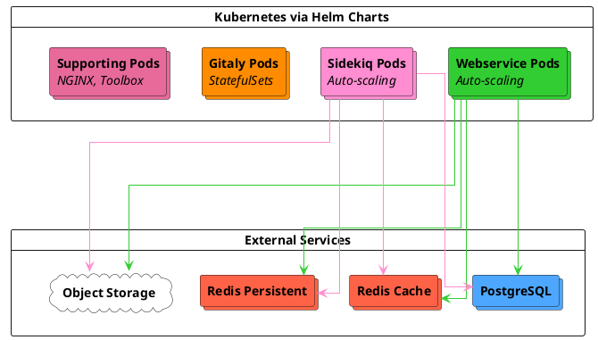



- Tier: Free, Premium, Ultimate
- Offering: GitLab Self-Managed
- Status: Beta



Cloud Native First Reference Architectures are designed for modern cloud-native deployment patterns with four standardized sizes (S/M/L/XL) based on workload characteristics. These architectures deploy all GitLab components in Kubernetes, while PostgreSQL, Redis, and Object Storage use external third-party solutions including managed services or on-premises options.

> [!note]
> These architectures are in [beta](../../policy/development_stages_support.md#beta). We encourage feedback and will continue refining specifications based on production usage data.

## Architecture overview

Cloud Native First architectures deploy GitLab components across Kubernetes and external services:

**Kubernetes components:**

- **Webservice** - Handles web requests
- **Sidekiq** - Processes background jobs
- **Gitaly** - Manages Git repositories using StatefulSets with persistent volumes
- **Supporting services** - NGINX Ingress, Toolbox, and monitoring components

> [!note]
> Gitaly on Kubernetes is deployed as Gitaly (non-Cluster) only. Each Gitaly pod is a single point of failure for the repositories it serves. Gitaly Cluster (Praefect) is not supported in Kubernetes.
>
> If you require Gitaly high availability with automatic failover, consider [Cloud Native Hybrid architectures](_index.md#cloud-native-hybrid), which deploy Gitaly Cluster on virtual machines while running stateless components in Kubernetes. For Gitaly on Kubernetes requirements and limitations, see [Gitaly on Kubernetes](../gitaly/kubernetes.md#requirements).

**External services:**

- **PostgreSQL** - Managed database service deployed with optional standby replica for high availability and read replicas for additional stability and performance
- **Redis** - Separate cache and persistent instances, each optionally deployed with standby replica for high availability
- **Object Storage** - Object Storage services such as S3, Google Cloud Storage, or Azure Blob Storage for artifacts and packages

For recommended managed service providers (GCP Cloud SQL, AWS RDS, Azure Database, etc.), see [recommended cloud providers and services](_index.md#recommended-cloud-providers-and-services).

## Available architectures

These architectures are designed around target RPS ranges representing typical production workload patterns. RPS targets serve as starting points, your specific capacity needs depend on workload composition and usage patterns. For guidance on RPS composition and when adjustments are needed, see [Understanding RPS composition](sizing.md#understanding-rps-composition-and-workload-patterns).

| Size | Target RPS | Intended Workload |
|------|------------|-------------------|
| S | ≤100 | Teams with light development activity and minimal automation |
| M | ≤200 | Organizations with moderate development velocity and standard CI/CD usage |
| L | ≤500 | Large teams with heavy development activity and significant automation |
| XL | ≤1000 | Enterprise deployments with intensive workloads and extensive integrations |

For detailed guidance on determining your expected load and selecting the appropriate size, see the [reference architecture sizing guide](sizing.md).

## Key benefits

Cloud Native First architectures provide:

- **Self-healing infrastructure** - Kubernetes automatically restarts failed pods and reschedules workloads across healthy nodes
- **Dynamic resource scaling** - Horizontal Pod Autoscaler and Cluster Autoscaler adjust capacity based on actual demand
- **Simplified deployment** - No traditional VM management for GitLab components, all orchestrated through Kubernetes
- **Reduced operational overhead** - Managed services for PostgreSQL, Redis, and object storage eliminate database and cache maintenance
- **Built-in high availability** - Multi-zone deployments with automatic failover for all components
- **Improved cost efficiency** - Resources scale down during low-demand periods while maintaining capacity for peaks

## Requirements

Before deploying a Cloud Native First architecture, ensure you have:

- Supported [Kubernetes cluster](https://docs.gitlab.com/charts/installation/cloud/) and other [Charts prerequisites](https://docs.gitlab.com/charts/installation/tools/) in place
- External PostgreSQL instance with database(s), user(s) and extension(s) configured
- External Redis instance(s)
- Object storage service (S3, Google Cloud Storage, Azure Blob Storage or other)

For complete requirements including networking, machine types, and cloud provider services, see [reference architecture requirements](_index.md#requirements).

For Gitaly on Kubernetes specific requirements and limitations, see [Gitaly on Kubernetes requirements](../gitaly/kubernetes.md#requirements).

## Small (S)

**Target load:** ≤100 RPS | Light overall load

**Workload characteristics:**

- **Total RPS range:** ≤100 requests per second
- **Git operations:** Light Git push and pull activity
- **Repository size:** Not suitable for actively used monorepos
- **CI/CD usage:** Light concurrent pipeline execution
- **API traffic:** Light capacity for automated workloads
- **User patterns:** Some resilience to usage spikes

### Kubernetes components

| Component | Per Pod Resources | Min Pods/Workers | Max Pods/Workers | Example Node Configuration |
|-----------|------------------|------------------|------------------|---------------------------|
| Webservice | 2 vCPU, 3 GB (request), 4 GB (limit) | 12 pods (24 workers) | 18 pods (36 workers) | GCP: 6 × n2-standard-8 AWS: 6 × c6i.2xlarge |
| Sidekiq | 900m vCPU, 2 GB (request), 4 GB (limit) | 8 workers | 12 workers | GCP: 3 × n2-standard-4 AWS: 3 × m6i.xlarge |
| Gitaly | 7 vCPU, 30 GB (request and limit) | 3 pods | 3 pods | GCP: 3 × n2-standard-8 AWS: 3 × m6i.2xlarge |
| Supporting | Variable per service | 12 vCPU, 48 GB | 12 vCPU, 48 GB | GCP: 3 × n2-standard-4 AWS: 3 × c6i.xlarge |

### Pod scaling configuration

| Component | Min → Max Pods | Min → Max Workers | Per Pod Resources | Workers per Pod |
|-----------|----------------|-------------------|-------------------|-----------------|
| Webservice | 12 → 18 | 24 → 36 | 2 vCPU, 3 GB (request), 4 GB (limit) | 2 |
| Sidekiq | 8 → 12 | 8 → 12 | 900m vCPU, 2 GB (request), 4 GB (limit) | 1 |
| Gitaly | 3 (no autoscaling) | not applicable | 7 vCPU, 30 GB (request and limit) | not applicable |

**Gitaly notes:** Git cgroups: 27 GB, Buffer: 3 GB. Repository cgroups set to 1. See [Gitaly cgroups configuration](#gitaly-cgroups-configuration) for tuning guidance.

### External services

| Service | Configuration | GCP Equivalent | AWS Equivalent |
|---------|---------------|----------------|----------------|
| PostgreSQL | 8 vCPU, 32 GB | n2-standard-8 | m6i.2xlarge |
| Redis - Cache | 2 vCPU, 8 GB | n2-standard-2 | m6i.large |
| Redis - Persistent | 2 vCPU, 8 GB | n2-standard-2 | m6i.large |
| Object Storage | Cloud provider service | Google Cloud Storage | Amazon S3 |

## Medium (M)

**Target load:** ≤200 RPS | Moderate overall load

**Workload characteristics:**

- **Total RPS range:** ≤200 requests per second
- **Git operations:** Moderate Git push and pull activity
- **Repository size:** Lightly used monorepos supported. Performance modifiers may be required for larger or heavily used monorepos
- **CI/CD usage:** Moderate pipeline concurrency
- **API traffic:** Standard automation workloads supported
- **User patterns:** Good resilience to usage fluctuations

### Kubernetes components

| Component | Per Pod Resources | Min Pods/Workers | Max Pods/Workers | Example Node Configuration |
|-----------|------------------|------------------|------------------|---------------------------|
| Webservice | 2 vCPU, 3 GB (request), 4 GB (limit) | 28 pods (56 workers) | 42 pods (84 workers) | GCP: 6 × n2-standard-16 AWS: 6 × c6i.4xlarge |
| Sidekiq | 900m vCPU, 2 GB (request), 4 GB (limit) | 16 workers | 24 workers | GCP: 3 × n2-standard-8 AWS: 3 × m6i.2xlarge |
| Gitaly | 15 vCPU, 62 GB (request and limit) | 3 pods | 3 pods | GCP: 3 × n2-standard-16 AWS: 3 × m6i.4xlarge |
| Supporting | Variable per service | 12 vCPU, 48 GB | 12 vCPU, 48 GB | GCP: 3 × n2-standard-4 AWS: 3 × c6i.xlarge |

### Pod scaling configuration

| Component | Min → Max Pods | Min → Max Workers | Per Pod Resources | Workers per Pod |
|-----------|----------------|-------------------|-------------------|-----------------|
| Webservice | 28 → 42 | 56 → 84 | 2 vCPU, 3 GB (request), 4 GB (limit) | 2 |
| Sidekiq | 16 → 24 | 16 → 24 | 900m vCPU, 2 GB (request), 4 GB (limit) | 1 |
| Gitaly | 3 (no autoscaling) | not applicable | 15 vCPU, 62 GB (request and limit) | not applicable |

**Gitaly notes:** Git cgroups: 56 GB, Buffer: 6 GB. Repository cgroups set to 1. See [Gitaly cgroups configuration](#gitaly-cgroups-configuration) for tuning guidance.

### External services

| Service | Configuration | GCP Equivalent | AWS Equivalent |
|---------|---------------|----------------|----------------|
| PostgreSQL | 16 vCPU, 64 GB | n2-standard-16 | m6i.4xlarge |
| Redis - Cache | 2 vCPU, 8 GB | n2-standard-2 | m6i.large |
| Redis - Persistent | 2 vCPU, 8 GB | n2-standard-2 | m6i.large |
| Object Storage | Cloud provider service | Google Cloud Storage | Amazon S3 |

## Large (L)

**Target load:** ≤500 RPS | Heavy overall load

**Workload characteristics:**

- **Total RPS range:** ≤500 requests per second
- **Git operations:** Heavy Git push and pull activity
- **Repository size:** Moderately used monorepos supported. Performance modifiers may be required for larger or heavily used monorepos
- **CI/CD usage:** Heavy pipeline usage with proper Sidekiq scaling
- **API traffic:** Significant automation workloads supported
- **User patterns:** Strong resilience to usage fluctuations

### Kubernetes components

| Component | Per Pod Resources | Min Pods/Workers | Max Pods/Workers | Example Node Configuration |
|-----------|------------------|------------------|------------------|---------------------------|
| Webservice | 2 vCPU, 3 GB (request), 4 GB (limit) | 56 pods (112 workers) | 84 pods (168 workers) | GCP: 6 × n2-standard-32 AWS: 6 × c6i.8xlarge |
| Sidekiq | 900m vCPU, 2 GB (request), 4 GB (limit) | 32 workers | 48 workers | GCP: 6 × n2-standard-8 AWS: 6 × m6i.2xlarge |
| Gitaly | 31 vCPU, 126 GB (request and limit) | 3 pods | 3 pods | GCP: 3 × n2-standard-32 AWS: 3 × m6i.8xlarge |
| Supporting | Variable per service | 12 vCPU, 48 GB | 12 vCPU, 48 GB | GCP: 3 × n2-standard-4 AWS: 3 × c6i.xlarge |

### Pod scaling configuration

| Component | Min → Max Pods | Min → Max Workers | Per Pod Resources | Workers per Pod |
|-----------|----------------|-------------------|-------------------|-----------------|
| Webservice | 56 → 84 | 112 → 168 | 2 vCPU, 3 GB (request), 4 GB (limit) | 2 |
| Sidekiq | 32 → 48 | 32 → 48 | 900m vCPU, 2 GB (request), 4 GB (limit) | 1 |
| Gitaly | 3 (no autoscaling) | not applicable | 31 vCPU, 126 GB (request and limit) | not applicable |

**Gitaly notes:** Git cgroups: 120 GB, Buffer: 6 GB. Repository cgroups set to 1. See [Gitaly cgroups configuration](#gitaly-cgroups-configuration) for tuning guidance.

### External services

| Service | Configuration | GCP Equivalent | AWS Equivalent |
|---------|---------------|----------------|----------------|
| PostgreSQL | 32 vCPU, 128 GB | n2-standard-32 | m6i.8xlarge |
| Redis - Cache | 2 vCPU, 16 GB | n2-highmem-2 | r6i.large |
| Redis - Persistent | 2 vCPU, 16 GB | n2-highmem-2 | r6i.large |
| Object Storage | Cloud provider service | Google Cloud Storage | Amazon S3 |

## Extra Large (XL)

**Target load:** ≤1000 RPS | Intensive overall load

**Workload characteristics:**

- **Total RPS range:** ≤1000 requests per second
- **Git operations:** Intensive Git push and pull activity
- **Repository size:** Heavily used monorepos supported. Performance modifiers may be required for larger or intensively used monorepos
- **CI/CD usage:** Intensive CI/CD workloads
- **API traffic:** Heavy automation and integration traffic
- **User patterns:** Designed for varied access patterns

### Kubernetes components

| Component | Per Pod Resources | Min Pods/Workers | Max Pods/Workers | Example Node Configuration |
|-----------|------------------|------------------|------------------|---------------------------|
| Webservice | 2 vCPU, 3 GB (request), 4 GB (limit) | 110 pods (220 workers) | 165 pods (330 workers) | GCP: 6 × n2-standard-64 AWS: 6 × c6i.16xlarge |
| Sidekiq | 900m vCPU, 2 GB (request), 4 GB (limit) | 64 workers | 96 workers | GCP: 6 × n2-standard-16 AWS: 6 × m6i.4xlarge |
| Gitaly | 63 vCPU, 254 GB (request and limit) | 3 pods | 3 pods | GCP: 3 × n2-standard-64 AWS: 3 × m6i.16xlarge |
| Supporting | Variable per service | 24 vCPU, 96 GB | 24 vCPU, 96 GB | GCP: 3 × n2-standard-8 AWS: 3 × c6i.2xlarge |

### Pod scaling configuration

| Component | Min → Max Pods | Min → Max Workers | Per Pod Resources | Workers per Pod |
|-----------|----------------|-------------------|-------------------|-----------------|
| Webservice | 110 → 165 | 220 → 330 | 2 vCPU, 3 GB (request), 4 GB (limit) | 2 |
| Sidekiq | 64 → 96 | 64 → 96 | 900m vCPU, 2 GB (request), 4 GB (limit) | 1 |
| Gitaly | 3 (no autoscaling) | not applicable | 63 vCPU, 254 GB (request and limit) | not applicable |

**Gitaly notes:** Git cgroups: 248 GB, Buffer: 6 GB. Repository cgroups set to 1. See [Gitaly cgroups configuration](#gitaly-cgroups-configuration) for tuning guidance.

### External services

| Service | Configuration | GCP Equivalent | AWS Equivalent |
|---------|---------------|----------------|----------------|
| PostgreSQL | 64 vCPU, 256 GB | n2-standard-64 | m6i.16xlarge |
| Redis - Cache | 2 vCPU, 16 GB | n2-highmem-2 | r6i.large |
| Redis - Persistent | 2 vCPU, 16 GB | n2-highmem-2 | r6i.large |
| Object Storage | Cloud provider service | Google Cloud Storage | Amazon S3 |

## Additional information

This section provides supplementary guidance for deploying and operating Cloud
Native First architectures, including machine type selection, component-specific
considerations, and scaling strategies.

### Machine type guidance

The machine types shown are examples used in validation and testing. You can use:

- Newer generation machine types
- ARM-based instances (AWS Graviton)
- Different machine families that meet or exceed the specifications
- Custom machine types sized to your specific needs

Do not use burstable instance types due to inconsistent performance.

For more information, see [supported machine types](_index.md#supported-machine-types).

### Gitaly considerations

Gitaly in Kubernetes with the Cloud Native First architectures uses StatefulSets with the following specifications:

- **Exclusive node placement** - Gitaly pods are deployed on dedicated nodes to avoid noisy neighbor issues.
- **Resource allocation** - Pod requests and limits set to node capacity minus overhead (2 GB memory, 1 vCPU reserved for Kubernetes system processes).
- **Git cgroups memory** - Allocated with 10% buffer by default, capped at 6 GB maximum for larger pods. For example, Small allocates 27 GB to Git cgroups with a 3 GB buffer, while Medium and larger sizes use the 6 GB cap (56 GB cgroups with 6 GB buffer for Medium).

**Gitaly deployment mode:**

By design, Gitaly (non-Cluster) on Kubernetes is a single point of failure service for repositories stored on each pod. Data is sourced and served from a single instance per pod. Each Gitaly pod manages its own set of repositories, providing horizontal scaling of Git storage through repository distribution.

Gitaly Cluster (Praefect) is not supported in Cloud Native First architectures. For context on Gitaly deployment limitations in Kubernetes, see [Gitaly on Kubernetes](../gitaly/kubernetes.md).

**Repository distribution:**

With multiple Gitaly storages configured (for example `default`, `storage1`, `storage2`), GitLab defaults to creating all new repositories on the `default` storage. To distribute repositories across all Gitaly pods, configure storage weights to balance load.

For guidance on configuring repository storage weights, see [configure where new repositories are stored](../repository_storage_paths.md#configure-where-new-repositories-are-stored).

#### Gitaly cgroups configuration

Gitaly uses [cgroups](../gitaly/cgroups.md) to protect against resource exhaustion from individual Git operations. The default configuration sets repository cgroup count to 1, which provides a starting point that allows any single repository to use full pod resources through oversubscription.

However, this configuration may not be optimal for all workloads. For environments with many active repositories or specific resource isolation requirements, you should tune the cgroups configuration based on observed usage patterns. This includes adjusting repository cgroup counts and memory allocations.

For detailed guidance on measuring, tuning, and configuring Gitaly cgroups, see [Gitaly cgroups](../gitaly/cgroups.md).

For large monorepos (over 2 GB) or intensive Git workloads, additional Gitaly adjustments may be required. See [reference architecture sizing guide](sizing.md) for detailed guidance.

### External service notes

- PostgreSQL can be deployed with standby replica for high availability. Read replicas can be added for additional stability and performance. Larger environments (L, XL) benefit more from read replicas to distribute database load.
- Redis instances can be deployed with standby replica for high availability. On GCP, Memorystore instances are configured by memory only. Machine specifications shown for reference.
- For all cloud provider services that involve configuring instances, it's recommended to implement a minimum of three nodes in three different availability zones to align with resilient cloud architecture practices.

### Autoscaling and minimum pod counts

All architectures use Kubernetes Horizontal Pod Autoscaler (HPA) and Cluster Autoscaler to manage capacity:

- **Webservice** - Scales based on CPU utilization with conservative minimum pod counts
- **Sidekiq** - Scales based on CPU utilization
- **Cluster Autoscaler** - Provisions and removes nodes automatically based on pod resource requests

Minimum pod counts are set at approximately 2/3 of maximum to balance cost efficiency with performance reliability based on internal testing to achieve the following goals:

- Responsive scaling during demand increases
- Sufficient capacity during node failures or upgrades
- Cost optimization during lower-demand periods

If you have well-understood load patterns you can adjust minimums based on your needs:

- **Increase minimums** for environments with sharp traffic spikes or strict performance SLAs
- **Decrease minimums** after monitoring shows sustained load consistently below defaults

### Advanced scaling

Cloud Native First architectures are designed to scale beyond their base specifications. You may need to adjust capacity if your environment has:

- Consistently higher throughput than the listed RPS targets
- Atypical workload composition (see [Understanding RPS composition](sizing.md#understanding-rps-composition-and-workload-patterns))
- Large monorepos (over 2 GB)
- Significant additional workloads
- Extensive GitLab Duo Agent Platform usage

Scaling strategies differ by component type.

#### Horizontal scaling (Webservice and Sidekiq)

For increased capacity, scale horizontally by adjusting maximum replica counts and node pool capacity:

- **Webservice** - Increase `maxReplicas` in Helm values and add corresponding nodes to the Webservice node pool
- **Sidekiq** - Increase `maxReplicas` to handle higher job throughput and add nodes to the Sidekiq node pool

Horizontal scaling is the recommended approach for these stateless components.

#### Vertical scaling (PostgreSQL, Redis, Gitaly)

For stateful components, increase instance or pod specifications:

- **PostgreSQL and Redis** - Upgrade to larger instance types through your managed service provider.
- **Gitaly** - Increase per-pod CPU and memory specifications. This requires larger node types in the Gitaly node pool and corresponding adjustments to Git cgroups memory allocation.

#### Sidekiq queue optimization

By default, Sidekiq processes all job types in a single queue. For environments with diverse workload patterns, you can configure separate queues based on job characteristics:

- **High-urgency queues** - For time-sensitive jobs like CI pipeline processing and webhook delivery
- **CPU-bound queues** - For computationally intensive jobs with adjusted concurrency settings
- **Default queue** - For standard background processing

Queue separation can improve job processing reliability and prevent low-priority jobs from blocking time-sensitive operations, particularly in larger environments (L, XL) with heavy automation workloads.

For more information about configuring Sidekiq queues, see [processing specific job classes](../sidekiq/processing_specific_job_classes.md).

#### Scaling for GitLab Duo Agent Platform

GitLab Duo Agent Platform introduces additional infrastructure requirements beyond standard GitLab workloads. For detailed guidance on monitoring and scaling for Agent Platform adoption, see [Scaling for GitLab Duo Agent Platform](_index.md#scaling-for-gitlab-duo-agent-platform).

#### Scaling considerations

When scaling any component significantly:

- Monitor dependent components for resource saturation. Increased load on Webservice or Sidekiq can impact PostgreSQL and Gitaly.
- Test scaling changes in non-production environments first.
- Scale interdependent components together to avoid shifting bottlenecks between services.

For comprehensive scaling guidance, see [scaling an environment](_index.md#scaling-an-environment).

## Deployment

Cloud Native First architectures can be deployed using Helm charts and external service providers directly or through the GitLab Environment Toolkit.

### GitLab Environment Toolkit

The [GitLab Environment Toolkit](https://gitlab.com/gitlab-org/gitlab-environment-toolkit) provides automated deployment with:

- Infrastructure as Code (Terraform) for cloud resources
- Automated Helm chart configuration
- Pre-validated settings for each architecture size
- Simplified upgrades and maintenance

For deployment instructions, see the [GitLab Environment Toolkit documentation](https://gitlab.com/gitlab-org/gitlab-environment-toolkit/-/blob/main/README.md).

### Manual deployment

Prerequisites for manual deployment:

- External PostgreSQL with required databases, users and permissions set up
- External Redis instances configured and accessible
- Object Storage buckets created
- Kubernetes secrets created for authentication as required (PostgreSQL password, Redis passwords, Object Storage credentials, GitLab secrets)

For detailed prerequisites and secret configuration, see [GitLab chart prerequisites](https://docs.gitlab.com/charts/installation/tools/) and [configure secrets](https://docs.gitlab.com/charts/installation/secrets/).

For manual deployment using Helm charts:

1. Set up required external services and secrets as described in prerequisites
1. Configure a Kubernetes cluster with appropriate node pools and autoscaler
1. Apply the Helm values configuration shown in the [Helm Chart configuration](#helm-chart-configurations) section
1. Deploy GitLab using `helm install`

For detailed manual deployment steps, see [installing GitLab on Kubernetes](https://docs.gitlab.com/charts/installation/).

## Helm Chart configurations

For complete Helm Chart configuration examples and detailed deployment guidance, see the [GitLab Charts repository](https://gitlab.com/gitlab-org/charts/gitlab/-/tree/master/examples/ref).

Key configuration areas for Cloud Native First architectures:

- **Resource specifications** - Pod CPU and memory limits match the specifications in each architecture size above
- **Autoscaling** - HPA configurations set minimum pod counts at 2/3 of maximum with CPU-based scaling targets
- **Node placement** - Node selectors ensure workloads deploy to appropriate node pools (for example: `webservice`, `sidekiq`, `gitaly`, `support`)
- **External services** - PostgreSQL, Redis, and Object Storage connection details
- **Gitaly** - StatefulSet configuration with cgroups, persistence, and storage distribution

For architecture-specific replica counts and resource values, refer to the specifications in each size section above.

> [!note]
> Cloud Native First architectures are in Beta. Specific Helm Chart configuration examples will be added to the Charts repository as the feature progresses toward General Availability. Use the specifications in each architecture size section above to construct your Helm values configuration.

## Next steps

After deployment, environments typically require monitoring and tuning to match actual workload patterns.

### Monitor and validate

1. **Monitor resource utilization** - Track CPU, memory, and queue depths across all components using [Prometheus](../monitoring/prometheus/_index.md)
1. **Validate RPS assumptions** - Compare your actual [RPS breakdown](sizing.md#extract-peak-traffic-metrics) to the assumed 80/10/10 composition
1. **Identify potential adjustments** - Look for components consistently above 70% utilization
1. **Review Gitaly cgroups** - Consider tuning [repository cgroup counts](../gitaly/cgroups.md) based on your repository access patterns

### Adjust as needed

Reference architectures are starting points. Many environments benefit from adjustments based on:

- **Actual workload composition** - If your API/Web/Git split differs significantly from typical patterns, see [Understanding RPS composition](sizing.md#understanding-rps-composition-and-workload-patterns)
- **Repository characteristics** - Monorepo sizes, clone frequency, and access patterns may require [component-specific adjustments](sizing.md#identify-component-adjustments)
- **Growth patterns** - User count increases, CI/CD expansion, or automation scaling

See [Advanced scaling](#advanced-scaling) for component-specific adjustment guidance.

### Configure optional features

You may want to configure additional optional features of GitLab depending on your requirements. See [Steps after installing GitLab](../../install/next_steps.md) for more information.

> [!note]
> Additional capacity may be required for optional features. See the feature-specific documentation for requirements.
