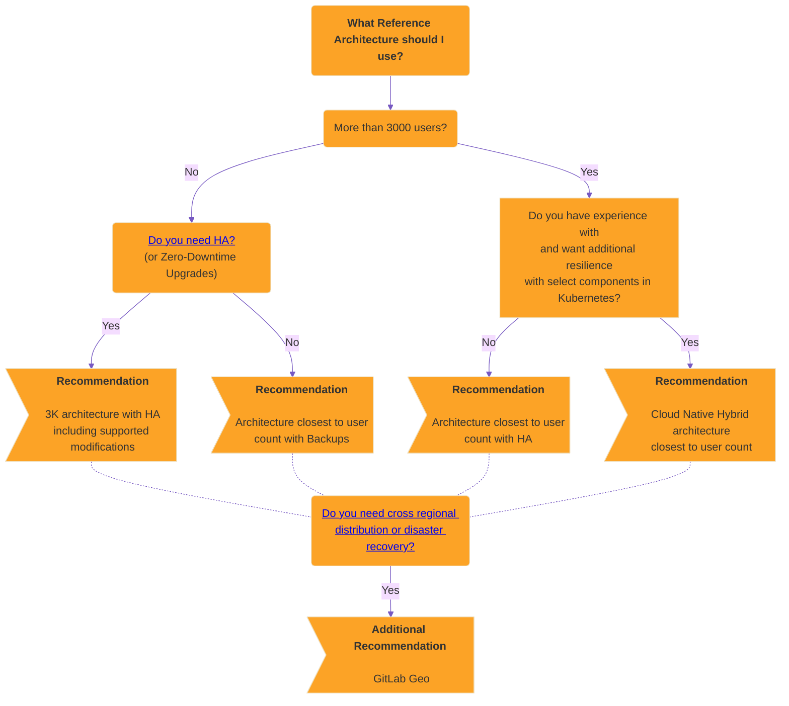

# Reference architectures **(FREE SELF)**

The GitLab Reference Architectures have been designed and tested by the
GitLab Quality and Support teams to provide recommended deployments at scale.

## Available reference architectures

Depending on your workflow, the following recommended reference architectures
may need to be adapted accordingly. Your workload is influenced by factors
including how active your users are, how much automation you use, mirroring,
and repository/change size. Additionally, the displayed memory values are
provided by [GCP machine types](https://cloud.google.com/compute/docs/machine-types).
For different cloud vendors, attempt to select options that best match the
provided architecture.

### GitLab package (Omnibus)

The following reference architectures, where the GitLab package is used, are available:

- [Up to 1,000 users](1k_users.md)
- [Up to 2,000 users](2k_users.md)
- [Up to 3,000 users](3k_users.md)
- [Up to 5,000 users](5k_users.md)
- [Up to 10,000 users](10k_users.md)
- [Up to 25,000 users](25k_users.md)
- [Up to 50,000 users](50k_users.md)

### Cloud native hybrid

The following Cloud Native Hybrid reference architectures, where select recommended components can be run in Kubernetes, are available:

- [Up to 2,000 users](2k_users.md#cloud-native-hybrid-reference-architecture-with-helm-charts-alternative)
- [Up to 3,000 users](3k_users.md#cloud-native-hybrid-reference-architecture-with-helm-charts-alternative)
- [Up to 5,000 users](5k_users.md#cloud-native-hybrid-reference-architecture-with-helm-charts-alternative)
- [Up to 10,000 users](10k_users.md#cloud-native-hybrid-reference-architecture-with-helm-charts-alternative)
- [Up to 25,000 users](25k_users.md#cloud-native-hybrid-reference-architecture-with-helm-charts-alternative)
- [Up to 50,000 users](50k_users.md#cloud-native-hybrid-reference-architecture-with-helm-charts-alternative)

## Deciding which architecture to use

The Reference Architectures are designed to strike a balance between two important factors--performance and resilience.

While they are designed to make it easier to set up GitLab at scale, it can still be a challenge to know which one will meet your requirements.

As a general guide, **the more performant and/or resilient you want your environment to be, the more involved it will be**.

This section explains the designs you can choose from. It begins with the least complexity, goes to the most, and ends with a decision tree.

### Backups

For environments serving 2,000 or fewer users we generally recommend that an [automated backup](../../raketasks/backup_gitlab.md#configuring-cron-to-make-daily-backups) strategy is used instead of HA.

Backups can provide a good level of RPO / RTO while avoiding the complexities that come with HA.

### High Availability (HA)

High Availability ensures every component in the GitLab setup can handle failures through various mechanisms. To achieve this however is involved, and the environments required can be sizable.

For environments serving 3,000 or more users we generally recommend that a HA strategy is used as at this level outages will have a bigger impact against more users. All the architectures in this range have HA built in by design for this reason.

For users who still need to have HA for a lower number of users this can also be achieved with an [adjusted 3K architecture as detailed here](3k_users.md#supported-modifications-for-lower-user-counts-ha).

#### Do you need High Availability (HA)?

As mentioned above, achieving HA does come at a cost. The environment's required are sizable as each component needs to be multiplied, which comes with additional actual and maintenance costs.

For a lot of our customers with fewer than 3,000 users, we've found a backup strategy is sufficient and even preferable. While this does have a slower recovery time, it also means you have a much smaller architecture and less maintenance costs as a result.

In general then, we'd only recommend you employ HA in the following scenarios:

- When you have 3,000 or more users.
- When GitLab being down would critically impact your workflow.

#### Zero Downtime Upgrades

[Zero Downtime Upgrades](../../update/zero_downtime.md) are available for standard Reference Architecture environments with HA (Cloud Native Hybrid is not supported at this time). This allows for an environment to stay up during an upgrade, but the process is more involved as a result and has some limitations as detailed in the documentation.

When going through this process it's worth noting that there may still be brief moments of downtime when the HA mechanisms tale effect.

In most cases the downtime required for doing an upgrade in general shouldn't be substantial, so this is only recommended if it's a key requirement for you.

### Cloud Native Hybrid (Kubernetes HA)

As an additional layer of HA resilience you can deploy select components in Kubernetes, known as a Cloud Native Hybrid Reference Architecture.

Note that this is an alternative and more **advanced** setup compared to a standard Reference Architecture. Running services in Kubernetes is well known to be complex. **This setup is only recommended** if you have strong working knowledge and experience in Kubernetes.

### GitLab Geo (Cross Regional Distribution / Disaster Recovery)

With [GitLab Geo](../geo/index.md) you can have both distributed environments in different regions and a full Disaster Recovery (DR) setup in place. With this setup you would have 2 or more separate environments, with one being a primary that gets replicated to the others. In the rare event the primary site went down completely you could fail over to one of the other environments.

This is an **advanced and involved** setup and should only be undertaken if you have DR as a key requirement. Decisions then on how each environment are configured would also need to be taken, such as if each environment itself would be the full size and / or have HA.

### Decision Tree

Below you can find the above guidance in the form of a decision tree. It's recommended you read through the above guidance in full first before though.

## Recommended cloud providers and services

NOTE:
The following lists are non-exhaustive. Generally, other cloud providers not listed
here likely work with the same specs, but this hasn't been validated.
Additionally, when it comes to other cloud provider services not listed here,
it's advised to be cautious as each implementation can be notably different
and should be tested thoroughly before production use.

Through testing and real life usage, the Reference Architectures are validated and supported on the following cloud providers:

<table>
<thead>
  <tr>
    <th>Reference Architecture</th>
    <th>GCP</th>
    <th>AWS</th>
    <th>Azure</th>
    <th>Bare Metal</th>
  </tr>
</thead>
<tbody>
  <tr>
    <td>Omnibus</td>
    <td>🟢</td>
    <td>🟢</td>
    <td>🟡1</td>
    <td>🟢</td>
  </tr>
  <tr>
    <td>Cloud Native Hybrid</td>
    <td>🟢</td>
    <td>🟢</td>
    <td></td>
    <td></td>
  </tr>
</tbody>
</table>

1. We only recommend smaller setups (up to 2k) at this time on Azure due to performance issues at larger scales. See the [Recommendation Notes for Azure](#recommendation-notes-for-azure) section for more info.

Additionally, the following cloud provider services are validated and supported for use as part of the Reference Architectures:

<table>
<thead>
  <tr>
    <th>Cloud Service</th>
    <th>GCP</th>
    <th>AWS</th>
    <th>Bare Metal</th>
  </tr>
</thead>
<tbody>
  <tr>
    <td>Object Storage</td>
    <td>🟢 &nbsp; <a href="https://cloud.google.com/storage" target="_blank">Cloud Storage</a></td>
    <td>🟢 &nbsp; <a href="https://aws.amazon.com/s3/" target="_blank">S3</a></td>
    <td>🟢 &nbsp; <a href="https://min.io/" target="_blank">MinIO</a></td>
  </tr>
  <tr>
    <td>Database</td>
    <td>🟢 &nbsp; <a href="https://cloud.google.com/sql" target="_blank" rel="noopener noreferrer">Cloud SQL</a></td>
    <td>🟢 &nbsp; <a href="https://aws.amazon.com/rds/" target="_blank" rel="noopener noreferrer">RDS</a></td>
    <td></td>
  </tr>
  <tr>
    <td>Redis</td>
    <td></td>
    <td>🟢 &nbsp; <a href="https://aws.amazon.com/elasticache/" target="_blank" rel="noopener noreferrer">ElastiCache</a></td>
    <td></td>
  </tr>
</tbody>
</table>

### Recommendation notes for the database services

When selecting a database service, it should run a standard, performant, and [supported version](../../install/requirements.md#postgresql-requirements) of PostgreSQL with the following features:

- Read Replicas for [Database Load Balancing](../postgresql/database_load_balancing.md).
- Cross Region replication for [GitLab Geo](../geo/index.md).

Several cloud provider services are known not to support the above or have been found to have other issues and aren't recommended:

- [Amazon Aurora](https://aws.amazon.com/rds/aurora/) is incompatible and not supported. See [14.4.0](../../update/index.md#1440) for more details.
- [Azure Database for PostgreSQL Single Server](https://azure.microsoft.com/en-gb/products/postgresql/#overview) (Single / Flexible) is **strongly not recommended** for use due to notable performance / stability issues or missing functionality. See [Recommendation Notes for Azure](#recommendation-notes-for-azure) for more details.
- [Google AlloyDB](https://cloud.google.com/alloydb) and [Amazon RDS Multi-AZ DB cluster](https://docs.aws.amazon.com/AmazonRDS/latest/UserGuide/multi-az-db-clusters-concepts.html) have not been tested and are not recommended. Both solutions are specifically not expected to work with GitLab Geo.
  - Note that [Amazon RDS Multi-AZ DB instance](https://docs.aws.amazon.com/AmazonRDS/latest/UserGuide/Concepts.MultiAZSingleStandby.html) is a separate product and is supported.

### Recommendation notes for Azure

Due to performance issues that we found with several key Azure services, we only recommend smaller architectures (up to 2k) to be deployed to Azure. For larger architectures, we recommend using another cloud provider.

In addition to the above, you should be aware of the additional specific guidance for Azure:

- **We outright strongly do not recommend [Azure Database for PostgreSQL Single Server](https://learn.microsoft.com/en-us/azure/postgresql/single-server/overview-single-server)** specifically due to significant performance and stability issues found. **For GitLab 14.0 and higher the service is not supported** due to it only supporting up to PostgreSQL 11.
  - A new service, [Azure Database for PostgreSQL Flexible Server](https://learn.microsoft.com/en-us/azure/postgresql/flexible-server/) has been released but due to it missing some functionality we don't recommend it at this time.
- [Azure Blob Storage](https://azure.microsoft.com/en-gb/products/storage/blobs/) has been found to have performance limits that can impact production use at certain times. However, this has only been seen in larger architectures.

## Validation and test results

The [Quality Engineering team](https://about.gitlab.com/handbook/engineering/quality/quality-engineering/)
does regular smoke and performance tests for the reference architectures to ensure they
remain compliant.

### Why we perform the tests

The Quality Department has a focus on measuring and improving the performance
of GitLab, as well as creating and validating reference architectures that
self-managed customers can rely on as performant configurations.

For more information, see our [handbook page](https://about.gitlab.com/handbook/engineering/quality/performance-and-scalability/).

### How we perform the tests

Testing occurs against all reference architectures and cloud providers in an automated and ad-hoc fashion. This is done by two tools:

- The [GitLab Environment Toolkit](https://gitlab.com/gitlab-org/gitlab-environment-toolkit) for building the environments.
- The [GitLab Performance Tool](https://gitlab.com/gitlab-org/quality/performance) for performance testing.

Network latency on the test environments between components on all Cloud Providers were measured at <5 ms. Note that this is shared as an observation and not as an implicit recommendation.

We aim to have a "test smart" approach where architectures tested have a good range that can also apply to others. Testing focuses on 10k Omnibus on GCP as the testing has shown this is a good bellwether for the other architectures and cloud providers as well as Cloud Native Hybrids.

The Standard Reference Architectures are designed to be platform-agnostic, with everything being run on VMs via [Omnibus GitLab](https://docs.gitlab.com/omnibus/). While testing occurs primarily on GCP, ad-hoc testing has shown that they perform similarly on hardware with equivalent specs on other Cloud Providers or if run on premises (bare-metal).

Testing on these reference architectures is performed with the
[GitLab Performance Tool](https://gitlab.com/gitlab-org/quality/performance)
at specific coded workloads, and the throughputs used for testing are
calculated based on sample customer data. Select the
[reference architecture](#available-reference-architectures) that matches your scale.

Each endpoint type is tested with the following number of requests per second (RPS)
per 1,000 users:

- API: 20 RPS
- Web: 2 RPS
- Git (Pull): 2 RPS
- Git (Push): 0.4 RPS (rounded to the nearest integer)

### How to interpret the results

NOTE:
Read our blog post on [how our QA team leverages GitLab performance testing tool](https://about.gitlab.com/blog/2020/02/18/how-were-building-up-performance-testing-of-gitlab/).

Testing is done publicly, and all results are shared.

The following table details the testing done against the reference architectures along with the frequency and results. Additional testing is continuously evaluated, and the table is updated accordingly.

<table class="test-coverage">
  <col>
  <colgroup span="2"></colgroup>
  <colgroup span="2"></colgroup>
  <tr>
    <th rowspan="2">Reference Architecture</th>
    <th style="text-align: center" colspan="2" scope="colgroup">GCP (* also proxy for Bare-Metal)</th>
    <th style="text-align: center" colspan="2" scope="colgroup">AWS</th>
    <th style="text-align: center" colspan="2" scope="colgroup">Azure</th>
  </tr>
  <tr>
    <th scope="col">Omnibus</th>
    <th scope="col">Cloud Native Hybrid</th>
    <th scope="col">Omnibus</th>
    <th scope="col">Cloud Native Hybrid</th>
    <th scope="col">Omnibus</th>
  </tr>
    <tr>
    <th scope="row">1k</th>
    <td><a href="https://gitlab.com/gitlab-org/quality/performance/-/wikis/Benchmarks/Latest/1k">Weekly</a></td>
    <td></td>
    <td></td>
    <td></td>
    <td></td>
  </tr>
  <tr>
    <th scope="row">2k</th>
    <td><a href="https://gitlab.com/gitlab-org/quality/performance/-/wikis/Benchmarks/Latest/2k">Weekly</a></td>
    <td></td>
    <td></td>
    <td></td>
    <td></td>
  </tr>
  <tr>
    <th scope="row">3k</th>
    <td><a href="https://gitlab.com/gitlab-org/quality/performance/-/wikis/Benchmarks/Latest/3k">Weekly</a></td>
    <td></td>
    <td></td>
    <td><a href="https://gitlab.com/gitlab-org/quality/performance/-/wikis/Benchmarks/Latest/3k_hybrid_aws_services">Weekly</a></td>
    <td></td>
  </tr>
  <tr>
    <th scope="row">5k</th>
    <td><a href="https://gitlab.com/gitlab-org/quality/performance/-/wikis/Benchmarks/Latest/5k">Weekly</a></td>
    <td></td>
    <td></td>
    <td></td>
    <td></td>
  </tr>
  <tr>
    <th scope="row">10k</th>
    <td><a href="https://gitlab.com/gitlab-org/quality/performance/-/wikis/Benchmarks/Latest/10k">Daily</a></td>
    <td><a href="https://gitlab.com/gitlab-org/quality/performance/-/wikis/Benchmarks/Latest/10k_hybrid">Weekly</a></td>
    <td><a href="https://gitlab.com/gitlab-org/quality/performance/-/wikis/Benchmarks/Latest/10k_aws">Weekly</a></td>
    <td><a href="https://gitlab.com/gitlab-org/quality/performance/-/wikis/Benchmarks/Latest/10k_hybrid_aws_services">Weekly</a></td>
    <td><a href="https://gitlab.com/gitlab-org/quality/performance/-/wikis/Past-Results/10k">Ad-Hoc</a></td>
  </tr>
  <tr>
    <th scope="row">25k</th>
    <td><a href="https://gitlab.com/gitlab-org/quality/performance/-/wikis/Benchmarks/Latest/25k">Weekly</a></td>
    <td></td>
    <td></td>
    <td></td>
    <td><a href="https://gitlab.com/gitlab-org/quality/performance/-/wikis/Past-Results/25k">Ad-Hoc</a></td>
  </tr>
  <tr>
    <th scope="row">50k</th>
    <td><a href="https://gitlab.com/gitlab-org/quality/performance/-/wikis/Benchmarks/Latest/50k">Weekly</a></td>
    <td></td>
    <td><a href="https://gitlab.com/gitlab-org/quality/performance/-/wikis/Past-Results/50k">Ad-Hoc (inc Cloud Services)</a></td>
    <td></td>
    <td></td>
  </tr>
</table>

## Cost to run

The following table details the cost to run the different reference architectures across GCP, AWS, and Azure. Bare-metal costs are not included here as it varies widely depending on each customer configuration.

<table class="test-coverage">
  <col>
  <colgroup span="2"></colgroup>
  <colgroup span="2"></colgroup>
  <tr>
    <th rowspan="2">Reference Architecture</th>
    <th style="text-align: center" colspan="2" scope="colgroup">GCP</th>
    <th style="text-align: center" colspan="2" scope="colgroup">AWS</th>
    <th style="text-align: center" colspan="2" scope="colgroup">Azure</th>
  </tr>
  <tr>
    <th scope="col">Omnibus</th>
    <th scope="col">Cloud Native Hybrid</th>
    <th scope="col">Omnibus</th>
    <th scope="col">Cloud Native Hybrid</th>
    <th scope="col">Omnibus</th>
  </tr>
    <tr>
    <th scope="row">1k</th>
    <td><a href="https://cloud.google.com/products/calculator#id=a6d6a94a-c7dc-4c22-85c4-7c5747f272ed">Calculated cost</a></td>
    <td></td>
    <td><a href="https://calculator.aws/#/estimate?id=b51f178f4403b69a63f6eb33ea425f82de3bf249">Calculated cost</a></td>
    <td></td>
    <td><a href="https://azure.microsoft.com/en-us/pricing/calculator/?shared-estimate=1adf30bef7e34ceba9efa97c4470417b">Calculated cost</a></td>
  </tr>
  <tr>
    <th scope="row">2k</th>
    <td><a href="https://cloud.google.com/products/calculator#id=84d11491-d72a-493c-a16e-650931faa658">Calculated cost</a></td>
    <td></td>
    <td><a href="https://calculator.aws/#/estimate?id=dce36b5cb6ab25211f74e47233d77f58fefb54e2">Calculated cost</a></td>
    <td></td>
    <td><a href="https://azure.microsoft.com/en-us/pricing/calculator/?shared-estimate=72764902f3854f798407fb03c3de4b6f">Calculated cost</a></td>
  </tr>
  <tr>
    <th scope="row">3k</th>
    <td><a href="https://cloud.google.com/products/calculator/#id=ac4838e6-9c40-4a36-ac43-6d1bc1843e08">Calculated cost</a></td>
    <td></td>
    <td><a href="https://calculator.aws/#/estimate?id=b1c5b4e32e990eaeb035a148255132bd28988760">Calculated cost</a></td>
    <td></td>
    <td><a href="https://azure.microsoft.com/en-us/pricing/calculator/?shared-estimate=0dbfc575051943b9970e5d8ace03680d">Calculated cost</a></td>
  </tr>
  <tr>
    <th scope="row">5k</th>
    <td><a href="https://cloud.google.com/products/calculator/#id=8742e8ea-c08f-4e0a-b058-02f3a1c38a2f">Calculated cost</a></td>
    <td></td>
    <td><a href="https://calculator.aws/#/estimate?id=2bf1af883096e6f4c6efddb4f3c35febead7fec2">Calculated cost</a></td>
    <td></td>
    <td><a href="https://azure.microsoft.com/en-us/pricing/calculator/?shared-estimate=8f618711ffec4b039f1581871ca6a7c9">Calculated cost</a></td>
  </tr>
  <tr>
    <th scope="row">10k</th>
    <td><a href="https://cloud.google.com/products/calculator#id=e77713f6-dc0b-4bb3-bcef-cea904ac8efd">Calculated cost</a></td>
    <td></td>
    <td><a href="https://calculator.aws/#/estimate?id=1d374df13c0f2088d332ab0134f5b1d0f717259e">Calculated cost</a></td>
    <td></td>
    <td><a href="https://azure.microsoft.com/en-us/pricing/calculator/?shared-estimate=de3da8286dda4d4db1362932bc75410b">Calculated cost</a></td>
  </tr>
  <tr>
    <th scope="row">25k</th>
    <td><a href="https://cloud.google.com/products/calculator#id=925386e1-c01c-4c0a-8d7d-ebde1824b7b0">Calculated cost</a></td>
    <td></td>
    <td><a href="https://calculator.aws/#/estimate?id=46fe6a6e9256d9b7779fae59fbbfa7e836942b7d">Calculated cost</a></td>
    <td></td>
    <td><a href="https://azure.microsoft.com/en-us/pricing/calculator/?shared-estimate=69724ebd82914a60857da6a3ace05a64">Calculate cost</a></td>
  </tr>
  <tr>
    <th scope="row">50k</th>
    <td><a href="https://cloud.google.com/products/calculator/#id=8006396b-88ee-40cd-a1c8-77cdefa4d3c8">Calculated cost</a></td>
    <td></td>
    <td><a href="https://calculator.aws/#/estimate?id=e15926b1a3c7139e4faf390a3875ff807d2ab91c">Calculated cost</a></td>
    <td></td>
    <td><a href="https://azure.microsoft.com/en-us/pricing/calculator/?shared-estimate=3f973040ebc14023933d35f576c89846">Calculated cost</a></td>
  </tr>
</table>

## Deviating from the suggested reference architectures

As a general guideline, the further away you move from the Reference Architectures,
the harder it is to get support for it. With any deviation, you're introducing
a layer of complexity that adds challenges to finding out where potential
issues might lie.

The reference architectures use the official GitLab Linux packages (Omnibus
GitLab) or [Helm Charts](https://docs.gitlab.com/charts/) to install and configure the various components. The components are
installed on separate machines (virtualized or bare metal), with machine hardware
requirements listed in the "Configuration" column and equivalent VM standard sizes listed
in GCP/AWS/Azure columns of each [available reference architecture](#available-reference-architectures).

Running components on Docker (including Compose) with the same specs should be fine, as Docker is well known in terms of support.
However, it is still an additional layer and may still add some support complexities, such as not being able to run `strace` easily in containers.

Other technologies, like [Docker swarm](https://docs.docker.com/engine/swarm/)
are not officially supported, but can be implemented at your own risk. In that
case, GitLab Support is not able to help you.
