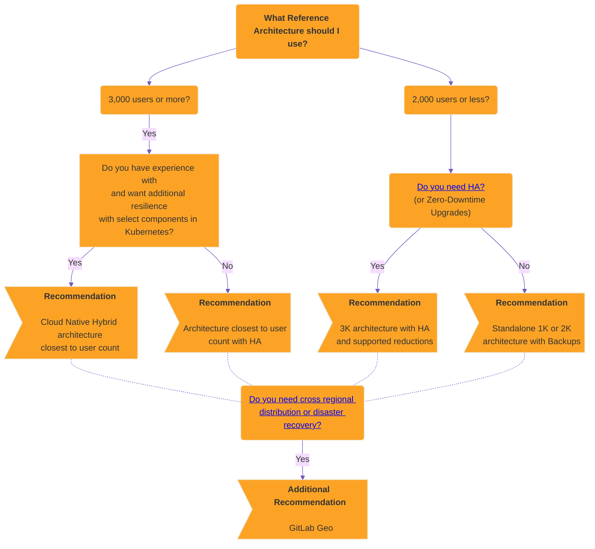

# Reference architectures **(FREE SELF)**

The GitLab Reference Architectures have been designed and tested by the
GitLab Quality and Support teams to provide recommended deployments at scale.

## Available reference architectures

Depending on your workflow, the following recommended reference architectures
may need to be adapted accordingly. Your workload is influenced by factors
including how active your users are, how much automation you use, mirroring,
and repository/change size. Additionally, the displayed memory values are
provided by [GCP machine types](https://cloud.google.com/compute/docs/machine-resource).
For different cloud vendors, attempt to select options that best match the
provided architecture.

### GitLab package (Omnibus)

The following reference architectures, where the GitLab package is used, are available:

- [Up to 1,000 users](1k_users.md)
- [Up to 2,000 users](2k_users.md)
- [Up to 3,000 users](3k_users.md)
- [Up to 5,000 users](5k_users.md)
- [Up to 10,000 users](10k_users.md)
- [Up to 25,000 users](25k_users.md)
- [Up to 50,000 users](50k_users.md)

### Cloud native hybrid

The following Cloud Native Hybrid reference architectures, where select recommended components can be run in Kubernetes, are available:

- [Up to 2,000 users](2k_users.md#cloud-native-hybrid-reference-architecture-with-helm-charts-alternative)
- [Up to 3,000 users](3k_users.md#cloud-native-hybrid-reference-architecture-with-helm-charts-alternative)
- [Up to 5,000 users](5k_users.md#cloud-native-hybrid-reference-architecture-with-helm-charts-alternative)
- [Up to 10,000 users](10k_users.md#cloud-native-hybrid-reference-architecture-with-helm-charts-alternative)
- [Up to 25,000 users](25k_users.md#cloud-native-hybrid-reference-architecture-with-helm-charts-alternative)
- [Up to 50,000 users](50k_users.md#cloud-native-hybrid-reference-architecture-with-helm-charts-alternative)

## Before you start

The first choice to consider is whether a Self Managed approach is correct for you and your requirements.

Running any application in production is complex, and the same applies for GitLab. While we aim to make this as smooth as possible, there are still the general complexities. This depends on the design chosen, but typically you'll need to manage all aspects such as hardware, operating systems, networking, storage, security, GitLab itself, and more. This includes both the initial setup of the environment and the longer term maintenance.

As such, it's recommended that you have a working knowledge of running and maintaining applications in production when deciding on going down this route. If you aren't in this position, our [Professional Services](https://about.gitlab.com/services/#implementation-services) team offers implementation services, but for those who want a more managed solution long term, it's recommended to instead explore our other offerings such as [GitLab SaaS](../../subscriptions/gitlab_com/index.md) or [GitLab Dedicated](../../subscriptions/gitlab_dedicated/index.md).

## Deciding which architecture to use

The Reference Architectures are designed to strike a balance between two important factors--performance and resilience.

While they are designed to make it easier to set up GitLab at scale, it can still be a challenge to know which one meets your requirements.

As a general guide, **the more performant and/or resilient you want your environment to be, the more complex it is**.

This section explains the designs you can choose from. It begins with the least complexity, goes to the most, and ends with a decision tree.

### Standalone (non-HA)

For environments serving 2,000 or fewer users, we generally recommend a standalone approach by deploying a non-highly available single or multi-node environment. With this approach, you can employ strategies such as [automated backups](../../raketasks/backup_gitlab.md#configuring-cron-to-make-daily-backups) for recovery to provide a good level of RPO / RTO while avoiding the complexities that come with HA.

*[RTO]: Recovery time objective
*[RPO]: Recovery point objective

With standalone setups, especially single node environments, there are [various options available for installation](../../install/index.md) and management including [the ability to deploy directly via select cloud provider marketplaces](https://page.gitlab.com/cloud-partner-marketplaces.html) that reduce the complexity a little further.

### High Availability (HA)

High Availability ensures every component in the GitLab setup can handle failures through various mechanisms. However, to achieve this is complex and the environments required can be sizable.

For environments serving 3,000 or more users we generally recommend that a HA strategy is used as at this level outages have a bigger impact against more users. All the architectures in this range have HA built in by design for this reason.

#### Do you need High Availability (HA)?

As mentioned above, achieving HA does come at a cost. The environment requirements are sizable as each component needs to be multiplied, which comes with additional actual and maintenance costs.

For a lot of our customers with fewer than 3,000 users, we've found a backup strategy is sufficient and even preferable. While this does have a slower recovery time, it also means you have a much smaller architecture and less maintenance costs as a result.

In general then, we'd only recommend you employ HA in the following scenarios:

- When you have 3,000 or more users.
- When GitLab being down would critically impact your workflow.

#### Scaled-down High Availability (HA) approaches

If you still need to have HA for a lower number of users, this can be achieved with an adjusted [3K architecture](3k_users.md#supported-modifications-for-lower-user-counts-ha).

#### Zero Downtime Upgrades

[Zero Downtime Upgrades](../../update/zero_downtime.md) are available for standard Reference Architecture environments with HA (Cloud Native Hybrid is not supported at this time). This allows for an environment to stay up during an upgrade, but the process is more complex as a result and has some limitations as detailed in the documentation.

When going through this process it's worth noting that there may still be brief moments of downtime when the HA mechanisms take effect.

In most cases the downtime required for doing an upgrade shouldn't be substantial, so this is only recommended if it's a key requirement for you.

### Cloud Native Hybrid (Kubernetes HA)

As an additional layer of HA resilience you can deploy select components in Kubernetes, known as a Cloud Native Hybrid Reference Architecture.

This is an alternative and more **advanced** setup compared to a standard Reference Architecture. Running services in Kubernetes is well known to be complex. **This setup is only recommended** if you have strong working knowledge and experience in Kubernetes.

### GitLab Geo (Cross Regional Distribution / Disaster Recovery)

With [GitLab Geo](../geo/index.md) you can have both distributed environments in different regions and a full Disaster Recovery (DR) setup in place. With this setup you would have 2 or more separate environments, with one being a primary that gets replicated to the others. In the rare event the primary site went down completely you could fail over to one of the other environments.

This is an **advanced and complex** setup and should only be undertaken if you have DR as a key requirement. Decisions then on how each environment are configured would also need to be taken, such as if each environment itself would be the full size and / or have HA.

### Cloud provider services

For all the previously described strategies, you can run select GitLab components on equivalent cloud provider services such as the PostgreSQL database or Redis.

[For more information, see the recommended cloud providers and services](#recommended-cloud-providers-and-services).

### Decision Tree

Below you can find the above guidance in the form of a decision tree. It's recommended you read through the above guidance in full first before though.

## Requirements

Before implementing a reference architecture, refer to the following requirements and guidance.

### Supported CPUs

These reference architectures were built and tested on Google Cloud Platform (GCP) using the
[Intel Xeon E5 v3 (Haswell)](https://cloud.google.com/compute/docs/cpu-platforms)
CPU platform as a lowest common denominator baseline ([Sysbench benchmark](https://gitlab.com/gitlab-org/quality/performance/-/wikis/Reference-Architectures/GCP-CPU-Benchmarks)).

Newer, similarly-sized CPUs are supported and may have improved performance as a result. For Omnibus GitLab environments,
ARM-based equivalents are also supported.

NOTE:
Any "burstable" instance types are not recommended due to inconsistent performance.

### Supported infrastructure

As a general guidance, GitLab should run on most infrastructure such as reputable Cloud Providers (AWS, GCP, Azure) and
their services, or self managed (ESXi) that meet both:

- The specifications detailed in each reference architecture.
- Any requirements in this section.

However, this does not constitute a guarantee for every potential permutation.

See [Recommended cloud providers and services](index.md#recommended-cloud-providers-and-services) for more information.

### Additional workloads

These reference architectures have been [designed and tested](index.md#validation-and-test-results) for standard GitLab
setups with good headroom in mind to cover most scenarios.

However, additional workloads can multiply the impact of operations by triggering follow-up actions.
You may need to adjust the suggested specifications to compensate if you use, for example:

- Security software on the nodes.
- Hundreds of concurrent CI jobs for [large repositories](../../ci/large_repositories/index.md).
- Custom scripts that [run at high frequency](../logs/log_parsing.md#print-top-api-user-agents).
- [Integrations](../../integration/index.md) in many large projects.
- [Server hooks](../server_hooks.md).
- [System hooks](../system_hooks.md).

As a general rule, you should have robust monitoring in place to measure the impact of any additional workloads to
inform any changes needed to be made.

### No swap

Swap is not recommended in the reference architectures. It's a failsafe that impacts performance greatly. The
reference architectures are designed to have memory headroom to avoid needing swap.

### Large repositories

The relevant reference architectures were tested with repositories of varying sizes that follow best practices.

However, large repositories or monorepos (several gigabytes or more) can **significantly** impact the performance
of Git and in turn the environment itself if best practices aren't being followed such as not storing binary or blob
files in LFS.

Repositories are at the core of any environment and the consequences can be wide-ranging when they are not optimized.
Some examples of this impact include:

- [Git packing operations](https://git-scm.com/book/en/v2/Git-Internals-Packfiles) taking longer and consuming high CPU
  and memory resources.
- Git checkouts taking longer that affect both users and CI/CD pipelines alike.

As such, large repositories come with notable cost and typically require more resources to handle, (significantly more
in some cases). You should review large repositories to ensure they maintain good health and reduce their size wherever
possible.

NOTE:
If best practices aren't followed and large repositories are present on the environment, increased Gitaly specs may be
required to ensure stable performance.

Refer to the [Managing large repositories documentation](../../user/project/repository/managing_large_repositories.md)
for more information and guidance.

### Praefect PostgreSQL

[Praefect requires its own database server](../gitaly/praefect.md#postgresql) and
that to achieve full High Availability, a third-party PostgreSQL database solution is required.

We hope to offer a built-in solution for these restrictions in the future. In the meantime, a non-HA PostgreSQL server
can be set up using Omnibus GitLab as the specifications reflect. Refer to the following issues for more information:

- [`omnibus-gitlab#5919`](https://gitlab.com/gitlab-org/omnibus-gitlab/-/issues/5919).
- [`gitaly#3398`](https://gitlab.com/gitlab-org/gitaly/-/issues/3398).

## Recommended cloud providers and services

NOTE:
The following lists are non-exhaustive. Generally, other cloud providers not listed
here likely work with the same specs, but this hasn't been validated.
Additionally, when it comes to other cloud provider services not listed here,
it's advised to be cautious as each implementation can be notably different
and should be tested thoroughly before production use.

Through testing and real life usage, the Reference Architectures are validated and supported on the following cloud providers:

<table>
<thead>
  <tr>
    <th>Reference Architecture</th>
    <th>GCP</th>
    <th>AWS</th>
    <th>Azure</th>
    <th>Bare Metal</th>
  </tr>
</thead>
<tbody>
  <tr>
    <td>Omnibus</td>
    <td>🟢</td>
    <td>🟢</td>
    <td>🟡1</td>
    <td>🟢</td>
  </tr>
  <tr>
    <td>Cloud Native Hybrid</td>
    <td>🟢</td>
    <td>🟢</td>
    <td></td>
    <td></td>
  </tr>
</tbody>
</table>

1. We only recommend smaller setups (up to 2k) at this time on Azure due to performance issues at larger scales. See the [Recommendation Notes for Azure](#recommendation-notes-for-azure) section for more info.

Additionally, the following cloud provider services are validated and supported for use as part of the Reference Architectures:

<table>
<thead>
  <tr>
    <th>Cloud Service</th>
    <th>GCP</th>
    <th>AWS</th>
    <th>Bare Metal</th>
  </tr>
</thead>
<tbody>
  <tr>
    <td>Object Storage</td>
    <td>🟢 &nbsp; <a href="https://cloud.google.com/storage" target="_blank">Cloud Storage</a></td>
    <td>🟢 &nbsp; <a href="https://aws.amazon.com/s3/" target="_blank">S3</a></td>
    <td>🟢 &nbsp; <a href="https://min.io/" target="_blank">MinIO</a></td>
  </tr>
  <tr>
    <td>Database</td>
    <td>🟢 &nbsp; <a href="https://cloud.google.com/sql" target="_blank" rel="noopener noreferrer">Cloud SQL</a></td>
    <td>🟢 &nbsp; <a href="https://aws.amazon.com/rds/" target="_blank" rel="noopener noreferrer">RDS</a></td>
    <td></td>
  </tr>
  <tr>
    <td>Redis</td>
    <td></td>
    <td>🟢 &nbsp; <a href="https://aws.amazon.com/elasticache/" target="_blank" rel="noopener noreferrer">ElastiCache</a></td>
    <td></td>
  </tr>
</tbody>
</table>

### Recommendation notes for the database services

When selecting a database service, it should run a standard, performant, and [supported version](../../install/requirements.md#postgresql-requirements) of PostgreSQL with the following features:

- Read Replicas for [Database Load Balancing](../postgresql/database_load_balancing.md).
- Cross Region replication for [GitLab Geo](../geo/index.md).

#### Unsupported database services

Several database cloud provider services are known not to support the above or have been found to have other issues and aren't recommended:

- [Amazon Aurora](https://aws.amazon.com/rds/aurora/) is incompatible and not supported. See [14.4.0](../../update/index.md#1440) for more details.
- [Azure Database for PostgreSQL Single Server](https://azure.microsoft.com/en-gb/products/postgresql/#overview) (Single / Flexible) is not supported for use due to notable performance / stability issues or missing functionality. See [Recommendation Notes for Azure](#recommendation-notes-for-azure) for more details.
- Azure Database for PostgreSQL Flexible Server uses Microsoft Azure Active Directory (Azure AD) as authentication mechanism, which is incompatible with GitLab database integration.
- [Google AlloyDB](https://cloud.google.com/alloydb) and [Amazon RDS Multi-AZ DB cluster](https://docs.aws.amazon.com/AmazonRDS/latest/UserGuide/multi-az-db-clusters-concepts.html) have not been tested and are not recommended. Both solutions are specifically not expected to work with GitLab Geo.
  - [Amazon RDS Multi-AZ DB instance](https://docs.aws.amazon.com/AmazonRDS/latest/UserGuide/Concepts.MultiAZSingleStandby.html) is a separate product and is supported.

### Recommendation notes for Azure

Due to performance issues that we found with several key Azure services, we only recommend smaller architectures (up to 2k) to be deployed to Azure. For larger architectures, we recommend using another cloud provider.

In addition to the above, you should be aware of the additional specific guidance for Azure:

- [Azure Database for PostgreSQL Single Server](https://azure.microsoft.com/en-gb/products/postgresql/#overview) (Single / Flexible) is not supported for use due to notable performance / stability issues or missing functionality.
- A new service, [Azure Database for PostgreSQL Flexible Server](https://learn.microsoft.com/en-us/azure/postgresql/flexible-server/) has been released. [Internal testing](https://gitlab.com/gitlab-org/quality/reference-architectures/-/issues/91) has shown that it does look to perform as expected, but this hasn't been validated in production, so generally isn't recommended at this time. Additionally, as it's a new service, you may find that it's missing some functionality depending on your requirements.
- [Azure Blob Storage](https://azure.microsoft.com/en-gb/products/storage/blobs/) has been found to have [performance limits that can impact production use at certain times](https://gitlab.com/gitlab-org/gitlab/-/issues/344861). However, this has only been seen in our largest architectures (25k+) so far.

## Deviating from the suggested reference architectures

As a general guideline, the further away you move from the reference architectures,
the harder it is to get support for it. With any deviation, you're introducing
a layer of complexity that adds challenges to finding out where potential
issues might lie.

The reference architectures use the official GitLab Linux packages (Omnibus
GitLab) or [Helm Charts](https://docs.gitlab.com/charts/) to install and configure the various components. The components are
installed on separate machines (virtualized or bare metal), with machine hardware
requirements listed in the "Configuration" column and equivalent VM standard sizes listed
in GCP/AWS/Azure columns of each [available reference architecture](#available-reference-architectures).

Running components on Docker (including Docker Compose) with the same specs should be fine, as Docker is well known in terms of support.
However, it is still an additional layer and may still add some support complexities, such as not being able to run `strace` easily in containers.

### Unsupported designs

While we endeavour to try and have a good range of support for GitLab environment designs, there are certain approaches we know definitively not to work, and as a result are not supported. Those approaches are detailed in the following sections.

#### Stateful components in Kubernetes

[Running stateful components in Kubernetes, such as Gitaly Cluster, is not supported](https://docs.gitlab.com/charts/installation/#configure-the-helm-chart-to-use-external-stateful-data).

Gitaly Cluster is only supported to be run on VMs as Git itself doesn't match well with the Kubernetes design and attempting to run it can lead to significant and complex issues.
[Refer to epic 6127 for more information](https://gitlab.com/groups/gitlab-org/-/epics/6127).

This also applies to other third-party stateful components such as Postgres and Redis, but you can explore other third-party solutions for those components if desired such as supported Cloud Provider services unless called out specifically as unsupported.

#### Autoscaling of stateful nodes

As a general guidance, only _stateless_ components of GitLab can be run in Autoscaling groups, namely GitLab Rails
and Sidekiq.

Other components that have state, such as Gitaly, are not supported in this fashion (for more information, see [issue 2997](https://gitlab.com/gitlab-org/gitaly/-/issues/2997)).

This also applies to other third-party stateful components such as Postgres and Redis, but you can explore other third-party solutions for those components if desired such as supported Cloud Provider services unless called out specifically as unsupported.

#### Spreading one environment over multiple data centers

Deploying one GitLab environment over multiple data centers is not supported due to potential split brain edge cases
if a data center were to go down. For example, several components of the GitLab setup, namely Consul, Redis Sentinel and Praefect require an odd number quorum to function correctly and splitting over multiple data centers can impact this notably.

For deploying GitLab over multiple data centers or regions we offer [GitLab Geo](https://about.gitlab.com/solutions/geo/) as a comprehensive solution.

## Validation and test results

The [Quality Engineering team](https://about.gitlab.com/handbook/engineering/quality/quality-engineering/)
does regular smoke and performance tests for the reference architectures to ensure they
remain compliant.

### Why we perform the tests

The Quality Department has a focus on measuring and improving the performance
of GitLab, as well as creating and validating reference architectures that
self-managed customers can rely on as performant configurations.

For more information, see our [handbook page](https://about.gitlab.com/handbook/engineering/quality/performance-and-scalability/).

### How we perform the tests

Testing occurs against all reference architectures and cloud providers in an automated and ad-hoc fashion. This is done by two tools:

- The [GitLab Environment Toolkit](https://gitlab.com/gitlab-org/gitlab-environment-toolkit) for building the environments.
- The [GitLab Performance Tool](https://gitlab.com/gitlab-org/quality/performance) for performance testing.

Network latency on the test environments between components on all Cloud Providers were measured at <5 ms. This is shared as an observation and not as an implicit recommendation.

We aim to have a "test smart" approach where architectures tested have a good range that can also apply to others. Testing focuses on 10k Omnibus on GCP as the testing has shown this is a good bellwether for the other architectures and cloud providers as well as Cloud Native Hybrids.

The Standard Reference Architectures are designed to be platform-agnostic, with everything being run on VMs via [Omnibus GitLab](https://docs.gitlab.com/omnibus/). While testing occurs primarily on GCP, ad-hoc testing has shown that they perform similarly on hardware with equivalent specs on other Cloud Providers or if run on premises (bare-metal).

Testing on these reference architectures is performed with the
[GitLab Performance Tool](https://gitlab.com/gitlab-org/quality/performance)
at specific coded workloads, and the throughputs used for testing are
calculated based on sample customer data. Select the
[reference architecture](#available-reference-architectures) that matches your scale.

Each endpoint type is tested with the following number of requests per second (RPS)
per 1,000 users:

- API: 20 RPS
- Web: 2 RPS
- Git (Pull): 2 RPS
- Git (Push): 0.4 RPS (rounded to the nearest integer)

### How to interpret the results

NOTE:
Read our blog post on [how our QA team leverages GitLab performance testing tool](https://about.gitlab.com/blog/2020/02/18/how-were-building-up-performance-testing-of-gitlab/).

Testing is done publicly, and all results are shared.

The following table details the testing done against the reference architectures along with the frequency and results. Additional testing is continuously evaluated, and the table is updated accordingly.

<table class="test-coverage">
  <col>
  <colgroup span="2"></colgroup>
  <colgroup span="2"></colgroup>
  <tr>
    <th rowspan="2">Reference Architecture</th>
    <th style="text-align: center" colspan="2" scope="colgroup">GCP (* also proxy for Bare-Metal)</th>
    <th style="text-align: center" colspan="2" scope="colgroup">AWS</th>
    <th style="text-align: center" colspan="2" scope="colgroup">Azure</th>
  </tr>
  <tr>
    <th scope="col">Omnibus</th>
    <th scope="col">Cloud Native Hybrid</th>
    <th scope="col">Omnibus</th>
    <th scope="col">Cloud Native Hybrid</th>
    <th scope="col">Omnibus</th>
  </tr>
    <tr>
    <th scope="row">1k</th>
    <td><a href="https://gitlab.com/gitlab-org/quality/performance/-/wikis/Benchmarks/Latest/1k">Weekly</a></td>
    <td style="background-color:lightgrey"></td>
    <td style="background-color:lightgrey"></td>
    <td style="background-color:lightgrey"></td>
    <td style="background-color:lightgrey"></td>
  </tr>
  <tr>
    <th scope="row">2k</th>
    <td><a href="https://gitlab.com/gitlab-org/quality/performance/-/wikis/Benchmarks/Latest/2k">Weekly</a></td>
    <td style="background-color:lightgrey"></td>
    <td style="background-color:lightgrey"></td>
    <td style="background-color:lightgrey"></td>
    <td><i>Planned</i></td>
  </tr>
  <tr>
    <th scope="row">3k</th>
    <td><a href="https://gitlab.com/gitlab-org/quality/performance/-/wikis/Benchmarks/Latest/3k">Weekly</a></td>
    <td style="background-color:lightgrey"></td>
    <td style="background-color:lightgrey"></td>
    <td><a href="https://gitlab.com/gitlab-org/quality/performance/-/wikis/Benchmarks/Latest/3k_hybrid_aws_services">Weekly</a></td>
    <td style="background-color:lightgrey"></td>
  </tr>
  <tr>
    <th scope="row">5k</th>
    <td><a href="https://gitlab.com/gitlab-org/quality/performance/-/wikis/Benchmarks/Latest/5k">Weekly</a></td>
    <td style="background-color:lightgrey"></td>
    <td style="background-color:lightgrey"></td>
    <td style="background-color:lightgrey"></td>
    <td style="background-color:lightgrey"></td>
  </tr>
  <tr>
    <th scope="row">10k</th>
    <td><a href="https://gitlab.com/gitlab-org/quality/performance/-/wikis/Benchmarks/Latest/10k">Daily</a></td>
    <td><a href="https://gitlab.com/gitlab-org/quality/performance/-/wikis/Benchmarks/Latest/10k_hybrid">Weekly</a></td>
    <td><a href="https://gitlab.com/gitlab-org/quality/performance/-/wikis/Benchmarks/Latest/10k_aws">Weekly</a></td>
    <td><a href="https://gitlab.com/gitlab-org/quality/performance/-/wikis/Benchmarks/Latest/10k_hybrid_aws_services">Weekly</a></td>
    <td style="background-color:lightgrey"></td>
  </tr>
  <tr>
    <th scope="row">25k</th>
    <td><a href="https://gitlab.com/gitlab-org/quality/performance/-/wikis/Benchmarks/Latest/25k">Weekly</a></td>
    <td style="background-color:lightgrey"></td>
    <td style="background-color:lightgrey"></td>
    <td style="background-color:lightgrey"></td>
    <td style="background-color:lightgrey"></td>
  </tr>
  <tr>
    <th scope="row">50k</th>
    <td><a href="https://gitlab.com/gitlab-org/quality/performance/-/wikis/Benchmarks/Latest/50k">Weekly</a></td>
    <td style="background-color:lightgrey"></td>
    <td style="background-color:lightgrey"></td>
    <td style="background-color:lightgrey"></td>
    <td style="background-color:lightgrey"></td>
  </tr>
</table>

## Cost to run

As a starting point, the following table details initial costs for the different reference architectures across GCP, AWS, and Azure via Omnibus.

NOTE:
Due to the nature of Cloud Native Hybrid, it's not possible to give a static cost calculation.
Bare-metal costs are also not included here as it varies widely depending on each configuration.

<table class="test-coverage">
  <col>
  <colgroup span="2"></colgroup>
  <colgroup span="2"></colgroup>
  <tr>
    <th rowspan="2">Reference Architecture</th>
    <th style="text-align: center" scope="colgroup">GCP</th>
    <th style="text-align: center" scope="colgroup">AWS</th>
    <th style="text-align: center" scope="colgroup">Azure</th>
  </tr>
  <tr>
    <th scope="col">Omnibus</th>
    <th scope="col">Omnibus</th>
    <th scope="col">Omnibus</th>
  </tr>
    <tr>
    <th scope="row">1k</th>
    <td><a href="https://cloud.google.com/products/calculator#id=a6d6a94a-c7dc-4c22-85c4-7c5747f272ed">Calculated cost</a></td>
    <td><a href="https://calculator.aws/#/estimate?id=b51f178f4403b69a63f6eb33ea425f82de3bf249">Calculated cost</a></td>
    <td><a href="https://azure.microsoft.com/en-us/pricing/calculator/?shared-estimate=1adf30bef7e34ceba9efa97c4470417b">Calculated cost</a></td>
  </tr>
  <tr>
    <th scope="row">2k</th>
    <td><a href="https://cloud.google.com/products/calculator#id=0d3aff1f-ea3d-43f9-aa59-df49d27c35ca">Calculated cost</a></td>
    <td><a href="https://calculator.aws/#/estimate?id=3b3e3b81953737132789591d3a5179521943f1c0">Calculated cost</a></td>
    <td><a href="https://azure.microsoft.com/en-us/pricing/calculator/?shared-estimate=25f66c35ba454bb98fb4034a8a50bb8c">Calculated cost</a></td>
  </tr>
  <tr>
    <th scope="row">3k</th>
    <td><a href="https://cloud.google.com/products/calculator/#id=15fc2bd9-5b1c-479d-bc46-d5ce096b8107">Calculated cost</a></td>
    <td><a href="https://calculator.aws/#/estimate?id=7e94eb8712f6845fdeb05e61f459598a91dac3cb">Calculated cost</a></td>
    <td><a href="https://azure.microsoft.com/en-us/pricing/calculator/?shared-estimate=24ac11fd947a4985ae9c9a5142649ad3">Calculated cost</a></td>
  </tr>
  <tr>
    <th scope="row">5k</th>
    <td><a href="https://cloud.google.com/products/calculator/#id=9a798136-53f2-4c35-be43-8e1e975a6663">Calculated cost</a></td>
    <td><a href="https://calculator.aws/#/estimate?id=ad4c9db623a214c92d780cd9dff33f444d62cf02">Calculated cost</a></td>
    <td><a href="https://azure.microsoft.com/en-us/pricing/calculator/?shared-estimate=bcf23017ddfd40649fdc885cacd08d0c">Calculated cost</a></td>
  </tr>
  <tr>
    <th scope="row">10k</th>
    <td><a href="https://cloud.google.com/products/calculator#id=cbe61840-31a1-487f-88fa-631251c2fde5">Calculated cost</a></td>
    <td><a href="https://calculator.aws/#/estimate?id=3e2970f919915a6337acea76a9f07655a1ecda4a">Calculated cost</a></td>
    <td><a href="https://azure.microsoft.com/en-us/pricing/calculator/?shared-estimate=5748068be4864af6a34efb1cde685fa1">Calculated cost</a></td>
  </tr>
  <tr>
    <th scope="row">25k</th>
    <td><a href="https://cloud.google.com/products/calculator#id=b4b8b587-508a-4433-adc8-dc506bbe924f">Calculated cost</a></td>
    <td><a href="https://calculator.aws/#/estimate?id=32acaeaa93366110cd5fbf98a66a8a141db7adcb">Calculated cost</a></td>
    <td><a href="https://azure.microsoft.com/en-us/pricing/calculator/?shared-estimate=24f878f20ee64b5cb64de459d34c8128">Calculate cost</a></td>
  </tr>
  <tr>
    <th scope="row">50k</th>
    <td><a href="https://cloud.google.com/products/calculator/#id=48b4d817-d6cd-44b8-b069-0ba9a5d123ea">Calculated cost</a></td>
    <td><a href="https://calculator.aws/#/estimate?id=5a0bba1338e3577d627ec97833dbc80ac9615562">Calculated cost</a></td>
    <td><a href="https://azure.microsoft.com/en-us/pricing/calculator/?shared-estimate=4dd065eea2194d70b44d6d897e81f460">Calculated cost</a></td>
  </tr>
</table>

## Maintaining a Reference Architecture environment

Maintaining a Reference Architecture environment is generally the same as any other GitLab environment is generally covered in other sections of this documentation.

In this section you'll find links to documentation for relevant areas as well as any specific Reference Architecture notes.

### Upgrades

Upgrades for a Reference Architecture environment is the same as any other GitLab environment.
The main [Upgrade GitLab](../../update/index.md) section has detailed steps on how to approach this.

[Zero-downtime upgrades](#zero-downtime-upgrades) are also available.

NOTE:
You should upgrade a Reference Architecture in the same order as you created it.

### Scaling an environment

Scaling a GitLab environment is designed to be as seamless as possible.

In terms of the Reference Architectures, you would look to the next size and adjust accordingly.
Most setups would only need vertical scaling, but there are some specific areas that can be adjusted depending on the setup:

- If you're scaling from a non-HA environment to an HA environment, various components are recommended to be deployed in their HA forms:
  - Redis to multi-node Redis w/ Redis Sentinel
  - Postgres to multi-node Postgres w/ Consul + PgBouncer
  - Gitaly to Gitaly Cluster w/ Praefect
- From 10k users and higher, Redis is recommended to be split into multiple HA servers as it's single threaded.

Conversely, if you have robust metrics in place that show the environment is over-provisioned you can apply the same process for
scaling downloads. It's recommended to take an iterative approach when scaling downwards however to ensure there are no issues.

### How to monitor your environment

To monitor your GitLab environment, you can use the tools
[bundled with GitLab](../monitoring/index.md), but it's also possible to use third-party
options if desired.
