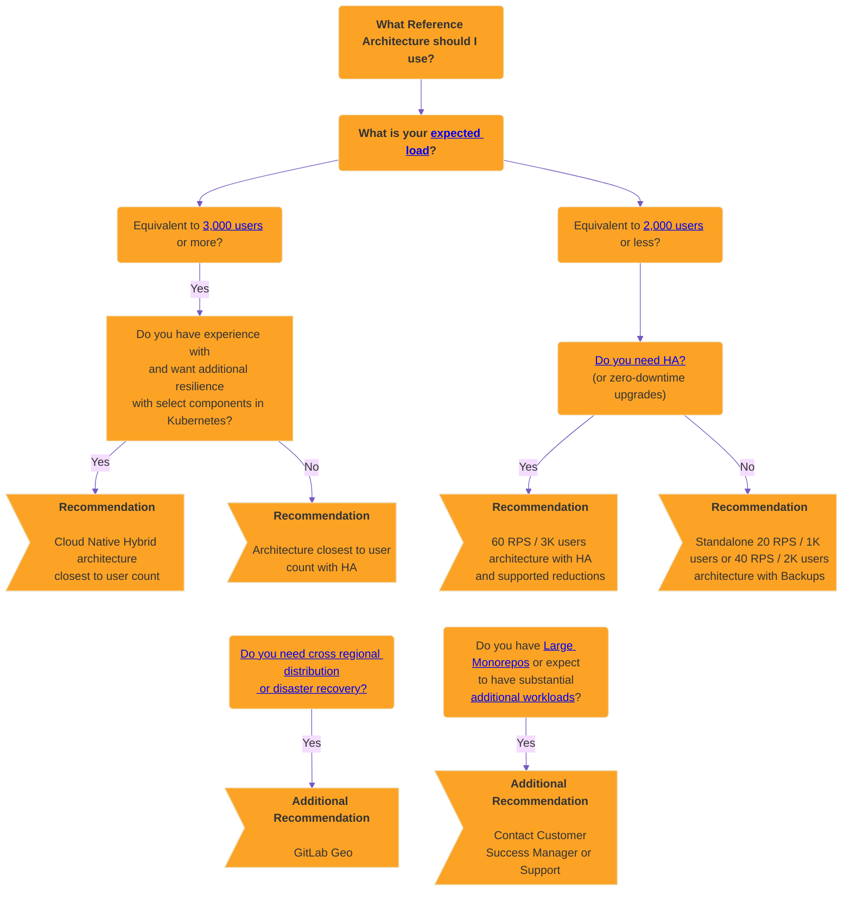

# Reference architectures

DETAILS:
**Tier:** Free, Premium, Ultimate
**Offering:** Self-managed

The GitLab Reference Architectures have been designed and tested by the
GitLab Test Platform and Support teams to provide recommended scalable and elastic deployments as starting points for target loads.

## Available reference architectures

The following Reference Architectures are available as recommended starting points for your environment.

The architectures are named in terms of peak load, based on user count or Requests per Second (RPS). Where the latter has been calculated based on average real data.

NOTE:
Each architecture has been designed to be [scalable and elastic](#scaling-an-environment). As such, they can be adjusted accordingly if required by your specific workload. This may be likely in known heavy scenarios such as using [large monorepos](#large-monorepos) or notable [additional workloads](#additional-workloads).

For details about what each Reference Architecture has been tested against, see the "Testing Methodology" section of each page.

### GitLab package (Omnibus)

Below is the list of Linux package based reference architectures:

- [Up to 20 RPS or 1,000 users](1k_users.md) _API: 20 RPS, Web: 2 RPS, Git (Pull): 2 RPS, Git (Push): 1 RPS_
- [Up to 40 RPS or 2,000 users](2k_users.md) _API: 40 RPS, Web: 4 RPS, Git (Pull): 4 RPS, Git (Push): 1 RPS_
- [Up to 60 RPS or 3,000 users](3k_users.md) _API: 60 RPS, Web: 6 RPS, Git (Pull): 6 RPS, Git (Push): 1 RPS_
- [Up to 100 RPS or 5,000 users](5k_users.md) _API: 100 RPS, Web: 10 RPS, Git (Pull): 10 RPS, Git (Push): 2 RPS_
- [Up to 200 RPS or 10,000 users](10k_users.md) _API: 200 RPS, Web: 20 RPS, Git (Pull): 20 RPS, Git (Push): 4 RPS_
- [Up to 500 RPS or 25,000 users](25k_users.md) _API: 500 RPS, Web: 50 RPS, Git (Pull): 50 RPS, Git (Push): 10 RPS_
- [Up to 1000 RPS or 50,000 users](50k_users.md) _API: 1000 RPS, Web: 100 RPS, Git (Pull): 100 RPS, Git (Push): 20 RPS_

### Cloud native hybrid

Below is a list of Cloud Native Hybrid reference architectures, where select recommended components can be run in Kubernetes:

- [Up to 40 RPS or 2,000 users](2k_users.md#cloud-native-hybrid-reference-architecture-with-helm-charts-alternative) _API: 40 RPS, Web: 4 RPS, Git (Pull): 4 RPS, Git (Push): 1 RPS_
- [Up to 60 RPS or 3,000 users](3k_users.md#cloud-native-hybrid-reference-architecture-with-helm-charts-alternative) _API: 60 RPS, Web: 6 RPS, Git (Pull): 6 RPS, Git (Push): 1 RPS_
- [Up to 100 RPS or 5,000 users](5k_users.md#cloud-native-hybrid-reference-architecture-with-helm-charts-alternative) _API: 100 RPS, Web: 10 RPS, Git (Pull): 10 RPS, Git (Push): 2 RPS_
- [Up to 200 RPS or 10,000 users](10k_users.md#cloud-native-hybrid-reference-architecture-with-helm-charts-alternative) _API: 200 RPS, Web: 20 RPS, Git (Pull): 20 RPS, Git (Push): 4 RPS_
- [Up to 500 RPS or 25,000 users](25k_users.md#cloud-native-hybrid-reference-architecture-with-helm-charts-alternative) _API: 500 RPS, Web: 50 RPS, Git (Pull): 50 RPS, Git (Push): 10 RPS_
- [Up to 1000 RPS or 50,000 users](50k_users.md#cloud-native-hybrid-reference-architecture-with-helm-charts-alternative) _API: 1000 RPS, Web: 100 RPS, Git (Pull): 100 RPS, Git (Push): 20 RPS_

## Before you start

The first choice to consider is whether a Self Managed approach is correct for you and your requirements.

Running any application in production is complex, and the same applies for GitLab. While we aim to make this as smooth as possible, there are still the general complexities. This depends on the design chosen, but typically you'll need to manage all aspects such as hardware, operating systems, networking, storage, security, GitLab itself, and more. This includes both the initial setup of the environment and the longer term maintenance.

As such, it's recommended that you have a working knowledge of running and maintaining applications in production when deciding on going down this route. If you aren't in this position, our [Professional Services](https://about.gitlab.com/services/#implementation-services) team offers implementation services, but for those who want a more managed solution long term, it's recommended to instead explore our other offerings such as [GitLab SaaS](../../subscriptions/gitlab_com/index.md) or [GitLab Dedicated](../../subscriptions/gitlab_dedicated/index.md).

If Self Managed is the approach you're considering, it's strongly encouraged to read through this page in full, in particular the [Deciding which architecture to use](#deciding-which-architecture-to-start-with), [Large monorepos](#large-monorepos) and [Additional workloads](#additional-workloads) sections.

## Deciding which architecture to start with

The Reference Architectures are designed to strike a balance between three important factors--performance, resilience and costs.

While they are designed to make it easier to set up GitLab at scale, it can still be a challenge to know which one meets your requirements and where to start accordingly.

As a general guide, **the more performant and/or resilient you want your environment to be, the more complex it is**.

This section explains the things to consider when picking a Reference Architecture to start with.

### Expected load (RPS / user count)

The first thing to check is what the expected peak load is your environment would be expected to serve.

Each architecture is described in terms of peak Requests per Second (RPS) or user count load. As detailed under the "Testing Methodology" section on each page, each architecture is tested
against its listed RPS for each endpoint type (API, Web, Git), which is the typical peak load of the given user count, both manual and automated.

It's strongly recommended finding out what peak RPS your environment will be expected to handle across endpoint types through existing metrics and to select the corresponding architecture as this is the most objective method to determine expected load.

Finding out the RPS can depend greatly on the specific environment setup and monitoring stack. Some potential options include:

- Through [GitLab Prometheus](../monitoring/prometheus/index.md#sample-prometheus-queries) with queries such as `sum(irate(gitlab_transaction_duration_seconds_count{controller!~'HealthController|MetricsController|'}[1m])) by (controller, action)`.
- Through other monitoring solutions.
- Through Load Balancer statistics.

Contact our [Support team](https://about.gitlab.com/support/) for further guidance if required.

#### If in doubt, pick the closest user count and scale accordingly

If it's not possible for you to find out the expected peak RPS then it's recommended to select based on user count to start and then monitor the environment
closely to confirm the RPS, whether the architecture is performing and [scale accordingly](#scaling-an-environment) as necessary.

### Standalone (non-HA)

For environments serving 2,000 or fewer users, we generally recommend a standalone approach by deploying a non-highly available single or multi-node environment. With this approach, you can employ strategies such as [automated backups](../../administration/backup_restore/backup_gitlab.md#configuring-cron-to-make-daily-backups) for recovery to provide a good level of RPO / RTO while avoiding the complexities that come with HA.

*[RTO]: Recovery time objective
*[RPO]: Recovery point objective

With standalone setups, especially single node environments, there are [various options available for installation](../../install/index.md) and management including [the ability to deploy directly via select cloud provider marketplaces](https://page.gitlab.com/cloud-partner-marketplaces.html) that reduce the complexity a little further.

### High Availability (HA)

High Availability ensures every component in the GitLab setup can handle failures through various mechanisms. However, to achieve this is complex, and the environments required can be sizable.

For environments serving 3,000 or more users we generally recommend that a HA strategy is used as at this level outages have a bigger impact against more users. All the architectures in this range have HA built in by design for this reason.

#### Do you need High Availability (HA)?

As mentioned above, achieving HA does come at a cost. The environment requirements are sizable as each component needs to be multiplied, which comes with additional actual and maintenance costs.

For a lot of our customers with fewer than 3,000 users, we've found a backup strategy is sufficient and even preferable. While this does have a slower recovery time, it also means you have a much smaller architecture and less maintenance costs as a result.

In general then, we'd only recommend you employ HA in the following scenarios:

- When you have 3,000 or more users.
- When GitLab being down would critically impact your workflow.

#### Scaled-down High Availability (HA) approaches

If you still need to have HA for a lower number of users, this can be achieved with an adjusted [3K architecture](3k_users.md#supported-modifications-for-lower-user-counts-ha).

#### Zero-downtime upgrades

[Zero-downtime upgrades](../../update/zero_downtime.md) are available for standard Reference Architecture environments with HA (Cloud Native Hybrid is [not supported](https://gitlab.com/groups/gitlab-org/cloud-native/-/epics/52)). This allows for an environment to stay up during an upgrade, but the process is more complex as a result and has some limitations as detailed in the documentation.

When going through this process it's worth noting that there may still be brief moments of downtime when the HA mechanisms take effect.

In most cases the downtime required for doing an upgrade shouldn't be substantial, so this is only recommended if it's a key requirement for you.

### Cloud Native Hybrid (Kubernetes HA)

As an additional layer of HA resilience you can deploy select components in Kubernetes, known as a Cloud Native Hybrid Reference Architecture. For stability
reasons, stateful components such as Gitaly [cannot be deployed in Kubernetes](#stateful-components-in-kubernetes).

This is an alternative and more **advanced** setup compared to a standard Reference Architecture. Running services in Kubernetes is well known to be complex. **This setup is only recommended** if you have strong working knowledge and experience in Kubernetes.

### GitLab Geo (Cross Regional Distribution / Disaster Recovery)

With [GitLab Geo](../geo/index.md), you can achieve distributed environments in
different regions with a full Disaster Recovery (DR) setup in place. GitLab Geo
requires at least two separate environments:

- One primary site.
- One or more secondary sites that serve as replicas.

If the primary site becomes unavailable, you can fail over to one of the secondary sites.

This **advanced and complex** setup should only be undertaken if DR is
a key requirement for your environment. You must also make additional decisions
on how each site is configured, such as if each secondary site would be the
same architecture as the primary, or if each site is configured for HA.

### Large monorepos / Additional workloads

If you have any [large monorepos](#large-monorepos) or significant [additional workloads](#additional-workloads), these can affect the performance of the environment notably and adjustments may be required depending on the context.

If either applies to you, it's encouraged for you to reach out to your [Customer Success Manager](https://handbook.gitlab.com/job-families/sales/customer-success-management/) or our [Support team](https://about.gitlab.com/support/)
for further guidance.

### Cloud provider services

For all the previously described strategies, you can run select GitLab components on equivalent cloud provider services such as the PostgreSQL database or Redis.

[For more information, see the recommended cloud providers and services](#recommended-cloud-providers-and-services).

### Decision Tree

Below you can find the above guidance in the form of a decision tree. It's recommended you read through the above guidance in full first before though.

## Requirements

Before implementing a reference architecture, refer to the following requirements and guidance.

### Supported CPUs

The reference architectures are built and tested across various cloud providers, primarily GCP and AWS, with
CPU targets being the lowest common denominator to ensure the widest range of compatibility:

- The [`n1` series](https://cloud.google.com/compute/docs/general-purpose-machines#n1_machines) for GCP.
- The [`m5` series](https://aws.amazon.com/ec2/instance-types/) for AWS.

Depending on other requirements such as memory or network bandwidth and cloud provider availability, different machine types are used accordingly throughout the architectures, but it is expected that the target CPUs above should perform well.

If you want, you can select a newer machine type series and have improved performance as a result.

Additionally, ARM CPUs are supported for Linux package environments and for any [Cloud Provider services](#cloud-provider-services) where applicable.

NOTE:
Any "burstable" instance types are not recommended due to inconsistent performance.

### Supported disk types

As a general guidance, most standard disk types are expected to work for GitLab, but be aware of the following specific call-outs:

- [Gitaly](../gitaly/index.md#disk-requirements) requires at least 8,000 input/output operations per second (IOPS) for read operations, and 2,000 IOPS for write operations.
- We don't recommend the use of any disk types that are "burstable" due to inconsistent performance.

Outside the above standard, disk types are expected to work for GitLab and the choice of each depends on your specific requirements around areas, such as durability or costs.

### Supported infrastructure

As a general guidance, GitLab should run on most infrastructure such as reputable Cloud Providers (AWS, GCP, Azure) and
their services, or self-managed (ESXi) that meet both:

- The specifications detailed in each reference architecture.
- Any requirements in this section.

However, this does not constitute a guarantee for every potential permutation.

See [Recommended cloud providers and services](index.md#recommended-cloud-providers-and-services) for more information.

### Large Monorepos

The reference architectures were tested with repositories of varying sizes that follow best practices.

**However, [large monorepos](../../user/project/repository/monorepos/index.md) (several gigabytes or more) can significantly impact the performance of Git and in turn the environment itself.**
Their presence, and how they are used, can put a significant strain on the entire system from Gitaly through to the underlying infrastructure.

WARNING:
If this applies to you, we strongly recommended referring to the linked documentation and reaching out to your [Customer Success Manager](https://handbook.gitlab.com/job-families/sales/customer-success-management/) or our [Support team](https://about.gitlab.com/support/) for further guidance.

As such, large monorepos come with notable cost. If you have such a repository we strongly recommend
the following guidance is followed to ensure the best chance of good performance and to keep costs in check:

- [Optimize the large monorepo](../../user/project/repository/monorepos/index.md#optimize-gitlab-settings). Using features such as
  [LFS](../../user/project/repository/monorepos/index.md#use-lfs-for-large-blobs) to not store binaries, and other approaches for reducing repository size, can
  dramatically improve performance and reduce costs.
- Depending on the monorepo, increased environment specifications may be required to compensate. Gitaly in particular will likely require additional resources along with Praefect, GitLab Rails, and Load Balancers. This depends notably on the monorepo itself and the usage against it.
- When the monorepo is significantly large (20 gigabytes or more) further additional strategies maybe required such as even further increased specifications or in some cases a separate Gitaly backend for the monorepo alone.
- Network and disk bandwidth is another potential consideration with large monorepos. In very heavy cases, it's possible to see bandwidth saturation if there's a high amount of concurrent clones (such as with CI). It's strongly recommended [reducing full clones wherever possible](../../user/project/repository/monorepos/index.md#reduce-concurrent-clones-in-cicd) in this scenario. Otherwise, additional environment specifications may be required to increase bandwidth, but this differs between cloud providers.

### Additional workloads

These reference architectures have been [designed and tested](index.md#validation-and-test-results) for standard GitLab
setups based on real data.

However, additional workloads can multiply the impact of operations by triggering follow-up actions.
You may need to adjust the suggested specifications to compensate if you use, for example:

- Security software on the nodes.
- Hundreds of concurrent CI jobs for [large repositories](../../user/project/repository/monorepos/index.md).
- Custom scripts that [run at high frequency](../logs/log_parsing.md#print-top-api-user-agents).
- [Integrations](../../integration/index.md) in many large projects.
- [Server hooks](../server_hooks.md).
- [System hooks](../system_hooks.md).

As a general rule, you should have robust monitoring in place to measure the impact of any additional workloads to
inform any changes needed to be made. It's also strongly encouraged for you to reach out to your [Customer Success Manager](https://handbook.gitlab.com/job-families/sales/customer-success-management/) or our [Support team](https://about.gitlab.com/support/)
for further guidance.

### Load Balancers

The Reference Architectures make use of up to two Load Balancers depending on the class:

- External Load Balancer - Serves traffic to any external facing components, primarily Rails.
- Internal Load Balancer - Serves traffic to select internal components that have been deployed in an HA fashion such as Praefect or PgBouncer.

The specifics on which load balancer to use, or its exact configuration is beyond the scope of GitLab documentation. The most common options
are to set up load balancers on machine nodes or to use a service such as one offered by Cloud Providers. If deploying a Cloud Native Hybrid environment the Charts can handle the set-up of the External Load Balancer via Kubernetes Ingress.

For each Reference Architecture class a base machine size has given to help get you started if you elect to deploy directly on machines, but these may need to be adjusted accordingly depending on the load balancer used and amount of workload. Of note machines can have varying [network bandwidth](#network-bandwidth) that should also be taken into consideration.

Note the following sections of additional guidance for Load Balancers.

#### Balancing algorithm

We recommend that a least-connection-based load balancing algorithm or equivalent is used wherever possible to ensure equal spread of calls to the nodes and good performance.

We don’t recommend the use of round-robin algorithms as they are known to not spread connections equally in practice.

#### Network Bandwidth

The total network bandwidth available to a load balancer when deployed on a machine can vary notably across Cloud Providers. In particular some Cloud Providers, like [AWS](https://docs.aws.amazon.com/AWSEC2/latest/UserGuide/ec2-instance-network-bandwidth.html), may operate on a burst system with credits to determine the bandwidth at any time.

The network bandwidth your environment's load balancers will require is dependent on numerous factors such as data shape and workload. The recommended base sizes for each Reference Architecture class have been selected based on real data but in some scenarios, such as consistent clones of [large monorepos](#large-monorepos), the sizes may need to be adjusted accordingly.

### No swap

Swap is not recommended in the reference architectures. It's a failsafe that impacts performance greatly. The
reference architectures are designed to have enough memory in most cases to avoid needing swap.

### Praefect PostgreSQL

[Praefect requires its own database server](../gitaly/praefect.md#postgresql) and
that to achieve full High Availability, a third-party PostgreSQL database solution is required.

We hope to offer a built-in solution for these restrictions in the future. In the meantime, a non-HA PostgreSQL server
can be set up using the Linux package as the specifications reflect. Refer to the following issues for more information:

- [`omnibus-gitlab#7292`](https://gitlab.com/gitlab-org/omnibus-gitlab/-/issues/7292).
- [`gitaly#3398`](https://gitlab.com/gitlab-org/gitaly/-/issues/3398).

## Recommended cloud providers and services

NOTE:
The following lists are non-exhaustive. Generally, other cloud providers not listed
here likely work with the same specs, but this hasn't been validated.
Additionally, when it comes to other cloud provider services not listed here,
it's advised to be cautious as each implementation can be notably different
and should be tested thoroughly before production use.

Through testing and real life usage, the Reference Architectures are recommended on the following cloud providers:

<table>
<thead>
  <tr>
    <th>Reference Architecture</th>
    <th>GCP</th>
    <th>AWS</th>
    <th>Azure</th>
    <th>Bare Metal</th>
  </tr>
</thead>
<tbody>
  <tr>
    <td>Linux package</td>
    <td>🟢</td>
    <td>🟢</td>
    <td>🟢1</td>
    <td>🟢</td>
  </tr>
  <tr>
    <td>Cloud Native Hybrid</td>
    <td>🟢</td>
    <td>🟢</td>
    <td></td>
    <td></td>
  </tr>
</tbody>
</table>

Additionally, the following cloud provider services are recommended for use as part of the Reference Architectures:

<table>
<thead>
  <tr>
    <th>Cloud Service</th>
    <th>GCP</th>
    <th>AWS</th>
    <th>Azure</th>
    <th>Bare Metal</th>
  </tr>
</thead>
<tbody>
  <tr>
    <td>Object Storage</td>
    <td>🟢 &nbsp; <a href="https://cloud.google.com/storage" target="_blank">Cloud Storage</a></td>
    <td>🟢 &nbsp; <a href="https://aws.amazon.com/s3/" target="_blank">S3</a></td>
    <td>🟢 &nbsp; <a href="https://azure.microsoft.com/en-gb/products/storage/blobs" target="_blank">Azure Blob Storage</a></td>
    <td>🟢 &nbsp; <a href="https://min.io/" target="_blank">MinIO</a></td>
  </tr>
  <tr>
    <td>Database</td>
    <td>🟢 &nbsp; <a href="https://cloud.google.com/sql" target="_blank" rel="noopener noreferrer">Cloud SQL1</a></td>
    <td>🟢 &nbsp; <a href="https://aws.amazon.com/rds/" target="_blank" rel="noopener noreferrer">RDS</a></td>
    <td>🟢 &nbsp; <a href="https://azure.microsoft.com/en-gb/products/postgresql/" target="_blank" rel="noopener noreferrer">Azure Database for PostgreSQL Flexible Server</a></td>
    <td></td>
  </tr>
  <tr>
    <td>Redis</td>
    <td>🟢 &nbsp; <a href="https://cloud.google.com/memorystore" target="_blank" rel="noopener noreferrer">Memorystore</a></td>
    <td>🟢 &nbsp; <a href="https://aws.amazon.com/elasticache/" target="_blank" rel="noopener noreferrer">ElastiCache</a></td>
      <td>🟢 &nbsp; <a href="https://azure.microsoft.com/en-gb/products/cache" target="_blank" rel="noopener noreferrer">Azure Cache for Redis (Premium)</a></td>
    <td></td>
  </tr>
</tbody>
</table>

<!-- Disable ordered list rule https://github.com/DavidAnson/markdownlint/blob/main/doc/Rules.md#md029---ordered-list-item-prefix -->
<!-- markdownlint-disable MD029 -->
1. The [Enterprise Plus edition](https://cloud.google.com/sql/docs/editions-intro) for GCP Cloud SQL is generally recommended for optimal performance. This recommendation is especially so for larger environments (500 RPS / 25k users or higher). Max connections may need to be adjusted higher than the service's defaults depending on workload.
2. It's strongly recommended deploying the [Premium tier of Azure Cache for Redis](https://learn.microsoft.com/en-us/azure/azure-cache-for-redis/cache-overview#service-tiers) to ensure good performance.
<!-- markdownlint-enable MD029 -->

### Recommendation notes for the database services

[When selecting to use an external database service](../postgresql/external.md), it should run a standard, performant, and [supported version](../../install/requirements.md#postgresql).

If you choose to use a third party external service:

1. The HA Linux package PostgreSQL setup encompasses PostgreSQL, PgBouncer and Consul. All of these components would no longer be required when using a third party external service.
1. The number of nodes required to achieve HA may differ depending on the service compared to the Linux package and doesn't need to match accordingly.
1. It's recommended in general to enable Read Replicas for [Database Load Balancing](../postgresql/database_load_balancing.md) if possible, matching the node counts for the standard Linux package deployment. This recommendation is especially so for larger environments (over 200 RPS / 10k users).
1. Ensure that if a pooler is offered as part of the service that it can handle the total load without bottlenecking.
   For example, Azure Database for PostgreSQL Flexible Server can optionally deploy a PgBouncer pooler in front of the Database, but PgBouncer is single threaded, so this in turn may cause bottlenecking. However, if using Database Load Balancing, this could be enabled on each node in distributed fashion to compensate.
1. If [GitLab Geo](../geo/index.md) is to be used the service will need to support Cross Region replication.

#### Unsupported database services

Several database cloud provider services are known not to support the above or have been found to have other issues and aren't recommended:

- [Amazon Aurora](https://aws.amazon.com/rds/aurora/) is incompatible and not supported. See [14.4.0](../../update/versions/gitlab_14_changes.md#1440) for more details.
- [Azure Database for PostgreSQL Single Server](https://azure.microsoft.com/en-gb/products/postgresql/#overview) is not supported as the service is now deprecated and runs on an unsupported version of PostgreSQL. It was also found to have notable performance and stability issues.
- [Google AlloyDB](https://cloud.google.com/alloydb) and [Amazon RDS Multi-AZ DB cluster](https://docs.aws.amazon.com/AmazonRDS/latest/UserGuide/multi-az-db-clusters-concepts.html) have not been tested and are not recommended. Both solutions are specifically not expected to work with GitLab Geo.
  - [Amazon RDS Multi-AZ DB instance](https://docs.aws.amazon.com/AmazonRDS/latest/UserGuide/Concepts.MultiAZSingleStandby.html) is a separate product and is supported.

### Recommendation notes for the Redis services

[When selecting to use an external Redis service](../redis/replication_and_failover_external.md#redis-as-a-managed-service-in-a-cloud-provider), it should run a standard, performant, and supported version. This specifically must not be run in [Cluster mode](../../install/requirements.md#redis) as this is unsupported by GitLab.

Redis is primarily single threaded. For environments targeting up to 200 RPS / 10,000 users or higher, separate out the instances as specified into Cache and Persistent data to achieve optimum performance at this scale.

### Recommendation notes for Object Storage

GitLab has been tested against [various Object Storage providers](../object_storage.md#supported-object-storage-providers) that are expected to work.

As a general guidance, it's recommended to use a reputable solution that has full S3 compatibility.

## Deviating from the suggested reference architectures

As a general guideline, the further away you move from the reference architectures,
the harder it is to get support for it. With any deviation, you're introducing
a layer of complexity that adds challenges to finding out where potential
issues might lie.

The reference architectures use the official Linux packages or [Helm Charts](https://docs.gitlab.com/charts/) to
install and configure the various components. The components are
installed on separate machines (virtualized or bare metal), with machine hardware
requirements listed in the "Configuration" column and equivalent VM standard sizes listed
in GCP/AWS/Azure columns of each [available reference architecture](#available-reference-architectures).

Running components on Docker (including Docker Compose) with the same specs should be fine, as Docker is well known in terms of support.
However, it is still an additional layer and may still add some support complexities, such as not being able to run `strace` easily in containers.

### Unsupported designs

While we endeavour to try and have a good range of support for GitLab environment designs, there are certain approaches we know definitively not to work, and as a result are not supported. Those approaches are detailed in the following sections.

#### Stateful components in Kubernetes

[Running stateful components in Kubernetes, such as Gitaly Cluster, is not supported](https://docs.gitlab.com/charts/installation/#configure-the-helm-chart-to-use-external-stateful-data).

Gitaly Cluster is only supported on conventional virtual machines. Kubernetes enforces strict memory restrictions, but Git memory usage is unpredictable, which
can cause sporadic OOM termination of Gitaly pods, leading to significant disruptions and potential data loss. For this reason and others, Gitaly is not tested
or supported in Kubernetes. For more information, see [epic 6127](https://gitlab.com/groups/gitlab-org/-/epics/6127).

This also applies to other third-party stateful components such as Postgres and Redis, but you can explore other third-party solutions for those components if desired such as supported Cloud Provider services unless called out specifically as unsupported.

#### Autoscaling of stateful nodes

As a general guidance, only _stateless_ components of GitLab can be run in Autoscaling groups, namely GitLab Rails
and Sidekiq. Other components that have state, such as Gitaly, are not supported in this fashion (for more information, see [issue 2997](https://gitlab.com/gitlab-org/gitaly/-/issues/2997)).

This also applies to other third-party stateful components such as Postgres and Redis, but you can explore other third-party solutions for those components if desired such as supported Cloud Provider services unless called out specifically as unsupported.

However, [Cloud Native Hybrid setups](#cloud-native-hybrid) are generally preferred over ASGs as certain components such as like database migrations and [Mailroom](../incoming_email.md) can only be run on one node, which is handled better in Kubernetes.

#### Spreading one environment over multiple data centers

Deploying one GitLab environment over multiple data centers is not supported due to potential split brain edge cases
if a data center were to go down. For example, several components of the GitLab setup, namely Consul, Redis Sentinel and Praefect require an odd number quorum to function correctly and splitting over multiple data centers can impact this notably.

For deploying GitLab over multiple data centers or regions we offer [GitLab Geo](../geo/index.md) as a comprehensive solution.

## Validation and test results

The [Test Platform team](https://handbook.gitlab.com/handbook/engineering/quality/)
does regular smoke and performance tests for the reference architectures to ensure they
remain compliant.

### Why we perform the tests

The Quality Department has a focus on measuring and improving the performance
of GitLab, and creating and validating reference architectures that
self-managed customers can rely on as performant configurations.

For more information, see our [handbook page](https://handbook.gitlab.com/handbook/engineering/infrastructure/test-platform/performance-and-scalability/).

### How we perform the tests

Testing occurs against all reference architectures and cloud providers in an automated and ad-hoc fashion. This is done by two tools:

- The [GitLab Environment Toolkit](https://gitlab.com/gitlab-org/gitlab-environment-toolkit) Terraform and Ansible scripts for building the environments.
- The [GitLab Performance Tool](https://gitlab.com/gitlab-org/quality/performance) for performance testing.

Network latency on the test environments between components on all Cloud Providers were measured at <5 ms. This is shared as an observation and not as an implicit recommendation.

We aim to have a "test smart" approach where architectures tested have a good range that can also apply to others. Testing focuses on a 10k Linux package
installation on GCP as the testing has shown this is a good bellwether for the other architectures and cloud providers and Cloud Native Hybrids.

The Standard Reference Architectures are designed to be platform-agnostic, with everything being run on VMs through [the Linux package](https://docs.gitlab.com/omnibus/). While testing occurs primarily on GCP, ad-hoc testing has shown that they perform similarly on hardware with equivalent specs on other Cloud Providers or if run on premises (bare-metal).

Testing on these reference architectures is performed with the
[GitLab Performance Tool](https://gitlab.com/gitlab-org/quality/performance)
at specific coded workloads, and the throughputs used for testing are
calculated based on sample customer data. Select the
[reference architecture](#available-reference-architectures) that matches your scale.

Each endpoint type is tested with the following number of requests per second (RPS)
per 1,000 users:

- API: 20 RPS
- Web: 2 RPS
- Git (Pull): 2 RPS
- Git (Push): 0.4 RPS (rounded to the nearest integer)

The above RPS targets were selected based on real customer data of total environmental loads corresponding to the user count, including CI and other workloads.

### How to interpret the results

NOTE:
Read our blog post on [how our QA team leverages GitLab performance testing tool](https://about.gitlab.com/blog/2020/02/18/how-were-building-up-performance-testing-of-gitlab/).

Testing is done publicly, and all results are shared.

The following table details the testing done against the reference architectures along with the frequency and results. Additional testing is continuously evaluated, and the table is updated accordingly.

<table class="test-coverage">
  <col>
  <colgroup span="2"></colgroup>
  <colgroup span="2"></colgroup>
  <tr>
    <th rowspan="2">Reference Architecture</th>
    <th style="text-align: center" colspan="2" scope="colgroup">GCP (* also proxy for Bare-Metal)</th>
    <th style="text-align: center" colspan="2" scope="colgroup">AWS</th>
    <th style="text-align: center" colspan="2" scope="colgroup">Azure</th>
  </tr>
  <tr>
    <th scope="col">Linux package</th>
    <th scope="col">Cloud Native Hybrid</th>
    <th scope="col">Linux package</th>
    <th scope="col">Cloud Native Hybrid</th>
    <th scope="col">Linux package</th>
  </tr>
    <tr>
    <th scope="row">1k</th>
    <td><a href="https://gitlab.com/gitlab-org/quality/performance/-/wikis/Benchmarks/Latest/1k">Weekly</a></td>
    <td style="background-color:lightgrey"></td>
    <td style="background-color:lightgrey"></td>
    <td style="background-color:lightgrey"></td>
    <td style="background-color:lightgrey"></td>
  </tr>
  <tr>
    <th scope="row">2k</th>
    <td><a href="https://gitlab.com/gitlab-org/quality/performance/-/wikis/Benchmarks/Latest/2k">Weekly</a></td>
    <td style="background-color:lightgrey"></td>
    <td style="background-color:lightgrey"></td>
    <td style="background-color:lightgrey"></td>
    <td><i>Planned</i></td>
  </tr>
  <tr>
    <th scope="row">3k</th>
    <td><a href="https://gitlab.com/gitlab-org/quality/performance/-/wikis/Benchmarks/Latest/3k">Weekly</a></td>
    <td style="background-color:lightgrey"></td>
    <td style="background-color:lightgrey"></td>
    <td><a href="https://gitlab.com/gitlab-org/quality/performance/-/wikis/Benchmarks/Latest/3k_hybrid_aws_services">Weekly</a></td>
    <td style="background-color:lightgrey"></td>
  </tr>
  <tr>
    <th scope="row">5k</th>
    <td><a href="https://gitlab.com/gitlab-org/quality/performance/-/wikis/Benchmarks/Latest/5k">Weekly</a></td>
    <td style="background-color:lightgrey"></td>
    <td style="background-color:lightgrey"></td>
    <td style="background-color:lightgrey"></td>
    <td style="background-color:lightgrey"></td>
  </tr>
  <tr>
    <th scope="row">10k</th>
    <td><a href="https://gitlab.com/gitlab-org/quality/performance/-/wikis/Benchmarks/Latest/10k">Daily</a></td>
    <td><a href="https://gitlab.com/gitlab-org/quality/performance/-/wikis/Benchmarks/Latest/10k_hybrid">Weekly</a></td>
    <td><a href="https://gitlab.com/gitlab-org/quality/performance/-/wikis/Benchmarks/Latest/10k_aws">Weekly</a></td>
    <td><a href="https://gitlab.com/gitlab-org/quality/performance/-/wikis/Benchmarks/Latest/10k_hybrid_aws_services">Weekly</a></td>
    <td style="background-color:lightgrey"></td>
  </tr>
  <tr>
    <th scope="row">25k</th>
    <td><a href="https://gitlab.com/gitlab-org/quality/performance/-/wikis/Benchmarks/Latest/25k">Weekly</a></td>
    <td style="background-color:lightgrey"></td>
    <td style="background-color:lightgrey"></td>
    <td style="background-color:lightgrey"></td>
    <td style="background-color:lightgrey"></td>
  </tr>
  <tr>
    <th scope="row">50k</th>
    <td><a href="https://gitlab.com/gitlab-org/quality/performance/-/wikis/Benchmarks/Latest/50k">Weekly</a></td>
    <td style="background-color:lightgrey"></td>
    <td style="background-color:lightgrey"></td>
    <td style="background-color:lightgrey"></td>
    <td style="background-color:lightgrey"></td>
  </tr>
</table>

## Cost calculator templates

As a starting point, the following table lists initial compute calculator cost templates for the different reference architectures across GCP, AWS, and Azure by using each cloud provider's official calculator.

However, be aware of the following caveats:

- These are only rough estimate compute templates for the Linux package architectures.
- They do not take into account dynamic elements such as disk, network or object storage - Which can notably impact costs.
- Due to the nature of Cloud Native Hybrid, it's not possible to give a static cost calculation for that deployment.
- Committed use discounts are applied if they are defaulted as such for the cloud provider calculator in question.
- Bare-metal costs are also not included here as it varies widely depending on each configuration.

To get an accurate estimate of costs for your specific environment you must take the closest template and adjust it accordingly to match the specs and your expected usage.

<table class="test-coverage">
  <col>
  <colgroup span="2"></colgroup>
  <colgroup span="2"></colgroup>
  <tr>
    <th rowspan="2">Reference Architecture</th>
    <th style="text-align: center" scope="colgroup">GCP</th>
    <th style="text-align: center" scope="colgroup">AWS</th>
    <th style="text-align: center" scope="colgroup">Azure</th>
  </tr>
  <tr>
    <th scope="col">Linux package</th>
    <th scope="col">Linux package</th>
    <th scope="col">Linux package</th>
  </tr>
    <tr>
    <th scope="row">1k</th>
    <td><a href="https://cloud.google.com/products/calculator/estimate-preview/02846ea4-635b-422f-a636-a5eff9bf9a2f?hl=en">Calculated cost</a></td>
    <td><a href="https://calculator.aws/#/estimate?id=b51f178f4403b69a63f6eb33ea425f82de3bf249">Calculated cost</a></td>
    <td><a href="https://azure.microsoft.com/en-us/pricing/calculator/?shared-estimate=1adf30bef7e34ceba9efa97c4470417b">Calculated cost</a></td>
  </tr>
  <tr>
    <th scope="row">2k</th>
    <td><a href="https://cloud.google.com/products/calculator/estimate-preview/017fa74b-7b2c-4334-b537-5201d4fc2de4?hl=en">Calculated cost</a></td>
    <td><a href="https://calculator.aws/#/estimate?id=3b3e3b81953737132789591d3a5179521943f1c0">Calculated cost</a></td>
    <td><a href="https://azure.microsoft.com/en-us/pricing/calculator/?shared-estimate=25f66c35ba454bb98fb4034a8a50bb8c">Calculated cost</a></td>
  </tr>
  <tr>
    <th scope="row">3k</th>
    <td><a href="https://cloud.google.com/products/calculator/estimate-preview/bc5c06ca-6d6b-423f-a923-27bafa8ac3da?hl=en">Calculated cost</a></td>
    <td><a href="https://calculator.aws/#/estimate?id=7e94eb8712f6845fdeb05e61f459598a91dac3cb">Calculated cost</a></td>
    <td><a href="https://azure.microsoft.com/en-us/pricing/calculator/?shared-estimate=24ac11fd947a4985ae9c9a5142649ad3">Calculated cost</a></td>
  </tr>
  <tr>
    <th scope="row">5k</th>
    <td><a href="https://cloud.google.com/products/calculator/estimate-preview/ec788d9c-1377-4d03-b0e3-0f7950391a27?hl=en">Calculated cost</a></td>
    <td><a href="https://calculator.aws/#/estimate?id=ad4c9db623a214c92d780cd9dff33f444d62cf02">Calculated cost</a></td>
    <td><a href="https://azure.microsoft.com/en-us/pricing/calculator/?shared-estimate=bcf23017ddfd40649fdc885cacd08d0c">Calculated cost</a></td>
  </tr>
  <tr>
    <th scope="row">10k</th>
    <td><a href="https://cloud.google.com/products/calculator/estimate-preview/9ef6f849-833b-4f2f-911e-979f5a491366?hl=en">Calculated cost</a></td>
    <td><a href="https://calculator.aws/#/estimate?id=3e2970f919915a6337acea76a9f07655a1ecda4a">Calculated cost</a></td>
    <td><a href="https://azure.microsoft.com/en-us/pricing/calculator/?shared-estimate=5748068be4864af6a34efb1cde685fa1">Calculated cost</a></td>
  </tr>
  <tr>
    <th scope="row">25k</th>
    <td><a href="https://cloud.google.com/products/calculator/estimate-preview/6655e1d7-42ae-4f01-98cb-f3a29cf62a15?hl=en">Calculated cost</a></td>
    <td><a href="https://calculator.aws/#/estimate?id=32acaeaa93366110cd5fbf98a66a8a141db7adcb">Calculated cost</a></td>
    <td><a href="https://azure.microsoft.com/en-us/pricing/calculator/?shared-estimate=24f878f20ee64b5cb64de459d34c8128">Calculate cost</a></td>
  </tr>
  <tr>
    <th scope="row">50k</th>
    <td><a href="https://cloud.google.com/products/calculator/estimate-preview/9128a9e9-25a2-459e-9480-edc0264d4b18?hl=en">Calculated cost</a></td>
    <td><a href="https://calculator.aws/#/estimate?id=5a0bba1338e3577d627ec97833dbc80ac9615562">Calculated cost</a></td>
    <td><a href="https://azure.microsoft.com/en-us/pricing/calculator/?shared-estimate=4dd065eea2194d70b44d6d897e81f460">Calculated cost</a></td>
  </tr>
</table>

## Maintaining a Reference Architecture environment

Maintaining a Reference Architecture environment is generally the same as any other GitLab environment is generally covered in other sections of this documentation.

In this section you'll find links to documentation for relevant areas and any specific Reference Architecture notes.

### Scaling an environment

The Reference Architectures have been designed as a starting point and are elastic and scalable throughout. It's more likely than not that you may want to adjust the environment for your specific needs after deployment for reasons such as additional performance capacity or reduced costs. This is expected and, as such, scaling can be done iteratively or wholesale to the next size of architecture depending on if metrics suggest a component is being exhausted.

NOTE:
If you're seeing a component continuously exhausting it's given resources it's strongly recommended for you to reach out to our [Support team](https://about.gitlab.com/support/) before performing any scaling. This is especially so if you're planning to scale any component significantly.

For most components vertical and horizontal scaling can be applied as usual. However, before doing so, be aware of the below caveats:

- When scaling Puma or Sidekiq vertically the amount of workers will need to be adjusted to use the additional specs. Puma will be scaled automatically on the next reconfigure but Sidekiq will need [its configuration changed beforehand](../sidekiq/extra_sidekiq_processes.md#start-multiple-processes).
- Redis and PgBouncer are primarily single threaded. If these components are seeing CPU exhaustion they may need to be scaled out horizontally.
- Scaling certain components significantly can result in notable knock on effects that affect the performance of the environment. [Refer to the dedicated section below for more guidance](#scaling-knock-on-effects).

Conversely, if you have robust metrics in place that show the environment is over-provisioned, you can scale downwards similarly.
You should take an iterative approach when scaling downwards, however, to ensure there are no issues.

#### Scaling knock on effects

In some cases scaling a component significantly may result in knock on effects for downstream components, impacting performance. The Reference Architectures were designed with balance in mind to ensure components that depend on each other are congruent in terms of specs. As such you may find when notably scaling a component that it's increase may result in additional throughput being passed to the other components it depends on and that they, in turn, may need to be scaled as well.

NOTE:
The Reference Architectures have been designed to have elasticity to accommodate an upstream component being scaled. However, it's still generally recommended for you to reach out to our [Support team](https://about.gitlab.com/support/) before you make any significant changes to the environment to be safe.

The following components can impact others when they have been significantly scaled:

- Puma and Sidekiq - Notable scale ups of either Puma or Sidekiq workers will result in higher concurrent connections to the internal load balancer, PostgreSQL (via PgBouncer if present), Gitaly (via Praefect if present) and Redis respectively.
  - Redis is primarily single threaded and in some cases may need to be split up into different instances (Cache / Persistent) if the increased throughput causes CPU exhaustion if a combined cluster is currently being used.
  - PgBouncer is also single threaded but a scale out might result in a new pool being added that in turn might increase the total connections to Postgres. It's strongly recommended to only do this if you have experience in managing Postgres connections and to seek assistance if in doubt.
- Gitaly Cluster / PostgreSQL - A notable scale out of additional nodes can have a detrimental effect on the HA system and performance due to increased replication calls to the primary node.

#### Scaling from a non-HA to an HA architecture

While in most cases vertical scaling is only required to increase an environment's resources, if you are moving to an HA environment
additional steps are required for the following components to switch over to their HA forms respectively by following the given
documentation for each as follows

- [Redis to multi-node Redis w/ Redis Sentinel](../redis/replication_and_failover.md#switching-from-an-existing-single-machine-installation)
- [Postgres to multi-node Postgres w/ Consul + PgBouncer](../postgresql/moving.md)
- [Gitaly to Gitaly Cluster w/ Praefect](../gitaly/index.md#migrate-to-gitaly-cluster)

### Upgrades

Upgrades for a Reference Architecture environment is the same as any other GitLab environment.
The main [Upgrade GitLab](../../update/index.md) section has detailed steps on how to approach this.

[Zero-downtime upgrades](#zero-downtime-upgrades) are also available.

NOTE:
You should upgrade a Reference Architecture in the same order as you created it.

### Monitoring

There are numerous options available to monitor your infrastructure, and [GitLab itself](../monitoring/index.md), and you should refer to your selected monitoring solution's documentation for more information.

Of note, the GitLab application is bundled with [Prometheus and various Prometheus compatible exporters](../monitoring/prometheus/index.md) that could be hooked into your solution.

## Update history

Below is a history of notable updates for the Reference Architectures (2021-01-01 onward, ascending order), which we aim to keep updated at least once per quarter.

You can find a full history of changes [on the GitLab project](https://gitlab.com/gitlab-org/gitlab/-/merge_requests?scope=all&state=merged&label_name%5B%5D=Reference%20Architecture&label_name%5B%5D=documentation).

**2024:**

- [2024-08](https://gitlab.com/gitlab-org/gitlab/-/merge_requests/164181): Updated Expected Load section with some more examples on how to calculate RPS.
- [2024-08](https://gitlab.com/gitlab-org/gitlab/-/merge_requests/163478): Updated Redis configuration on 40 RPS / 2k User page to have correct Redis configuration.
- [2024-08](https://gitlab.com/gitlab-org/gitlab/-/merge_requests/163506): Updated Sidekiq configuration for Prometheus in Monitoring node on 2k.
- [2024-08](https://gitlab.com/gitlab-org/gitlab/-/merge_requests/162144): Added Next Steps breadcrumb section to the pages to help discoverability of additional features.
- [2024-05](https://gitlab.com/gitlab-org/gitlab/-/merge_requests/153716): Updated the 60 RPS / 3k User and 100 RPS / 5k User pages to have latest Redis guidance on co-locating Redis Sentinel with Redis itself.
- [2024-05](https://gitlab.com/gitlab-org/gitlab/-/merge_requests/153579): Renamed `Cost to run` section to `Cost calculator templates` to better reflect the calculators are only a starting point and need to be adjusted with specific usage to give more accurate cost estimates.
- [2024-04](https://gitlab.com/gitlab-org/gitlab/-/merge_requests/149878): Updated recommended sizings for Webservice nodes for Cloud Native Hybrids on GCP. Also adjusted NGINX pod recommendation to be run on Webservice node pool as a DaemonSet.
- [2024-04](https://gitlab.com/gitlab-org/gitlab/-/merge_requests/149528): Updated 20 RPS / 1,000 User architecture specs to follow recommended memory target of 16 GB.
- [2024-04](https://gitlab.com/gitlab-org/gitlab/-/merge_requests/148313): Updated Reference Architecture titles to include RPS for further clarity and to help right sizing.
- [2024-02](https://gitlab.com/gitlab-org/gitlab/-/merge_requests/145436): Updated recommended sizings for Load Balancer nodes if deployed on VMs. Also added notes on network bandwidth considerations.
- [2024-02](https://gitlab.com/gitlab-org/gitlab/-/merge_requests/143539): Remove the Sidekiq Max Concurrency setting in examples as this is deprecated and no longer required to be set explicitly.
- [2024-02](https://gitlab.com/gitlab-org/gitlab/-/merge_requests/143539): Adjusted the Sidekiq recommendations on 2k to disable Sidekiq on Rails nodes and updated architecture diagram.
- [2024-01](https://gitlab.com/gitlab-org/gitlab/-/merge_requests/140465): Updated recommendations for Azure for all Reference Architecture sizes and latest cloud services.

**2023:**

- [2023-12-12](https://gitlab.com/gitlab-org/gitlab/-/merge_requests/139557): Updated notes on Load Balancers to be more reflective that any reputable offering is expected to work.
- [2023-11-03](https://gitlab.com/gitlab-org/gitlab/-/merge_requests/133457): Expanded details on what each Reference Architecture is designed for, the testing methodology used and added details on how to scale environments.
- [2023-11-03](https://gitlab.com/gitlab-org/gitlab/-/merge_requests/134632): Added expanded notes on disk types, object storage and monitoring.
- [2023-10-25](https://gitlab.com/gitlab-org/gitlab/-/merge_requests/134518): Adjusted Sidekiq configuration example to use Linux Package role.
- [2023-10-15](https://gitlab.com/gitlab-org/gitlab/-/merge_requests/133835): Adjusted the Sidekiq recommendations to include a separate node for 2k and tweaks to instance type and counts for 3k and 5k.
- [2023-10-08](https://gitlab.com/gitlab-org/gitlab/-/merge_requests/132270): Added more expanded notes throughout to warn about the use of Large Monorepos and their impacts for increased awareness.
- [2023-10-04](https://gitlab.com/gitlab-org/gitlab/-/merge_requests/133258): Updated name of Task Runner pod to its new name of Toolbox.
- [2023-10-02](https://gitlab.com/gitlab-org/gitlab/-/merge_requests/132961): Expanded guidance on using an external service for Redis further, in particular for separated Cache and Persistent services with 10k and up.
- [2023-09-21](https://gitlab.com/gitlab-org/gitlab/-/merge_requests/132289): Expanded details on the challenges of running Gitaly in Kubernetes.
- [2023-09-20](https://gitlab.com/gitlab-org/gitlab/-/merge_requests/132275): Removed references to Grafana after deprecation and removal.
- [2023-08-30](https://gitlab.com/gitlab-org/gitlab/-/merge_requests/130470): Expanded section on Geo under the Decision Tree.
- [2023-08-08](https://gitlab.com/gitlab-org/gitlab/-/merge_requests/128529): Switch config example to use the Sidekiq role for Linux package.
- [2023-08-03](https://gitlab.com/gitlab-org/gitlab/-/merge_requests/128374): Fixed an AWS Machine type typo for the 50k architecture.
- [2023-06-30](https://gitlab.com/gitlab-org/gitlab/-/merge_requests/125017): Update PostgreSQL configuration examples to remove a now unneeded setting to instead use the Linux package default.
- [2023-06-30](https://gitlab.com/gitlab-org/gitlab/-/merge_requests/125017): Add explicit example on main page that reflects Google Memorystore is recommended.
- [2023-06-11](https://gitlab.com/gitlab-org/gitlab/-/merge_requests/122063): Fix IP examples for the 3k and 5k architectures.
- [2023-05-25](https://gitlab.com/gitlab-org/gitlab/-/merge_requests/121545): Expand notes on usage of external Cloud Provider Services and the recommendation of separated Redis servers for 10k environments and up.
- [2023-05-03](https://gitlab.com/gitlab-org/gitlab/-/merge_requests/119224): Update documentation to reflect correct requirement of Redis 6 instead of 5.
- [2023-04-28](https://gitlab.com/gitlab-org/gitlab/-/merge_requests/114877): Add a note that the Azure Active Directory authentication method is not supported for use with Azure PostgreSQL Flexible service.
- [2023-03-23](https://gitlab.com/gitlab-org/gitlab/-/merge_requests/114877): Add more details about known unsupported designs.
- [2023-03-16](https://gitlab.com/gitlab-org/gitlab/-/merge_requests/114872): Update Redis configuration examples for multi-node to have correct config to ensure all components can connect.
- [2023-03-15](https://gitlab.com/gitlab-org/gitlab/-/merge_requests/110784): Update Gitaly configuration examples to the new format.
- [2023-03-14](https://gitlab.com/gitlab-org/gitlab/-/merge_requests/114495): Update cost estimates to no longer include NFS VMs.
- [2023-02-17](https://gitlab.com/gitlab-org/gitlab/-/merge_requests/110379): Update Praefect configuration examples to the new format.
- [2023-02-14](https://gitlab.com/gitlab-org/gitlab/-/merge_requests/109798): Add examples of what automations may be considered additional workloads.
- [2023-02-13](https://gitlab.com/gitlab-org/gitlab/-/merge_requests/111018): Add a new 'Before you Start' section that gives more context about what's involved with running production software self-managed. Also added more details for Standalone setups and Cloud Provider services in the Decision Tree section.
- [2023-02-01](https://gitlab.com/gitlab-org/gitlab/-/merge_requests/110641): Switch to use more common "complex" terminology instead of less known "involved".
- [2023-01-31](https://gitlab.com/gitlab-org/gitlab/-/merge_requests/110328): Expand and centralize the requirements' section on the main page.
- [2023-01-26](https://gitlab.com/gitlab-org/gitlab/-/merge_requests/110183): Add notes on migrating Git Data from NFS, that object data is still supported on NFS and handling SSH keys correctly across multiple Rails nodes.

**2022:**

- [2022-12-14](https://gitlab.com/gitlab-org/gitlab/-/merge_requests/105451): Remove guidance for using NFS for Git data as support for this is now ended with `15.6` onwards.
- [2022-12-12](https://gitlab.com/gitlab-org/gitlab/-/merge_requests/106826): Add note to clarify difference between Amazon RDS Multi-AZ DB _cluster_ and _instance_, with the latter being supported. Also increase PostgreSQL max connections setting to new default of `500`.
- [2022-12-12](https://gitlab.com/gitlab-org/gitlab/-/merge_requests/106695): Update Sidekiq max concurrency configuration to match new default of `20`.
- [2022-11-16](https://gitlab.com/gitlab-org/gitlab/-/merge_requests/104236): Correct guidance for Praefect and Gitaly in reduced 3k architecture section that an odd number quorum is required.
- [2022-11-15](https://gitlab.com/gitlab-org/gitlab/-/merge_requests/103623): Add guidance on how to handle GitLab Secrets in Cloud Native Hybrids and further links to the GitLab Charts documentation.
- [2022-11-14](https://gitlab.com/gitlab-org/gitlab/-/merge_requests/103767): Fix a typo with Sidekiq configuration for the 10k architecture.
- [2022-11-09](https://gitlab.com/gitlab-org/gitlab/-/merge_requests/102746): Add guidance on large monorepos and additional workloads impact on performance. Also expanded Load Balancer guidance around SSL and a recommendation for least connection based routing methods.
- [2022-10-18](https://gitlab.com/gitlab-org/gitlab/-/merge_requests/100826): Adjust Object Storage guidance to make it clearer it's recommended over NFS.
- [2022-10-11](https://gitlab.com/gitlab-org/gitlab/-/merge_requests/100305): Update guidance for Azure to recommend up to 2k only due to performance issues.
- [2022-09-27](https://gitlab.com/gitlab-org/gitlab/-/merge_requests/98204): Add Decision Tree section to help users better decide what architecture to use.
- [2022-09-22](https://gitlab.com/gitlab-org/gitlab/-/merge_requests/98263): Add explicit step to enable Incremental Logging when only Object Storage is being used.
- [2022-09-22](https://gitlab.com/gitlab-org/gitlab/-/merge_requests/98184): Expand guidance on recommended cloud providers and services.
- [2022-09-09](https://gitlab.com/gitlab-org/gitlab/-/merge_requests/97245): Expand Object Storage guidance and updated that NFS support for Git data ends with `15.6`.
- [2022-08-24](https://gitlab.com/gitlab-org/gitlab/-/merge_requests/96150): Add a clearer note that Gitaly Cluster is not supported in Kubernetes.
- [2022-08-24](https://gitlab.com/gitlab-org/gitlab/-/merge_requests/96021): Add section on supported CPUs and types.
- [2022-08-18](https://gitlab.com/gitlab-org/gitlab/-/merge_requests/95713): Update architecture tables to be clearer for Object Storage support.
- [2022-08-17](https://gitlab.com/gitlab-org/gitlab/-/merge_requests/95185): Increase Cloud Native Hybrid pool specs for 2k architecture to ensure enough resources present for pods. Also increased Sidekiq worker count.
- [2022-08-02](https://gitlab.com/gitlab-org/gitlab/-/merge_requests/93493): Add note to use newer Gitaly check command from GitLab 15 and later.
- [2022-07-25](https://gitlab.com/gitlab-org/gitlab/-/merge_requests/93141): Move troubleshooting section to a more general location.
- [2022-07-14](https://gitlab.com/gitlab-org/gitlab/-/merge_requests/92144): Add guidance that Amazon Aurora is no longer compatible and not supported from GitLab 14.4.0 and later.
- [2022-07-07](https://gitlab.com/gitlab-org/gitlab/-/merge_requests/91943): Add call out not to remove the `default` section from Gitaly storages config as it's required.
- [2022-06-08](https://gitlab.com/gitlab-org/gitlab/-/merge_requests/86812): Move Incremental Logging guidance to separate section.
- [2022-04-29](https://gitlab.com/gitlab-org/gitlab/-/merge_requests/85856): Expand testing results' section with new regular pipelines.
- [2022-04-26](https://gitlab.com/gitlab-org/gitlab/-/merge_requests/85833): Update Praefect configuration to reflect setting name changes.
- [2022-04-15](https://gitlab.com/gitlab-org/gitlab/-/merge_requests/85231): Add missing setting to enable Object Storage correctly.
- [2022-04-14](https://gitlab.com/gitlab-org/gitlab/-/merge_requests/85107): Expand Cloud Native Hybrid guidance with AWS machine types.
- [2022-04-08](https://gitlab.com/gitlab-org/gitlab/-/merge_requests/84389): Add cost estimates for AWS and Azure.
- [2022-04-06](https://gitlab.com/gitlab-org/gitlab/-/merge_requests/84483): Update configuration examples for most components to be correctly included for Prometheus monitoring auto discovery.
- [2022-03-30](https://gitlab.com/gitlab-org/gitlab/-/merge_requests/81538): Expand validation and testing result's section with more clearly language and more detail.
- [2022-03-21](https://gitlab.com/gitlab-org/gitlab/-/merge_requests/83019): Add a note that additional specs may be needed for Gitaly in some scenarios.
- [2022-03-04](https://gitlab.com/gitlab-org/gitlab/-/merge_requests/82087): Add guidance for preventing the GitLab KAS service running on nodes where not required.
- [2022-03-01](https://gitlab.com/gitlab-org/gitlab/-/merge_requests/81814): Fix a typo for Praefect TLS port in configuration examples.
- [2022-02-22](https://gitlab.com/gitlab-org/gitlab/-/merge_requests/81247): Add guidance to enable the Gitaly Pack-objects cache.
- [2022-02-22](https://gitlab.com/gitlab-org/gitlab/-/merge_requests/80892): Add a general section on recommended Cloud Providers and services.
- [2022-02-14](https://gitlab.com/gitlab-org/gitlab/-/merge_requests/80521): Link to blog post about GPT testing added.
- [2022-01-26](https://gitlab.com/gitlab-org/gitlab/-/merge_requests/78705): Merge testing process and cost estimates into one section with expanded details.
- [2022-01-13](https://gitlab.com/gitlab-org/gitlab/-/merge_requests/77968): Expand guidance on recommended Kubernetes platforms.

**2021:**

- [2021-12-31](https://gitlab.com/gitlab-org/gitlab/-/merge_requests/77437): Fix typo for 25k Redis AWS machine size.
- [2021-12-28](https://gitlab.com/gitlab-org/gitlab/-/merge_requests/77243): Add Cloud Provider breakdowns to testing process & results section.
- [2021-12-17](https://gitlab.com/gitlab-org/gitlab/-/merge_requests/77039): Add more detail to testing process and results section.
- [2021-12-17](https://gitlab.com/gitlab-org/gitlab/-/merge_requests/77002): Add note on Database Load Balancing requirements when using a modified 3k architecture.
- [2021-12-17](https://gitlab.com/gitlab-org/gitlab/-/merge_requests/76236): Add diagram for 1k architecture (single node).
- [2021-12-15](https://gitlab.com/gitlab-org/gitlab/-/merge_requests/76748): Add sections on estimated costs (GCP), testing process and results and further Cloud Provider service details.
- [2021-12-14](https://gitlab.com/gitlab-org/gitlab/-/merge_requests/76226): Expand external database service guidance for components and what Cloud Provider services are recommended.
- [2021-11-24](https://gitlab.com/gitlab-org/gitlab/-/merge_requests/74612): Add recommendations for Database Load Balancing.
- [2021-11-04](https://gitlab.com/gitlab-org/gitlab/-/merge_requests/73634): Add more detail about testing targets used for the architectures.
- [2021-10-13](https://gitlab.com/gitlab-org/gitlab/-/merge_requests/72052): Add guidance around optionally enabling Incremental Logging via Redis.
- [2021-10-07](https://gitlab.com/gitlab-org/gitlab/-/merge_requests/71784): Update Sidekiq configuration to include required `external_url` setting.
- [2021-10-02](https://gitlab.com/gitlab-org/gitlab/-/merge_requests/71576): Expand guidance around Gitaly Cluster and Gitaly Sharded.
- [2021-09-29](https://gitlab.com/gitlab-org/gitlab/-/merge_requests/70625): Add note on what Cloud Native Hybrid architecture to use with small user counts.
- [2021-09-27](https://gitlab.com/gitlab-org/gitlab/-/merge_requests/70602): Change guidance to now co-locate Redis Sentinel beside Redis on the same node.
- [2021-08-18](https://gitlab.com/gitlab-org/gitlab/-/merge_requests/67778): Add 2k Cloud Native Hybrid architecture.
- [2021-08-04](https://gitlab.com/gitlab-org/gitlab/-/merge_requests/67463): Add links to performance test results for each architecture.
- [2021-07-30](https://gitlab.com/gitlab-org/gitlab/-/merge_requests/67231): Fix the replication settings in PostgreSQL configuration examples to have correct values.
- [2021-07-22](https://gitlab.com/gitlab-org/gitlab/-/merge_requests/66185): Add 3k Cloud Native Hybrid architecture.
- [2021-07-16](https://gitlab.com/gitlab-org/gitlab/-/merge_requests/66278): Update architecture diagrams to correctly reflect no direct connection between Rails and Sidekiq.
- [2021-07-15](https://gitlab.com/gitlab-org/gitlab/-/merge_requests/65373): Update Patroni configuration to include Rest API authentication settings.
- [2021-07-15](https://gitlab.com/gitlab-org/gitlab/-/merge_requests/65992): Add 5k Cloud Native Hybrid architecture.
- [2021-07-08](https://gitlab.com/gitlab-org/gitlab/-/merge_requests/65154): Add 25k Cloud Native Hybrid architecture.
- [2021-06-29](https://gitlab.com/gitlab-org/gitlab/-/merge_requests/64711): Add 50k Cloud Native Hybrid architecture.
- [2021-06-23](https://gitlab.com/gitlab-org/gitlab/-/merge_requests/64612): Make additions to main page for Cloud Native Hybrid and reduce 3k architecture.
- [2021-06-16](https://gitlab.com/gitlab-org/gitlab/-/merge_requests/63580): Update PostgreSQL steps and configuration to use the latest roles and prep for any Geo replication.
- [2021-06-14](https://gitlab.com/gitlab-org/gitlab/-/merge_requests/63857): Update configuration examples for Monitoring node to follow latest.
- [2021-06-11](https://gitlab.com/gitlab-org/gitlab/-/merge_requests/62316): Expand notes on external services with more detail.
- [2021-06-09](https://gitlab.com/gitlab-org/gitlab/-/merge_requests/63504): Add additional guidance and expand on how to correctly manage GitLab secrets and database migrations.
- [2021-06-09](https://gitlab.com/gitlab-org/gitlab/-/merge_requests/63443): Update Praefect configuration examples to follow the new storages format.
- [2021-06-03](https://gitlab.com/gitlab-org/gitlab/-/merge_requests/61923): Removed references for the Unicorn webserver, which has been replaced by Puma.
- [2021-04-23](https://gitlab.com/gitlab-org/gitlab/-/merge_requests/59471): Update Sidekiq configuration examples to show how to correctly configure multiple workers on each node.
- [2021-04-23](https://gitlab.com/gitlab-org/gitlab/-/merge_requests/59283): Add initial guidance on how to modify the 3k Reference Architecture for lower user counts.
- [2021-04-13](https://gitlab.com/gitlab-org/gitlab/-/merge_requests/59259): Add further clarification on using external services (PostgreSQL, Redis).
- [2021-04-12](https://gitlab.com/gitlab-org/gitlab/-/merge_requests/59139): Add additional guidance on using Load Balancers and their routing methods.
- [2021-04-08](https://gitlab.com/gitlab-org/gitlab/-/merge_requests/58885): Add additional guidance on how to correctly configure only one node to do database migrations for Praefect.
- [2021-04-06](https://gitlab.com/gitlab-org/gitlab/-/merge_requests/57476): Expand 10k Cloud Native Hybrid documentation with more details and clear naming.
- [2021-03-04](https://gitlab.com/gitlab-org/gitlab/-/merge_requests/54454): Expand Gitaly Cluster documentation to all other applicable Reference Architecture sizes.
- [2021-02-19](https://gitlab.com/gitlab-org/gitlab/-/merge_requests/54244): Add additional Object Storage guidance of using separated buckets for different data types as per recommendations.
- [2021-02-12](https://gitlab.com/gitlab-org/gitlab/-/merge_requests/50852): Add documentation for setting up Object Storage with Rails and Sidekiq.
- [2021-02-12](https://gitlab.com/gitlab-org/gitlab/-/merge_requests/51928): Add documentation for setting up Gitaly Cluster for the 10k Reference Architecture.
- [2021-02-09](https://gitlab.com/gitlab-org/gitlab/-/merge_requests/52249): Add the first iteration of the 10k Cloud Native Hybrid reference architecture.
- [2021-01-07](https://gitlab.com/gitlab-org/gitlab/-/merge_requests/50573): Add documentation for using Patroni as PostgreSQL replication manager.
