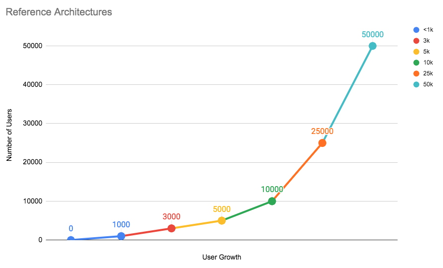

# Reference architectures **(FREE SELF)**

You can set up GitLab on a single server or scale it up to serve many users.
This page details the recommended Reference Architectures that were built and
verified by the GitLab Quality and Support teams.

Below is a chart representing each architecture tier and the number of users
they can handle. As your number of users grow with time, it's recommended that
you scale GitLab accordingly.

<!-- Internal link: https://docs.google.com/spreadsheets/d/1obYP4fLKkVVDOljaI3-ozhmCiPtEeMblbBKkf2OADKs/edit#gid=1403207183 -->

Testing on these reference architectures was performed with the
[GitLab Performance Tool](https://gitlab.com/gitlab-org/quality/performance)
at specific coded workloads, and the throughputs used for testing were
calculated based on sample customer data. Select the
[reference architecture](#available-reference-architectures) that matches your scale.

Each endpoint type is tested with the following number of requests per second (RPS)
per 1,000 users:

- API: 20 RPS
- Web: 2 RPS
- Git (Pull): 2 RPS
- Git (Push): 0.4 RPS (rounded to nearest integer)

For GitLab instances with less than 2,000 users, it's recommended that you use
the [default setup](#automated-backups) by
[installing GitLab](../../install/index.md) on a single machine to minimize
maintenance and resource costs.

If your organization has more than 2,000 users, the recommendation is to scale the
GitLab components to multiple machine nodes. The machine nodes are grouped by
components. The addition of these nodes increases the performance and
scalability of to your GitLab instance.

When scaling GitLab, there are several factors to consider:

- Multiple application nodes to handle frontend traffic.
- A load balancer is added in front to distribute traffic across the application nodes.
- The application nodes connects to a shared file server and PostgreSQL and Redis services on the backend.

NOTE:
Depending on your workflow, the following recommended reference architectures
may need to be adapted accordingly. Your workload is influenced by factors
including how active your users are, how much automation you use, mirroring,
and repository/change size. Additionally the displayed memory values are
provided by [GCP machine types](https://cloud.google.com/compute/docs/machine-types).
For different cloud vendors, attempt to select options that best match the
provided architecture.

## Available reference architectures

The following reference architectures are available:

- [Up to 1,000 users](1k_users.md)
- [Up to 2,000 users](2k_users.md)
- [Up to 3,000 users](3k_users.md)
- [Up to 5,000 users](5k_users.md)
- [Up to 10,000 users](10k_users.md)
- [Up to 25,000 users](25k_users.md)
- [Up to 50,000 users](50k_users.md)

The following Cloud Native Hybrid reference architectures, where select recommended components can be run in Kubernetes, are available:

- [Up to 10,000 users](10k_users.md#cloud-native-hybrid-reference-architecture-with-helm-charts-alternative)
- [Up to 50,000 users](50k_users.md#cloud-native-hybrid-reference-architecture-with-helm-charts-alternative)

A GitLab [Premium or Ultimate](https://about.gitlab.com/pricing/#self-managed) license is required
to get assistance from Support with troubleshooting the [2,000 users](2k_users.md)
and higher reference architectures.
[Read more about our definition of scaled architectures](https://about.gitlab.com/support/#definition-of-scaled-architecture).

## Availability Components

GitLab comes with the following components for your use, listed from least to
most complex:

- [Automated backups](#automated-backups)
- [Traffic load balancer](#traffic-load-balancer)
- [Zero downtime updates](#zero-downtime-updates)
- [Automated database failover](#automated-database-failover)
- [Instance level replication with GitLab Geo](#instance-level-replication-with-gitlab-geo)

As you implement these components, begin with a single server and then do
backups. Only after completing the first server should you proceed to the next.

Also, not implementing extra servers for GitLab doesn't necessarily mean that you'll have
more downtime. Depending on your needs and experience level, single servers can
have more actual perceived uptime for your users.

### Automated backups

> - Level of complexity: **Low**
> - Required domain knowledge: PostgreSQL, GitLab configurations, Git

This solution is appropriate for many teams that have the default GitLab installation.
With automatic backups of the GitLab repositories, configuration, and the database,
this can be an optimal solution if you don't have strict requirements.
[Automated backups](../../raketasks/backup_restore.md#configuring-cron-to-make-daily-backups)
is the least complex to setup. This provides a point-in-time recovery of a predetermined schedule.

### Traffic load balancer **(PREMIUM SELF)**

> - Level of complexity: **Medium**
> - Required domain knowledge: HAProxy, shared storage, distributed systems

This requires separating out GitLab into multiple application nodes with an added
[load balancer](../load_balancer.md). The load balancer will distribute traffic
across GitLab application nodes. Meanwhile, each application node connects to a
shared file server and database systems on the back end. This way, if one of the
application servers fails, the workflow is not interrupted.
[HAProxy](https://www.haproxy.org/) is recommended as the load balancer.

With this added component you have a number of advantages compared
to the default installation:

- Increase the number of users.
- Enable zero-downtime upgrades.
- Increase availability.

For more details on how to configure a traffic load balancer with GitLab, you can refer
to any of the [available reference architectures](#available-reference-architectures) with more than 1,000 users.

### Zero downtime updates **(PREMIUM SELF)**

> - Level of complexity: **Medium**
> - Required domain knowledge: PostgreSQL, HAProxy, shared storage, distributed systems

GitLab supports [zero-downtime updates](https://docs.gitlab.com/omnibus/update/#zero-downtime-updates).
Single GitLab nodes can be updated with only a [few minutes of downtime](https://docs.gitlab.com/omnibus/update/README.html#single-node-deployment).
To avoid this, we recommend to separate GitLab into several application nodes.
As long as at least one of each component is online and capable of handling the instance's usage load, your team's productivity will not be interrupted during the update.

### Automated database failover **(PREMIUM SELF)**

> - Level of complexity: **High**
> - Required domain knowledge: PgBouncer, Patroni, shared storage, distributed systems

By adding automatic failover for database systems, you can enable higher uptime
with additional database nodes. This extends the default database with
cluster management and failover policies.
[PgBouncer in conjunction with Patroni](../postgresql/replication_and_failover.md)
is recommended.

### Instance level replication with GitLab Geo **(PREMIUM SELF)**

> - Level of complexity: **Very High**
> - Required domain knowledge: Storage replication

[GitLab Geo](../geo/index.md) allows you to replicate your GitLab
instance to other geographical locations as a read-only fully operational instance
that can also be promoted in case of disaster.

## Deviating from the suggested reference architectures

As a general rule of thumb, the further away you move from the Reference Architectures,
the harder it will be get support for it. With any deviation, you're introducing
a layer of complexity that will add challenges to finding out where potential
issues might lie.

The reference architectures use the official GitLab Linux packages (Omnibus
GitLab) or [Helm Charts](https://docs.gitlab.com/charts/) to install and configure the various components. The components are
installed on separate machines (virtualized or bare metal), with machine hardware
requirements listed in the "Configuration" column and equivalent VM standard sizes listed
in GCP/AWS/Azure columns of each [available reference architecture](#available-reference-architectures).

Running components on Docker (including Compose) with the same specs should be fine, as Docker is well known in terms of support.
However, it is still an additional layer and may still add some support complexities, such as not being able to run `strace` easily in containers.

Other technologies, like [Docker swarm](https://docs.docker.com/engine/swarm/)
are not officially supported, but can be implemented at your own risk. In that
case, GitLab Support will not be able to help you.

## Supported modifications for lower user count HA reference architectures

The reference architectures for user counts [3,000](3k_users.md) and up support High Availability (HA).

In the specific case you have the requirement to achieve HA but have a lower user count, select modifications to the [3,000 user](3k_users.md) architecture are supported.

For more details, [refer to this section in the architecture's documentation](3k_users.md#supported-modifications-for-lower-user-counts-ha).
