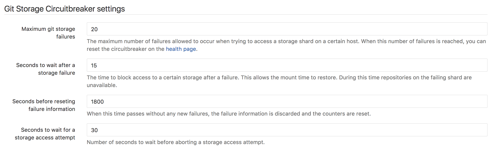
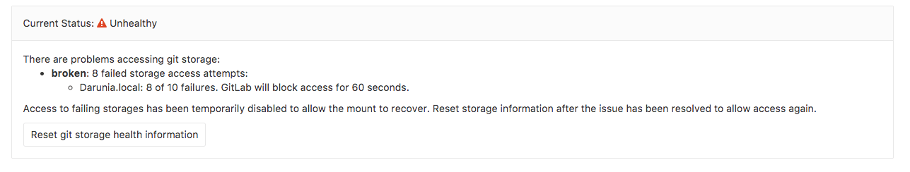

# Repository storage paths

> [Introduced][ce-4578] in GitLab 8.10.

GitLab allows you to define multiple repository storage paths to distribute the
storage load between several mount points.

>**Notes:**
>
- You must have at least one storage path called `default`.
- The paths are defined in key-value pairs. The key is an arbitrary name you
  can pick to name the file path.
- The target directories and any of its subpaths must not be a symlink.

## Configure GitLab

>**Warning:**
In order for [backups] to work correctly, the storage path must **not** be a
mount point and the GitLab user should have correct permissions for the parent
directory of the path. In Omnibus GitLab this is taken care of automatically,
but for source installations you should be extra careful.
>
The thing is that for compatibility reasons `gitlab.yml` has a different
structure than Omnibus. In `gitlab.yml` you indicate the path for the
repositories, for example `/home/git/repositories`, while in Omnibus you
indicate `git_data_dirs`, which for the example above would be `/home/git`.
Then, Omnibus will create a `repositories` directory under that path to use with
`gitlab.yml`.
>
This little detail matters because while restoring a backup, the current
contents of  `/home/git/repositories` [are moved to][raketask] `/home/git/repositories.old`,
so if `/home/git/repositories` is the mount point, then `mv` would be moving
things between mount points, and bad things could happen. Ideally,
`/home/git` would be the mount point, so then things would be moving within the
same mount point. This is guaranteed with Omnibus installations (because they
don't specify the full repository path but the parent path), but not for source
installations.

---

Now that you've read that big fat warning above, let's edit the configuration
files and add the full paths of the alternative repository storage paths. In
the example below, we add two more mountpoints that are named `nfs` and `cephfs`
respectively.

**For installations from source**

1. Edit `gitlab.yml` and add the storage paths:

    ```yaml
    repositories:
      # Paths where repositories can be stored. Give the canonicalized absolute pathname.
      # NOTE: REPOS PATHS MUST NOT CONTAIN ANY SYMLINK!!!
      storages: # You must have at least a 'default' storage path.
        default:
          path: /home/git/repositories
        nfs:
          path: /mnt/nfs/repositories
        cephfs:
          path: /mnt/cephfs/repositories
    ```

1. [Restart GitLab][restart-gitlab] for the changes to take effect.

>**Note:**
The [`gitlab_shell: repos_path` entry][repospath] in `gitlab.yml` will be
deprecated and replaced by `repositories: storages` in the future, so if you
are upgrading from a version prior to 8.10, make sure to add the configuration
as described in the step above. After you make the changes and confirm they are
working, you can remove the `repos_path` line.

---

**For Omnibus installations**

1. Edit `/etc/gitlab/gitlab.rb` by appending the rest of the paths to the
   default one:

    ```ruby
    git_data_dirs({
      "default" => { "path" => "/var/opt/gitlab/git-data" },
      "nfs" => { "path" => "/mnt/nfs/git-data" },
      "cephfs" => { "path" => "/mnt/cephfs/git-data" }
    })
    ```

    Note that Omnibus stores the repositories in a `repositories` subdirectory
    of the `git-data` directory.

## Choose where new project repositories will be stored

Once you set the multiple storage paths, you can choose where new projects will
be stored via the **Application Settings** in the Admin area.


Beginning with GitLab 8.13.4, multiple paths can be chosen. New projects will be
randomly placed on one of the selected paths.

## Handling failing repository storage

> [Introduced][ce-11449] in GitLab 9.5.

When GitLab detects access to the repositories storage fails repeatedly, it can
gracefully prevent attempts to access the storage. This might be useful when
the repositories are stored somewhere on the network.

This can be configured from the admin interface:



**Number of access attempts**: The number of attempts GitLab will make to access a
storage when probing a shard.

**Number of failures before backing off**: The number of failures after which
GitLab will start temporarily disabling access to a storage shard on a host.

**Maximum git storage failures:** The number of failures of after which GitLab will
completely prevent access to the storage. The number of failures can be reset in
the admin interface: `https://gitlab.example.com/admin/health_check` or using the
[api](../api/repository_storage_health.md) to allow access to the storage again.

**Seconds to wait after a storage failure:** When access to a storage fails. GitLab
will prevent access to the storage for the time specified here. This allows the
filesystem to recover.

**Seconds before reseting failure information:** The time in seconds GitLab will
keep failure information. When no failures occur during this time, information about the
mount is reset.

**Seconds to wait for a storage access attempt:** The time in seconds GitLab will
try to access storage. After this time a timeout error will be raised.

To enable the circuitbreaker for repository storage you can flip the feature flag from a rails console:

```
Feature.enable('git_storage_circuit_breaker')
```

Alternatively it can be enabled by setting `true` in the `GIT_STORAGE_CIRCUIT_BREAKER` environment variable.
This approach would be used when enabling the circuit breaker on a single host.

When storage failures occur, this will be visible in the admin interface like this:



To allow access to all storages, click the `Reset git storage health information` button.

[ce-4578]: https://gitlab.com/gitlab-org/gitlab-ce/merge_requests/4578
[restart-gitlab]: restart_gitlab.md#installations-from-source
[reconfigure-gitlab]: restart_gitlab.md#omnibus-gitlab-reconfigure
[backups]: ../raketasks/backup_restore.md
[raketask]: https://gitlab.com/gitlab-org/gitlab-ce/blob/033e5423a2594e08a7ebcd2379bd2331f4c39032/lib/backup/repository.rb#L54-56
[repospath]: https://gitlab.com/gitlab-org/gitlab-ce/blob/8-9-stable/config/gitlab.yml.example#L457
[ce-11449]: https://gitlab.com/gitlab-org/gitlab-ce/merge_requests/11449
