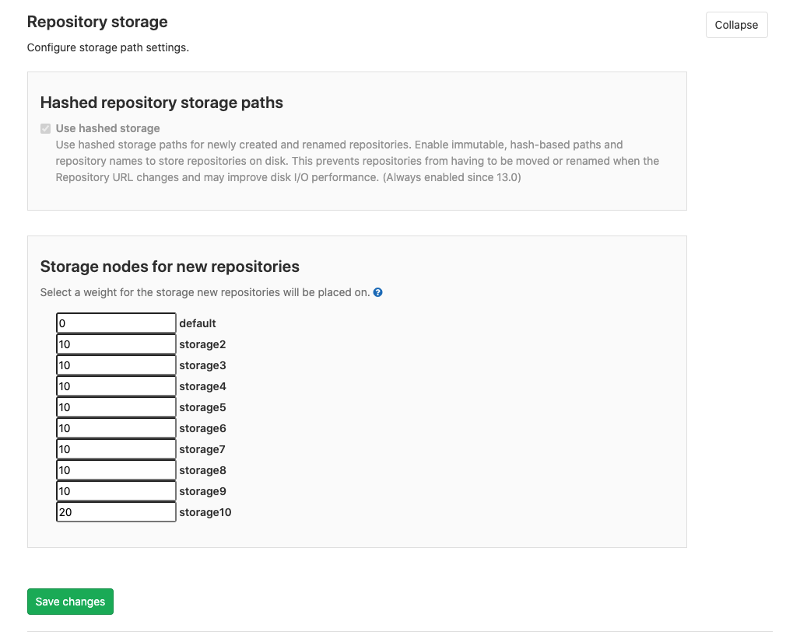

# Repository storage **(FREE SELF)**

GitLab stores [repositories](../user/project/repository/index.md) on repository storage. Repository
storage is either:

- A `gitaly_address`, which points to a [Gitaly node](gitaly/index.md).
- A `path`, which points directly to the directory where the repositories are stored. This method is
  deprecated and [scheduled to be removed](https://gitlab.com/gitlab-org/gitaly/-/issues/1690) in
  GitLab 14.0.

GitLab allows you to define multiple repository storages to distribute the storage load between
several mount points. For example:

- When using Gitaly (Omnibus GitLab-style configuration):

  ```ruby
   git_data_dirs({
     'default' => { 'gitaly_address' => 'tcp://gitaly1.internal:8075' },
     'storage2' => { 'gitaly_address' => 'tcp://gitaly2.internal:8075' },
   })
   ```

- When using direct repository storage (source install-style configuration):

  ```plaintext
  default:
    gitaly_address: tcp://gitaly1.example:8075
  storage2:
    gitaly_address: tcp://gitaly2.example:8075
  ```

For more information on:

- Configuring Gitaly, see [Configure Gitaly](gitaly/index.md#configure-gitaly).
- Configuring direct repository access, see the following section below.

## Configure repository storage paths

WARNING:
The following information is for configuring GitLab to directly access repositories. This
configuration option is deprecated in favor of using [Gitaly](gitaly/index.md) and is scheduled to
[be removed in GitLab 14.0](https://gitlab.com/gitlab-org/gitaly/-/issues/1690).

To configure repository storage paths:

1. Edit the necessary configuration files:
   - `/etc/gitlab/gitlab.rb`, for Omnibus GitLab installations.
   - `gitlab.yml`, for installations from source.
1. Add the required repository storage paths.

For repository storage paths:

- You must have at least one storage path called `default`.
- The paths are defined in key-value pairs. Apart from `default`, the key can be any name you choose
  to name the file path.
- The target directories and any of its sub paths must not be a symlink.
- No target directory may be a sub-directory of another. That is, no nesting. For example, the
  following configuration is invalid:

  ```plaintext
  default:
    path: /mnt/git-storage-1
  storage2:
    path: /mnt/git-storage-1/git-storage-2 # <- NOT OK because of nesting
  ```

### Configure for backups

For [backups](../raketasks/backup_restore.md) to work correctly:

- The repository storage path cannot be a mount point.
- The GitLab user must have correct permissions for the parent directory of the path.

Omnibus GitLab takes care of these issues for you, but for source installations you should be extra
careful.

While restoring a backup, the current contents of `/home/git/repositories` are moved to
`/home/git/repositories.old`. If `/home/git/repositories` is a mount point, then `mv` would be
moving things between mount points, and problems can occur.

Ideally, `/home/git` is the mount point, so things remain inside the same mount point. Omnibus
GitLab installations guarantee this because they don't specify the full repository path but instead
the parent path, but source installations do not.

### Example configuration

In the examples below, we add two additional repository storage paths configured to two additional
mount points.

For compatibility reasons `gitlab.yml` has a different structure than Omnibus GitLab configuration:

- In `gitlab.yml`, you indicate the path for the repositories, for example `/home/git/repositories`
- In Omnibus GitLab configuration you indicate `git_data_dirs`, which could be `/home/git` for
  example. Then Omnibus GitLab creates a `repositories` directory under that path to use with
  `gitlab.yml`.

**For installations from source**

1. Edit `gitlab.yml` and add the storage paths:

   ```yaml
   repositories:
     # Paths where repositories can be stored. Give the canonicalized absolute pathname.
     # NOTE: REPOS PATHS MUST NOT CONTAIN ANY SYMLINK!!!
     storages: # You must have at least a 'default' repository storage path.
       default:
         path: /home/git/repositories
       storage1:
         path: /mnt/storage1/repositories
       storage2:
         path: /mnt/storage2/repositories
   ```

1. [Restart GitLab](restart_gitlab.md#installations-from-source) for the changes to take effect.

**For Omnibus installations**

Edit `/etc/gitlab/gitlab.rb` by appending the rest of the paths to the default one:

```ruby
git_data_dirs({
 "default" => { "path" => "/var/opt/gitlab/git-data" },
 "storage1" => { "path" => "/mnt/storage1/git-data" },
 "storage2" => { "path" => "/mnt/storage2/git-data" }
})
```

NOTE:
Omnibus stores the repositories in a `repositories` subdirectory of the `git-data` directory.

## Configure where new repositories are stored

After you [configure](#configure-repository-storage-paths) multiple repository storage paths, you
can choose where new repositories are stored:

1. On the top bar, select **Menu >** **{admin}** **Admin**.
1. On the left sidebar, select **Settings > Repository** and expand the **Repository storage**
   section.
1. Enter values in the **Storage nodes for new repositories** fields.
1. Select **Save changes**.

Each repository storage path can be assigned a weight from 0-100. When a new project is created,
these weights are used to determine the storage location the repository is created on. The higher
the weight of a given repository storage path relative to other repository storages paths, the more
often it is chosen. That is, `(storage weight) / (sum of all weights) * 100 = chance %`.



## Move repositories

To move a repository to a different repository storage (for example, from `default` to `storage2`), use the
same process as [migrating to Gitaly Cluster](gitaly/praefect.md#migrate-to-gitaly-cluster).
