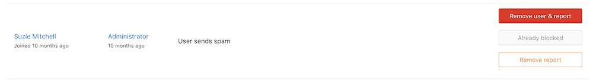

DETAILS:
**Tier:** Free, Premium, Ultimate
**Offering:** GitLab Self-Managed

View and resolve abuse reports from GitLab users.

GitLab administrators can view and [resolve](#resolving-abuse-reports) abuse
reports in the **Admin** area.

## Receive notification of abuse reports by email

To receive notifications of new abuse reports by email:

1. On the left sidebar, at the bottom, select **Admin**.
1. Select **Settings > Reporting**.
1. Expand the **Abuse reports** section.
1. Provide an email address and select **Save changes**.

The notification email address can also be set and retrieved
[using the API](../api/settings.md#available-settings).

## Reporting abuse

To find out more about reporting abuse, see
[abuse reports user documentation](../user/report_abuse.md).

## Resolving abuse reports

> - **Trust user** [introduced](https://gitlab.com/gitlab-org/gitlab/-/merge_requests/131102) in GitLab 16.4.

To access abuse reports:

1. On the left sidebar, at the bottom, select **Admin**.
1. Select **Abuse reports**.

There are four ways to resolve an abuse report, with a button for each method:

- Remove user & report. This:
  - [Deletes the reported user](../user/profile/account/delete_account.md) from the
    instance.
  - Removes the abuse report from the list.
- [Block user](#blocking-users).
- Remove report. This:
  - Removes the abuse report from the list.
  - Removes access restrictions for the reported user.
- Trust user. This:
  - Allows the user to create issues, notes, snippets, and merge requests without being blocked for spam.
  - Prevents abuse reports from being created for this user.

The following is an example of the **Abuse reports** page:


### Blocking users

A blocked user cannot sign in or access any repositories, but all of their data
remains.

Blocking a user:

- Leaves them in the abuse report list.
- Changes the **Block user** button to a disabled **Already blocked** button.

The user is notified with the following message:

```plaintext
Your account has been blocked. If you believe this is in error, contact a staff member.
```

After blocking, you can still either:

- Remove the user and report if necessary.
- Remove the report.

The following is an example of a blocked user listed on the **Abuse reports**
page:



## Related topics

- [Moderate users (administration)](moderate_users.md)
- [Review spam logs](review_spam_logs.md)
