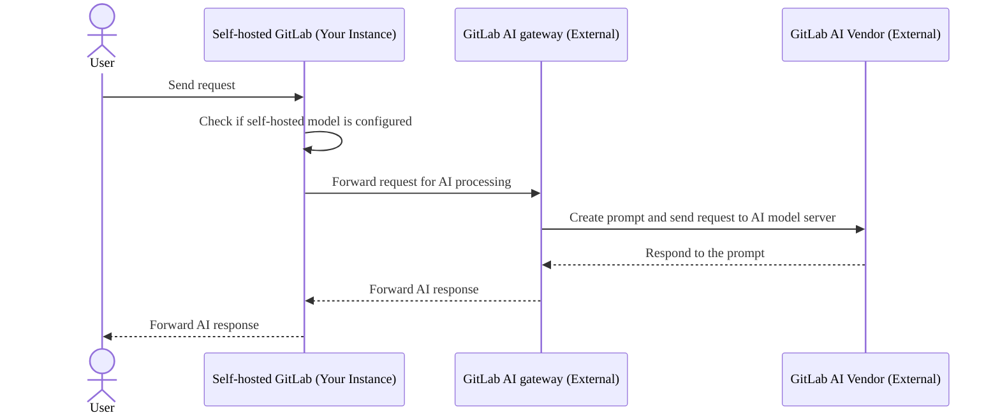
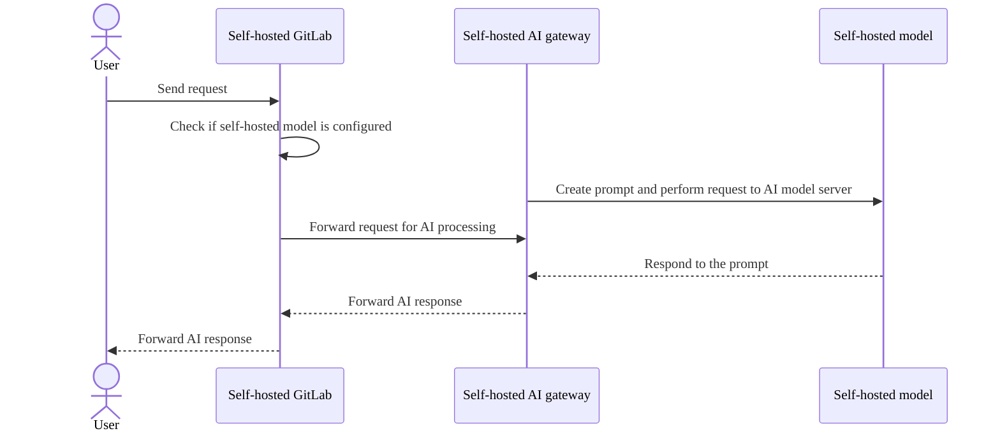
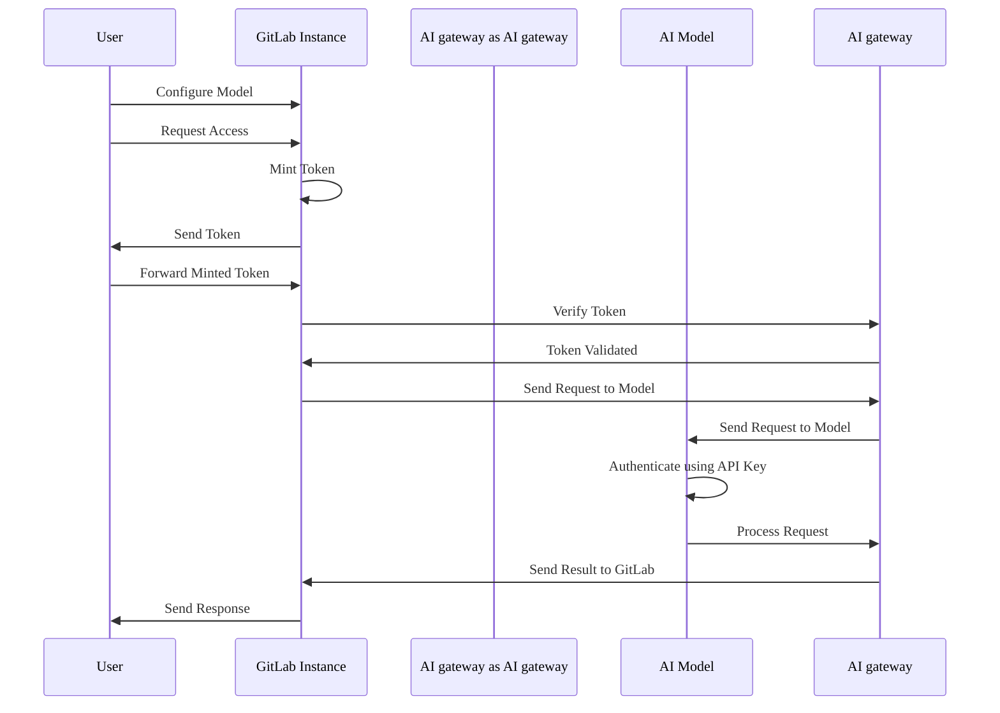

DETAILS:
**Tier:** Ultimate with GitLab Duo Enterprise - [Start a trial](https://about.gitlab.com/solutions/gitlab-duo-pro/sales/?type=free-trial)
**Offering:** GitLab Self-Managed
**Status:** Beta

> - [Introduced](https://gitlab.com/groups/gitlab-org/-/epics/12972) in GitLab 17.1 [with a flag](../feature_flags.md) named `ai_custom_model`. Disabled by default.
> - [Enabled on GitLab Self-Managed](https://gitlab.com/groups/gitlab-org/-/epics/15176) in GitLab 17.6.
> - Changed to require GitLab Duo add-on in GitLab 17.6 and later.
> - Feature flag `ai_custom_model` removed in GitLab 17.8

There are two configuration options for self-managed customers:

- **GitLab.com AI gateway**: Use the GitLab-managed AI gateway with default external
  large language model (LLM) providers (for example, Google Vertex or Anthropic).
- **Self-hosted AI gateway**: Deploy and manage your own AI gateway and language models in your infrastructure,
  without depending on GitLab-provided external language providers.

## GitLab.com AI gateway

In this configuration, your GitLab instance depends on and sends requests to the external GitLab AI gateway, which communicates with external AI vendors such as Google Vertex or Anthropic. The response is then forwarded back to your GitLab instance.

## Self-hosted AI gateway

In this configuration, the entire system is isolated within the enterprise, ensuring a fully self-hosted environment that safeguards data privacy.

For more information, see the [self-hosted model deployment blueprint](https://handbook.gitlab.com/handbook/engineering/architecture/design-documents/custom_models/).

## Authentication for GitLab Duo Self-Hosted

The authentication process for GitLab Duo Self-Hosted is secure, efficient, and made up of the following key components:

- **Self-issued tokens**: In this architecture, access credentials are not synchronized with `cloud.gitlab.com`. Instead, tokens are self-issued dynamically, similar to the functionality on GitLab.com. This method provides users with immediate access while maintaining a high level of security.

- **Offline environments**: In offline setups, there are no connections to `cloud.gitlab.com`. All requests are routed exclusively to the self-hosted AI gateway.

- **Token minting and verification**: The instance mints the token, which is then verified by the AI gateway against the GitLab instance.

- **Model configuration and security**: When an administrator configures a model, they can incorporate an API key to authenticate requests. Additionally, you can enhance security by specifying connection IP addresses within your network, ensuring that only trusted IPs can interact with the model.

As illustrated in the following diagram:

1. The authentication flow begins when the user configures the model through the GitLab instance and submits a request to access the GitLab Duo feature.
1. The GitLab instance mints an access token, which the user forwards to GitLab and then to the AI gateway for verification.
1. Upon confirming the token's validity, the AI gateway sends a request to the AI model, which uses the API key to authenticate the request and process it.
1. The results are then relayed back to the GitLab instance, completing the flow by sending the response to the user, which is designed to be secure and efficient.

