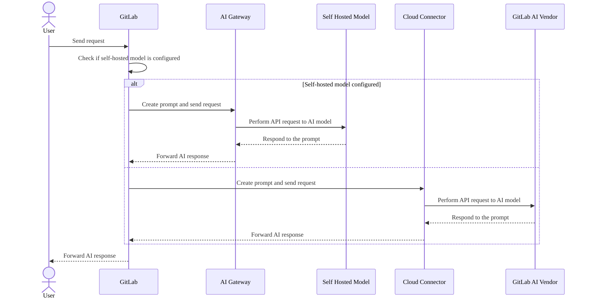

# Deploy a self-hosted large language model

DETAILS:
**Tier:** For a limited time, Premium and Ultimate. In the future, [GitLab Duo Enterprise](../../subscriptions/subscription-add-ons.md).
**Offering:** Self-managed
**Status:** Experiment

> - [Introduced](https://gitlab.com/groups/gitlab-org/-/epics/12972) in GitLab 17.1 [with a flag](../../administration/feature_flags.md) named `ai_custom_model`. Disabled by default.

FLAG:
The availability of this feature is controlled by a feature flag.
For more information, see the history.

WARNING:
This feature is considered [experimental](../../policy/experiment-beta-support.md) and is not intended for customer usage outside of initial design partners. We expect major changes to this feature.

DISCLAIMER:
This page contains information related to upcoming products, features, and functionality.
It is important to note that the information presented is for informational purposes only.
Please do not rely on this information for purchasing or planning purposes.
The development, release, and timing of any products, features, or functionality may be subject to change or delay and remain at the
sole discretion of GitLab Inc.

When you deploy a self-hosted large language model (LLM), you can:

- Manage the end-to-end transmission of requests to enterprise-hosted LLM backends for GitLab Duo features.
- Keep all of these requests within their enterprise network, ensuring no calls to external architecture.
- Isolate the GitLab instance, AI Gateway, and self-hosted AI model within their own
  environment, ensuring complete privacy and high security for using AI features, with
  no reliance on public services.

When you use self-hosted models, you:

- Can choose any GitLab-approved LLM model.
- Can keep all data and request/response logs in your own domain.
- Can select specific GitLab Duo features for your users.
- Do not have to rely on the GitLab shared AI Gateway.

You can connect supported models to LLM features. Model-specific prompts
and GitLab Duo feature support is provided by the self-hosted models feature. For
more information about this offering, see [subscriptions](../../subscriptions/self_managed/index.md) and the [Blueprint](https://handbook.gitlab.com/handbook/engineering/architecture/design-documents/custom_models/).

## Prerequisites

- You must be able to manage your own LLM infrastructure.
- You must have the [GitLab Enterprise Edition](../../administration/license.md).

## Deploy a self-hosted model

To deploy a self-hosted large language model:

1. [Set up your self-hosted model deployment infrastructure](../../administration/self_hosted_models/install_infrastructure.md) and connect it to your GitLab instance.
1. [Configure your GitLab instance to access self-hosted models](../../administration/self_hosted_models/configure_duo_features.md) using instance and group settings.

## Self-hosted models compared to the default GitLab AI vendor architecture

