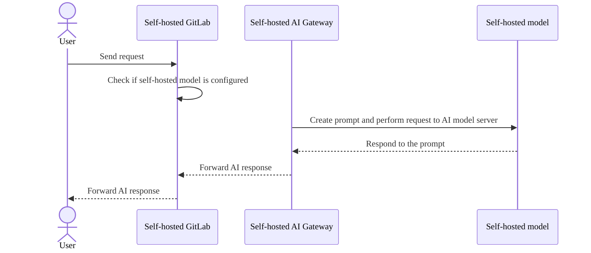
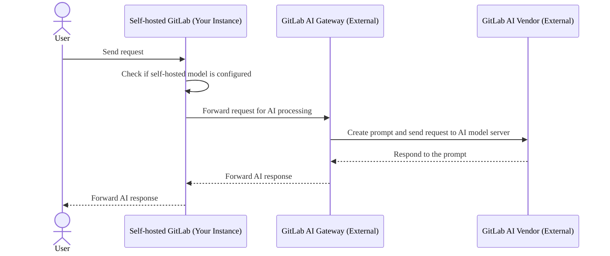
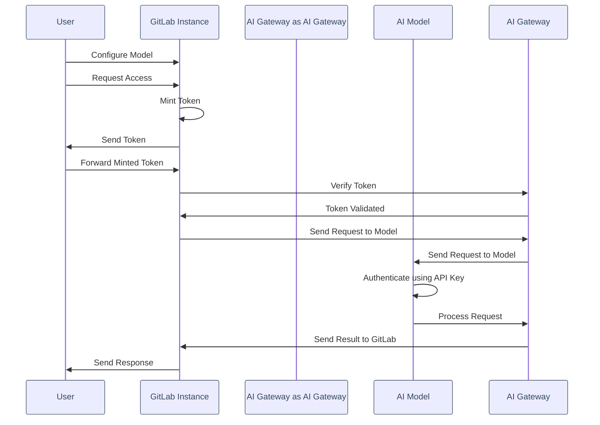

# GitLab Duo Self-Hosted Models

DETAILS:
**Tier:** Ultimate with GitLab Duo Enterprise - [Start a trial](https://about.gitlab.com/solutions/gitlab-duo-pro/sales/?type=free-trial)
**Offering:** Self-managed
**Status:** Beta

> - [Introduced](https://gitlab.com/groups/gitlab-org/-/epics/12972) in GitLab 17.1 [with a flag](../../administration/feature_flags.md) named `ai_custom_model`. Disabled by default.
> - [Enabled on self-managed](https://gitlab.com/groups/gitlab-org/-/epics/15176) in GitLab 17.6.
> - Changed to require GitLab Duo add-on in GitLab 17.6 and later.

To maintain full control over your data privacy, security, and the deployment of large language models (LLMs) in your own infrastructure, use GitLab Duo Self-Hosted Models.

By deploying self-hosted models, you can manage the entire lifecycle of requests made to LLM backends for GitLab Duo features, ensuring that all requests stay within your enterprise network and avoiding external dependencies.

## Why use self-hosted models

With self-hosted models, you can:

- Choose any GitLab-approved LLM.
- Retain full control over data by keeping all request/response logs within your domain, ensuring complete privacy and security with no external API calls.
- Isolate the GitLab instance, AI Gateway, and models within your own environment.
- Select specific GitLab Duo features tailored to your users.
- Eliminate reliance on the shared GitLab AI Gateway.

This setup ensures enterprise-level privacy and flexibility, allowing seamless integration of your LLMs with GitLab Duo features.

### Prerequisites

The following are required:

- A [supported model](supported_models_and_hardware_requirements.md) (either cloud-based or on-premises).
- A [supported serving platform](supported_llm_serving_platforms.md) (either cloud-based or on-premises).
- A locally hosted or GitLab.com AI Gateway.
- GitLab [Enterprise Edition license](../../administration/license.md).

## Self-managed customer configuration types

There are two configuration options for self-managed customers:

- **GitLab.com AI Gateway customers**: Use the GitLab-hosted AI Gateway with external LLM providers (for example, Google Vertex or Anthropic).
- **Self-hosted AI Gateway customers**: Deploy your own AI Gateway and LLMs within your infrastructure, without relying on external public services.

### Fully self-hosted architecture

In this configuration, the entire system is isolated within the enterprise, ensuring a fully self-hosted environment that safeguards data privacy.

### GitLab AI vendor architecture

In this configuration, your GitLab instance depends on and sends requests to the external GitLab AI Gateway, which communicates with external AI vendors such as Google Vertex or Anthropic. The response is then forwarded back to your GitLab instance.

For more details, see the [Blueprint](https://handbook.gitlab.com/handbook/engineering/architecture/design-documents/custom_models/).

## Authentication for self-hosted models

The authentication process for self-hosted models is designed to be secure and efficient, comprising the following key components:

- **Self-issued tokens**: In this architecture, access credentials are not synchronized with `cloud.gitlab.com`. Instead, tokens are self-issued dynamically, similar to the functionality on GitLab.com. This method provides users with immediate access while maintaining a high level of security.

- **Offline environments**: In offline setups, there are no connections to `cloud.gitlab.com`. All requests are routed exclusively to the self-hosted AI Gateway.

- **Token minting and verification**: The GitLab self-managed instance mints the token, which is then verified by the AI Gateway against the GitLab instance.
- **Model configuration and security**: When an administrator configures a model, they can incorporate an API key to authenticate requests. Additionally, you can enhance security by specifying connection IP addresses within your network, ensuring that only trusted IPs can interact with the model.

As illustrated in the following diagram:

1. The authentication flow begins when the user configures the model through the GitLab instance and submits a request to access the GitLab Duo feature.
1. The GitLab instance mints an access token, which the user forwards to GitLab and then to the AI Gateway for verification.
1. Upon confirming the token's validity, the AI Gateway sends a request to the AI model, which uses the API key to authenticate the request and process it.
1. The results are then relayed back to the GitLab instance, completing the flow by sending the response to the user, which is designed to be secure and efficient.

## Set up a self-hosted infrastructure

To establish a fully isolated self-hosted infrastructure:

1. **Install a Large Language Model (LLM) Serving Infrastructure**

   - We support various platforms for serving and hosting your LLMs, such as vLLM, AWS Bedrock, and Azure OpenAI. To help you choose the most suitable option for effectively deploying your models, see the [supported LLM platforms documentation](supported_llm_serving_platforms.md) for more information on each platform's features.

   - We provide a comprehensive matrix of supported models along with their specific features and hardware requirements. To help select models that best align with your infrastructure needs for optimal performance, see the [supported models and hardware requirements documentation](supported_models_and_hardware_requirements.md).

1. **Install the GitLab AI Gateway**
   [Install the AI Gateway](../../install/install_ai_gateway.md) to efficiently configure your AI infrastructure.

1. **Configure GitLab Duo features**
   See the [Configure GitLab Duo features documentation](configure_duo_features.md) for instructions on how to customize your environment to effectively meet your operational needs.

1. **Enable logging**
   You can find configuration details for enabling logging within your environment. For help in using logs to track and manage your system's performance effectively, see the [logging documentation](logging.md).

## Related topics

- AWS Bedrock
  - [Import Custom Models Into Amazon Bedrock](https://www.youtube.com/watch?v=CA2AXfWWdpA)

## Troubleshooting

To begin troubleshooting, run the debugging scripts to verify your self-hosted model setup. For further guidance on other actions you can take, see the [troubleshooting documentation](troubleshooting.md).
