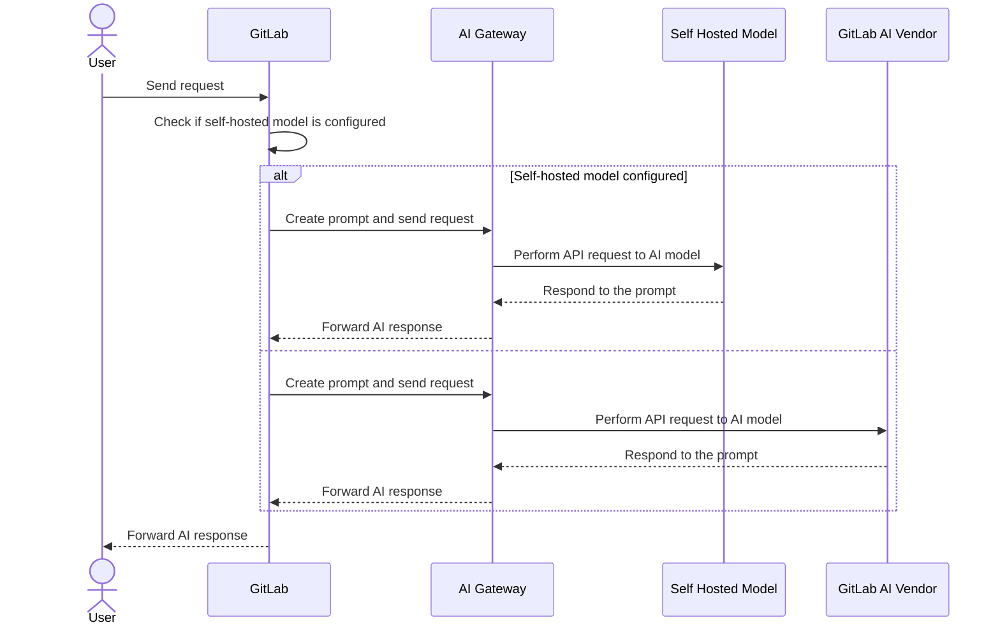

# Deploy a self-hosted large language model

DETAILS:
**Tier:** Premium, Ultimate
**Offering:** Self-managed

Deploying a self-hosted large language model (LLM) allows customers to:

- Manage the end-to-end transmission of requests to enterprise-hosted LLM backends for GitLab Duo features.
- Keep all of these requests within their enterprise network, ensuring no calls to external architecture.

Self-hosted models serve sophisticated customers capable of managing their own LLM infrastructure. GitLab provides the option to connect supported models to LLM features. Model-specific prompts and GitLab Duo feature support is provided by the self-hosted models feature. For more information about this offering, see the [subscription page](../../subscriptions/self_managed/index.md).

## Advantages

- Choice of GitLab-approved LLM models.
- Ability to keep all data and request/response logs within their own domain.
- Ability to select specific GitLab Duo Features for their users.
- Non-reliance on the GitLab shared AI Gateway.

## Self Hosted models vs the default GitLab AI Vendor architecture

With AI self-hosted models, your GitLab instance, AI Gateway, and self-hosted AI model are fully isolated within your own environment. This setup ensures complete privacy and high security for using AI features, with no reliance on public services.

## Get started

To deploy a self-hosted large language model:

1. [Install your self-hosted model deployment infrastructure](../../administration/self_hosted_models/install_infrastructure.md) and connect it to your GitLab instance.
1. [Configure your self-hosted model deployment](../../administration/self_hosted_models/configure_duo_features.md) using instance and group level settings.
