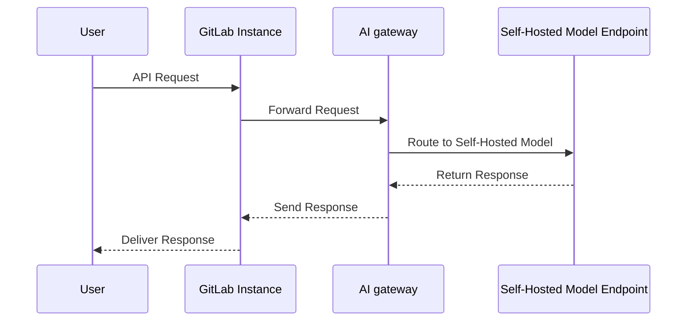
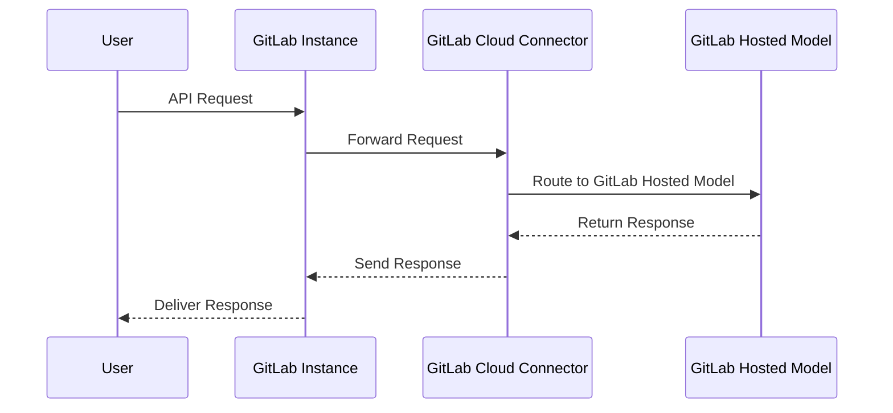

# Self-Hosted AI Models: Licensing and Offerings

DETAILS:
**Tier:** Ultimate with GitLab Duo Enterprise - [Start a trial](https://about.gitlab.com/solutions/gitlab-duo-pro/sales/?type=free-trial)
**Offering:** GitLab Self-Managed
**Status:** Beta

> - [Introduced](https://gitlab.com/groups/gitlab-org/-/epics/12972) in GitLab 17.1 [with a flag](../feature_flags.md) named `ai_custom_model`. Disabled by default.
> - [Enabled on GitLab Self-Managed](https://gitlab.com/groups/gitlab-org/-/epics/15176) in GitLab 17.6.
> - Changed to require GitLab Duo add-on in GitLab 17.6 and later.
> - Feature flag `ai_custom_model` removed in GitLab 17.8

To deploy self-hosted AI models, you need GitLab Ultimate and Duo Enterprise - [Start a trial](https://about.gitlab.com/solutions/gitlab-duo-pro/sales/?type=free-trial).

## Offerings

### 1. Self-Hosted Models

These are AI models deployed within your infrastructure, giving you full control over your data and security.

- **Configuration:** Set up an AI gateway and configure model endpoints within GitLab.
- **Licensing:** Requires a valid GitLab license. You can request a license through the [Customers Portal](https://customers.gitlab.com).

The following sequence diagram illustrates the process of handling a user request through a self-hosted model:

### 2. GitLab Vendor Models

These models are hosted by GitLab and accessed through the GitLab Cloud Connector, providing an out-of-the-box AI solution without requiring on-premise infrastructure.

- **Configuration:** Enable the desired features in GitLab and select a vendor-hosted model.
- **Licensing:** Included with your GitLab subscription, depending on your plan (Ultimate or GitLab Duo). No additional license is required for these models.

The following sequence diagram illustrates the process of handling a user request through a GitLab Vendor Model:

