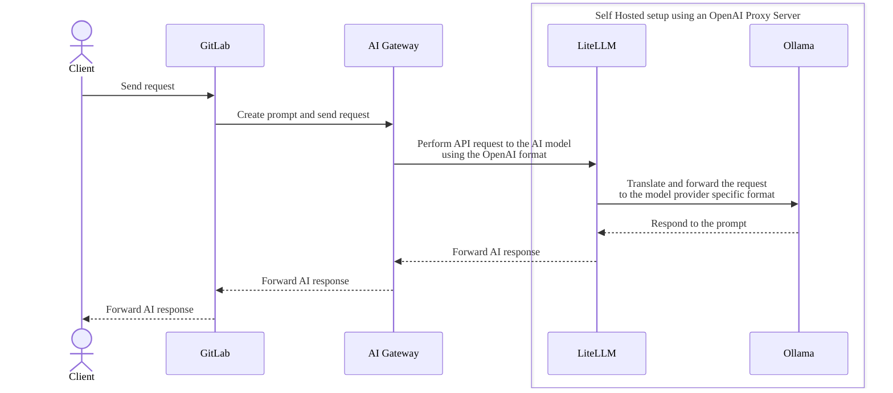

# Set up a self-hosted large language model with LiteLLM

[LiteLLM](https://www.litellm.ai/) is an OpenAI proxy server. You can use LiteLLM to simplify the integration with different large language models (LLMs) by leveraging the OpenAI API spec. Use LiteLLM to easily switch between different LLMs.



## Example setup with LiteLLM and Ollama

1. Pull and serve the model with [Ollama](https://www.ollama.com/):

   ```shell
   ollama pull codegemma:2b
   ollama serve
   ```

1. Create the LiteLLM proxy configuration that routes a request from the AI Gateway directed to a specific model version instead of the generic named `codegemma` model. In this example we are using `codegemma:2b`, which is being served at `http://localhost:11434` by Ollama:

   ```yaml
   # config.yaml
   model_list:
   - model_name: codegemma
      litellm_params:
         model: ollama/codegemma:2b
         api_base: http://localhost:11434
   ```

1. Run the proxy:

   ```shell
   litellm --config config.yaml
   ```

1. Send a test request:

   ```shell
   curl --request 'POST' \
   'http://localhost:5052/v2/code/completions' \
   -H 'accept: application/json' \
   -H 'Content-Type: application/json' \
   -d '{
   "current_file": {
      "file_name": "app.py",
      "language_identifier": "python",
      "content_above_cursor": "<|fim_prefix|>def hello_world():<|fim_suffix|><|fim_middle|>",
      "content_below_cursor": ""
   },
   "model_provider": "litellm",
   "model_endpoint": "http://127.0.0.1:4000",
   "model_name": "codegemma",
   "telemetry": [],
   "prompt_version": 2,
   "prompt": ""
   }' | jq
   ```

   ```json
   {
      "id": "id",
      "model": {
         "engine": "litellm",
         "name": "text-completion-openai/codegemma",
         "lang": "python"
      },
      "experiments": [],
      "object": "text_completion",
      "created": 1718631985,
      "choices": [
         {
            "text": "print(\"Hello, World!\")",
            "index": 0,
            "finish_reason": "length"
         }
      ]
   }
   ```

## Related topics

- [LiteLLM documentation](https://docs.litellm.ai/docs/providers/openai_compatible)
- [Ollama documentation](https://docs.litellm.ai/docs/providers/ollama)
