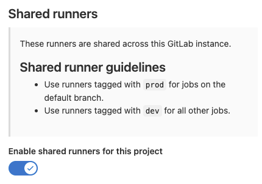

# Continuous Integration and Deployment Admin area settings

DETAILS:
**Tier:** Free, Premium, Ultimate
**Offering:** Self-managed

The [**Admin** area](index.md) has the instance settings for Auto DevOps, runners, and
job artifacts.

## Auto DevOps

To enable (or disable) [Auto DevOps](../../topics/autodevops/index.md)
for all projects:

1. On the left sidebar, at the bottom, select **Admin**.
1. Select **Settings > CI/CD**.
1. Check (or uncheck to disable) the box that says **Default to Auto DevOps pipeline for all projects**.
1. Optionally, set up the [Auto DevOps base domain](../../topics/autodevops/requirements.md#auto-devops-base-domain)
   which is used for Auto Deploy and Auto Review Apps.
1. Select **Save changes** for the changes to take effect.

From now on, every existing project and newly created ones that don't have a
`.gitlab-ci.yml` use the Auto DevOps pipelines.

If you want to disable it for a specific project, you can do so in
[its settings](../../topics/autodevops/index.md#enable-or-disable-auto-devops).

## Enable instance runners for new projects

You can set all new projects to have instance runners available by default.

1. On the left sidebar, at the bottom, select **Admin**.
1. Select **Settings > CI/CD**.
1. Expand **Continuous Integration and Deployment**.
1. Select the **Enable instance runners for new projects** checkbox.

Any time a new project is created, the instance runners are available.

## Enable runner registrations tokens

> - [Introduced](https://gitlab.com/gitlab-org/gitlab/-/merge_requests/147559) in GitLab 16.11

WARNING:
The ability to pass a runner registration token, and support for certain configuration arguments was deprecated in GitLab 15.6 and will be removed in GitLab 18.0. Runner authentication tokens should be used instead. For more information, see [Migrating to the new runner registration workflow](../../ci/runners/new_creation_workflow.md).

In GitLab 17.0, the use of runner registration tokens to create runners will be disabled in all GitLab instances.
Users must use runner authentication tokens instead.
If you have not yet [migrated to the use of runner authentication tokens](../../ci/runners/new_creation_workflow.md),
you can enable runner registration tokens. This setting and support for runner registration tokens will be removed in GitLab 18.0.

1. On the left sidebar, at the bottom, select **Admin**.
1. Select **Settings > CI/CD**.
1. Expand **Runners**.
1. Select the **Allow runner registration token** checkbox.

## Instance runners compute quota

As an administrator you can set either a global or namespace-specific
limit on the number of [compute minutes](../../ci/pipelines/compute_minutes.md) you can use.

## Enable a project runner for multiple projects

If you have already registered a [project runner](../../ci/runners/runners_scope.md#project-runners)
you can assign that runner to other projects.

To enable a project runner for more than one project:

1. On the left sidebar, at the bottom, select **Admin**.
1. From the left sidebar, select **CI/CD > Runners**.
1. Select the runner you want to edit.
1. In the upper-right corner, select **Edit** (**{pencil}**).
1. Under **Restrict projects for this runner**, search for a project.
1. To the left of the project, select **Enable**.
1. Repeat this process for each additional project.

## Add a message for instance runners

To display details about the instance runners in all projects'
runner settings:

1. On the left sidebar, at the bottom, select **Admin**.
1. Select **Settings > CI/CD**.
1. Expand **Continuous Integration and Deployment**.
1. Enter text, including Markdown if you want, in the **Instance runner details** field.

To view the rendered details:

1. On the left sidebar, select **Search or go to** and find your project or group.
1. Select **Settings > CI/CD**.
1. Expand **Runners**.



## Maximum artifacts size

An administrator can set the maximum size of the
[job artifacts](../../administration/job_artifacts.md) for:

- The entire instance
- Each project
- Each group

For the setting on GitLab.com, see [Artifacts maximum size](../../user/gitlab_com/index.md#gitlab-cicd).

The value is in MB, and the default value is 100 MB per job. An administrator can change the default value for the:

- Instance:

  1. On the left sidebar, at the bottom, select **Admin**.
  1. On the left sidebar, select **Settings > CI/CD > Continuous Integration and Deployment**.
  1. Change the value of **Maximum artifacts size (MB)**.
  1. Select **Save changes** for the changes to take effect.

- Group (this overrides the instance setting):

  1. Go to the group's **Settings > CI/CD > General Pipelines**.
  1. Change the value of **Maximum artifacts size** (in MB).
  1. Select **Save changes** for the changes to take effect.

- Project (this overrides the instance and group settings):

  1. Go to the project's **Settings > CI/CD > General Pipelines**.
  1. Change the value of **Maximum artifacts size** (in MB).
  1. Select **Save changes** for the changes to take effect.

## Default artifacts expiration

The default expiration time of the [job artifacts](../../administration/job_artifacts.md)
can be set in the **Admin** area of your GitLab instance. The syntax of duration is
described in [`artifacts:expire_in`](../../ci/yaml/index.md#artifactsexpire_in)
and the default value is `30 days`.

1. On the left sidebar, at the bottom, select **Admin**.
1. Select **Settings > CI/CD**.
1. Change the value of default expiration time.
1. Select **Save changes** for the changes to take effect.

This setting is set per job and can be overridden in
[`.gitlab-ci.yml`](../../ci/yaml/index.md#artifactsexpire_in).
To disable the expiration, set it to `0`. The default unit is in seconds.

NOTE:
Any changes to this setting applies to new artifacts only. The expiration time is not
be updated for artifacts created before this setting was changed.
The administrator may need to manually search for and expire previously-created
artifacts, as described in the [troubleshooting documentation](../../administration/job_artifacts_troubleshooting.md#delete-old-builds-and-artifacts).

## Keep the latest artifacts for all jobs in the latest successful pipelines

When enabled (default), the artifacts of the most recent pipeline for each Git ref
([branches and tags](https://git-scm.com/book/en/v2/Git-Internals-Git-References))
are locked against deletion and kept regardless of the expiry time.

When disabled, the latest artifacts for any **new** successful or fixed pipelines
are allowed to expire.

This setting takes precedence over the [project setting](../../ci/jobs/job_artifacts.md#keep-artifacts-from-most-recent-successful-jobs).
If disabled for the entire instance, you cannot enable this in individual projects.

To disable the setting:

1. On the left sidebar, at the bottom, select **Admin**.
1. Select **Settings > CI/CD**.
1. Expand **Continuous Integration and Deployment**.
1. Clear the **Keep the latest artifacts for all jobs in the latest successful pipelines** checkbox.
1. Select **Save changes**

When you disable the feature, the latest artifacts do not immediately expire.
A new pipeline must run before the latest artifacts can expire and be deleted.

NOTE:
All application settings have a [customizable cache expiry interval](../../administration/application_settings_cache.md) which can delay the settings affect.

## Archive jobs

You can archive old jobs to prevent them from being re-run individually. Archived jobs
display a lock icon (**{lock}**) and **This job is archived** at the top of the job log.

To set the duration for which the jobs are considered as old and expired:

1. On the left sidebar, at the bottom, select **Admin**.
1. Select **Settings > CI/CD**.
1. Expand the **Continuous Integration and Deployment** section.
1. Set the value of **Archive jobs**.
1. Select **Save changes** for the changes to take effect.

After that time passes, the jobs are archived in the background and no longer able to be
retried. Make it empty to never expire jobs. It has to be no less than 1 day,
for example: <code>15 days</code>, <code>1 month</code>, <code>2 years</code>.

For the value set for GitLab.com, see [Scheduled job archiving](../../user/gitlab_com/index.md#gitlab-cicd).

## Protect CI/CD variables by default

To set all new [CI/CD variables](../../ci/variables/index.md) as
[protected](../../ci/variables/index.md#protect-a-cicd-variable) by default:

1. On the left sidebar, at the bottom, select **Admin**.
1. Select **Settings > CI/CD**.
1. Select **Protect CI/CD variables by default**.

## Maximum includes

> - [Introduced](https://gitlab.com/gitlab-org/gitlab/-/issues/207270) in GitLab 16.0.

The maximum number of [includes](../../ci/yaml/includes.md) per pipeline can be set for the entire instance.
The default is `150`.

1. On the left sidebar, at the bottom, select **Admin**.
1. Select **Settings > CI/CD**.
1. Change the value of **Maximum includes**.
1. Select **Save changes** for the changes to take effect.

## Maximum downstream pipeline trigger rate

> - [Introduced](https://gitlab.com/gitlab-org/gitlab/-/merge_requests/144077) in GitLab 16.10.

The maximum number of [downstream pipelines](../../ci/pipelines/downstream_pipelines.md) that can be triggered per minute
(for a given project, user, and commit) can be set for the entire instance.
The default value is `0` (no restriction).

1. On the left sidebar, at the bottom, select **Admin**.
1. Select **Settings > CI/CD**.
1. Change the value of **Maximum downstream pipeline trigger rate**.
1. Select **Save changes** for the changes to take effect.

## Default CI/CD configuration file

The default CI/CD configuration file and path for new projects can be set in the **Admin** area
of your GitLab instance (`.gitlab-ci.yml` if not set):

1. On the left sidebar, at the bottom, select **Admin**.
1. Select **Settings > CI/CD**.
1. Input the new file and path in the **Default CI/CD configuration file** field.
1. Select **Save changes** for the changes to take effect.

It is also possible to specify a [custom CI/CD configuration file for a specific project](../../ci/pipelines/settings.md#specify-a-custom-cicd-configuration-file).

## Set CI/CD limits

> - **Maximum number of active pipelines per project** setting [removed](https://gitlab.com/gitlab-org/gitlab/-/issues/368195) in GitLab 16.0.

You can configure some [CI/CD limits](../../administration/instance_limits.md#cicd-limits)
from the **Admin** area:

1. On the left sidebar, at the bottom, select **Admin**.
1. Select **Settings > CI/CD**.
1. Expand the **Continuous Integration and Deployment** section.
1. In the **CI/CD limits** section, you can set the following limits:
   - **Maximum number of jobs in a single pipeline**
   - **Total number of jobs in currently active pipelines**
   - **Maximum number of pipeline subscriptions to and from a project**
   - **Maximum number of pipeline schedules**
   - **Maximum number of needs dependencies that a job can have**
   - **Maximum number of runners registered per group**
   - **Maximum number of runners registered per project**
   - **Maximum number of downstream pipelines in a pipeline's hierarchy tree**

## Enable or disable the pipeline suggestion banner

By default, a banner displays in merge requests with no pipeline suggesting a
walkthrough on how to add one.


To enable or disable the banner:

1. On the left sidebar, at the bottom, select **Admin**.
1. Select **Settings > CI/CD**.
1. Select or clear the **Enable pipeline suggestion banner** checkbox.
1. Select **Save changes**.

## Enable or disable the external redirect page for job artifacts

By default, GitLab Pages shows an external redirect page when a user tries to view
a job artifact served by GitLab Pages. This page warns about the potential for
malicious user-generated content, as described in
[issue 352611](https://gitlab.com/gitlab-org/gitlab/-/issues/352611).

Self-managed administrators can disable the external redirect warning page,
so you can view job artifact pages directly:

1. On the left sidebar, at the bottom, select **Admin**.
1. Select **Settings > CI/CD**.
1. Expand **Continuous Integration and Deployment**.
1. Deselect **Enable the external redirect page for job artifacts**.

## Package registry configuration

### Maven Forwarding

DETAILS:
**Tier:** Premium, Ultimate
**Offering:** Self-managed

GitLab administrators can disable the forwarding of Maven requests to [Maven Central](https://search.maven.org/).

To disable forwarding Maven requests:

1. On the left sidebar, at the bottom, select **Admin**.
1. Select **Settings > CI/CD**.
1. Expand the **Package Registry** section.
1. Clear the checkbox **Forward Maven package requests to the Maven Registry if the packages are not found in the GitLab Package Registry**.
1. Select **Save changes**.

### npm Forwarding

DETAILS:
**Tier:** Premium, Ultimate
**Offering:** Self-managed

GitLab administrators can disable the forwarding of npm requests to [npmjs.com](https://www.npmjs.com/).

To disable it:

1. On the left sidebar, at the bottom, select **Admin**.
1. Select **Settings > CI/CD**.
1. Expand the **Package Registry** section.
1. Clear the checkbox **Forward npm package requests to the npm Registry if the packages are not found in the GitLab Package Registry**.
1. Select **Save changes**.

### PyPI Forwarding

DETAILS:
**Tier:** Premium, Ultimate
**Offering:** Self-managed

GitLab administrators can disable the forwarding of PyPI requests to [pypi.org](https://pypi.org/).

To disable it:

1. On the left sidebar, at the bottom, select **Admin**.
1. Select **Settings > CI/CD**.
1. Expand the **Package Registry** section.
1. Clear the checkbox **Forward PyPI package requests to the PyPI Registry if the packages are not found in the GitLab Package Registry**.
1. Select **Save changes**.

### Package file size limits

GitLab administrators can adjust the maximum allowed file size for each package type.

To set the maximum file size:

1. On the left sidebar, at the bottom, select **Admin**.
1. Select **Settings > CI/CD**.
1. Expand the **Package Registry** section.
1. Find the package type you would like to adjust.
1. Enter the maximum file size, in bytes.
1. Select **Save size limits**.

## Restrict runner registration by all users in an instance

> - [Enabled on GitLab.com and self-managed](https://gitlab.com/gitlab-org/gitlab/-/issues/368008) in GitLab 15.5.

GitLab administrators can adjust who is allowed to register runners, by showing and hiding areas of the UI.
This setting does not affect the ability to create a runner from the UI or through an authenticated API call.

When the registration sections are hidden in the UI, members of the project or group must contact administrators to enable runner registration in the group or project. If you plan to prevent registration, ensure users have access to the runners they need to run jobs.

By default, all members of a project and group are able to register runners.

To restrict all users in an instance from registering runners:

1. On the left sidebar, at the bottom, select **Admin**.
1. Select **Settings > CI/CD**.
1. Expand **Runners**.
1. In the **Runner registration** section, clear the **Members of the project can register runners** and
   **Members of the group can register runners** checkboxes to remove runner registration from the UI.
1. Select **Save changes**.

NOTE:
After you disable runner registration by members of a project, the registration
token automatically rotates. The token is no longer valid and you must
use the new registration token for the project.

## Restrict runner registration by all members in a group

Prerequisites:

- Runner registration must be enabled for [all users in the instance](#restrict-runner-registration-by-all-users-in-an-instance).

GitLab administrators can adjust group permissions to restrict runner registration by group members.

To restrict runner registration by members in a specific group:

1. On the left sidebar, at the bottom, select **Admin**.
1. Select **Overview > Groups** and find your group.
1. Select **Edit**.
1. Clear the **New group runners can be registered** checkbox if you want to disable runner registration by all members in the group. If the setting is read-only, you must enable runner registration for the [instance](#restrict-runner-registration-by-all-users-in-an-instance).
1. Select **Save changes**.

## Disable runner version management

> - [Introduced](https://gitlab.com/gitlab-org/gitlab/-/merge_requests/114041) in GitLab 15.10.

By default, GitLab instances periodically fetch official runner version data from GitLab.com to [determine whether the runners need upgrades](../../ci/runners/runners_scope.md#determine-which-runners-need-to-be-upgraded).

To disable your instance fetching this data:

1. On the left sidebar, at the bottom, select **Admin**.
1. Select **Settings > CI/CD**.
1. Expand **Runners**.
1. In the **Runner version management** section, clear the **Fetch GitLab Runner release version data from GitLab.com** checkbox.
1. Select **Save changes**.

## Troubleshooting

### `413 Request Entity Too Large` error

If the artifacts are too large, the job might fail with the following error:

```plaintext
Uploading artifacts as "archive" to coordinator... too large archive <job-id> responseStatus=413 Request Entity Too Large status=413" at end of a build job on pipeline when trying to store artifacts to <object-storage>.
```

You might need to:

- Increase the [maximum artifacts size](#maximum-artifacts-size).
- If you are using NGINX as a proxy server, increase the file upload size limit which is limited to 1 MB by default.
  Set a higher value for `client-max-body-size` in the NGINX configuration file.
