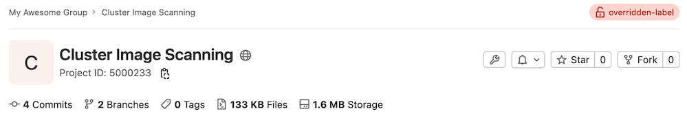

DETAILS:
**Tier:** Free, Premium, Ultimate
**Offering:** GitLab Self-Managed

> - [Moved](https://gitlab.com/gitlab-org/gitlab-foss/-/merge_requests/27056) from GitLab Premium to GitLab Free in 11.10.

In highly controlled environments, it may be necessary for access policy to be
controlled by an external service that permits access based on project
classification and user access. GitLab provides a way to check project
authorization with your own defined service.

After the external service is configured and enabled, when a project is
accessed, a request is made to the external service with the user information
and project classification label assigned to the project. When the service
replies with a known response, the result is cached for six hours.

If the external authorization is enabled, GitLab further blocks pages and
functionality that render cross-project data. That includes:

- Most pages under Dashboard (Activity, Milestones, Snippets, Assigned merge
  requests, Assigned issues, To-Do List).
- Under a specific group (Activity, Contribution analytics, Issues, Issue boards,
  Labels, Milestones, Merge requests).
- Global and Group search are disabled.

This is to prevent performing too many requests at once to the external
authorization service.

Whenever access is granted or denied this is logged in a log file called
`external-policy-access-control.log`. Read more about the logs GitLab keeps in
the [Linux package documentation](https://docs.gitlab.com/omnibus/settings/logs.html).

When using TLS Authentication with a self signed certificate, the CA certificate
needs to be trusted by the OpenSSL installation. When using GitLab installed
using the Linux package, learn to install a custom CA in the
[Linux package documentation](https://docs.gitlab.com/omnibus/settings/ssl/index.html).
Alternatively, learn where to install custom certificates by using
`openssl version -d`.

## Configuration

The external authorization service can be enabled by an administrator:

1. On the left sidebar, at the bottom, select **Admin**.
1. Select **Settings > General**.
1. Expand **External authorization**.
1. Complete the fields.
1. Select **Save changes**.

### Allow external authorization with deploy tokens and deploy keys

> - [Introduced](https://gitlab.com/gitlab-org/gitlab/-/issues/386656) in GitLab 15.9.
> - Deploy tokens no longer being able to access container or package registries [introduced](https://gitlab.com/gitlab-org/gitlab/-/issues/387721) in GitLab 16.0.

You can set your instance to allow external authorization for Git operations with
[deploy tokens](../../user/project/deploy_tokens/_index.md) or [deploy keys](../../user/project/deploy_keys/_index.md).

Prerequisites:

- You must be using classification labels without a service URL for external authorization.

To allow authorization with deploy tokens and keys:

1. On the left sidebar, at the bottom, select **Admin**.
1. Select **Settings > General**.
1. Expand **External authorization**, and:
   - Leave the service URL field empty.
   - Select **Allow deploy tokens and deploy keys to be used with external authorization**.
1. Select **Save changes**.

WARNING:
If you enable external authorization, deploy tokens cannot access container or package registries. If you use deploy tokens to access these registries, this measure breaks this use of these tokens. Disable external authorization to use tokens with container or package registries.

## How it works

When GitLab requests access, it sends a JSON POST request to the external
service with this body:

```json
{
  "user_identifier": "jane@acme.org",
  "project_classification_label": "project-label",
  "user_ldap_dn": "CN=Jane Doe,CN=admin,DC=acme",
  "identities": [
    { "provider": "ldap", "extern_uid": "CN=Jane Doe,CN=admin,DC=acme" },
    { "provider": "bitbucket", "extern_uid": "2435223452345" }
  ]
}
```

The `user_ldap_dn` is optional and is only sent when the user is signed in
through LDAP.

`identities` contains the details of all the identities associated with the
user. This is an empty array if there are no identities associated with the
user.

When the external authorization service responds with a status code 200, the
user is granted access. When the external service responds with a status code
401 or 403, the user is denied access. In any case, the request is cached for
six hours.

When denying access, a `reason` can be optionally specified in the JSON body:

```json
{
  "reason": "You are not allowed access to this project."
}
```

Any other status code than 200, 401 or 403 also deny access to the user, but the
response isn't cached.

If the service times out (after 500 ms), a message "External Policy Server did
not respond" is displayed.

## Classification labels

You can use your own classification label in the project's
**Settings > General > General project settings** page in the "Classification
label" box. When no classification label is specified on a project, the default
label defined in the [global settings](#configuration) is used.

On all project pages, in the upper-right corner, the label appears.



<!-- ## Troubleshooting

Include any troubleshooting steps that you can foresee. If you know beforehand what issues
one might have when setting this up, or when something is changed, or on upgrading, it's
important to describe those, too. Think of things that may go wrong and include them here.
This is important to minimize requests for support, and to avoid doc comments with
questions that you know someone might ask.

Each scenario can be a third-level heading, for example `### Getting error message X`.
If you have none to add when creating a doc, leave this section in place
but commented out to help encourage others to add to it in the future. -->
