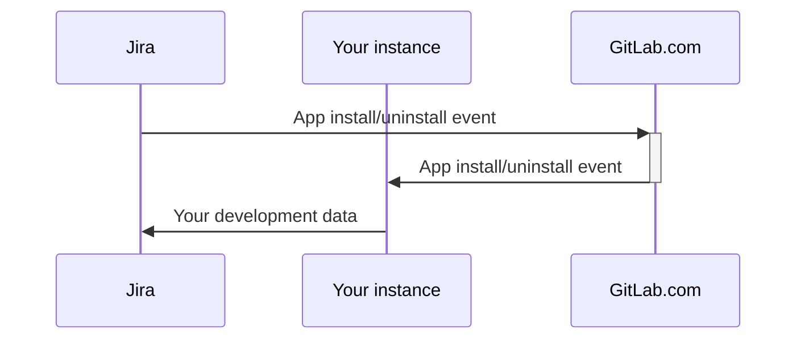

DETAILS:
**Tier:** Free, Premium, Ultimate
**Offering:** GitLab Self-Managed

NOTE:
This page contains administrator documentation for the GitLab for Jira Cloud app. For user documentation, see [GitLab for Jira Cloud app](../../integration/jira/connect-app.md).

With the [GitLab for Jira Cloud](https://marketplace.atlassian.com/apps/1221011/gitlab-com-for-jira-cloud?tab=overview&hosting=cloud) app, you can connect GitLab and Jira Cloud to sync development information in real time. You can view this information in the [Jira development panel](../../integration/jira/development_panel.md).

To set up the GitLab for Jira Cloud app on your GitLab Self-Managed instance, do one of the following:

- [Install the GitLab for Jira Cloud app from the Atlassian Marketplace](#install-the-gitlab-for-jira-cloud-app-from-the-atlassian-marketplace) (GitLab 15.7 and later).
- [Install the GitLab for Jira Cloud app manually](#install-the-gitlab-for-jira-cloud-app-manually).

<i class="fa fa-youtube-play youtube" aria-hidden="true"></i>
For an overview, see:

- [Installing the GitLab for Jira Cloud app from the Atlassian Marketplace for a GitLab Self-Managed instance](https://youtu.be/RnDw4PzmdW8?list=PL05JrBw4t0Koazgli_PmMQCER2pVH7vUT)
  <!-- Video published on 2024-10-30 -->
- [Installing the GitLab for Jira Cloud app manually for a GitLab Self-Managed instance](https://youtu.be/fs02xS8BElA?list=PL05JrBw4t0Koazgli_PmMQCER2pVH7vUT)
  <!-- Video published on 2024-10-30 -->

If you [install the GitLab for Jira Cloud app from the Atlassian Marketplace](#install-the-gitlab-for-jira-cloud-app-from-the-atlassian-marketplace),
you can use the [project toolchain](https://support.atlassian.com/jira-software-cloud/docs/what-is-the-connections-feature/) developed and maintained
by Atlassian to [link GitLab repositories to Jira projects](https://support.atlassian.com/jira-software-cloud/docs/link-repositories-to-a-project/#Link-repositories-using-the-toolchain-feature).
The project toolchain does not affect how development information is synced between GitLab and Jira Cloud.

For Jira Data Center or Jira Server, use the [Jira DVCS connector](../../integration/jira/dvcs/_index.md) developed and maintained by Atlassian.

## Set up OAuth authentication

Whether you want to install the GitLab for Jira Cloud app [from the Atlassian Marketplace](#install-the-gitlab-for-jira-cloud-app-from-the-atlassian-marketplace) or [manually](#install-the-gitlab-for-jira-cloud-app-manually), you must create an OAuth application.

To create an OAuth application on your GitLab Self-Managed instance:

1. On the left sidebar, at the bottom, select **Admin**.
1. Select **Applications**.
1. Select **New application**.
1. In **Redirect URI**:
   - If you're installing the app from the Atlassian Marketplace listing, enter `https://gitlab.com/-/jira_connect/oauth_callbacks`.
   - If you're installing the app manually, enter `<instance_url>/-/jira_connect/oauth_callbacks` and replace `<instance_url>` with the URL of your instance.
1. Clear the **Trusted** and **Confidential** checkboxes.

   NOTE:
   You must clear these checkboxes to avoid [errors](jira_cloud_app_troubleshooting.md#error-failed-to-sign-in-to-gitlab).

1. In **Scopes**, select the `api` checkbox only.
1. Select **Save application**.
1. Copy the **Application ID** value.
1. On the left sidebar, select **Settings > General**.
1. Expand **GitLab for Jira App**.
1. Paste the **Application ID** value into **Jira Connect Application ID**.
1. Select **Save changes**.

## Jira user requirements

> - Support for the `org-admins` group [introduced](https://gitlab.com/gitlab-org/gitlab/-/issues/420687) in GitLab 16.6.

In your [Atlassian organization](https://admin.atlassian.com), you must ensure that the Jira user that is used to set up the GitLab for Jira Cloud app is a member of
either:

- The Organization Administrators (`org-admins`) group. Newer Atlassian organizations are using
  [centralized user management](https://support.atlassian.com/user-management/docs/give-users-admin-permissions/#Centralized-user-management-content),
  which contains the `org-admins` group. Existing Atlassian organizations are being migrated to centralized user management.
  If available, you should use the `org-admins` group to indicate which Jira users can manage the GitLab for Jira Cloud app. Alternatively you can use the
  `site-admins` group.
- The Site Administrators (`site-admins`) group. The `site-admins` group was used under
  [original user management](https://support.atlassian.com/user-management/docs/give-users-admin-permissions/#Original-user-management-content).

If necessary:

1. [Create your preferred group](https://support.atlassian.com/user-management/docs/create-groups/).
1. [Edit the group](https://support.atlassian.com/user-management/docs/edit-a-group/) to add your Jira user as a member of it.
1. If you customized your global permissions in Jira, you might also need to grant the
   [`Browse users and groups` permission](https://confluence.atlassian.com/jirakb/unable-to-browse-for-users-and-groups-120521888.html) to the Jira user.

## Install the GitLab for Jira Cloud app from the Atlassian Marketplace

> - Introduced in GitLab 15.7.

You can use the official GitLab for Jira Cloud app from the Atlassian Marketplace with your GitLab Self-Managed instance.

With this method:

- GitLab.com [handles the install and uninstall lifecycle events](#gitlabcom-handling-of-app-lifecycle-events) sent from Jira Cloud and forwards them to your GitLab instance. All data from your GitLab Self-Managed instance is still sent directly to Jira Cloud.
- GitLab.com [handles branch creation links](#gitlabcom-handling-of-branch-creation) by redirecting them to your instance.
- With any version of GitLab prior to 17.2 it is not possible to create branches from Jira Cloud on GitLab Self-Managed instances.
  For more information, see [issue 391432](https://gitlab.com/gitlab-org/gitlab/-/issues/391432).

Alternatively, you might want to [install the GitLab for Jira Cloud app manually](#install-the-gitlab-for-jira-cloud-app-manually) if:

- Your instance does not meet the [prerequisites](#prerequisites).
- You do not want to use the official Atlassian Marketplace listing.
- You do not want GitLab.com to [handle the app lifecycle events](#gitlabcom-handling-of-app-lifecycle-events) or to know that your instance has installed the app.
- You do not want GitLab.com to [redirect branch creation links](#gitlabcom-handling-of-branch-creation) to your instance.

### Prerequisites

- The instance must be publicly available.
- The instance must be on GitLab version 15.7 or later.
- You must set up [OAuth authentication](#set-up-oauth-authentication).
- Your GitLab instance must use HTTPS _and_ your GitLab certificate must be publicly trusted or contain the full chain certificate.
- Your network configuration must allow:
  - Outbound connections from your GitLab Self-Managed instance to Jira Cloud ([Atlassian IP addresses](https://support.atlassian.com/organization-administration/docs/ip-addresses-and-domains-for-atlassian-cloud-products/#Outgoing-Connections))
  - Inbound and outbound connections between your GitLab Self-Managed instance and GitLab.com ([GitLab.com IP addresses](../../user/gitlab_com/_index.md#ip-range))
  - For instances behind a firewall:
    1. Set up an internet-facing [reverse proxy](#using-a-reverse-proxy) in front of your GitLab Self-Managed instance.
    1. Configure the reverse proxy to allow inbound connections from GitLab.com ([GitLab.com IP addresses](../../user/gitlab_com/_index.md#ip-range))
    1. Ensure your GitLab Self-Managed instance can still make the outbound connections described above.
- The Jira user that installs and configures the app must meet certain [requirements](#jira-user-requirements).

### Set up your instance

[Prerequisites](#prerequisites)

To set up your GitLab Self-Managed instance for the GitLab for Jira Cloud app in GitLab 15.7 and later:

1. On the left sidebar, at the bottom, select **Admin**.
1. Select **Settings > General**.
1. Expand **GitLab for Jira App**.
1. In **Jira Connect Proxy URL**, enter `https://gitlab.com`.
1. Select **Save changes**.

### Link your instance

[Prerequisites](#prerequisites)

To link your GitLab Self-Managed instance to the GitLab for Jira Cloud app:

1. Install the [GitLab for Jira Cloud app](https://marketplace.atlassian.com/apps/1221011/gitlab-com-for-jira-cloud?tab=overview&hosting=cloud).
1. [Configure the GitLab for Jira Cloud app](../../integration/jira/connect-app.md#configure-the-gitlab-for-jira-cloud-app).
1. Optional. [Check if Jira Cloud is now linked](#check-if-jira-cloud-is-linked).

#### Check if Jira Cloud is linked

You can use the [Rails console](../operations/rails_console.md#starting-a-rails-console-session)
to check if Jira Cloud is linked to:

- A specific group:

  ```ruby
  JiraConnectSubscription.where(namespace: Namespace.by_path('group/subgroup'))
  ```

- A specific project:

  ```ruby
  Project.find_by_full_path('path/to/project').jira_subscription_exists?
  ```

- Any group:

  ```ruby
  installation = JiraConnectInstallation.find_by_base_url("https://customer_name.atlassian.net")
  installation.subscriptions
  ```

## Install the GitLab for Jira Cloud app manually

WARNING:
In GitLab 17.5 and earlier, you might encounter an issue when you install the GitLab for Jira Cloud app manually.
For more information, see [issue 505372](https://gitlab.com/gitlab-org/gitlab/-/issues/505372).
This issue does not affect [installations from the Atlassian Marketplace](#install-the-gitlab-for-jira-cloud-app-from-the-atlassian-marketplace).

If you do not want to [use the official Atlassian Marketplace listing](#install-the-gitlab-for-jira-cloud-app-from-the-atlassian-marketplace),
install the GitLab for Jira Cloud app manually.

You must install each Jira Cloud app from a single location. Jira fetches a
[manifest file](https://developer.atlassian.com/cloud/jira/platform/connect-app-descriptor/)
from the location you provide. The manifest file describes the app to the system.

To support your GitLab Self-Managed instance with Jira Cloud, do one of the following:

- [Install the app in development mode](#install-the-app-in-development-mode).
- [Create an Atlassian Marketplace listing](#create-an-atlassian-marketplace-listing).

### Prerequisites

- The instance must be publicly available.
- You must set up [OAuth authentication](#set-up-oauth-authentication).
- Your network configuration must allow:
  - Inbound and outbound connections between your GitLab Self-Managed instance and Jira Cloud ([Atlassian IP addresses](https://support.atlassian.com/organization-administration/docs/ip-addresses-and-domains-for-atlassian-cloud-products/#Outgoing-Connections)).
  - For instances behind a firewall:
    1. Set up an internet-facing [reverse proxy](#using-a-reverse-proxy) in front of your GitLab Self-Managed instance.
    1. Configure the reverse proxy to allow inbound connections from Jira Cloud ([Atlassian IP addresses](https://support.atlassian.com/organization-administration/docs/ip-addresses-and-domains-for-atlassian-cloud-products/#Outgoing-Connections)).
    1. Ensure your GitLab Self-Managed instance can still make the outbound connections described above.
- The Jira user that installs and configures the app must meet certain [requirements](#jira-user-requirements).

### Set up your instance

[Prerequisites](#prerequisites-1)

To set up your GitLab Self-Managed instance for the GitLab for Jira Cloud app in GitLab 15.7 and later:

1. On the left sidebar, at the bottom, select **Admin**.
1. Select **Settings > General**.
1. Expand **GitLab for Jira App**.
1. In **Jira Connect Proxy URL**, ensure this is blank.
1. Select **Save changes**.

### Install the app in development mode

[Prerequisites](#prerequisites-1)

To configure your Jira instance so you can install apps from outside the Atlassian Marketplace:

1. Sign in to your Jira instance as an administrator.
1. [Enable development mode](https://developer.atlassian.com/cloud/jira/platform/getting-started-with-connect/#step-3--enable-development-mode-in-your-site)
   on your Jira instance.
1. Sign in to GitLab as an administrator.
1. [Install GitLab from your Jira instance](https://developer.atlassian.com/cloud/jira/platform/getting-started-with-connect/#step-3--install-and-test-your-app):
   1. On your Jira instance, go to **Apps > Manage Apps** and select **Upload app**.
   1. In **App descriptor URL**, provide the full URL to your manifest file based
      on your instance configuration.

      By default, your manifest file is located at `/-/jira_connect/app_descriptor.json`.
      For example, if your instance domain is `app.pet-store.cloud`,
      your manifest file is located at `https://app.pet-store.cloud/-/jira_connect/app_descriptor.json`.

   1. Select **Upload**.
   1. Select **Get started** to configure the integration.
1. [Disable development mode](https://developer.atlassian.com/cloud/jira/platform/getting-started-with-connect/#step-3--enable-development-mode-in-your-site)
   on your Jira instance.

In **Apps > Manage Apps**, **GitLab for Jira Cloud** is now visible.
You can also select **Get started** to [configure the GitLab for Jira Cloud app](../../integration/jira/connect-app.md#configure-the-gitlab-for-jira-cloud-app).

If a GitLab upgrade makes changes to the app descriptor, you must reinstall the app.

### Create an Atlassian Marketplace listing

[Prerequisites](#prerequisites-1)

If you do not want to [use development mode](#install-the-app-in-development-mode), you can create your own Atlassian Marketplace listing.
This way, you can install the GitLab for Jira Cloud app from the Atlassian Marketplace.

To create an Atlassian Marketplace listing:

1. Register as an Atlassian Marketplace vendor.
1. List your application with the application descriptor URL.
   - Your manifest file is located at: `https://your.domain/your-path/-/jira_connect/app_descriptor.json`
   - You should list your application as `private` because public
     applications can be viewed and installed by any user.
1. Generate test license tokens for your application.

Like the GitLab.com Marketplace listing, this method uses
[automatic updates](../../integration/jira/connect-app.md#update-the-gitlab-for-jira-cloud-app).

For more information about creating an Atlassian Marketplace listing, see the
[Atlassian documentation](https://developer.atlassian.com/platform/marketplace/listing-connect-apps/#create-your-marketplace-listing).

## Configure your GitLab instance to serve as a proxy

A GitLab instance can serve as a proxy for other GitLab instances through the GitLab for Jira Cloud app.
You might want to use a proxy if you're managing multiple GitLab instances but only want to
[manually install](#install-the-gitlab-for-jira-cloud-app-manually) the app once.

To configure your GitLab instance to serve as a proxy:

1. On the left sidebar, at the bottom, select **Admin**.
1. Select **Settings > General**.
1. Expand **GitLab for Jira App**.
1. Select **Enable public key storage**.
1. Select **Save changes**.
1. [Install the GitLab for Jira Cloud app manually](#install-the-gitlab-for-jira-cloud-app-manually).

Other GitLab instances that use the proxy must configure the following settings to point to the proxy instance:

- [**Jira Connect Proxy URL**](#set-up-your-instance)
- [**Redirect URI**](#set-up-oauth-authentication)

## Security considerations

The following security considerations are specific to administering the app.
For considerations related to using the app, see
[security considerations](../../integration/jira/connect-app.md#security-considerations).

### GitLab.com handling of app lifecycle events

When you [Install the GitLab for Jira Cloud app from the Atlassian Marketplace](#install-the-gitlab-for-jira-cloud-app-from-the-atlassian-marketplace),
GitLab.com receives [lifecycle events](https://developer.atlassian.com/cloud/jira/platform/connect-app-descriptor/#lifecycle) from Jira.
These events are limited to when the app is installed in or uninstalled from your Jira Project.

In the install event, GitLab.com receives a **secret token** from Jira.
GitLab.com stores this token encrypted with `AES256-GCM` to later verify incoming lifecycle events from Jira.

GitLab.com then forwards the token to your GitLab Self-Managed instance so your instance can authenticate its [requests to Jira](../../integration/jira/connect-app.md#data-sent-from-gitlab-to-jira) with the same token.
Your GitLab Self-Managed instance is also notified that the GitLab for Jira Cloud app has been installed or uninstalled.

When [data is sent](../../integration/jira/connect-app.md#data-sent-from-gitlab-to-jira) from your GitLab Self-Managed instance to the Jira development panel,
it is sent from your GitLab Self-Managed instance directly to Jira and not to GitLab.com.
GitLab.com does not use the token to access data in your Jira project.
Your GitLab Self-Managed instance uses the token to [access the data](../../integration/jira/connect-app.md#gitlab-access-to-jira).

For more information about the lifecycle events and payloads that GitLab.com receives,
see the [Atlassian documentation](https://developer.atlassian.com/cloud/jira/platform/connect-app-descriptor/#lifecycle).



### GitLab.com handling of branch creation

When you have
[installed the GitLab for Jira Cloud app from the Atlassian Marketplace](#install-the-gitlab-for-jira-cloud-app-from-the-atlassian-marketplace),
the links to create a branch from the development panel initially send the user to GitLab.com.

Jira sends GitLab.com a JWT token. GitLab.com handles the request by verifying the token and then redirects the request to your GitLab instance.

### Access to GitLab through OAuth

GitLab does not share an access token with Jira. However, users must authenticate through OAuth to configure the app.

An access token is retrieved through a [PKCE](https://www.rfc-editor.org/rfc/rfc7636) OAuth flow and stored only on the client side.
The app frontend that initializes the OAuth flow is a JavaScript application that's loaded from GitLab through an iframe on Jira.

The OAuth application must have the `api` scope, which grants complete read and write access to the API.
This access includes all groups and projects, the container registry, and the package registry.
However, the GitLab for Jira Cloud app only uses this access to:

- Display groups to link.
- Link groups.

Access through OAuth is only needed for the time a user configures the GitLab for Jira Cloud app. For more information, see [Access token expiration](../../integration/oauth_provider.md#access-token-expiration).

## Using a reverse proxy

You should avoid using a reverse proxy in front of your GitLab Self-Managed instance if possible.
Instead, consider using a public IP address and securing the domain with a firewall.

If you must use a reverse proxy for the GitLab for Jira Cloud app on a GitLab Self-Managed instance
that cannot be accessed directly from the internet, keep the following in mind:

- When you [install the GitLab for Jira Cloud app from the Atlassian Marketplace](#install-the-gitlab-for-jira-cloud-app-from-the-atlassian-marketplace),
  use a client with access to both the internal GitLab FQDN and the reverse proxy FQDN.
- When you [install the GitLab for Jira Cloud app manually](#install-the-gitlab-for-jira-cloud-app-manually),
  use the reverse proxy FQDN for **Redirect URI** to [set up OAuth authentication](#set-up-oauth-authentication).
- The reverse proxy must meet the prerequisites for your installation method:
  - [Prerequisites for connecting the GitLab for Jira Cloud app](#prerequisites).
  - [Prerequisites for installing the GitLab for Jira Cloud app manually](#prerequisites-1).
- The [Jira development panel](../../integration/jira/development_panel.md) might link
  to the internal GitLab FQDN or GitLab.com instead of the reverse proxy FQDN.
  For more information, see [issue 434085](https://gitlab.com/gitlab-org/gitlab/-/issues/434085).
- To secure the reverse proxy on the public internet, allow inbound traffic from
  [Atlassian IP addresses](https://support.atlassian.com/organization-administration/docs/ip-addresses-and-domains-for-atlassian-cloud-products/#Outgoing-Connections) only.
- If you use a rewrite or subfilter with your proxy, ensure the proxy
  does not rewrite or replace the `gitlab-jira-connect-${host}` app key.
  Otherwise, you might get a [`Failed to link group`](jira_cloud_app_troubleshooting.md#error-failed-to-link-group) error.
- When you select [**Create branch**](https://support.atlassian.com/jira-software-cloud/docs/view-development-information-for-an-issue/#Create-feature-branches) in the Jira development panel,
  you are redirected to the reverse proxy FQDN rather than the internal GitLab FQDN.

### External NGINX

This server block is an example of how to configure a reverse proxy for GitLab that works with Jira Cloud:

```json
server {
  listen *:80;
  server_name gitlab.mycompany.com;
  server_tokens off;
  location /.well-known/acme-challenge/ {
    root /var/www/;
  }
  location / {
    return 301 https://gitlab.mycompany.com:443$request_uri;
  }
}
server {
  listen *:443 ssl;
  server_tokens off;
  server_name gitlab.mycompany.com;
  ssl_certificate /etc/letsencrypt/live/gitlab.mycompany.com/fullchain.pem;
  ssl_certificate_key /etc/letsencrypt/live/gitlab.mycompany.com/privkey.pem;
  ssl_ciphers 'ECDHE-ECDSA-AES128-GCM-SHA256:ECDHE-RSA-AES128-GCM-SHA256:ECDHE-ECDSA-AES256-GCM-SHA384:ECDHE-RSA-AES256-GCM-SHA384:ECDHE-ECDSA-CHACHA20-POLY1305:ECDHE-RSA-CHACHA20-POLY1305:DHE-RSA-AES128-GCM-SHA256:DHE-RSA-AES256-GCM-SHA384';
  ssl_protocols  TLSv1.2 TLSv1.3;
  ssl_prefer_server_ciphers off;
  ssl_session_cache  shared:SSL:10m;
  ssl_session_tickets off;
  ssl_session_timeout  1d;
  access_log "/var/log/nginx/proxy_access.log";
  error_log "/var/log/nginx/proxy_error.log";
  location / {
    proxy_pass https://gitlab.internal;
    proxy_hide_header upgrade;
    proxy_set_header Host             gitlab.mycompany.com:443;
    proxy_set_header X-Real-IP        $remote_addr;
    proxy_set_header X-Forwarded-For  $proxy_add_x_forwarded_for;
  }
}
```

In this example:

- Replace `gitlab.mycompany.com` with the reverse proxy FQDN
  and `gitlab.internal` with the internal GitLab FQDN.
- Set `ssl_certificate` and `ssl_certificate_key` to a valid certificate
  (the example uses [Certbot](https://certbot.eff.org/)).
- Set the `Host` proxy header to the reverse proxy FQDN
  to ensure GitLab and Jira Cloud can connect successfully.

You must use the reverse proxy FQDN only to connect Jira Cloud to GitLab.
You must continue to access GitLab from the internal GitLab FQDN.
If you access GitLab from the reverse proxy FQDN, GitLab might not work as expected.
For more information, see [issue 21319](https://gitlab.com/gitlab-org/gitlab/-/issues/21319).

### Set an additional JWT audience

> - [Introduced](https://gitlab.com/gitlab-org/gitlab/-/issues/498587) in GitLab 17.7.

When GitLab receives a JWT token from Jira,
GitLab verifies the token by checking the JWT audience.
By default, the audience is derived from your internal GitLab FQDN.

In some reverse proxy configurations, you might have to set
the reverse proxy FQDN as an additional JWT audience.
To set an additional JWT audience:

1. On the left sidebar, at the bottom, select **Admin**.
1. Select **Settings > General**.
1. Expand **GitLab for Jira App**.
1. In **Jira Connect Additional Audience URL**, enter the additional audience
   (for example, `https://gitlab.mycompany.com`).
1. Select **Save changes**.
