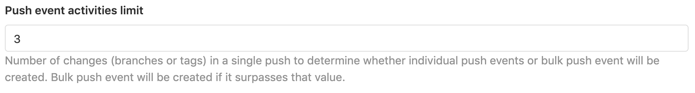

# Push event activities limit and bulk push events

DETAILS:
**Tier:** Free, Premium, Ultimate
**Offering:** Self-managed

> - [Introduced](https://gitlab.com/gitlab-org/gitlab/-/issues/31007) in GitLab 12.4.

Set the number of branches or tags to limit the number of single push events
allowed at once. If the number of events is greater than this, GitLab creates
bulk push event instead.

For example, if 4 branches are pushed and the limit is currently set to 3,
the activity feed displays:

With this feature, when a single push includes a lot of changes (for example, 1,000
branches), only 1 bulk push event is created instead of 1,000 push
events. This helps in maintaining good system performance and preventing spam on
the activity feed.

To modify this setting:

- In the Admin Area:
  1. On the left sidebar, at the bottom, select **Admin Area**.
  1. Select **Settings > Network**.
  1. Expand **Performance optimization**.
- Through the [Application settings API](../../api/settings.md#list-of-settings-that-can-be-accessed-via-api-calls)
  as `push_event_activities_limit`.

The default value is `3`, but the value can be greater than or equal to `0`. Setting this value to `0` does not disable throttling.

