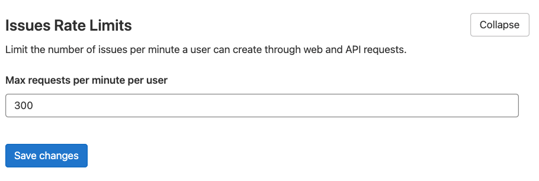

# Rate limits on issue and epic creation

DETAILS:
**Tier:** Free, Premium, Ultimate
**Offering:** Self-managed

> - [Introduced](https://gitlab.com/gitlab-org/gitlab/-/merge_requests/28129) in GitLab 12.10.

Rate limits control the pace at which new epics and issues can be created.
For example, if you set the limit to `300`, the
[Projects::IssuesController#create](https://gitlab.com/gitlab-org/gitlab/blob/master/app/controllers/projects/issues_controller.rb)
action blocks requests that exceed a rate of 300 per minute. Access to the endpoint is available after one minute.

## Set the rate limit

To limit the number of requests made to the issue and epic creation endpoints:

1. On the left sidebar, at the bottom, select **Admin Area**.
1. Select **Settings > Network**.
1. Expand **Issues Rate Limits**.
1. Under **Max requests per minute**, enter the new value.
1. Select **Save changes**.

The limit for [epic](../../user/group/epics/index.md) creation is the same limit applied to issue creation. The rate limit:

- Is applied independently per project and per user.
- Is not applied per IP address.
- Can be set to `0` to disable the rate limit.

Requests over the rate limit are logged into the `auth.log` file.
