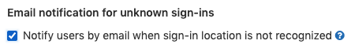

DETAILS:
**Tier:** Free, Premium, Ultimate
**Offering:** GitLab Self-Managed

You can use **Sign-in restrictions** to customize authentication restrictions for web interfaces as well as Git over HTTP(S).

## Settings

To access sign-in restriction settings:

1. On the left sidebar, at the bottom, select **Admin**.
1. Select **Settings > General**.
1. Expand the **Sign-in restrictions** section.

## Password authentication enabled

You can restrict the password authentication for web interface and Git over HTTP(S):

- **Web interface**: When this feature is disabled, the **Standard** sign-in tab
  is removed and an [external authentication provider](../auth/_index.md)
  must be used.
- **Git over HTTP(S)**: When this feature is disabled, a [personal access token](../../user/profile/personal_access_tokens.md)
  or LDAP password must be used to authenticate.

In the event of an external authentication provider outage, use the [GitLab Rails console](../operations/rails_console.md) to [re-enable the standard web sign-in form](#re-enable-standard-web-sign-in-form-in-rails-console). This configuration can also be changed over the [Application settings REST API](../../api/settings.md#update-application-settings) while authenticating with an administrator account's personal access token.

### Disable password authentication for users with an SSO identity

Even when password authentication is enabled, it may be desirable to restrict SSO users ability to sign in with a
password. Select **Disable password authentication for users with an SSO identity** to ensure SSO users always sign in
with their external provider.

This restricts password authentication for both the web interface and Git over HTTP(S).

## Admin Mode

If you're an administrator, you might want to work in GitLab without administrator access.
You could either create a separate user account that does not have
administrator access or use Admin Mode.

With Admin Mode, your account does not have administrator access by default.
You can continue to access groups and projects you're a member of. However, for administrative tasks,
you must authenticate (except for [certain features](#known-issues)).

When Admin Mode is enabled, it applies to all administrators on the instance.

When Admin Mode is enabled for an instance, administrators:

- Are allowed to access group and projects for which they are members.
- Cannot access the **Admin area**.

### Enable Admin Mode for your instance

Administrators can enable Admin Mode though the API, the Rails console, or the UI.

#### Use the API to enable Admin Mode

Make the following request to your instance endpoint:

```shell
curl --request PUT --header "PRIVATE-TOKEN:$ADMIN_TOKEN" "<gitlab.example.com>/api/v4/application/settings?admin_mode=true"
```

Replace `<gitlab.example.com>` with your instance URL.

For more information, see the [list of settings that can be accessed through API calls](../../api/settings.md).

#### Use the Rails console to enable Admin Mode

Open the [Rails console](../operations/rails_console.md) and run the following:

```ruby
::Gitlab::CurrentSettings.update!(admin_mode: true)
```

#### Use the UI to enable Admin Mode

To enable Admin Mode through the UI:

1. On the left sidebar, at the bottom, select **Admin**.
1. Select **Settings > General**.
1. Expand **Sign-in restrictions**.
1. Select **Enable Admin Mode**.
1. Select **Save changes**.

### Turn on Admin Mode for your session

To turn on Admin Mode for your current session and access potentially dangerous resources:

1. On the left sidebar, select your avatar.
1. Select **Enter Admin Mode**.
1. Try to access any part of the UI with `/admin` in the URL (which requires administrator access).

When Admin Mode status is disabled or turned off, administrators cannot access resources unless
they've been explicitly granted access. For example, administrators get a `404` error
if they try to open a private group or project, unless they are members of that group or project.

2FA should be enabled for administrators. 2FA, OmniAuth providers, and LDAP
authentication are supported by Admin Mode. Admin Mode status is stored in the current user session and remains active until either:

- It is explicitly disabled.
- It is disabled automatically after six hours.

### Check if your session has Admin Mode enabled

- [Introduced](https://gitlab.com/gitlab-org/gitlab/-/issues/438674) in GitLab 16.10 [with a flag](../feature_flags.md) named `show_admin_mode_within_active_sessions`. Disabled by default.
- [Enabled on GitLab.com](https://gitlab.com/gitlab-org/gitlab/-/issues/444188) in GitLab 16.10.
- [Generally available](https://gitlab.com/gitlab-org/gitlab/-/issues/438674) in GitLab 17.0. Feature flag `show_admin_mode_within_active_sessions` removed.

Go to your list of active sessions:

1. On the left sidebar, select your avatar.
1. Select **Edit profile**.
1. On the left sidebar, select **Active Sessions**.

Sessions which have Admin Mode turned on display the text **Signed in on `date of session` with Admin Mode**.

### Turn off Admin Mode for your session

To turn off Admin Mode for your current session:

1. On the left sidebar, select your avatar.
1. Select **Leave Admin Mode**.

### Known issues

Admin Mode times out after six hours, and you cannot change this timeout limit.

The following access methods are **not** protected by Admin Mode:

- Git client access (SSH using public keys or HTTPS using Personal access tokens).

In other words, administrators who are otherwise limited by Admin Mode can still use
Git clients without additional authentication steps.

To use the GitLab REST- or GraphQL API, administrators must [create a personal access token](../../user/profile/personal_access_tokens.md#create-a-personal-access-token) or [OAuth token](../../api/oauth2.md) with the [`admin_mode` scope](../../user/profile/personal_access_tokens.md#personal-access-token-scopes).

If an administrator with a personal access token with the `admin_mode` scope loses their administrator access, that user cannot access the API as an administrator even though they still have the token with the `admin_mode` scope.
For more information, see [epic 2158](https://gitlab.com/groups/gitlab-org/-/epics/2158).

Also, when GitLab Geo is enabled, you can't view the replication status of projects and designs while
on a secondary node. A fix is proposed when projects ([issue 367926](https://gitlab.com/gitlab-org/gitlab/-/issues/367926)) and designs ([issue 355660](https://gitlab.com/gitlab-org/gitlab/-/issues/355660)) move to the new Geo framework.

### Troubleshooting Admin Mode

If necessary, you can disable **Admin Mode** as an administrator by using one of these two methods:

- **API**:

  ```shell
  curl --request PUT --header "PRIVATE-TOKEN:$ADMIN_TOKEN" "<gitlab-url>/api/v4/application/settings?admin_mode=false"
  ```

- [**Rails console**](../operations/rails_console.md#starting-a-rails-console-session):

  ```ruby
  ::Gitlab::CurrentSettings.update!(admin_mode: false)
  ```

## Two-factor authentication

When this feature is enabled, all users must use the [two-factor authentication](../../user/profile/account/two_factor_authentication.md).

After the two-factor authentication is configured as mandatory, users are allowed
to skip forced configuration of two-factor authentication for the configurable grace
period in hours.


## Email notification for unknown sign-ins

When enabled, GitLab notifies users of sign-ins from unknown IP addresses or devices. For more information,
see [Email notification for unknown sign-ins](../../user/profile/notifications.md#notifications-for-unknown-sign-ins).



## Sign-in information

> - **Sign-in text** setting [deprecated](https://gitlab.com/gitlab-org/gitlab/-/issues/410885) in GitLab 17.0.

All users that are not logged in are redirected to the page represented by the configured
**Home page URL** if value is not empty.

All users are redirected to the page represented by the configured **Sign-out page URL**
after sign out if value is not empty.

To add a help message to the sign-in page, [customize your sign-in and register pages](../appearance.md#customize-your-sign-in-and-register-pages).

## Troubleshooting

### Re-enable standard web sign-in form in rails console

Re-enable the standard username and password-based sign-in form if it was disabled as a [Sign-in restriction](#password-authentication-enabled).

You can use this method through the [rails console](../operations/rails_console.md#starting-a-rails-console-session) when a configured external authentication provider (through SSO or an LDAP configuration) is facing an outage and direct sign-in access to GitLab is required.

```ruby
Gitlab::CurrentSettings.update!(password_authentication_enabled_for_web: true)
```
