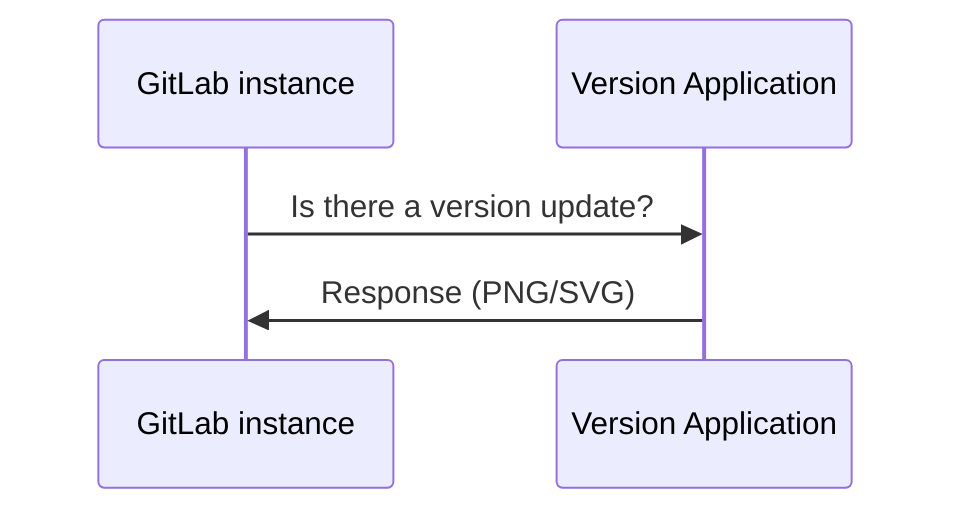

DETAILS:
**Tier:** Free, Premium, Ultimate
**Offering:** GitLab Self-Managed

GitLab Inc. periodically collects information about your instance in order
to perform various actions.

For free GitLab Self-Managed instances, all usage statistics are [opt-out](#enable-or-disable-service-ping).
For information about other tiers, see [Customer Product Usage Information](https://handbook.gitlab.com/handbook/legal/privacy/customer-product-usage-information/#service-ping-formerly-known-as-usage-ping).

## Service Ping

Service Ping is a process that collects and sends a weekly payload to GitLab Inc.
For more information, see the [Service Ping guide](../../development/internal_analytics/service_ping/_index.md). When Service Ping is enabled, GitLab gathers data from other instances and enables certain [instance-level analytics features](../../user/analytics/_index.md)
that are dependent on Service Ping.

### Why enable Service Ping?

The main purpose of Service Ping is to build a better GitLab. We collect data about how GitLab is used
to understand feature or stage adoption and usage. This data gives an insight into how GitLab adds
value and helps our team understand the reasons why people use GitLab, and with this knowledge we're able to make better product decisions.

There are several other benefits to enabling Service Ping:

- Analyze the users' activities over time of your GitLab installation.
- A [DevOps Score](../analytics/dev_ops_reports.md) to give you an overview of your entire instance's adoption of concurrent DevOps from planning to monitoring.
- More proactive support (assuming that our [Customer Success Managers (CSMs)](https://handbook.gitlab.com/job-families/sales/customer-success-management/) and support organization used the data to deliver more value).
- Insight and advice into how to get the most value out of your investment in GitLab.
- Reports that show how you compare against other similar organizations (anonymized), with specific advice and recommendations on how to improve your DevOps processes.
- Participation in our [Registration Features Program](#registration-features-program) to receive free paid features.

## Registration Features Program

In GitLab versions 14.1 and later, GitLab Free customers with a GitLab Self-Managed instance running
GitLab Enterprise Edition can receive paid features by registering with GitLab and sending us
activity data through Service Ping. Features introduced here do not remove the feature from its paid
tier. Instances on a paid tier are subject to our [Product Usage Data policy](https://handbook.gitlab.com/handbook/legal/privacy/customer-product-usage-information/) managed by [Cloud Licensing](https://about.gitlab.com/pricing/licensing-faq/cloud-licensing/).

NOTE:
Registration is not required for participation.

### Available features

In the following table, you can see:

- The features that are available with the Registration Features Program
- The GitLab version the features are available from

| Feature | Available in |
| ------ | ------ |
| [Email from GitLab](../email_from_gitlab.md)       |   GitLab 14.1 and later     |
| [Repository size limit](../settings/account_and_limit_settings.md#repository-size-limit) | GitLab 14.4 and later |
| [Group access restriction by IP address](../../user/group/access_and_permissions.md#restrict-group-access-by-ip-address) | GitLab 14.4 and later |
| [View description change history](../../user/discussions/_index.md#view-description-change-history) | GitLab 16.0 and later |
| [Maintenance mode](../maintenance_mode/_index.md) | GitLab 16.0 and later |
| [Configurable issue boards](../../user/project/issue_board.md#configurable-issue-boards) | GitLab 16.0 and later |
| [Coverage-guided fuzz testing](../../user/application_security/coverage_fuzzing/_index.md) | GitLab 16.0 and later |
| [Password complexity requirements](../settings/sign_up_restrictions.md#password-complexity-requirements) | GitLab 16.0 and later |
| [Group wikis](../../user/project/wiki/group.md) | GitLab 16.5 and later |
| [Issue analytics](../../user/group/issues_analytics/_index.md) | GitLab 16.5 and later |
| [Custom Text in Emails](../settings/email.md#custom-additional-text) | GitLab 16.5 and later |
| [Contribution analytics](../../user/group/contribution_analytics/_index.md) | GitLab 16.5 and later |
| [Group file templates](../../user/group/manage.md#group-file-templates) | GitLab 16.6 and later |
| [Group webhooks](../../user/project/integrations/webhooks.md#group-webhooks) | GitLab 16.6 and later |
| [Service Level Agreement countdown timer](../../operations/incident_management/incidents.md#service-level-agreement-countdown-timer) | GitLab 16.6 and later |
| [Lock project membership to group](../../user/group/access_and_permissions.md#prevent-members-from-being-added-to-projects-in-a-group) | GitLab 16.6 and later |
| [Users and permissions report](../admin_area.md#user-permission-export) | GitLab 16.6 and later |
| [Advanced search](../../user/search/advanced_search.md) | GitLab 16.6 and later |
| [DevOps Adoption](../../user/group/devops_adoption/_index.md) | GitLab 16.6 and later |
| [Сross-project pipelines with artifacts dependencies](../../ci/yaml/_index.md#needsproject) | GitLab 16.7 and later |
| [Feature flag related issues](../../operations/feature_flags.md#feature-flag-related-issues) | GitLab 16.7 and later |
| [Merged results pipelines](../../ci/pipelines/merged_results_pipelines.md) | GitLab 16.7 and later |
| [CI/CD for external repositories](../../ci/ci_cd_for_external_repos/_index.md) | GitLab 16.7 and later |
| [CI/CD for GitHub](../../ci/ci_cd_for_external_repos/github_integration.md) | GitLab 16.7 and later |

### Enable registration features

1. Sign in as a user with administrator access.
1. On the left sidebar, at the bottom, select **Admin**.
1. Select **Settings > Metrics and profiling**.
1. Expand the **Usage statistics** section.
1. If not enabled, select the **Enable Service Ping** checkbox.
1. Select the **Enable Registration Features** checkbox.
1. Select **Save changes**.

## Version check

If enabled, version check informs you if a new version is available and the
importance of it through a status. The status displays on the help pages (`/help`)
for all authenticated users, and on the **Admin** area pages. The statuses are:

- Green: You are running the latest version of GitLab.
- Orange: An updated version of GitLab is available.
- Red: The version of GitLab you are running is vulnerable. You should install
  the latest version with security fixes as soon as possible.


### Enable or disable version check

1. On the left sidebar, at the bottom, select **Admin**.
1. Select **Settings > Metrics and profiling**.
1. Expand **Usage statistics**.
1. Select or clear the **Enable version check** checkbox.
1. Select **Save changes**.

### Request flow example

The following example shows a basic request/response flow between your
instance and the GitLab Version Application:



## Configure your network

To send usage statistics to GitLab Inc., you must allow network traffic from your
GitLab instance to the host `version.gitlab.com` on port `443`.

If your GitLab instance is behind a proxy, set the appropriate
[proxy configuration variables](https://docs.gitlab.com/omnibus/settings/environment-variables.html).

## Enable or disable Service Ping

NOTE:
Whether you can disable Service Ping completely depends on the instance's tier and the specific license.
For more information, see [Customer Product Usage Information](https://handbook.gitlab.com/handbook/legal/privacy/customer-product-usage-information/#service-ping-formerly-known-as-usage-ping).
Service Ping settings only control whether the data is being shared with GitLab, or limited to only internal use by the instance.
Even if you disable Service Ping, the `gitlab_service_ping_worker` background job still periodically generates a Service Ping payload for your instance.
The payload is available in the [Metrics and profiling](#manually-upload-service-ping-payload) admin section.

### Through the UI

To enable or disable Service Ping:

1. On the left sidebar, at the bottom, select **Admin**.
1. Select **Settings > Metrics and profiling**.
1. Expand **Usage statistics**.
1. Select or clear the **Enable Service Ping** checkbox.
1. Select **Save changes**.

### Through the configuration file

To disable Service Ping and prevent it from being configured in the future through
the **Admin** area.

::Tabs

:::TabTitle Linux package (Omnibus)

1. Edit `/etc/gitlab/gitlab.rb`:

   ```ruby
   gitlab_rails['usage_ping_enabled'] = false
   ```

1. Reconfigure GitLab:

   ```shell
   sudo gitlab-ctl reconfigure
   ```

:::TabTitle Self-compiled (source)

1. Edit `/home/git/gitlab/config/gitlab.yml`:

   ```yaml
   production: &base
     # ...
     gitlab:
       # ...
       usage_ping_enabled: false
   ```

1. Restart GitLab:

   ```shell
   sudo service gitlab restart
   ```

::EndTabs

## Enable or disable optional data in Service Ping

GitLab differentiates between operational and optional collected data.
For more information, see [Customer product usage information](https://handbook.gitlab.com/handbook/legal/privacy/customer-product-usage-information/#service-ping-formerly-known-as-usage-ping).

### Through the UI

To enable or disable optional data in Service Ping:

1. In the left sidebar, at the bottom, select **Admin**.
1. Go to **Settings > Metrics and Profiling**.
1. Expand the **Usage Statistics** section.
1. To enable optional data, select the **Include optional data in Service Ping** checkbox. To disable it, clear the box.
1. Select **Save Changes**.

### Through the configuration file

::Tabs

:::TabTitle Linux package (Omnibus)

1. Edit `/etc/gitlab/gitlab.rb`:

   ```ruby
   gitlab_rails['include_optional_metrics_in_service_ping'] = false
   ```

1. Reconfigure GitLab:

   ```shell
   sudo gitlab-ctl reconfigure
   ```

:::TabTitle Self-compiled (source)

1. Edit `/home/git/gitlab/config/gitlab.yml`:

   ```yaml
   production: &base
     # ...
     gitlab:
       # ...
       include_optional_metrics_in_service_ping: false
   ```

1. Restart GitLab:

   ```shell
   sudo service gitlab restart
   ```

::EndTabs

## Access the Service Ping payload

You can access the exact JSON payload sent to GitLab Inc. in the **Admin** area or through the API.
See an [example Service Ping payload](../../development/internal_analytics/service_ping/_index.md#example-service-ping-payload).

### In the UI

1. Sign in as a user with administrator access.
1. On the left sidebar, at the bottom, select **Admin**.
1. Select **Settings > Metrics and profiling > Usage statistics**.
1. Select **Preview payload**.

### Through the API

See [service ping API documentation](../../api/usage_data.md).

## Manually upload Service Ping payload

You can upload the Service Ping payload to GitLab even if your instance doesn't have internet access,
or if the Service Ping [cron job](../../development/internal_analytics/service_ping/_index.md#how-service-ping-works) is not enabled.

To upload the payload manually:

1. Sign in as a user with administrator access.
1. On the left sidebar, at the bottom, select **Admin**.
1. Select **Settings > Metrics and profiling > Usage statistics**.
1. Select **Download payload**.
1. Save the JSON file.
1. Visit [Service usage data center](https://version.gitlab.com/usage_data/new).
1. Select **Choose file**, then select the JSON file that contains the downloaded payload.
1. Select **Upload**.

The uploaded file is encrypted and sent using secure HTTPS protocol. HTTPS creates a secure
communication channel between web browser and the server, and protects transmitted data against man-in-the-middle attacks.

If there are problems with the manual upload:

1. Open a confidential issue in the [security fork of version app project](https://gitlab.com/gitlab-org/security/version.gitlab.com).
1. Attach the JSON payload if possible.
1. Tag `@gitlab-org/analytics-section/analytics-instrumentation` who will triage the issue.

<!-- ## Troubleshooting

Include any troubleshooting steps that you can foresee. If you know beforehand what issues
one might have when setting this up, or when something is changed, or on upgrading, it's
important to describe those, too. Think of things that may go wrong and include them here.
This is important to minimize requests for support, and to avoid doc comments with
questions that you know someone might ask.

Each scenario can be a third-level heading, for example `### Getting error message X`.
If you have none to add when creating a doc, leave this section in place
but commented out to help encourage others to add to it in the future. -->
